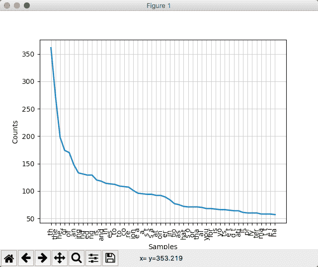
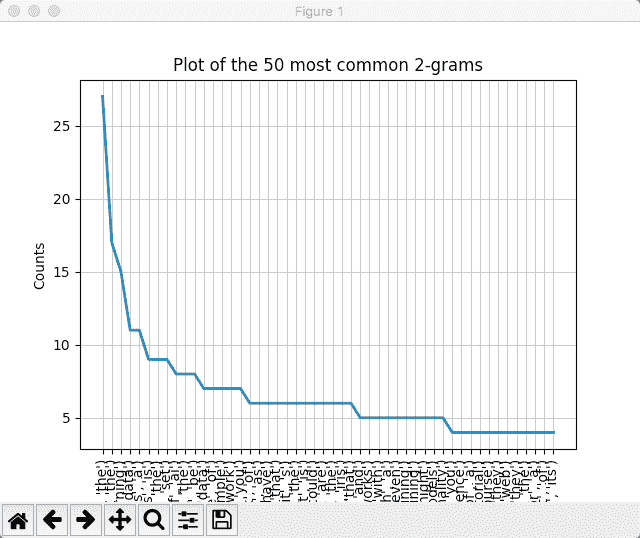
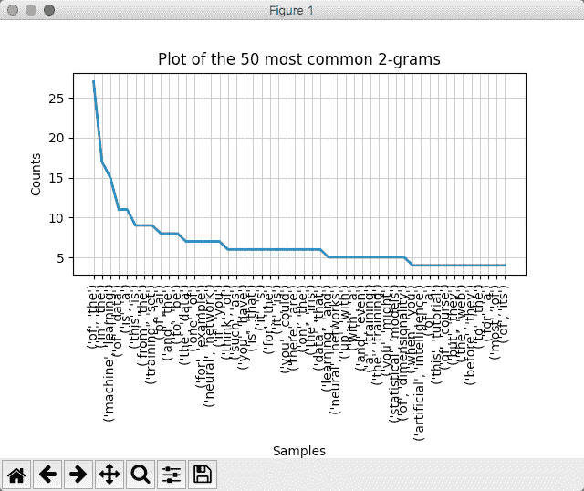
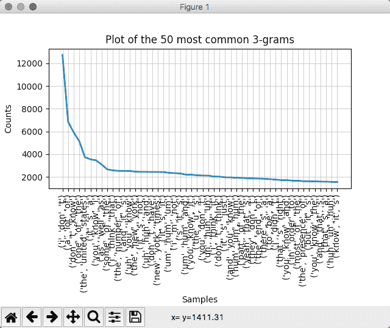
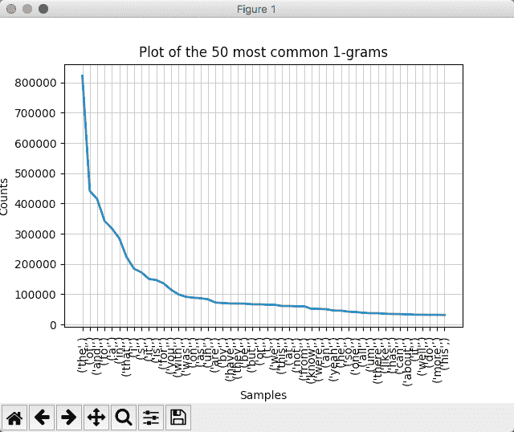
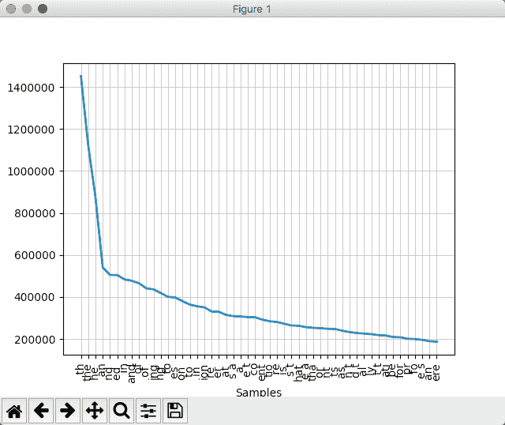
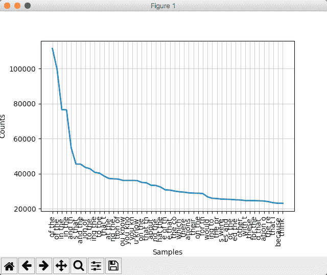

# 各种实用应用程序中的词语分析和 N 元模型

> 原文：[`developer.ibm.com/zh/articles/cc-patterns-artificial-intelligence-part2/`](https://developer.ibm.com/zh/articles/cc-patterns-artificial-intelligence-part2/)

如何使 AI 应用程序不再只是非常复杂的归档系统？让这些应用程序能够根据其在输入数据中所识别的模式来执行操作，根据基于此类模式构建的模型来生成输出。

在[第 1 部分](https://www.ibm.com/developerworks/cn/cognitive/library/cc-patterns-artificial-intelligence-part1/index.html)，我以自然语言为例，向您展示了如何计算 N 元模型、字母序列和其他文本字符的频率矩阵。在本教程中，我将带您深入探索 N 元模型和 N 元模型统计信息的奇妙世界。

## 使用统计工具

Python 因其数据科学和统计工具而闻名于世。先前教程中使用的自然语言工具包库 (NLTK) 提供了一些实用工具，用于处理 matplotlib 这一数据图形可视化库。为了向您提供各种可能性的简要概览，以下列表从文本主体生成了 50 种最常用的字母/空格 N 元模型图。针对图形输出而添加或修改的行已突出显示。

##### plot_ngrams.py

```
import sys
import pprint

from nltk.util import ngrams
from nltk.tokenize import RegexpTokenizer
from nltk.probability import FreqDist

#Set up a tokenizer that captures only lowercase letters and spaces
#This requires that input has been preprocessed to lowercase all letters
TOKENIZER = RegexpTokenizer("[a-z ]")

def count_ngrams(input_fp, frequencies, order, buffer_size=1024):
    '''Read the text content of a file and keep a running count of how often
    each bigram (sequence of two) characters appears.

    Arguments:
        input_fp -- file pointer with input text
        frequencies -- mapping from each bigram to its counted frequency
        buffer_size -- incremental quantity of text to be read at a time,
            in bytes (1024 if not otherwise specified)

    Returns:
        nothing
    '''
    #Read the first chunk of text, and set all letters to lowercase
    text = input_fp.read(buffer_size).lower()
    #Loop over the file while there is text to read
    while text:
        #This step is needed to collapse runs of space characters into one
        text = ' '.join(text.split())
        spans = TOKENIZER.span_tokenize(text)
        tokens = (text[begin : end] for (begin, end) in spans)
        for bigram in ngrams(tokens, order):
            #Increment the count for the bigram. Automatically handles any
            #bigram not seen before. The join expression turns 2 separate
            #single-character strings into one 2-character string
            frequencies[''.join(bigram)] += 1
        #Read the next chunk of text, and set all letters to lowercase
        text = input_fp.read(buffer_size).lower()

    return

if __name__ == '__main__':
    #Initialize the frequency distribution, a Subclass of collections.Counter
    frequencies = FreqDist()
    #The order of the ngrams is the first command line argument
    ngram_order = int(sys.argv[1])
    #Pull the input data from the console
    count_ngrams(sys.stdin, frequencies, ngram_order)
    #Generate pop-up window with frequency plot of 50 most common N-grams
    frequencies.plot(50) 
```

您需要安装 matplotlib 才能运行此代码。

```
pip install matplotlib 
```

随后您可运行此列表，假定您正在使用带有 GUI 的系统，例如，Windows、Mac 或 Linux 桌面。

```
python plot_ngrams.py 3 < bigbraineddata1.txt 
```

此代码会生成一个包含图表的弹出窗口，如下所示。



浏览 NLTK 文档以获取与数据工具集成的更多示例，浏览 matplotlib 文档以深入了解这一强大的多用途绘图工具包。您也可以查看 IBM Developer 教程 [Introduction to data-science tools in Bluemix – Part 4](https://developer.ibm.com/recipes/tutorials/introduction-to-data-science-tools-in-bluemix-part-4/)，这虽然属于一个系列教程中的一部分，但您也可以单独查看此文档。

## 词语的 N 元模型

到目前为止，我将 N 元模型的使用范围限制于字母序列。正如您将在下一个教程中看到的，通过此类 N 元模型可获得许多有趣的成果，但许多应用程序仅聚焦整个词语的 N 元模型。这不需要对我已介绍过的各种方法进行过多调整。以下列表与 plot_ngrams.py 相似，但它适用于处理词语，而不是单个字符。与此更改相关的行已突出显示。

##### plot_word_ngrams.py

```
import sys
import pprint

from nltk.util import ngrams
from nltk.tokenize import RegexpTokenizer
from nltk.probability import FreqDist

#Set up a tokenizer that only captures words
#Requires that input has been preprocessed to lowercase all letters
TOKENIZER = RegexpTokenizer("[a-z]+")

def count_ngrams(input_fp, frequencies, order, buffer_size=1024):
    '''Read the text content of a file and keep a running count of how often
    each bigram (sequence of two) characters appears.

    Arguments:
        input_fp -- file pointer with input text
        frequencies -- mapping from each bigram to its counted frequency
        buffer_size -- incremental quantity of text to be read at a time,
            in bytes (1024 if not otherwise specified)

    Returns:
        nothing
    '''
    #Read the first chunk of text, and set all letters to lowercase
    text = input_fp.read(buffer_size).lower()
    #Loop over the file while there is text to read
    while text:
        spans = TOKENIZER.span_tokenize(text)
        tokens = (text[begin : end] for (begin, end) in spans)
        for bigram in ngrams(tokens, order):
            #Increment the count for the bigram. Automatically handles any
            #bigram not seen before.
            frequencies[bigram] += 1
        #Read the next chunk of text, and set all letters to lowercase
        text = input_fp.read(buffer_size).lower()

    return

if __name__ == '__main__':
    #Initialize the frequency distribution, a Subclass of collections.Counter
    frequencies = FreqDist()
    #The order of the ngrams is the first command line argument
    ngram_order = int(sys.argv[1])
    #Pull the input data from the console
    count_ngrams(sys.stdin, frequencies, ngram_order)
    #Generate pop-up window with frequency plot of 50 most common N-grams
    plot_width = 50
    title = 'Plot of the {} most common {}-grams'.format(plot_width, ngram_order)
    frequencies.plot(plot_width, title=title) 
```

让我们来执行一下，从二元模型开始。

```
python plot_word_ngrams.py 2 < bigbraineddata1.txt 
```

生成的图表如下所示。



### 调整图表的图形输出

不幸的是，图表的水平轴上的项目标签被切断了。可以采用几种方法在代码中对此进行调整，但坦白说，NLTK 会导致这些方法变得更为繁琐。对于本教程，我们将使用绘图窗口的交互功能。

请注意上图底部的图标行。从右数第二个图标是用于绘图设置的图标。单击此图标将会显示一系列滑块，其中之一用于调整底部间距。将此滑块滑至右侧，可显示更多水平轴标签。您可能还需要调整总体窗口大小，避免主图被过度挤压变形。完成此类调整后，将显示以下。



用于对 N 元模型进行定界的括号、问号和逗号是由于存储方式所导致的，分析时可忽略不计。意料之中的是，“of the”是最常用的单词二元模型，出现 27 次。另一方面，有 11 个二元模型出现达三次。大部分出现频率较高的二元模型都是不太重要的常见词的组合，但值得注意的是，“machine learning”条目位于第三位。这凸显了我使用的是小型专业化语料库的问题。

## 我们需要更大的语料库

切换到单词 N 元模型确实凸显了伴随小型选定语料库出现的一些统计问题，因此，是时候该向外扩大范围以涵盖更全面的内容了。按维基百科的描述，美国国家语料库 (ANC) 是“美式英语的文本语料库，包含从 1990 年以来生成的 2200 万个书面和口头数据词语。当前，ANC 包含各种类型，包括英国国家语料库等先前语料库中未包含的电子邮件、推文和 Web 数据等新兴类型。”

ANC 还包含实用的注释（例如，词性），但我们目前不需要这些注释。这里还有一个子集，即[开放式美国国家语料库 (OANC)](http://www.anc.org/data/oanc/)，其中包含 1500 万个当代美式英语单词，可供开放使用且不受限制。我下载了 OANC 1.0.1，这是一个大型 zip 归档，其中带有包含注释内容的 XML 文件和纯文本文件。在处理时，我最先仅从 zip 中抽取文本文件。

```
unzip /Users/uche/Downloads/OANC-1.0.1-UTF8.zip "*.txt" -x "*/license.txt" "*/readme.txt" 
```

这样会在 `OANC` 下生成含文本文件的目录结构。我使用以下 Linux 命令（也适用于 Mac）将这些内容连接成一个大型的 97 MB 文本文件。

```
find OANC -name "*.txt" -exec cat {} \; > oanc.txt 
```

## 来自 OANC 的单词 N 元模型

现在，我们可以查看一些从统计角度更实用的单词 N 元模型频率图。

```
python plot_word_ngrams.py 2 < oanc.txt 
```

以下即是经过视觉调整后生成的图表。


优胜者仍然是“of the”，出现约 100,000 次，但前 4 名中的其他 3 个是非常合理的。您可能会注意到在排名前十的结果中有一些异常，尤其是“is s”和“don t”。这是由于我们采用简化的方法对单词加以标记。任何非字母字符都作为单词分隔符来处理，包括撇号。这意味着缩写形式被分割为多个部分，并且这种分割方式不会将其恢复为原始的单词组合。

我们可以通过更智慧的分词器来解决此问题，或许可采用专门将撇号保留为单词一部分的分词器。出于多种原因，这处理起来比较棘手，例如，在某些 ASCII 文本表示法中，撇号同样用作为单引号。此类问题的处理超出本教程的范畴。

让我们来看一下来自 OANC 的三元词。

```
python plot_word_ngrams.py 3 < oanc.txt 
```

以下即是经过视觉调整后生成的图表。



这次收缩变形直接显示在顶部，有超过 12,000 个“i don t”的实例。毫无疑问，在美式英语语料库的三元模型中，“the united states”占主导地位，而其中每个单词的出现频率与之相比则较低。

为了更加完整，以下是来自 OANC 的一元模型，基本上只是简单的单词频率计数。

```
python plot_word_ngrams.py 1 < oanc.txt 
```

以下即是经过视觉调整后生成的图表。



我在本教程的 GitHub 存储库中包含了 oanc.txt 的一个 gzip 文件，以便您自行使用。

## 来自 OANC 的字母 N 元模型

当然，既然有了更丰富的语料库，那么了解字母 N 元模型也是很有趣的。首先来看看字母三元模型。

```
python plot_ngrams.py 3 < oanc.txt 
```



这里的结果令人有些惊讶。让我们试试看排第 5 位顺序的 N 元模型。

```
python plot_ngrams.py 5 < oanc.txt 
```


常见词占主导地位，像以简短的常见词结尾的“s”复数单词之类的模式同样也占主导地位。

```
python plot_ngrams.py 7 < oanc.txt 
```



此图表需要较长时间才能生成，它当然会占用一定量的可用内存。但能够看到与明智表达方式相关的术语以及采用不同空格配置的典型简短单词组合，还是很值得的。在最后，我们看到了“because”和“think”。

## N 元模型在世间的应用

N 元模型源于我们开始思考机器如何才能生成熟悉的语言，但这些模型有很多用途。例如，您可以尝试通过比较 N 元模型统计信息对语言进行分类。对于以“sz”序列为特征的 N 元模型，捷克语包含的频率比英语更高，而对于以“gb”和“kp”序列为特征的 N 元模型，我的母语伊博语则包含很高的频率。通过此类统计，甚至还可以分析英式英语拼写与美式英语拼写等方言上的差异。您甚至可以使用 N 元模型统计来识别特定作者，但这个任务的困难程度要高得多。

许多研究人员（包括 Google 的相关团队）都在使用从各种来源提取的各语种的 N 元模型统计信息。Google Books Ngram Viewer 衍生自 Google 图书中的海量资料。它具有一个复杂的查询引擎，可根据源书籍出版日期查看单词的 N 元模型统计在多年间的演变过程。

## 结束语

通过观察单词间的关系，可以提供与聚焦字母不同的视角，但这两种方法都很有用，可应用于不同的场景。

在本教程中，我们使用了经过适当组织的简明扼要的语言主体，这是非常重要的一步。ANC 是诸多选择中的一个选择，这包括除英语之外的许多语言的语料库。维基百科上提供了一份[实用清单](https://en.wikipedia.org/wiki/List_of_text_corpora)。

既然您已了解了如何在字母和单词级别编译文本统计信息，现在就可以开始学习如何将其用于生成语言。我们将在本系列教程接下来的最终教程中探讨此问题。

本文翻译自：[Word analysis and N-grams in a variety of practical applications](https://developer.ibm.com/articles/cc-patterns-artificial-intelligence-part2/)（2018-04-18）