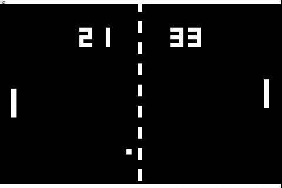
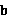

# 深入浅出介绍策略梯度

> 原文：[`developer.ibm.com/zh/articles/ba-lo-deep-introduce-policy-gradient/`](https://developer.ibm.com/zh/articles/ba-lo-deep-introduce-policy-gradient/)

## 前言

强化学习 (Reinforcement Learning) 是一类用于复杂场景的机器学习算法，被广泛应用在机器控制任务中。近几年来，随着神经网络的重新兴起，强化学习也被逐渐应用在一些新的领域，比如自动驾驶，计算机视觉等。Alpha GO 战胜人类棋手标志着机器学习特别是强化学习正在逐渐成熟，成为能够推动人工智能取得突破的重要方向之一。本文旨在介绍强化学习中策略梯度（Policy Gradient）方法的基本原理及相关概念，并着重介绍作者在学习过程中遇到的一些难点，如目标函数和实现技术。

## 强化学习

Alpha GO (图 1)战胜人类让大众惊叹于人工智能的突飞猛进的同时，也让人不禁好奇机器学习到底是如何实现了对人类的超越，一方面传统的监督式学习 (Supervised learning) 的效果受限于训练数据，另一方面采用简单穷举的方式会遇到硬件的限制（围棋的状态组合空间  达到了宇宙粒子的数量级）。其实强大的 Alpha GO 的一个秘密武器就是今天的主角：强化学习。强化学习诞生于上世纪 80 年代，最初应用于制造业，特别是工业机器人的自动控制（达到类似 Boston Dynamics 的机器狗 (图 1) 的姿态控制），近年来随着其他机器方法的成熟开始应用于更加”智能”的场景，除了大名鼎鼎的 Alpha GO，google deepmind 团队还应用强化学习实现了计算机自主学习玩 Atari 系列电子游戏并超越了人类玩家的水平。

##### 图 1\. Alpha GO 和 Boston Dynamics 的机器狗


强化学习是机器学习的一个分支，但是它与我们常见监督式学习不太一样。从学习方式上讲强化学习更加接近人类的学习，记得作者小时候玩新的电子游戏的时候，虽然看不懂屏幕的提示，但是经过自己的摸索也能掌握游戏方法，这个摸索的过程其实就是通过试错逐渐了解游戏规则的学习过程。同样，强化学习也是通过一系列的尝试并根据得到的反馈不断调整自己的行为来学习陌生的对象。

强化学习它包括如图 2 所示的几个部分，我们以 Atari PONG（图 3）游戏举例：

##### 图 2\. 强化学习的基本构成


##### 图 3\. Atari PONG



**主体** （Agent）：指能够通过动作与环境交互的对象，强化学习中主体通常是运行中的算法，比如在游戏中的主体是用于控制本方球拍的算法

**环境** （Environment）：指主体动作作用的对象， 比如游戏本身。

**动作** （Action）: 指所有可能作用于环境上的操作，比如游戏中算法控制球拍上下移动。

**状态** （State）: 指可被主体感知的关于环境的信息，比如游戏中屏幕显示的球和球拍的位置以及移动方向和速度信息。

**奖励** （Reward）: 指由环境回馈给主体的描述上一个动作效果的信息，比如游戏中球拍动作导致双方的得分变化。

强化学习的过程是一个通过和环境交互获得反馈，再根据反馈调整动作以期使总奖励最大化的过程，这个是一个多步 (multi timestep) 的交互的过程，每一步交互都会影响其后的所有步骤。强化学习中的一次交互是指主体对环境施加一个动作，环境的状态发生改变并且回馈给主体一个奖励（奖励既可以是正向的，如本方得分增加；也可以是负向的，如对方得分增加）。强化学习的目标就是寻找一个最优的策略使得整个学习过程（从开始状态到终结状态）获得的奖励最大化。

在实现上，强化学习是一个通过多个轮次逐渐优化算法的参数从而增强学习效果的过程，每个轮次包含两部分：前向反馈（feed forward）和反向传播（back propagation）。处于初始状态的主体根据算法的当前参数生成动作作用于环境，环境返回给主体新的状态和对动作的奖励，在轮次结束后算法通过汇总所有在本轮收集到的反馈调整算法的参数开始下一轮的学习，直到学习的效果不再增强。

强化学习包括了一系列不同的算法（如图 4），其中比较常见的是基于值（Value-based）的方法和基于策略（Policy-based）的方法。这两类方法各有特点，适用于解决不同的问题。一般来说，基于值的方法适用于比较简单（状态空间比较小）的问题，它有较高的数据利用率并且能稳定收敛；而基于策略的方法适用于复杂问题，但是高方差是这类方法会存在的一个比较明显的问题。本文介绍的策略梯度就是一种最基本的基于策略的方法，我们下面会从原理、实现和改进这几方面进行介绍。

##### 图 4\. 强化学习的分类


## 策略梯度

### 策略梯度的基本原理

基于值的方法一般是确定性的，给定一个状态就能计算出每种可能动作的奖励（确定值），但这种确定性的方法恰恰无法处理一些现实的问题，比如玩 100 把石头剪刀布的游戏，最好的解法是随机的使用石头、剪刀和布并尽量保证这三种手势出现的概率一样，因为任何一种手势的概率高于其他手势都会被对手注意到并使用相应的手势赢得游戏。

##### 图 5\. 迷宫


再比如，假设我们需要经过图 5 迷宫中的一些方格拿到钱袋，采用基于值的方法在确定的状态下将得到确定的反馈，因此在使用这种方法决定灰色（状态）方格的下一步动作（左或右）是确定的，即总是向左或向右，而这可能会导致落入错误的循环中（左一白格和左二灰格）而无法拿到钱袋。也许有人要质疑这时的状态不应用一个方格而是迷宫中的所有方格表示，但是考虑如果我们身处一个巨大的迷宫无法获得整个迷宫的布局信息，如果在相同的可感知的状态下总是做出固定的判断的话，仍然会导致在某个局部原地打转。事实上很多实际问题特别是对弈类问题都有类似的特征，即需要在貌似相同的状态下应用不同的动作，例如围棋中的开局。

另外，状态数量也是使用基于值的方法的一个限制因素，因为基于值的方法需要保存状态-动作的对应关系，因此很多现实问题（例如机器人控制和自动驾驶都是连续动作空间）都因为巨量的状态而无法计算。

策略梯度正是为了解决上面的两个问题产生的，而它的秘密武器就是随机（Stochastic）。首先随机能提供非确定的结果，但这种非确定的结果并不是完全的随意而是服从某种概率分布的随机，策略梯度不计算奖励（reward）而是使用概率选择动作，这样就避免了因为计算奖励而维护状态表。 策略梯度的基本原理是通过反馈调整策略，具体来说就是在得到正向奖励时，增加相应的动作的概率；得到负向的奖励时，降低相应动作的概率。下面左图中的绿点表示获得正向奖励的动作，右图表示更新后的策略，可以发现产生正向奖励的区域的概率都增加了（离圆心的距离更近）。

##### 图 6\. 策略梯度的作用


那么策略梯度的学习到底是怎样的呢？在解释这个过程之前先介绍几个概念：

**对象系统** 策略梯度的学习对象，这个对象即可以是一个系统，比如汽车或一个游戏，也可以是一个对手，比如势头剪刀布的游戏对手或者一个职业的围棋手。

**Policy 策略**  表示在状态  和参数  条件下发生  动作的概率。

**Episode 轮次** 表示从起始状态开始使用某种策略产生动作与对象系统交互，直到某个终结状态结束。比如在围棋游戏中的一个轮次就是从棋盘中的第一个落子开始直到对弈分出胜负，或者自动驾驶的轮次指从汽车启动一直到顺利抵达指定的目的地，当然撞车或者开进水塘也是种不理想的终结状态。

**Trajectory 轨迹**  表示在 PG 一个轮次的学习中状态 ，动作  和奖励  的顺序排列。由于策略产生的是非确定的动作，同一个策略在多个轮次可以产生多个不同的轨迹。

**轮次奖励**  表示在一个轮次中依次动作产生的奖励的总和。 因此在实现中对每个策略会求多个轮次的平均值。

策略梯度的学习是一个策略的优化过程，最开始随机的生成一个策略，当然这个策略对对象系统一无所知，所以用这个策略产生的动作会从对象系统那里很可能会得到一个负面奖励，这个过程就好像在 PONG 游戏中我们对飞来的乒乒球无动于衷而导致对方的得分增加。为了击败对手我们需要逐渐的改变策略，使得本方的比分增加。策略梯度在一轮的学习中使用同一个策略直到该轮结束，通过梯度上升改变策略并开始下一轮学习，如此往复直到轮次累计奖励不再增长停止。

### 实现

我们知道在监督式学习中一般会选择一种 loss function, 如 Square loss, Hinge loss, Logistic loss 等，来表示真实值和实际值的差距从而据此在反向传播中进行参数的更新。在策略梯度学习中同样需要类似的函数表示当前的效果，这就是目标函数。

#### 策略梯度的目标函数

根据上述策略梯度的基本原理，我们可以把它的目标形式化的描述为以下表达式：


其中  表示在策略  条件下一轮交互（ 到  步）中的累计奖励的期望值，这里是期望而不是确定值是因为每一步的奖励是根据策略得到的期望值而不是确定值。由于  可以由  计算得到，因此可以把累计奖励的期望值写成如下：


我们把单个轮次的累计奖励作为 PG 的目标函数 ，则策略梯度的目标就是确定构成策略的参数  使得  取得最大的期望值：


现在策略梯度的学习就变成了一个对  求最大值的问题，和监督式学习中使用的梯度下降 (gradient descent) 求损失函数 (loss function) 的最小值类似，策略梯度中使用梯度上升 (gradient ascent) 来更新 。根据期望值的数学定义：


对这个积分表达式求导数：


由于  本身依赖于 ，我们无法直接求导，因此要使用一个小技巧，根据  可得下式：


因此：


再根据期望值的定义：


由于：


可得：


还需要指出的是上述表达式描述了当前策略  通过一轮获得的导数，前面我们已经提到过由于策略产生的是非确定的动作，因此相同策略在多轮次中会产生不同的轨迹，为了避免个体的偏差，我们需要多次取样并取均值来提高准确性，所以，


至此，我们就得到了可计算的目标函数的导数 ，在轮次的反向传播 (back propagation) 中使用学习率  与  的乘积作为差值  更新 


以上为了推导用于反向传播的可计算的  列出了很多表达式，目的是帮助读者理解策略梯度的算法实现，因为在代码实现中会直接使用表达式  计算 ，如果直接看代码而不了解  的推导过程的话恐怕会觉得费解。不过从  和  的基本关系还是能够做出这样的直观解释：如果奖励 () 比较高时，策略 () 会倾向于增加相应的动作的概率，如果奖励比较低时，策略会倾向于降低相应动作的概率。从机器学习的原理的角度来看，策略梯度和传统的监督式学习的学习过程还是比较相似的，每轮次都由前向反馈和反向传播构成，前向反馈负责计算目标函数，反向传播负责更新算法的参数，依此进行多轮次的学习指导学习效果稳定收敛。唯一不同的是，监督式学习的目标函数相对直接，即目标值和真实值的差，这个差值通过一次前向反馈就能得到；而策略梯度的目标函数源自轮次内所有得到的奖励，并且需要进行一定的数学转换才能计算，另外由于用抽样模拟期望，也需要对同一套参数进行多次抽样来增加模拟的准确性。

### 应用实例

下面我们通过一个实例介绍如何应用 PG 解决具体问题：学习玩 Atari PONG 游戏。 PONG 是一个模拟打乒乓球的游戏，玩家控制屏幕一侧的一小块平面模拟乒乓球拍上下移动来击球。如果迫使对方失球则己方一侧的得分加一，反之对方得分。使用策略梯度学习 PONG 游戏的基本思路是使用算法控制的一方与游戏控制的另一方进行对弈，通过观察游戏状态以及比分变化调整动作（向上或向下）的概率分布，使本方得分最大化。学习的过程可以写成以下伪代码：

##### 清单 1\. 利用策略梯度学习玩 PONG 游戏的伪代码

```
policy = build_policy_model()
game.start()
while True:
    state = game.currentState()
    action, prob = policy.feedforward(state)
    reward = game.play(action)
    trajectory.append((state, prob, action, reward))
    if game.terminated():
        if count < SAMPLE_COUNT:
            trajectories.append(trajectrory)
            trojectroy = []
            count += 1
            break
        else:
            policy.backpropagation(trajectories)
            game.restart()
            trajectory = []
            trajectories = []
            count = 0 
```

第 1 行构造一个策略模型并随机的初始化模型的参数 。模型的功能是通过前向反馈由状态信息计算出所有动作的概率分布，例如（向上 90%，向下 10%），并选取概率最大的动作发给游戏作为指令。

第 2 行开始游戏。

第 4 行获得当前的状态，如球拍的位置和球的移动速度方向信息。

第 5 行将状态信息传入策略模型计算相应的动作，这里还要记录动作的概率  是为了用于在反向传播计算 。

第 6 行使用 4 计算出的动作进行游戏并获得奖励 reward。

第 7 行将一轮的交互信息（状态，动作概率，动作和奖励）存入当前轨迹中 。

第 8 行如果游戏未结束（乒乓球还在被双方击打中）则继续使用当前的策略模型进行下一步的交互。

第 10 行如果游戏结束（一方未击中乒乓球）则保存上一轮轨迹信息并使用相同的策略模型开始新一轮的游戏，也就是为了降低个体差异的影响，为同一个策略模型生成多个样本。

第 15 行产生足够的样本以后，通过策略模型的反向传递进行参数  的更新，再用更新后的策略开始新一轮次的学习。

改进虽然策略梯度理论上能处理基于值的方法无法处理的复杂问题，但由于依赖样本来优化策略，导致这种方法受样本个体差异影响有比较大的方差，学习的效果不容易持续增强和收敛。一个基本的改进思路是通过减少无效的元素来降低方差，由于当前的动作不会对过去的奖励产生影响，因此可以将  改写为：


我们还可以借鉴 MDP 中折扣系数的思想降低未来的影响：


另外一个思路是通过引入基准值  减小方差，这是因为实际计算中产生的轮次奖励并不能准确代表这个策略的好坏程度，比如当策略已经较好时，使用一个不太好的样本生成了较小的轮次奖励，由于这个奖励非负，传统的策略梯度算法仍然尝试增加产生这个轨迹的动作的概率，从而导致学习效果不升反降。所以我们需要引入一个基准值，使得算法能够增加优于基准值的动作的概率，降低低于基准值动作的概率


由于：


由于  是概率密度函数 ，因此 。由此我们证明了引入基准  不会对  产生影响。

目前比较常用的基准值是均值 ，需要说明的是基准值依赖抽样，因此它是一个动态变化的值而非一成不变。

学术界还在尝试用其他方法生成更好的基准值，Actor-critic 就是一个典型的代表，这种方法的基本思想是使用 DQN 方法来生成基准值，由于这不是本文讨论的重点故不做展开介绍。

## 结束语

如果让作者用通俗的方式来总结，那就是”策略梯度基本靠猜”。当然这里的猜不是瞎猜，而是用随机（Stochastic）的方式控制动作的产生进而影响策略的变化，随机既保证了非确定性又能通过控制概率避免完全盲目，是策略梯度解决复杂问题的核心和基础。然而双刃剑的另一面是，’猜’这特点造成了策略梯度方差大、收敛慢的缺点，这是源于策略梯度为了避免遍历所有状态而不得不付出的代价，无法完全避免。 但是瑕不掩瑜，策略梯度除了理论上的处理复杂问题的优势，在实践应用中也有明显的优势，那就是它可以仅靠与目标系统交互进行学习，而不需要标签数据，可以节省了大量的人力。 目前层出不穷的 variance reduction 的方法也证明了人们不仅没有因为策略梯度的缺点放弃它，反而正在通过不断的改进使其扬长避短，发扬光大。

## 参考资料

*   [Deep Reinforcement Learning: Pong from Pixels](http://karpathy.github.io/2016/05/31/rl/)
*   [Berkeley deep reinforcement learning course](http://rll.berkeley.edu/deeprlcourse/f17docs/lecture_4_policy_gradient.pdf)
*   [RL Course by Pieter Abbeel](https://people.eecs.berkeley.edu/~pabbeel/nips-tutorial-policy-optimization-Schulman-Abbeel.pdf)