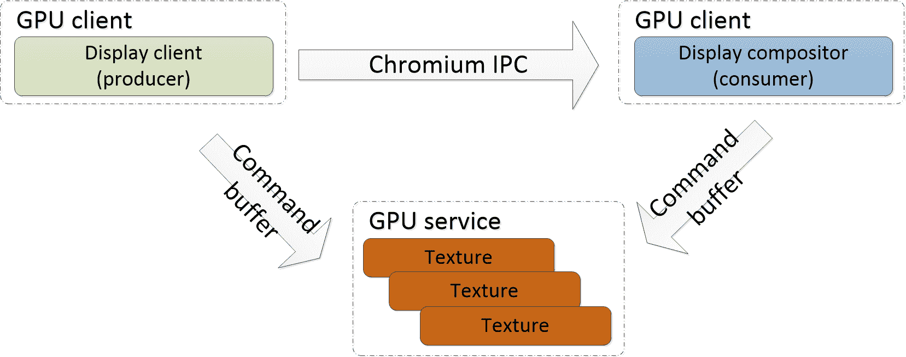
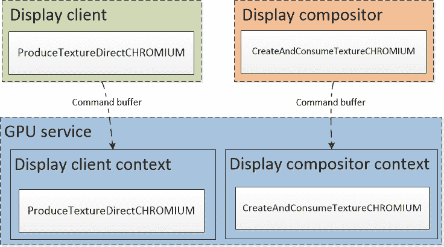
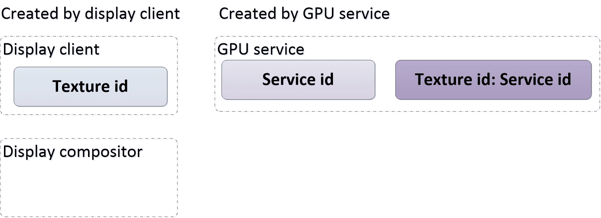
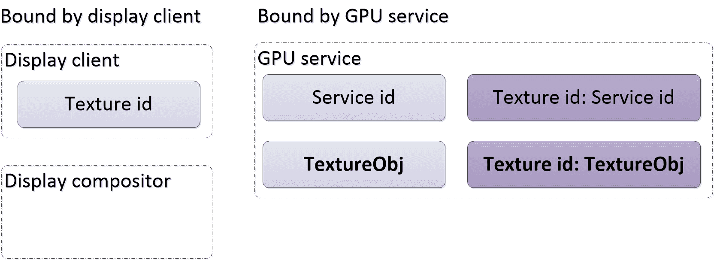
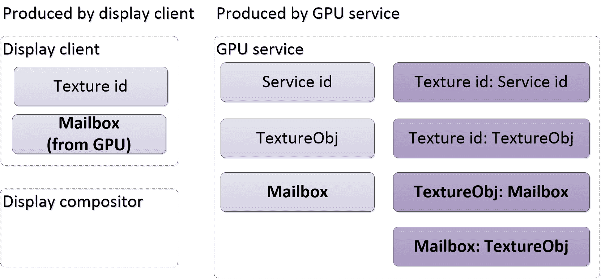
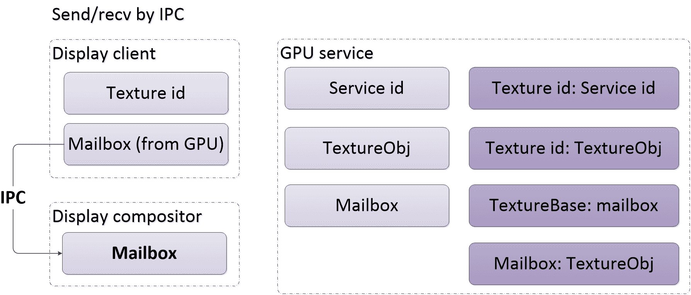
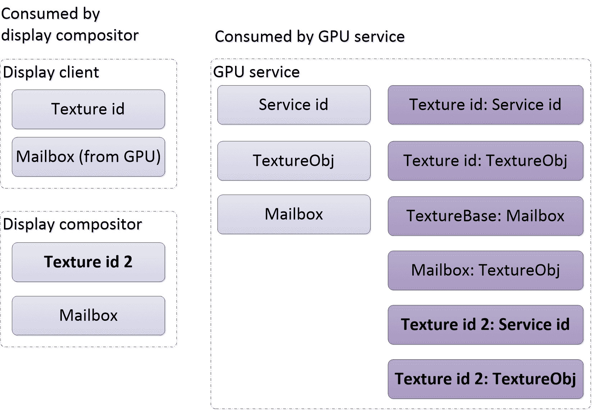

# 一种通用的 OpenGL ES 多进程框架

> 原文：[`developer.ibm.com/zh/articles/os-lo-common-opengl-es-multithreading-framwork/`](https://developer.ibm.com/zh/articles/os-lo-common-opengl-es-multithreading-framwork/)

## 介绍

当前 3D 计算有两个发展趋势：一是 3D 场景变得越来越复杂，计算变得更加耗费资源；二是用户体验变得越来越重要。这就要求应用程序能够在越来越短的时间内处理用户的输入和渲染，实现更高的 FPS。一般而言，OpenGL ES 应用都是以单进程或者单线程的形式把图形渲染到一个目标。对于某些复杂并要求好的体验的应用而言，单进程或者单线程的框架已经成为了制约程序性能的一个重要瓶颈。

开源项目 Chromium 浏览器提供了一个解决这个问题的方法。Chromium 有着非常复杂的渲染流水线。为了能够及时响应用户的输入，并及时更新屏幕上的内容（~16.6 毫秒），Chromium 里面大量的使用了多进程多线程来提高流水线的执行效率，并且能够在 CPU 和 GPU 之间合理安排负载，从而提高系统的性能和用户体验。

本文将从 Chromium 的 OpenGL ES 相关的部分，抽象出一个通用的多进程多线程的 OpenGL ES 框架，该框架能够更好的利用 CPU 多核心和 GPU 图形能力来提升性能。这个框架可以被用在其他的 OpenGL ES 应用里面。和所有的多进程多线程框架一样，本文重点在于论述资源是怎么共享的，以及资源之间的同步互斥问题。

这个框架把 OpenGL ES 应用划分为三个部分：显示客户端（Display client），显示合成器（Display compositor），GPU 服务（GPU service)。 显示客户端和显示合成器都是 GPU 服务器的客户端，所以也称他们为 GPU 客户端（GPU client）：

*   显示客户端：同时也是 GPU 客户端，是内容的生产者。通过 CommandBuffer, 显示客户端会把图形数据写入资源（资源可以是纹理，也可以共享的位图）。
*   显示合成器：另一个 GPU 客户端，是内容的消费者。显示合成器会消费（采样）显示客户端生成的资源。
*   GPU 客户端：显示客户端和显示合成器都是 GPU 客户端。通过 CommandBuffer，GPU 客户端 给 GPU 服务发送绘图命令。GPU 客户端的 CommandBuffer 封装在 GLES2Implementation 。GLES2Implementation 提供的接口和 OpenGL ES 的 API 很类似，基本上是一一对应的，所以 GPU 客户端的实现和原生的 OpenGL ES 应用很相似。在不影响读者理解的情况下，本文有时候把显示客户端和显示合成器都称作 GPU 客户端。
*   GPU 服务：解析来自 GPU 客户端的命令，并将这些命令发送给 OpenGL ES 驱动去执行。

##### 图 1\. GPU 客户端和 GPU 服务



要注意的是，Chromium 实现了两种 IPC 来支持这个框架：CommandBuffer 和 Chromium IPC。 GPU 客户端和 GPU 服务端之间通过 CommandBuffer 进行绘图命令的发送和接收。两个 GPU 客户端（显示客户端和显示合成器）之间，则是通过 Chromium IPC 进行数据的传递。 换句话说，CommandBuffer 的一头连接的是命令的生产者（GPU 客户端），另一头连着命令的消费者（GPU 服务）。Chromium IPC 的一头连着资源的生产者 （显示 客户端），另一头连着资源的消费者（显示合成器）。

为了在 GPU 客户端，GPU 服务之间共享资源，Chromium 实现了 Mailbox。为了保证资源在生产者和消费者之间能够被正确的共享，Chromium 又实现了 Sync 标记来保证资源的读写是互斥的。Mailbox，Sync 标记的实现都是基于 CommandBuffer 的。对于 GPU 客户端，具体的实现是在 GLES2Implementation。在 GPU 服务端，则实现了相对应的 CommandBufferStub。

本文将按下面的顺序展开：

*   介绍
*   术语
*   资源。资源是生产者和消费者之间共享的图像数据。
*   同步。同步用于保证消费者的读发生在生产者的写之后, 同时还用来安全的删除资源。这是实现多进程的关键之所在。
*   资源的生命周期。描述了资源如何在进程间共享，这能够让读者完整的理解整个流程。
*   总结

## 术语

[**Mailbox**](https://chromium.googlesource.com/chromium/src/gpu/+/master/GLES2/extensions/CHROMIUM/CHROMIUM_texture_mailbox.txt):Mailbox 在不同的 CommandBuffer 上下文之间共享纹理资源。Mailbox 是基于 CommandBuffer 的，它增加了三个 API：GenMailboxCHROMIUM，ProduceTextureDirectCHROMIUM，CreateAndConsumeTextureCHROMIUM。 纹理的生产者调用 ProduceTextureDirectCHROMIUM，消费者调用 CreateAndConsumeTextureCHROMIUM。

Mailbox 本身不保证对这个共享纹理的读写是互斥的。所以它总是和 Sync 标记一起使用。

[**CommandBuffer**](https://www.chromium.org/developers/design-documents/gpu-command-buffer)：在 Chromium 里面，CommandBuffer 的实现是 CommandBufferProxyImpl-CommandBufferStub。GPU 客户端通过 CommandBufferProxyImpl 往 GPU 服务发送命令。不过 GPU 客户端通常不直接使用 CommandBufferProxyImpl，而是使用更高级的封装了 CommandBufferProxyImpl 的 GLES2Implementation。GLES2Implementation 实现了类似 OpenGL ES 的接口。

[**Renderer 进程，浏览器进程，GPU 进程**](https://www.chromium.org/developers/design-documents/multi-process-architecture):Chromium 本身就被设计为多进程多线程的。显示客户端位于 Renderer 进程，显示合成器位于浏览器进程。GPU 服务，以及对原生 OpenGL ES 驱动的调用都是发生在 GPU 进程的。Renderer 进程和浏览器进程都是通过 CommandBuffer 和 GPU 进程打交道。

## 资源

资源就是在显示客户端和显示合成器之间共享的 OpenGL ES 纹理或者共享的位图。本文只讨论基于纹理的资源。在 Chromium 里面，有了 Mailbox 和 Sync 标记，纹理资源就能够安全的在 GPU 客户端之间共享：一个 GPU 客户端生产资源，另一个消费。GPU 客户端位于不同的进程，也可以是同一个进程的不同线程。

在 GPU 客户端里面，资源通常是用一个纹理 ID 来表示的。只有当资源需要从一个 GPU 客户端传送给另一个 GPU 客户端的时候，才需要把这个纹理 ID 转换为 Mailbox。在 GPU 服务里面，资源就是服务 ID，以及一个相应的纹理对象。

### 资源的分类

目前有三种类型的资源可以在 GPU 客户端之间共享：

```
enum class ResourceType {
kGpuMemoryBuffer,
kTexture,
kBitmap,
}; 
```

kGpuMemoryBuffer 类型的资源不是通过 OpenGL ES 接口申请的，但是通过 [Chromium image 扩展](https://chromium.googlesource.com/chromium/src/gpu/+/master/GLES2/extensions/CHROMIUM/CHROMIUM_image.txt) 的封装，可以当作 OpenGL ES 纹理来使用。kBitmap 是共享的位图。kTexture 就是 OpenGL ES 标准意义上的纹理。本文我们仅仅讨论 kTexture 类型。所以资源和纹理就没必要进一步区分了。

### 纹理 ID，服务 ID，纹理对象

GPU 客户端的 CommandBuffer 实现了类似 OpenGL ES 的接口。所以对于 CommandBuffer 的纹理相关的接口，可以直接使用纹理 ID 实现对纹理的读写，这和原生的 OpenGL ES 应用是一样的。纹理 ID 是 GLuint 类型。对于 GPU 服务的同一个纹理对象，在不同的 GPU 客户端，其纹理 ID 通常是完全不同的。为了在两个客户端之间共享纹理信息，抽象出了 Mailbox。有了 Mailbox，两个 GPU 客户端可以使用不同的纹理 ID，来操作同一个纹理对象。服务 ID 是一个纯粹的 GPU 服务的概念，等价于原生的 OpenGL ES 的纹理 ID。在 GPU 服务端，每个服务 ID 有一个对应的纹理对象。纹理对象则封装了服务 ID 和纹理的 Target 信息（Target 可以是 GL_TEXTURE_2D 等）。

### 纹理 Mailbox 扩展

[纹理 Mailbox 扩展](https://chromium.googlesource.com/chromium/src/gpu/+/master/GLES2/extensions/CHROMIUM/CHROMIUM_texture_mailbox.txt) 定义了在不同上下文之间共享纹理资源的方法。这里不同的上下文，指的是不同的 CommandBuffer 上下文。纹理 Mailbox 主要实现了下面的 API：

*   GenMailboxCHROMIUM。生成 Mailbox，由 GPU 客户端里面的生产者进行调用。
*   ProduceTextureDirectCHROMIUM。将纹理 ID 和 Mailbox 关联起来。注意，GPU 客户端里面的生产者会在调用这个之前先调用 BindTexture。BindTexture 会把纹理 ID 和 GPU 服务端的纹理对象关联起来。
*   CreateAndConsumeTextureCHROMIUM。返回一个新的纹理 ID，这个纹理 ID 会和 Mailbox 关联的纹理对象关联起来。 这一步发生在 GPU 客户端的消费者里面。

生产者（显示客户端）使用 GenMailboxCHROMIUM 和 ProduceTextureDirectCHROMIUM 将纹理 ID 封装成 Mailbox。当 Mailbox 到达了消费者（显示合成器），CreateAndConsumeTextureCHROMIUM 会将这个 Mailbox 解析为一个新的纹理 ID。消费者里面的这个新的纹理 ID 和生产者里面的那个纹理 ID 映射到了同一个纹理对象。所以生产者和消费者使用了不同的纹理 ID 来实现对同一个纹理对象的读写。

##### 图 2\. 纹理 Mailbox 扩展



## 同步

所有多进程多线程的问题，最核心的就是要处理好对数据的同步访问问题。

同步是通过 [同步点扩展](https://chromium.googlesource.com/chromium/src/gpu/+/master/GLES2/extensions/CHROMIUM/CHROMIUM_sync_point.txt) 来实现的。它定义了下面这些接口：

*   GenSyncTokenCHROMIUM/GenUnverifiedSyncTokenCHROMIUM。往当前上下文的命令流里面插入一个 Fence （Fence 是 Sync 标记的内部实现，为简单见，读者可以把 Sync 标记理解为 Fence），并返回一个 Sync 标记。
*   VerifySyncTokensCHROMIUM。用来检查这个 Sync 标记是否是当前进程产生的。
*   WaitSyncTokenCHROMIUM。如果它等待的 Sync 标记处于非激活状态，让当前的上下文停止发送 GPU 命令，直到这个 Sync 标记被激活。

显示客户端调用 GenUnverifiedSyncTokenCHROMIUM 生成 Sync 标记，并给当前的命令缓冲区插入一个 Fence。每次 Fence 被插入的时候，GPU 服务会把所有等待这个 Fence（或者这个 Fence 之前的其他 Fence）的 GPU 客户端对应的命令调度进来执行。Sync 标记生成之后，通过 IPC 发送给显示合成器。如果显示合成器要对这个资源进行读，就需要调用 WaitSyncTokenCHROMIUM 来等待资源可用。

##### 图 3\. 同步


最有意思的是，WaitSyncTokenCHROMIUM 并不会阻塞 GPU 客户端。所以 GPU 客户端可以继续往 GPU 服务端发送命令。在 GPU 服务端里面，如果这个被等待的 Sync 标记不处于激活状态，相应 GPU 客户端的 CommandBuffer 会被调度出去。一直到 GPU 服务检测到了来自另一个 GPU 客户端的 GenSyncTokenCHROMIUM/GenUnverifiedSyncTokenCHROMIUM 命令，被调度出去的 CommandBuffer 才有机会被调度进来。

在每个 GPU 客户端里面，同一个 GLES2Implementation 的发送的 GPU 命令，GPU 服务会以相同的顺序把这些命令发送给 GPU 驱动。但是，在 GPU 服务里面，显示合成器对资源的读命令有可能在显示客户端对资源的写之前到达 GPU 服务，因为这两者是不同的 GLES2Implementation。也就是说，哪个 GPU 客户端的命令先到达 GPU 服务端是不确定的。如上图 3， 命令到达 GPU 服务端的顺序可能是 ：

1.  显示客户端 ProduceTextureDirectCHROMIUM
2.  显示客户端 GenUnverifiedSyncTokenCHROMIUM
3.  显示合成器 WaitSyncTokenCHROMIUM
4.  显示合成器 CreateAndConsumeTextureCHROMIUM

也可能是：

1.  显示合成器 WaitSyncTokenCHROMIUM
2.  显示合成器 CreateAndConsumeTextureCHROMIUM
3.  显示客户端 ProduceTextureDirectCHROMIUM
4.  显示客户端 GenUnverifiedSyncTokenCHROMIUM

如果显示客户端的 GenUnverifiedSyncTokenCHROMIUM 比显示合成器的 WaitSyncTokenCHROMIUM 先到达，那就将当前的 Sync 标记修改为激活状态，然后继续解析执行后面的命令。一直到 GPU 服务解析 WaitSyncTokenCHROMIUM 的时候，由于之前显示客户端的 Sync 标记处于激活状态，所以就不会把当前的 CommandBuffer 调度出去，会继续执行后面的 CreateAndConsumeTextureCHROMIUM。这保证了 ProduceTextureDirectCHROMIUM 发生在 CreateAndConsumeTextureCHROMIUM 之前。

如果命令以相反的顺序到达，GenUnverifiedSyncTokenCHROMIUM 在 WaitSyncTokenCHROMIUM 之后，由于相应的 Sync 标记处于未激活状态，合成器的 CommandBuffer 就会被调度出去。等到显示客户端的 GenUnverifiedSyncTokenCHROMIUM 到达 GPU 服务端并被解析后，Sync 标记会被激活，显示合成器的 CommandBuffer 也会被调度进来，进而开始执行 CreateAndConsumeTextureCHROMIUM。因而这也能保证 ProduceTextureDirectCHROMIUM 发生在 CreateAndConsumeTextureCHROMIUM 之前。

所以这里的核心概念就是，等待一个 Sync 标记并不会导致 GPU 客户端被阻塞。只是它发送给 GPU 服务的命令，暂时不会被执行而已。

## 资源的生命周期

原生 OpenGL ES 应用使用纹理是这样的：

1.  glGenTextures
2.  glBindTexture
3.  glTexImage2D

然后就可以调用 glDraw*来对纹理进行读写。读写结束后，用户就可以调用 glDeleteTextures 了。

要实现纹理资源在不同进程线程的上下文之间的共享，其实现方法和原生的 OpenGL ES 程序有很大的区别，主要列出和普通 OpenGL ES 不同的部分：

1.  显示客户端准备 Mailbox。Mailbox 是通过纹理 ID 生成的，通过 IPC 可以发送到其他进程。
2.  显示客户端生成写 Sync 标记。显示客户端将资源封装为 Mailbox 和 Sync 标记之后，通过 IPC 发送给显示合成器。
3.  当显示合成器要对一个资源进行读（采样）的时候，需要先等待附加在资源上的写 Sync 标记。当显示合成器等待的写 Sync 标记被激活之后，就会生成一个新的纹理 ID，用于采样。
4.  当显示合成器对资源的采样结束，就可以开始删除资源了。这并不是真正的删除资源，它删除的仅仅是 GPU 服务里面的来自显示合成器的部分数据。合成器还会为这些要删除的资源准备读 Sync 标记，用以保证删除的时候，读已经结束了。
5.  显示合成器把上面准备好的资源通过 IPC 送回它们产生的地方，就是显示客户端。
6.  当显示客户端收到了来自显示合成器的返回的待删除的资源的时候，在做进一步删除资源之前，它需要等待读 Sync 标记被激活，然后显示客户端就可以真正发起删除资源的命令。这一步会导致 GPU 服务里面的纹理对象，以及其他所有相关的辅助数据的删除。

正如同步那一章描述的，无论哪个 GPU 客户端的命令先到达，Sync 标记都可以保证写读按照安全的顺序执行。基于这一事实，我们在这里讨论的生命周期的顺序，是以 GPU 服务把相应客户端的命令发送给 GPU 服务来解释的。但是事实上，对于 GPU 客户端，读和写是可以乱序执行的。所以读者在理解上面这些步骤的时候，要把”显示客户端写”理解为显示客户端的写命令被 GPU 服务解释执行。其他的说法都是类似的。

资源在显示客户端和显示合成器之间传递的时候，其状态转换如下图：

##### 图 4\. 资源状态


### 显示客户端创建资源

资源的创建需要显示客户端和 GPU 服务的协同工作。显示客户端调用 GLES2Implementation::GenTextures 来生成一个纹理 ID，并将这个纹理 ID 发送给 GPU 服务。在 GPU 服务端，调用原生的 glGenTextures 来获得一个服务 ID。然后 GPU 服务就可以把前面客户端传来的纹理 ID 和自己生成的服务 ID 组成一个数据对 <texture_id, service_id>，插入到一个 map 里面，以备后续查询使用。这个过程不需要显示合成器的参与。

图 5 是显示客户端，显示合成器，GPU 服务三者的数据变化，以粗体标出发生了变化的部分：

##### 图 5\. 创建资源



### 显示客户端绑定资源

在资源创建好了之后，显示客户端调用 GLES2Implementation::BindTexture 来实现对资源的绑定。GPU 服务调用 glBindTexture 来实现原生的绑定。同时，GPU 服务会创建一个纹理对象，以及把 <texture id, texture object> 插入一个 map 里面。纹理对象是对服务 ID 和纹理 Target 的打包。绑定结束后，客户端就可以通过纹理 ID 来引用 GPU 服务里面的纹理对象，并对这个纹理进行数据写入了。

##### 图 6\. 绑定资源



### 显示客户端生成 Mailbox

客户端调用 GLES2Implementation::GenMailboxCHROMIUM 来通知 GPU 服务创建 Mailbox。创建的 Mailbox 对象只有一个名字成员，这个名字其实是一个 16 字节的随机数。

GLES2Implementation::ProduceTextureDirectCHROMIUM 传入纹理 ID，返回 Mailbox 的字。相应的，GPU 服务会把 <texture object, mailbox> 和 <mailbox, texture object> 分别插入两个 map 里面。

##### 图 7\. 创建 Mailbox



### 显示客户端创建写 Sync 标记

在客户端对资源的写结束之后，如果要把资源发送给显示合成器，则需要调用 GenUnverifiedSyncTokenCHROMIUM 创建一个写 Sync 标记，并将这个标记和资源一起发送给显示合成器。GPU 服务的工作就是不停的解析来自客户端的命令。如果碰到了 GenUnverifiedSyncTokenCHROMIUM，而且有客户端正在等待这个 Sync 标记或者这个 Sync 标记之前的 Sync 标记，那就会把这些处于等待状态的 CommandBuffer 设置为运行状态，参与命令的分发。

Sync 标记的创建不会影响资源的数据结构。

### 显示客户端到显示合成器的 IPC

IPC 不会修改资源的状态，它只是把 Mailbox 从显示客户端传递给显示合成器。IPC 传递的数据包括 Mailbox，以及 Sync 标记。IPC 结束后，显示合成器里面多了一个 Mailbox 的拷贝（包括了 Sync 标记）。

##### 图 8\. 显示客户端到显示合成器 IPC



### 显示合成器消费资源

显示合成器消费资源是指显示合成器把来自显示客户端的 Mailbox 转换为一个新的纹理 ID，就是下图里面的 texture id 2。此外，GPU 服务会把 <texture id 2, service> 和 <texture id 2, texture object> 插入到两个不同的 map。

##### 图 9\. 消费资源



到这一步后，两个 GPU 客户端的纹理 ID 1，纹理 ID 2 都准备好了，并且它们都映射到了 GPU 服务里面的同一个纹理对象。这个时候显示客户端可以往 ID 1 里面写。显示合成器可以开始读取 ID 2。当然，就如在同步部分谈到的，写和读其实会被 GPU 服务顺序执行的。

### 显示合成器绑定纹理

显示合成器给 GPU 服务发送绑定纹理的命令。GPU 服务调用 glBindTexture 来完成实际的绑定，这点和之前客户端的绑定很类似。但是由于上一步已经把 <texture id 2:texture object> 插入到 map 里面去了，所以这一次没必要了。这一步也不会改变资源的状态。绑定结束后，合成器就可以对资源进行采样了。

### 显示合成器删除资源

删除会发生两次。一次在显示客户端，一次在显示合成器里面。但是真正会删除原生纹理的，是纹理的创建者显示客户端完成的。两次删除可以保证所有的相关数据会被删除，同时，它也让用户对 CommandBuffer 的调用和对原生 OpenGL ES 的调用更相似。

在显示合成器删除资源之前，显示合成器会为待删除资源创建一个读 Sync 标记。显示客户端的纹理 ID 和新创建的读 Sync 标记会被保留下来，并返回给显示客户端（为了行文简单，读 Sync 标记相关的部分在图 10 没有标注）。

显示合成器删除纹理 ID 2 以及从显示客户端拷贝来的 Mailbox。此外，GPU 服务里面纹理 ID 2 相关的数据结构也会被清除。在本次删除结束后，GPU 服务和两个 GPU 客户端的数据结构是这样的：

##### 图 10\. 删除资源


### 显示客户端删除资源

显示合成器在执行删除的时候，会返回一个纹理 ID （注意这个 ID 其实是来自显示客户端）和读 Sync 标记。显示客户端会检查这个读 Sync 标记是否已经没有人在读了，然后就可以对返回的纹理 ID 执行删除操作了。这是第二次删除，会导致所有纹理 ID 相关的数据，以及原生的纹理被删除。

## 结束语

随着桌面平台、移动平台的 CPU 核心越来越多，使用多线程多进程的结构来利用多 CPU 核心的能力已经非常普遍了。同时，GPU 在各种计算设备上也得到了普及和加强。这要求应用不仅要能够合理利用 CPU 的多核心能力，还需要在 CPU 多核心和 GPU 之间找到平衡，以提供最佳的用户体验。基于开源 Chromium 浏览器实现的 Chrome 浏览器，能够在市场上赢得大量的用户，证明了 Chromium 在性能和用户体验上有优势。而对 CPU 多核心和 GPU 图形能力进行优化和均衡，是 Chromium 浏览器渲染流水线优化的关键一环，对总体性能的提升和用户体验的改善更是功不可没。本文把 Chromium 浏览器里面专用的框架抽象为通用的多进程多线程的 OpenGL ES 框架，并重点分析了资源共享和资源的同步问题。开发者可以参考并应用这个框架到其他的性能关键的 OpenGL ES 应用程序里面。

您可以从 [这里](http://www.chromium.org/developers/how-tos/get-the-code) 下载 Chromium 的完整代码并尝试文中提到的框架。