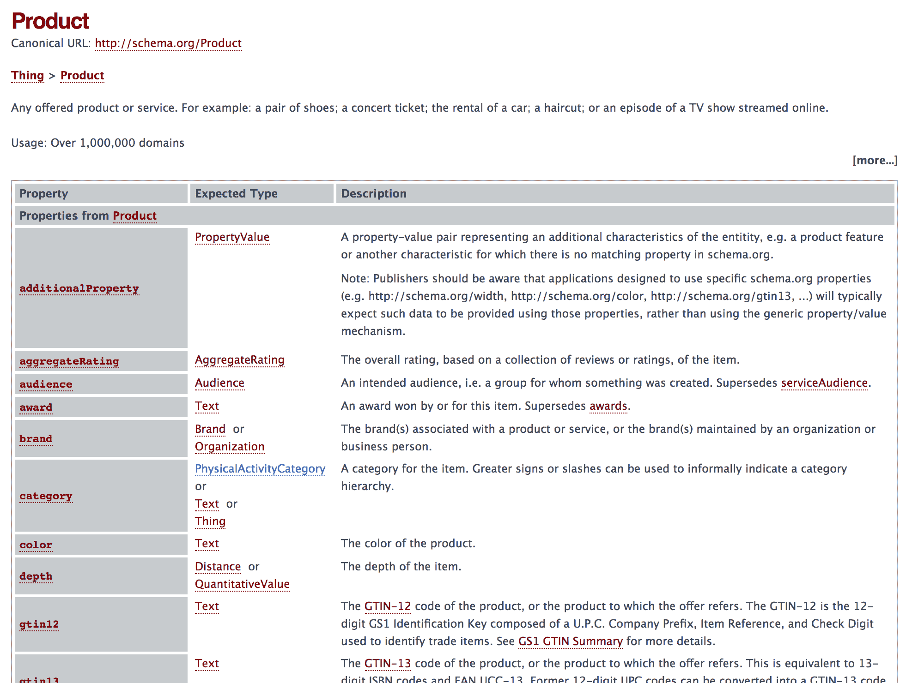
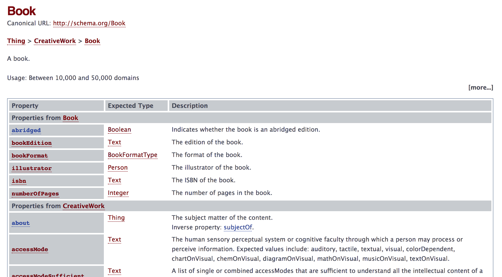

# 理解并使用 Schema.org 词汇表

> 原文：[`developer.ibm.com/zh/articles/wa-schemaorg3/`](https://developer.ibm.com/zh/articles/wa-schemaorg3/)

在本系列的前两部分中，我介绍了 Schema.org，描述了它针对网络中的机器可读信息的抽象模型，并确定了在 HTML 中表达这些信息的 3 种备选语法 – RDFa、Microdata 和 JSON-LD。

使用其中一种语法，您便可以根据您页面的主题来设置一个词汇表。几乎所有 Schema.org 词汇表都使用 URL 主干 `http://schema.org/` 。这些来自共同兴趣社区的共享约定和贡献，使 Web 发布者能使用网络上的更多结构化数据。它们还使开发人员能更广泛地聚合数据。

许多最常用的 Schema.org 词汇表都是用比较旧的格式来构建的，比如我在 [第 1 部分](https://developer.ibm.com/zh/articles/wa-schemaorg1/) 中提到的微格式。其他词汇表基于“friend-of-a-friend”词汇表，这是 RDF 应用程序的主要部分。各种词汇表都不断接受评审和改进。

让我们看看 Schema.org 词汇表，从一些常用的术语开始。

## 用 Schema.org 描述待售商品

因为电子商务非常流行，所以与描述产品和销售信息相关的 Schema.org 词汇表都是流行的词汇表。这些词汇表向产品或用户网站添加了机器可读的数据，而且该数据向 Google、Bing 和 Yandex 等搜索引擎的搜索结果添加了内联注释。

这个电子商务词汇表起源于一个用于电子商务的单独词汇表 *GoodRelations*，该词汇表是为向涵盖提供者/客户关系的页面添加机器可读数据而开发的。Schema.org 吸收了 GoodRelations，它的类和属性现在得到了广泛使用和支持。

对于电子商务网站，有两个主要类：

*   `http://schema.org/Product`
*   `http://schema.org/Offer`

图 1 给出了来自 [`schema.org/Product`](http://schema.org/Product) 的文档页的屏幕截图。因为页面非常长，所以它被截断了，所显示的还不到为 `Produce` 类型实际定义的属性的四分之一。这些属性涵盖基本属性（名称、描述、关联品牌名称等）和专业属性（全球交易品项识别代码 (GTIN)、基础通用商品代码 (UPC) 的标准集，以及条形码）。

##### 图 1\. 产品类



您应该还记得在上一篇文章中，通过 HTML 元素分层结构表达这些属性，或者在 JSON-LD 部分表达这些属性。对于每个属性，Schema.org 都会指定可接受值的类型。在许多情况下，该值是纯文本，由根据您尝试传达的信息来确定合理的类型。还有其他类型的简单数据类型资源值，比如 Number 或 DateTime，而且在某些情况下，这些值来源于 `Thing` 类，在这种情况下，这些值必须是 URL 引用。在指定属性时，通常有多种类型的资源（或文字值）可供选择。

Schema.org 词汇表偶尔可能会重叠和难以理解。在上图中， `category` 属性的值可以是 `PhysicalActivityCategory` 、 `Text` 或 `Thing` 。但是， `PhysicalActivityCategory` 源自对 Schema.org 健康和生命科学的一个扩展，是一个非常随意的、有限的待售商品集。

存在这种矛盾是因为，Schema.org 中的描述被尽可能保持统一，而类和属性有时被重复使用来指代特定的关注领域。因此，您有时会发现不常用的概念被引入主流词汇表描述中。Schema.org 原本是非常不正式的，所以请依靠直觉来正确使用类和属性。

有时，您可以选择使用结构化的值框架，或者仅使用非正式文本字符串。拥有纯文本类别非常类似于社交媒体中的标记。我们将这个非正式的标记集合称为“大众分类”，以便将其与更正式的分类区别开来。

如果单击左列中的一个属性，就会获得该属性的更多详细信息。例如，单击 `aggregateRating` 。您会看到以下页面。

##### 图 2\. aggregateRating 属性


在页面底部，可以看到一些有助于入门的示例。几乎所有 Schema.org 类和属性定义都展示了这些示例，您可以选择是否想要看到 Microdata、RDFa 或者 JSON-LD 示例。

## 图书销售示例

清单 1 给出了一本在网络在售的图书 *Things Fall Apart* 的样本描述。

##### 清单 1\. 图书产品/报价信息

```
<div vocab="http://schema.org/" typeof="Product">
  
  <a property="url" href="https://www.betterworldbooks.com/product/detail/Things-Fall-Apart-9780393932195">
    <span property="name">Things Fall Apart</span>
  </a>
  <div property="offers" typeof="Offer">
    <span property="priceCurrency" content="USD">$</span>
    <span property="price" content="8.48">8.48</span>
    (<span property="itemCondition" href="UsedCondition">used</span>,
    <span property="offerCount">2</span> available)
  </div>
</div> 
```

此清单展示了该产品的基本描述、名称、图品，以及该产品的一组报价信息。报价是从以下方面进行描述的：

*   价格
*   计价货币
*   该商品已被使用的事实
*   该商品有两件的事实

### 枚举

该出售的图书的条件是一个属性 `itemCondition` ，它的值包含 Schema.org 中的多个特定的、已识别的值。这被称为一个 *枚举* ，被定义为一种特定类型的类 `OfferItemCondition` 。这个特定的枚举有 4 个成员，包括：

*   `DamagedCondition`
*   `NewCondition`
*   `RefurbishedCondition`
*   `UsedCondition`

`Offer` 的另一个包含枚举值的属性是 `availability` 。枚举类为 `ItemAvailability` ，预期的值包括：

*   `Discontinued`
*   `InStock`
*   `InStoreOnly`
*   `LimitedAvailability`
*   `OnlineOnly`
*   `OutOfStock`
*   `PreOrder`
*   `PreSale`
*   `SoldOut`

属性 `itemCondition` 可用在 `Offer` 或 `Product` 上，但 `availability` 仅应用在 `Offer` 上。

### 混合使用其他词汇表

有时，您会发现其他词汇表会混杂进来。例如，Schema.org 的商业描述部分源自另一个名为 GoodRelations 的词汇表项目。Schema.org 仍在一些领域指定了 GoodRelations 术语。例如，一个 `Offer` 资源可能有一个名为 `availableDeliveryMethod` 的值。这是一个枚举，它的所有值仍是 GoodRelations 术语，例如：

*   `http://purl.org/goodrelations/v1#DeliveryModeDirectDownload`
*   `http://purl.org/goodrelations/v1#DeliveryModeMail`
*   `http://purl.org/goodrelations/v1#DeliveryModePickUp`
*   `http://purl.org/goodrelations/v1#FederalExpress`

下面这段来自待售图书描述的代码经过了修改，以演示在 RDFa 中表达此信息的最直接方法。

```
<div property="offers" typeof="Offer">
              <span property="priceCurrency" content="USD">$</span>
              <span property="price" content="8.48">8.48</span>
              (<span property="itemCondition" href="UsedCondition">used</span>,
              <span property="offerCount">2</span> available)
              <link property="availableDeliveryMethod" href="http://purl.org/goodrelations/v1#DeliveryModeMail">
            </div> 
```

添加的行已突出显示。 `availableDeliveryMethod` 的值被设置为完整的基于 GoodRelations 的 URL。

请注意，这里使用了 `link` 元素来从枚举中提供该属性的值。应该使用此方法来指定枚举值，或 Schema.org 规范中对某个 URL 值的其他任何准确引用。因为没有锚文本，所以该链接不会实际向用户显示任何内容；它仅供机器读取。您可以将它放在邻近内容的旁边。

表达词汇表 URL 的另一种方法是，使用一个来自 [`schema.org/`](http://schema.org/) 的不同主干。这涉及到我尚未介绍的 RDFa 属性： `prefix` 。

```
<div vocab="http://schema.org/" prefix="gr: http://purl.org/goodrelations/v1#" typeof="Product">
           ...
            <div property="offers" typeof="Offer">
              <span property="priceCurrency" content="USD">$</span>
              <span property="price" content="8.48">8.48</span>
              (<span property="itemCondition" href="UsedCondition">used</span>,
              <span property="offerCount">2</span> available for shipping by post
              <link property="availableDeliveryMethod" href="gr:DeliveryModeMail">)
            </div>
          </div> 
```

`prefix` 属性将缩写 `gr:` 与 GoodRelations URL 的主干联系起来。然后，您可以通过添加该 URL 的末尾部分，编写一种缩写形式，即 `gr:DeliveryModeMail` 。请注意，所有这些缩写都必须使用冒号作为分隔符。在混合了 URL 的许多不同变体时，或者在您将自己的词汇表与 Schema.org 混合时，此诀窍将派上用场。

## 组合类

在这个例子中，待售商品实际上至少是两种东西：一个产品和一本书。图书的卖家和买家会考虑该书的价格和发货细节。读者会考虑该书的标题、作者和页数。当然，这些角色是重叠的。您可以在网络书店中搜索您刚了解的一位作者的最合算图书。

这个常见场景强调了事物可能属于多个类，Schema.org 为这些情况提供了现成的支持。下面这个待售图书 HTML 版本展示了各个类的组合。

##### 清单 2\. 图书即产品，同时使用这两个类

```
<div vocab="http://schema.org/" typeof="Product Book">
  
  <a property="url" href="https://www.betterworldbooks.com/product/detail/Things-Fall-Apart-9780393932195">
    <span property="name">Things Fall Apart</span>
  </a>
  <dl>
    <dt>Author</dt><dd property="author" typeof="Person">Chinua Achebe</dd>
    <dt>ISBN</dt><dd property="isbn" typeof="Person">9780393932195</dd>
  </dl>
  <div property="offers" typeof="Offer">
    <span property="priceCurrency" content="USD">$</span>
    <span property="price" content="8.48">8.48</span>
    (<span property="itemCondition" href="UsedCondition">used</span>,
    <span property="offerCount">2</span> available)
  </div>
</div> 
```

属性 `typeof="Product Book"` 将该资源同时指定为属于两种类型，使用一个空格将两种类型分开。指定两种类型后，可以使用与两种类型有关的属性。清单 2 中突出显示的文本行展示了产品和图书的属性信息。

### 继承属性

第 2 部分中已指出，Schema.org `Book` 类源自 `CreativeWork` 类。这意味着通过继承，任何 Book 实例都可以拥有来自其基类、`CreativeWork` 和 `Thing` 的属性。为了方便起见，任何给定类的 Schema.org 文档都包含基类的属性。图 2 展示了一个来自 [Book 类页面](http://schema.org/Book) 的屏幕截图，演示了这一情况。可以看到，前 6 个属性是特定于 `Book` 的。它们后面的部分明确标记了来自 `CreativeWork` 的属性。在实际页面再往下的位置标记了来自 `Thing` 的属性的另一个部分。

##### 图 3\. Book 类



目前，我处理的基本上是简单的描述性文本和枚举。但是，可以想象，Schema.org 中的一些信息需要以正式方式进行表达。让我们看看如何实现此操作。

## 数据类型

拥有正规格式的数据值，是让内容变得机器可读的一个重要部分。数据以字符串形式从 HTML 传入，但共享的格式约定对富数据类型至关重要。例如，一个属性的值类型的 Schema.org 文档要求使用 `Integer` 时，您不希望将 `1.5` 设置为值，因为该数字包含小数部分，不是一个有效的整数。文档并不总是能够非常清楚地介绍数据类型细节。但是，在大多数情况下，您可以期待拥有类似于您最喜欢的编程语言的约定。

### 重叠的人类可读和机器可读数据

机器可读的数据版本所需的严格格式并不总是对人类那么友好。毕竟，您的网页仍是为人类所用的。许多时候，在 Schema.org 中，您将拥有适合人类的文字元素文本，通过标记以元数据形式提供机器可读的版本。

这是来自图书销售示例的一段修改后的代码。

```
<div property="offers" typeof="Offer">
              <span property="priceCurrency" content="USD">$</span>
              <span property="price" content="10">ten</span>
            </div> 
```

在这个示例中，机器可读的货币被表示为 ISO 4217 标准的 3 字母代码，而人类可读的货币被表示为人们熟悉的美元符号 `$`。计价金额以数字形式指定，但该页面中将数字表示为英文文本。

目前为止，我已将价格细节作为关于报价的直接属性提供给您，但您也可以将它们捆绑到一个 `PriceSpecification` 资源中。这对反映折扣周期可能很有用。考虑一次节日促销。

```
<div property="offers" typeof="Offer">
            <div property="priceSpecification" typeof="PriceSpecification">
              <span property="priceCurrency" content="USD">$</span>
              <span property="price" content="12.5">12.50</span>
              <meta property="validFrom" content="2018-12-25">
            </div>
            <div property="priceSpecification" typeof="PriceSpecification">
              <strong>
              Or just
              <span property="price" content="10">ten</span>
              <span property="priceCurrency" content="USD">dollars</span>
              <span property="validTo" content="2018-12-24T11:59:59">until midnight Christmas Eve!</span>
              </strong>
            </div>
          </div> 
```

这里有一个限时的销售价格，正常价格被标记为在此时限后生效。

折扣价格的 `validTo` 日期再次显示了人类可读和机器可读数据的重叠。该元素的内容采用了英文表达“until midnight Christmas Eve”，而 `content` 属性对这个准确日期和时间采用了 ISO 8601 标准格式。

`validFrom` 日期没有人类可读的内容，但在属性中包含 ISO 8601 数据。因为它没有人类可读的内容，所以我使用了一个 `meta` 标记，这是 Schema.org 中的首选方法。如果您拥有机器可读的数据，但内容中没有可以覆盖它的明显位置，或者用于该内容的 HTML 没有提供进行覆盖的自然语法，那么可以使用 `link` 或 `meta` 标记。这个标记应放在离相关上下文尽可能近的地方。上面讨论了在属性的值是枚举时使用 `link` 。如果不是枚举，可以使用 `meta` ，如最后一个清单所示。

有时，您可能想要提供文本中未给出的材料的详细元数据，例如图像或嵌入式脚本和媒体对象。在这种情况下，浏览器中显示的实际详细信息是从另一个文件加载而来的，所以无法提供可用于简单文本内容的内联 Schema.org 标记。在这些情况下，您将使用 `link` 或 `meta` 标记。

## 结束语

本文讨论了 Schema.org 词汇表的一些重要方面，以及如何使用它的文档。现在您已经熟悉了将事物表达为机器可读数据的语法，以及在某个特定关注领域这么做的最常见约定。

那么，您如何确定您小心写入到网页中的 Schema.org 语法在语法和词汇表中都是正确的呢？有哪些工具可以帮助您有效地使用 Schema.org？在本系列的下一部分也是最后一部分中，我将展示如何使用 Schema.org 来验证页面，还将讨论在网页上使用 Schema.org 时要牢记的其他实际考虑因素。

本文翻译自：[Understand and use the Schema.org vocabularies](https://developer.ibm.com/articles/wa-schemaorg3/)（2018-03-05）