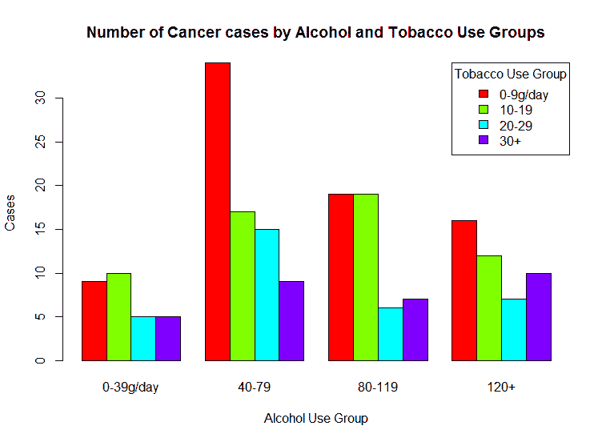
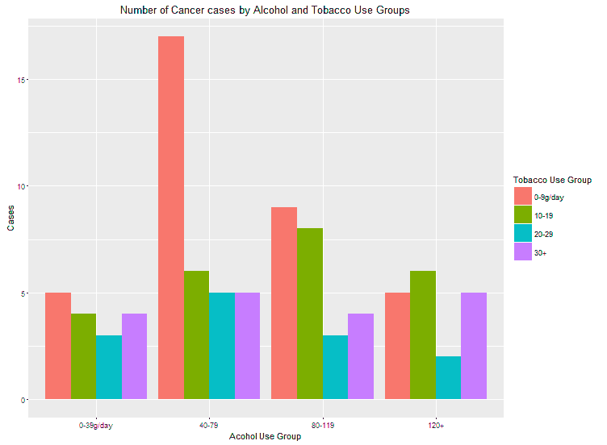
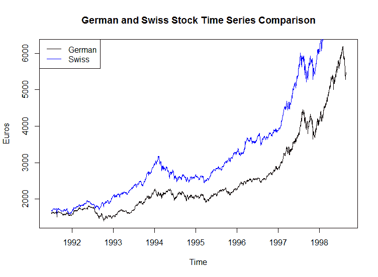
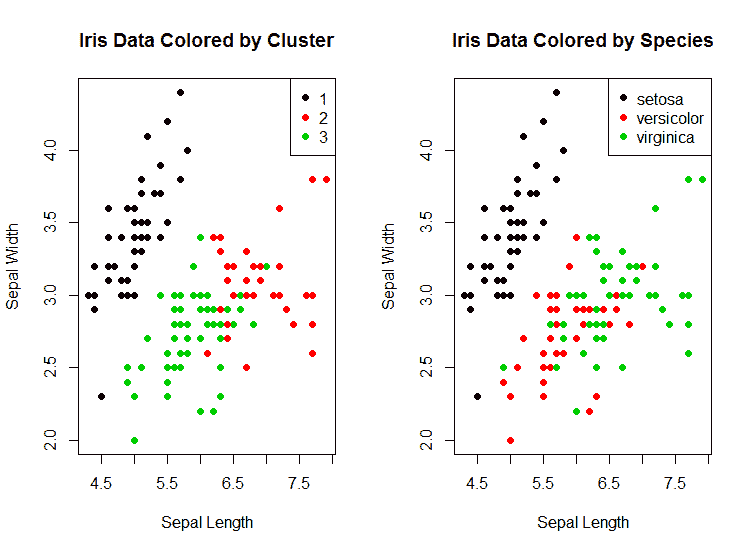
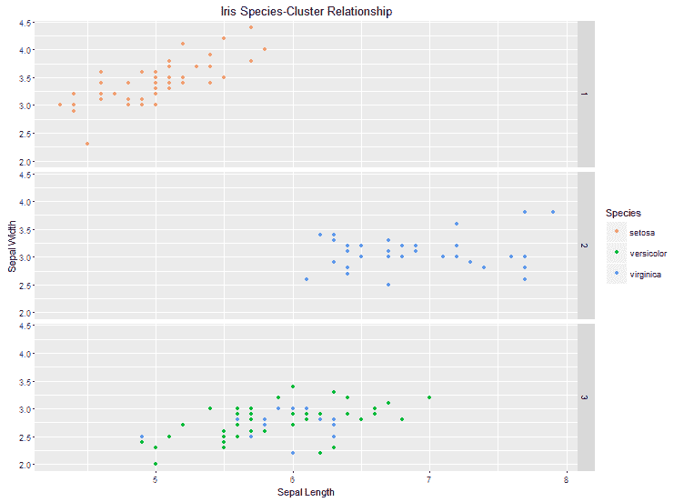

# R 语言入门的 7 个技巧

> 原文：[`developer.ibm.com/zh/articles/os-know-r-language/`](https://developer.ibm.com/zh/articles/os-know-r-language/)

这样，您就正式进入 R 语言的世界了。或许您有 STATA 或 SAS 方面的背景，或许您精通 Python。或者，您可能是一位 Excel 专家。无论您拥有何种背景，在深入使用 R 编程语言之前，都应该对它有所了解。本文将重点介绍您在开始使用 R 语言之前应该了解的 7 件事，并帮助您避免新 R 语言用户会遇到的一些最常见问题。

在深入分析我们的技巧之前，让我们快速定义一下 R。R 是一种编程语言，通常用于统计计算和图形领域。但是，用户创建的大量包将 R 的适用性扩展到了数据分析和可视化之外的领域。

## 1.为此问题有一个适用包

最初，为看似无法使用基础 R 包解决的问题，您可能忍不住拼凑出一些解决方案。这是一个糟糕的想法，原因有很多，首要原因是，或许有一个包可用于简化您的解决方案并确保它没有错误。您需要了解并使用您的 R 包，R 包的大部分都存储在 [Comprehensive R Network (CRAN)](https://cran.r-project.org/) 中。

清单 1 给出了一个让您更轻松完成工作的包的示例。

##### 清单 1\. 一个 R 包示例

```
library(sandwich)
library(lmtest)
xs <- rnorm(1000,10,2)
ys <- xs*2
X <- cbind(1,xs)
plot(ys~xs)
ys <- ys + xs * rnorm(1000,1,1)
plot(ys~xs)
mod <- lm(ys~xs)
summary(mod)
ehat <- diag(residuals(mod)²)
sqrt(diag(solve(t(X)%*%X) %*% t(X) %*% ehat %*% X %*% solve(t(X)%*%X)))
coeftest(mod, vcov = sandwich) 
```

清单 1 中的代码创建了两个将在回归函数中使用的数据矢量（第 3-5 行）。该数据的设计将 X 和 Y 关联起来，但也存在。第 7 行中的代码展示了异方差性是如何产生的。Y（已与 X 相关）有一个通过 X 创建的随机成份。异方差性不会妨碍您估算一次回归的能力。但是，各个系数的标准误差被认为是不可靠的，因此回归值只是估算值，而不是实际计算的值。然后，我们可以运行回归，查看来自 summary 函数的标准误差（错误的标准误差）。

为了计算可靠的标准误差，需要创建剩余矩阵以及一个 X 矩阵（第 11 和第 5 行）。然后，这些矩阵需要执行矩阵公式，以获得可靠的标准误差（第 12 行）。您可能需要在线查看一些操作，以便记住如何执行这些操作，并不可避免地不断试错。下一行（第 13 行）展示了如何使用 `sandwich` 和 `lmtest` 包获得可靠的标准误差。

这些包是在第 1 和第 2 行中加载的。为了使用它们，必须使用 `install.packages()` 函数安装它们。与尝试自己设计的方法相比，这些包更容易使用，而且产生错误的可能性更低。这些包不仅能够执行基础 R 无法执行的任务，还经过了开源社区的审查。

R 中的包拥有优秀的标准化文档，而且非常重视示例，这很有帮助。您应该使用包来解决基础 R 中的问题，确保理解这些包并以最佳方式使用它们。这样您的 R 代码就能变得很完美。

## 2.如何搭建数据结构

理解如何在 R 中搭建数据结构很重要。本节中的脚本和输出列出了一些可用的数据结构，包括矢量、矩阵、数据帧和列表。

### 数据结构用例

让我们快速查看每种数据结构类型的用例。

*   矢量：在需要存储同一类型的一个变量时使用，比如数据集中所有福特 F-150 的重量。
*   矩阵：在需要存储同一类型的多个变量或需要在 R 中移动或转换数据时使用。许多 R 函数需要将数据输入到矩阵中，比如主成份分析。
*   数据帧：用于存储不同数据类型的多个变量；它们非常适合调查和观察数据集。
*   列表：用于在不确定数据的类型长度时移动数据。列表适合用作函数结果的返回工具。

我们首先来研究一下矢量，如清单 2 所示。矢量是同类型数据的集合。它们是在 R 中移动数据的基础单元，而且它们是使用 `C` 函数创建的。它们很容易创建，而且各个元素可以使用一个索引（从 1 开始，而不是从 0 开始）来查看。

##### 清单 2\. R 中的矢量

```
#Vectors
vex <- c(1,5,3)
vex
[1] 1 5 3
vex <- c(1 + 2i,4,5)
vex
[1] 1+2i 4+0i 5+0i
vex <- c(TRUE,1,0,1)
vex
[1] 1 1 0 1
vex <- c("This","That",1)
vex
[1] "This" "That" "1"
vex[1]
[1] "This" 
```

此代码表明，当您向 `C` 函数送入一组不同类型的数据时，它会将这些数据强制转换为一种给定类型。

矩阵也是如此，如清单 3 所示。矩阵不仅仅是二维矢量。R 也有多维数组，这些数组是更高维的矩阵。您可以使用两个矢量并创建一个矩阵。如果您没有指定其他任何选项，结果矩阵 mat1 是一个只有一列的矩阵。如果通过指定“2”来指定您希望在 mat1 中包含的行数，那么该矩阵现在是一个 2×5 矩阵。

##### 清单 3\. R 中的矩阵

```
#Matrices
v1 <- c(0:4)
v2 <- c(5:10)
mat1 <- matrix(c(v1,v2))
mat1
[,1]
 [1,] 0
 [2,] 1
 [3,] 2
 [4,] 3
 [5,] 4
 [6,] 5
 [7,] 6
 [8,] 7
 [9,] 8
[10,] 9
mat1 <- matrix(c(v1,v2),nrow=2)
mat1
[,1] [,2] [,3] [,4] [,5]
[1,]    0    2    4    6 8
[2,]    1    3    5    7 9
mat2 <- matrix(c(v1,v2),ncol=2)
mat1*mat2
Error in mat1 * mat2 : non-conformable arrays
mat3 <- mat1%*%mat2
mat3[1,2]
[1] 160 
```

您会注意到，创建矩阵不是将矢量彼此堆叠。这是因为，除非另行指定，否则矩阵会按列输入数据。这样，如果您创建同一个矩阵但指定了两列，您就无法将这些矩阵相乘。 矩阵默认情况下会采用逐单元乘法和除法，而不是矩阵乘法。可以使用 % 来指定矩阵乘法。在这些情况下，执行矩阵乘法后，您可以访问结果矩阵中的第一行和第二列中的单元。

接下来讨论一下数据帧，如清单 4 所示。

下面的脚本首先使用 `data.frame` 函数创建一个数据帧。您可以添加数据而不指定变量名称。在本示例中，已经指定了变量名称。您会注意到，数据帧可以存储不同类型的数据，而矩阵和矢量仅存储一种类型的数据。

##### 清单 4\. R 中的数据帧

```
#Dataframes
df <- data.frame(Bool = sample(c(TRUE,FALSE),100,replace=T),Int =
c(1:100),String=sample(LETTERS,100,replace=TRUE))
df$Bool
  [1] FALSE  TRUE  TRUE FALSE  TRUE  TRUE FALSE FALSE FALSE  TRUE  TRUE
FALSE  TRUE  TRUE FALSE  TRUE FALSE  TRUE  TRUE  TRUE FALSE TRUE
 [23] FALSE  TRUE FALSE FALSE FALSE  TRUE FALSE  TRUE FALSE  TRUE FALSE
 TRUE  TRUE  TRUE  TRUE FALSE  TRUE  TRUE  TRUE FALSE  TRUE TRUE
 [45] FALSE FALSE FALSE FALSE  TRUE FALSE FALSE  TRUE FALSE  TRUE  TRUE
FALSE  TRUE  TRUE FALSE  TRUE  TRUE FALSE FALSE FALSE TRUE FALSE
 [67]  TRUE FALSE FALSE FALSE FALSE FALSE  TRUE FALSE  TRUE  TRUE  TRUE
FALSE  TRUE  TRUE FALSE FALSE FALSE FALSE FALSE FALSE  TRUE TRUE
 [89]  TRUE FALSE  TRUE  TRUE FALSE FALSE FALSE FALSE FALSE FALSE  TRUE
TRUE
df[df$Bool,]
Bool Int String
2   TRUE   2 Z
3   TRUE   3 R
5   TRUE   5 K
6   TRUE   6 T
10  TRUE  10 O
11  TRUE  11 U
13  TRUE  13 Y
14  TRUE  14 Z
16  TRUE  16 N
df[df$Bool,3]
[1] Z R K T O U Y Z N H D L B H N L D Z R M I W W I M D A C B R S M Y Y F V B
W P Q Q S M Y K Z J V I
Levels: A B C D E F H I J K L M N O P Q R S T U V W X Y Z
df$String[df$Bool]
[1] Z R K T O U Y Z N H D L B H N L D Z R M I W W I M D A C B R S M Y Y F V B
W P Q Q S M Y K Z J V I
Levels: A B C D E F H I J K L M N O P Q R S T U V W X Y Z
df$NewVar <- c(1:101)
Error in `$<-.data.frame`(`*tmp*`, "NewVar", value = 1:101) :
replacement has 101 rows, data has 100
df$NewVar <- c(1:99)
Error in `$<-.data.frame`(`*tmp*`, "NewVar", value = 1:99) :
  replacement has 99 rows, data has 100 
```

在此代码中，可以看到使用 $ 运算符调用数据帧变量 Bool 时的输出（第 4 行）。这是一种访问存储在数据帧中的数据的常见轻松方法。接下来，可以使用布尔值或 1 和 0 来访问特定行或列。df[df$Bool,]（第 5 行）输出了 Bool 为 TRUE 的所有行。在此清单中，因为没有指定任何列，所以将输出所有列。

下一次调用指定了第三列，所以仅输出 String 变量的值（第 6 行）。在这之后，可以看到另一种处理方式。$ 运算符用于指定 String 变量，可将该变量视为矢量，然后使用 Bool 值来指定哪些值是输出。因为 String 变量是首先指定的，所以在使用 Bool 选择要输出的内容时不需要指定列（第 7 行）。

显然，数据帧比矢量和矩阵灵活得多。但是，上面的最后两行脚本表明，所有新变量都必须有相同的长度。此要求不是非常严格，但列表（我们现在将讨论）在添加数据时没那么严格。

清单 5 给出了用于创建包含 3 个不同长度矢量的列表的代码。您仍可以使用 $ 运算符访问列表对象，或者使用 [[]]。

关于列表的另一个重要方面是，它能包含其他数据对象。要让一个列表包含其他数据对象，可以向列表添加一个数据帧（第 6 行）。完整的数据帧会被存储，而且仍可以通过我们之前讨论过的方式进行访问（第 8 行）。此外，列表既可以拥有指定的名称也可以没有名称。所有这些在创建函数或包时都很重要。许多不同的例程会创建大量不同类型的数据，这些数据需要通过各种不同方式存储。列表变得有用是因为，所有这些不同类型的数据对象都可以打包在一起返回。

##### 清单 5\. R 中的列表

```
#Lists
ls <- list(Bool = sample(c(TRUE,FALSE),50,replace=T),Int =
c(1:75),String=sample(LETTERS,100,replace=TRUE))
ls$String
[1] "O" "F" "E" "U" "O" "P" "E" "V" "G" "Z" "T" "F" "T" "C" "J" "P" "G"
"L" "M" "E" "O" "T" "E" "R" "A" "Z" "E" "Y" "N" "Y" "U" "N" "E"
[34] "T" "N" "W" "Z" "D" "S" "R" "P" "C" "H" "G" "N" "Y" "P" "M" "H" "A"
"J" "Y" "C" "C" "Y" "S" "P" "J" "W" "J" "H" "E" "B" "Z" "X" "T"
[67] "B" "M" "I" "P" "V" "I" "H" "M" "D" "I" "T" "L" "J" "F" "M" "B" "J"
"E" "G" "K" "E" "U" "F" "U" "T" "L" "B" "Z" "U" "X" "U" "P" "D"
[100] "W"
Ls[[3]]
[1] "O" "F" "E" "U" "O" "P" "E" "V" "G" "Z" "T" "F" "T" "C" "J" "P" "G"
"L" "M" "E" "O" "T" "E" "R" "A" "Z" "E" "Y" "N" "Y" "U" "N" "E"
[34] "T" "N" "W" "Z" "D" "S" "R" "P" "C" "H" "G" "N" "Y" "P" "M" "H" "A"
"J" "Y" "C" "C" "Y" "S" "P" "J" "W" "J" "H" "E" "B" "Z" "X" "T"
[67] "B" "M" "I" "P" "V" "I" "H" "M" "D" "I" "T" "L" "J" "F" "M" "B" "J"
"E" "G" "K" "E" "U" "F" "U" "T" "L" "B" "Z" "U" "X" "U" "P" "D"
[100] "W"
ls[[4]] <- df
Ls[[4]]
Bool Int String
1   FALSE   1 Q
2    TRUE   2 Z
3    TRUE   3 R
4   FALSE   4 M
5    TRUE   5 K
6    TRUE   6 T
Ls[[4]][2:5,1]
[1]  TRUE  TRUE FALSE TRUE
names(ls)
[1] "Bool"   "Int"    "String" "" 
```

关于 R 中的数据有许多需要学习的地方，但理解如何使用矢量、矩阵、数据帧和列表可以帮助您入门。

## 3.Rstudio 是 IDE 世界的主宰

在编写 R 脚本时， [Rstudio](https://www.rstudio.com) 是您唯一需要使用的 IDE。它将您需要的所有工具都集中在一个地方，而且它在 Sweave 和 R Markdown 的集成使用中不可或缺。这些工具可用于创建包含代码、输出、图表和文本的文档。这些文档的创建是脚本化的，因此是完全可复制的。

RStudio 的另一个不错的工具是 R 调试器，它被集成到 IDE 中。清单 6 展示了该调试器的实际用法。

##### 清单 6\. 调试器的实际用法

```
testF <- function(x,y){
if(length(x) == length(y)){testF1(x,y)}
}
testF1 <- function(x,y){
print(cbind(x,y))
}
x <- c(1:10)
y <- c(11:21)
testF(x,y) 
```

如果您希望输出 x 和 y，在无法输出它们时您就会很失望。假如您无法自行确定原因，可以向控制台输入以下命令来启动调试器（参见图 1）。

```
> debug(testF)
> testF(x,y) 
```

##### 图 1\. 调试器


现在您可以访问调试器，还可以对函数单步调试或进入下一行，如图 2 所示。

##### 图 2\. 对函数执行单步调试


此时还会打开一个 Traceback 窗格，以及一个特定的调试窗格（参见图 3）。

##### 图 3\. 调试窗格


无可否认，此示例不是特别重要，但重要的是，您可以看到 RStudio 确实是解决您的 R 脚本所需的一站式场所。

## 4.如何自行应用

R 非常棒，但您常常会遇到使用 for 循环导致脚本长时间运行的情形。清单 7 给出了这样一段脚本的示例。基本上讲，这是一个包含 1,000,000 条记录的庞大数据集，需要检查这些记录，并根据两个变量的值来为另一个变量赋值。

##### 清单 7\. 一个 for 循环示例

```
df <- data.frame(Strings=sample(c("This","That","The Other"),1000000,replace=T),
Values=sample(c(0:4),1000000,replace=T),Result =
rep("DA",1000000))

for(i in 1:length(df[,1])){
if(df$Strings[i] == "This"){
if(df$Values[i] > 2){
df$Results[i] <- "CP"
next
}else{
df$Results[i] <- "QM"
}
}else if(df$Strings[i] == "That"){
df$Results[i] <- "BS"
next
}else if(df$Strings[i] == "The Other"){
if(df$Values[i] == 4){
df$Results[i] <- "FP"
next
}else{
df$Results[i] <- "DT"
}
}
} 
```

注意嵌套的 `if` 语句（第 7-10 行）。for 循环中的嵌套可能会打乱 R 中的运转。根据您的硬件，这个 for 循环可能花一整晚才能运行完。

这时 `apply` 系列函数就可以派上用场。`a pply` 和所有类似函数：`lapply`、`mapply` 等函数将一个函数应用于一个矩阵型对象的行或列。`a pply` 有两种重要用途，其中一种是加快速度。

清单 8 给出了 `apply` 函数的一个示例。函数 `applyF` 获取之前的 for 循环并将它转换为一个函数。然后，可将该函数应用于数据帧中的每行，并将返回值存储为结果中的一个列表。通过一次快速转换，可以将具有正确格式的结果存储在数据帧变量中。这个过程执行的任务等同于 for 循环的任务，但只需几秒即可完成。

##### 清单 8\. apply 函数

```
applyF <- function(vex){
if(vex[1] == "This"){
if(vex[2] > 2){
return("CP")
}else{
return("QM")
}
}else if(vex[1] == "That"){
return("BS")
}else if(vex[1] == "The Other"){
if(vex[2] == 4){
return("FP")
}else{
return("DT")
}
}
}
results <- apply(df,1,applyF)
df$Result <- factor(unlist(results)) 
```

当然，几秒与几小时是有很大差别的。清单 9 给出了一个快得多的结果。

##### 清单 9\. 更快的结果

```
df2 <- data.frame(A=sample(as.character(c(1:100)),1000,replace=T),B=sample(as.
character(c(1:100)),1000,replace=T),
C=sample(as.character(c(1:100)),1000,replace=T),D=sample(as.character(c
(1:100)),1000,replace=T),
E=sample(as.character(c(1:100)),1000,replace=T),F=sample(as.character(c
(1:100)),1000,replace=T))
df2[,1:6] <- apply(df2,1,as.numeric) 
```

`apply` 函数的另一个好处是它简化了代码。此外，有一个由存储为字符的整数组成的数据帧。您可通过多种方法转换每个变量。可以使用 `apply` 和 `as.numeric` 函数将它们全部更改为数字。然后可以通过很短的一行代码执行一次大规模转换。最后一个示例是 `apply` 的一种更常见用法：

```
vars <- apply(df2,2,var)
vars
       A        B        C        D        E        F
831.8953 810.2209 806.5781 854.8382 820.8769 866.8276 
```

如果您想知道数据帧中每个变量的方差，只需指定该数据帧、索引（在本例中，“2”表示列）和该函数。输出结果表明，您现在拥有每列的方差。如果您想成为高效的 R 用户，了解 `apply` 和它的相关函数就非常重要。

## 5.基础图形很棒，ggplot2 也很棒

R 使用基础包创建了非常有用的图形，但在掌握 ggplot2 之后，您的图形才会真正引人注目。让我们看看使用基础图形和 ggplot2 的一些示例。

清单 10 中的脚本生成了图 4 和图 5 所示的图像。

##### 清单 10\. 一个基础包结果与 ggplot2 结果

```
library(ggplot2)
data(list=esoph)
barplot(xtabs(esoph$ncases~esoph$tobg+esoph$alcgp),beside=TRUE,col=rainbow(4)
,
main="Number of Cancer cases by Alcohol and Tobacco Use
Groups",xlab="Alcohol Use Group",ylab="Cases")
legend("topright",legend=levels(esoph$tobgp),fill=rainbow(4),title="Tobacco
Use Group")
ggplot(esoph,aes(x=alcgp,y=ncases,fill=tobgp))+
geom_bar(position="dodge",stat="identity")+
labs(fill="Tobacco Use Group",x="Acohol Use Group",y="Cases",title="Number
 of Cancer cases by Alcohol and Tobacco Use Groups") 
```

##### 图 4\. 基础包结果



##### 图 5\. ggplot2 结果



二者都很不错。它们都提供了必要的信息，但 ggplot2 版本更美观一些。

让我们看看另一个示例。清单 11 中的脚本比较了德国和瑞士股票，同时显示了基础包结果和 ggplot2 结果。

##### 清单 11\. 一个展示基础包结果和 ggplot2 结果的股票示例

```
EUst <- EuStockMarkets
plot(EUst[,1],ylab="Euros",main="German and Swiss Stock Time Series
Comparison")
lines(EUst[,2],col="Blue")
legend("topleft",legend=c("German","Swiss"),col=c("Black","Blue"),lty=1)
df <- data.frame(Year = as.double(time(EUst)),German=
as.double(EUst[,1]),Swiss = as.double(EUst[,2]))
ggplot(df,aes(x=Year))+
geom_line(aes(y=df$Swiss,col="Swiss"))+
geom_line(aes(y=df$German,col="German"))+
labs(color="",y="Euros",title="German and Swiss Stock Time Series
 Comparison") 
```

##### 图 6\. 使用基础包的德国和瑞士股票



##### 图 7\. 使用 ggplot2 的德国和瑞士股票


使用基础图形没什么不好，它们比一些与 R 类似的语言创建的图形还要好，但 ggplot2 版本更美观一些。此外，使用 ggplot2 创建图形所采用的方式比使用基础包创建图形更直观。

最后一个示例（清单 12）展示了 ggplot2 如何采用比基础包更好的方式显示数据（参见图 8 和图 9）。

这是得到广泛使用的经典的鸢尾花数据集。在这里可以看到基于这些花的物理属性的 k 均值聚类，而不是种类分类的聚类。有 3 个种类，所以您有 3 个聚类。

##### 清单 12\. ggplot2 的强大功能

```
iris <- iris
wssplot <- function(data, nc=15, seed=1234){
wss <- (nrow(data)-1)*sum(apply(data,2,var))
for (i in 2:nc){
set.seed(seed)
wss[i] <- sum(kmeans(data, centers=i)$withinss)}
plot(1:nc, wss, type="b", xlab="Number of Clusters",
ylab="Within groups sum of squares")}
fit <- kmeans(iris[,1:4], 3)
iris$Cluster <- fit$cluster
par(mfrow=c(1,2))
plot(iris$Sepal.Length,iris$Sepal.Width,col=iris$Cluster,pch=16,xlab="Sepal
Length",ylab="Sepal Width",
main="Iris Data Colored by Cluster")
legend("topright",legend=c(1:3),col=c(1:3),pch=16)
plot(iris$Sepal.Length,iris$Sepal.Width,col=iris$Species,pch=16,xlab="Sepal
Length",ylab="Sepal Width",
main="Iris Data Colored by Species")
legend("topright",legend=levels(iris$Species),col=c(1:3),pch=16)
par(mfrow=c(1,1))
ggplot(iris,aes(x=Sepal.Length,y=Sepal.Width))+
geom_point(aes(colour=Species))+
facet_grid(Cluster~.)+
labs(x="Sepal Length",y="Sepal Width",title="Iris Species-Cluster
 Relationship") 
```

基础包的图形表明，山鸢尾种类与该聚类一致。该图形还表明，该聚类没有正确识别杂色鸢尾和维吉尼亚鸢尾，但它仅告诉我们上述这些内容。

##### 图 8\. 使用基础包的鸢尾花数据



ggplot2 图堆叠了这些聚类，然后根据种类对各个点着色。杂色鸢尾与维吉尼亚鸢尾聚类种类的关系更容易识别，而且您还可以开始查看为什么可能存在这种关系。分类到错误种类的维吉尼亚鸢尾的萼片长度比其他维吉尼亚鸢尾更短。这可能是很好的解释。

##### 图 9\. 使用 ggplot2 的鸢尾花数据



在您不是很关心外观时，基础图形非常适合用于实际分析数据。在向外界显示数据时，了解 ggplot2 有助于让您的数据更加显眼。

## 6.R 正是您想要或需要的工具

R 可以完成很多您可能留给一种不太受数据分析驱动的语言来完成的事情。清单 13 是采用一种更普通的脚本编写方式来使用 R 的示例。

此查询是使用 HTTP 来执行的。 `httr` 包有一个仅用作标准 HTTP GET 请求的 GET 函数。Google Places API 拥有 HTTP 功能，其中一个特定 URL 可通过 GET 请求发起查询。该 URL 从第 4 和第 5 行开始（没有包含我的密钥，但您可以从 Google 获取您的密钥）。然后，在 `qgoogle` 函数内，在第 13-22 行构建了这个特定的查询，执行了 GET 请求，并解析了结果。

##### 清单 13\. R 的强大脚本功能

```
library('httr')
library('rjson')
library('stringr')
preamble <- 'https://maps.googleapis.com/maps/api/place/textsearch/json?'
key <- 'key=yourkeyhere'
for(i in 1:length(dataset[,1])) {
dataset[i,] <- tryCatch(qgoogle(dataset[i,]),
    error = function(err){
        print(paste("ERROR: ",err))
    })
}
qgoogle <- function(vex){
name <- str_replace_all(vex$BUSINESS," ","+")
line_two <- str_replace_all(vex$BUSINESS2," ","+")
city <- str_replace_all(vex$CITY," ","+")
addr <- str_replace_all(vex$CLEANADDRE," ","+")
if(line_two == ""){
query <- paste(name,addr,city,state,sep="+")
}else{
query <- paste(name,line_two,addr,city,state,sep="+")
}
url <- paste(preamble,'&',"query=",query,'&',key,sep = "")
json.obj <- GET(url)
content <- content(json.obj)
if(content$status != "ZERO_RESULTS") {
vex$DATA <- TRUE
vex$DATA.WITH.ADDRESS <- TRUE
vex$NAME <- content$results[[1]]$name
vex$ADDR <- content$results[[1]]$formatted_address
vex$LAT <- content$results[[1]]$geometry$location$lat
vex$LONG <- content$results[[1]]$geometry$location$lng
if(length(content$results[[1]]$types) != 0){
vex$TYPE <- content$results[[1]]$types[[1]]
}
if(length(content$results[[1]]$permanently_closed) != 0){
vex$CLOSED <- "Permanently Closed"
}
  } else {
vex$NAME <- NA
vex$ADDR <- NA
vex$LAT <- NA
vex$LONG <- NA
vex$TYPE <- NA
vex$CLOSED <- NA
vex$DATA <- FALSE
vex$DATA.WITH.ADDRESS <- FALSE
}
return(vex)
} 
```

R 不是其他脚本语言的完美替代，但是，上面的示例表明，R 可以执行其他任何脚本语言可以执行的许多相同任务。

## 7.Rcpp 很不错

Rcpp 是一个包，可用于将 C++ 函数导入到 R 脚本中。下面给出了 C++ 中适用于 R 中的函数的标准示例：

```
#include <Rcpp.h>
using namespace Rcpp;
// [[Rcpp::export]]
int timesTwo(int x) {
return x * 2;
} 
```

可以在 R 中创建此示例，但这里的重点是展示如何非常轻松地创建一个 C++ 函数，然后将该函数迁移到 R 环境中。此外，RStudio 让此过程的管理变得更容易。如果您需要实现一个非常不错的功能，并且可以使用 C++ 实现它，那么您可以轻松地将此功能集成到您想要的任何 R 脚本中。

## 结束语

本文仅触及了 R 的功能和您在使用它时需要了解的知识的皮毛。这 7 个技巧非常重要，在您踏上使用 R 的旅程时，它们可以帮助您节省一些时间和消除一些麻烦。祝开发脚本愉快。

本文翻译自：[7 tips for getting started with R language](https://developer.ibm.com/articles/os-know-r-language/)（2018-02-23）