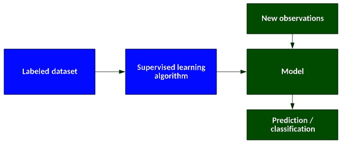
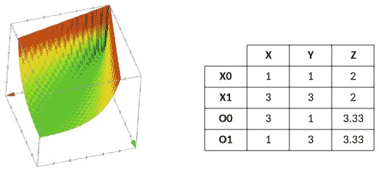
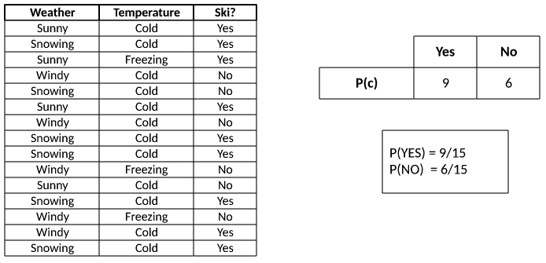
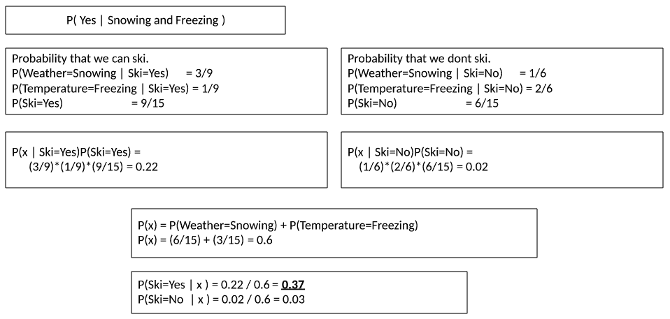
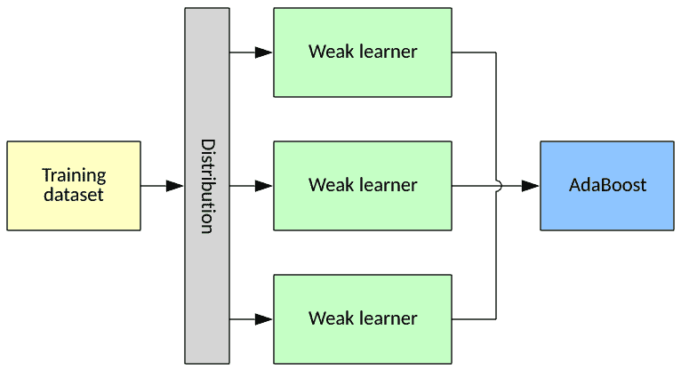

# 有监督学习模型

> 原文：[`developer.ibm.com/zh/articles/cc-supervised-learning-models/`](https://developer.ibm.com/zh/articles/cc-supervised-learning-models/)

有监督学习是一种方法，通过这种方法，您可以使用标记的训练数据来训练一个函数，然后将其推广到新示例。该训练过程需要一位评论员参与，能够指出函数是否正确，然后更改函数以生成正确的结果。经典示例包括通过反向传播算法训练的神经网络，但也存在许多其他算法。本教程探究了学习应用中的一些其他方法，如支持向量机 (SVM) 和概率分类器（朴素贝叶斯）。

在有监督学习中，训练数据进行了标记并由输入数据和所需输出组成，您可以使用这些数据创建一个函数（或模型）。监督以有用输出的形式出现，这反过来让您能够根据它产生的实际输出来调整函数。在训练后，您可以将此函数应用于新的观察值，生成理想情况下正确响应的输出（预测或分类）。

如一种典型的有监督学习算法中所示，有监督学习算法使用标记的数据集来生成模型。然后，您可以将此模型与新数据一起使用来验证模型的准确性，或者使用实时数据将该模型应用于生产环境。

##### 一种典型的有监督学习算法

本教程探究了流行的有监督学习方法。此讨论不包括神经网络，但您可以在“[人工智能、机器学习和认知计算入门指南](https://www.ibm.com/developerworks/cn/cognitive/library/cc-beginner-guide-machine-learning-ai-cognitive/index.html)”和“[神经网络深入剖析](https://www.ibm.com/developerworks/cn/cognitive/library/cc-cognitive-neural-networks-deep-dive/index.html)”中阅读有关该模型的更多信息。让我们先从 SVM 和朴素贝叶斯分类器开始。

## 支持向量机

SVM 是一种流行的有监督学习模型，可用于分类或回归。这种方法适用于高维空间（特征向量中有许多特征），并且可以有效地用于小型数据集。当在数据集上训练算法时，可以轻松高效地对新的观察值进行分类。这是通过构造一个或多个超平面来隔离两个类之间的数据集而实现的。

**注：**回想一下，超平面是一个比特征空间少一个维度的子空间。因此，如果给定由大小为 3 的特征向量定义的空间，超平面就是与该空间相交的二维 (2D) 平面。

您可以通过“[神经网络深入剖析](https://www.ibm.com/developerworks/cn/cognitive/library/cc-cognitive-neural-networks-deep-dive/index.html)”中的感知器讨论来构设超平面。

### 维度

SVM 模型的独特之处在于其分离数据集的方法。分析高维数据可能会产生问题，因此 Richard Bellman 创造了“维度灾难”这个短语。这个灾难指的是高维数据中出现的几种现象。在机器学习环境中，Gordon Hughes 发现由高维特征空间描述的较小数据集遭受了损失，因为预测能力会随着维度增加而下降，这是缺乏涵盖所有特征和所有可能特征值的数据导致的结果。

SVM 实际上增加了特征空间的维度以适当分隔该空间，而不是依赖于降维。让我们来看一个简单示例。

考虑一个由两个类（ `X` 和 `O` ）的四个样本组成的简单数据集。每个样本都代表一个 2D 特征向量，从具有两个类的简单数据集的图中可以清楚地看出，一个超平面（2D 空间的一条线）不能分隔这些样本。这个数据集不是线性可分的。

##### 具有两个类的简单数据集

SVM 通过将特征添加到作为其他现有特征向量的函数计算的特征向量（称为分类器）来解决线性问题。因此，从可以在两个维度上直观呈现的数据集中，可以获得存在于三个维度中的新数据集。（我选择了一个人为设计的函数来演示 SVM 如何选择其分类器。）

分类器函数及计算的分类器显示了该分类器函数及计算的分类器 (*z*)。如三维 (3D) 图中所示， `X` 样本存在于函数的低谷（其明显的低点），而 `O` 样本存在于函数的上侧。查看 *z* 值，很显然，您现在可以通过 *z* 维中的超平面来分隔两个类（具体地说，是在 *z* = 2.665 时）。

##### 分类器函数及计算的分类器

因此，通过在特征向量中添加一个特征（或第三维，如此处为可视化所示），您可以更改特征空间并允许简单分隔数据。

### 内核函数

这是一个人为设计的示例，但 SVM 可以通过几种不同的方式来完成其操作。分类器的目标是找到所谓的*最大间隔超平面*，用于划分观察值，以最大化超平面与每个类的最近点之间的距离。后一个约束被称为*最大间隔*。构成每个类中最近点的观察值被称为*支持向量*（因为它们支持超平面的边界）。寻找最大间隔非常重要，因为所得到的超平面不太可能导致过度拟合（模型与特定数据集的对应关系过于密切）。

这种技术被称为*核技巧*，即应用一个函数将低维空间转化为高维空间。SVM 根据数据使用各种内核（相似性函数），如点积（线性内核）和径向基函数。如果给定一个具有许多特征的数据集，并不会立即就知道哪个核函数最适合将非线性空间转换为线性空间。因此，SVM 通常会实施多个核函数，以便它可以尝试多个内核来识别最佳选项。

## 朴素贝叶斯分类器

朴素贝叶斯是一种允许以简单直接的方式构建分类器的方法。朴素贝叶斯的一个有趣的特征是，它适用于非常小的数据集。朴素贝叶斯分类器利用了有关数据的某些假设，即所有属性都是独立的，但即使有了这种简化，也仍然可以成功应用该算法来解决复杂问题。我们首先看一下贝叶斯定理，然后将处理一个简单的分类问题。

### 贝叶斯定理

贝叶斯定理中所示的贝叶斯定理提供了一种方法，可基于事先对可能与事件有关条件的了解来确定该事件的发生概率。它表示给定预测变量时目标 (*c*) 的概率（ *x*，称为*后验概率*），可以通过给定类时预测变量的概率（称为*似然度*）乘以该类的先验概率，再除以预测变量的先验概率（有时称为 *证据* ）计算得出。

##### 贝叶斯定理

更简单地说，贝叶斯定理允许在给定先验证据的情况下计算某个事件的条件概率（在先前事件 *x* 发生的情况下，出现目标 *c* ）。例如，给定一个收集的数据集，您可以使用贝叶斯来确定在给定其他属性（例如是阴天还是晴天）的情况下将会下雨的概率。

### 贝叶斯示例

我们通过一个示例来深入研究这个定理。在科罗拉多州，冬季最主要的休闲活动之一就是雪上运动。然而，并不是每一天都很适合滑雪。在是否适合滑雪的天气情况的简单表格中，我列出了 15 个天气和温度的观测值，并表明了当天是否适合滑雪。对于 *weather*，可能是 sunny、windy 或 snowing；对于 *temperature*，则可能是 cold 或 freezing。我的因变量是 ski 类，表示为 yes 或 no。通过给定一组条件，我想确定自己是否应该滑雪。该图的右侧是类概率，由每个类的计数来表示（在数据集中出现多少个 yes 或 no 的实例）。

##### 是否适合滑雪的天气情况的简单表格

接下来，我通过数据集构建频率表（即天气和温度的单独概率）。对于每个特征属性，我会计算给定类的每个特征的出现次数并计算总和 (`P(c)` 或 Yes/No）。该表格显示在数据集的频率表中。

##### 数据集的频率表

从这张表格中，我可以看到给定目标时每个事件的发生频率。

接下来，我将频率表转换为似然表 (`P(x|c)`)。从似然表的表中可以看出，不考虑所有其他变量，如果天气晴朗，我滑雪的概率为 `P(3/9)` ，不滑雪的概率为 `P(1/6)` 。我也可以将其写成 `P(Weather=Sunny | Ski=Yes) = 3/9` 和 `P(Weather=Sunny | Ski=No) = 1/6` 。

##### 似然表

现在，我具有应用贝叶斯定理所需的一切内容，并在给定一组天气条件的情况下预测某个类的概率（是否会去滑雪）。比如说，我想知道如果下雪并结冰，我是否会去滑雪。我将这个方程式写为 `P(Yes | Weather=Snowing & Temperature=Freezing)` 。

我首先收集似然 (`P(x | c`) 和类概率 (`P(c)`) 的数据。这些值直接来自似然表。因此，对于 `P(Yes)` 方面，我将 `P(Snowing|Yes)` 与 `P(Freezing|Yes)` 和 `P(Ski=Yes)` 相乘，这将是方程的分子。

最后一步是计算分母（ `P(x)` 或证据）。该计算对于两个类都是相同的，因此我计算一次。此步骤将使结果标准化。因此， `P(Snowing)` 为 5+1/15 (6/15)， `P(Freezing)` 为 1+2/15 (3/15)。计算分母显示了此计算。

##### 计算分母

最后一步是使用我刚刚计算出的分子和分母来计算概率。鉴于我的样本数据集，我采用条件 *x* 的最大概率，这就会得出我的答案（我很可能会滑雪）。

朴素贝叶斯可以很容易地从数据集中预测一组条件的类，并且可以比某些模型表现更出色。该方法的确假设预测变量是独立的，这并不总是适用于解决现实世界的问题。

## AdaBoost

*自适应提升*(AdaBoost) 是一种元算法，可应用于机器学习算法来提高其性能。AdaBoost 是自适应的，将会调整分类器以支持先前分类器的错误计算。AdaBoost 通过将多个“弱分类器”合并为一个“强分类器”来运行，其中弱分类器优于随机分类，而强分类器则会合并所有弱分类器的输出。根据每个弱学习器的准确性会为其分配一个权重。弱学习器越准确，分配的权重也就越高。

AdaBoost 还会更改针对分类器的训练样本分发情况。将为训练集中的样本分配权重，权重越高，就越有可能出现在对分类器的训练中。每个分类器都使用总训练数据的一个随机子集进行训练，这可能会出现部分重叠。分类不正确的训练样本的权重会增加，因此它们就会在下一次训练迭代中占更大部分（尝试在未来对其进行适当训练，请参阅典型的 AdaBoost 示例）。

##### 典型的 AdaBoost 示例

可以将 AdaBoost 定义为集成方法，因为它可以充当其他有监督学习算法集合的元算法。由于训练集是分散分配给弱学习器的，每个弱学习器都可以关注数据的一个或多个特征（作为分布的函数）。

因此，通过为弱学习器分配更多权重，使它们能够对数据集（或其子集）进行适当分类，同时将整体数据集的一个子集分配给这些弱学习器，使它们能够专注于特征子集，AdaBoost 可优化并提高其他有监督学习算法的准确性。

## 结束语

本教程探究了有监督学习的三个重要方法：SVM、朴素贝叶斯分类器和 AdaBoost。首先，在能够增加特征空间维度以将非线性问题转换为线性可分问题这个背景下讨论了 SVM。另外，还探究了使用朴素贝叶斯定理的概率分类器，该定理依赖于特征之间很强的独立性假设，但尽管如此，它仍然是实现分类的有用且强大的方法。最后，本教程探究了一种称为 AdaBoost 的提升技术，该技术依赖于多个独立分类器和一个加权方案，此方案可将数据集分发给分类器，然后根据其准确性进行加权。有监督学习的范畴非常广泛，而不只是涉及始终存在的神经网络。

本文翻译自：[Supervised learning models](https://developer.ibm.com/articles/cc-supervised-learning-models/)（2018-02-26）