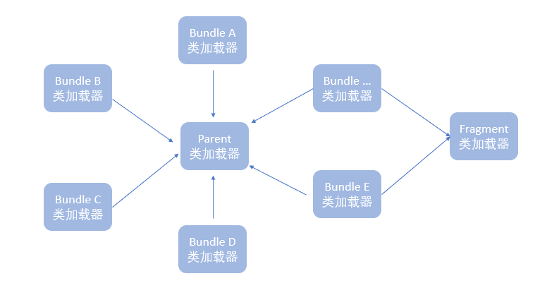
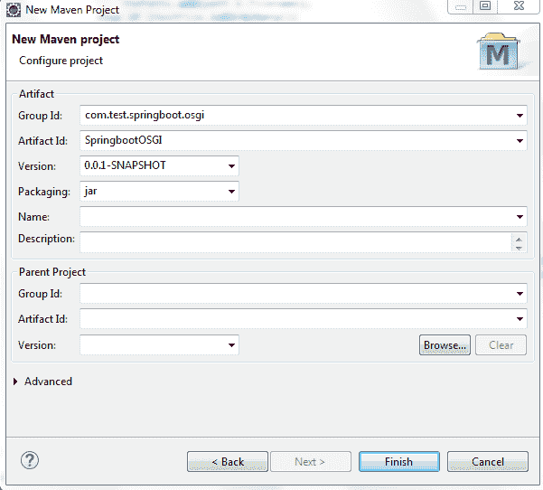
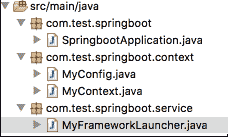
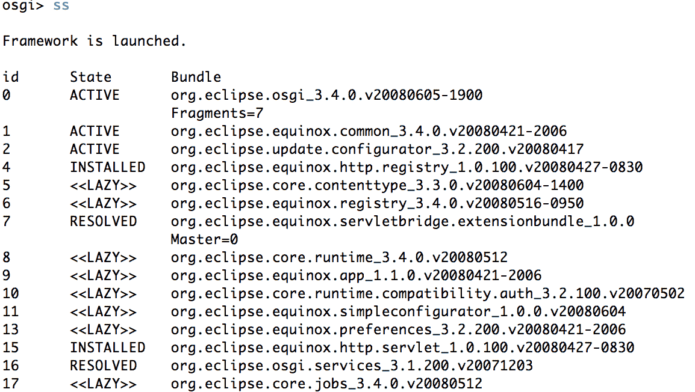
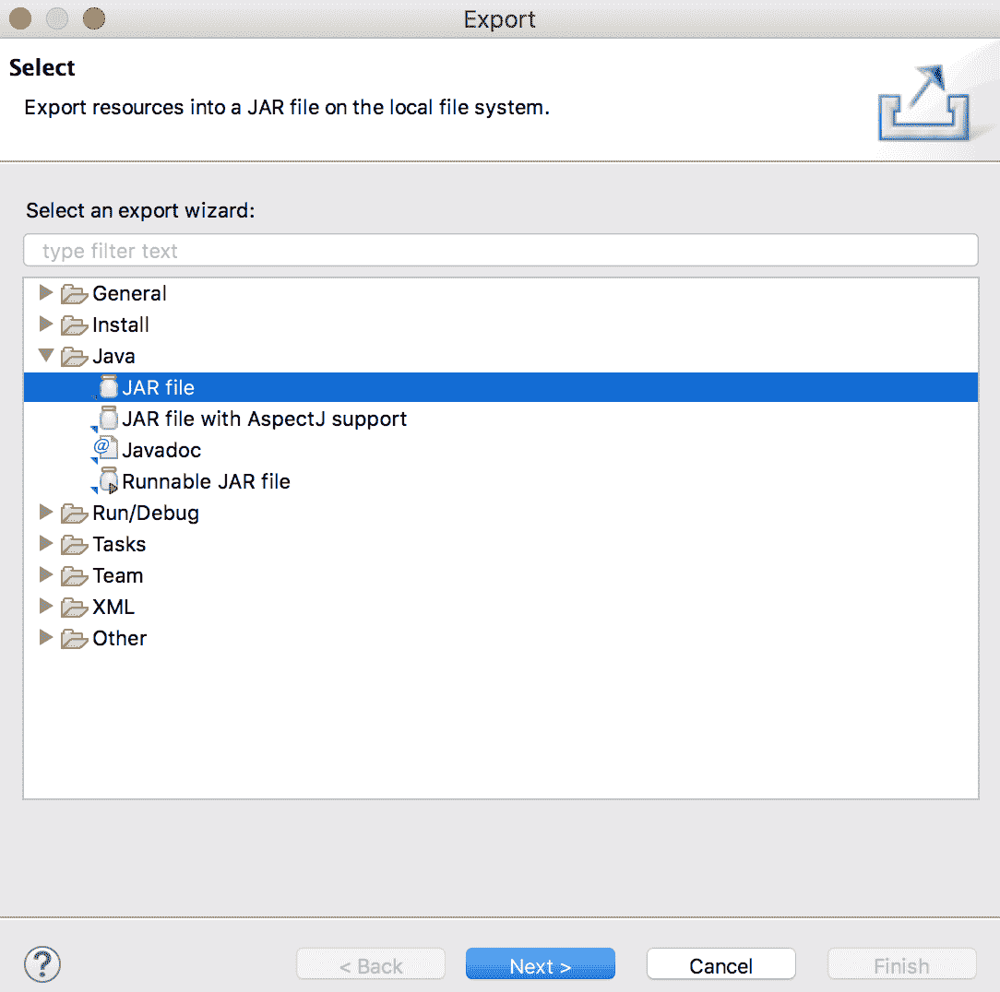
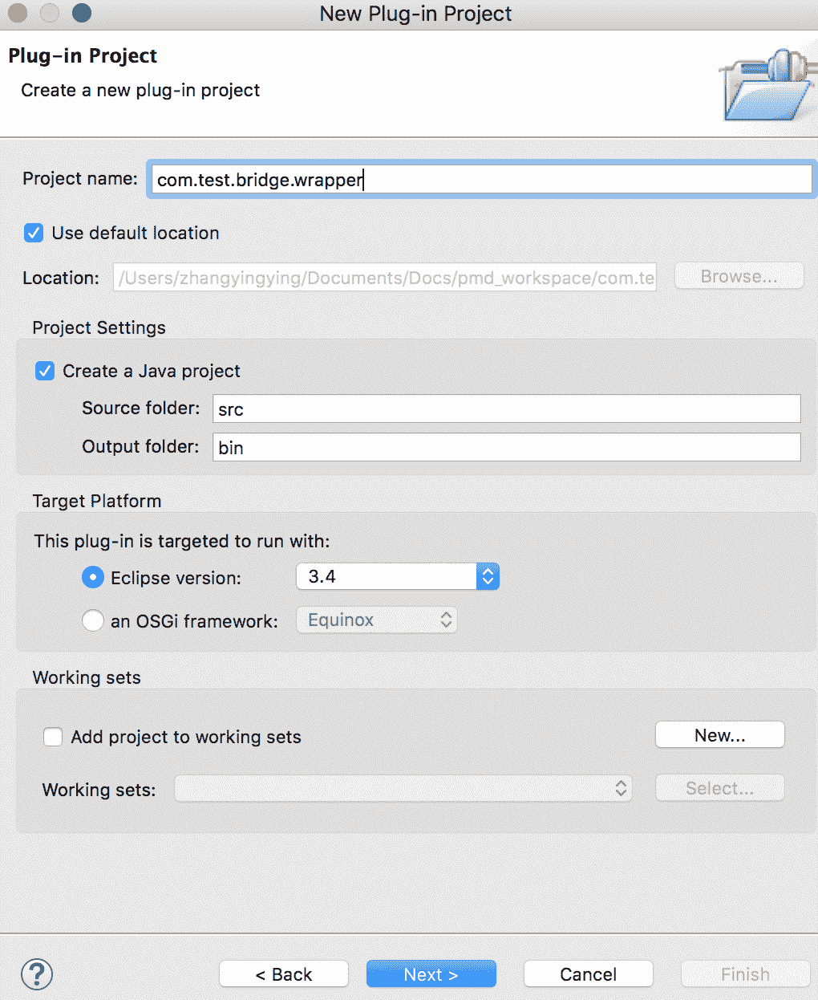
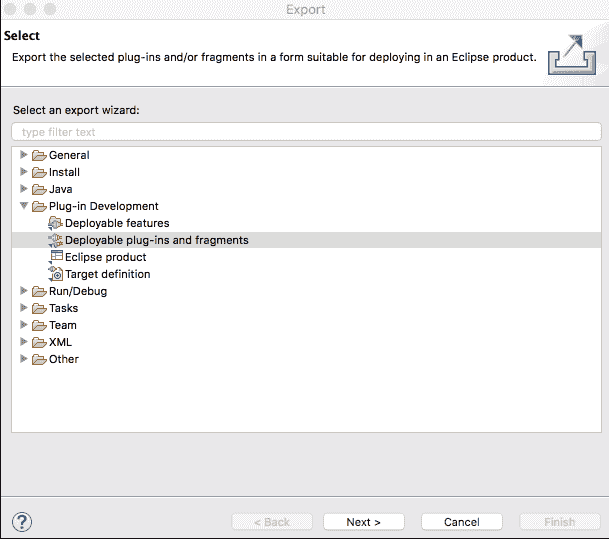
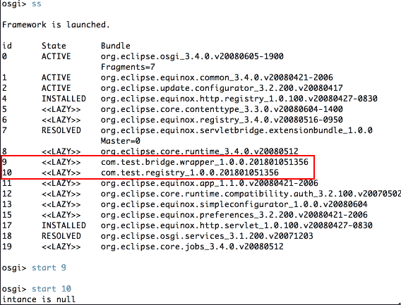
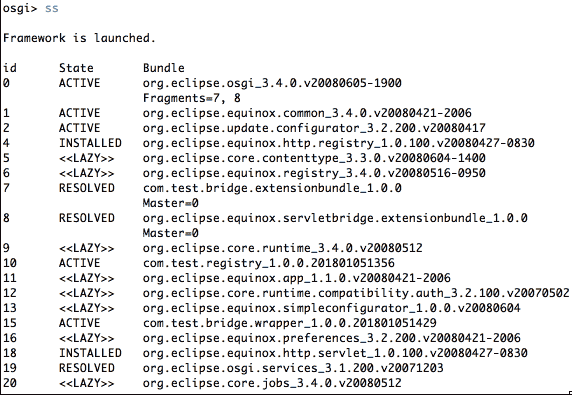
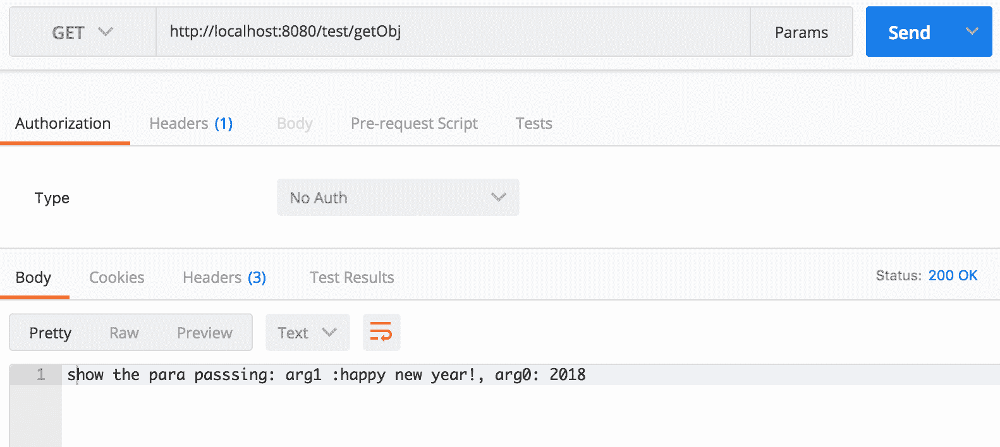

# Springboot Application 集成 OSGI 框架开发

> 原文：[`developer.ibm.com/zh/articles/j-springboot-application-integrated-osgi-framework-development/`](https://developer.ibm.com/zh/articles/j-springboot-application-integrated-osgi-framework-development/)

## Java 类加载器

### 启动类加载器 （Bootstrap ClassLoader）

是 Java 类加载层次中最顶层的类加载器，负责加载 JDK 中的核心类库，如：rt.jar、resources.jar、charsets.jar 等

### 扩展类加载器（Extension ClassLoader）

负责加载 Java 的扩展类库，默认加载 JAVA_HOME/jre/lib/ext/目下的所有 jar

### 应用类加载器（Application ClassLoader）

负责加载应用程序 classpath 目录下的所有 jar 和 class 文件。

ClassLoader 使用的是双亲委托模型来搜索类的，每个 ClassLoader 实例都有一个父类加载器的引用（不是继承的关系，是一个包含的关系），虚拟机内置的类加载器（Bootstrap ClassLoader）本身没有父类加载器，但可以用作其它 ClassLoader 实例的的父类加载器。当一个 ClassLoader 实例需要加载某个类时，它会试图亲自搜索某个类之前，先把这个任务委托给它的父类加载器，这个过程是由上至下依次检查的，首先由最顶层的类加载器 Bootstrap ClassLoader 试图加载，如果没加载到，则把任务转交给 Extension ClassLoader 试图加载，如果也没加载到，则转交给 App ClassLoader 进行加载，如果它也没有加载得到的话，则返回给委托的发起者，由它到指定的文件系统或网络等 URL 中加载该类。如果它们都没有加载到这个类时，则抛出 ClassNotFoundException 异常。否则将这个找到的类生成一个类的定义，并将它加载到内存当中，最后返回这个类在内存中的 Class 实例对象。

判别两个类是否相同，除了是相同的 class 字节码，还必须由同一类加载器加载。比如类 Example，javac 编译之后生成字节码文件 Example.class，ClassLoaderA 和 ClassLoaderB 这两个类加载器并读取了 Example.class 文件，并分别定义出了 java.lang.Class 实例来表示这个类，对于 JVM 来说，它们是两个不同的实例对象，但它们确实是同一份字节码文件，如果试图将这个 Class 实例生成具体的对象进行转换时，就会抛运行时异常 java.lang.ClassCastException: java.lang.Class cannot be cast to java.lang.Class

### OSGI 类加载器

OSGI 类加载器并不遵循 Java 的双亲委派模型，OSGi 为每个 bundle 提供一个类加载器，该加载器能够加载 bundle 内部的类和资源，bundle 之间的交互是从一个 bundle 类加载器委托到另一个 bundle 类加载器，所有 bundle 都有一个父类加载器。

Fragment bundle 是一种特殊的 bundle，不是独立的 bundle，必须依附于其他 bundle 来使用。通过 Fragment-Host 来指定宿主 bundle，同时也可以通过这种方式使用宿主的类加载器。

##### 图 1.OSGI 类加载器



OSGI 框架根据 Bundle 的 MANIFEST.MF 文件中描述的数据信息进行解析处理 Bundle 间的依赖关系。Fragment Bundle 的宿主 bundle 的检查在 bundle 解析之前已经完成，所以 Fragement Bundle 可以获取到宿主 bundle 的加载器信息。

## Equinox OSGI ServletBridge 实现原理及源码解析

### BridgeServlet 与 OSGI 容器

Equinox 提供了 servletbridge.jar 将 OSGI framework 和 servlet container 桥接起来，并且提供了一系列的 bundle 可以将 Equinox OSGI 应用嵌入到现有的 web 服务器中（eg. Tomcat）。servletbridge.jar 包含如下两个文件 （package: org.eclipse.equinox.servletbridge）

BridgeServlet – 负责请求处理

FrameworkLauncher – 负责 OSGI bundle 启动管理

Web 工程被加载到 web 容器中，比如 Tomcat，容器读取 web 工程 WEB-INF 目录下的 web.xml 文件，通过 servlet mapping 指定相应的类处理请求，如下所示：

##### 清单 1.BridgeServlet 配置

```
<servlet-name>equinoxbridgeservlet</servlet-name>
<servlet-class>org.eclipse.equinox.servletbridge.BridgeServlet</servlet-class> 
```

Web 容器自动加载 org.eclipse.equinox.servletbridge.BridgeServlet 这个 Servlet，所有发向 Web 容器的请求都被这个 Servlet 处理。

在 BridgeServlet 中的 init()方法中完成了对 OSGI 容器的启动。如下所示：

##### 清单 2.BridgeServlet 初始化

```
public void init() throws ServletException {
super.init();
setInstance(this);
String enableFrameworkControlsParameter = getServletConfig().getInitParameter("enableFrameworkControls");
this.enableFrameworkControls = ((enableFrameworkControlsParameter != null)
&& (enableFrameworkControlsParameter.equals("true")));
String frameworkLauncherClassParameter = getServletConfig().getInitParameter("frameworkLauncherClass");
if (frameworkLauncherClassParameter != null) {
try {
Class frameworkLauncherClass = getClass().getClassLoader().loadClass(frameworkLauncherClassParameter);
this.framework = ((FrameworkLauncher) frameworkLauncherClass.newInstance());
} catch (Exception e) {
throw new ServletException(e);
}
} else {
this.framework = new FrameworkLauncher();
}
this.framework.init(getServletConfig());
this.framework.deploy();
this.framework.start();
} 
```

初始化所用到的参数都是从 web.xml 中获取，如果指定了 frameworkLauncherClass 参数即启动器的实现类，则用该启动类作为框架启动器，如果没有指定，默认采用 org.eclipse.equinox.servletbridge. FrameworkLauncher 作为框架启动器。

OSGI 启动包括 init(ServletConfig),deploy(),start()三个方法，其中 init()完成了 config 和 context 等的一系列初始化工作，deploy 完成了相应的 osgi bundle 等的拷贝，以及相应的目录建立和桥接扩展器 bundle 的创建，start 完成了类加载器的切换和通过反射调用 EclipseStart 的 startup 方法对于 osgi 的启动。具体看源码分析。

##### 清单 3.osgi 框架初始化

```
void init(ServletConfig servletConfig) {
this.config = servletConfig;
this.context = servletConfig.getServletContext();
init();
}
String commandLine = this.config.getInitParameter("commandline");
String extendedExports = this.config.getInitParameter("extendedFrameworkExports"); 
```

Init 完成初始化所有资源配置的工作。

##### 清单 4.osgi 框架部署

```
public synchronized void deploy() {
if (this.platformDirectory != null) {
this.context.log("Framework is already deployed");
return;
}
File servletTemp = (File) this.context.getAttribute("javax.servlet.context.tempdir");
this.platformDirectory = new File(servletTemp, "eclipse");
if (!this.platformDirectory.exists()) {
this.platformDirectory.mkdirs();
}
copyResource("/WEB-INF/eclipse/configuration/", new File(this.platformDirectory, "configuration"));
copyResource("/WEB-INF/eclipse/features/", new File(this.platformDirectory, "features"));
File plugins = new File(this.platformDirectory, "plugins");
copyResource("/WEB-INF/eclipse/plugins/", plugins);
deployExtensionBundle(plugins);
copyResource("/WEB-INF/eclipse/.eclipseproduct", new File(this.platformDirectory, ".eclipseproduct"));
} 
```

deploy

首先将 configuration,features,plugins 等资源拷贝到临时目录下，然后部署一个 extension bundle，这一步非常重要，这个 bundle 会作为一个 fragment 附加到系统 bundle 之上，同时导出 org.eclipse.equinox.servletbridge 和其他一些 package。这一步的操作其实是进行了一个 classcloader 的切换操作，使得 package 名为 org.eclipse.equinox.servletbridge 的 bundle 可以获取到 system bundle 的 classloader,下面会进行程序演示。

##### 清单 5.osgi 框架启动

```
public synchronized void start(){
if (this.platformDirectory == null) {
throw new IllegalStateException("Could not start the Framework - (not deployed)");
}
if (this.frameworkClassLoader != null) {
this.context.log("Framework is already started");
return;
}
Map initalPropertyMap = buildInitialPropertyMap();
String[] args = buildCommandLineArguments();
ClassLoader original = Thread.currentThread().getContextClassLoader();
try {
System.setProperty("osgi.framework.useSystemProperties", "false");
URL[] osgiURLArray = { new URL((String)initalPropertyMap.get("osgi.framework")) };
this.frameworkClassLoader = new ChildFirstURLClassLoader(osgiURLArray, getClass().getClassLoader());
Class clazz = this.frameworkClassLoader.loadClass("org.eclipse.core.runtime.adaptor.EclipseStarter");
Method setInitialProperties = clazz.getMethod("setInitialProperties", new Class[] {Map.class });
setInitialProperties.invoke(null, new Object[] { initalPropertyMap });
Method runMethod = clazz.getMethod("startup", new Class[] { [Ljava.lang.String.class, Runnable.class });
runMethod.invoke(null, new Object[] { args });
this.frameworkContextClassLoader = Thread.currentThread().getContextClassLoader();
} catch (InvocationTargetException ite) {
Throwable t = ite.getTargetException();
if (t == null)
t = ite;
this.context.log("Error while starting Framework", t);
throw new RuntimeException(t.getMessage());
} catch (Exception e) {
this.context.log("Error while starting Framework", e);
throw new RuntimeException(e.getMessage());
} finally {
Thread.currentThread().setContextClassLoader(original);
}
} 
```

其中 buildInitialPropertyMap 完成了 osgi 容器的配置参数初始化，osgi.install.area,osgi.configuration.area,osgi.framework 等，osgi 启动的时候会自动读取这些参数的路径。args 参数是容器配置的 commandline 参数，是 osgi 命令行启动所需的参数。

ClassLoader original = Thread.currentThread().getContextClassLoader();

获取当前线程的 contextClassLoader(AppClassLoader)接下来等完成反射调用之后，还需要把 contextClassLoader 切换回去。

通过 ChildFirstURLClassLoader 加载 EclipseStarter,反射调用 setInitialProperties 和 startup 方法完成 osgi 启动。

此时 frameworkContextClassLoader 应为 org.eclipse.core.runtime.internal.adaptor.ContextFinder

完成 osgi 启动之后，finally 应该将当前线程的 contextClassLoader 切换回去。

### BridgeServlet 请求处理

BridgeServlet 作为 web 容器和 OSGI 的桥接方法即是 BridgeServlet 接收所有的 HTTP 请求同时将所有经过他的请求转发给 DelegateServlet，DelegateServlet 作为 OSGI 里面的 bundle，bundle 之前是可以互相沟通的，此时就完成了桥接工作，具体源码分析如下所示：

所有 HTTP 请求都发给 ServletBridge 的 service 方法处理。

##### 清单 6.BridgeServlet 请求处理

```
protected void service(HttpServletRequest req, HttpServletResponse resp)
throws ServletException, IOException{
if (req.getAttribute("javax.servlet.include.request_uri") == null) {
String pathInfo = req.getPathInfo();
if ((pathInfo == null) && (isExtensionMapping(req.getServletPath()))) {
req = new ExtensionMappingRequest(req);
}
if ((!this.enableFrameworkControls) ||
(pathInfo == null) || (!pathInfo.startsWith("/sp_")) ||
(!serviceFrameworkControls(req, resp))) {}
}
else
{
String pathInfo = (String)req.getAttribute("javax.servlet.include.path_info");
if ((pathInfo == null) || (pathInfo.length() == )) {
String servletPath = (String)req.getAttribute("javax.servlet.include.servlet_path");
if (isExtensionMapping(servletPath)) {
req = new IncludedExtensionMappingRequest(req);
}
}
}
ClassLoader original = Thread.currentThread().getContextClassLoader();
HttpServlet servletReference = acquireDelegateReference();
if (servletReference == null) {
resp.sendError(404, "BridgeServlet: " + req.getRequestURI());
return;
}
try {   Thread.currentThread().setContextClassLoader(this.framework.getFrameworkContextClassLoader());
servletReference.service(req, resp);
} finally {
releaseDelegateReference();
Thread.currentThread().setContextClassLoader(original);
}
} 
```

首先获取通过 acquireDelegateReference 获取 delegate，这个 delegate 是如何初始化的呢？

##### 清单 7.BridgeServlet 注册接口

```
public static synchronized void registerServletDelegate(HttpServlet servletDelegate) {
if (instance == null) {
return;
}
if (servletDelegate == null) {
throw new NullPointerException("cannot register a null servlet delegate");
}
synchronized (instance) {
if (instance.delegate != null) {
throw new IllegalStateException("A Servlet Proxy is already registered");
}
try {
servletDelegate.init(instance.getServletConfig());
} catch (ServletException e) {
instance.getServletContext().log("Error initializing servlet delegate", e);
return;
}
instance.delegate = servletDelegate;
}
} 
```

我们注意到有这样一个方法对 delegate 进行了初始化，这个方法是在另外一个 osgi bundle 中被调用，在 org.eclipse.equinox.http.servletbridge 的 Activator 的 start 方法中对 delegate 进行了初始化

##### 清单 8.注册委托对象

```
public void start(BundleContext context)throws Exception
{
this.httpServiceServlet = new HttpServiceServlet();
BridgeServlet.registerServletDelegate(this.httpServiceServlet);
} 
```

但我们注意到在 org.eclipse.equinox.http.servletbridge 的 bundle 中并没有对与 BridgeServlet 的 jar 包引用，那他是如何调用到 BridgeServlet 的 registerServletDelegate 的方法的呢？但是在其 MANIFEST 描述文件中有如下：

Import-Package: org.eclipse.equinox.servletbridge;version=”1.0.0″

并且 Equinox 还提供了一个 bundle 名为 org.eclipse.equinox.servletbridge,那么这个 bundle 跟我们加入到 classpath 的 servletbridge.jar 是什么关系呢？实际上这个 bundle 只是将 servletbridge.jar 给包装起来，并将其导出

Export-Package: org.eclipse.equinox.servletbridge;version=”1.1.0″

由此我们了解了 ServletBridge 的工作原理，因此我们可以实现 OSGI 直接嵌入到 Springboot Application 中。

## Spring boot 启动 OSGI bundle

根据上面的分析，接下来我们完成在 Springboot 中 OSGI 的启动。

首先创建一个 maven 工程

##### 图 2.Springboot 工程创建



pom.xml 添加对 spring-boot-starter-web 的依赖

##### 图 3\. Springboot 工程目录



SpringbootApplication 作为启动类，MyConfig 和 MyContext 完成 OSGI 启动的配置工作，分别实现 ServletConfig 和 ServletContext 接口，MyFrameworkLauncher 继承 org.eclipse.equinox.servletbridge.FrameworkLauncher 来完成 OSGI 的启动工作。

我们将需要启动的 OSGI bundle 放到当前工程的 temp 目录下，目录结构如下所示：

##### 图 4\. OSGI 插件目录


SpringbootApplication 实现如下所示：

##### 清单 9.SpringbootApplication 实现

```
@SpringBootApplication(scanBasePackages = { "com.test.springboot" })
public class SpringbootApplication {
@Autowired
MyFrameworkLauncher framework;
public static void main(String[] args) {
MyBridge bridge = new MyBridge();
bridge.init();
System.out.println("init classloader"+ SpringbootApplication.class.getClassLoader());
SpringApplication.run(SpringbootApplication.class, args);
}
} 
```

MyContext 需要实现 getResource 和 getAttribute 方法 ，分别来指定 osgi bundle 的的读取路径和存储路径，为简单操作，这里我都指定当前工程下的 temp 路径下,分别实现 MyContext 类中 getAttribute 和 getResources 方法。

MyFrameworkLauncher 需要初始化父类的 config 和 context 变量，并且调用父类的 deploy 和 start 方法来启动 osgi bundle。

##### 清单 10.OSGI 框架实现

```
@Service("framework")
public class MyFrameworkLauncher extends FrameworkLauncher{
@PostConstruct
public void initialize() {
this.config = new MyConfig();
this.context = config.getServletContext();
File servletTemp = (File) this.context.getAttribute("javax.servlet.context.tempdir");
File platformDirectory = new File(servletTemp, "eclipse");
File plugins = new File(platformDirectory, "plugins");
deployBridgeExtensionBundle(plugins);
this.deploy();
this.start();
} 
```

运行 SpringbootApplication 如下所示：

##### 图 5\. Springboot 运行结果


##### 图 6\. OSGI 命令行



我们看到 OSGI bundle 已经在 Springboot Application 中 run 起来了。

## Spring boot 与 OSGI bundle 交互

想要完成 springboot 与 OSGI bundle 的交互，我们按照 servletbridge 的原理来实现类似的机制，我们也为我们的桥接插件部署一个扩展的插件使得桥接插件可以获取到系统的类加载器。

首先我们建立一个 Bridge 项目 SpringbootBridge ，分别提供 registerDelegat 和 acquireDelegateReference 方法。

##### 清单 11\. registerDelegate 接口

```
public static synchronized void registerDelegate(Object delegate) {
if (instance == null) {
System.out.println("intance is null");
return;
}
if (delegate == null) {
System.out.println("delegate is null");
throw new NullPointerException("Cannot register a null delegate");
}
synchronized (instance) {
if (instance.delegate != null) {
System.out.println("A delegate is already registered");
throw new IllegalStateException("A delegate is already registered");
}
instance.delegate = delegate;
}
} 
```

acquireDelegateReference 方法

```
public synchronized Object acquireDelegateReference() {
if (this.delegate != null)
this.delegateReferenceCount += 1;
return this.delegate;
} 
```

将这个 Java 项目导出 jar 包 com.test.bridge.jar

##### 图 7\. 导出 JAR 包



接下来在 Eclipse for RCP and RAP Developers 中创建一个 bundle 将我们的 com.test.bridge.jar 封装起来，并且导出。

##### 图 8\. Bundle 创建



##### 清单 12\. MANIFEST.MF 文件

```
Manifest-Version: 1.0
Bundle-ManifestVersion: 2
Bundle-Name: Bridge
Bundle-SymbolicName: com.test.bridge.wrapper
Bundle-Version: 1.0.0.qualifier
Bundle-Activator: com.test.bridge.Activator
Bundle-Vendor: TEST
Require-Bundle: org.eclipse.core.runtime
Bundle-RequiredExecutionEnvironment: JavaSE-1.6
Bundle-ActivationPolicy: lazy
Export-Package: com.test.bridge
Bundle-ClassPath: com.test.bridge.jar,
. 
```

接下来需要创建一个 bundle 来初始化委托的对象 delegate(com.test.registry) 首先需要导入 com.test.bridge 添加到 classpath,然后调用桥接类的注册方法来注册 delegate 对象。

##### 清单 13\. 注册委托对象

```
public void start(BundleContext bundleContext) throws Exception {
Activator.context = bundleContext;
MyBridge.registerDelegate(new Integer(123456));
} 
```

##### 清单 14\. MANIFEST.MF 文件

```
Manifest-Version: 1.0
Bundle-ManifestVersion: 2
Bundle-Name: Registry
Bundle-SymbolicName: com.test.registry
Bundle-Version: 1.0.0.qualifier
Bundle-Activator: com.test.registry.Activator
Bundle-Vendor: TEST
Require-Bundle: org.eclipse.core.runtime
Bundle-RequiredExecutionEnvironment: JavaSE-1.6
Bundle-ActivationPolicy: lazy
Import-Package: com.test.bridge 
```

将这两个 bundle 导出跟其他 osgi bundle 放在一起（本文目录为${工程目录}/temp/eclipse/plugins）

##### 图 9\. 导出 plugins



此时我们再回归到 SpringbootOSGI 项目，初始化 MyBridge 对象然后调用 acquireDelegateReference，读者可能疑问这里，在 SpringbootOSGI 项目和注册插件中我们同时添加了对于 com.test.bridge.jar 的依赖，在插件注册时获取的是哪一个呢？首先添加 jar 包的依赖解决了两边的编译问题，在运行时，我们在 SpringbootOSGI 项目一启动就对 Mybridge 类进行了初始化，此时注册类已经获取了系统的类加载器也就是 SpringbootOSGI 中的 App 类加载器，所以注册类插件可以获取到 Mybridge 对象，同时注册类插件注册了委托对象，那么自然可以通过 acquireDelegateReference 获取到注册的委托对象，下面我们看程序演示：

获取 delegateReference。

##### 清单 15\. SpringbootApplication 实现

```
@SpringBootApplication(scanBasePackages = { "com.test.springboot" })
public class SpringbootApplication {
@Autowired
MyFrameworkLauncher framework;
public static void main(String[] args) {
MyBridge bridge = new MyBridge();
bridge.init();
System.out.println("init classloader"+ SpringbootApplication.class.getClassLoader());
SpringApplication.run(SpringbootApplication.class, args);
}
} 
```

##### 清单 16\. Springboot REST API

然后提供 REST 获取 delegate

```
@RestController
@RequestMapping("/test")
public class TestRestController {
@RequestMapping(value = "/getObj", method = RequestMethod.GET)
@ResponseBody
public Object test(){
Object obj = MyBridge.getInstance().acquireDelegateReference();
System.out.println(obj);
return obj;
}
} 
```

run SpringbootApplication 启动 OSGI bundle

##### 图 10\. 启动 bundle



可以看到 bundle 已经以 lazy 方式启动了，但是启动 registry 的时候发现 instance is null

我们已经在 SpringbootApplication 中对 MyBridge 进行了实例化，但是在 OSGI bundle (com.test.registry)去注册 delegate 的时候，MyBridge 的实例却是 null，这是因为 SpringbootApplication 和 com.test.registry 的类加载器是不相同的，SpringbootApplication 是 AppClassLoader, com.test.registry 是默认 bundle 加载器，那么解决方案就是按照上述说的，我们需要创建一个 fragment bundle，将其挂在到系统 bundle 上面，那么就能将加载器切换为 AppClassLoader.具体 fragment bundle 的创建如下所示。并再次 run SpringbootApplication 启动 OSGI bundle。

##### 清单 17\. 部署 fragement 插件

```
private void deployBridgeExtensionBundle(File plugins){
File extensionBundle = new File(plugins, "com.test.bridge.extensionbundle.jar");
File extensionBundleDir = new File(plugins, "com.test.bridge.extensionbundle");
if ((extensionBundle.exists()) || ((extensionBundleDir.exists()) && (extensionBundleDir.isDirectory()))) {
return;
}
Manifest mf = new Manifest();
Attributes attribs = mf.getMainAttributes();
attribs.putValue("Manifest-Version", "1.0");
attribs.putValue("Bundle-ManifestVersion", "2");
attribs.putValue("Bundle-Name", "bridge Extension Bundle");
attribs.putValue("Bundle-SymbolicName", "com.test.bridge.extensionbundle");
attribs.putValue("Bundle-Version", "1.0.0");
attribs.putValue("Fragment-Host", "system.bundle; extension:=framework");
String packageExports = "com.test.bridge";
attribs.putValue("Export-Package", packageExports);
try {
JarOutputStream jos = null;
try {
jos = new JarOutputStream(new FileOutputStream(extensionBundle), mf);
jos.finish();
} finally {
if (jos != null) {
jos.close();
}
}
} catch (IOException e) {
System.out.println("Error generating extension bundle" + e);
}
} 
```

##### 图 11\. Bundle 状态



发送 GET 请求

[`localhost:8080/test/getObj`](http://localhost:8080/test/getObj)

##### 图 12\. 发送 GET 请求


如果需要 osgi bunld 默认直接启动，只需要在 temp/eclipse/configuration/config.ini 中添加相应的启动配置。

osgi.bundles=xxx@start

在我们上述例子中，我们只是传递了一个 Integer 对象，如果此时我们需要传递我们自定义对象，并且需要调用相应的方法，我们需要怎么做呢？首先我们应该定义一个接口工程，在 Springboot 项目和注册 bundle 中分别添加对于接口的依赖，同时在注册 bundle 中对该接口进行实现，并在注册 bundle 的启动方法中将实现了的对象传递给桥接对象，这样在 Springboot 项目中我们就可以获取到该对象，并且进行方法的调用。

首先我们定义一个 Java 项目 spring-boot-interface

定义接口 APIInterface，添加接口方法 testFun

##### 清单 18\. 自定义接口

```
package com.test;
public interface APIInterface {
String testFun(int a1,String a2);
} 
```

将这个 Java 项目导出 jar 包 com.test.interface.jar

接下来在 Eclipse for RCP and RAP Developers 中创建一个 bundle 将我们的 com.test.interface.jar 封装起来，并且将该接口 package 进行导出。

##### 清单 19\. MANIFEST.MF 文件

```
Manifest-Version: 1.0
Bundle-ManifestVersion: 2
Bundle-Name: Wrapper
Bundle-SymbolicName: com.test.inter.wrapper
Bundle-Version: 1.0.0.qualifier
Bundle-Activator: com.test.inter.wrapper.Activator
Bundle-Vendor: TEST
Bundle-RequiredExecutionEnvironment: JavaSE-1.8
Import-Package: org.osgi.framework;version="1.3.0"
Bundle-ActivationPolicy: lazy
Bundle-ClassPath: com.test.inter.jar,
.
Export-Package: com.test.inter 
```

接下来需要在 com.test.registry 中添加对 APIInterface 的实现，并且作为 delegate 对象注册以供使用。

##### 清单 20\. 自定义接口实现

```
public class MyInterfaceImpl implements APIInterface {
@Override
public String testFun(int arg0, String arg1) {
String message = "show the para passsing: arg1 :" + arg1 +", arg0: "+ arg0;
return message;
}
} 
```

接下来我们将实现的这个对象作为委托对象注册到桥接类中。

##### 清单 21\. 注册实现类

```
public void start(BundleContext bundleContext) throws Exception {
Activator.context = bundleContext;
MyInterfaceImpl inImpl = new MyInterfaceImpl();
MyBridge.registerDelegate(inImpl);
} 
```

下面我们将 com.test.registry,com.test.bridge.wrapper,com.test.api.inter.wrapper 这三个插件导出 bundle 的 jar 包，与 OSGI 其他 bundle 放到同一目录下，在本文中为${SpringbootOSGI}/temp/eclipse/plugins

接下来我们在 SpringbootOSGI 中添加相应包的依赖和方法的调用，如下所示：

##### 清单 22\. Springboot REST API

```
@RestController
@RequestMapping("/test")
public class TestRestController {
@RequestMapping(value = "/getObj", method = RequestMethod.GET)
@ResponseBody
public Object test(){
APIInterface obj = (APIInterface) MyBridge.getInstance().acquireDelegateReference();
String result = obj.testFun(2018, "happy new year!");
return result;
}
} 
```

如果此时我们运行 springbootOSGI 项目，同时把相应的 bundle 启动会发现报错

java.lang.ClassCastException: com.test.api.inter.impl.MyInterfaceImpl cannot be cast to com.test.api.inter.APIInterface

这是因为不同的 classloader 导致的，因为我们缺少了将 interface 的 bundle 挂载到系统的 bundle 上面。

##### 清单 23\. 部署 fragement bundle

```
private void deployInterfaceExtensionBundle(File plugins){
File extensionBundle = new File(plugins, "com.test.api.inter.extensionbundle.jar");
File extensionBundleDir = new File(plugins, "com.test.api.inter.extensionbundle");
if ((extensionBundle.exists()) || ((extensionBundleDir.exists()) && (extensionBundleDir.isDirectory()))) {
return;
}
Manifest mf = new Manifest();
Attributes attribs = mf.getMainAttributes();
attribs.putValue("Manifest-Version", "1.0");
attribs.putValue("Bundle-ManifestVersion", "2");
attribs.putValue("Bundle-Name", "interface Extension Bundle");
attribs.putValue("Bundle-SymbolicName", "com.test.api.inter");
attribs.putValue("Bundle-Version", "1.0.0");
attribs.putValue("Fragment-Host", "system.bundle; extension:=framework");
String packageExports = "com.test.api.inter";
attribs.putValue("Export-Package", packageExports);
try {
JarOutputStream jos = null;
try {
jos = new JarOutputStream(new FileOutputStream(extensionBundle), mf);
jos.finish();
} finally {
if (jos != null) {
jos.close();
}
}
} catch (IOException e) {
System.out.println("Error generating extension bundle" + e);
}
} 
```

测试 API 启动情况

发送 GET 请求

[`localhost:8080/test/getObj`](http://localhost:8080/test/getObj)

##### 图 13\. 发送 GET 请求



## 常见错误

#### java.lang.ClassCastException/ Loader constraint violation :loader

不同的 classloader 即使是相同的 class 文件也不是同一实例。解决方案即为使用同一 classloader，在这个项目中，报出此错是因为 bundle 和 springboot application 不是同一个 classloader 来加载的，需要为 bundle 建立一个 Fragement bundle 并且挂在到 system bundle 下。

#### NullPointerException

报出此错一般是因为桥接的 instance 没有被初始化，或者调用注册的 bundle 没有启动注册。

#### Load Class Circle Error

在使用 Springboot 打包 jar 包之后，如果我们使用的 OSGI 的 plugins 是 3.4 版本的话，启动失败，ChildFirstClassLoader 与 URLClassloader 互相调用时出现了死循环，这个问题在 osgi 更高版本已经得到了解决。

## 结束语

本文从 Java 类加载器说起，探讨了 OSGI 的类加载器原理并对 Equinox 中的 Servletbridge 原理实现进行了详细的研究，同时扩展到使用这一原理如何在 Spring boot 应用中嵌入 OSGI 开发和 Spring boot 应用如何与 OSGI 插件之间进行相互调用。使用一个例子来对这一系列的使用做了进一步的讲解。并对它的实现方法做了进一步的探讨，这些探讨对于将 OSGI 应用嵌入到任何其他的系统中是一个启发和帮助，希望有兴趣的读者可以做进一步的了解和实现。