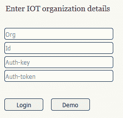
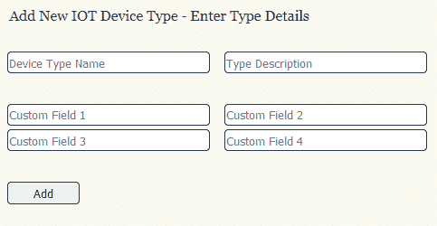
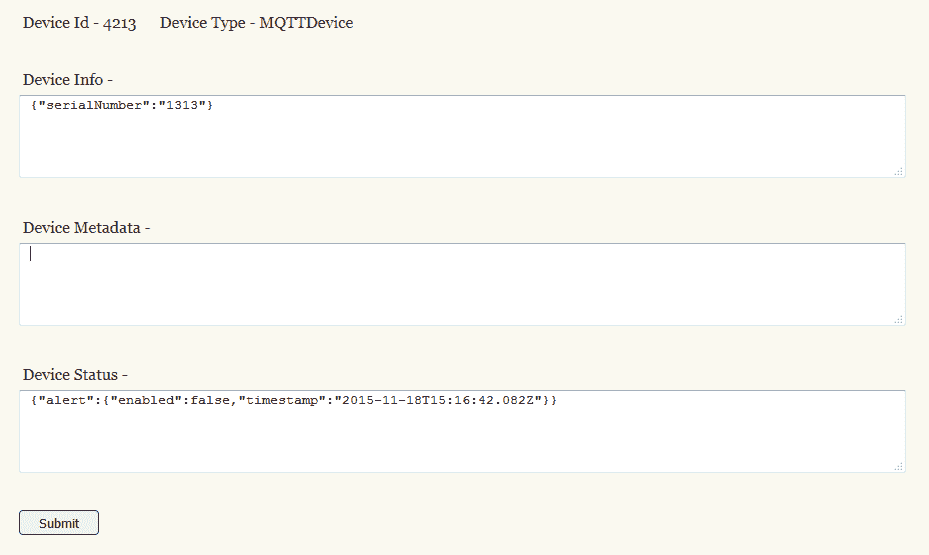
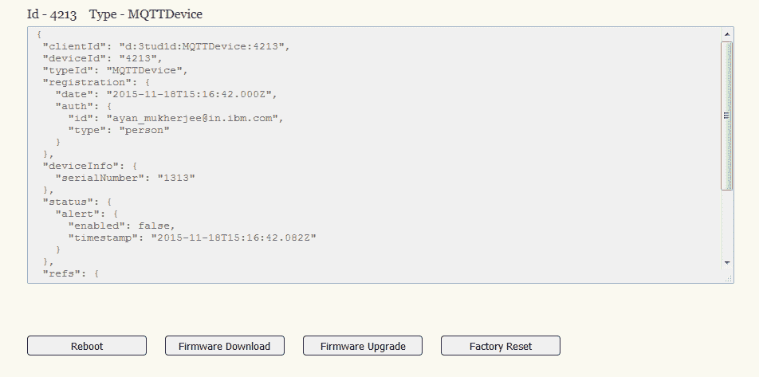
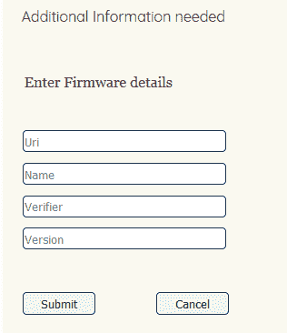
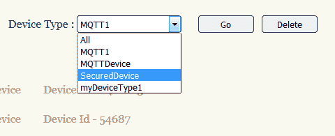

# 治理您的 IoT 设备

> 原文：[`developer.ibm.com/zh/articles/iot-governance-02/`](https://developer.ibm.com/zh/articles/iot-governance-02/)

为了管理组织中的所有 IoT 计划，并从这些计划中获得最大收益，进行 IoT 治理刻不容缓。在此系列的[**第 1 部分**](https://www.ibm.com/developerworks/cn/iot/library/iot-governance-01/index.html)中，我们讨论了 IoT 治理实践，介绍了 IoT 治理模式如何推动所有 IoT 计划间的标准化进程并实施治理流程。在本文（即此系列的第 2 部分）中，我们将介绍设备治理方面的需求。

IoT 设备治理为 IoT 设备管理提供指导，确定如何采用设备（和相关的监控数据），以及随着时间的推移，将如何管理这些设备。对于本文，我们使用 IBM Watson IoT Platform 的 REST API 开发了一个样本应用，用于在 IBM Watson IoT Platform 中显示设备生命周期和设备管理支持。

## 在整个 IoT 设备生命周期内治理 IoT 设备

复杂的 IoT 解决方案通常包括大量的 IoT 设备。IoT 治理模式必须考虑 IoT 设备的生命周期，它包括以下步骤或阶段：

1.  **为您的架构选择和采购适当的 IoT 设备。** IoT 设备涵盖甚广，从容量有限的小型传感器到高级微型计算机，皆囊括在内。必须根据像兼容性（如支持的协议、连接、大小或安全性）、提供的功能、性能或成本这样的标准，选择和采购适当的 IoT 设备。
2.  **部署、配置和管理 IoT 设备。** 此阶段包括创建设备类型（如果它尚不存在）、使用适当的协议将设备添加到 IoT 平台中、配置认证，以及更新设备属性和位置。
3.  **升级 IoT 设备，包括升级固件、应用安全补丁或更新设备上安装的脚本。** 此阶段仅适用于支持设备管理操作的托管设备。IoT 平台正在广泛探索这一阶段，正在评估更多设备管理操作。目前，IBM Watson IoT Platform 支持设备重新引导、恢复出厂设置、固件下载和固件升级操作。本文的后续部分会提供有关此阶段和设备管理操作的更多详细信息。
4.  **停用设备，例如，使设备脱机或将其从 IoT 系统中完全移除。** 在此阶段，可以从 IoT 平台和 IoT 系统中删除设备和设备类型（如果需要）。
5.  **评估设备使用方式、收集哪些数据，并确定为了在 IoT 系统中继续使用所需的变更。** 诸如传感器和微型计算机之类的 IoT 设备可以收集来自各行各业不同应用的广泛数据。在 IoT 系统中使用这些应用时，就架构角度而言，务必要高效分析和使用从 IoT 设备收集而来的数据。该阶段中会使用许多不同的工具和技术，这也涉及许多脱机活动，如分析收集的数据、创建业务规则和执行业务规则。

许多 IoT 平台都提供了配置、升级或停用设备等核心设备管理功能，并且还集成了设备管理协议。您可以阅读“[管理您的 IoT 设备](https://www.ibm.com/developerworks/cn/iot/library/iot-lp301-iot-device-management/index.html)”这篇 IBM Developer 文章，了解有关设备管理协议和设备管理功能的更多信息。

## Device Management Dashboard 演示应用的概述

由于管理 IoT 设备是设备治理实践的核心任务，因此了解如何在 IoT 平台中实现设备管理功能至关重要。为了演示如何在 IBM Watson IoT Platform 中运行设备管理，我们开发了一个名为 Device Management Dashboard 的样本应用。该样本应用是一个简单的交互式前端应用，可用于管理 IoT 设备和操作。使用 Node.js 及 Watson IoT Platform 设备管理功能和 API 开发了此仪表板。

要运行演示应用，请单击 **Run the app** 按钮。要下载或查看演示应用的代码，请单击 **Get the code** 按钮。

[Get the code](https://github.com/ayan13s/IOT-Device-Management/tree/master/IOT-Device-Management)[Run the app](https://iot-device-management.mybluemix.net/)

Watson IoT Platform 仪表板支持我们在本文中讨论的大多数设备管理操作。但是，此演示应用的目标是专门展示如何使用 Watson IoT Platform 中提供的设备管理 REST API，根据您的 IoT 解决方案需求以编程方式管理设备。

在登录屏幕中，您需要输入 IoT 组织的详细信息或者选择演示方式。在演示方式下，将使用样本组织和空间来演示应用的功能。单击 **Demo** 按钮。



仪表板主屏幕会显示组织的设备类型和设备。该主屏幕上提供了用于管理 IoT 设备类型和设备的不同操作。


在后续章节中，我们将在 IoT 设备生命周期背景下检查各项设备管理功能。我们将显示仪表板演示应用中的多个屏幕，同时还将展示用于完成设备管理操作的 Node.js 代码片段。

### 在 Node.js 中初始化 IoT 应用客户端

必须先初始化 Node.js 客户端，然后才能调用 Watson IoT Platform 的设备管理 API，如以下代码片段所示：

```
var IBMIoTF = require('ibmiotf');

var appClientConfig = {
          org: req1.body.input_org,
          id: req1.body.input_id,
          "auth-key": req1.body.input_key,
          "auth-token": req1.body.input_token
        };

var appClient = new IBMIoTF.IotfApplication(appClientConfig); 
```

### 获取组织详细信息

使用以下代码收集组织的详细信息。

```
appClient.getOrganizationDetails().then (function onSuccess (response) {
    console.log("Success");
    console.log(response);
}, function onError (error) {
    console.log("Fail");
    console.log(error);
}); 
```

## 部署或配置设备

在为整体 IoT 架构采购了 IoT 设备之后，必须在您的组织中部署和配置这些设备。部署和配置是 IoT 设备生命周期的第 2 阶段。此阶段涉及定义和添加设备类型、添加设备以及更新与设备关联的元数据。

### 确定组织中使用的设备类型

使用以下代码获取组织中注册的所有设备类型的列表。

```
appClient.getAllDeviceTypes().then (function onSuccess (response) {
    console.log("Success");
    console.log(response);
}, function onError (error) {
    console.log("Fail");
    console.log(error);
}); 
```

### 列出特定设备类型的设备

使用以下代码获取特定设备类型的所有设备的列表。

```
appClient.listAllDevicesOfType(selectedDeviceType).then (function onSuccess (response) {
    console.log("Success");
    console.log(response);
}, function onError (error) {
    console.log("Fail");
    console.log(error);
}); 
```

上一个屏幕是这些调用所产生的输出组合。

### 添加设备类型

您可以单击 **Add Device Type** 按钮来添加新设备类型。



您可以使用以下代码来添加设备类型。

```
var type = req6.body.type_name;
var desc = req6.body.type_desc;
var metadata = {"customField1": req6.body.custom_field1, "customField2": req6.body.custom_field2, "customField3": req6.body.custom_field3, "customField4": req6.body.custom_field4};
var deviceInfo = {};

appClient.
    registerDeviceType(type,desc,deviceInfo,metadata).then (function onSuccess (argument) {
        console.log("Success");
        res6.redirect(307,'/refresh-org');
}, function onError (argument) {
        console.log("Fail");
        res6.redirect(307,'/refresh-org');
 }); 
```

### 添加设备

单击 Add Device 按钮来添加设备。


在添加设备屏幕中，只有 Device Id、Auth Token 和 Device Type 是必需参数。所有其他参数都是可选参数。

使用以下代码添加设备。

```
var type = req6.body.type_select;
var deviceId = req6.body.device_id;
var authToken = req6.body.auth_token;
var metadata = {"customField1": req6.body.custom_field1, "customField2": req6.body.custom_field2};
var deviceInfo = {"serialNumber" : req6.body.serial_number, "manufacturer":
req6.body.manufacturer, "model" : req6.body.model, "deviceClass": req6.body.device_class, "descriptiveLocation": req6.body.descriptive_location, "fwVersion":
req6.body.firmware_version, "hwVersion": req6.body.hardware_version};
var location = {"longitude": req6.body.longitude, "latitude": req6.body.latitude, "elevation": req6.body.elevation, "accuracy": req6.body.accuracy, "measuredDateTime": req6.body.measured_datetime};

appClient.registerDevice(type, deviceId, authToken, deviceInfo, location, metadata).then (function onSuccess (response) {
console.log("Success");
console.log(response);
res6.redirect(307,'/type-submit');
    }, function onError (error) {
console.log("Fail");
console.log(error);
res6.render('device_add', { title : 'Add Device', appConfig : appClientConfig,
selected_org : selected_org, failed : 'true', error: error});
}); 
```

### 更新设备的元数据

更新设备操作可用于更新设备的详细信息。可以使用此选项来更新设备信息和元数据。在选择此选项后，仪表板将打开一个新屏幕，其中包含可编辑的 JSON 字符串。如果单击主屏幕中的 Edit 按钮，就会打开此更新屏幕。



使用以下代码更新设备。

```
appClient.updateDevice(type, deviceId, deviceInfo, status, metadata,extensions).then
(function onSuccess (response) {
    console.log("Success");
    console.log(response);
}, function onError (error) {
    console.log("Fail");
    console.log(error);
}); 
```

## 管理设备

IoT 设备生命周期的第 3 阶段包括升级固件、应用安全补丁，以及更新设备上安装的脚本或软件。许多 IoT 平台都提供这些设备管理功能。

### 将 IoT 设备定义为托管设备

必须先将 IoT 设备定义为 Watson IoT Platform 中的托管设备，然后才能在 IoT 设备上使用 Watson IoT Platform 设备管理功能。支持远程管理的设备可以在该平台中将自身注册为托管设备。

可以使用 Node JS 通过以下代码来创建托管设备。

```
var deviceClient = new iotf.IotfManagedDevice(config);

deviceClient.on('connect', function(){
var rc = deviceClient.manage(4000, true, true);
    console.log("rc ="+rc);
        deviceClient.publish('myevt', 'json', '{"hello":"world"}', 0);
        deviceClient.updateLocation(77.598838,12.96829);

    //deviceClient.disconnect();
}); 
```

`deviceClient.manage()` API 使用三个参数。参数 1 表示生存期（设备必须在多少秒内发出另一个托管设备请求）。而参数 2 和 3 则指明支持固件管理（固件下载或固件升级）和设备管理（重新引导和恢复出厂设置）。

选择设备管理选项后，仪表板将打开一个新屏幕。



`initiateDeviceManagementRequest(`) 函数可用于发起设备管理请求。

```
var id = req1.body.dev_id;
var type = req1.body.dev_type;
var action = '';
var parameters = [];
var devices = [{ "typeId": type, "deviceId": id }];
if (req1.body.dev_man1 == 'reboot')
    action = "device/reboot";
else if (req1.body.dev_man1 == 'fwDownload')
    res1.redirect(307,'/fwDownload');
else if (req1.body.dev_man1 == 'fwUpgrade')
    action = "firmware/update";
else if (req1.body.dev_man1 == 'facReset')
    action = "device/factoryReset";

appClient.initiateDeviceManagementRequest(action, parameters, devices).then (function onSuccess (response) {
console.log("Success");
console.log(response);
res1.render('manage_resp', { title : 'Manage Device', dev_id : id, dev_type : type, req_id : response.reqId, resp_msg : response.message});
    }, function onError (error) {
      console.log("Fail");
      console.log(error);
      res1.render('manage_resp', { title : 'Manage Device', dev_id : id, dev_type : type, req_id : 'NA', resp_msg : error.data.message});
}); 
```

### 重新引导设备

使用以下代码来重新引导设备。

```
deviceClient.on('dmAction', function(request){
console.log('Action : '+request.action);
if(deviceClient.isRebootAction(request)) {
try {
//perform reboot
    if(!rebootedSupported) {
            deviceClient.respondDeviceAction(request,deviceClient.RESPONSECODE.FUNCTION_NOT_SUPPORTED,"Reboot not supported");
            return;
    }
    console.log("Initiating reboot...");
    //process.reboot(1);
    console.log("Reboot complete...");
    //inform the IoT platform know that reboot is initiated immediately.
          deviceClient.respondDeviceAction(request,deviceClient.RESPONSECODE.ACCEPTED,"Reboot complete");
} catch(e) {
//inform the IoT platform know that reboot has failed.
deviceClient.respondDeviceAction(request,deviceClient.RESPONSECODE.INTERNAL_ERROR,"Cannot do reboot now : "+e);
}} 
```

### 将设备重置为出厂默认值

使用以下代码将设备重置为出厂默认值。

```
else if(deviceClient.isFactoryResetAction(request)) {
try {
      //perform Factory Reset
      if(!factoryResetSupported) {
            deviceClient.respondDeviceAction(request,deviceClient.RESPONSECODE.FUNCTION_NOT_SUPPORTED,"Factory reset not supported");
            return;
    }
    console.log("Initiating factory reset...");
    //process.fact_reset(1);
    console.log("Factory reset complete now...");
//inform the IoT platform know that factory reset is initiated immediately.
deviceClient.respondDeviceAction(request,deviceClient.RESPONSECODE.ACCEPTED, "Factory reset complete");
} catch(e) {
//inform the IoT platform know that factory reset has failed.
deviceClient.respondDeviceAction(request,deviceClient.RESPONSECODE.INTERNAL_ERROR,"Cannot do factory reset now : "+e);
}}} 
```

### 更新设备的固件

使用以下代码更新设备的固件。

```
deviceClient.on('firmwareUpdate', function(request){
  console.log('Action : ' + JSON.stringify(request));

  deviceClient.changeUpdateState(deviceClient.FIRMWAREUPDATESTATE.IN_PROGRESS);

  console.log("Device firmware being updated");
  //Update the firmware

  setTimeout(function(){
      deviceClient.changeUpdateState(deviceClient.FIRMWAREUPDATESTATE.SUCCESS);
      deviceClient.changeState(deviceClient.FIRMWARESTATE.IDLE);
  }, 5000);

  deviceClient.respondDeviceAction(request,deviceClient.RESPONSECODE.ACCEPTED, "Firmware update complete");

}); 
```

### 固件下载

在单击 Firmware download 后，将打开一个新部分，您必须在此输入其他详细信息。



使用以下代码启动下载设备固件的操作。

```
var id = req1.body.dev_id;
var type = req1.body.dev_type;
var action = action = "firmware/download";
var parameters = [{"name": "version","value": req1.body.fw_version},
                    {"name": "name","value": req1.body.fw_name},
                    {"name": "verifier","value": req1.body.fw_verifier},
                    {"name": "uri","value": req1.body.fw_uri}];
var devices = [{ "typeId": type, "deviceId": id }];

appClient.initiateDeviceManagementRequest(action, parameters, devices).then (function onSuccess (response) {
console.log("Success");
console.log(response);
}, function onError (error) {
       console.log("Fail");
    console.log(error);
});
Device side code for firmware download.
deviceClient.on('firmwareDownload', function(request){
  console.log('Action : ' + JSON.stringify(request));

  deviceClient.changeState(deviceClient.FIRMWARESTATE.DOWNLOADING);

  console.log("Device firmware being downloaded");

  setTimeout(function(){
      deviceClient.changeState(deviceClient.FIRMWARESTATE.DOWNLOADED);
  }, 5000);

  deviceClient.respondDeviceAction(request,deviceClient.RESPONSECODE.ACCEPTED, "Firmware download complete");

}); 
```

## 停用设备

当设备使用寿命终止时（即 IoT 设备生命周期的第 4 阶段），应安全停用设备。 停用设备包含以下步骤：

*   撤消与该设备关联的任何令牌或标识，使其不再能够发送消息。
*   通过使用仪表板或 REST API 从 Watson IoT Platform 中移除设备和设备类型。

### 撤销设备标识

一些 IoT 解决方案可能会使用特定于设备的凭证来验证设备。这些凭证可能包含特定于设备的证书或其他定制认证令牌。必须从 Watson IoT Platform 或应用设备数据库中移除这些表示可信设备标识的凭证，以禁用该设备。此平台将会忽略设备后续发出的任何消息。

### 删除设备类型

通过使用此选项，可以从组织中永久移除现有设备类型。设备类型仅在不含任何设备时才能删除，因此您应该先删除设备。



使用以下代码删除设备类型。

```
var typetodelete = req8.body.device_types;
console.log("Selected type to delete - " + typetodelete);
appClient.deleteDeviceType(typetodelete).then (function onSuccess (response9) {
        console.log("Success");
        res8.redirect(307,'/refresh-org');
    }, function onError (error) {
        console.log("Fail");
       res8.redirect(307,'/refresh-org');
    });
}) 
```

### 删除设备

使用以下代码删除设备。

```
appClient.unregisterDevice(selectedType, selectedDevice).then (function onSuccess (response) {
    console.log("Success");
    console.log(response);
}, function onError (error) {
    console.log("Fail");
    console.log(error);
}); 
```

## 结束语

设备管理是 IoT 解决方案治理过程中关键的一环。设备管理可确保您可以有效地使用这些设备生成 IoT 数据，并且可确保 IoT 解决方案的高可用性和安全性。

在 IoT 发展的大背景下，设备管理领域也在不断发展，人们纷纷采用各种不同的技术或协议来管理 IoT 设备。如本文所述，IBM Watson IoT Platform 支持一系列丰富的设备管理操作，可用于快速开发满足各种需求的设备管理解决方案。

在 IoT 设备的整个生命周期内，必须管理这些设备生成的数据，确保 IoT 解决方案的价值和安全性。此系列的第 3 部分将详细介绍用于治理 IoT 解决方案的数据管理方法。

本文翻译自：[Governing your IoT devices](https://developer.ibm.com/articles/iot-governance-02/)（2018-02-07）