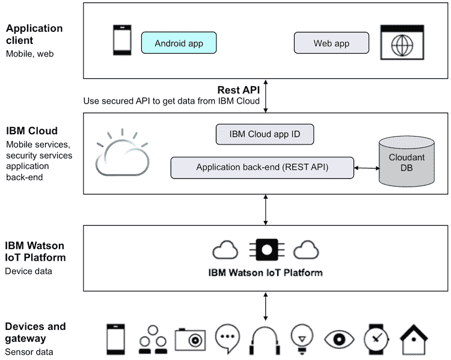
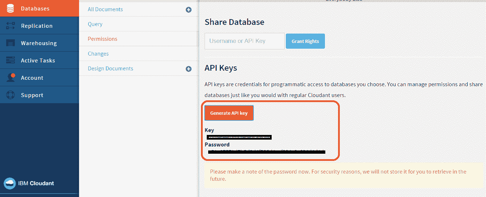
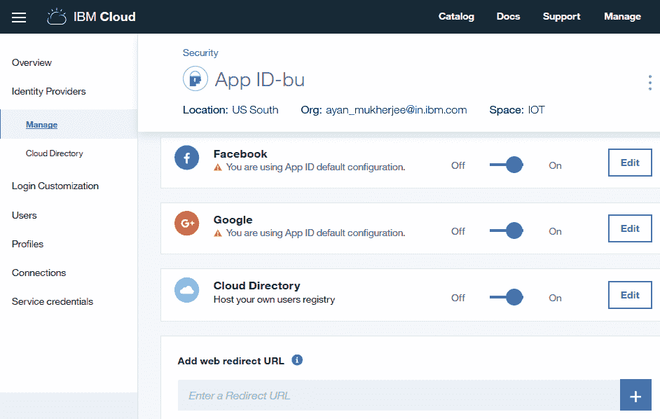
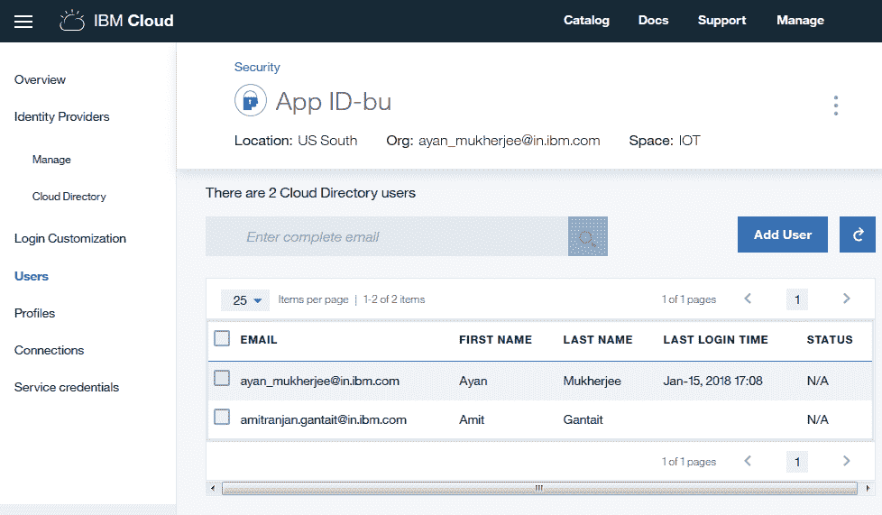
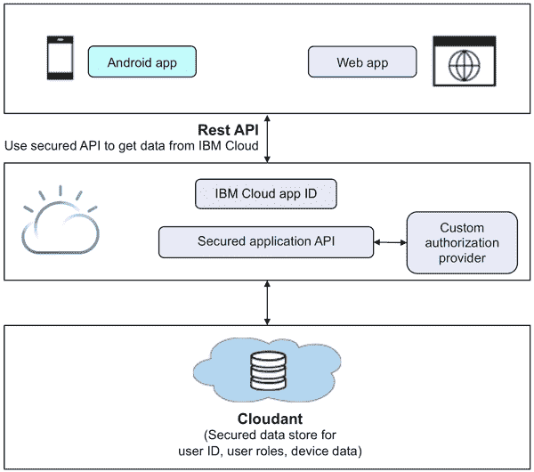
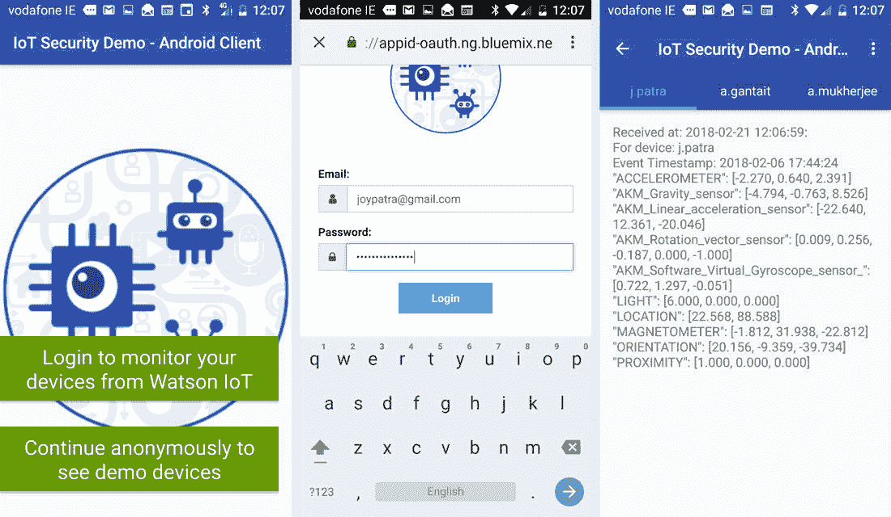

# 保护 IoT 应用程序

> 原文：[`developer.ibm.com/zh/articles/iot-trs-secure-iot-solutions3/`](https://developer.ibm.com/zh/articles/iot-trs-secure-iot-solutions3/)

基于云的 IoT 应用程序中，一个重要的安全目标是确保未授权的用户无法访问来自设备的敏感和隐私数据。该应用程序还需要防范向设备发送未授权的命令。本文（一个由三部分组成的文章系列的第 3 部分）将介绍保护 Web 和移动应用程序处理 IoT 设备数据的不同方法。[第 1 部分](https://developer.ibm.com/zh/articles/iot-trs-secure-iot-solutions1/)和[第 2 部分](https://developer.ibm.com/zh/articles/iot-trs-secure-iot-solutions2/)列出了保护设备，以及保护设备与网络之间通信的详细方法。

保护处理 IoT 设备数据的 Web 和移动应用程序的方法展示了本文中介绍的方法。移动和 Web 客户端具有特定的安全机制来确保只有经过验证的用户才能访问应用程序。应用程序逻辑的核心在基于 IBM Cloud 的后端服务中。此应用程序逻辑从 IBM Watson IoT Platform 拉取数据（通过使用受保护的 Watson IoT Platform API），分析数据，然后发送命令来控制设备。

##### 保护处理 IoT 设备数据的 Web 和移动应用程序的方法



本文假设您知道如何开发和处理 IBM Cloud 应用程序。如果您还不熟悉 IBM Cloud，可以考虑学习 [IBM Cloud 基础学习路径](https://cloud.ibm.com/docs)中的教程。本文不会详细介绍如何开发 Web 或移动应用程序；只解释如何向 Web 或移动应用程序添加安全特性。

## 保护应用程序收到的 IoT 数据

我们为本文创建的 IoT 安全演示服务器应用程序将会订阅 Watson IoT 事件数据，并将收到的数据持久保存在 Cloudant 数据库中。在持久保存数据（比如来自 IoT 设备的有效负载）时，IoT 安全演示服务器应用程序会对所存储数据的一些敏感属性进行加密。有效负载为 JSON 格式并以 AES 加密格式存储在 Cloudant 数据库中。它在检索到被授权用户时将被解密。加密和解密对用户是透明的。

[获取 IoT 安全演示服务器应用程序的代码](https://github.com/iotsecuritydemo2/iotsecuritydemo2-server)

### 针对 Watson IoT Platform 的受保护访问

在 IBM Cloud 中添加 Internet of Things Platform 服务时，会为您的应用程序生成访问凭证（比如下面所示的凭证），而这些凭证会授予您访问 IBM Watson IoT Platform 的权限。

```
{
   "iotf-service":[
      {
         "name":"your-iotf-service-name",
         "label":"iotf-service",
         "tags":[
            "internet_of_things",
            "Internet of Things",
            "ibm_created",
            "ibm_dedicated_public"
         ],
         "plan":"iotf-service-free",
         "credentials":{
            "iotCredentialsIdentifier":"your-credentials",
            "mqtt_host":"your-org-name.messaging.internetofthings.ibmcloud.com",
            "mqtt_u_port":1883,
            "mqtt_s_port":8883,
            "base_uri":"https://your-org-name.internetofthings.ibmcloud.com:443/api/v0001",
            "http_host":" your-org-name.internetofthings.ibmcloud.com",
            "org":" your-org-name ",
            "apiKey":"a-your-org-name-your-key",
            "apiToken":"your-token"
         }
      }
   ]
} 
```

订阅 Watson IoT Platform 的事件和状态更新很简单，如下面这个代码段所示：

```
var IotfClient = require("ibmiotf").IotfApplication;

var iotConfig = {
        "org" : org,
        "id" : "iotsecuritydemo",
        "auth-key" : apiKey,
        "auth-token" : apiToken
    };

var iotfClient = new IotfClient(iotConfig);

iotfClient.connect();

iotfClient.on("error", function (err) {
    console.log("IoTF client error: "+JSON.stringify(err, null, 4));
});

iotfClient.on("connect", function () {
    // Subscribe to status from all devices
    iotfClient.subscribeToDeviceStatus();

    // Subscribe to all events from all devices
        iotfClient.subscribeToDeviceEvents();
    });

iotfClient.on("deviceEvent", function (deviceType, deviceId, eventType, format, payload) {
    // Handle events from devices
      console.log("Device event from:"+deviceType+", "+deviceId+" of event "+eventType);

      insertEventToDB(deviceType, deviceId, eventType, format, payload);
});

iotfClient.on("deviceStatus", function (deviceType, deviceId, payload, topic) {
    // Handle status updates from devices
      console.log("Device status from:"+deviceType+", "+deviceId);

      insertStatusToDB(deviceType, deviceId, payload, topic);
}); 
```

通过此代码，无论何时收到 IoT 事件，事件和相关有效负载就会被插入 Cloudant 数据库中。

### 加密 Cloudant 数据库中的数据

将始终对存储在 IBM Cloudant NoSQL DB 实例中的数据进行加密，这称为*静态加密*。[在 IBM Cloud 文档中进一步了解 Cloudant 数据保护和安全性](https://cloud.ibm.com/docs/services/Cloudant/offerings/security.html#security)。

然而，您可以实现一种自定义加密方法来确保敏感数据受到保护。

对存储和检索的数据的加密和解密可以基于行业标准的 AES-256 算法，如以下代码段所示：

```
var crypto = require('crypto');
var algorithm = 'aes-256-ctr';
var cryptoKey = 'your-key';

function encrypt(text){
  var cipher = crypto.createCipher(algorithm, cryptoKey);
  var crypted = cipher.update(text,'utf8','hex');
  crypted += cipher.final('hex');
  return crypted;
}

function decrypt(text){
  var decipher = crypto.createDecipher(algorithm, cryptoKey);
  var dec = decipher.update(text,'hex','utf8');
  dec += decipher.final('utf8');
  return dec;
} 
```

加密数据的同时会带来性能代价，尤其是在需要处理大量数据时，所以在考虑和实现正确的方法时必须考虑这方面。

### 安全地访问存储在您的 Cloudant 数据库中的数据

在 IBM Cloudant 文档中进一步了解 [Cloudant 数据保护和安全性](https://cloudant.com/product/cloudant-features/dbaas-security/)。

您可以通过两种方法中的一种来直接访问存储在 Cloudant 数据库中的 IoT 数据：

*   如果共享了 Cloudant API 密钥，则使用第三方应用程序。
*   创建您自己的受 IBM Cloud Security 服务保护的自定义 API。

#### 使用 Cloudant API 密钥的第三方访问

在 IBM Cloud 中添加 Cloudant DB 服务时，会为您的应用程序生成类似以下这样的访问凭证，以便让您的程序能够以编程方式访问 Cloudant 数据库。

```
 {
  "cloudantNoSQLDB": 
        {
            "credentials": {
                "username": "your‑username",
                "password": "your‑password",
                "host": "your‑hostname‑bluemix.cloudant.com",
                "port": 443,
                "url": "https:// your‑username:your‑password@your‑hostname‑bluemix.cloudant.com"
            },
            "syslog_drain_url": null,
            "volume_mounts": [],
            "label": "cloudantNoSQLDB",
            "provider": null,
            "plan": "Lite",
            "name": "iotsecuritydemo‑cloudantNoSQLDB",
            "tags": 
                "data_management",
                "ibm_created",
                "lite",
                "ibm_dedicated_public"
                    }
    } 
```

可以使用此用户名和密码生成 Cloudant API 密钥，方法如下：

`POST _api/v2/api_keys`

生成密钥后，可像正常用户帐户一样使用 API 密钥，比如授予读取、写入或管理访问权。

`POST https://<username:password>.cloudant.com/_api/v2/api_keys`

响应将类似于以下代码：

```
"password": "YPNCaIX1sJRX5upaL3eqvTfi",
"ok": true,
"key": "blentfortedsionstrindigl" 
```

需要 API 密钥才能授予访问特定数据库的权限。 使用如下所示的 PUT 请求访问您的数据库。

`https://<username>.cloudant.com/_api/v2/db/<database>/_security),`

请注意，也可以从 Cloudant 仪表板生成 API 密钥，如下图所示。



API 密钥/密码对可以像任何其他用户帐户一样对待。您可以将 API 密钥传递给一个调用，以便使用它共享数据库，并向它分配权限。可以将 API 密钥/密码对用于任何不适合用户帐户的情形，比如在您的源代码中包含凭证时，以及需要以编程方式创建多个具有不同权限的帐户时。

API 响应包含以下属性：

*   ***ok*** – 在请求成功时返回。
*   ***error*** – 在请求未成功时返回，包含错误代码。
*   ***key*** – 返回 API 密钥。
*   ***password*** – 返回 API 密码。

#### 使用自定义 API 的第三方访问

通过提供对 Cloudant 数据库的直接访问能力，会让第三方集成变得非常脆弱且维护成本高昂。一种推荐的架构是使用自定义 API 在数据库上提供一个封装层。自定义 API 将会隐藏特定于数据库的细节，并返回来自特定接口契约的设备信息。

我们的 IoT 安全演示服务器应用程序中的第一个自定义 API 允许您使用这个 `http` 请求访问设备列表：

`http://<app_route>/iotf/devices`

例如，要访问存储在我们的 IoT 安全演示服务器应用程序中的 Cloudant 数据库中的设备列表的数据，可以使用以下请求：

`https://iotsecuritydemo2.mybluemix.net/iotf/devices`

我们的 IoT 安全演示服务器应用程序中的第二个自定义 API 允许您使用这个 `http` 请求访问特定设备的数据：

`http://<app_route>/iotf/devices/<device>`

例如，要查看我们的 IoT 安全演示服务器应用程序中的最后 50 个事件及其针对设备“j.patra”的有效负载，可使用以下请求：

`https://iotsecuritydemo2.mybluemix.net/iotf/devices/j.patra`

最后，您可以通过在请求上指定一个额外的参数来请求特定数量的事件：

`http://<app_route>/iotf/devices/<device>?count=<count>`

例如，要查看我们的 IoT 安全演示服务器应用程序中的最后 5 个事件及其针对设备“j.patra”的有效负载，可使用以下请求：

`https://iotsecuritydemo2.mybluemix.net/iotf/devices/j.patra?count=5`

## 实现自定义授权提供程序

`user` 和 `userGroup` 对象是自定义的身份验证和授权对象，它们对 Cloudant 数据库中存储的数据提供基于角色的安全访问。本文使用一个自定义身份验证提供程序来使用这些 `user` 和 `userGroup` 对象。

使用自定义 API 时，您可能希望对访问设备数据及向设备发送命令的用户授权进行更多的控制。要获得此控制权，可在 Cloudant 中为 `user` 和 `userGroup` 创建一组自定义文档。

Cloudant 中的这组自定义文档用于为此 IoT 安全演示服务器应用程序中实现的自定义身份验证提供程序执行基于角色的授权。

以下是自定义 `user` 文档的示例：

```
{
  "_id": "joypatra@gmail.com",
  "recordType": "user",
  "userName": "joypatra",
  "password": "encrypted‑password",
  "displayName": "Joy Patra",
  "attributes": {
    "Language": "English",
    "Country": "India",
    "emailAddress": "joypatra@gmail.com",
    "userGroup": "groupAdmin"
} 
```

以下是自定义 `userGroup` 文档的示例：

```
{
  "_id": "groupAdmin",
  "recordType": "userGroup",
  "groupName": "groupAdmin",
  "roleAdmin": "true",
  "roleReader": "true",
  "roleWriter": "true",
  "displayName": "User authorization administrator group",
  "devices": "j.patra", "a.gantait", "a.mukherjee"} 
```

本文中开发的自定义授权提供程序使用了来自 Cloudant 数据库的上述 user 和 userGroup 文档。

## 使用 IBM App ID 保护自定义 API

在 IBM Cloud 文档中进一步了解如何[开始使用 IBM App ID](https://cloud.ibm.com/docs/services/appid?topic=appid-about&locale=zh-CN)。

数据受到保护并通过自定义 API 公开后，下一步是使用身份验证和授权来保护这些 API。Web 和移动应用程序需要提供必要的身份验证凭证来调用这些 API，并且只能访问它们有权访问的设备的数据。为了保护自定义 API，本文使用了 IBM Cloud 上的 IBM App ID 服务。

本文中的自定义 API 是使用 Node.js 开发的。为了保护 API 端点，通过通行证身份验证中间件（passport authentication middleware）对 Node.js 中的 API handler 方法进行了增强。密码身份验证中间件是一个 Node.js 通行证（passport）实例，它已使用 IBM App ID 策略对象初始化，以便身份验证请求被 IBM App ID 服务器 SDK 拦截和处理。

提供 IoT 设备数据访问权的 Web 应用程序需要使用应用程序用户的用户名/密码组合进行保护。在我们的 Web 应用程序中，后端用户注册表（比如 IBM Cloud 目录）用于存储所有用户信息。

App ID 服务支持用户凭证的三个身份来源：



在应用程序开发者将 App ID 功能嵌入应用程序中之前，管理员必须创建服务实例和添加身份来源。执行以下步骤将 App ID 功能（通过使用 IBM Cloud 目录）添加到 Web 应用程序。

1.  在 IBM Cloud 中设置 App ID 服务，并创建一个新的 IBM Cloud 目录。
2.  将用户添加到 Cloud 目录中。参见下图：

    

### 实现 API 安全性

下面这个代码片段来自 IoT 安全演示应用程序，它演示了如何使用 IBM App ID 来保护自定义 API 端点 (/iotf/devices)。

通行证身份验证中间件使用 `APIStrategy` 来验证传入的请求。它将查找请求 http 头中的 Authorization 字段。对于 App ID，授权头由三个不同的令牌组成，这些令牌用空格分隔：关键字“Bearer”、访问令牌和可选的身份令牌。

```
 const passport = require('passport');
const APIStrategy = require("bluemix‑appid").APIStrategy;

app.use(passport.initialize());

passport.use(new APIStrategy());

// Declare the API you want to protect
app.get(iotRouteBase + '/devices',
passport.authenticate(APIStrategy.STRATEGY_NAME, 
{session: true}),
function(req, res) {
        if(error) {
            res.status(400).json(error);
        }
        else {
            res.status(200).json(userGroup.devices);
            }
}
); 
```

作为具有适当身份验证头的 REST API，可以从客户端应用程序访问此受保护的 API。后续部分将讨论如何实现将调用这些 API 的 Web 客户端和移动客户端。

## 保护 IoT 客户端应用程序

在 [IBM Cloud 文档中阅读有关 IBM Cloud 安全性的更多信息](https://cloud.ibm.com/docs/security/index.html)

要保护 IoT 客户端应用程序，您可以对 Web 和移动应用程序使用统一身份验证方法。IBM Cloud 平台在平台、数据和应用程序级别上都提供了安全性。

图 3 展示了基于 App ID 服务的统一身份验证和授权方法。借助这种统一的身份验证方法，移动应用程序和 Web 应用程序都使用同一个基于 App ID 的身份验证提供程序和基于 Cloudant 的自定义授权提供程序，保护设备数据和限制谁可以向设备发送命令。

##### 相同的身份验证，相同的受保护应用程序



## 保护 Web 应用程序

在此部分中，我们将了解如何根据与登录用户概要文件关联的身份验证和授权，从 Web 应用程序访问我们的受保护自定义 IoT API。

步骤如下：

1.  客户端程序使用 App ID 客户端 SDK 通过为 App ID 实例的特定 `oauthServerUrl` 提供 App ID 租户 ID 和客户端 ID 以及密钥，初始化与 IBM App ID 实例的会话。
2.  客户端程序使用 `LOGIN_URL` 通过 App ID 启动登录会话。
3.  App ID 向用户显示登录页面，在提交时验证凭证，并返回访问令牌和身份令牌。
4.  客户端程序调用服务器上的受保护端点（在安全演示服务器应用程序中为 `/iotf/devices`）。在执行此操作时，它会在请求中使用访问令牌和（可选）身份令牌设置授权头。
5.  App ID 服务器端 SDK（在受保护端点上设置为通行证中间件）将验证提供的访问令牌和（可选）身份令牌是否有效。
6.  如果有效，App ID 服务器端 SDK 将会允许调用端点处理程序。否则，它会返回一个包含 HTTP 401“Unauthorized”的响应。

### 实现 Web 应用程序身份验证安全性

下面这个代码片段来自 IoT 安全演示 Web 应用程序，它演示了如何使用 IBM App ID 保护 Web 应用程序登录。

```
 const WebAppStrategy = require("bluemix‑appid").WebAppStrategy;

// Configure express application to use passportjs
app.use(passport.initialize());
app.use(passport.session());

const LOGIN_URL = "/ibm/bluemix/appid/login";
const CALLBACK_URL = "/ibm/bluemix/appid/callback";
const LANDING_PAGE_URL = "/IOT_sample_app.html";

// Configure passportjs to use WebAppStrategy
passport.use(new WebAppStrategy({
    tenantId: "∗∗∗∗∗∗∗∗∗∗∗∗∗∗∗∗∗∗∗",
    clientId: "∗∗∗∗∗∗∗∗∗∗∗∗∗∗∗∗∗∗∗",
    secret: "∗∗∗∗∗∗∗∗∗∗∗∗∗∗∗∗∗∗∗",
    oauthServerUrl: "∗∗∗∗∗∗∗∗∗∗∗∗∗∗∗∗∗∗∗",
    redirectUri: "http://localhost:1234" + CALLBACK_URL
}));

// Explicit login endpoint. Will always redirect browser to login widget.
// If forceLogin is set to false redirect to login widget will not occur 
// for already authenticated users.
app.get(LOGIN_URL, passport.authenticate(WebAppStrategy.STRATEGY_NAME, {
    successRedirect: LANDING_PAGE_URL,
    forceLogin: true
}));

// Callback to finish the authorization process. Will retrieve access and 
// identity tokens from App ID service.
app.get(CALLBACK_URL, passport.authenticate(WebAppStrategy.STRATEGY_NAME)); 
```

在用户成功登录后，我们将向用户显示一个页面，用于获取用户有权查看的设备数据。为此，我们从上面的自定义 Node.js 服务器调用两个受保护的自定义 API –

1.  `/Iotf/devices` – 用于获取授权设备的列表
2.  `/Iotf/devices/:deviceid?count=n` – 用于获取最后 n 个设备数据（在 IBM IoT 术语中也称为“`deviceEvent`”）。

    进一步了解 [IBM App ID 身份验证头结构](https://cloud.ibm.com/docs/services/appid/authorization.html#authorization-and-authentication)。

要访问受保护的 API，我们需要在请求头中正确设置授权令牌。Web 应用程序端（客户端代码）中的以下代码片段演示了相同的内容。

```
 // Protected area. If current user is not authenticated ‑ redirect to the 
// login widget.
// In case user is authenticated ‑ a page with current user information
// will be returned.
app.get("/protected", passport.authenticate(WebAppStrategy.STRATEGY_NAME), 
function(req, res){
    var authContext = req.session[WebAppStrategy.AUTH_CONTEXT];
    var accessToken = authContext.accessToken;
    var identityToken = authContext.identityToken;

    console.log("AUTH_CONTEXT: " + JSON.stringify(authContext), null, '    ');

    var options = {
        url: 'http://iotsecuritydemo2.mybluemix.net/iotf/devices,
        headers: {
            'Authorization': 'Bearer '+accessToken+' '+identityToken
        }};

    request.get(options, function (error, response, body) {
        if(error) {
            console.log(error);
            res.send(error);
        }
        else {
                console.log("response ‑ " + response.code);
                console.log("body ‑ " + body);    
                 res.send(body);
        }
    }); 
```

## 保护移动应用程序

IBM App ID 服务还可用于提供服务以确保移动应用程序的安全性。该流程与保护 Web 应用程序的方式完全相同。

1.  移动设备使用 App ID 客户端 SDK 通过提供 App ID 租户 ID 和区域 ID，初始化与 App ID 特定实例的会话。
2.  移动设备使用 App ID 启动登录会话，指定这是匿名登录还是基于凭证的登录。
3.  如果这是匿名登录，那么 App ID 会立即返回相应的访问令牌和身份令牌。如果这是基于凭证的登录，那么 App ID 会向用户显示登录页面，在提交时验证凭证，并返回访问令牌和身份令牌。
4.  移动设备使用 App ID 客户端 SDK 提供的 Request 类调用移动应用后端上的受保护端点（在我们的安全演示服务器应用程序中为 `/iotf/devices`）。
5.  App ID 客户端 SDK 将缓存的授权头添加到请求中，在端点上调用受保护的 API，并验证提供的访问令牌和（可选）身份令牌是否有效。
6.  如果有效，App ID 服务器端 SDK 将会允许调用端点处理程序。否则，它会返回一个包含 HTTP 401“Unauthorized”的响应。
7.  身份验证流考查是否已为 App ID 服务配置了 Facebook、Google 或 IBM Cloud 目录。它将结果返回给 App ID 服务器端 SDK。
8.  针对 App ID 服务器端 SDK 的身份验证流获得成功时，它会调用受保护端点（在我们的安全演示服务器应用程序中为 `/iotf/devices`）的端点处理程序。

### 初始化 App ID 客户端 SDK（适用于 Android）

以下代码片段展示了如何初始化 App ID 客户端 SDK。

您可以在 IBM Cloud App ID 仪表板中的 Service Credentials 部分中找到自己的租户 ID。

```
// Initialize IBM Cloud AppID service SDK with tenant ID and region of the 
// AppID service to connect to
// You can find your tenant ID and region in the Service Credentials section 
//at left hand side of your AppID service dashboard
        appId = AppID.getInstance();

        appId.initialize(
                getApplicationContext(),
                DeviceIoTDemoApplication.IBMCLOUDAPPID_TENANT_ID,
                DeviceIoTDemoApplication.IBMCLOUDAPPID_REGION_ID);

        bmsClient = BMSClient.getInstance();

        bmsClient.initialize(
                getApplicationContext(),
                DeviceIoTDemoApplication.BMSCLIENT_REGION_ID
        ); 
```

在初始化 SDK 后，确定登录是匿名登录还是使用特定凭证登录。要启动登录，使用以下代码片段：

```
 public void startLoginActivity(View view) {

    LoginWidget loginWidget = appId.getLoginWidget();
    // Using persisted access token is optional
    final String storedAccessToken = tokensPersistenceManager.getStoredAccessToken();

    AppIdAuthorizationListener appIdAuthorizationListener =
            new AppIdAuthorizationListener(
                    this,
                    appIDAuthorizationManager,
                    false);

    loginWidget.launch(this, appIdAuthorizationListener);
} 
```

在身份验证过程成功或失败时，窗口小部件将回调 `appIdAuthorizationListener`。

### 向受保护的 API 发出请求

成功后，您可以向受保护的 API 发出请求：

`http://<app-route>/iotf/devices`

要从移动应用程序向上述端点发出请求，可使用适用于 Android 的 App ID 客户端 SDK 中提供的 `Request` 类：

```
new Request(
    SERVER_HOSTNAME + "/iotf/devices/",     
    Request.GET).send(
        DeviceIoTDemoApplication.get(), 
        new ResponseListener() {
            @Override
            public void onSuccess(Response response) {
                Log.i("onSuccess(): Authorized devices are "+
                    response.getResponseText());
            }

            @Override
            public void onFailure(Response response, Throwable t, JSONObject extendedInfo) {
                final String errorMessage =
                    (null != response ? response.getResponseText() : "") + "\n" +
                    (null != t ? t.toString() : "") + "\n" +
                    (null != extendedInfo ? extendedInfo.toString() : "") + "\n";

                Log.e(TAG, errorMessage);
            }
        }
    ); 
```

在上面描述的自定义 Node.js 服务器上调用受限制的服务器 API 时，`Request` 类将从 App ID 服务接收的授权访问令牌和身份令牌作为请求头传递。在执行业务逻辑之前，服务器使用 `APIStrategy` 针对 App ID 服务来验证令牌。

### 移动 Android 客户端示例

我们为本文开发的移动 Android 客户端示例应用首先会要求用户登录。如果需要，用户可以匿名登录。

对于希望登录的用户，移动应用从 AppID 实例获取 `LoginWidget`，并将控制权交给该登录窗口小部件。该登录窗口小部件将控制可收集用户名和密码的基于 Web 的登录页面，确保移动应用不会直接访问这些凭证。

[获取移动 Android 客户端的代码](https://github.com/iotsecuritydemo2/iotsecuritydemo2-androidclient)

该 Android 应用实现了一个自定义授权侦听器 `AppIdAuthorizationListener`。该类将处理来自登录窗口小部件的关于授权成功、失败和类似事件的回调通知。成功时，此侦听器将实现自定义方法 `getAuthorizedDevices`，以在自定义 Node.js 服务器上调用受限制的 `/iotf/devices` API。



成功执行身份验证后，设备 API 将会返回此用户有权查看的设备列表。每个设备都显示在应用程序 UI 中的一个独立的选项卡中。每个选项卡都显示相应设备的最后一个事件，通过在自定义 Node.js 服务器上调用另一个受限 API 来获取。将显示事件的时间戳和传感器有效负载数据。

```
public class CustomAuthenticationListener implements AuthenticationListener {
    private final String TAG = getClass().getSimpleName();

    private Context context;
    private String username = "";
    private String password = "";

    public CustomAuthenticationListener(Context context, String username, String password) {
        this.context = context;
        this.username = username;
        this.password = password;
    }

    @Override
    public void onAuthenticationChallengeReceived (
                        AuthenticationContext authContext,
                        JSONObject challenge,
                        Context context) {

        // This is where developer would show a login screen,
        // collect credentials and invoke
        // authContext.submitAuthenticationChallengeAnswer() API

        JSONObject challengeResponse = new JSONObject();
        try {
            challengeResponse.put("username", username);
            challengeResponse.put("password", password);

            authContext.submitAuthenticationChallengeAnswer(
                                            challengeResponse);
        } catch (JSONException e){

        // In case there was a failure in collecting credentials
        // you need to report it back to the AuthenticationContext.
        // Otherwise Mobile Client Access client SDK will remain in a
        // waiting-for-credentials state forever

            authContext.submitAuthenticationFailure(null);
        }
    } 
```

对于本文，可以使用我们的[设备模拟器程序](https://github.com/iotsecuritydemo2/iotsecuritydemo2-devicesim)来模拟有效负载数据。

[获取设备模拟器的代码](https://github.com/iotsecuritydemo2/iotsecuritydemo2-devicesim)

## 扫描和监视应用程序的安全漏洞

IBM Cloud 平台还提供了相关服务来帮助您扫描或监视应用。例如，[IBM Application Security on Cloud](https://cloud.ibm.com/docs/services/ApplicationSecurityonCloud/index.html) 服务可确保应用程序中没有安全漏洞。开发者可在部署之前使用这些服务扫描 Web 和移动应用程序的漏洞，识别安全问题，并实现推荐的修复。此外，App ID 服务还提供了一个仪表板来监视和分析移动应用程序的使用情况以及设备中的安全事件，比如身份验证成功或失败。

## 结束语

对于分析来自 IoT 设备的敏感数据的应用程序，以及控制这些 IoT 设备上的功能的应用程序，安全性必须成为重要的关注领域。在本文中，我们重点介绍了如何保护在 IBM Cloud 平台上运行的 IoT 应用层。您学习了如何使用 IBM Cloud 安全性服务跨 Web 和移动应用程序来实现常见的用户身份验证和授权，以及如何将敏感数据安全地存储在 Cloudant 数据库中。

## 致谢

IBM Cloud 解决方案架构设计师 Subrata Saha 和 IBM Cloud App ID 产品经理 Beery Holstein 对本文提出了宝贵的意见和建议，在此深表感谢。

本文翻译自：[Securing IoT applications](https://developer.ibm.com/articles/iot-trs-secure-iot-solutions3/)（2018-02-28）