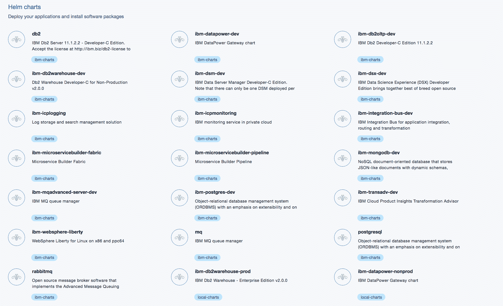
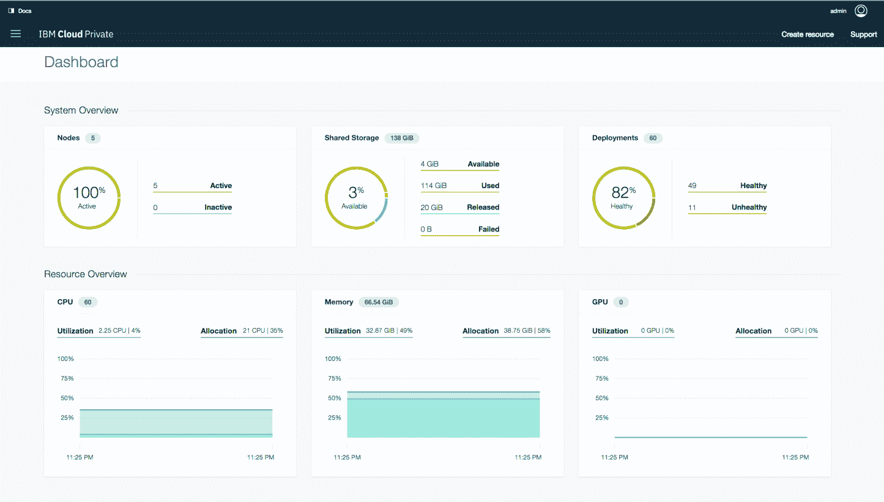

# IBM Cloud Private 企业私有云方案概述

> 原文：[`developer.ibm.com/zh/articles/cl-ibm-icp1-kubernetes/`](https://developer.ibm.com/zh/articles/cl-ibm-icp1-kubernetes/)

最新上市的 IBM Cloud Private 是 IBM 新一代的企业私有云方案，基于市场主流的 Kubernetes 及容器技术搭建。可以部署在 VMWare 及 OpenStack 等 IaaS 架构上，并且支持 x86, POWERLinux 及 zLinux 架构。上层可以部署各种 IBM，第三方及社区的镜像及模版应用。在设计上提供了最大的灵活性及可靠性。 该方案为企业利用云计算，实现技术创新，提出了先进和可行的建议，下面会从五个方面给广大读者做个介绍。

1.  私有云技术趋势
2.  容器优先与技术热点
3.  IBM Cloud Private 的定位与能力
4.  IBM Cloud Private 的技术选择
5.  IBM Cloud Private 起步

## 私有云技术趋势

云计算概念问世已有十几年的时间，IBM 从 2007 年开始就致力于云计算的研发与推广，从私有云、公有云到混合云，经历了云的了解和探索、实践与创新以及广泛部署和应用的过程。

私有云是很多企业最早采用的云计算技术，因为私有云能够带来虚拟化、自动化、快速开发运维一体化、资源动态扩展等云的好处，同时通过私有网络，也能保证企业数据的安全性和合规要求。

私有云主要分为 IaaS 和 PaaS 两层，即基础架构服务和平台服务，IaaS 市场主要有 VMWare, OpenStack, 以及开源虚拟化底层技术 XEN、KVM 等构建的商业化产品，PaaS 主要有 Cloud Foundry 和容器两大类。很多企业说它们已经完成了私有云的搭建，是指它们完成了基础架构的虚拟化、能够提供虚拟机的快速供给，使用了 VMWare 或搭建了 OpenStack， 但要真正提供应用的自动化部署和扩展，还需要 PaaS 的支持。企业 IT 的主要目的是提供对业务的支持，通过软件应用支撑业务的数字化，所以应用的快速部署、运营监控和生命周期管理，才是私有云的发展方向，提供虚拟机和基础架构只是私有云的首要步骤。

## 容器优先与技术热点

近几年，容器的技术发展非常快，也很快形成了较成熟的生态圈。容器具有很多特点，比如部署简单、启动快速、动态扩展、易于迁移等等。应用程序作成一个镜像（Image）文件，就能部署在物理机和虚拟机的容器中，启动是用秒做单位的，十多秒甚至几秒钟就能启动一个应用，之所以容器的启动比虚拟机快很多，是因为虚拟机的操作系统的启动会费很多时间。

容器的易于部署和快速启动的特点，使容器的使用很快推广开来。有些企业的容器数量很快上万，甚至达到几十万个。那么多容器，生命周期管理、编排、调度和监控成为难题，于是出现了多个相关的开源项目，解决集群管理的问题。下表列出了常见的开源软件项目：

| **功能** | **项目名称** |
| --- | --- |
| 调度 | Docker Swarm, Mesos, Kubernetes |
| 监控 | Prometheous |
| 存储 | Flocker |
| 网络 | Calico, Weave, Flannel |
| 编排 | Docker compose，Kubernetes helm |

在这些开源项目中，Kubernetes 是发展最快的一个。据最新的 OpenStack 用户对应用平台选择的调查，2016 年的调查与 2015 年相比较，Kubernetes 占有率提高了 30%（从 21%到 27%），而 Cloud Foundry 下降了 30%（从 23%到 16%），Mesos 下降了 25%（从 16%到 11%），Docker Swarm 则下降了 80%，从 16%跌到 2%，使得 Kubernetes 成为 OpenStack 上，容器管理的领先平台。另外， Kubernetes 通过 CNCF（Cloud Native Computing Foundation）国际组织，建立了一个非常强大的生态体系，使得 Kubernetes 成为 PaaS 的最主要平台。

## IBM Cloud Private 的定位与能力

IBM 于 2017 年 6 月 27 日 正式发布了 IBM Cloud 私有云（IBM Cloud Private）。IBM Cloud Private 提供了一个包括 IaaS、PaaS、和开发服务的集成和私有的云平台。主要面对企业客户，企业可以利用 IBM Cloud 私有云- IBM Cloud Private 创建、运行和管理云应用，快速实现动态 IT 对业务增长和转型的支撑。例如，在私有云中开发原生云应用程序，并在私有云生产环境中运行；在私有云中安全地集成和使用企业原有或外部的数据和服务，最终重构 IT 环境，使传统企业应用程序实现现代化。

IBM Cloud 私有云是一个集成平台，在 IaaS 和 PaaS 层提供了基于开源技术的综合运营管理和开发运维一体化（DevOps）能力，同时提供一系列服务，如微服务生成器（Micro Service Builder）服务、数据和分析服务、通讯服务、缓存服务等，满足开发者利用快速迭代和创新方法实现企业的业务需求。IBM Cloud Private 这个私有云平台也是 IBM Cloud 组合系列的一部分，它提供了跨越 IBM 公有云、私有云和专属云模型的一致性选择。

IBM Cloud 私有云提供了以下能力：

*   为企业提供一个集成的、客户自己控制的、能安全运行 IT 工作负载的私有云平台。
*   基于 Docker 容器和 Kubernetes 技术，支持集中运维管理和开发服务，做到开发运维一体化（DevOps）。
*   基于 12 因素应用原则和技术设计架构，如微服务架构，设计成为原生云应用的创建平台。
*   提供应用分析的能力，并为企业 IT 现代化提供规划性指导，推动传统企业应用向模块化云时代的转型，实现高可用、高优化，满足企业的多种需要。
*   包含了流行的开源工具、IBM 应用中间件及开发服务，是一个完整的云环境。能够帮助开发者和运维管理人员释放创新能力，满足企业的业务需求。

## IBM Cloud Private 的技术选择

IBM 在私有云的技术选择上采取了开放的原则，支持主流的 IaaS 和 PaaS 平台，在基础架构 IaaS 层面，IBM Cloud 私有云可以安装在 Open Stack 或 VMWare 上， 也可安装在 Intel 或运行 POWERLinux，zLinux 的物理机上；在平台服务 PaaS 层面，IBM Cloud 私有云支持 Kubernetes， 并将在十月份支持 Cloud Foundry。

##### 图 1\. IBM Cloud Private 的主要组件

图 1 中列出了 IBM Cloud Private 的主要四个组件：

*   基于 Kubernetes 的容器平台：业界领先的，跨越私有云、专属云和公有云的容器编排平台
*   共同服务：简化操作管理、开发运维一体化（DevOps）和混合集成
*   IBM 中间件、数据和分析服务： 提供支持云计算的中间件、应用程序运行环境、通讯、数据库和数据分析服务，来优化现有的投资，实现快速创新
*   Cloud Foundry：用于指定的应用程序的开发和部署（可选）

IBM Cloud Private 支持灵活的基础架构和平台服务，这种对主流的 IaaS 和 PaaS 的支持，使得 IBM Cloud Private 能够更灵活地支持企业的私有云战略，结合企业的实际 IT 环境，提供云中应用中心 (App Center)， 完成在私有云中对应用程序的云化管理。IBM Cloud Private 的运维管理可由客户自己完成，也可通过 IBM 的专业服务团队进行管理，这也给企业带来了灵活性。IBM Cloud Private 的技术选择为企业在移动互联时代，应对业务需求的快速变化，实现 IT 更高层次的应用云化管理提供了保障。

## IBM Cloud Private 起步

IBM Cloud Private 的安装比较简单，如果安装社区版本，可以将管理节点和工作节点全部安装在一个虚拟机中，安装也仅需十多分钟就可完成。当然作为一个企业私有云，硬件资源是有一定要求的，建议 5 台机器：CPU 超过 4 核、内存多于 8GB、100GB 磁盘。让我们首先来看一下 IBM Cloud Private 的界面：

##### 图 2\. IBM Cloud Private 的主要界面

左边显示了 IBM Cloud Private 所管理的项目，主要包括仪表盘、工作负载、基础架构资源、应用中心和系统。右边是每个管理项目的具体内容。

IBM Cloud Private 是一个应用型平台 PaaS 云，意味着要能够提供应用服务，并允许客户自己定义常用的应用服务，这是通过应用中心(App Center) 中的容器镜像实现的。IBM Cloud Private 中开箱即用的服务包含了微服务生成器 (Micro Service Builder)， 它能够为企业快速搭建微服务的应用，为企业进行微服务转型提供了基础平台。开箱即用的服务还包含了 WebSphere Liberty、MQ 高级开发版、DB2 开发版，以及开源服务 Redis、Tomcat、Jerkins、Nginx 等，利用这些服务，可以支撑企业的传统应用，并构建新应用，使企业的 IT 真正转型到云中，从而获得云计算的快速部署，动态扩展，易于迁移的优势，能更好的满足业务部门对 IT 的需求。

综上所述，IBM Cloud Private 是企业私有云的最佳选择。请查看相关资源获取更多资料。