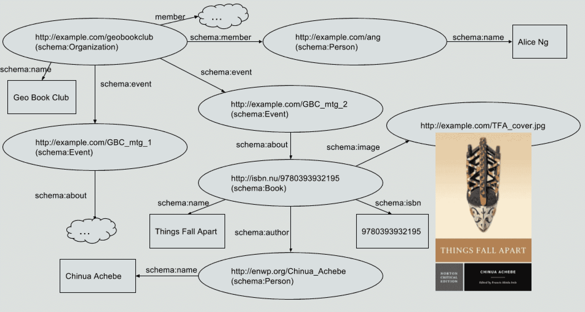
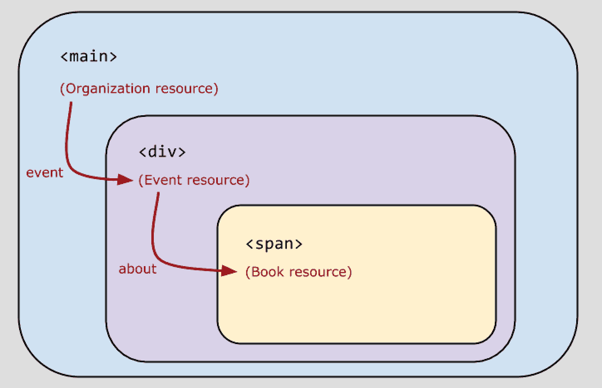

# Schema.org 语法

> 原文：[`developer.ibm.com/zh/articles/wa-schemaorg2/`](https://developer.ibm.com/zh/articles/wa-schemaorg2/)

在本系列的 [第 1 部分](https://www.ibm.com/developerworks/cn/web/wa-schemaorg1/index.html) 中，我介绍了 Schema.org，描述了它的诞生经过和它的历史。我解释了它如何帮助实现”语义网”的长期愿景，这满足了诸如搜索引擎之类的自主代理的需求。Schema.org 是由大型搜索引擎公司和科技公司创建的，但学习和实现它并不难。本系列的第二部分将介绍如何在网站上实现 Schema.org。

## 备选 Schema.org 语法

第 1 部分中已提到，Schema.org 基于。有许多针对 RDF 的语法格式。尽管这些格式最初都设计为独立文档，但是很快，人们就实现了在 HTML 中表示 RDF。为了提供灵活性，Schema.org 支持 3 种不同的表示选项。

*   **Microdata** 。Microdata 由 WHATWG HTML 工作组创建，它并不是真的基于 RDF，但它的元模型与 RDF 非常相似，所以能在 Schema.org 中使用。它或许是可用格式中采用概念最少和最不花哨的一种。
*   **RDFa Lite** 。Resource Description Framework in Attributes (RDFa) 是一种 W3C 推荐标准，它定义了一组属性，以便通过机器友好的元数据来增强 HTML。它的理念是将 RDF 模型的丰富性和 HTML 的所有其他方面（包括内容、样式和超链接）都结合起来。RDF 和 RDFa 的全部功能超过大部分 Web 发布者所需，所以 **RDFa Lite** 是一个单独的 W3C 推荐标准。它提供了一个更轻量级的语法特性子集，同时省略了 RDF 模型的一些更晦涩的方面。Schema.org 支持此变体。
*   **JSON-LD** 。JavaScript Object Notation for Linked Data (JSON-LD) 是一项针对在流行 JSON 格式中表达 RDF 的 W3C 推荐标准。JSON-LD 让 RDF 细节尽可能不突兀，使许多已在使用 JSON 的开发人员能轻松采用它。JSON-LD 支持完整的 RDF 模型，但它在 Schema.org 中仅使用了比其他两个选项更简单的模型兼容的子集。

尽管 Schema.org 支持所有这 3 种选项，但不是每个实现该格式的应用程序都支持所有 3 种选项。一些 Web 抓取工具和其他代理读取某些格式的能力高于其他格式，而一些工具可能仅能读取一种格式。因此，您可能必须根据您所针对的应用程序的偏好对格式进行初步选择。

Schema.org 文档在其介绍性文本和许多示例中使用了 Microdata，但这样做只是为了方便用户入门。所有 3 种格式都同样有效，而且网站上也有许多 RDFa 和 JSON-LD 示例。

> 一个重要的考虑因素是您选择的格式受支持的广泛程度。一般印象是，对 3 种格式的支持程度都差不多。

## 在 HTML 中对读书俱乐部示例进行编码

在第 1 部分中，我给出了一个虚构的读书俱乐部网页的信息模型示例。图 1 显示了该读书俱乐部基于 Schema.org 的模型图。

##### 图 1\. 读书俱乐部 Schema.org 信息模型



让我们看看如何在 HTML 中表示此模型。首先看看 RDFa。

## 使用 RDFa 的读书俱乐部示例

在将该模型转换为 RDFa 的过程中，我创建了一个简单的页面，并向主元素添加了一些必要属性，以传达来自该信息模型的相应概念。清单 1 显示了结果。

##### 清单 1\. bookclub-rdfa.html

```
<main vocab="http://schema.org/" typeof="Organization">
          <h1 property="name">Geo Book Club</h1>
          <div property="member" typeof="Person" resource="ang">
          Founding member <span property="name">Alice Ng</span> welcomes you!
          </div>

          <div property="event" typeof="Event" resource="GBC_mtg_2">
            Please join us for our next meeting where we shall discuss the novel
            <span property="about" typeof="Book">
              <u property="name">Things Fall Apart</u> by
              <a property="author" typeof="Person" href="http://enwp.org/Chinua_Achebe">
                <span property="name">Chinua Achebe</span>
              </a> (ISBN: <span property="isbn">9780393932195</span>)
            </span>
            
          </div>

          We hope you've been able to attend our past meetings
          <ul>
            <li property="event" typeof="Event" resource="GBC_mtg_1">
             ...
            </li>
          </ul>

          </main> 
```

### 了解 RDFa 的属性

这个示例使用了 RDFa 的最常用属性，包括：

*   `vocab` – 为主元素中发现的元数据指定一个或多个词汇表。在本例中，一个词汇表（用于 Schema.org 的词汇表）被定义为所有已表达的元数据属性的默认词汇表。有一些词汇表可用于 RDFa，而不能用于 Schema.org。您甚至可以定义自己的词汇表。
*   `typeof` – 表明主元素表示一个具有特定资源类型的概念（即一个资源），并指定资源类型。
*   `property` – 通常是最常用的属性。在直接包含的资源上指定一个特定属性。
*   `resource` – 表明主元素表示一个概念（或资源），并指定资源标识符 URL。

让我们自上而下分析一下。第一个元素 `<main vocab="http://schema.org/" typeof="Organization">` 执行了 3 个与 RDFa 相关的操作：

*   将默认词汇表设置为 `http://schema.org/` 。
*   创建一个与 `main` 元素一致的隐式资源。它由该元素及其内容来描述。
*   设置这个隐式资源的类型。 `typeof` 的值被附加到默认词汇表，从而获得一个完整的 URL `http://schema.org/Organization` 。

如果 `typeof` 属性是 URL 引用（即相对 URL）而不是完整 URL，则将默认词汇表放在这些属性的值的前面。例如，假设您将开始标签更改为以下代码段：

```
<main vocab="http://schema.org/" typeof="http://example.org/Organization"> 
```

在本例中，资源类型忽略了默认词汇表，因为它是完整 URL，而不是相对 URL。这种对相对 URL 应用默认词汇表的方式也适用于 `property` 属性。 （您也可以使用一种特殊的前缀语法对词汇表中除默认项以外的项进行缩写，这将在后面的文章中介绍。）

### 嵌入在 HTML 中的资源

如上所示，在本例中，有一个 `http://schema.org/Organization` 类型的最外部资源。只要您愿意的话，可以通过这种方式定义任意多个资源。RDFa 中（以及我们将会看到在 Microdata 中）表达对象属性的常见方式是通过嵌套的 HTML 元素。

```
<h1 property="name">Geo Book Club</h1> 
```

在本例中， `h1` 元素提供了组织的名称。

```
<div property="member" typeof="Person" resource="ang"> 
```

这一行定义一个 `http://schema.org/Person` 类型的资源，并将此设置为组织上的 `http://schema.org/member` 属性的值。

```
Founding member <span property="name">Alice Ng</span> welcomes you! 
```

在这里，为 person 资源提供了一个 `http://schema.org/name` 属性。

目前，您已在 `main` 、 `h1` 、 `div` 和 `span` 元素上看到了 RDFa 属性。您可以通过适合您的方式自由设计 HTML，而且 RDFa 属性可以放在任何与您描述的概念含义匹配的元素上。

### 嵌套 HTML 元素

RDF 是一个图形模型，而 HTML 元素的嵌套是一种分层结构或树。因为 HTML 包含对资源的自然语言描述和讨论，所以它形成了抽象数据层中的大部分关系的自然框架。

RDFa 允许您利用这种便利性，并使用分层结构来设置您描述的事物的上下文。下图演示了 HTML 文档分层结构与 RDFa 属性的图形关系之间的这一联系。

##### 图 2\. HTML 元素嵌套结构中的数据项/资源关系



下面这行展示了如何分配资源标识符 – 在本例中分配了一个 event 资源。

```
<div property="event" typeof="Event" resource="GBC_mtg_2"> 
```

如上图所示， `property` 将这个新资源连接到组织。

请注意， `resource` 的值是一个相对 URL，但它不是用于将 URL 补充完整的默认词汇表。页面本身的基础 URL 用于将资源 URL 补充完整。这意味着当您将这个读书俱乐部页面托管在 `http://example.com/geobookclub/` 上时，此事件的完整资源 URL 将变成 `http://example.com/geobookclub/GBC_mtg_2` 。可以使用 HTML `base` 属性来修改这个基础 URL。

也可以从类似 `a` 、 `link` 、 `img` 或 `object` 元素的 `href` 或 `src` 属性获得资源 ID。无论是在这些情况下，还是使用 `resource` ，您都可以指定资源的完整 URL。如果 URL 是对网站另一部分上某个资源的引用时，通常会这么做，如下面这段代码所示。

```
<a property="author" typeof="Person" href="http://enwp.org/Chinua_Achebe"> 
```

在这里，资源 ID 的值是从 `href` 获取的，而在下面这行代码中，它是从 `src` 获取的。

```
 
```

## 使用 Microdata 的读书俱乐部示例

Microdata 版本基于同样的 HTML 页面设计。

##### 清单 2\. bookclub-udata.html

```
<main itemscope itemtype="http://schema.org/Organization">
<h1 itemprop="name">Geo Book Club</h1>
<div itemscope itemprop="member" itemtype="http://schema.org/Person" id="ang">
Founding member <span itemprop="name">Alice Ng</span> welcomes you!
</div>

<div itemprop="event" itemscope itemtype="http://schema.org/Event" id="GBC_mtg_2">
  Please join us for our next meeting where we shall discuss the novel
  <span itemprop="about" itemscope itemtype="http://schema.org/Book">
    <u itemprop="name">Things Fall Apart</u> by
    <a itemprop="author" itemscope itemtype="http://schema.org/Person" href="http://enwp.org/Chinua_Achebe">
      <span itemprop="name">Chinua Achebe</span>
    </a> (ISBN: <span itemprop="isbn">9780393932195</span>)
  </span>
  
</div>

We hope you've been able to attend our past meetings
<ul>
  <li itemprop="event" itemscope itemtype="http://schema.org/Event" id="GBC_mtg_1">
   ...
  </li>
</ul>

</main> 
```

### 了解 Microdata 的属性

Microdata 中的特殊属性更少。这个示例使用了 5 个已定义的属性中的 3 个。Microdata 未遵循 RDF 模型，而仅和 Schema.org 的目的相近。数据项是 Microdata 中描述的主要单位。

*   `itemscope` – 没有值，但将相关属性标记为数据项。
*   `itemtype` – 为 `itemscope` 所表示的项指定一种类型。通常指定为一个完整 URL。
*   `itemprop` – 在一个项上指定一个属性。通常指定为一个相对 URL，并使用与该项类型相关的词汇表来解释。

这个示例使用了 HTML `id` 属性，这是考虑到 Microdata 与标识符之间有一种奇怪的模糊联系。它还定义了一个预期在整个 web 中使用的 `itemid` 属性，但在某种程度上并不能真正与 URL 概念联系起来。例如，如果您想引用来自同一文档其他地方的某个项，必须使用 `id` 而不是 `itemid` 。甚至 Microdata 规范中的基础示例也使用了统一资源名称 (URN) 而不是 URL。

## 用 JSON-LD 表示的读书俱乐部示例

JSON-LD 是一种完全不同的方法。尽管 Schema.org 推荐将它嵌入在 HTML 中，但这种集成无法像在 RDFa 和 Microdata 中那样无缝执行。您会在一个 `script` 标签中创建一个具有这种单独的 JSON 格式的孤岛。

##### 清单 3\. bookclub.json

```
<script type="application/ld+json">
{
  "@context" : "http://schema.org",
  "@type" : "Organization",
  "name" : "Geo Book Club",
  "member" : [{
    "@type" : "Person",
    "@id" : "ang",
    "name" : "Alice Ng"
    }],
  "event" : [{
    "@type" :"Event",
    "@id" : "GBC_mtg_2",
    "about" : {
      "@type" :"Book",
      "name" : "Things Fall Apart",
      "isbn" : "9780393932195",
      "author" : {
        "@id" : "http://enwp.org/Chinua_Achebe",
        "@type" : "Person",
        "name" : "Chinua Achebe"
      },
      "image" : {
        "@id" : "TFA_cover.jpg"
      }
    }
  },{
    "@type" : "Event",
    "@id" : "GBC_mtg_1"
  }]
}
</script> 
```

可以将这个 `script` 元素插入到文档中您喜欢的任何地方，但我建议将它放在 `head` 元素内，除非有将它放在其他地方的理由。

JSON-LD 是一种完整的 RDF 格式。 `@context` 键为类型和属性建立了词汇表。属性被表示为 JSON 字段，但名称以 `@` 开头的属性除外；这些属性具有特殊含义。 `@id` 和 `@type` 字段分别提供了资源 ID 和类型。资源间的关系是通过以 JSON 对象作为字段值来表示的，这会形成一种与 HTML 类似的嵌套结构。多个属性是使用 JSON 列表来表示的。

## 挑选一种格式

您一定想要学习并重点研究一种 Schema.org 格式。那么问题来了：您会选择哪一种格式？

我推荐首先使用 RDFa，因为它提供了最丰富、最一致的 RDF 模型。Microdata 稍微简单一些，但不足以显著简化维护工作或找到可以处理它的开发人员。

您还可以使用 JSON-LD 获得完整的 RDF 模型，但随后您实际需要处理一种与 HTML 不同的格式，会遇到协作和人员配置问题。您还可以将元数据与内容分离，这可能使得二者不断分化并失去一致性。对于 RDFa 和 Microdata，添加属性并继续利用 HTML 元素嵌套会使内容与数据间的联系变得更加明显。所以，您不太可能忽视对它们的协同处理。

您必须考虑的一点是：您选择的格式受支持的广泛程度如何？目前，似乎对所有 3 种格式的支持程度都差不多。JSON-LD 或许是最后才流行起来的，但最近几年对它的支持正不断增加。

## 结束语

在第 2 部分，我介绍了在一个网页上表达 Schema.org 数据的抽象信息模型的 3 种不同方法：JSON-LD、RDFa 和 Microdata。RDFa Lite 严格来讲是一种 RDF 格式，它提供了更强的表达能力，但也更加复杂。接下来，您熟悉了可以编码到所选语法中的不同信息种类。Schema.org 为许多重要领域提供了许多词汇表。在下一篇文章中，我将介绍其中一些词汇表，展示如何使用 Schema.org 文档来确定如何表达您自己的网页所涉及的内容。

本文翻译自：[The Schema.org syntaxes](https://developer.ibm.com/articles/wa-schemaorg2/)（2017-12-05）