# 自动化框架 FluentLenium 在全球化测试场景中的应用

> 原文：[`developer.ibm.com/zh/articles/wa-lo-automated-framework-boilerplate/`](https://developer.ibm.com/zh/articles/wa-lo-automated-framework-boilerplate/)

## 前言

在我们的日常工作当中，很多时候会遇到大量截图的工作任务。且由于我们要执行 TVT（Translation Verification Testing），所以同一组测试用例需要在不同的语言上实现截图。如果采用手工截图，这会造成很大的工作量，而且手工截图很难统一截图的尺寸，最重要的是手工截图的效率太低，如果截图量大的话，无法马上开展测试。利用高效的自动化截图能够大大提高截图的效率，而且它对多种浏览器和语言的良好支持，尤其适合多语言截图。文中将从定位页面元素、运行测试用例、应用 TestNG 组织测试用例、常用的截图方法、结合 Selenium 解决常见问题、结合 Javascript 解决常见问题等方面详细说明，一步步带领读者实现高效的自动化截图。

开源的自动化框架 Selenium 结合 FluentLenium 可以让用户进行简洁而快速的脚本开发，FluentLenium 基于 CSS 选择器定位页面元素，它封装了大部分的 Selennium 的方法，使代码变得直观且简洁。它能对测试数据进行灵活的管理，并且完美支持本地化测试数据，支持多类型配置文件(XML 和 properties)以及运行时覆盖，支持 suite/test 指定测试数据(suite.xml)(来源于 testNG),用户可按此分层的结构开发，即用户界面逻辑层(appobjects),商业逻辑层(commontasks),测试用例层(testcase)。支持全屏或自定义区域/语言、 自定义 tooltip 以及带有滚动条的面板截图。提供了截图预定义目录结构(rootDir->timeStamp->locale)。带有高级 DriverFatory 特性， 支持 chrome, firefox, IE, selenium Grid and Blumix Selenium-as-a-Service。它具有先进的日志系统，支持 WebDriver 事件日志/测试数据抽取/DriverFactory/屏幕截图/Selenium-as-a-Service)，支持日志输出与回滚。

## 环境的搭建

1.  安装 JDK 和 Eclipse

    1.  下载新版 jdk，双击安装即可，选择安装在 C:\Java\jdk1.8.0。
    2.  配置环境变量。
    3.  运行 cmd 查看 jdk 版本。
    4.  安装 Eclipse。
2.  获取 Selenium 软件包：`http://selenium-release.storage.googleapis.com/index.html?path=2.53/`，FluentLenium 软件包：`https://github.com/FluentLenium/FluentLenium/releases`

    我们一共需要三个文件 selenium-server-standalone-2.53.0.jar、selenium-java-2.53.0.jar 和 selenium-java-2.53.0-srcs.jar,可自行到 selenium 官网下载。

3.  设置 JAVA 运行环境，打开 Eclipse ->Window ->Preferences -> Java -> Installed JREs -> Search, 然后添加 JDK 安装目录到 eclipse。
4.  安装 TestNG，打开 Help->Install New Software, 在 Work with 文本框里面输入 `http://beust.com/eclipse`，然后点击 Next…
5.  新建一个 Java Project 然后把上面解压出来的文件拷到新建的 project 目录下。添加 build path，项目目录右键–>Build Path–> config build path–>Java Build Path–>Libraries–>Add JARs,把 libs 文件夹下的 jar 包全部添加上，再添加 selenium-java-2.53.0 和 selenium-java-2.53.0-srcs。添加完之后目录结构如下图，多了 Referenced Libraries,这里就是上面那一步添加进去的 jar 包。
6.  目录结构说明

    1.  源码文件夹 src/main/java
    2.  源码文件夹 src/main/resources
    3.  JRE 系统库 JRE System Library
    4.  引用库 Referenced Libraries
    5.  类库文件夹 lib
    6.  日志归档文件夹 logs
    7.  日志文件夹 output/logs
    8.  TestNG 示例报告文件夹 output/Sample Result
    9.  截图输出文件夹/output/screenshots
    10.  selenium 浏览器引擎文件夹 selenium_binaries
    11.  测试报告输出文件夹 test-output

##### 目录结构图

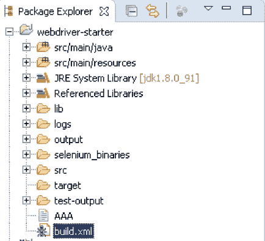

## 创建测试用例:

在源码文件夹 src/main/java 下有三个包，分别是 appobjects, tasks 和 testcases。它们分别用于存放 ui 逻辑层，业务逻辑层和测试用例层的代码。首先我们展开 testcases 节点，下面包含一些已经写好的范例。每个范例都有具体的说明帮助我们理解如何创建我们自己的测试用例。 接下来我们新建一个 class Test_010_001，如图所示:

##### 创建一个 class

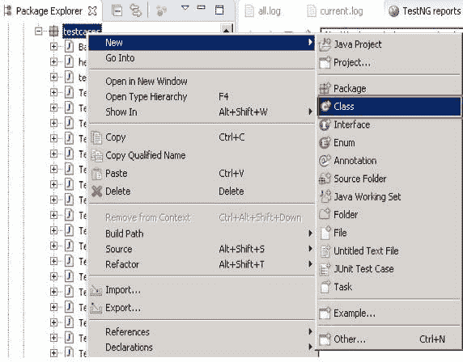

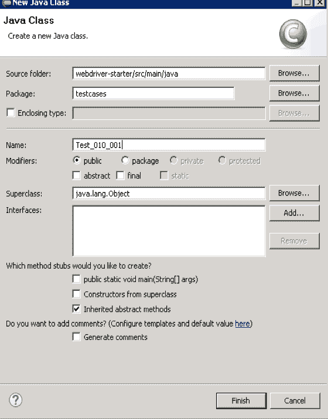

点击 Finish 按钮完成创建。

在该类里添加如下代码:

```
 package testcases;
            import org.testng.annotations.Test;
            public class Test_03_010 extends BaseTestCase {
               @Test
               public void _010() {
               //在这个方法里写测试用例的具体步骤;
            }
            } 
```

## 定位页面元素

FluentLenium 框架默认的元素定位方法是 CSS Selector，它能解决大多数的元素定位问题。如果想使用 Xpath 方法对元素进行定位，你也可以用 getDriver()方法来取得 Selenium webdriver instance，例如: captureElement(getCapturePath(“searchBox”), getDriver().find(By.xpath(..) ) ) 如何获得元素的 CSS 和 Xpath 呢? 网络上这样的工具有很多，常见的有 Firebug 和 Chrome 自带的 Inspect, 大概的步骤是:

先用 chrome Inspect / firebug 去审查一下该元素

##### Firebug 工具 1

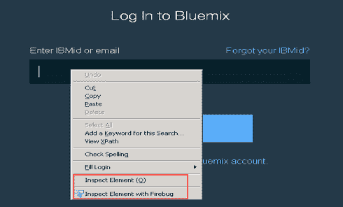

然后看一下元素及其上层节点是否有可用的属性(具有唯一性)，在 Firebug 上你也可以通过 Inspect 按钮辅助找到元素在 html 里的位置，点击后通过把鼠标焦点移动到你想要定位的元素上面，将出现一个蓝色的线框，单击鼠标即可。

##### Firebug 工具 2


当你在 Firebug 的 html 视图内移动鼠标，鼠标焦点所到的位置对应的页面元素同样会在页面中标记出蓝色线框。

##### Firebug 工具 3


假如元素具有唯一的属性，例如 id=”username”, 你可以通过 Firebug 里的 Console 工具测试一下，点击 Console 标签,在下面的命令行输入框中输入$$(‘#username’)，看是否能得到唯一的元素信息。

##### Firebug 工具 4


如:[input#username property value = “” attribute value = “null”]，鼠标点一下获取到的元素信息，Firebug 将会跳转到 html 视图并高亮显示定位到的元素的 html 代码段，如图：

##### Firebug 工具 5


当你通过 Firebug/Chrome Inspect 确认元素唯一定位信息后，你可以在代码里测试你的定位信息是否正确。如: “fill(“input[id=username]”).with(“tester@cn.ibm.com”);”，运行代码看是否能正确执行输入动作。 通过这种方法，我们就可以一个接一个的添加动作了。在实际的脚本开发中，我们常会遇到一些没有 id 或者唯一属性的元素，我们可以通过他们上层的唯一关系来获得这个元素的定位信息，例如: “#wchecklist:nth-of-type(3) h2″，即页面中第三 id 为 wchecklist 元素里面带有 h2 标签的元素。

##### 标签示例

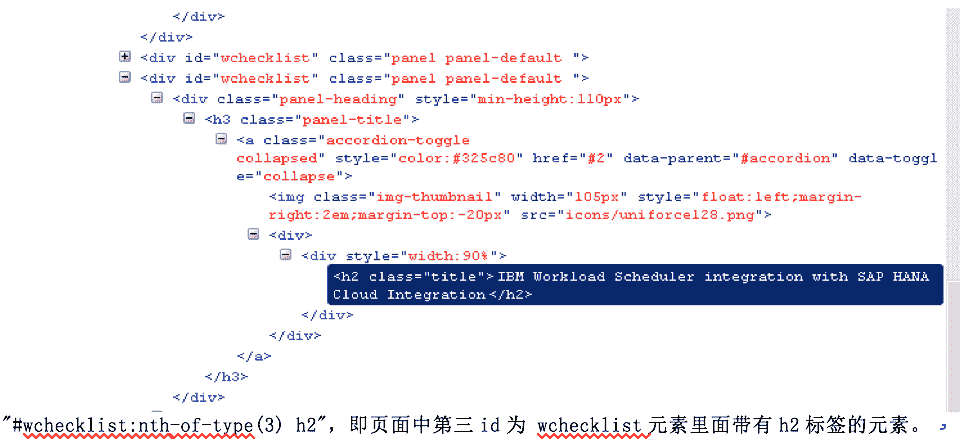

## 运行测试用例

运行单个 TestCase： 鼠标右键点击 Test_01_010.java -> Run As，在快捷菜单里选择 “Run as TestNG Case”。

##### TestNG 执行


你能通过修改 src/main/resources/testdata.xml 文件自定义一些参数以便在脚本中调用，如图:

规则：<entry key="xxx">value</entry>

##### XML 文件模板


也可以右键单击 src/main/resources/suite.xml 文件调用 TestSuite 去运行多个 TestCase 类似上面 XML 模板一样，也可以通过修改 src/main/resources/suite.xml 文件自定义一些参数方便组织 testcase 的执行，如图:

##### TestNG Suite 执行

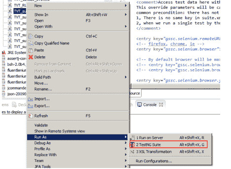

规则：<parameter name="xxx" value="xxx"></parameter>

##### Suite XML 模板 1


运用 ANT built.xml 来自动化统一执行在 TestSuite 中定义的测试用例，批量执行 TestCase

## 应用 TestNG 组织测试用例

TestNG 是一个测试框架，其灵感来自 JUnit 和 NUnit 的，但引入了一些新的功能，使其功能更强大，使用更方便。

TestNG 是一个开源自动化测试框架，TestNG 表示下一代。 TestNG 是类似于 JUnit（特别是 JUnit 4），但它不是一个 JUnit 扩展。它的灵感来源于 JUnit。它的目的是优于 JUnit 的，尤其是当测试集成的类。 TestNG 的创造者是 Cedric Beust（塞德里克·博伊斯特）。

TestNG 消除了大部分的旧框架的限制，使开发人员能够编写更加灵活和强大的测试。 因为它在很大程度上借鉴了 Java 注解（JDK5.0 引入的）来定义测试，它也可以告诉你在真实的 Java 语言生产环境中如何使用这个新功能。

##### TestNG suite XML 模板 2

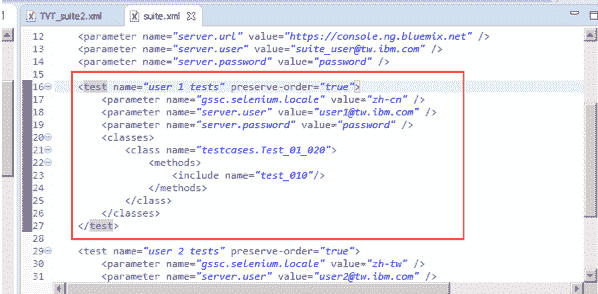

##### 常用截图方法

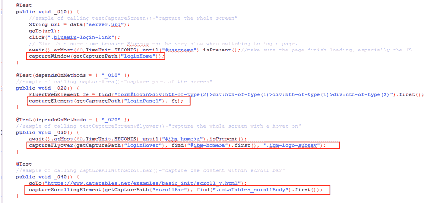

1.  captureWindow(String)将把整个浏览器屏幕作为截图目标，并将截取的图片存入参数 String 所指定的位置。
2.  captureElement(String,FluentWebElement)将对定位到的 FluentWebElement 截图操作，即仅对定位到的对象截图。
3.  captureFlyover(String,FluentWebElement,String)将模拟鼠标在定位到的对象上浮动，并截取 String 参数对应的 CSS Selector 的元素的 Tooltips
4.  captureScrollingElement(String, FluentWebElement)可以为带有滚动条的页面截图，程序会自动调用 JavaScript 脚本去操作滚动条，然后计算并截取多张图片，最后拼合成一个完整的图片。第二个参数是 FluentWebElement 类型的，用来定位带有滚动条的元素。

## 结合 Selenium 解决常见问题

1.  处理 Iframe 和切换多个窗口 switchTo(FluentWebElement)方法能够切换到指定的 Iframe。通过 switchTo()或者 switchToDefault()能够切换回到原来的页面。
2.  缩放浏览器的显示比例。首先，通过 getDriver()方法获取到 WebDriver 对象，然后调用 Selenium 的定位方法定位 html 标签，再通过 WebElement 对象的 sendKeys 方法发送组合键达到缩放窗口的效果。WebDriver driver = getDriver();

    WebElement html = driver.findElement(By.tagName(“html”));//Zoom Inhtml.sendKeys(Keys.chord(Keys.COMMAND, Keys.ADD));//Zoom Outhtml.sendKeys(Keys.chord(Keys.COMMAND, Keys.SUBTRACT));

3.  如何上传文件

    上传文件首先调用 getDriver()方法获得 selenium Webdriver 对象，然后定位到页面上的上传元素，再通过 sendKeys(keysToSend)方法，执行上传。

    WebDriver driver = getDriver();WebElement uploadBtn = driver.findElement(By.name(“Upload”)); uploadBtn.sendKeys(“C:\file.txt”);

4.  在识别元素过程中,经常会用到元素的 css 属性，在此过程中，会有很多试错的过程，因为同一个页面会有很多相同属性的元素，这时需要找到上下的逻辑关系，或者页面的唯一识别元素来精确定位元素的位置，结合元素的属性，进行进一步的测试。通常我们在点击某个页面元素的时候，可能会遇到悬浮窗，这时，系统会报错，提示有 element 悬浮在页面上方，这时需要加一些判断，来处理悬浮窗，等待其消失或者主动将其关闭。从而顺利执行我们的 testcase。

## 结合 Javascript 解决常见问题

1.  把字符串标记出来

    在 TVT 截图过程中需要标明哪些字符串是需要被验证的对象，所以我们在利用工具截图过程中需要将其标记出来，这时我们可以调用 JavaScript 脚本来为元素加边框。在程序里我们可以通过调用 executeScript(String script)方法来执行 JavaScript。如: executeScript(“document.getElementById(\”kw\”).style.border=\”2px solid red\”;”);

2.  利用 JavaScript 显示隐藏对象

    JavaScript 隐藏 Element 的方式通过设置 style 的 display 和 visibility 属性实现。如:

    style.display=”none”或 style.visibility=”hidden”，它们的区别是:”display”不但隐藏 Element，而且被隐藏的 Element 不再占用显示时占用的位置，而”visibility”隐藏仅仅是将 Element 设置成不可见，但被隐藏的 Element 仍占据原来的的位置。于是我们可以通过改变”display”和 “visibility”的值来显示出 Element，如:

    `style.display="block"` 或 `style.visibility="visible"`，如:

    `executeScript("document.getElementsByClassName(\"tooltip\")[0].style.display=\"block\"");` 或 `executeScript("document.getElementsByClassName(\"tooltip\")[0].style.visibility=\"visible\"");` 需要注意的是在 JavaScript 里的双引号需要用\转义。同样的，也可以使用 JQuery 语法把隐藏对象显示出来。

    //隐藏 $(“#id”).css(‘display’,’none’); 或 $(“#id”).hide()//显示$(“#id”).css(‘display’,’block’); 或 $(“#id”).show()//切换 Element 可见状态

    $(“#id”).toggle() 注: $(“#id”)表示返回的 JQuery 对象。

3.  利用页面对象模式提升代码的可读性

    页面对象模式能把所有的用户与界面交互的元素做封装，更易于代码的维护和阅读。如果将来页面出现变化，可以很方便的通过修改 Page 类来适应新的变化。

##### 页面对象封装模板

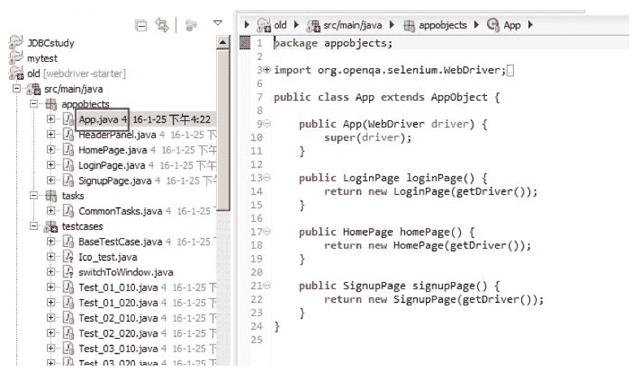

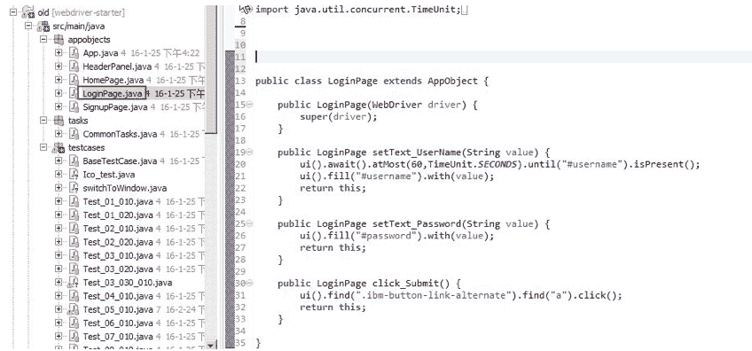

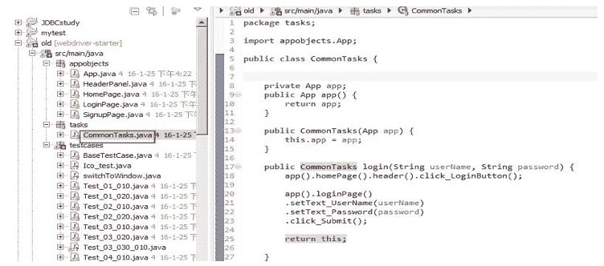


## 结束语

本文简要介绍了 Selenium、FluentLenium 框架在 GVT/TVT 中截图的应用，从而可以提高 GVT 和 TVT 的工作效率。而且，该框架结合 Selenium 也能够实现 GVT/TVT 中的大多数测试用例。