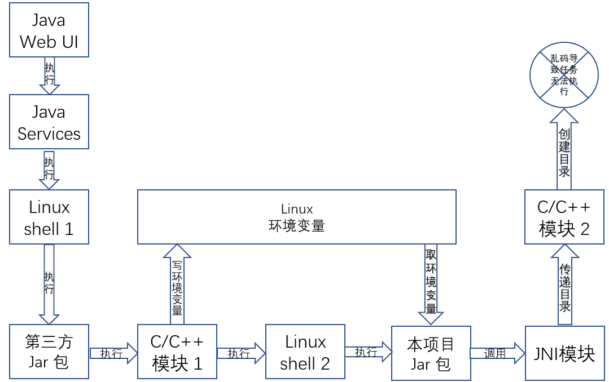
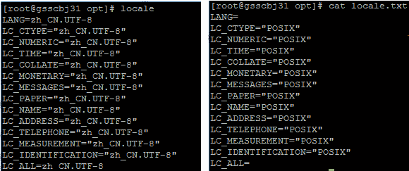
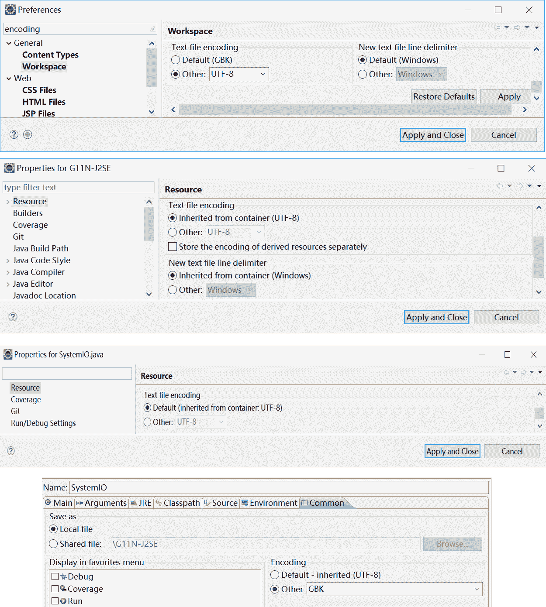

# 从外部编码的角度再议 Java 乱码问题

> 原文：[`developer.ibm.com/zh/articles/java-random-code-from-the-perspective-of-compilation/`](https://developer.ibm.com/zh/articles/java-random-code-from-the-perspective-of-compilation/)

## 概览

在实际项目中，由于系统的复杂性，乱码的根源往往不容易快速定位，乱码问题不见得一定能通过在 Java 内部编解码的方式解决。正确的做法应该是依次检查输入 Java 虚拟机（以下简称 JVM）前的字符串、JVM 内的字符串、输出 JVM 的字符串是否正常。自字符串经过某种形式读入到经过某种方式写出，只有整条流水线完美配合才能彻底杜绝乱码的出现。

这就要求我们不仅要搞懂 Java 内部在输入输出时处理字符编解码的机制，还要了解操作系统的语言区域设置和 JVM 的启动参数对 JVM 编译运行时的默认编码（部分 API 无法显式指定编码，只能使用默认编码）的影响、Eclipse 中编码设定的承继关系、负责显示的终端/控制台的编码/代码页对字符解析的影响等一系列问题。

本文将以一个在实际项目中遇到的乱码问题作为出发点，依次从问题描述、故障排除、根源分析等层次递进剖析该问题，继而探寻乱码产生的本质。读者不仅能够通过本文深入理解外部编码导致乱码这一问题，还能从本文解决问题的思维方法中获得经验和教训。

## 从一个真实项目中遇到的乱码问题谈起

### 问题描述

曾经在项目中遇到过一个耗时比较久的乱码问题，问题的表象是报出了一个创建文件夹失败（由乱码导致）的异常。由于系统比较复杂、难于调试且笔者对 JVM 默认编码和相关源码不够熟悉，经过了很长时间的研究和多人协作进行故障排除后才精准定位到了问题根源。

如图一所示，该系统涉及了 C/C++，Java，shell 等多个模块，模块间的调用关系也比较复杂，部分通过 SOAP，部分通过 JNI，甚至有少部分通过环境变量共享数据的情况–这也是本问题的核心所在。

##### 图 1\. 问题所处系统结构



### 故障排除

由于在项目进行过程中大部分乱码问题都出现在了涉及操作系统的后端逻辑，因此笔者起初在解决该问题时就未对 Java 部分引起足够的重视，最后的结果也证明这是极不可取的。这是笔者在解决该问题时犯的根本性错误，先入为主的偏见。

#### 排错过程及相关教训

*   解决该问题的突破点是前台看到的”创建文件夹<含有乱码的文件路径>失败”这个异常，搜索代码发现该异常位于本项目 Jar 包中，顺着异常往前追溯代码，在过滤掉一系列并不会导致乱码的 Java 内部操作后追踪到了 Java 与外部交互的地方：System.getenv(“key”)。异常中提到的文件夹名字的一部分来自该函数取得的环境变量，而 Java 取得的该环境变量是乱码。查看 Java API 后发现该函数并无可指定编码的重载函数，也没找到可以查看编码的存储环境变量的文件，因此我们得出了问题不在 Java 部分的结论（此处犯错的原因在于没有查看 JDK 源码的习惯）。
*   接下来 C/C++模块的同事查看相关日志后发现日志中的该字串是正常的，因此怀疑问题出在 System.getenv(“key”)并请求调试 Java 部分代码。
*   由于对系统的整个编译构建过程不够熟悉，笔者并没有加断点在线调试或者修改代码查看输出，而是编写了简单的 shell 和 Java 代码去仿真验证当环境变量被正确设置时 Java 能否正常读取。虽然结果是肯定的，但是由于对 JVM 的系统属性和默认编码机制不敏感，笔者忽略了该仿真并不能完全模拟运行时的问题，系统运行时启动的 shell 和试验中 shell 的编码是不同的，由此导致 JVM 内的默认编码是不同的，这也是该问题的根源。
*   当把仿真的结果通知 C/C++模块的同事并与之解释清楚 Java 端也并不容易调试之后，我们将该问题分两个方向继续进行研究：一是笔者尝试搭建 Java 模块的调试环境；二是 C/C++模块的同事进行代码走查查看 C/C++模块是否有出错的可能。
*   接下来 C/C++模块的同事给出的结论是该环境变量在 C/C++模块是正确的，而且因为 Linux 平台没有类似 Windows 平台的 ANSI 格式以及转码的问题，所以非英文字串在 Linux 平台内部的传递和转换都不应出现乱码。
*   得知上述结论后笔者在 System.getenv(“key”)并不会出问题的这个错误假设的基础上再次走查 Java 部分的代码，走查后发现取完环境变量之后只是做了静态变量获取、字符串拼接等普通操作，并没有可以引起乱码的可疑代码。之后笔者”惊奇”地发现 Java 部分并没有去创建目录，而是把目录字符串通过 JNI 传递给 C/C++模块，然后就得出了问题可能出在 JNI 或者 C/C++模块二的错误结论。其实这个结论现在看起来非常荒谬，因为从清单 1 可以明显看出在进行 JNI 调用前已经出现了乱码。

##### 清单 1\. 抛出异常的 Java 代码

```
File dirFile = new File(folderPath);
Utils.createPathViaJNI(serviceContext, folderPath, sessionId);
if (!dirFile.exists() || !dirFile.isDirectory()) {
   throw new IOException("failed to create folder <" + folderPath + ">");
} 
```

*   最终，C/C++模块的同事发现 C/C++模块 2 得到的字串已经是乱码，并且 C/C++模块 2 直接去获取环境变量时可以得到正确的值。目前看来问题还是出在了 JNI 部分（其实是 Java 部分，因为 6 中有谬误）。
*   在绕了一圈回到原点后笔者终于搭建了 Java 部分的调试环境，结果发现 Java 中取到的环境变量已经是乱码(其实该点通过异常信息和代码走查即可看出)。至此问题才开始变得清晰，综上可得 C/C++模块 1 设了环境变量、C/C++模块 2 去取是没问题的，Java 去取是有问题的。此时由于笔者搜索源码发现 C/C++模块中还有其他设置该环境变量的地方，因此亦曾怀疑是否有可能 Java 取环境变量的前后有其他部分的 C/C++代码分别把该环境变量设置了多次，Java 部分之前设置了乱码，Java 部分之后设置了正确的。现在回想起来该推测相当不着边际，当然这一猜测在当时也被 C/C++模块的同事予以直接驳回。
*   虽然事实残酷，但越来越多的证据表明问题出在了 Java 部分。此时笔者首先在运行时 Linux shell 2 中打印该环境变量发现该环境变量是正确的，这就更加佐证了问题出在 System.getenv(“key”)中这个论断。不过问题在于最初的仿真实验表明如果 shell 中的环境变量正确， Java 中取是没问题的。此时笔者开始怀疑 shell 中运行 jar 包时是否需要添加某个参数，或者本地的编译环境和构建环境不一致。
*   至此对该问题的分析终于走向了正轨且确认了问题根源的前置边界，笔者又在 Java 代码的 main 函数的入口处打印了该环境变量以证明调用 Java 后异常报出前并没有调用 JNI 重新设置过环境变量，至此已基本断定问题出在 System.getenv(“key”)。
*   在与另一个有经验的同事后讨论后，怀疑的重点放到了 shell 和 JVM 的 locale 设置上。然后做了一系列结果如表 1 的对比试验。

##### 表 1\. 获取非英文 Linux 环境变量对比试验结果

| **何处设置** | **仿 真 s hel l 取** | **仿 真 J av a 取** | **产 品 s hel l 取** | **产 品 J av a 取** |
| --- | --- | --- | --- | --- |
| 仿真 shell | 正常 | 正常 | 无法获取 | 无法获取 |
| 产品 shell | 无法获取 | 乱码 | 正常 | 乱码 |

*   最终通过在 Java 代码中打印系统属性揭开了谜底。表 1 中仿真 shell 和产品 shell 的核心区别在于区域语言的设置，前者为 zh_CN.UTF-8，后者为空，如图 2 所示。

##### 图 2\. 仿真 shell 和产品 shell 的区域语言设置



导致的结果就是在对应环境无参启动 JVM 后得到的 file.encoding 系统属性即默认字符集分别是 UTF-8 和 ANSI，如图 3 所示。

##### 图 3.仿真 shell 启动的 JVM 系统属性和产品 shell 启动的 JVM 系统属性


*   最后该问题通过在 Linux shell 2 中运行 jar 包时将添加-Dfile.encoding=UTF-8 参数得以解决。

#### 正确的排错过程

*   找到异常位置后应该首先查看抛出异常的地方是不是导致问题的地方，检查异常是否是由于更底层的异常导致的。如上文清单 1 所示，异常信息中出现的乱码在进行 JNI 调用前已经出现（String 类型的 folderPath 作为值传递并不会发生改变），因此可以暂时排除后续 JNI 调用导致的问题。
*   在第一步缩小了问题根源的后置边界后，参考图一可得下一步需要排除的即是明确问题到底是出在 Linux shell 2 之前还是本项目 Jar 包中。结果通过在 Linux shell 2 中运行 Jar 包前打印环境变量发现字符串是正确的，此时基本可以断定问题出在 Java 部分。
*   之后通过走查 Java 部分代码过滤掉绝对不会导致乱码的部分后发现只有 System.getenv(“key”)这一 Java 与外部交互的接口，问题只可能出在这里。
*   到这里如果对字符串的本质能有个清晰的认识的话应该就能找到问题的解决方向。虽然查资料不容易找到环境变量的存储机制，但无论是在文件中还是内存中总归应该是以某种编码编组的二进制形式存在，然后 getenv 读取的时候再采用相应的编码去解码即可成功创建字符串。既然 getenv 无法显式指定外部编码的话那么应该是采用了默认编码去解码，问题估计出现在了这里。
*   最终通过打印产品 JVM 中的默认编码发现为 ANSI，尝试在启动 JVM 时显式指定 file.encoding 为 UTF-8，问题得解。

### 根源分析

目前我们观察到的现象是基于 Linux 版的 JDK 获取系统环境变量时如果默认字符集不是”UTF-8″时会得到乱码。那么 windows 平台呢？试验的结果是默认字符集无论改为 GB18030，UTF-8，ISO-8859-1 甚至 US-ANSI，读进来的 sysenv 都是正确的，看来 windows 版的 JDK 不存在该问题，该问题与 getenv 在不同平台的实现有关。

在深入源码分析前我们可以大胆地做一下猜测，众所周知 windows 的内部编码是 UTF-16，那么其环境变量无论是存在哪里估计都是按 UTF-16 编码的字节数组。而恰恰 Java 内部的编码也是 UTF-16，可以想见 getenv 在 windows 上的 JNI 本地实现是相对简单的，JNI 本地实现中可以直接解码返回 Java 字符串，无需 JDK 再去解码字节数组。

与之对应的是 Linux 的内部编码是 UTF-8，该问题出现的原因很可能是 getenv 的 Linux 本地实现返回的是 UTF-8 编码的字节数组。Linux 版的 JDK 采用默认编码 ANSI 去解码该字节数组创建字符串时导致了乱码。

## 从外部编码的角度解读 Java 乱码问题

### Java 编码问题简述

#### 编译阶段

首先需要澄清的是，作为二进制文件，无论在什么系统和字符集下编译，Java 编译后的字节码文件（.class）始终以 UTF-8 编码。

与此不同的是，作为文本文件，Java 源文件（.java）则可能是以特定文化的字符集编码（比如中文 windows 下的 GBK）的。无参执行 Javac 进行编译时会默认使用操作系统的编码编译文件。此时若创建文件和编译文件在同一系统且系统编码未变则不会出现问题；否则若文件的编码与编译时系统的默认编码不一致，在无参执行 Javac 编译时就会出现错误，需要在编译时通过显式添加”-encoding enc”参数来解决。

#### 运行阶段

同样首先需要强调的是在 JVM 内字符串采用 Unicode（UTF-16）编码，Java 系统内部不会出现乱码问题。与 Java 相关的乱码问题一般是发生在输入输出阶段，因为外部资源的编码（比如 Linux 里的环境变量是 UTF-8 编码的）不见得就是 Unicode（UTF-16）编码的，所以在输入输出的时候就需要指定外部编码以便其能和 Java 内的 Unicde 编码做转换动作。

比如读文件时给输入流指定编码的意思就是

将把采用何种编码方式编组的字节/字符流转换为 Java 内以 Unicode 编码的字符串；写文件时指定编码意思就是将采用何种编码将 Java 内以 Unicode 编码的字符编组为字节数组写到文件里。

Java 中输入输出相关的 API 一般都有是否指定外部字符集的重载形式，选择不指定外部字符集形式的函数时将使用默认字符集，即 Charset.defaultCharset()。查看相关源码（见清单 2）可见 defaultCharset 由系统属性 file.encoding 决定。再进一步，若 JVM 启动时未在启动参数中添加相应的系统属性参数”-Dfile.encoding=enc”，JVM 中的该系统属性在默认情况下由启动该 JVM 的环境决定，比如当前控制台的编码或 Eclipse 运行时编码。

##### 清单 2\. Charset.defaultCharset()源码

```
/**
 * Returns the default charset of this Java virtual machine.
 *
 * <p> The default charset is determined during virtual-machine startup and
 * typically depends upon the locale and charset of the underlying
 * operating system.
 *
 * @return  A charset object for the default charset
 *
 * @since 1.5
 */

import sun.security.action.GetPropertyAction;
public static Charset defaultCharset() {
    if (defaultCharset == null) {
        synchronized (Charset.class) {
            String csn = AccessController.doPrivileged(
                new GetPropertyAction("file.encoding"));
            Charset cs = lookup(csn);
            if (cs != null)
                defaultCharset = cs;
            else
                defaultCharset = forName("UTF-8");
        }
    }
    return defaultCharset;
} 
```

### 与 Java 乱码相关的外部编码详解

#### 操作系统中的系统编码与 JVM 系统属性参数

上节提到在未显式指定相关参数的背景下，命令行下编译时 javac 将基于系统编码编译 Java 源文件，运行时也将使用系统编码初始化 file.encoding 这一系统属性，继而影响默认编码和使用默认编码的输入输出函数。

系统编码可以说是操作系统区域语言设置的一部分，或者像 windows 系统那样区域语言的设定决定了系统编码（比如 windows 系统区域设置为”英语（美国）”时代码页/系统编码为 437 或 Cp1252，系统区域设置为”中文（简体，中国）”时代码页/系统编码为 936(gbk)，或者像 Linux 那样将系统编码作为区域语言设定的补充（比如 LANG=en-US.UTF-8）。

Java 应用程序在 JVM 内运行，而 JVM 在操作系统内运行。从 Java 应用程序的角度看，JVM 和操作系统均是其所处的系统环境，因此 JVM 和操作系统中的属性都被称为系统属性。无参状态启动 JVM 时其将根据自己所处的系统环境初始化这些系统属性参数，有参启动时则可以通过添加-D 参数指定具体的系统属性的值。

上文已经提到了 file.encoding 这个属性会影响 JVM 内的默认编码，另外笔者阅读相关源码发现个别 API 还会依赖 sun.stdout.encoding 这一属性对应的编码，后文对部分 JDK 源码的分析部分将详细阐述该问题。

有意思的是试验发现在 windows 系统区域设置为英语（美国）时，命令行下通过 chcp 查看当前代码页为 437，在该命令行无参启动 JVM 后得到的 file.encoding 为 Cp1252，sun.stdout.encoding 为 cp437；Eclipse 基于系统取得的编码为 Cp1252，默认运行后得到的 file.encoding 为 Cp1252，sun.stdout.encoding 为空。结果如表 2 所示：

##### 表 2\. Windows 平台 JVM 系统属性与操作系统区域设置的对应关系

| **系统区域** | **启动环境** | **环境编码** | **file.encoding** | **sun.stdout.encoding** |
| --- | --- | --- | --- | --- |
| 英语（美国） | 命令行 | 437 | Cp1252 | cp437 |
| 英语（美国） | Eclipse | Cp1252 | Cp1252 | null |
| 中文（简体，中国） | 命令行 | 936 | GBK | ms936 |
| 中文（简体，中国） | Eclipse | GBK | GBK | null |

#### Eclipse 中编码设定的承继关系

上文曾提到 JVM 中的默认字符集由其获得的系统属性 file.encoding 决定，而该系统属性在未指定相应启动参数时由启动该 JVM 的环境编码决定（参考表 2），操作系统命令行中的环境编码比较容易理解，即为该运行时的区域语言设置决定的编码或者代码页，那么 Eclipse 中呢？

研究发现在 Eclipse 中运行 Java 应用时，若未在运行配置的参数设定页面指定相关 JVM 启动参数，file.encoding 属性由通用设置页面的编码决定，而该编码默认情况下继承自 main 函数所在源码文件的编码类型，该源码文件的编码类型默认继承自该项目的文本文件编码类型，该项目的文本文件编码类型默认继承自该工作空间的文本文件编码类型，最终该工作空间的文本文件编码类型由系统编码决定，如图 4 所示自上而下展示了这种承继关系。

##### 图 4\. Eclipse 中编码设定的承继关系



#### 显示终端的编码与代码页设定

在涉及 Java 字符串流转的整个生命周期中，起点是某种形式（比如某种输入流）的读入，而终点则是某种形式的存储（比如写入文件）或显示（比如调试打印用的各种控制台）。即使输入输出都没问题，控制台解析 Java 输出流时所采用的编码与该流的编码不一致的话仍然会出现乱码。

一般常见的显示终端有系统终端（windows 或 Linux 的命令行），远程桌面终端和 Eclipse 中的输出控制台。

*   命令行的编码由当前环境的代码页或系统编码控制，windows 和 Linux 下可分别使用 chcp 和 locale 命令查看
*   远程桌面终端比如 Putty 控制台的编码不受所访问的系统的控制，需要在”变更设置》窗口》翻译转换”中配置。
*   Eclipse 中的控制台编码由运行配置中的通用设定页的编码决定，该编码的承继关系可参考上节内容。

### 通过解读 JDK 源码深入理解部分 API 对外部编码的依赖

#### System.getenv

分析清单 3 可看出，System.getenv 将调用 ProcessEnvironment.getenv()，正如我们在上文猜测的那样，ProcessEnvironment 最终调用的 JNI 函数 environmentBlock()返回的为完整的环境变量字符串，JDK 中并没有涉及解码的问题。因此无论默认编码是什么编码，window JDK 取到的环境变量都不是乱码。

##### 清单 3\. System.getenv 在 windows 上的实现

```
public static String getenv(String name) {
    SecurityManager sm = getSecurityManager();
    if (sm != null) {
        sm.checkPermission(new RuntimePermission("getenv."+name));
    }
    return ProcessEnvironment.getenv(name);
}

static {
    ...
    String envblock = environmentBlock();
    int beg, end, eql;
    for (beg = 0;
         ((end = envblock.indexOf('\u0000', beg  )) != -1 &&
          // An initial `=' indicates a magic Windows variable name -- OK
          (eql = envblock.indexOf('='     , beg+1)) != -1);
         beg = end + 1) {
        // Ignore corrupted environment strings.
        if (eql < end)
            theEnvironment.put(envblock.substring(beg, eql),
                               envblock.substring(eql+1,end));
    }
    theCaseInsensitiveEnvironment = new TreeMap<>(nameComparator);
    theCaseInsensitiveEnvironment.putAll(theEnvironment);
}
...
// Only for use by System.getenv(String)
static String getenv(String name) {
    // ...
    return theCaseInsensitiveEnvironment.get(name);
}
...
private static native String environmentBlock();
/* Returns a Windows style environment block, discarding final trailing NUL */
JNIEXPORT jstring JNICALL
Java_Java_lang_ProcessEnvironment_environmentBlock(JNIEnv *env, jclass klass)
{
    int i;
    jstring envblock;
    jchar *blockW = (jchar *) GetEnvironmentStringsW();
    if (blockW == NULL)
        return environmentBlock9x(env);
    /* Don't search for "\u0000\u0000", since an empty environment
       block may legitimately consist of a single "\u0000".  */
    for (i = 0; blockW[i];)
        while (blockW[i++]);
    envblock = (*env)->NewString(env, blockW, i);
    FreeEnvironmentStringsW(blockW);
    return envblock;
} 
```

分析清单 4 可看出，Linux 版的 JDK 中 ProcessEnvironment 最终调用的 JNI 函数 environ ()返回的为二维字节数组，在解析该字节数组构建环境变量字符串时用到了 new String()的不指定外部字符集的形式，这就对默认编码形成了依赖，如果在外部编码不为 UTF-8 时无参启动 JVM 读取的非英文 Linux 环境变量就会出现乱码-即本文开头提到的问题的源码级根源。

##### 清单 4\. System.getenv 在 Linux 上的实现

```
static {
    // We cache the C environment.  This means that subsequent calls
    // to putenv/setenv from C will not be visible from Java code.
    byte[][] environ = environ();
    theEnvironment = new HashMap<>(environ.length/2 + 3);
    // Read environment variables back to front,
    // so that earlier variables override later ones.
    for (int i = environ.length-1; i > 0; i-=2)
        theEnvironment.put(Variable.valueOf(environ[i-1]), Value.valueOf(environ[i]));
    theUnmodifiableEnvironment = Collections.unmodifiableMap
        (new StringEnvironment(theEnvironment));
}
/* Only for use by System.getenv(String) */
static String getenv(String name) {
    return theUnmodifiableEnvironment.get(name);
}
...
private static native byte[][] environ();
...
private static class Value extends ExternalData implements Comparable<Value>
{
    ...
    public static Value valueOf(byte[] bytes) {
        return new Value(new String(bytes), bytes);
    }
    ...
}

JNIEXPORT jobjectArray JNICALL
Java_Java_lang_ProcessEnvironment_environ(JNIEnv *env, jclass ign)
{
    jsize count = 0;
    jsize i, j;
    jobjectArray result;
    jclass byteArrCls = (*env)->FindClass(env, "[B");

    for (i = 0; environ[i]; i++) {
        /* Ignore corrupted environment variables */
        if (strchr(environ[i], '=') != NULL)
            count++;
    }

    result = (*env)->NewObjectArray(env, 2*count, byteArrCls, 0);
    if (result == NULL) return NULL;

    for (i = 0, j = 0; environ[i]; i++) {
        const char * varEnd = strchr(environ[i], '=');
        /* Ignore corrupted environment variables */
        if (varEnd != NULL) {
            jbyteArray var, val;
            const char * valBeg = varEnd + 1;
            jsize varLength = varEnd - environ[i];
            jsize valLength = strlen(valBeg);
            var = (*env)->NewByteArray(env, varLength);
            if (var == NULL) return NULL;
            val = (*env)->NewByteArray(env, valLength);
            if (val == NULL) return NULL;
            (*env)->SetByteArrayRegion(env, var, 0, varLength,
                                       (jbyte*) environ[i]);
            (*env)->SetByteArrayRegion(env, val, 0, valLength,
                                       (jbyte*) valBeg);
            (*env)->SetObjectArrayElement(env, result, 2*j  , var);
            (*env)->SetObjectArrayElement(env, result, 2*j+1, val);
            (*env)->DeleteLocalRef(env, var);
            (*env)->DeleteLocalRef(env, val);
            j++;
        }
    }

    return result;
} 
```

#### System.out

分析清单 5 可看出，System.out 本质上是一个 PrintStream，而该 PrintStream 在初始化时会读取系统属性”sun.stdout.encoding”，若该值存在则按该值对应的字符集去初始化背后的 OutputStreamWriter；若不存在则按默认字符集初始化 OutputStreamWriter，亦即系统属性”file.encoding”。

##### 清单 5\. System.out 相关源码

```
private static PrintStream newPrintStream(FileOutputStream fos, String enc) {
   if (enc != null) {
        try {
            return new PrintStream(new BufferedOutputStream(fos, 128), true, enc);
        } catch (UnsupportedEncodingException uee) {}
    }
    return new PrintStream(new BufferedOutputStream(fos, 128), true);
}
...
private static void initializeSystemClass() {
    // ...
    props = new Properties();
    initProperties(props);  // initialized by the VM
    //...
    sun.misc.VM.saveAndRemoveProperties(props);
    lineSeparator = props.getProperty("line.separator");
    sun.misc.Version.init();
    FileInputStream fdIn = new FileInputStream(FileDescriptor.in);
    FileOutputStream fdOut = new FileOutputStream(FileDescriptor.out);
    FileOutputStream fdErr = new FileOutputStream(FileDescriptor.err);
    setIn0(new BufferedInputStream(fdIn));
    setOut0(newPrintStream(fdOut, props.getProperty("sun.stdout.encoding")));
    setErr0(newPrintStream(fdErr, props.getProperty("sun.stderr.encoding")));

}

private PrintStream(boolean autoFlush, OutputStream out) {
    super(out);
    this.autoFlush = autoFlush;
    this.charOut = new OutputStreamWriter(this);
    this.textOut = new BufferedWriter(charOut);
}
private PrintStream(boolean autoFlush, OutputStream out, Charset charset) {
    super(out);
    this.autoFlush = autoFlush;
    this.charOut = new OutputStreamWriter(this, charset);
    this.textOut = new BufferedWriter(charOut);
}
...
public PrintStream(OutputStream out, boolean autoFlush) {
    this(autoFlush, requireNonNull(out, "Null output stream"));
}
public PrintStream(OutputStream out, boolean autoFlush, String encoding)
    throws UnsupportedEncodingException
{
    this(autoFlush,
         requireNonNull(out, "Null output stream"),
         toCharset(encoding));
} 
```

由此可见 System.out 也依赖外部编码，对应地可能会导致以下两种情况的乱码。

*   外部编码对应的字符集不能涵盖将要输出的字符串，比如在添加了参数-Dsun.stdout.encoding=cp1252 时尝试通过 System.out.println 输出”中文”。
*   控制台用于解码的字符集与 JVM 外部编码不一致，比如在进行 Eclipse 运行配置时在参数设定页添加了参数-Dsun.stdout.encoding=GBK（控制字符串输出时的编码格式），但在通用设置页却设定编码为 UTF-8（控制显示字符串时的解码格式）。此时通过 System.out.println 输出”中文”时虽然输出的字节数组（以 GBK 编码）是正确的，但是控制台按 UTF-8 解码就会出现乱码。

## 定位乱码根源的最佳实践

*   综上，在定位乱码根源前，首先要搞清楚乱码的本质。简化起见，在本文语境中，JVM 可以看做字符串的再加工者，而用于显示的控制台（或文件阅读器）可以简单看做消费者。JVM 生产线的原料是来自文件网络等媒介的各种输入流，只有 JVM 知晓（即指定）该输入流采用的编码方式（即外部编码）才能在输入时将流转换为字符串在 JVM 内部的表现形式；同样在产出时也要选择合适的编码将字符串装配为字节/字符流输出。紧接着显示控制台等消费者也需要采用 JVM 输出时使用的编码去解码该字节/字符流才能保证不出现乱码。

因此在出现乱码时，首先要定位乱码的初始位置，然后再看与该处交互的输入输出采用的编码是否一致，此处要特别注意默认编码对 JVM 编译运行的影响，必要时可以研究 JDK 源码以深入分析一些隐晦的输入输出函数。

## 结束语

本文从一个实际项目中遇到的乱码问题入手，详细描述了该问题的解决过程；继而通过对该问题根源的深入剖析，结合源码和实例从外部编码的角度深入解读了 Java 乱码问题。希望本文能对读者深入理解和解决 Java 乱码问题提供帮助。

## 参考资源

*   参考 [维](https://en.wikipedia.org/wiki/Code_page) [基](https://en.wikipedia.org/wiki/Code_page) [百科](https://en.wikipedia.org/wiki/Code_page) ，查看代码页的相关信息。
*   查阅 [JDK Bug System](https://bugs.openjdk.java.net/browse/JDK-8166606) ，详细了解 System.getenv 的当前实现导致的问题。
*   访问 [openJDK](http://openjdk.java.net/) ，下载并查看 JDK 相关源码。
*   查看文章”[深入分析 web 请求响应中的编码问题](https://www.ibm.com/developerworks/cn/web/wa-lo-ecoding-response-problem/index.html)“，了解更多与 web 有关的乱码问题的成因分析与解决方案。