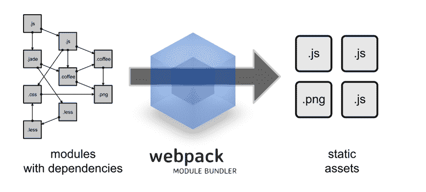
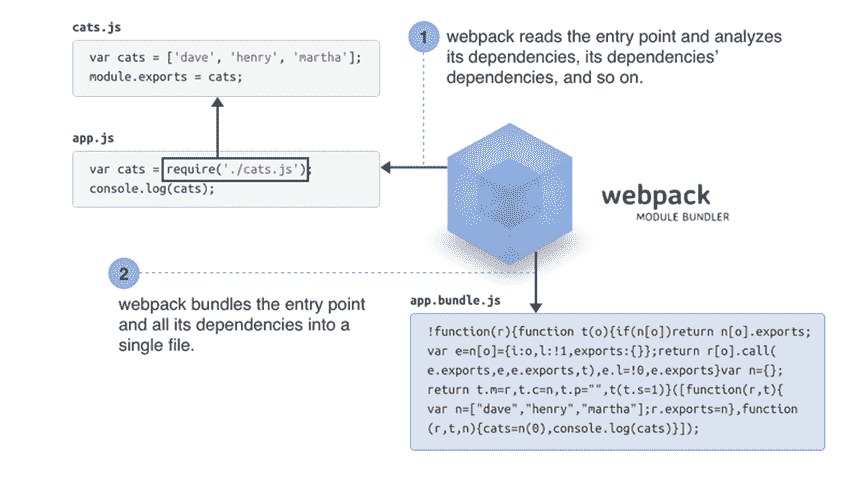
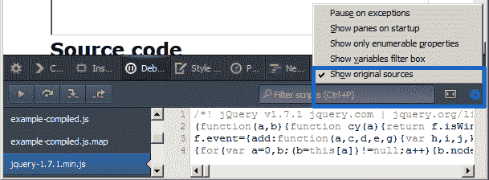

# Web 开发中的利器 – Webpack

> 原文：[`developer.ibm.com/zh/articles/wa-lo-web-develop-edge-tool/`](https://developer.ibm.com/zh/articles/wa-lo-web-develop-edge-tool/)

## 简介

伴随着互联网的出现，网站的表现形式也变得越来越丰富多彩。页面不仅要求内容的充实，表现形式的丰富，而且越来越关注用户的感官与体验。加上智能手机的推广与普及，在短短的 10 年时间，前端开发就涌现出了 HTML5、CSS3、ES6 等众多的技术方案。同时前端的开发也从简单的类库调用，转而关注和强调框架的运用，出现了一批像 AngularJs，ExtJs 这样的 MVC 框架。

但无论是使用类库还是框架，都需要页面加载相对应的 JavaScript 或 CSS 代码，甚至大量的第三方库。如何来管理和组织这些代码和资源，并保证它们在浏览器端可以快速、灵活的加载与更新呢？这就是目前 Web 端所倡导的模块系统所要面对和解决的问题。

本文先从 Web 应用中的模块系统出发，了解目前已经存在的模块系统以及它们的使用方法，从而进一步的理解 Webpack 的出现的历史背景。

## 模块系统的分类

模块系统，需要解决的就是如何定义模块，以及如何处理模块间的依赖关系。我们来看看目前已经存在的模块系统，是如何处理这些问题的。

### script 标签

清单 1\. 使用 `<script>` 标签

```
<script src="module1.js"></script>
<script src="module2.js"></script>
<script src="libraryA.js"></script>
<script src="module3.js"></script> 
```

在 Web 开发的初期，这是最常见的 JavaScript 文件加载方式。但这种方式带来的问题，就是每一个文件中声明的变量都会出现在全局作用域内，也就是在 window 对象中。而且模块间的依赖关系完全由文件的加载顺序所决定，显然这样的模块组织方式会出现很多的弊端

*   全局作用域下容易造成变量冲突
*   文件只能按照 `<script>` 的书写顺序进行加载
*   开发人员需要自己解决模块/代码库的依赖关系
*   在大型项目中这样的加载方式，导致文件冗长而难以管理

### CommonJS

在 CommonJS 规范中，模块使用 require 方法，同步加载所依赖的其他模块。并通过设置 exports 对象（或 module.exports 对象）属性的方式，对外部提供所支持的接口。

清单 2\. 使用 CommonJS

```
require("module");
require("../file.js");
exports.doStuff = function() {};
module.exports = someValue; 
```

优点：

*   可重用服务器端模块
*   在 [NPM](https://www.npmjs.com) 中，有大量的模块使用 CommonJS 规范来书写
*   简单并且容易使用

缺点：

*   同步的加载方式，不适合在浏览器环境，浏览器的资源往往是异步加载的
*   不能非阻塞的并行加载多个模块

实现：

*   [node.js](https://nodejs.org/en/)
*   [browserify](https://github.com/browserify/browserify)
*   [modules-webmake](https://github.com/medikoo/modules-webmake)
*   [wreq](https://github.com/substack/wreq)

### Asynchronous Module Definition

在 Asynchronous Module Definition（AMD） 规范中，模块通过 define (id, dependencies, function) 方法来定义，同时需要指定模块的依赖关系，而这些依赖的模块会被当做形参传到 function 方法中。而应用通过使用 require 方法来调用所定义的模块。

清单 3\. 使用 AMD

```
define("module", ["dep1", "dep2"], function(d1, d2) {
     return someExportedValue;
});

require(["module", "../file"], function(module, file) {
/* ... */
}); 
```

优点：

*   适合在浏览器环境中异步加载模块
*   可以并行加载多个模块

缺点：

*   增加开发成本，不利于代码的阅读与书写
*   不符合通用的模块化思维方式，是一种妥协的实现

实现：

*   [require.js](http://requirejs.org/)
*   [curl](https://github.com/cujojs/curl)

### ES6 模块

ECMAScript2015 (第六版标准) 增加了很多 JavaScript 语言层面的模块体系定义。ES6 模块 的设计思想，是尽量的静态化，使得编译时就能确定模块的依赖关系，以及输入和输出的变量。（CommonJS 和 AMD 模块，都只能在运行时确定这些东西）

清单 4\. 使用 ES6 模块

```
import "jquery";
export function doStuff() {}
module "localModule" {} 
```

优点：

*   容易进行静态分析
*   面向未来的 ECMAScript 标准

缺点：

*   原生浏览器端还没有实现该标准
*   目前支持的模块较少

实现：

*   [Babel](https://babeljs.io/)

### 期望的模块系统

每一种模块系统都有它的优点和缺点，总结下来，我们期望的模块系统是：

*   兼容多种模块系统风格。
*   模块可以按需加载，从而不影响页面的初始化速度。
*   支持多种资源文件，不仅仅只是 JavaScript 模块化，还有 CSS、图片、字体等。
*   支持静态分析，以及第三方类库。
*   合理的测试解决方案。

**按需加载**

前端模块要在客户端中执行，所以他们需要增量加载到浏览器中。

模块的加载和传输，我们首先能想到两种极端的方式，一种是每个模块文件都单独请求，另一种是把所有模块打包成一个文件然后只请求一次。显而易见，每个模块都发起单独的请求造成了请求次数过多，导致应用启动速度慢；一次请求加载所有模块导致流量浪费、初始化过程慢。这两种方式都不是好的解决方案，它们过于简单粗暴。

分块传输，按需进行懒加载，在实际用到某些模块的时候再增量更新，才是较为合理的模块加载方案。要实现模块的按需加载，就需要一个对整个代码库中的模块进行静态分析、编译打包的过程。

**支持多种资源文件**

在上面的分析过程中，我们提到的模块仅仅是指 JavaScript 模块文件。然而，在前端开发过程中还涉及到样式、图片、字体、HTML 模板等等众多的资源。这些资源还会以各种方言的形式存在，比如 CoffeeScript、Less、 Sass、众多的模板库、多语言系统（i18n）等等。如果他们都可以视作模块，并且都可以通过 require 的方式来加载，将带来优雅的开发体验，比如：

清单 5\. 加载多种资源文件

```
require("./style.css");
require("./style.less");
require("./template.jade");
require("./image.png"); 
```

**静态分析**

在编译的时候，要对整个代码进行静态分析，分析出各个模块的类型和它们依赖关系，然后将不同类型的模块提交给适配的加载器来处理。比如一个用 LESS 写的样式模块，可以先用 LESS 加载器将它转成一个 CSS 模块，在通过 CSS 模块把他插入到页面的 `<style>` 标签中执行。

Webpack 就是在这样的需求中应运而生了

## Webpack 简介

Webpack is module bundler。有很多的文章将它说成是模块的打包工具，在我看来都有些偏颇。因为 package 是包裹的意思，而单词 bundler 却是：捆扎，收集，归拢的意思。因此我更倾向于将 module bundler 看作是”模块归集”。因为归集更能够体现了它作为模块系统的特性，它包含了分析模块间的相互依赖关系，将分散的各个文件打包成静态的资源文件（static assets），以及处理文件之间的加载顺序与冲突等问题。

图 1\. Webpack 是什么



简单的总结一下，Webpack 是：

*   模块加载工具
*   模块分析工具
*   模块打包工具

模块的加载->分析->打包，是 Webpack 有别于其他一些打包工具的最本质的区别。

*   **模块加载**

    Webpack 通过 loader 的形式，统一了自身的数据模型，并将那些在应用中出现的资源（包括 css, images, fonts 等等）都统一成 javascript 对象，从而为模块的分析工作铺平了道路。

*   **模块分析**

    Webpack 对这些 javascript 文件进行分析，形成语法树。进而了解模块之间的调用关系与层次。

    Webpack 支持将模块进行拆分，形成 chunk (chunk 包括静态与动态两种形式)，这样不仅可以保证项目在结构上的拆分，也可以支持动态的调用。尤其是动态 chunk 调用，将一些模块拆分成动态 chunk ，这样既不会影响页面的初始化加载速度，同时应用本身也增加了”按需加载”的能力与特性。

    Webpack 支持多种 javascript 语法书写形式（例如 CommonJS，AMD, ES6 等）。支持在应用中调用第三方框架与库文件（需要使用模块加载的兼容策略 – shimm modules），从而避免重新开发与实现。

*   **模块打包**

    Webpack 支持多种打包工具，例如 gulp 和 grunt。得益于其自身丰富的插件，让打包工作中的压缩，混淆以及对于测试（source mapping 文件）的支持变得异常简单。

## Webpack 用法

### 安装 Webpack

通过 npm 命令，全局安装：

```
$ npm install webpack -g 
```

或者

```
$ npm install webpack --save-dev 
```

如果需要使用不同的版本 Webpack，可以：

```
$ npm install webpack@1.2.x --save-dev 
```

### Webpack 命令

让我们以一个实例，来描述如何使用 Webpack 命令。假如，我们有下面的 js 文件:

清单 6\. cats.js

```
var cats = ['dave', 'henry', 'martha'];
module.exports = cats; 
```

清单 7\. app.js (Entry Point)

```
cats = require('./cats.js');
console.log(cats); 
```

调用 Webpack 命令生成 output 文件：

```
webpack ./app.js app.bundle.js 
```

Webpack 通过分析 entry point 文件，发现并找到文件所依赖的所有模块，然后将它们归集在一起，形成最终的 output 文件 – app.bundle.js。下面的图形，描述了它的具体执行过 (Entry Point 可以理解成程序的起始点，而 Webpack 也是从这里来分析模块间的依赖关系的。)

图 2\. Webpack 命令的执行过程



除了使用命令行来调用 webpack 外，还可以通过配置文件的形式。那麽，接下来我们就来说说如何配置 webpack。

### Webpack 的配置

webpack.config.js 是 webpack 的默认配置文件（也可以通过 –config 配置其他文件）。

清单 8\. webpack.config.js

```
module.exports = {
entry: './main.js',
output: {
    filename: 'bundle.js'
}
}; 
```

或者多个 Entry point：

清单 9\. 配置多个 Entry point

```
module.exports = {
entry: {
 Profile: './profile.js',
 Feed: './feed.js'
},
output: {
 path: 'build',
 filename: '[name].js' // Template based on keys in entry above
}
}; 
```

Webpack 的配置文件其实是一个 CommonJS 形式的 javascript 文件。

**Webpack 中的 loader**

图 3\. 通过 babel-loader 提供了对 ES6 语言的支持


清单 10\. 使用 babel-loader

```
module.exports = {
entry: './main.js',
output: {
        filename: 'bundle.js'
},
module: {
        loaders: [
            {
                test: /\.coffee$/,
                loader: 'coffee-loader' },
            {
                test: /\.js$/,
                loader: 'babel-loader',
                query: {
                    presets: ['es2015', 'react']
                }
            }
        ]
    },
resolve: {
        // you can now require('file') instead of require('file.coffee')
        extensions: ['', '.js', '.json', '.coffee']
}
}; 
```

还有其他的一些 loader,比如可以通过使用 json-loader，将 JSON 文件转换成 CommonJS 模块

图 4\. json-loader 的执行过程


Loader 的调用是连续的。Webpack 提倡一个 loader 只完成与它相关的任务，或者单一的任务。我们可以通过组合的形式将多个 Loader 连接起来。

例如，通过用 yaml-loader 先将 YAML 文件转换成 JSON 格式，再通过 json-loader，转换成 CommonJS 模块

图 5\. 连接多个 loader 的执行过程


**编译 css, image, font 等资源文件**

通过使用 style-loader, url-loader，可以将 css, image, font 等资源文件编译成为 javascript 模块。例如

清单 11\. 使用 style-loader / url-loader

```
module.exports = {
entry: './main.js',
output: {
        // This is where images AND js will go
        path: './build',
        // This is used to generate URLs to e.g. images
        publicPath: 'http://mycdn.com/',
        filename: 'bundle.js'
},
module: {
    loaders: [
             // use ! to chain loaders
        {
                test: /\.less$/,
                loader: 'style-loader!css-loader!less-loader'
            },
            {
                test: /\.css$/,
                loader: 'style-loader!css-loader'
            },
            // inline base64 URLs for <=8k images, direct URLs for the rest
            {
                test: /\.(png|jpg)$/,
                loader: 'url-loader?limit=8192'
            }

        ]
}
}; 
```

**生成 chunk 文件**

使用 CommonsChunkPlugin，我们可以将应用中被多次引用到地文件或者方法，提取到一个文件中来。

清单 12\. 生成 chunk 文件

```
 var webpack = require('webpack');
var commonsPlugin = new webpack.optimize.CommonsChunkPlugin('common.js');
     module.exports = {
 entry: {
  Profile: './profile.js',
  Feed: './feed.js'
 },
 output: {
  path: 'build',
  filename: '[name].js' // Template based on keys in entry above
 },
 plugins: [commonsPlugin]
 }; 
```

## Webpack-dev-server 配置

Webpack-dev-serve 是 Node.js 下的小型 Express 服务器，我们可以使用它来测试 webpack 所生成的文件。同时它通过 websocket 与服务器建立通信，支持对模块的代码监控，从而在文件变动时，动态的编译程序并自动刷新页面。

### 安装 webpack-dev-server

$ npm install webpack-dev-server –save-dev

### webpack-dev-serve 的刷新方式

**Iframe mode**

Iframe 的形式并不需要修改配置文件。只需要在访问时调用 `http://<host>:<port>/webpack-dev-server/<path>` 它的特点是：

*   无需更改配置文件
*   在应用顶部会显示相关信息
*   应用本身的 URL 变化，并不会影响地址栏的内容

**Inline mode**

Inline 的形式，是将部分 web-dev-server 的客户端代码，嵌入到 webpack 模块当中。支持命令行（`--inline`）或者配置文件（`devServer: { inline: true }`）。

访问时调用 `http://<host>:<port>/<path>` 的特点是：

*   支持配置文件和命令行
*   状态信息会显示在浏览器控制台中
*   应用本身的 URL 变化，会影响浏览器地址栏的内容

### 配置 webpack-dev-server

清单 13\. 配置 webpack-dev-server

```
module.exports = {
....
devServer: {
 historyApiFallback: true,
 hot: true,
 inline: true,
 progress: true,
},
...
} 
```

然后再 package.json 里面配置一下运行的命令, npm 支持自定义一些命令：

清单 14\. package.json

```
"scripts": {
    "start": "webpack-dev-server --hot --inline --host 0.0.0.0 --port <port>"
}, 
```

在命令行运行如下命令：

```
$ npm start 
```

打开浏览器，访问 `http://localhost:<port>`

### 设置 proxy server

通过 http-proxy-middleware 组件，将请求转发到其他第三方服务器上。这样做的好处就是，让前后端并行的开发而不相互影响。例如:

清单 15\. 设置 proxy server

```
proxy: {
'/api': {
    target: 'https://other-server.example.com',
    secure: false
}
}

// In webpack.config.js
{
devServer: {
        proxy: {
            '/api': {
                target: 'https://other-server.example.com',
                secure: false
         }
    }
    }
}

// Multiple entry
proxy: [
{
        context: [
            '/api-v1/**',
            '/api-v2/**'
        ],
        target:
            'https://other-server.example.com',
            secure: false
}
] 
```

在实际的应用中，有时候我们只是希望将部分请求（例如 web service 请求）发送到 proxy 上，而对于其他的文件请求，并不希望将其发送到 proxy server 上。此时，需要通过正确的设置 bypass 参数来解决，关于 bypass 方法的解释，请参考 `webpack.github.io/docs/webpack-dev-server.html`。

清单 16\. Bypass function

```
proxy: {
'/some/path': {
 target: 'https://other-server.example.com',
 secure: false,
 bypass: function(req, res, proxyOptions) {

    if (req.headers.accept.indexOf('html') !== -1)
 {
 console.log('Skipping proxy for browser request.');

    return '/index.html';
 }
 }
} 
```

## 构建 Web Service 服务 – json-server

json-server ([`github.com/typicode/json-server`](https://github.com/typicode/json-server))，是用来在 web 端构建 web service 服务的工具。它将 json 数据结构与 web server 的概念结合在起来，从而极大地简化了 web service 服务的开发工作。

回想以前，我们构建 web service 服务的时候，不得不借助一些服务器端的技术或者框架来实现，例如 Apache CXF ([`cxf.apache.org`](http://cxf.apache.org))。同时，让 web service 能够运行在 web 端，还需要容器本身的支持（例如 Tomcat，WebSphere 容器）。也就是说，搭建 web service 服务，我们不仅需要熟悉一些框架的结构和 API 接口，还需要完成容器的搭建与服务的部署工作，而这些跟实际的开发工作其实并没有直接的联系。

### json-server 的用法

随着 Node.js 的出现，一些框架与工具开始采用 JavaScript 来实现。其中 json-server 工具的出现，极大的简化了构建 web service 服务的工作。使用 json-server 构建 web service 服务，我们只需要编写如下的 json 文件。

清单 17\. 使用 json-server

```
{
"posts": [
    {
        "id": 1,
        "title": "json-server",
        "author": "typicode"
    }
],
"comments": [
    {
        "id": 1,
        "body": "some comment",
        "postId": 1
    }
],
"profile": {
    "name": "typicode"
}
} 
```

现在启动 json server：

```
$ json-server --watch db.json 
```

如果需要修改 server 的服务端口，可以这样：

```
$ json-server --watch db.json --port 3004 
```

### json-server 构建静态文件服务器

方法一：建立 ./public 文件夹

```
mkdir public echo 'hello world' > public/index.html json-server db.json 
```

方法二：使用 `--static` 参数

```
json-server db.json --static ./some-other-dir 
```

### json-server 的路由配置

建立 routes.json 文件，如下:

清单 18\. Json-server 路有配置

```
{
    "/api/": "/",
    "/blog/:resource/:id/show": "/:resource/:id",
    "/blog/:category": "/posts/:id?category=:category"
} 
```

启动 json-server 服务，并配置 –routes 选项

```
json-server db.json --routes routes.json 
```

访问相应的 url，来测试自定义的路由配置

```
/api/posts # → /posts
/api/posts/1 # → /posts/1
/blog/posts/1/show # → /posts/1
/blog/javascript # → /posts?category=javascript 
```

关于 json-server 的 API 调用，和其他的用法可以参考

```
https://github.com/typicode/json-server 
```

## Source Map 文件与调试

如今的 web 应用变得越来越复杂，也更加强调和关注客户端技术的实现能力。由于很多的功能需要客户端来予以实现，这不仅增加了实现文件的复杂度，也导致文件本身如 css, javascript 变得越来越大。在将 web 应用投入实际的运行环境之前，往往我们需要对这些文件文件进行压缩，合并与混淆的工作，来提高页面的加载速度。

但是，这样的转换却增加了调试工作的难度，source map 的出现就是用来解决这样的问题。Source map 是一个信息文件，里面储存着位置信息。也就是说，转换后的代码的每一个位置，所对应的转换前的位置。有了它，出错的时候，除错工具将直接显示原始代码，而不是转换后的代码。这无疑给开发者带来了很大方便。

### 生成 Source Map 文件

webpack 通过 devtool 参数控制 source map 的生成，并支持多种 source map 配置（参看 [devtool](https://webpack.js.org/)）

清单 19\. 生成 source map 文件

例如

```
{
devtool: "#inline-source-map"
}
// => //# sourceMappingURL=.. 
```

另外一种生成 source map 文件的方法是使用 Google 的 Closure 编译器，其命令格式如下：

```
java -jar compiler.jar \
--js script.js \
--create_source_map ./script-min.js.map \
--source_map_format=V3 \
--js_output_file script-min.js 
```

### 使用 Source Map 调试 JavaScript 文件

Chrome 浏览器需要在 Developer Tools 的 Setting 设置中，确认选中 “Enable source maps”。

图 6\. 使用 source map 调试 JavaScript


Firefox23+ 浏览器的 developer tools，在默认情况下也是支持 source map 文件

图 7\. 使用 source map 调试 JavaScript



## 结束语

本文从模块化系统的优缺点出发，逐步地带领您了解了 Webpack 框架及其使用。