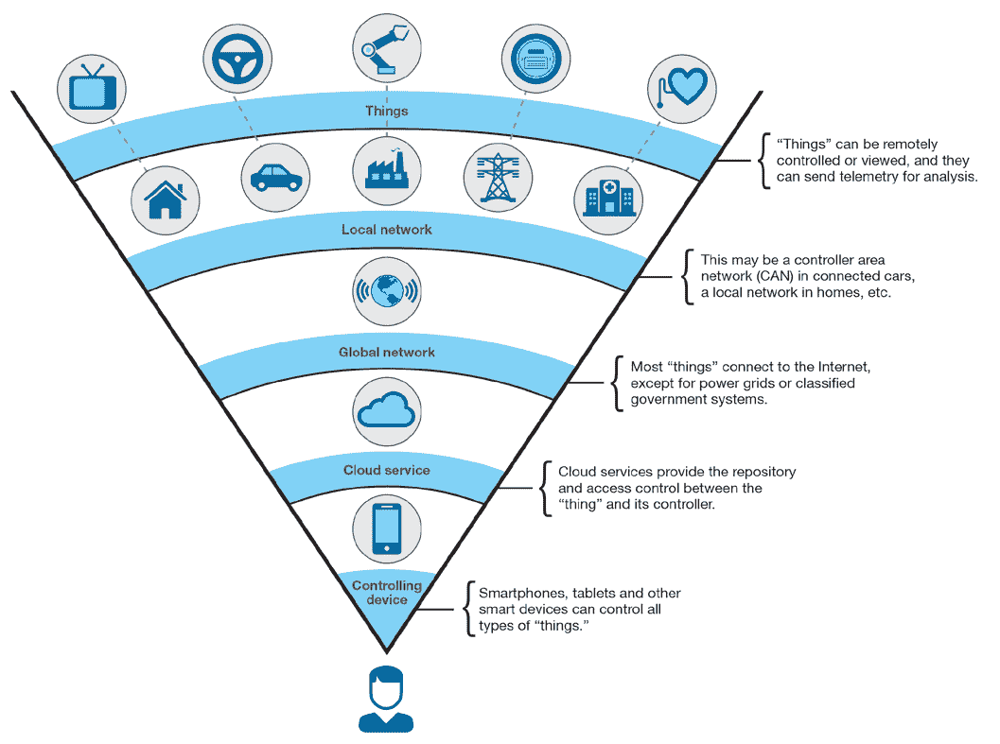
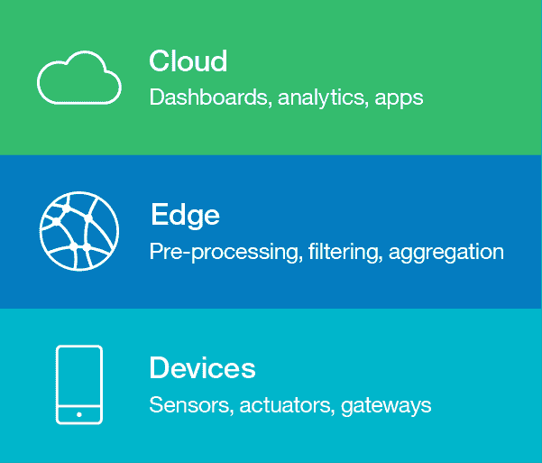

# 通过 IoT 架构简化 IoT 解决方案的开发

> 原文：[`developer.ibm.com/zh/articles/iot-lp201-iot-architectures/`](https://developer.ibm.com/zh/articles/iot-lp201-iot-architectures/)

##### IoT 201: 建立物联网开发的技能

本文是 IoT 201 学习路径的一部分，是物联网开发人员指南的下一步。

*   IoT 开发人员套件
*   物联网架构（本文）
*   [大规模物联网解决方案：互联城市](https://www.ibm.com/developerworks/cn/iot/library/iot-lp201-iot-connected-cities/)
*   [教程：开发健康习惯的跟踪器](https://www.ibm.com/developerworks/cn/iot/library/iot-lp201-build-skills-iot-health-app/index.html)

设计物联网 (IoT) 解决方案时面临的最大挑战之一是处理复杂性。典型的 IoT 解决方案涉及许多完全不同的 IoT 设备，这些设备附带的传感器会生成数据，然后需要分析这些数据来获取洞察。IoT 设备直接连接到网络或通过网关设备连接到网络，这使得设备不仅能够相互通信，还能与云服务和应用程序通信（人们对物联网的看法（来源：X-Force 研发团队，”IBM X-Force 每季威胁情报，2014 年第 4 季度”，Doc # WGL03062USEN，发布日期：2014 年 11 月。）http://www.ibm.com/security/xforce/downloads.html））。

##### 人们对物联网的看法（来源：X-Force 研发团队，“IBM X-Force 每季威胁情报，2014 年第 4 季度”，Doc # WGL03062USEN，发布日期：2014 年 11 月。[`www.ibm.com/security/xforce/downloads.html）`](http://www.ibm.com/security/xforce/downloads.html）)

边缘[计算](https://www.ibm.com/blogs/internet-of-things/edge-iot-analytics/)描述了在 IoT 网络边缘发生的事情，物理设备在这里连接到云。由于注重减少延迟、改善隐私和减少数据驱动 IoT 应用程序中的带宽成本，边缘计算架构在 IoT 中变得越来越普遍。

本文将讨论在设计数据驱动的 IoT 架构时可以应用的以下策略。这些策略可帮助您简化开发，管理复杂性，并确保 IoT 解决方案保持可扩展、灵活和稳健。

*   采用分层架构
*   安全设计
*   自动化操作
*   互操作性设计
*   遵循参考架构

## 采用分层架构

架构描述了 IoT 解决方案的结构，包括物理方面（即事物）和虚拟方面（比如服务和通信协议）。通过采用分层架构，您可以在将架构的所有最重要方面集成到 IoT 应用程序中之前，集中精力加强理解这些方面如何独立运行。这种模块化方法有助于管理 IoT 解决方案的复杂性。

对于涉及边缘分析的数据驱动 IoT 应用程序，图 2 中所示的三层基本架构从设备中捕获信息流，将其传输到边缘服务，然后传输到云服务。更详细的 IoT 架构还会包含穿过其他层的垂直层，比如身份管理或数据安全。

##### IoT 架构的层

### 设备层

可以在我的 [IoT 硬件指南](http://www.ibm.com/developerworks/cn/iot/library/iot-lp101-best-hardware-devices-iot-project/index.html)中更详细地了解 IoT 设备特征。

可以在我的 [IoT 连接指南](http://www.ibm.com/developerworks/cn/iot/library/iot-lp101-connectivity-network-protocols/index.html)中更详细地了解网络技术。

设备层中的组件（如 IoT 架构的层底部所示）包含物理传感器和连接到 IoT 设备的执行器，以及 IoT 设备本身。传感器和执行器本身通常不被视为”智能”设备，但传感器和执行器通常直接连接到拥有更高处理能力的 IoT 设备，或者通过 Bluetooth LE 或 ZigBee 无线连接到 IoT 设备。

一些 IoT 设备直接与相关云服务和应用程序进行通信。但是，IoT 设备往往通过网关与上游进行通信，网关属于中介设备，拥有比基本 IoT 设备稍强一些的处理能力。虽然网关设备并不总是与传感器直接相连，但它们在数据获取过程中发挥着重要作用。它们可以对原始传感器数据读数执行基本的模数转换、缩放和其他标准化。

### 边缘层

边缘层（显示为 IoT 架构的层的中间层）与位于网络边缘的分析和预处理服务相关。边缘分析是实时（或近实时）发生的，在从传感器传入数据时，就会在收集数据的位置对数据流进行处理。像数据过滤和聚合这样的基本预处理任务是在边缘上执行的，然后，经过预处理的关键数据转移到上游的云服务和应用程序，以供进一步处理和分析。

### 云层

准备好数据后，就可以将它发送到上游云层（显示为 IoT 架构的层的顶层）中的云应用程序中，供进一步处理、存储和使用。执行数据处理的云应用程序通常由移动应用程序和基于 Web 的客户端应用程序提供补充，这些应用程序将数据呈现给最终用户，并提供工具访问权，通过仪表板和可视化实现进一步的探索和分析。

<h2 id=”实现” 安全设计”>实现”安全设计”

要在 IoT 解决方案中实现端到端安全，必须优先考虑到 IoT 架构的所有层中的安全。需要将安全视为 IoT 架构中的一个横切关注点，而不是将其视为在最后隔离处理的单独的 IoT 架构层。由于连接了如此多的设备，以致于在个别设备或网关损坏时，也需要从整体上维护系统的完整性。确保架构支持多层防御。另外，确保 IoT 解决方案可识别和停用已损坏的设备，比如通过使用网关隔离漏洞设备，以及监视通信和使用模式来检测异常。

可以在[这个文章系列](https://www.ibm.com/developerworks/cn/iot/library/iot-trs-secure-iot-solutions1/index.html)中进一步了解 IoT 安全。

应对 IoT 基础架构的以下方面采用标准和最佳实践：

*   设备、应用程序和用户身份、身份验证、授权和访问控制
*   密钥管理
*   数据安全
*   安全通信渠道和消息完整性（通过使用加密）
*   审计
*   安全开发和交付

## 自动化操作

确保 IoT 架构支持对所有层进行自动化和编排。设计在部署 IoT 解决方案时使用这些自动化特性，以便快速轻松地进行开发和部署。例如，边缘层或云层上的微服务器架构可使用[容器技术](http://www.ibm.com/developerworks/cn/iot/iot-docker-containers/index.html)实现，并使用您的 IoT 平台所提供的工具（比如 [Kubernetes](https://console.bluemix.net/docs/containers/container_index.html)）来编排。这些特性使一些操作更不容易出错，比如设置新设备或网关，或者部署一个云应用程序的新实例来处理设备数据。避免手动配置可以确保操作可重复，为了能够扩展到包含数千甚至数百万个连网设备的 IoT 解决方案，必须做到这一点。

## 互操作性设计

IoT 解决方案中采用的设备、网络协议和数据格式的多样性，是 IoT 面临的最大架构挑战之一。如果打算在 IoT 解决方案中采用多个 IoT 平台，需要考虑在每个 IoT 平台中使用的技术能否集成到某个综合解决方案中。

维护 IoT 中的互操作性的一个最佳策略是采用标准。标准有助于灵活地断开多余的组件或引入额外的组件，只要新组件遵循已采用的相同标准。

参考架构也提供了指南来帮助您规划 IoT 架构。它们通常基于标准，封装了设计模式和最佳实践。采用参考架构，然后按照参考架构中描述的指南来选择实现它们的 IoT 平台，这就是在 IoT 架构中维护互操作性的可靠策略。

## 遵循参考架构

目前有许多致力于通过标准化 IoT 架构来提高互操作性的倡议。IoT 平台供应商和研究合作伙伴通过这些倡议展开合作，从而定义 IoT 参考架构。参考架构充当着架构基础，描述 IoT 解决方案中使用的高级构建块，并为关键架构概念建立一个共享术语表。这些倡议广泛应用了各种各样的现有解决方案，以便突出有效的设计模式和最佳实践。

一些广泛引用的 IoT 参考架构包括：

*   [物联网 – 架构 (IoT-A)](http://www.meet-iot.eu/deliverables-IOTA/D1_5.pdf)：IoT-A 参考模型和架构是 2013 年通过一个欧盟灯塔项目开发的。IoT-A 旨在用作开发适用于广泛领域的具体架构的基础。
*   [IEEE P2413 – 物联网 (IoT) 架构框架标准：](https://standards.ieee.org/standard/2413-2019.html)这个正在进行的 IEEE 标准化项目旨在识别各个 IoT 领域间的共性，这些领域包括制造业、智慧建筑、智慧城市、智能运输系统、智能电网和医疗保健。
*   [工业互联网参考架构 (IIRA)](https://www.iiconsortium.org/IIC_PUB_G1_V1.80_2017-01-31.pdf?cm_mc_uid=42240287207114889661528&cm_mc_sid_50200000=1498959849) – IIRA 是工业互联网联盟专为工业 IoT 应用程序而开发的，该联盟由 AT&T、思科、通用电气、IBM 和英特尔于 2014 年 3 月共同创立。

参考架构可用作开发 IoT 解决方案的模板。上面列出的架构粗略描述了 IoT 架构组件和它们的功能，但是，可以通过将抽象需求映射到具体技术或技术栈，让它们变得更加具体化。

### IoT 参考架构的组件

参考架构的细节因应用领域而异；但是，大多数 IoT 参考架构至少都描述了以下能力：

*   管理设备及其数据
*   连接和通信
*   分析和应用

此外，参考架构通常还会描述解决非功能需求的机制，例如灵活性、可靠性、服务质量、互操作性和集成。

#### 管理设备及其数据

参考架构的设备管理方面涉及到管理设备、设备身份和设备生命周期。参考架构描述：

*   组装设备
*   更新设备固件
*   应用新配置
*   触发远程操作，比如禁用、启用或停运设备

#### 连接和通信

管理设备之间、设备与网关之间，以及网关与云服务和应用程序之间的连接和双向通信，这是 IoT 参考架构中常常描述的另一种关键能力。对于边缘计算，事件驱动的架构是个不错的选择，可使用发布/订阅协议和消息代理在设备和服务之间通信。

#### 分析和应用

为了从来自 IoT 设备的数据获取价值，云应用程序提供了可视化和分析工具来处理数据流或批量数据，以识别可操作的洞察。根据具体用例，决策管理和业务流程工具可触发警报或执行操作来进行响应。

### 具体的参考架构

参考架构通常提供的模式和指南可从某个特定 IoT 领域获得，比如工业 IoT，或者可以从众多领域的解决方案中概括而来。高度概括的架构可用作模板，以创建特定于领域或特定于平台的更具体的架构。

可以在我的 [IoT 平台指南](http://www.ibm.com/developerworks/cn/iot/library/iot-lp101-why-use-iot-platform/index.html)中进一步了解 IoT 平台。

通用 IoT 平台供应商通常提供更多实用的参考架构以及实施指南，以帮助使用平台所提供的工具和软件代理来开发遵从参考架构的 IoT 解决方案。一些以 IoT 平台为中心的参考架构包括：

*   [IBM IoT 参考架构](https://www.ibm.com/devops/method/content/architecture/iotArchitecture)
*   [英特尔 IoT 平台参考架构](https://www.intel.com.au/content/www/au/en/internet-of-things/white-papers/iot-platform-reference-architecture-paper.html)
*   [Microsoft Azure IoT 架构](https://azure.microsoft.com/en-au/updates/microsoft-azure-iot-reference-architecture-available/)
*   [Amazon Web Services 指令架构](https://aws.amazon.com/blogs/startups/iot-a-small-things-primer/)

[IBM 工业 4.0](https://www.ibm.com/devops/method/content/architecture/iotArchitecture/industrie_40) 参考架构是特定于领域的参考架构的一个例子，它专为工业 IoT 应用程序而设计，基于 IIRA 参考架构和 IBM IoT 参考架构。

## 结束语

由于涉及的设备和连接的规模和异构性，设计数据驱动的 IoT 解决方案非常复杂。在本文中，我列出了设计安全的、灵活的、可扩展的 IoT 架构的一些策略。

本文翻译自：[Simplify the development of your IoT solutions with IoT architectures](https://developer.ibm.com/articles/iot-lp201-iot-architectures/)（2018-01-03）