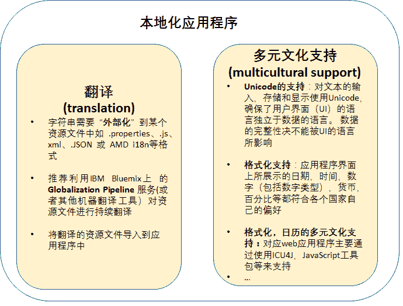
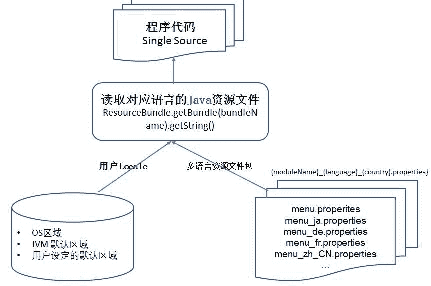
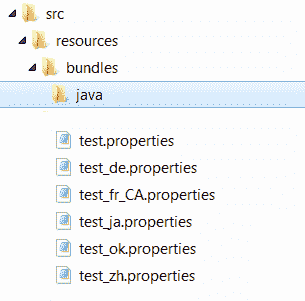
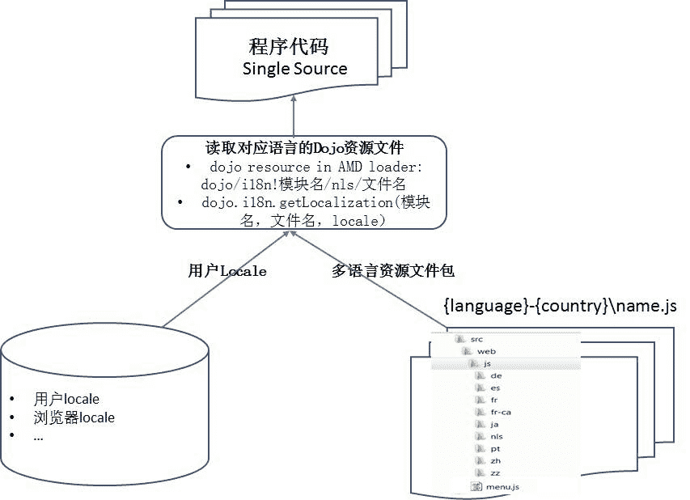

# Web 应用程序中 Resource Bundle 技术概述

> 原文：[`developer.ibm.com/zh/articles/j-web-resource-bundle/`](https://developer.ibm.com/zh/articles/j-web-resource-bundle/)

## 背景概述

世界经济日益全球化的同时，一个应用程序需要在全球范围内使用势在必然。传统的程序设计方法将可翻译信息如菜单按钮的标签，提示信息，帮助文档等文字信息硬编码在程序代码中，不能很好的适应全球化发展，程序的扩展性差，维护成本高。一个能支持全球化的应用程序，必须实现单一可执行的程序，动态地使用资源（Single Source Single Executable），图 1 是两种模型的对比图。

##### 图 1\. 传统的程序模型和支持全球化程序模型


对于一个能支持全球化的应用程序来说：

**一方面需要考虑的是用户的语言环境（我们称作 Language Locale）：** 这里主要就是指翻译，在不同的国家用他们自己的语言正确运作软件，让客户感觉这个产品是为他们而设计的；

**另一方面就是用户的文化环境（我们称作 Culture Locale）：** 主要处理的是多元文化的支持，包括货币、日历、时间、日期、排序、界面方向性（Bi-directional) 等符合各个国家自己习惯的显示方式。

图 2 概述了如何使得一个应用程序（C/S 或者 B/S）支持全球化和本地化。

##### 图 2\. 全球化应用程序



本文结合项目实践，总结了 web 应用程序中 Java，JSP，Dojo 和 HTML 四种不同语言是如何管理 Resource Bundle 的，实现单一可执行程序动态读取资源文件，从而支持全球化和本地化。主要从三个方面来阐述：资源文件存储和命名规则；用户语言区域信息的读取；如何取得对应语言的资源文件中的键值。

## Java 程序中的 Resource Bundle 管理

ResourceBundle 是一个机制，主要用来根据用户的语言环境展示不同的界面文字给用户，让用户感觉这个应用程序为我而定制。

然而 Java 中的 ResourceBundle 是一个类，包含在标准的 Java 发行版中。图 3 总结了 Java 程序中 ResourceBundle 的管理机制。

##### 图 3\. Java 程序 Resource Bundle 管理流程



### Java 程序中资源文件的存储和命名

在一个多模块的 Java 应用程序中，一般每个模块都有自己独立的资源文件（也叫 Resource Bundles），Resource Bundle 一般存储在对应模块的 src/resources/bundles/java/ 目录下面。通常的命名规则是：模块名*语言*国家 .properties({moduleName}*{language}*{country}.properties)。对应资源文件中的每一个 key，一般都是小写字母开头，用下划线表示这个 key 在程序中的层级结构，并且按照字母顺序排序，便于管理和查找，如清单 1 所示的例子。

##### 清单 1\. Java properties 文件示例

```
英文 Properties 文件:
    helloKey=Hello!
    goodMorningKey=Good Morning!
    goodEveningKey=Good Evening!

日语 Properties 文件：
    helloKey=\u3053\u3093\u306b\u3061\u306f!
    goodMorningKey=\u304a\u306f\u3088\u3046!
    goodEveningKey=\u3053\u3093\u3070\u3093\u306f! 
```

Java 程序对资源文件的回滚机制：当对应翻译的资源文件不存在时，将使用”默认”的资源文件（通常为英文），图 4 是 Java 资源文件的组织方式。

##### 图 4\. Java 资源文件组织方式



### Java 中用户语言环境（Locale）和资源文件的读取

根据用户使用的区域信息来决定从哪个 Resource Bundle 里面读取对应的 key 值。Java 语言通过 java.util.Locale 类来表示区域，一个 Locale 实例就代表了一个特定的区域。在实际的项目中，通常将读取资源文件包装成一个类，方便后续代码的重用和管理，如清单 2 的示例所示。

##### 清单 2\. Java 中 ResourceBundleService 使用

```
 public class LocalizedPropertyResources extends MessageResources {
 private static final String MODULE_NAME = "resourceBundle.module.name";
 public String getProperty(String key, Object... parameters) {
 Locale locale = getUserLocale();
 String value = getProperty(key, locale, parameters);
 Return value;
 }
 public String getProperty(String key, Locale locale, Object... parameters)
     {
  ResourceBundle resourceBundle = ResourceBundle.getBundle(MODULE_NAME,
     locale);
  String value resourceBundle.getString(key, parameters);
return value;
 }
} 
```

## JSP 中的 Resource Bundle 管理

**资源文件管理：** JSP 是基于 Java 技术，所以 Java 中的 ResourceBundle 机制也可以应用于 JSP，同样以 .properties 形式存储资源文件，资源文件的命名规则、资源文件的存储结构，key 的命名规则等都可以遵循 Java 程序中的 Resource Bundle 管理机制。

**用户语言环境的设定** ：HTTP 协议通过 Accept-Language 请求头将本地化信息从浏览器传递至服务器, JSTL fmt 库中的定制标记又会利用这些方法来自动地确定用户的语言环境，从而相应地调整它们的输出。同时用户也可以通过 <fmt:setlocale xmlns:fmt="">来设置用户语言环境。</fmt:setlocale>

对于 JSP 中资源文件的读取有以下三种情况：

1.  使用 fmt 消息标签：JSP 标准标签库（JSP Standard Tag Library，JSTL）中的 fmt 标签支持通过资源文件（ResourceBundle）对文本内容进行本地化，该功能可以对一个特定的语言请求作出相应的响应，它使用了 J2SE 的 ResourceBundle 来保持各种翻译过的语言编码。另外<fmt:setlocale>用来设置地区，比如<fmt:setlocale value="es_ES">，这等于设定了语言和国家代码。默认 JPS 将读取 Accept-Language 信息。还可以指定 ResourceBundle，比如： <fmt:bundle basename="ApplicationResource_fr">。一旦设定了 locale（地区）或 ResourceBundle，就可以使用 <fmt:message>来把原文进行相应的转化，同时还可以使用< fmt:requestEncoding/>来设定请求的字符编码。如清单 3 示例所示：</fmt:message></fmt:bundle></fmt:setlocale></fmt:setlocale>

    ##### 清单 3\. JSTL fmt 标签示例

    ```
     //myTest.jsp
     <%@ taglib uri="http://java.sun.com/jsp/jstl/fmt" prefix="fmt" %>

     <html>
       <head>
         <title>JSTL fmt: Localized tag testing</title>
       </head>

      <body>
       <fmt:requestEncoding value="UTF-8" />
       <fmt:setLocale value="zh_TW"/>
       <fmt:setTimeZone value= "GMT+8" scope="request"/>
       <fmt:bundle basename="src.resources.bundles.java.menu ">
           <fmt:message key="OK"/><br/>
           <fmt:message key="CANCEL"/><br/>
       </fmt:bundle>
     //也可以通过下面的方式获取资源文件

       <fmt:setBundle basename="src.resources.bundles.java.menu"    var="resources"/>
        ...
         <fmt:message key="OK"/><br/>
         <fmt:message key="CANCEL"/><br/>
         ...
       </body>
     </html> 
    ```

2.  被 Spring 管理的 JSP，通常 JSP 中有这样的 `taglig"<%@ taglib prefix="spring" uri="http://www.springframework.org/tags" %>"`，这种情况下可以使用 Spring message 标签。

    `<%@ taglib prefix="spring" uri="http://www.springframework.org/tags" %>`

    <spring:message code="common_button_ok" xmlns:spring=""></spring:message>
3.  对于由 Struts 操作类提供的 JSP，可以使用 Struts bean 消息标签：

    <%@ taglib uri=”/tags/struts-bean” prefix=”bean” %>

    <bean:message key=" common_button_ok " xmlns:bean=""></bean:message>

## Dojo 中的 Resource Bundle 管理

Dojo 是一个 JavaScript 库，提供了一个有用的工具来创建丰富的 Web 客户端界面。同时 Dojo 也提供了 API 支持全球化功能，如翻译资源包，函数的格式化和解析日期、数字和货币，Dojo 对全球化的支持主要基于 CLDR (Common Locale Data Repository) 和 ICU 的使用。 这一小节总结了 Dojo 中资源文件的管理，用户区域信息（locale）和资源文件的读取，如图 5 所示。

##### 图 5\. Dojo 中资源文件管理



### Dojo 中资源文件的存储和命名

UTF-8 是 Dojo 程序编码的先决条件，Dojo 脚本一般将使用 HTML，JSP，Servlet，js 等编写，所以这些文件必须以 UTF-8 编码。Dojo 用 JSON 格式来组织资源文件，首先在 /nls 目录下有一个主资源文件（一般是英文），主资源文件中定义了支持的区域，区域的值设置为 true 或者 false，如清单 4 所示。

##### 清单 4\. Dojo 主资源文件的定义

```
 define({
      root: {
        OK: "Ok",
        CANCEL: "Cancel",
        OK_CANCEL: "${OK}, ${CANCEL}"
      },
      "ko": true,
      "ja": true,
      "ru": false,
      "zh-cn": true
    }); 
```

翻译的资源文件应放在/ nls / <locale>目录中，目录的命名需要符合下面的规范：</locale>

*   目录的名称必须要全部小写
*   用横线（而不是下划线）分割语言和国家，比如 zh-cn，zh-tw 等，如清单 5 所示。

##### 清单 5\. 翻译资源文件的目录结构

```
 /src/web/js/nls/menu.js       ... 主资源文件，用于默认的消息显示
    /src/web/js/nls/ko/menu.js    ... 韩语的翻译文件
                    /ja/menu.js    ... 日语的翻译文件
                    /ru/menu.js    ...俄语的翻译文件
                     /zh-cn/menu.js  ...简中的翻译文件
                    ... 
```

Dojo 资源文件的回滚机制为：在 / nls 目录的根目录下如果检测到区域设置，但 nls 目录中不存在特定于区域设置的资源，则将使用主包；当主资源文件中某个语言设置为 false 时，即使该语言的资源文件存在，也将使用主包。

### Dojo 中用户语言环境（Locale）和资源文件的读取

Dojo 和 Java 以相同的方式支持用户区域信息，但 Dojo 和 Java 实现之间存在微小差异。

*   “Dojo 和 Java 对区域设置命名约定有一些区别，Dojo 使用” – “（连字符）作为连接语言代码，国家代码和变体的分隔符，而 Java 使用”_”（下划线）。例如，Java 中的 “zh_CN” 与 Dojo 中的 “zh-cn” 相似。

*   像 Java 中的默认用户语言区域一样，Dojo 有一个全局变量 dojo.locale 用来存储默认 locale 值，但是我们不能直接修改 dojo.locale，可以通过 dojoConfig.locale 来对 dojo.locale 做初始化工作。

*   如果 dojoConfig.locale 未定义，Dojo 使用浏览器的显示语言作为用户区域设置。另外 dojoConfig.locale 的设定需要在加载 dojo.js 之前，这样设置的 dojoConfig.locale 才会起效果。如清单 6 是一个示例将用户的 locale 信息保存在 sessionScope，然后传递给 dojoConfig。

##### 清单 6\. 将用户 locale 保存在 sessionScope 传递给 dojoConfig

```
 var dojoConfig = {
            async: 'sync',
            baseUrl: '',
            locale: '${sessionScope.userLanguageLocale}',

             bindEncoding: "utf-8",
               ...
        }; 
```

userLanguageLocale：是应用程序中用户所设定的 locale，每个应用程序可能不太一样。

Dojo 中有两种方式读取资源文件：

**方式 1：** 又叫 AMD 方式，通过 dojo/i18n! 这个插件加载资源文件，首先检测 dojoConifg.locale 是否设置，如果设置了就读取 dojoConfig.locale，否则就会使用浏览器的显示语言读取对应的翻译资源文件。清单 7 是 dojo/i18n! 的使用示例。

##### 清单 7\. Dojo/i18n！使用示例

```
...
<script src="dojo-release-1.9.1/dojo/dojo.js" data-dojo-config="async:
    true, parseOnLoad: true></script>
<script>
require(["dojo/string", "dojo/i18n!js/nls/menu"],
function(string, resources){
var strOk = resources.OK;
alert(strOk);
});
</script>
... 
```

**方式 2** ： 使用 dojo.requireLocalization 加载资源文件，dojo.i18n.getLocalization 读取资源文件，这个是旧的资源加载方式，新的 Dojo 版本都将采用 AMD 的方式，不过这种方式用户可以指定 locale 信息，缺省 locale 的时候，采用和 AMD 同样的 locale 解析方式。清单 8 是一个示例。

##### 清单 8\. Dojo. requireLocalization 使用示例

```
<script src="dojo-release-1.9.1/dojo/dojo.js" data-dojo-config="async:
    true, parseOnLoad: true></script>
<script>
dojo.require("dojo.i18n");
dojo.requireLocalization("js", "menu");
 var resources = dojo.i18n.getLocalization("js", "menu", locale);
//或者省去 locale 参数，var resources = dojo.i18n.getLocalization("js",
    "menu")
alert(resources.OK);
</script>
... 
```

## HTML 中的 Resource Bundle 管理

HTML 中的硬编码（Hard Code）通常分为两种情况：一种情况是 HTML 页面不涉及任何编程逻辑，这时候可以翻译整个 HTML 文件（这种方式在开发过程中不需要特殊处理），或者将 HTML 变更为 JSP，这样就可以利用 JSP 中 fmt 标签将 Hard Code 提取出来，如清单 9 示例所示。

##### 清单 9\. HTML 更改为 JSP

```
 //Index.html
 <html>
 <head>
 <script language="JavaScript">
 window.location = "/login.do";
 </script>
 <title>Welcome Page</title>
 </head>
 <body>
...
 </body>
 </html>
 //将 Index.html 更改为 Index.jsp，这样就可以利用 JSP 中 fmt 标签
 <%@ taglib prefix="c" uri="http://java.sun.com/jsp/jstl/core" %>
 <%@ taglib prefix="fmt" uri="http://java.sun.com/jsp/jstl/fmt" %>
 <html>
 <head>
 <script language="JavaScript">
...
 </script>
 <title><fmt:message key="common_welcome"
         /></title>
 </head>
 <body>
 ...
 </body>
 </html>
//test.properties
 Common_welcome=Welcome Page
... 
```

另外一种情况是 HTML 作为 Dojo widget 模板文件，这种情况下可以使用 dojo API 的 i18n 库来处理硬编码消息，其处理方式和 Dojo 很类似，模板 HTML 文件中使用的 Key 需要在 Widget 的 js 文件中定义和获取。下面将通过示例介绍 HTML 作为 Dojo 模板文件时，如何抽取当中的 hard code 信息。通常分三个步骤完成模板 HTML 文件中的字符串抽取。

第一步： 将 HTML 中的字符串放到一个资源文件如 message.js 中，资源文件的组织方式和 Dojo 是一样的；

第二步： 在 Dojo widget 的 js 文件中使用 Dojo Resource Bundle 获取资源文件，定义变量获取对应的 Key 值；

第三步： 在 HTML 模板文件中使用 Dojo .js 文件中定义的变量。如清单 10 所示。

##### 清单 10\. HTML 作为 Dojo Widget 模板

```
Test.html
<div dojoAttachPoint="testNode" style="display:inline">
<table style="position: relative; margin: 20px 0 0 120px; padding:
    0;">
<tr>
 <td style="text-align: right;">Username:</td> //原来的 hard
    code
<td style="text-align: right;">${usernameLabel}</td>
    //Resource out 之后的变量引用
....
</tr>
</div>
Test.js
dojo.requireLocalization("js", "message");
dojo.declare("Test") {
templatePath: dojo.moduleUrl("common", " /html/Test.html"),
usernameLabel: "",
postMixInProperties: function(){
this.inherited(arguments);
var resources = dojo.i18n.getLocalization("js", "message");
this.usernameLabel = resources.labels.username; //获取资源文件
}
 } 
```

另外有时 hard code 消息为 HTML 标记的 value 属性，如果直接将 value 值抽取出来，很容易引起功能问题，因为后端服务器将会利用 value 值处理一些逻辑问题，这时候需要使用 Label 和 Value 来处理，Label 主要为了展示给用户，Value 主要用于服务器端的逻辑处理，清单 11 是含有 Hard Code 的一个 option HTML 片段和处理后的代码，这里的 HTML 作为 Dojo 模板处理的。

##### 清单 11\. HTML 中特殊硬编码处理

```
// Hard Code
<html>
<body>
<select id="Product">
<option>Is Not</option>
<option>Is</option>
</select>
</body>
</html>
//处理后的 HTML
<html>
<body>
<select id="Product">
<option value="Is
        Not">${Label.IS_NOT}</option> <option value="Is">${Label.IS}</option>
</select>
</body>
</html> 
```

## 结束语

本文总结了如何存储 web 应用程序中使用不同框架时的资源文件及其命名规则，如何取得资源文件中的键值。希望这篇文章能为正在开发国际化 Web 应用程序的读者提供一定的参考价值。