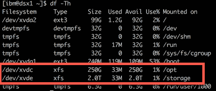
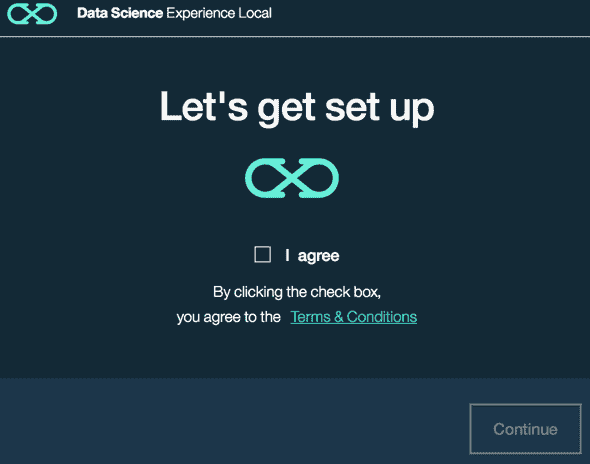
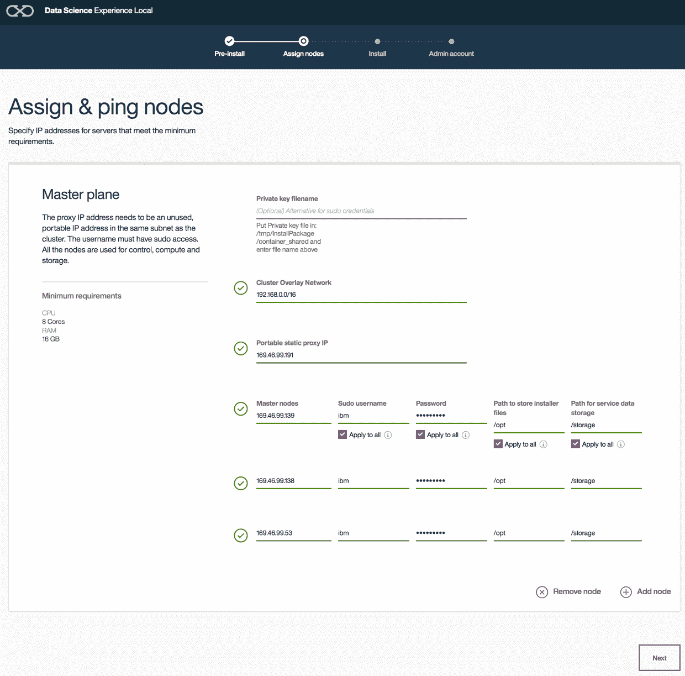
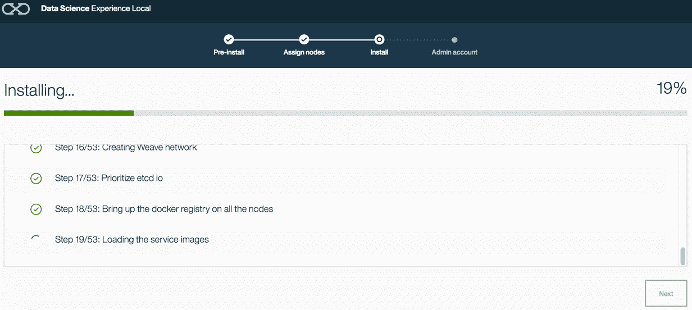
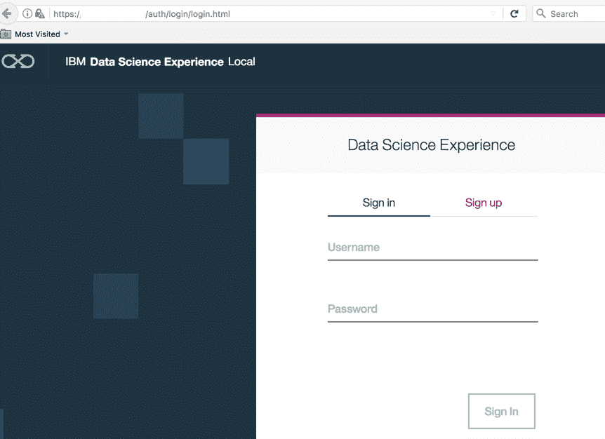
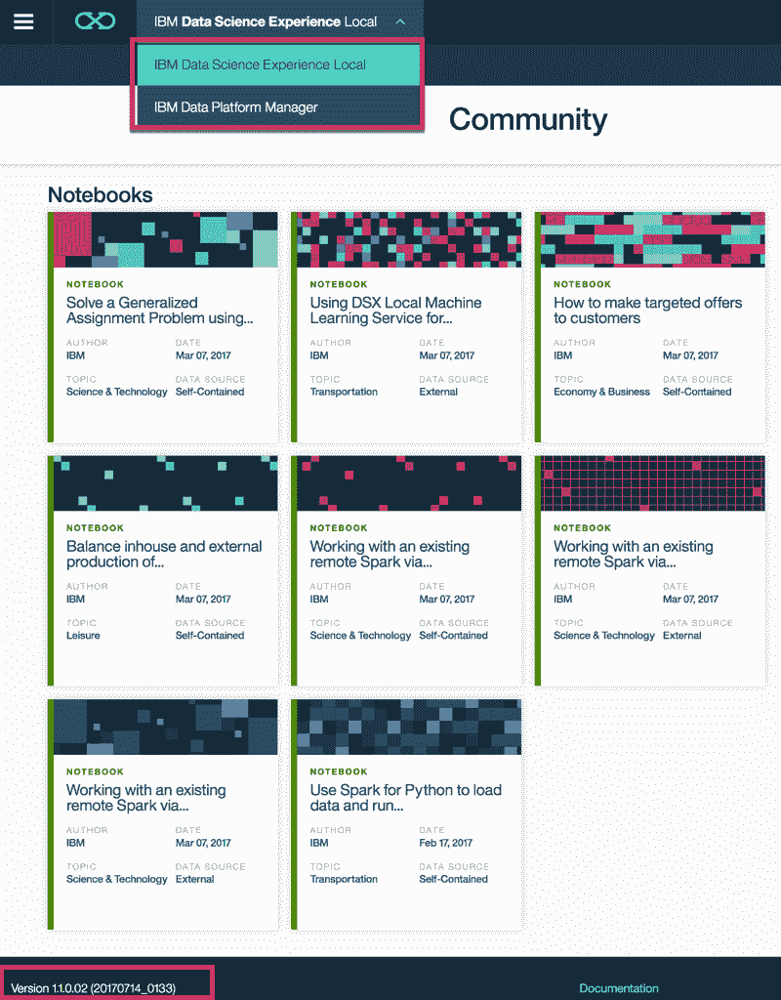

# 构建私有云的数据科学家环境

> 原文：[`developer.ibm.com/zh/articles/ba-cn-dsx-local-install-deployment/`](https://developer.ibm.com/zh/articles/ba-cn-dsx-local-install-deployment/)

IBM Watson Studio Local 是数据科学家和数据工程师的现成企业解决方案。它提供了一套与专有的 IBM 技术相集成的数据科学工具。它还与 RStudio，Spark，Jupyter Notebook 技术无缝集成。直观的 IBM Watson Studio 用户界面为团队和个人提供了一个协作的项目空间，大大提高了工作效率。项目可以包含 Notebooks，数据资产和协作者。

Watson Studio Local 可以安装并运行在企业内部，轻松搭建构建私有云的数据科学家环境。您可以使用您喜欢的工具，以安全，快速和方便的方式访问企业数据。

本文阐述了 Watson Studio Local 的架构和安装部署实践。

## IBM Watson Studio 功能和业务价值

IBM Watson Studio 是数据科学家和数据工程师的现成企业解决方案。 它提供了一套与专有的 IBM 技术相集成的数据科学工具。 它还与 RStudio，Spark，Jupyter 笔记本技术无缝集成。 直观的 IBM Watson Studio 用户界面为团队和个人提供了一个协作的项目空间，大大提高了工作效率。 项目可以包含 Notebooks，数据资产和协作者。

IBM Watson Studio 是一个社交环境，您可以通过最佳工具和最新的专业技术协作解决数据挑战。

### 组成部分

*   社区

通过 R，Python 或 Scala 中的示例或课程开始分析，将内容复制到 Jupyter Notebook 中，或者在完全嵌入的 RStudio 环境中工作。

*   Notebook 笔记本

您可以在 R，Python 或 Scala 中创建 Jupyter Notebook。 从零开始，导入现有的 Notebooks，或使用社区中的一个例子。

在操作栏中，您可以查看和使用连接的数据源，查看注释和版本，并与其他人共享 Notebook。

*   项目

项目是您的合作基地。 可以使用项目在一个地方管理 Notebook，数据源连接和数据集。 这是与团队合作的好方法，共享一套资产，然后一起构建新的模型和分析。

*   管理控制台

IBM Watson Studio Local 管理您的资源，并提供自动扩展和恢复选项。 管理控制台 IBM Data Platform Manager 可管理和监控硬件资源，用户和服务。

### 主要功能

Watson Studio Local 可以安装并运行在企业内部，轻松搭建构建私有云的数据科学家环境。可以使用您喜欢的工具，以安全，快速和方便的方式访问企业数据。主要功能包括：

*   相同的工具和经验

数据科学家可以使用诸如 Spark，R，Python 和 Anaconda 等各种工具，整合在一起，生产性协作经验。数据科学家在在自己的私有云上​​拥有相同的用户体验。能够快速，安全地轻松访问企业数据源，而无需将数据移动到云端，或者打开与这些数据源的外部连接。IBM Watson Studio Local 专为企业用户构建，提供在企业防火墙内环境上运行的 IBM Watson Studio 的强大功能和灵活性。

*   机器学习

IBM 全新机器学习平台提供端到端的机器学习能力，让数据科学家和应用开发人员快速建立模型并部署，提供给业务应用使用，同时提供持续的、端到端的模型监控来评价模型的性能。

*   模型构建器

在 Model Builder 提供了模型构建器中的两个选项：自动和手动。自动选项将自动准备用于训练的数据，并将根据数据的特点向用户介绍使用算法和技术的建议。在这个自动选项中，用户只需点击几下即可快速准备数据，训练模型并部署该模型。

*   图形化建模

可以通过使用画布准备数据，训练模型和部署模型来创建一个流程，用图形来表示模型。这个界面很容易让每个人学习和使用，迅速发现宝贵的见解，以获得快速的价值。

*   模型的管理

仪表板为企业中的所有模型提供健康检查，提供对整体模型性能的洞察，并快速查看需要重新训练的模型。

*   简单，统一的安装

IBM Watson Studio Local 安装简单直观。整个 IBM Watson Studio Local 集群通过一个统一的安装进行安装和配置。只需在一台服务器上运行，软件将自动分发到每台计算机，自动配置集群。

*   集群管理

IBM Watson Studio Local 提供管理控制台 IBM Data Platform Manager，可以监视 IBM Watson Studio Local 的运行状况和性能，从集群中添加和删除节点和其他操作。

*   用户管理

从控制台还可以管理系统的用户; 添加或删除用户，批准用户注册或管理密码。还可以配置 IBM Watson Studio Local 连接到企业 LDAP 服务器进行身份验证。

*   连接到本地数据源

IBM Watson Studio Local 可以创建与企业数据源的连接。这些连接可以由数据科学家自己使用，也可以与其他用户共享。共享时，这些可以轻松地在笔记本中使用，而不会暴露诸如用户标识和密码等私人信息。支持如 DB2，DB2 for z / OS，Netezza，DashDB，Oracle，Informix BigInsights HDFS，Cloudera HDFS 和 Hortonworks HDFS 等广泛数据源。

### 业务价值

IBM Watson Studio 是将数据科学家所需要的所有内容汇集在一起的环境。 它包括最受欢迎的开源工具和具有社区和社会功能的 IBM 独特的增值功能，其价值体现在”所有数据科学家的工具在一个地方”。

*   提升开发效率

开源整合，为客户提供开源的最佳工具。IBM Watson Studio Local 拥有最好的开源数据科学工具，如 Jupyter，R，Python，RStudio，Apache Spark，Brunel 等，并集成 IBM SPSS 和 IBM 机器学习。

*   团队协作

IBM Watson Studio Local 将项目的概念融入到界面中，使用户能够轻松地将协作者，新数据源等添加到其数据科学项目中。IBM Watson Studio 通过点击按钮，实现项目协作，轻松共享资源。

*   大数据平台

IBM Watson Studio Local 建立在 Apache Spark 的可扩展算法和集群环境之上，并可以连接到企业各种数据存储，满足企业数据存储和算法规模的需求。

## IBM Watson Studio Local 的架构

IBM Watson Studio Local 运行在 Kubernetes，该私有云的集群管理器提供了可扩展的 IBM Watson Studio Local 集群安装。Kubernetes 提供了诸多对私有云平台管理功能，例如：服务监控和管理，并且可用性高。它跨多个节点运行每个 IBM Watson Studio Local 服务的多个副本，并在检测到问题发生时重新启动服务和节点。IBM Watson Studio Local 的安装是完全独立的，包括运行 IBM Watson Studio Local 所需的所有软件，本地安装 Apache Spark 和对象存储以及 IBM Watson Studio 服务。任何时候您需要额外的计算资源，管理员可以直接通过管理控制台将计算节点添加到 IBM Watson Studio Local。

### 组成节点

IBM Watson Studio Local 由以下节点组成：

*   控制节点（主节点）

用于集群管理和高可用性。需要三个主节点来管理整个集群。使用 etcd 作为键值存储，它保持集群状态，并存储有关集群服务部署和运行状况的元数据。使用 Prometheus 进行监测和 Elk 进行日志记录。

*   存储节点

用于数据存储和存储管理。使用 GlusterFS 进行存储管理。使用 IBM Cloudant DB 作为服务元数据库。使用 Redis 作为内存数据库。对用户数据使用 Swift 对象存储。使用 Elasticsearch 进行日志搜索。

*   计算节点

运行 IBM Watson Studio Local 相关计算服务。

### 安装部署的节点需求

为了获得最佳的伸缩性和性能，IBM Watson Studio Local 的安装部署支持三节点或者九节点的安装部署方式。在安装完成后可以任意添加计算节点。

*   九个节点安装方式：

    *   三个用于控制节点（一个主和两个用于高可用性），需要 8 核的 CPU 和 16 GB 的内存，每节点需要一个 500 GB 的 XFS 格式磁盘；
    *   三个用于存储节点（一个主和两个用于高可用性），每节点需要 16 核的 CPU 和 32 GB 的内存，需要两个 500 GB 的 XFS 格式磁盘；
    *   三个用于计算节点（一个主和两个用于高可用性），每节点需要 32 核的 CPU 和 64 GB 的内存，需要一个 500 GB 的 XFS 格式磁盘。
*   三个节点安装方式：一个具有控制，存储和计算的节点，以及两个额外的节点，以实现高可用性。在本文中采用三节点的安装方式，每个节点需要 32 核的 CPU 和 64 GB 的内存，需要两个 500 GB 的 XFS 格式磁盘，用于安装程序和数据存储。

## 安装部署 IBM Watson Studio Local

### 环境的准备

*   操作系统要求 RHEL7.2 或 RHEL7.3，安装操作系统时候选择最小包安装。
*   除了每台机器需要一个静态 IP 以外（同一个子网段），还需要申请一个没有被占用的 IP （同一个子网段）作为 HA Proxy IP。
*   IBM Watson Studio 安装的文件格式需要 XFS (不是 ext4/ext3)。

##### 图 1\. 文件格式要求



*   主机名必须全部小写字母。可以用命令 hostnamect1 set-hostname <mynewhostname>来修改主机名，然后执行 systemctl restart systemd-hostnamed。</mynewhostname>

*   集群需要配置时间同步。

##### 图 2\. 时间同步要求


*   关闭防火墙 firewalld 和 iptables。可以通过 systemctl stop firewalld.service 和 systemctl stop iptables 来关闭，并检查状态。

##### 图 3\. 防火墙要求


*   SELINUX 设置为 Enforcing 或 Permissive。可以通过修改 /etc/selinux/config 并重启来设置。

##### 图 4\. 访问控制要求


### 采用配置文件进行自动化安装

可以通过创建一个将填写所有必需参数的配置文件 wdp.conf 来自动执行 IBM Watson Studio Local 安装。 在运行安装之前，文件必须与安装包在同一目录中。先使用参数 –get-conf-user 生成 wdp.conf 文件模板。 对三节点安装方式需要使用 –three-nodes 参数，也可以 –help 参数查看帮助。生成 wdp.conf 文件后，确保填写每个字段。如清单 1 所示是进行三节点的安装，其中 virtual_ip_address 就是前面提到的 HA Proxy IP，overlay_network 要选择和现网络不冲突的网段，一般可以选择 192.168.0.0/16 或 172.16.0.0/16。node_path 是指安装程序文件分区，需要最小 500 GB 的 XFS 格式文件系统， node_data 是指数据存储分区，需要最小 500 GB 的 XFS 格式文件系统。

另外，由于安装文件 dsxlocal_1.1 本身文件很大，安装过程会解压，所以不能放在路径为 ／ 的磁盘上。为了避免磁盘空间不够，需要把安装文件 dsxlocal_1.1 放在新创建的安装程序文件分区上进行安装。

九节点安装无需任何参数，三节点使用 –three-nodes 参数运行安装。安装包会检测到 wdp.conf 文件，系统将提示使用该文件用于配置。只需接受条款和条件，并输入 root 的密码后即可进行自动化安装部署。

##### 清单 1\. 采用配置文件进行安装

```
[root@dsx1 ~]# chmod +x dsxlocal_1.1
[root@dsx1 ~]# ./dsxlocal_1.1 --help
Usage: dsxlocal_1.1 [--three-nodes] [--get-conf-user|--get-conf-key]
                  # No option specified will run the install
  --three-nodes   # Run the install with 3 nodes
  --get-conf-user # Generate the configuration file template to use username/password to install
  --get-conf-key  # Generate the configuration file template to use ssh root private key to install
[root@dsx1 ~]# ./dsxlocal_1.1 --three-nodes --get-conf-user
File wdp.conf created
[root@dsx1 ~]# vi wdp.conf
# Entry _path_ is for storing the installer related files on the node
# Entry _data_ is for storing the Gluster data
virtual_ip_address=***.***.***.***
user=root
overlay_network=192.168.0.0/16
ssh_port=22
node_1=***.***.***.***
node_path_1=/opt
node_data_1=/storage
node_2=***.***.***.***
node_path_2=/opt
node_data_2=/storage
node_3=***.***.***.***
node_path_3=/opt
node_data_3=/storage
[root@dsx1 ~]# ./dsxlocal_1.1 --three-nodes
The installation completed successfully.
Please visit https:// ***.***.***.***/dsx-admin for DSX portal 
```

### 采用浏览器图形界面进行安装

如果通过 Web 浏览器图形界面进行九节点安装，安装程序无需任何参数。 对于通过 Web 浏览器图形界面进行三节点安装，需要使用 –three-nodes 参数运行安装。输入 W 可通过浏览器继续安装（安装程序会给出网址，以便在网络浏览器中继续安装）。

##### 清单 2\. 图形界面安装

```
[root@dsx1 ~]# chmod +x dsxlocal_1.1
[root@dsx1 ~]# ./dsxlocal_1.1 --three-nodes
Do you want to continue the install with this command line (C) or Web UI (W)? [C|W]:W
Running the docker ui now
Please logon to dsx0.ibm.com:3232 to continue the install 
```

打开 Web 浏览器进入到同意条款和条件的页面，如图 5 所示。

##### 图 5\. 安装界面



在节点配置页面中，在网页上输入类似配置文件 wdp.conf 的信息，如图 6 所示。可以添加其他节点来扩展集群。当安装完成后，IBM Watson Studio Local 仅支持添加计算节点。

##### 图 6\. 节点配置



开始安装后会在您指定的节点上安装 Kubernetes 集群，配置网络和存储，配置 Docker，部署 Cloudant 和 Spark 等服务，并部署 IBM Watson Studio Local 及用户服务。 此安装一步一步运行，如果中间步骤失败，可以查看日志进行重试。

##### 图 7\. 安装进度



最后一步是设置 IBM Watson Studio 管理员的密码，用户名为 admin，单击提交和启动按钮自动打开 IBM Watson Studio Local。 作为 IBM Watson Studio 管理员，您可以从同一网址切换到 IBM Watson Studio Local 和管理仪表盘 IBM Data Platform Manager。

##### 图 8\. 设置管理员密码


### 其他安装方式

除了配置文件自动化安装和浏览器图形界面安装外，IBM Watson Studio Local 还支持桌面应用和交互式命令行的安装方式。

桌面应用的安装方式和浏览器图形界面安装方式类似，区别是桌面应用需要根据操作系统单独下载桌面应用介质，桌面应用必须与要安装 IBM Watson Studio Local 的集群位于同一个网络中。 此外，桌面应用只支持 root 账号安装 IBM Watson Studio Local，而其他安装方式还支持 sudo 用户或 SSH 私钥方式。

交互式命令行的安装方式和配置文件安装方式类似，只需要在清单 2 中选择 C 就进入交互式命令行，输入的内容和 wdp.conf 基本一致。

比较而言，配置文件安装方式最为便捷，适合于了解 IBM Watson Studio Local 架构和以前有 IBM Watson Studio Local 安装经验的用户。命令行方式和配置文件安装方式类似，但是无法保存配置文件。浏览器安装方式最为直观，适合于初次安装的用户。桌面应用和浏览器安装方式类似，但需要额外安装桌面应用。

### 图形化建模的画布功能安装

IBM Watson Studio Local 可以通过使用图形化建模方式来准备数据，训练模型和部署模型来创建机器学习模型。这部分功能因为还属于公测阶段，需要单独部署。

安装需要登录 IBM Watson Studio Local 群集的管理节点，确保具有 /wdp/k8s 目录的读写执行权限，具体安装步骤如清单 3 所示。

##### 清单 3\. 画布功能的安装

```
[root@dsx1 ~]# tar -xf canvas_addon.tar
[root@dsx1 ~]# cd canvas_package/canvas/
[root@dsx1 ~]# chmod +x installer.sh
[root@dsx1 ~]# ./installer.sh
Checking for read/write/execute access to the /wdp/k8s directory...
User has read/write/execute access to the /wdp/k8s directory, proceeding...
decompressing wml-canvas-server.tgz...
loading privatecloud-spss-modeler-server_v335.tar.gz into docker...
pushing localhost:5000/privatecloud-spss-modeler-server:335 to local docker registry...
The push refers to a repository [localhost:5000/privatecloud-spss-modeler-server]
done installing! 
```

### 安装问题排查

安装的日志位于 InstallPackage/tmp/，如果安装过程出现问题，可以通过查看日志找到出错的原因。

如果安装挂起超过两个小时，则安装可能失败，检查 InstallPackage/tmp/SetupCluster.out 日志文件中的失败步骤，并清理或手动完成当前失败的步骤。 浏览器方式可以支持重做的功能，配置文件方式也可以通过加入新行 jump_install = n，其中 n 表示继续安装的步骤号，然后重新运行安装。

如果在安装过程中出现问题而且暂时无法解决，可以先通过卸载脚本如清单 4 所示进行卸载，其中 password 参数需要输入 root 的密码。

##### 清单 4\. IBM Watson Studio Local 的卸载

```
[root@dsx1 ~]# chmod u+x /wdp/utils/uninstall.sh/wdp/utils/uninstall.sh --username=root --password=****** --port=22 
```

## 开始使用 IBM Watson Studio Local

安装结束后，可以使用浏览器通过 HA Proxy IP 的 https 网页登录 IBM Watson Studio Local，目前支持的浏览器是 Mozilla Firefox 和 Google Chrome。管理员账号为 admin，如果是浏览器安装方式则可以用图 8 的设置的密码登录，如果是配置文件安装方式则可以用默认密码 password 来登录，如图 9 所示。

##### 图 9\. 用户登录



管理员可以使用 IBM Watson Studio Local 和 IBM Data Platform Manager，并可以在两者之间切换，在 IBM Watson Studio Local 的左下角是版本号，一般两个月就有 IBM Watson Studio Local 的版本更新。

##### 图 10\. IBM Watson Studio Local 的版本



管理员可以通过 IBM Data Platform Manager 来管理用户并监控应用程序和 Kubernetese 环境的运行状况。

##### 图 11\. IBM Data Platform Manager


单击用户管理可以批准注册请求，添加用户，过滤，编辑，为其分配权限或删除用户。用户权限分为管理员和普通用户，管理员可以使用 IBM Watson Studio Local 和 IBM Data Platform Manager，而普通用户只能登录 IBM Watson Studio Local。当添加新用户时，IBM Watson Studio Local 会自动向其发送用户名和临时密码。IBM Watson Studio Local 还支持新用户自助账户申请，管理员需要决定对这些用户是否批准申请。默认情况下，IBM Watson Studio Local 用户记录存储在内部数据库中，也可以集成企业的 LDAP 服务器。

新用户创建后可以登录到 IBM Watson Studio Local，在 IBM Watson Studio Local 中项目是组织资源以实现特定的数据分析目标。第一次登录时，我的项目中还是空的，可以点击创建项目开始您的数据科学家之旅。

##### 图 12\. 创建项目


## 结束语

本文阐述了 Watson Studio Local 的架构和安装部署实践。数据科学家可以在这个一站式工作场所中使用所有的数据科学工具，例如 RStudio、Jupyter、Python、Scala 等等。IBM Watson Studio Local 可以让您运用开源技术以及 IBM 创新，实现不可思议的分析成果。

## 参考资源

### 获得产品和技术

*   试用云版本的 IBM Watson Studio
*   查看 [IBM Watson Studio](https://www.ibm.com/cn-zh/marketplace/data-science-experience) 官网

### 讨论

*   到 [IBM Watson Studio 在 StackExchange 的论坛](https://stackoverflow.com/questions/tagged/data-science-experience) 参与讨论
*   查看 [我的博客](https://www.ibm.com/developerworks/mydeveloperworks/blogs/wuminda/?lang=en) 并评论