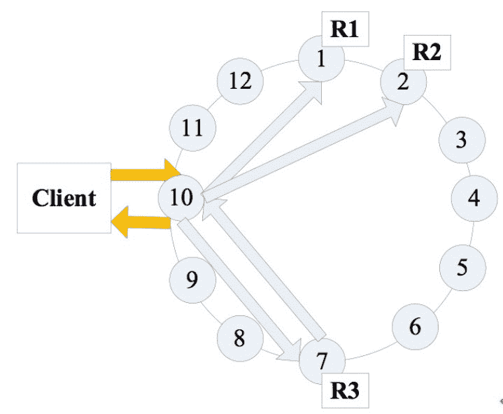

# Cassnadra 3.X 特性概述

> 原文：[`developer.ibm.com/zh/articles/os-cn-apache-cassandra3x1/`](https://developer.ibm.com/zh/articles/os-cn-apache-cassandra3x1/)

本文是 Apache Cassandra 3.X 系列的第一篇文章，主要介绍了 Cassandra 的出现原因，它解决了什么问题，3.X 版本对应的数据模型、数据副本方式、系统架构、客户端、应用工具发生了什么变化等内容。

## 关系型数据困局

IMS 的全称是 Information Management System，1966 年由 Vern Watts 在 IBM 提出，最初是为了 Staurn V moon rocket 项目创造的，最终在 1968 年第一次产品发布，接下来再 CICS（Customer Information Control System）及其他的应用程序上获得成功，并沿用至今。

1970 年，Edgar F.Codd 博士发表了论文 “A Relational Model for Data for Large Shared Data Banks”，奠定了关系型数据库管理系统的功能基础。

那么，关系型数据库犯了什么错误？答案是：”Nothing” 。

为什么需要考虑替换关系型数据库？因为关系型数据库遇到了扩展问题，并且数据表之间的关联关系让查询越来越慢。

## 相关知识

### 数据模型

关系型模型是一个简单的模型，需要满足 ACID。ACID 是 Atomic、Consistent、Isolated、Durable 的简称。

*   Atomic：”All or Nothing”。
*   Consistent：意味着数据从一个正确的状态移动到了另一个正确的状态，不可能读到不同的值。
*   Isolated：交易之间不会互相干扰。
*   Durable：一旦交易完成，更高的数据不会丢失。

### 扩展方式

一种扩展关系型数据库的方式是 Sharding（分片）架构。eBay 采用这种方式，支持每天数十亿 SQL 访问。这种方式的原理是对数据进行纵向切分，将数据量分派到不同的机器上，这样不需要再在一台机器上存储或者备份所有的数据。

几种分片策略：

*   按照属性或者功能分片：将互相没有强依赖的数据分片在不同的数据库，例如用户表和所购商品表。
*   按照键值分片：按照 orderId 或者第一个字母。
*   查找表：加入一个”黄页”表，查询数据在哪个节点。这里有两点问题，1: 黄页表成为每次都需要访问的表，2: 黄页表本身具有单点失败的可能性。

### 无中心化

Michael Stonebraker（University of California at Berkeley）在 1986 年的论文 “The Case for Shared Nothing.” 引入了 “Shared-Nothing” 架构，属于无中心化状态，即每一个节点互相不存在依赖关系，所以没有中心节点统计共享资源内容的问题。

Cassandra 数据库没有中心节点，没有 Master/Slave，是 Shared-Nothing 架构。

## 初步介绍

Apache Cassandra 是一种分布式非关系型数据库，具有高性能、可扩展、无中心化等特征。Cassandra 是适用于社交网络业务场景的数据库，适合实时事务处理和提供交互型数据。以 Amazon 完全分布式的 Dynamo 数据库作为基础，结合 Google BigTable 基于列族（Column Family）的数据模型，实现 P2P 去中心化的存储。

在 CAP 原则（又称 CAP 定理，指的是在一个分布式系统中，Consistency 一致性、Availability 可用性、Partition Tolerance 分区容错性，三者不可得兼）上，HBase 选择了 CP，Cassandra 则更倾向于 AP，所以在一致性上有所减弱。

Cassandra 是无中心化的，意味着所有节点没有差异。

可扩展性一般可以通过两种方式实现：

1.  纵向的（Vertical Scaling），即简单地通过增加硬件能力和机器内存实现能力提升。
2.  横向的（Horizontal Scaling），即通过增加机器实现能力提升，这种方式不会存在单一机器具有性能瓶颈的情况，但是这种设计需要软件内部机制在整个集群范围内可以保持各节点之间的数据同步。

所谓的弹性扩展是指特定属性的横向扩展能力，意味着集群内部可以无缝扩展和解散部分机器。要做到这一点，需要集群可以接收新的节点，并且通过拷贝部分或者全部数据的方式加入到集群，并开始接收新的用户请求，而不是需要大规模地调整或者配置整个集群。

## 与其他方案对比

Cassandra 的类 Dynamo 特性有以下几点：

*   对称的，P2P 架构：点对点架构，无中心节点，集群中每一个节点都具有相同地位。
*   基于 Gossip 的分布式管理：通过 Gossip，每个节点都能知道鸡群中包含哪些节点，以及这些节点的状态。
*   通过分布式 hash 表放置数据：在默认分区策略中，每个节点都对应一个 hash 值，用于存储一定范围内的分区键的数据。
*   可插拔的分区：可添加或者删除节点，但是保证数据不会丢失。
*   可配置的放置策略：可配置不同的策略用于分布副本。
*   可配置的一致性：对读写操作均可配置不同的一致性级别。
*   Cassandra 的类 BigTable 特性有以下几点：
*   列族数据模型：列族作为列的容器，是一个四维哈希表。
*   SSTable 磁盘存储：SSTable 为磁盘上的存储文件，只读，多个 SSTable 可进行合并操作。
*   Commit log 持久化：数据首先会写入 Commit log，提供持久化。
*   Memtable 缓存：数据进行持久化时，也同时写入 memtable 进行缓存，达到队列最大值时，顺序刷入磁盘。

## 数据模型

Cassandra 的数据模型借鉴了谷歌 BigTable 的设计思想，包括以下四个概念：

*   键空间（KeySpace）相当于关系型数据库模型中的数据库，是最上层的命令空间；
*   列族 ColumnFamily，相当于关系型数据库中的表，但它比表更稀疏；
*   行 Row 表示一个数据对象，存在于 ColumnFamily 当中；
*   列 Column 相当于属性，是存储的基本单元。

Cassandra 各主要概念之间的包含关系如图 1 所示。

##### 图 1\. Cassandra 主要概念关系图


*   Key：对应 SQL 数据库中的主键。在 Cassandra 中，每一行数据记录是以 Key/Value 的形式存储的，其中 Key 是唯一标识。
*   Column：对应 SQL 数据库中的列。在 Cassandra 中，每个 Key/Value 对中的 Value 又称为 Column，它是一个三元组，即：name、value 和 timestamp，其中 name 需要是唯一的。
*   Super Column：Cassandra 允许 Key/Value 中的 Value 是一个 Map（Key/Value List），即某个 Column 有多个子列。
*   Standard Column Family：相当于关系型数据库中的 Table。每个 CF 由一系列 Row 组成，每个 Row 包含一个 Key 以及其对应的若干 Column。CF 中只能存储 Name/Value 形式的 Column，不能存储 Super Column，同样，SCF 中只能存储 Super Column。
*   Key Space：相当于关系型数据库中的 DataBase。一个 KeySpace 中可包含若干个 CF，如果 SQL 数据中一个数据库可包含多张表。

## 排序方式

在 Cassandra 的每一个 Row 中，所有 Column 按照 Name 自动进行排序，排序的类型有 BytesType、UTF8Type、LexicalUUIDType、TimeUUIDType、AsciiType 和 LongType，不同的排序类型，会产生不同的排序结果，如清单 1 所示。

##### 清单 1\. BytesType 排序结果

```
 {name:123,value:"hello there"}
{name:832416,value:"fhefhwie"}
{name:3,value:"101010101010"}
{name:976,value:"cnebfeiw"}
```

采用 LongType 排序类型，结果如清单 2 所示。

##### 清单 2\. LongType 排序结果

```
 {name:3,value:"101010101010"}
{name:123,value:"hello there"}
{name:976,value:"cnebfeiw"}
{name:832416,value:"fhefhwie"}
```

采用 UTF8Type 排序类型，结果如清单 3 所示。

##### 清单 3\. UTF8Type 排序结果

```
 {name:123,value:"hello there"}
{name:3,value:"101010101010"}
{name:832416,value:"fhefhwie"}
{name:976,value:"cnebfeiw"}
```

## 分区策略

Cassandra 中，Token 是用来分区数据的关键。每个节点都有一个唯一的 Token，表明该节点分配的数据范围。节点的 Token 形成一个 Token 环。例如使用一致性 Hash 进行分区时，键值对将 genuine 一致性 Hash 值来判断数据应当属于哪个 Token。

根据分区策略的不同，Token 的类型和设置原则也有所不同。Cassandra（V3.10 版本）本身支持四种分区策略：

1.  Murmur3Partitioner：这个是默认的分区器，它是根据 Row Key 字段的 HashCode 来均匀分布的，这种策略提供了一种更快的哈希函数。
2.  RandomPartitioner：这个分区器也是随机分区器，基本特性和 Murmur3Partitioner 类似，只是通过 MD5 计算哈希值，可用于安全性更高的场合。
3.  ByteOrderedPartitioner：采用的是按照 Row Key 的字节数据来排序，这个分区器支持 Row Key 的范围查询。
4.  OrderPreservingPartioner：这个分区器也是支持 Row Key 范围查询的。它采用的是 Row Key 的 UTF-8 编码方式来排序。

## 数据副本

Cassandra 在多个节点上存储副本以确保可用性和数据容错。副本策略决定了副本的放置方法。集群中的副本数量被称为复制因子，复制因子为 1 表示每行只有一个副本，复制因子为 2 表示每行有两个副本，每个副本不在同一个节点。所有副本同等重要，没有主次之分。作为一般规则，副本因子不应超过在集群中的节点的树木。当副本因子超过节点数时，写入不会成功，但读取只要提供所期望的一致性级别即可满足。目前 Cassandra 中实现了不同的副本策略，包括：

1.  SimpleStrategy：复制数据副本到协调者节点的 N-1 个后继节点上；
2.  NetworkTopologyStrategy：用于多数据中心部署。这种策略可以指定每个数据中心的副本数。在同数据中心中，它按顺时针方向直到另一个机架放置副本。它尝试着将副本放置在不同的机架上，因为同一机架经常因为电源、制冷和网络问题导致不可用。

多数据中心集群最常见的两种配置方式是：

1.  每个数据中心 2 个副本：此配置容忍每个副本组单节点的失败，并且仍满足一致性级别为 ONE 的读操作。
2.  每个数据中心 3 个副本：此配置可以容忍在强一致性级别 LOCAL_QUORUM 基础上的每个副本组 1 个节点的失败，或者容忍一致性级别 ONE 的每个数据中心多个节点的失败。

## 数据一致性

Cassandra 被称为”最终一致性”，有点误导人，Cassandra 一致性是可以调整的。

那么什么是一致性？现实世界是按照一致性的级别进行衡量的，最终一致性是几种一致性模型的其中一种：

1.  严格一致性（Strict Consistency）：所有的请求必须按照线性方式执行。读出的数据始终为最近写入的数据。这种一致性只有全局时钟存在时才有可能，在分布式网络环境不可能实现；
2.  顺序一致性（Sequential Consistency）：所有使用者以同样的顺序看到对统一数据的操作，但是该顺序不一定是实时的；
3.  因果一致性（Causal Consistency）：只有存在因果关系的写操作才要求所有使用者以相同的次序看到，对于无因果关系的写入则并行进行，无次序保证。因果一致性可以看作是对顺序一致性功能的一种优化，但是在实现时必须建立与维护因果依赖图，是相当困难的；
4.  管道一致性（PRAM/FIFO Consistency）：在因果一致性模型上的进一步弱化，要求由某一个使用者完成的写操作可以被其他所有的使用者按照顺序感知到，而从不同使用者中来的写操作则无需保证顺序，就像一个一个的管道一样。相对来说比较容易实现；
5.  弱一致性（Weak Consistency）：只要求对共享数据结构的访问保证顺序一致性。对于同步变量的操作具有顺序一致性，是全局可见的，且只有当没有写操作等待处理时才可进行，以保证对于临界区域的访问顺序进行。在同步时点，所有使用者可以看到相同的数据；
6.  释放一致性（Release Consistency）：弱一致性无法区分使用者是要进入临界区还是要出临界区，释放一致性使用两个不同的操作语句进行了区分。需要写入时使用者 acquire 该对象，写完后 release，acquire-release 之间形成了一个临界区，提供释放一致性也就意味着当 release 操作发生后，所有使用者应该可以看到该操作；
7.  最终一致性（Eventual Consistency）：所有的复制都会在分布式系统内部传播数据，但是需要花点时间，最终所有节点的副本数据会实现一致。当没有新更新的情况下，更新最终会通过网络传播到所有副本点，所有副本点最终会一致，也就是说，使用者在最终某个时间点前的中间过程中无法保证看到的是新写入的数据。可以采用最终一致性模型有一个关键要求，需要用户可以接受读出陈旧数据；
8.  Delta 一致性：系统会在 Delta 时间内达到一致。这段时间内会存在一个不一致的窗口，该窗口可能是因为日志迁移的过程导致的。

最终一致性的几种具体实现：

1.  读不旧于写一致性（Read-your-writes consistency）：使用者读到的数据，总是不旧于自身上一个写入的数据。
2.  会话一致性（Session Consistency）：比读不旧于写一致性更弱化。使用者在一个会话中才保证读写一致性，启动新会话后则无需保证。
3.  单读一致性（Monotonic Read Consistency）：读到的数据总是不旧于上一次读到的数据。
4.  单写一致性（Monotonic Write Consistency）：写入的数据完成后才能开始下一次的写入。
5.  写不旧于读一致性（Writes-follow-reads Consistency）：写入的副本不旧于上一次读到的数据，即不会写入更旧的数据。

Cassandra 把一致性级别的决定权交到了客户端手中，这意味着客户决定每一次操作的一致性级别，即决定写入操作过程中集群内部必须有多少份副本完成才能响应读请求。如果客户设置的一致性级别的值小于设置的副本数量值，那么即便一些节点宕机，更新依然成功。

## 客户端

Cassandra 提供多语言 API，支持当前大多数编程语言开发客户端，如 Java/C++/Python 等。

如图 2 所示，客户端连接到某一节点发起读或写请求时，该节点充当客户端应用于拥有相当数据的节点数据的节点间的协调者，用以根据集群配置确定环（ring）中的哪个节点应当获取这个请求。集群中的任何节点都可以充当协调者，但需要每个节点的配置文件中的 rpc_address 都设置为本机 IP 或者 0.0.0.0（表示监控所有客户端）。

##### 图 2\. 客户端读/写示意图



## 应用工具

### Cqlsh

Cassandra 自带工具，可与 Cassandra 直接使用 CQL 命令交互，CQL 使用了和 SQL 类似的语法和操作表格数据的方法，如表 1 所示。

##### 表 1\. cql 命令表

| 操作 | 命令 |
| --- | --- |
| 创建 KeySpace | Create KeySpace test with replication = {‘class’:’SimpleStrategy’,’replication_factor’:2}; |
| 查看 KeySpace | Desc KeySpace test; |
| 删除 KeySpace | Drop KeySpace test; |
| 创建列族 | Create table users( userid int PRIMARY KEY,
fname text,
lname text); |
| 插入数据 | Insert into users(userid,fname,lname) VALUES(1,’john’,’smith’) |
| 建索引 | Create INDEX on users(lname); |
| 删除索引 | Drop index users_lname_idx; |
| Select 操作 | Select count(*) from users; Select fname lname from users where userid in (2,3);
Select* from users where userid = 1; |
| 批量操作 | Begin batch Insert into user(userid,fname,lname) values(4,’fname’,’lname’);
Delete lname from users where userid = 2;
Apply batch |

### Nodetool

Cassandra 自带运维工具，是一个查看集群信息的命令，可以查看集群统计信息、节点信息、数据环信息、增删节点、刷新 Memtable 数据到 SSTable、合并 SSTable 等，如表 2 所示。

##### 表 2\. Nodetool 命令

|  |  |
| --- | --- |
| Nodetool version | 显示当前 Cassadnra 的版本信息 |
| Nodetool status | 显示当前机器节点信息（UN 正常，DN 宕机）、数据中心、机架信息 |
| Nodetool removenode [hosted] | 移除 DN 节点 |
| Nodetool cfstats | 查看各个 column family 的详细信息，包括读写次数、响应时间、memtable、sstable 等 |
| Nodetool info | 显示一个节点的信息，包括当前的 load（数据量）、运行时间、内存使用情况等 |
| Nodetool flush[KeySpace] | 将某 KeySpace 中的缓存区数据提交至 sstable 中 |

## 结束语

本文是 Apache Cassandra 3.X 系列文章的第一篇，主要对 Cassandra 数据库的出现、功能、实现原理、优势和弱点等做点介绍，让读者能够从基础了解。除了本文以外，本系列文章将由 Cassandra 安装和配置、CQL 语言、数据模型、系统架构、客户端、读和写数据、监控、维护、性能优化、安全、部署和集成等多篇文章组成。

## 参考资源

参考 [Apache Cassandra](https://www.ibm.com/Search/?q=cassandra&lnk=mhsrch&v=18&en=utf⟨=zh&cc=cn&sn=dw&dws=cndw&hpp=20) 首页，了解最全面的 Apache Cassandra 知识。

参考书籍 *Cassandra The Definitive Guide 2 ^(nd) Edition* Jeff Carpenter&Eben Hewitt