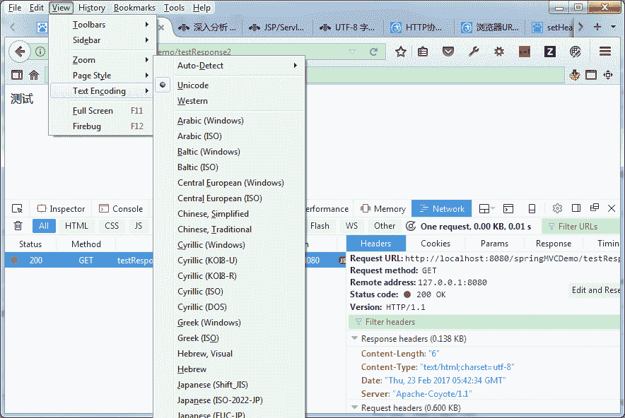
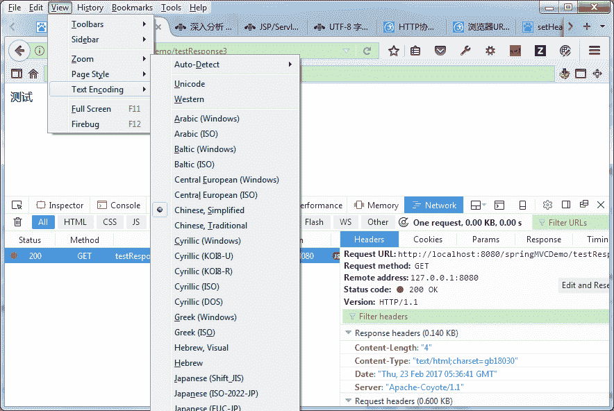

# 深入分析 web 请求响应中的编码问题

> 原文：[`developer.ibm.com/zh/articles/wa-lo-ecoding-response-problem/`](https://developer.ibm.com/zh/articles/wa-lo-ecoding-response-problem/)

乱码问题一直是困扰开发人员的比较头疼的问题，而发生在 web 请求响应中的乱码问题由于牵扯到比较多的协议框架和技术实现，又显得更加棘手。web 请求中的乱码一般容易出现在两个地方：一是所请求的资源名称，二是查询参数；更复杂的是，不同的浏览器对 URL 和查询参数采用的默认编码可能还不一样，这就更加加深了问题的难度。本文将深入浅出地分析 web 请求响应中乱码产生的原因与解决该问题的关键因素，并举例说明给出该问题的最佳解决方案。

## web 请求响应中乱码产生的原因

### 相关概念

#### URL，URI 及查询字符串

URL 是统一资源定位器，是用来引导指向对应的网络资源的，狭义来说查询字符串并不是 URL 的一部分，URL 是由协议、域名、端口和 URI 组成的。URI 是统一资源标识符，是用来引导指向某站点的服务资源的，如图一所示：

##### 图 1\. URL 与 URI 和查询字符串的关系


RFC 1738(Uniform Resource Locators (URL))规定 URL 只能包含英文字母、阿拉伯数字和某些标点符号。这要求在 URL 中使用非英文字符的话必须编码后使用，不过 RFC 1738 并没有规定如何进行编码，而是交给应用程序（浏览器）自己决定。糟糕的是各浏览器在编码 URL 时采用了不同的机制，有的默认按 UTF-8，有的则默认跟随系统代码页。更有甚者，同一浏览器在编码 URL 和查询参数时使用的编码也不同。这就是 web 请求中出现乱码的根源所在。

#### Request 与 Response 对象

服务端收到客户端的 HTTP 请求，中间件/应用程序服务器会针对每一次请求分别创建一个 request 对象和 response 对象。

*   request 对象是操作客户端发送过来的数据的容器。

request 中的 setCharacterEncoding(String enc) 方法可以设定针对请求体（post 提交的数据即在请求体中）的解码方式，通过它设置与请求体一致的编码是 post body 中的数据不乱码的关键。不过需要注意的是该方法必须在读取请求参数或者获得输入流之前调用，一般写在比较靠前的过滤器中。

*   response 对象是操作服务端发出的数据的容器。

response 中的 setContentType(String ct) 方法可以设置即将发送给客户端的响应的 content type，content type 中可以包含对响应编码的设定，比如”text/html;charset=UTF-8″。同调用 request 的 setCharacterEncoding 一样，它也必须在获得输出流之前调用。另外该方法等价于下面两句：

```
response.setCharacterEncoding("UTF-8");//设置响应编码
response.setHeader("Content-Type","text/html;charset=UTF-8");//通知浏览器如何解码 
```

参照清单 1 中 testResponse1 和 testResponse2 可以看出 setContentType 既设置了响应的编码，也通知了浏览器解码方式；结合 testRespond2 与图二和 testRespond3 与图三可以看出 response 是如何影响浏览器解码的。

##### 清单 1\. 通过 response content type 影响浏览器的默认解码方式

```
@RequestMapping("/testResponse1")
public void response1(HttpServletRequest request, HttpServletResponse response) throws IOException{
    response.setCharacterEncoding("utf-8");
    response.setHeader("content-type", "text/html;charset=utf-8");
    response.getWriter().write("测试");
}

@RequestMapping("/testResponse2")
public void response2(HttpServletRequest request, HttpServletResponse response) throws IOException{
    System.out.println(response.getCharacterEncoding());//ISO-8859-1
    response.setContentType("text/html;charset=utf-8");
    System.out.println(response.getCharacterEncoding());//utf-8
    response.getWriter().write("测试");
}

@RequestMapping("/testResponse3")
public void response3(HttpServletRequest request, HttpServletResponse response) throws IOException{
    System.out.println(response.getCharacterEncoding());//ISO-8859-1
    response.setContentType("text/html;charset=gb18030");
    System.out.println(response.getCharacterEncoding());//gb18030
    response.getWriter().write("测试");
} 
```

##### 图 2\. Response 中的 content type 影响浏览器的默认解码方式-1



##### 图 3\. Response 中的 content type 影响浏览器的默认解码方式-2



### 乱码示例

换句话讲，编码和解码时用的字符编码方式不一致导致的，下面模拟几种常见的请求参数变乱码的情况，参考清单 2 、图 2 、清单 3：

##### 清单 2\. Web 请求中的乱码模拟

```
@Test
public void testParameter() throws UnsupportedEncodingException {
    WebRelated wr = new WebRelated();

    //模拟浏览器编码跟随英文系统取 ISO8859-1，中间件取默认 URIEncoding 即 ISO8859-1
    String coding1 = "ISO8859-1";
    String coding2 = "ISO8859-1";
    wr.mockParse(coding1, coding2);

    //模拟浏览器编码跟随中文系统取 GB18030，中间件取默认 URIEncoding 即 ISO8859-1
    coding1 = "GB18030";
    coding2 = "ISO8859-1";
    wr.mockParse(coding1, coding2);

    //模拟浏览器编码跟随中文系统取 GB18030，中间件设置 URIEncoding 为 UTF-8
    coding1 = "GB18030";
    coding2 = "UTF-8";
    wr.mockParse(coding1, coding2);

    //模拟浏览器按 UTF-8 编码，中间件设置 URIEncoding 为 UTF-8
    coding1 = "UTF-8";
    coding2 = "UTF-8";
    wr.mockParse(coding1, coding2);
}

public void mockParse(String coding1, String coding2) throws UnsupportedEncodingException {
    String sendStr = "测试";
    // 模拟浏览器将参数按 coding1 编码
    String encodedByBrowser = URLEncoder.encode(sendStr, coding1);
    System.out.println("通过浏览器按 " + coding1 + " 编码为：");
    System.out.printf("%40s\n", encodedByBrowser);

    //模拟 Tomcat 使用 coding2 解码
    String receivedStr = URLDecoder.decode(encodedByBrowser, coding2);
    System.out.println("通过中间件按 " + coding2 + " 解码：");
    System.out.printf("%40s\n", receivedStr);
    TestEncoding.printHex(receivedStr, coding2);
} 
```

结果：

##### 清单 3\. Web 请求中的乱码模拟结果

```
通过浏览器按 ISO8859-1 编码为：
                                  %3F%3F
通过中间件按 ISO8859-1 解码：
                                      ??
Hex of <??> by [ISO8859-1]:
                                  3f 3f

通过浏览器按 GB18030 编码为：
                            %B2%E2%CA%D4
通过中间件按 ISO8859-1 解码：
                                    ²âÊÔ
Hex of <²âÊÔ> by [ISO8859-1]:
                            b2 e2 ca d4

通过浏览器按 GB18030 编码为：
                            %B2%E2%CA%D4
通过中间件按 UTF-8 解码：
                                    ����
Hex of <����> by [UTF-8]:
    ef bf bd ef bf bd ef bf bd ef bf bd

通过浏览器按 UTF-8 编码为：
                      %E6%B5%8B%E8%AF%95
通过中间件按 UTF-8 解码：
                                      测试
Hex of <测试> by [UTF-8]:
                      e6 b5 8b e8 af 95 
```

#### 对应乱码成因解析

*   “？？”乱码分析：

ISO-8859-1 仅能编码非英文字符，所以非英文字符被其编码时会被转换为 0x3F（即？的 ASCII 编码，也是 UTF-8 编码），这时编码已经真被转成不可逆的乱码了。之后无论用兼容 ASCII 的哪种编码方案解码还原出的字符串都是”？”。

结果：所以出现？时基本可以猜测是客户端错误按 ISO-8859-1 进行了编码。

*   “²âÊÔ”乱码分析：

ISO-8859-1 仅能表示非英文字符，所以使用其解码时会严格按一个字节一个字节地进行解析（这种操作其实对编码没构成破坏，还可以重新用 ISO-8859-1 获取字节流后再用正确的编码方式解码得到正确的字符串）。

结果：所以乱码字符均是来自 ISO-8859-1 中字符集中的字符时基本可以猜测是服务端错误按 ISO-8859-1 进行了解码。

*   “����”乱码分析：

用 UTF-8 解码经 GB18030 编码的字节流时发现四个字节均为 UTF-8 非法字节流，所以直接转化为了�。

## 解决乱码的关键因素之客户端

### *web 页面*

#### HTML meta data 中的 charset

`<meta http-equiv="Content-Type" content="text/html; charset=UTF-8">`

这里 charset 的作用有二点：

*   通知浏览器应该用什么编码方式解码渲染网页
*   提交表单时浏览器会按其编码数据（post body）发送给服务器。

#### JSP page 命令中的 charset 与 pageEncoding

`<%@ page language="java" contentType="text/html; charset=GB18030" pageEncoding="UTF-8"%>`

*   contentType 属性里指定的 charset 跟上面提到的 meta data 作用是一样的
*   pageEncoding 属性里指定的编码方式是储存该 jsp 文件时所用的编码，eclipse 的文本编辑器可以根据该属性决定储存该文件时采用的编码方式

### *浏览器*

#### 通过地址栏发起的 Get 请求

针对 get 请求的乱码容易出现在两个地方，一是请求的资源名称，二是查询参数。更复杂的是，不同的浏览器可能使用两种编码分别处理 URL 和查询参数。

表 1 列举了三种常见浏览器的编码情况：

##### 表 1\. 三种常见浏览器对地址栏 URL 和查询参数的编码方式

| **浏览器** | **默认 U R I 编 码** | **默认 查询 参数 编码** |
| --- | --- | --- |
| 英文 Chrome 54 | UTF-8 | UTF-8 |
| 英文 Firefox 51 | UTF-8 | UTF-8 |
| 英文 IE 11 | UTF-8 | 跟随系统 code page |

其中 IE 11 中有如下设置：

默认按 UTF-8 发送 URL 路径 开启（设为 false 时按系统 code page 编码 URL 路径）

默认按 UTF-8 为内网 URL 发送查询字符串 关闭默认按 UTF-8 为外网 URL 发送查询字符串 关闭对 URL path 的设定工作正常，对 query string 的设定有 bug，无法生效，参见 [Unicode in URL changes for IE11](https://blogs.msdn.microsoft.com/ieinternals/2014/04/22/unicode-in-url-changes-for-ie11/) 以及 [encoding of query string parameters in IE10](http://stackoverflow.com/questions/18220057/encoding-of-query-string-parameters-in-ie10/18220123#18220123) 。貌似没有办法可以直接实现 IE 地址栏按 UTF-8 编码查询字符串，只好采用如下 workaround:

*   不使用 IE 浏览器（有趣的是从 Firefox 和 Chrome 拷贝出的地址粘贴在 IE 地址栏里时是编好码的）
*   将查询参数放入 URI 内
*   避免直接含有查询参数的地址直接暴露给用户，而是通过 JavaScript encodeuricomponent 后发起请求

在大多数浏览器已默认采用 Unicode 的前提下，URL 中的查询参数不乱码的必要条件是中间件里配置 URI 的解码方式也为 UTF-8（比如 Tomcat 中的 URIEncoding）。

#### 通过表单提交发起的请求

对于表单中的参数，无论是通过 get 方法（通过 URL 查询参数）还是 post 方法（通过请求体）提交，浏览器（上节提到的三个浏览器均如此）都会根据页面的 ContentType(“text/html; charset=enc”)中指定的编码对表单中的数据进行编码，然后发给服务器。在服务器端的程序中我们需要在合适的位置通过 Request.setCharacterEncoding(String enc) 方法设置一致的编码方式，然后才能通过 request.getParameter 获得正确的数据。

表单数据不乱码的前提是页面 content type 中的 charset 和服务器 request 中的 characterEncoding 一致，当然首选都设为”utf-8″。

### JavaScript

#### ajaxGet

实验发现浏览器对 AjaxGet 请求中 URL 编码的处理与上面讲的对地址栏 URL 的处理略有不同，如表 2 所示：

##### 表 2\. 三种常见浏览器对 ajaxGet 的编码方式

| **浏览器** | **默认 U R I 编 码** | **默认 查询 参数 编码** |
| --- | --- | --- |
| 英文 Chrome 54 | UTF-8 | 跟随页面 content type |
| 英文 Firefox 51 | UTF-8 | UTF-8 |
| 英文 IE 11 | UTF-8 | 跟随系统 code page |

这里不同浏览器对查询参数的处理差别较大，所以最好使用 encodeURI 或 encodeURIComponent 手动显式地将整个 URL 或者查询字符串按 UTF-8 编码，详细用法如下：

*   encodeURI/decodeURI 将 URI 与其对应的 UTF-8 编码的十六进制形式进行互相转换

该方法不会对 ASCII 字母和数字及部分标点符号进行编码，比如 `- _. ! ~ * ' ( )` 。 另外该方法的目的是对 URI 进行完整的编码，因此对以下在 URI 中具有特殊含义的 ASCII 标点符号不会进行转换。

`;/?:@&=+$,#`

*   encodeURIComponment/decodeURIComponment encodeURIComponent() 函数

encodeURI() 函数的区别之处在于前者针对的是包含查询字符串的整个 URI，因此未对 URI 中具有特殊含义的 ASCII 标点符号进行转换，而 encodeURIComponent() 函数将转义用于分隔 URI 各个部分的标点符号。

`;/?:@&=+$,#`

此外，比较容易与上面四个函数混淆的是 escape/unescape。需要注意的是 escape() 是针对字符串的，而不是针对 URL，其返回的是一个字符的 Unicode 码点的十六进制形式。该方法不会对 ASCII 字母和数字进行编码，也不会对下面这些 ASCII 标点符号进行编码： * @ – _ + . / 。ECMAScript v3 反对使用该方法，推荐使用 decodeURI() 和 decodeURIComponent() 。

总结来说，escape 函数和编码 URL 没关系，编码 URL 用 encodeURI，编码查询参数的时候用 encodeURIComponent（因为查询参数可能是一个需要编码的 url） 其实现在的主流浏览器已经能对 url 默认按 utf-8 编码，中间件那里设置下 URIEncoding 按 utf-8 解码就能解决 url 编码的问题，所以 encodeURI 不太用到。

反倒是由于 IE 对查询参数的编码还是跟随系统，所以最好使用 encodeURIComponent 将其强制转为 ANSI 表示的 utf-8 编码，这样就不用使用浏览器复杂的编码机制了，可以保证跨浏览器使用。

#### ajaxPost

实验发现上文所述的三个浏览器在提交 ajaxPost 请求时对于 URI 和请求体都是默认按 utf-8 编码，而不受 content type 影响。 所以 ajaxPost 不乱码的必要条件是将服务端 request 中的 characterEncoding 设为”utf-8″。

## 解决乱码的关键因素之服务端

### 中间件/应用服务器

如”浏览器/由地址栏发起的 Get 请求”一节所述，Tomcat 配合浏览器解决请求 URL 乱码问题可以使用 URIEncoding 和 useBodyEncodingForURI 参数。两个参数的具体说明，参见 [ApacheTomcat 官方手册](http://tomcat.apache.org/tomcat-7.0-doc/config/http.html) 。

针对 URI 和查询参数使用两种编码的情况（比如表二中 chrome54 在默认情况下 URI 按 UTF-8 编码而查询参数按页面 content type 编码，而页面 content type 不一定为 UTF-8 编码），可以设置 useBodyEncodingForURI=ture,此时中间件会根据 contentType 设置的字符集正确解码查询参数，而对 URI 的解码不产生影响（仍然按 URIEncoding 的设置，即设为 UTF-8 时即可正确解码）。当然推荐的做法还是按 JavaScript/ajaxGet 一节所述，将查询参数也统一为 UTf-8 编码。

### 应用框架（过滤器）{: #应用框架（过滤器）}

如浏览器/通过表单提交发起的请求一节所述，应用框架配合浏览器解决请求体乱码可以通过添加过滤器解决，比如清单 4 所示的 Spring 提供的编码过滤器

##### 清单 4\. Spring 框架中编码过滤器的使用方法

```
<filter>
/**定义拦截器**/
    <filter-name>charsetFilter</filter-name>
    <filter-class>org.springframework.web.filter.CharacterEncodingFilter</filter-class>
    <init-param>
        <param-name>encoding</param-name>
        <param-value>UTF-8</param-value>
    </init-param>
    <init-param>
        <param-name>forceEncoding</param-name>
        <param-value>true</param-value>
    </init-param>
</filter>
<filter-mapping>
/**绑定拦截器**/
   <filter-name>charsetFilter</filter-name>
   <url-pattern>*</url-pattern>
</filter-mapping> 
```

### 下载文件时对 http header 编码的处理

众所周知，使用 HTTP Header 的 Content-Disposition: attachment（也可以加上 Content-Type: application/octet-stream）可以实现浏览器弹出下载对话框，这其中会涉及到 Header 的编码问题（文件名是作为 filename 参数放在 Content-Disposition 里面的）。虽然 HTTP Header 中的 Content-Type 可以指定内容的编码，但是 Header 本身的编码却不容易指定。查阅相关 RFC 文档后发现其实应该这样设置 Content-Disposition：

##### 清单 5\. 下载文件时如何设置 http 头解决乱码问题

```
String fileName = "中文文件";
String encodedFileName = java.net.URLEncoder.encode(fileName, "UTF-8");
response.setHeader("Content-disposition", String.format("attachment; filename=\"%s.txt\"; filename*=utf-8''%s.txt", encodedFileName, encodedFileName));//为了兼容 IE6，原始文件名必须包含英文扩展名！
response.setHeader("Content-Type", "application/octet-stream");
response.setContentType("application/txt;charset=utf-8");

String fileContent = "文件内容";
//response.setCharacterEncoding("utf-8");
PrintWriter out = response.getWriter(); 
```

这么做的根据是什么呢？首先，根据 RFC 2616 Section 4(HTTP 1.1)， HTTP 消息格式其实是基于 RFC 822 Section 3，而后者规定消息只能是 ASCII 编码的。RFC 2616 Section 2.2 中还提到 Http 头中的字段值 TEXT 中若要使用非 ASCII 字符，需要先用 RFC 2047 的规定将其编码。

//RFC 2616: TEXT 必须是 ASCII 字符且被直接当做”原文”使用

filename=”ASCII TEXT” ;

//RFC 2047，采用 base64 编码

filename*=charset’lang’encoded-text;

然而标准的制定与业界实现是两回事，由于 HTTP 1.1 推出时，Content-Dispostion 这个头（从广泛使用的 RFC 2616 Section 19.5.1 MIME 标准借用而来）还不是正式标准的一部分，所以主流浏览器并未按草案建议使用 RFC2047 进行多语言编码，而是各自推出了自己的方案：

IE 可以自动对按 UTF-8 进行百分号编码的文件名进行解码，不过为了兼容 IE6 其后需要显式跟上后缀名；其他一些浏览器则更诡异——可以解码还原乱码字符串，该乱码字符串是先经 UTF-8 解码 unicode 字符串得到字节数组，然后由使用 ISO-8859-1 编码得到。

##### 清单 6\. 下载文件时设置 http 头解决乱码问题的传统方法

```
String userAgent = request.getHeader("User-Agent");
String fileName = "中文文件";
String encodedFileName = fileName;
//for IE core browser
if (userAgent.contains("MSIE")||userAgent.contains("Trident")) {
    encodedFileName = java.net.URLEncoder.encode(fileName, "UTF-8");
} else {
//for non IE core browser
    encodedFileName = new String(fileName.getBytes("UTF-8"),"ISO-8859-1");
    //模拟浏览器的还原过程
    System.out.println(new String(encodedFileName.getBytes("ISO-8859-1"), "UTF-8"));
}
response.setHeader("Content-disposition", String.format("attachment; filename=\"%s.txt\"", encodedFileName));
response.setHeader("Content-Type", "application/octet-stream");
response.setContentType("application/txt;charset=utf-8");

String fileContent = "文件内容";
PrintWriter out = response.getWriter();
out.write(fileContent); 
```

由于不同的浏览器处理方式不一样，所以为了跨浏览器使用可以如上先判断浏览器类型然后采用不同的编码方式以此绕过这个问题，不过这终究不是一种优雅的方案。直到 RFC 5987 和 RFC6266 的发布，正式规定了 HTTP Header 中多语言编码的处理方式并把 Content-Disposition 纳入 HTTP 标准。

`parameter*=charset'lang'value`

其中 charset 和 lang 大小写不敏感；lang 用来标注字段的语言，可取空；value 根据使用百分号编码，并且要求浏览器至少应该支持 ASCII 和 UTF-8。当 parameter 和 parameter 同时出现时，浏览器忽略前者。

这样做可以保证向前兼容：首先 HTTP 头仍然只接受 ASCII 字符，再者遵从 RFC 2616 规范的浏览器会把 parameter 整体当作一个未知的字段忽略，例如：

```
Content-Disposition: attachment;
filename="EURO rates";
filename*=utf-8''%e2%82%ac%20rates 
```

该例中第一个 filename 是为了保持向前兼容而赋的用 ASCII 表示的同义替代词。更进一步来看，实际应用中残存的旧版浏览器多为 IE，而从前文可知 IE 可以自动对按 UTF-8 进行百分号编码的文件名进行解码，因此我们可以把第一个 filename 的值也改为用 UTF-8 百分号编码的形式：

```
Content-Disposition: attachment;
filename="%e2%82%ac%20rates.txt";
filename*=utf-8''%e2%82%ac%20rates.txt 
```

这样对于遵从 RFC 5987 和 RFC6266 的新版浏览器，可以通过识别第二个 filename *拿到文件名；而对于旧版的 IE，可以通过识别第一个 filename。拿到文件名。

## 结束语

综上所述，优雅地解决 web 请求响应中的编码问题的最佳实践为，将所有涉及编码解码的地方全部统一为 UTF-8，具体来说：

1.  web 页面的 content type 设为 UTF-8 编码
2.  不要将查询参数暴露给用户直接使用，在 JavaScript 中手动利用 encodeURIComponent 将其编码为 UTF-8
3.  中间件服务器中设置 URI 解码方式为 UTF-8
4.  应用框架的过滤器中设置 request 的 characterEncoding 为 UTF-8
5.  Response 直接返回数据时在 header 和 content type 中设置编码为 UTF-8

本文通过深入浅出地分析相关的协议规范和中间件实现并通过若干实例展示了 web 请求响应中乱码产生的原因以及相应的解决方案和最佳实践。期望在本文的帮助下读者能够优雅地去预防或者解决出现在 web 请求响应中的乱码问题。