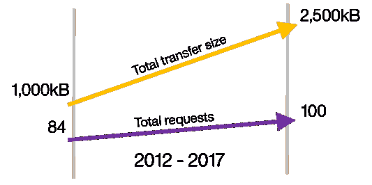
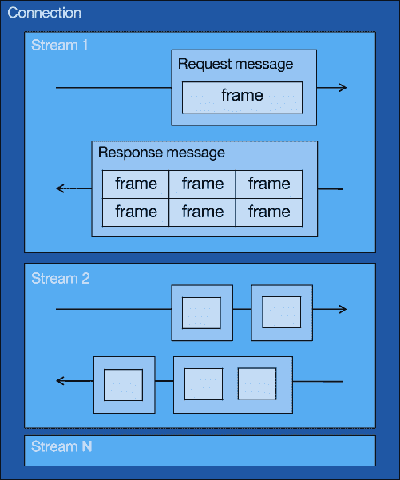
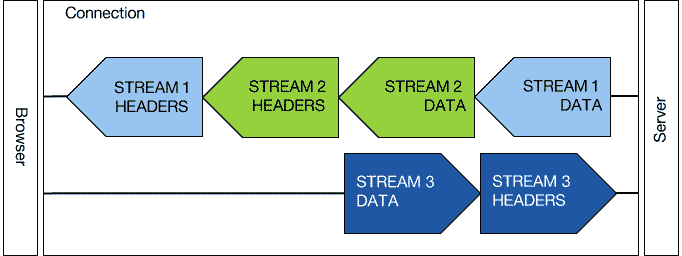
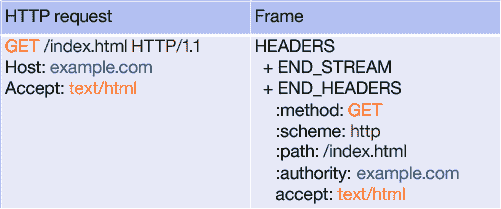
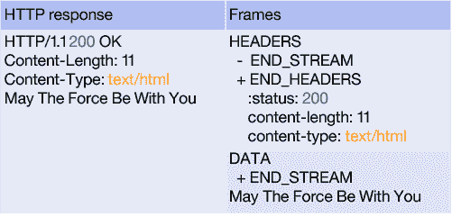
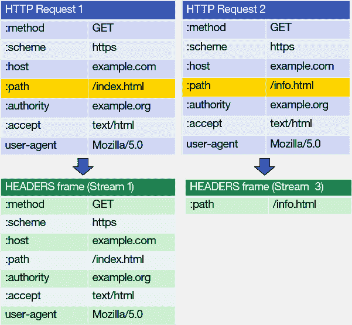

# HTTP/2 幕后原理

> 原文：[`developer.ibm.com/zh/articles/wa-http2-under-the-hood/`](https://developer.ibm.com/zh/articles/wa-http2-under-the-hood/)

HTTP/2 的首要目标是改善 Web 应用程序用户的体验。作为一个，它拥有包括轻量型、安全和快速在内的所有优势。HTTP/2 保留了原始 HTTP 协议的语义，但更改了在系统之间传输数据的方式。这些复杂细节主要由客户端和服务器管理，所以网站和应用程序无需重大更改即可享受 HTTP/2 的优势。

本文将概述 HTTP/2，包括它试图解决的问题，以及它的大量新的性能增强特性 — 包括请求/响应复用、报头压缩和服务器推送。

## HTTP 的历史

在深入介绍 HTTP/2 协议的细节之前，让我们回到过去并回顾一下 HTTP 中的起源。

该协议于 1989 年首次曝光，以 HTTP 0.9 的形式面世。Timothy Berners-Lee 在瑞士日内瓦附近的 CERN 上首次提到它时，它仅包含 1 行代码。唯一的方法是 `GET` ，还有一个像下面这个示例这样简单的请求： `GET /index.html` 。响应同样很简单，仅包含所请求的文件。

HTTP 0.9 不是一个正式标准，通过这种方式引用它是为了将它与随后的正式版本区分开。1996 年，推出了 HTTP 1.0 作为 IEFT 标准（依据 [RFC 1945](https://tools.ietf.org/search/rfc1945) ）。1999 年，在 [RFC 2616](https://tools.ietf.org/search/rfc2616) 中发布了 HTTP 1.1。第一个主要版本中的缺点促使人们在 1999 年进行了一次小幅修订，引入了大量可选特性和零碎细节 — 并消除了一些不好的方面。

几乎没有浏览器（或服务器）实现会采用该协议的每个方面，这导致不同浏览器间的用户体验不一致。显然，浏览器供应商无法实现 HTTP 1.1 中引入的 HTTP 管道的性能增强特性。

**您可以亲自查看**：在最近的一次[演示](https://blog.cloudflare.com/http-2-demo-under-the-hood/)中，Cloudflare 通过 HTTP 1.1 和 HTTP/2 加载了 200 个图像切片，然后比较了加载时间。

随着网络的使用变得更加普遍，性能需求呈指数级增长，而对 HTTP 的需求阻碍了性能提升。开发人员开始创建工具来克服该协议的不足。例如，HTTP 对 TCP 套接字的低效使用限制了性能，所以开发人员退而使用精心设计的服务器架构(racks of servers)来满足应用程序需求。从这个角度讲，未能让管道正常工作，促使人们开始着重反思 HTTP 的需求。

15 年后，才成立了 [HTTPbis](https://datatracker.ietf.org/wg/httpbis/charter/) 工作组来正式识别该协议的棘手问题，并最终起草对 HTTP/2 的预期。怀着显著改善最终用户对 HTTP 1.1 延迟的认知的使命，该工作组的协议推荐包含针对 “线头阻塞” 问题、报头压缩和服务器推送的精选解决方案。 [RFC 7540](https://tools.ietf.org/html/rfc7540) (HTTP/2) 和 [7541](https://tools.ietf.org/html/rfc7541) (HPACK) 的结合，预示着 Web 应用程序性能将急剧提升。

## HTTP 的现状

自万维网诞生以来，网页变得愈加复杂。 [第一批网页](http://info.cern.ch/hypertext/WWW/TheProject.html) 非常简单，仅包含文本：没有图像，没有 CSS，没有 JavaScript，只有普通的 HTML。快进到今天，平均每个网页就包含 100 多个下载资源，大小约为 2,500 KB。总传输大小自 [2012 年 5 月](http://httparchive.org/trends.php?s=All&minlabel=May+1+2012&maxlabel=May+1+2017#bytesTotal&reqTotal) 以来增长了 250%，这种持续增长没有出现缓和迹象。

##### 图 1\. 总传输大小和总请求数 (2012-2017)，来源：[HTTPArchive](https://httparchive.org/reports/state-of-the-web#bytesTotal&reqTotal)

### 工具和变通方案

尽管互联网确实能快速提供高度复杂的内容，但出现这样的结果并不是因为 HTTP 1.1 协议（ *尽管* 采用了该协议）。在当前版本中，HTTP 无法满足如今的 Web 体验需求。因此，Web 开发人员针对这些性能问题提供了一系列变通方案。让我们来看一些比较流行的工具和它们修补的问题。

#### 线头阻塞

HTTP 1.0 仅允许通过一个 TCP 连接发出一个请求。这引发了所谓的 “线头阻塞” 问题，迫使浏览器等待缓慢的响应。HTTP 1.1 通过 *管道* 解决了这个问题，管道使浏览器能并行发出多个请求。但是，浏览器供应商很难实现管道，而且大多数浏览器（包括 Firefox）在发布时都会默认禁用该特性。Chrome 甚至完全删除了它。

#### 多个 TCP 连接

打开 TCP 连接需要很高的成本，而且我们对客户端应如何使用它们知之甚少。唯一的协议规定是，每个主机最多可以打开 [2](https://www.w3.org/Protocols/rfc2616/rfc2616-sec8.html#sec8.1.4) 个连接。由于只有 2 个 TCP 连接，开发人员为了能够展示一个现代页面需要竞争这两个名额 — 所以他们找到了一种方法来绕过这一限制。

通过使用一种称为 *域分片（domain sharding）* 的流行技术，开发人员能创建多个主机，每个主机提供一个网站所需资源的一部分。切分已变得非常普遍，网页加载期间打开的平均 TCP 连接数量也因此达到约 35 个（来源： [HTTPArchive](http://httparchive.org/trends.php?s=All&minlabel=May+1+2012&maxlabel=May+1+2017#_connections) ）。

浏览器供应商不甘示弱，他们也违反了该协议，任意增加浏览器实现中允许的开放连接数量。这有助于并行化各个浏览器中的资源加载，但没有充分利用 TCP 套接字。下表显示了每个主机名允许打开的端口的最高数量，以及最流行的 3 个浏览器在这方面的不同。

##### 表 1\. 并行打开的 TCP 连接的最大数量（来源：browserscope.org)

| 浏览器 | 每个主机名的最大并行连接数 |
| --- | --- |
| Chrome | 24 |
| Firefox | 6 |
| Internet Explorer 12 | 11 |

浏览器实现中的不一致意味着，用户冲浪体验的质量取决于他们选择的浏览器，而不是网站的设计和构思有多精巧。

#### 资源内联和级联

为了追求更高性能，Web 应用程序开发人员采用的聪明技巧并不只有域切分。

*   **文件串联** 创建一个包含全部所需资源的大文件。为网站的所有 CSS 创建一个文件，为 JavaScript 创建一个文件，为包含网站图标的图像子画面表创建另一个文件。
*   **资源内联** 将 CSS 和 JavaScript 直接嵌入在 HTML 中，这使得嵌入图像也成为可能。对图像进行 base64 编码，然后在加载网页时进行解码。

这些技术都不可取，尤其是从设计角度讲。在这两种情况下，页面的结构都与样式组合在一起，图像解码也会消耗很多时间。缓存也无法轻松实现。

但是，如果目标只是减少请求的文件数量，那么这些变通方案是成功的。随着文件请求减少，需要打开的 TCP 套接字也会减少。

## 最吸引人的特性

HTTP/2 的大多数实用特性归功于 Google 在 SPDY 协议上开展的工作。在 HTTPbis 工作组开始起草 HTTP/2 RFC 的第一个版本时，SPDY 已证明一个主要 HTTP 版本更新切实可行。因为已经部署并开始采用 SPDY，所以有证据表明更新的协议在自然环境下具有更高的性能。

HTTP/2 成功的关键在于，它实现了显著的性能改善，同时保持了 HTTP 范例，以及 HTTP 和 HTTPS 模式。该工作组规定，向 HTTP/2 的迁移必须透明，而且使用者不会受到任何影响。

该协议最吸引人的特性包括：

*   新升级路径
*   二进制分帧
*   请求/响应复用
*   报头压缩
*   流优先化
*   服务器推送
*   流控制

让我们来查看每个特性。

### 新升级路径

HTTP/2 升级路径与标准路径稍有不同，省去了一些协商。对于基于 HTTP/2 的安全连接，无法通过升级标头请求切换协议，并收到一条让人安心的”101 switching”HTTP 状态。相反，通过使用一个名为应用层协议协商 (ALPN) 的新扩展，客户端向服务器告知它能理解的通信协议（按偏好排序）。服务器然后使用该列表中它也理解的第一个协议作为响应。

SPDY 需要一个安全连接，虽然社区迫于压力会建立这样的连接，但 HTTP/2 规范没有强制要求这么做。但是，所有主要浏览器供应商都仅在 TLS 上实现 HTTP/2，而且不支持不安全的连接。这实际上会迫使 Web 应用程序实现者对所有 HTTP/2 流量使用 TLS（来源： [caniuse.com](http://caniuse.com/#search=http2) ）。curl 用户仍可采用通过 HTTP 升级标头的升级路径，因为它将实现既明确又安全的连接。

### 二进制协议

或许 HTTP/2 的最重要改变是转换为二进制协议。对于开发人员，这可以说是性能增强的焦点。新协议称为 *二进制分帧层（binary framing layer）* ，它重新设计了编码机制，而没有修改方法、动词和标头的熟悉语义。

最重要的是，所有通信都在单个 TCP 连接上执行，而且该连接在整个对话期间一直处于打开状态。这可能得益于二进制协议将通信分解为帧的方式：这些帧交织在客户端与服务器之间的双向逻辑流中。

#### 连接的拓扑结构

正如我提到的，在 HTTP/2 的新范例中，仅在客户端与服务器之间建立了一个 TCP 连接，而且该连接在交互持续期间一直处于打开状态。在此连接上，消息是通过逻辑流进行传递的。一条 *消息* 包含一个完整的帧序列。在经过整理后，这些帧表示一个响应或请求。

图 2 演示了连接组件之间的关系，展示了一个用于建立多个流的连接。在流 1 中，发送了一条请求消息，并返回了相应的响应消息。

##### 图 2\. HTTP/2 连接的拓扑结构

我们将分别查看每个概念。

#### 连接和流

仅与一个对等节点建立一个连接，并在该连接上传输多个流。因为流可以交织，所以可以同时快速的传输多个流。

#### 消息

*消息* 是一组帧。在对等节点上重建这些帧时，它们形成一个完整的请求或响应。特定消息的帧在同一个流上发送，这意味着一个请求或响应只能映射到一个可识别的流。

#### 帧

*帧* 是通信的基本单位。每个帧有一个标头，其中包含帧的长度和类型、一些布尔标志、一个保留位和一个流标识符，如图 3 所示。

##### 图 3\. 帧分解

#### 长度

*length 字段* 记录帧的大小，它最多可在一个 `DATA` 帧中携带 2²⁴个字节（约 16 MB），但默认的最大值设置为 2¹⁴个字节 (16 KB)。帧大小可以通过协商调得更高一点。

#### 类型

*type 字段* 标识帧的用途，可以是以下 10 种类型之一：

*   `HEADERS` ：帧仅包含 HTTP 标头信息。
*   `DATA` ：帧包含消息的所有或部分有效负载。
*   `PRIORITY` ：指定分配给流的重要性。
*   `RST_STREAM` ：错误通知：一个推送承诺遭到拒绝。终止流。
*   `SETTINGS` ：指定连接配置。
*   `PUSH_PROMISE` ：通知一个将资源推送到客户端的意图。
*   `PING` ：检测信号和往返时间。
*   `GOAWAY` ：停止为当前连接生成流的停止通知。
*   `WINDOW_UPDATE` ：用于管理流的流控制。
*   `CONTINUATION` ：用于延续某个标头碎片序列。

参见规范的 [11.2 节](https://tools.ietf.org/html/rfc7540#section-11.2) 了解每种帧类型的功能的更多细节。

#### 标志

*flag 字段* 是一个布尔值，指定帧的状态信息：

*   `DATA` 帧可定义两个布尔标志： `END_STREAM` 和 `PADDED` ，前者表示数据流结束，后者表示存在填充数据。
*   `HEADERS` 帧可以将相同的标志指定为 `DATA` 帧，并添加两个额外的标志： `END_HEADERS` 和 `PRIORITY` ，前者表示标头帧结束，后者表示设置了流优先级。
*   `PUSH_PROMISE` 帧可以设置 `END_HEADERS` 和 `PADDED` 标志。

所有其他帧类型都无法设置标志。

#### 流标识符

*流标识符* 用于跟踪逻辑流的帧成员关系。成员每次仅属于一条消息和流。流可以提供优先级建议，这有助于确定分配给它的网络资源。我稍后会更详细地解释流优先化。

### 请求/响应复用

单一 TCP 连接的问题在于，一次只能发出一个请求，所以客户端必须等到收到响应后才能发出另一个请求。这就是 “线头阻塞” 问题。正如之前讨论的，典型的变通方案是打开多个连接；每个请求一个连接。但是，如果可以将消息分解为更小的独立部分并通过连接发送，此问题就会迎刃而解。

这正是 HTTP/2 希望达到的目标。将消息分解为帧，为每帧分配一个流标识符，然后在一个 TCP 连接上独立发送它们。此技术实现了完全双向的请求和响应消息复用，如下图所示。

##### 图 4\. 在 TCP 连接上交织的帧

图 4 中的图解显示在一个连接上快速传输了 3 个流。服务器发送两个响应，客户端发送一个请求。

在流 1 中，服务器为一个响应发送 `HEADERS` 帧；在流 2 中，它为另一个响应发送 `HEADERS` 帧，随后为两个响应发送 `DATA` 帧。两个响应按如图所示的方式交织。在服务器发送响应的过程中，客户端发送一条新消息的 `HEADERS` 和 `DATA` 帧作为请求。这些帧也与响应帧交织在一起，如下图所示。

##### 图 5\. HTTP/2 将请求/响应帧交织在一起

所有帧在另一端重新组装，以形成完整的请求或响应消息。

帧交织有许多好处：

*   所有请求和响应都在一个套接字上发生。
*   所有响应或请求都无法相互阻塞。
*   减少了延迟。
*   提高了页面加载速度。
*   消除了对 HTTP 1.1 工具的需求。

##### 图 6\. 将 HTTP 请求映射到 HTTP/2 帧

我们将左侧的一个 HTTP 请求映射到右侧的一个 `HEADERS` 帧。

在 `HEADERS` 帧中，设置了两个标志。第一个是 `END_STREAM` ，它设置为 true（由加号表示），表明该帧是给定请求的最后一帧。 `END_HEADERS` 标志也设置为 true，表明该帧是流中最后一个包含标头信息的帧。

`HEADERS` 帧中的标头属性反映了 HTTP 1.1 请求中设置的属性。因为 HTTP/2 一定要保持 HTTP 协议的语义，所以必须这么做。

接下来，让我们来看看该请求的响应。

#### 将 HTTP 请求映射到帧

图 7 的左侧是一个 HTTP 1.1 标头响应。右侧是使用两个 HTTP/2 帧表示的同一个响应： `HEADERS` 和 `DATA` 。

##### 图 7\. 将 HTTP 响应映射到 HTTP/2 帧

在 `HEADERS` 帧中， `END_STREAM` 表明该帧不是流中的最后一帧，而 `END_HEADER` 表明它是最后一个包含标头信息的帧。在 `DATA` 帧中， `END_STREAM` 表明它是最后一帧。

### 报头压缩

HTTP/2 协议拥有配套的 HPACK。HPACK 的目的是减少客户端请求与服务器响应之间的标头信息重复所导致的开销。 *报头压缩* 的实现方式是，要求客户端和服务器都维护之前看见的标头字段的列表。未来在构建引用了已看见标头列表的消息时可以使用此列表。

##### 图 8\. 压缩同一个连接上的两个请求的标头

在图 8 中的两个请求中，标头信息是重复的。唯一的不同在请求的资源上（已采用黄色突出显示）。HPACK 报头压缩可以在这里派上用场。在第一个请求后，它仅需发送与前一个标头的不同之处，因为服务器保留着以前看见的标头的列表。除非设置了标头值，否则会假设后续请求拥有与之前的请求相同的标头值。

### 流优先化

消息帧通过流进行发送。每个流都分配了一个优先级，用于确定它的处理顺序，以及它将收到的资源量。

将该优先级输入到给定流的标头帧或优先级帧中，优先级可以是 0 到 256 之间的任何数字。

可以定义依赖关系，允许在一个资源之前加载另一个资源。也可以将优先级组合到一个 *依赖树* 中，让开发人员对分配给每个流的重要性有更多控制权。

##### 图 9\. 用于流优先化的依赖树

在图 9 中，字母表示流标识符，数字表示分配给每个流的权重。树的根是流 A，首先会向它分配资源，然后才向依赖它的流 B 和 C 分配资源。为流 B 分配了 40% 的可用资源，流 C 收到了 60% 的可用资源。流 C 是流 D 和 E 的父流，二者分别从其父流收到相同的资源配额。

流优先级仅是对服务器的建议，可以动态更改或完全忽略。在起草 HTTP/2 协议的过程中，工作组认为允许客户端强迫服务器遵守特定资源分配是不对的。相反，服务器可以自由调整优先级，使其与自己的能力匹配。

### 服务器推送

*服务器推送* 使服务器能预测客户端请求的资源需求。然后，在完成请求处理之前，它可以将这些资源发送到客户端。

要了解服务器推送的好处，可以考虑一个包含图像和其他依赖项（比如 CSS 和 JavaScript 文件）的网页。客户端发出一个针对该网页的请求。服务器然后分析所请求的页面，确定呈现它所需的资源，并主动将这些资源发送到客户端的缓存。在执行所有这些操作的同时，服务器仍在处理原始网页请求。客户端收到原始网页请求的响应时，它需要的资源已经位于缓存中。

那么 HTTP/2 如何管理服务器推送而不会让客户端过载？针对希望发送的每个资源，服务器会发送一个 `PUSH_PROMISE` 帧，但客户端可通过发送 `RST_STREAM` 帧作为响应来拒绝推送（例如，如果浏览器的缓存中已包含该资源）。重要的是所有 `PUSH_PROMISE` 都在响应数据之前发送，所以客户端知道它需要请求哪些资源。

### 流控制

*流控制* 管理数据的传输，使发送者不会让接收者不堪重负。它允许接收者停止或减少发送的数据量。例如，参阅一个提供点播视频的流媒体服务。观看者观看一个视频流时，服务器正在向客户端发送数据。如果视频暂停，客户端会通知服务器停止发送视频数据，以避免耗尽它的缓存。

打开一个连接后，服务器和客户端会立即交换 `SETTINGS` 帧来确定流控制窗口的大小。默认情况下，该大小设置为约 65 KB，但可通过发出一个 `WINDOW_UPDATE` 帧为流控制设置不同的大小。

## HTTP/2 的普及情况

供应商几乎都采用了 HTTP/2。在浏览器领域， [所有主要浏览器](http://caniuse.com/#search=http2) 目前都只支持基于 TLS 的新协议。在编写本文时，全球的支持率已超过 80%。

服务器支持率也有所增加，所有主要服务器系列的当前版本都支持 HTTP/2。您的托管服务提供商很可能已支持 HTTP/2。可以在 HTTP/2 规范的 [Wiki 页面](https://github.com/http2/http2-spec/wiki/Implementations) 上跟踪它的所有已知服务器实现。

工具支持也很丰富，所有您 [最喜欢的实用工具](https://github.com/http2/http2-spec/wiki/Tools) 都支持 HTTP/2。Wireshark 对希望调试服务器与客户端之间的 HTTP/2 通信的开发人员最重要。

## HTTP/2 与您的关系

Web 用户不关心您使用何种协议来提供内容，只要它速度够快就行。您可能已通过优化网站加载资源的方式，努力为客户提供他们想要的资源。借助 HTTP/2，您不再需要串联文件，将图标整理到一个图像中，设置大量域，或者内联资源。

简言之，HTTP/2 避免了对变通方案的需求。事实上，继续使用我在本文中介绍的性能工具，可能阻碍您的网站从 HTTP/2 性能增强中受益。

所以对大多数开发人员而言，最重要的问题是：现在是否适合针对 HTTP/2 重构我的网站？在我看来，这很大程度上取决于与应用程序组成和所使用的浏览器相关的因素。以下是一个平衡法则：您不希望不公平对待使用旧浏览器的用户，但希望提供更快的整体用户体验。

针对 HTTP/2 的优化是一个未知领域，尤其是在最佳实践方面。它不仅仅是消除变通方案并期待获得最佳成果的一种途径。我们每个人都必须亲自研究。在此过程中，我们会发现提升性能的新方法、HTTP/2 在自然环境下的运行效果，哪个服务器拥有最高性能的实现，等等。

对 Web 开发而言，HTTP/2 代表着一个美好的新世界。大胆的开发人员在接受它带来的挑战的同时也将获得收益。

本文翻译自：[HTTP/2 under the hood](https://developer.ibm.com/articles/wa-http2-under-the-hood/)（2017-06-29）