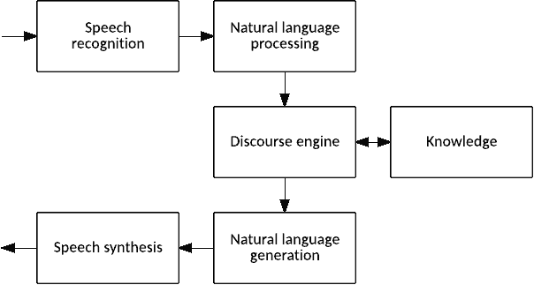
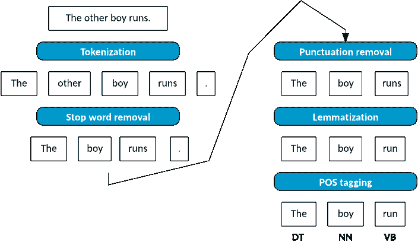
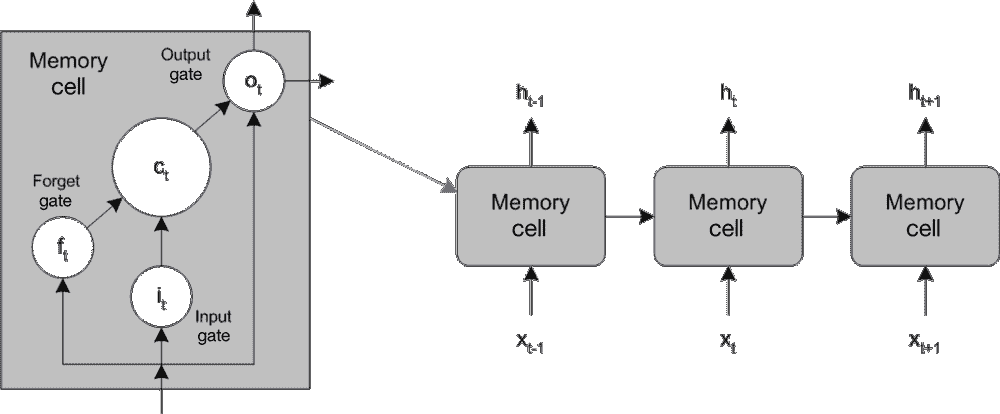
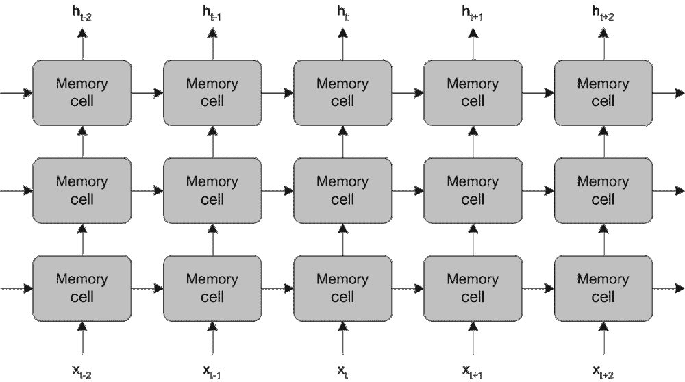

# 大声说出来

> 原文：[`developer.ibm.com/zh/articles/cc-cognitive-natural-language-processing/`](https://developer.ibm.com/zh/articles/cc-cognitive-natural-language-processing/)

1954 年，乔治城大学和 IBM 演示了将一些俄语的句子翻译为英语的能力。半个世纪后，IBM 开发了一个名为 IBM Watson 的问答系统，它甚至击败了最优秀的 *Jeopardy* 选手。作为 IBM Watson 的标志性特征，自然语言处理 (NLP) 仍是机器学习最重要的应用之一，因为它代表着最自然的人机接口。本教程将探索一些用于 NLP 的主要方法，比如深度学习（神经网络）。本教程还将演示使用开源库的 NLP。

NLP 是多种与语言相关的领域的综合成就。为了方便演示，请参考下图中的示意图。在一个抽象的问答系统中，涉及到将音频翻译为文本，再将文本分解为可供机器使用的结构；一个维护状态的交谈引擎和一些知识来源的接口；生成答案；以及最终合成为语音音频。

##### 一个抽象的问答系统



您可以进一步分解抽象问答系统的这些元素。在 NLP 中，将文本按语法分解为各个组成部分，然后通过语义为其分配某种含义。在自然语言生成阶段，系统必须重新构造（根据想要的语言的句子结构规则）一个（要传达给用户的）抽象概念作为响应。

但是，问答只是 NLP 的一个方面。NLP 还被应用在除交谈以外的许多领域。其中两个例子是情绪分析（确定句子或文档引起的感情波动）和归纳总结（系统根据一段文本创建一段摘要）。我们快速概括一下 NLP 的历史，然后深入研究其中的细节。

## NLP 的历史

NLP 是强人工智能的最早研究目标之一，因为它是人机之间的自然接口。最早的 NLP 实现是在 1954 年的乔治城实验中完成的，这是 IBM 与乔治城大学联合开展的一个项目，它成功地证明了机器能将 60 多个俄语句子翻译为英语。研究人员使用手工编写的语言规则完成了这一壮举，但该系统无法扩展到一般性翻译中。

##### 主要 NLP 里程碑的时间线


上世纪 60 年代，“微观世界” 的研究悄然兴起，人们开发了模拟世界和 NLP 来查询和操作这些世界中的物体。一个著名的示例是 Terry Winograd 的 SHRDLU，它使用了 NLP 来更改一个包含各种形状的虚拟沙箱的状态，然后通过英语（“Can a pyramid be supported by a block?”）查询沙箱的状态。SHRDLU 不仅演示了 NLP，还演示了规划执行请求，比如“清除桌面，将红色积木放在蓝色积木上。”其他发展包括构造 Eliza，这是一个模拟心理治疗师的聊天机器人。

上世纪 70 年代，人们向 NLP 中引入了新理念，比如构建概念本体（机器可用的数据）。这项工作持续到了上世纪 80 年代，研究人员开发了硬编码的规则和语法来解析语言。经证明，这些方法不是很可靠，但考虑到当时的计算资源，它们仍是最佳方法。

直到上世纪 80 年代晚期，统计模型才开始发挥作用。统计模型不再使用不可靠的复杂规则，而使用现有的文本语料（文档和其他信息）来构建人们使用语言的模型。研究人员应用了隐马尔科夫模型（一种为线性序列创建概率模型的方法）对词性进行标记，以消除言语中的措辞选择背后的含义表达歧义（假设语言中存在许多歧义）。统计模型通过自动学习来创建规则，突破了手工编写规则的复杂性阻碍。

如今，深度学习已提高许多 NLP 任务中的标准。递归神经网络（不同于前馈网络，因为它们可以自我参考）已成功应用于解析、情绪分析，甚至是自然语言生成（配合图像识别网络）。

## 解析一个句子

现在，我们看看一个英语句子的处理，以及用于分解它的任务序列。我将解析一个包含 4 个单词的简单句子（“The other boy runs.”），然后演示它。



解析的第一步是将句子分词化 (tokenize) — 也就是说，将句子分解为各个部分（或分词）。组成我的简单句子的分词包括 The、other、boy、runs 和句点 (.)。分词化得到了组成句子的各个单词的完整集合。

下一步称为停用词删除。删除停用词的目的是删除语言中的常用单词，以便关注句子中的重要单词。停用词集合没有统一的定义，但一些常用词很容易被删除。

删除停用词后，删除标点符号。在此上下文中，标点符号不仅指的是逗号和句号，还包括使用的各种特殊符号（括号、省略号、引号、感叹号等）。

清理了我的句子后，我将执行*词形还原*过程（也称为*词干提取*）。词形还原的目的是将单词简化为它们的词干或原形。例如，将 walking 简化为 walk。在某些情况下，算法会更改单词的选择，以便使用正确的词条（例如将 better 更改为 good）。在这个示例中，我将 runs 简化为它的原形 run。

解析的最后阶段称为词性 (POS) 标记。在此过程中，我根据单词的语境，标记出与某个单词对应的词性。我确定剩下的单词属于哪种（限定词、名词和动词）词性类型。

这些步骤并不复杂，现在让我们来看看在自动执行时此过程是如何发生的。

## 使用 NLTK 进行解析

一个最流行的 NLP 平台是 [Natural Language Toolkit (NLTK) for Python](http://www.nltk.org/)。通过使用图解析一个句子的句子解析序列，我将在一个稍微复杂一些的句子上使用 NLTK。在这个示例中，我将使用来自 William Gibson 的 *Neuromancer* 的开篇句。我将这句话载入 Python 中的一个字符串中（在这里，请注意 `>>>` 是 Python 提示符）。

```
>>> sentence = "The sky above the port was the color of television, tuned to a dead channel." 
```

然后使用 NLTK 的分词器对这个句子进行分词化，并发出这些分词。

```
>>> tokens = nltk.word_tokenize( sentence )
>>> print tokens
['The', 'sky', 'above', 'the', 'port', 'was', 'the', 'color', 'of',
 'television', ',', 'tuned', 'to', 'a', 'dead', 'channel', '.'] 
```

分词化句子后，我可以删除停用词，方法是创建一组英语停用词，然后从此集合中过滤这些分词。

```
>>> stop_words = set( stopwords.words( "english" ) )
>>> filtered = [ word for word in tokens if not word in stop_words ]
>>> print filtered
[ 'The', 'sky', 'port', 'color', 'television', ',', 'tuned', 'dead',
  'channel', '.' ] 
```

接下来，从过滤后的标记列表中删除所有标点符号。我创建了一个简单的标点符号集合，然后再一次过滤该列表。

```
>>> punct = set( [ ",", "." ] )
>>> clean = [ word for word in filtered if not word in punct ]
>>> print clean
[ 'The', 'sky', 'port', 'color', 'television', 'tuned', 'dead', 'channel' ] 
```

最后，对清理后的分词列表执行词性标记。结果得到了一组分词和标记对，其中的标记表示词类。

```
>>> parsed = nltk.pos_tag( clean )
>>> print parsed
[ ('The', 'DT'), ('sky', 'NN'), ('port', 'NN'), ('color', 'NN'),
  ('television', 'NN'), ('tuned', 'VBN'), ('dead', 'JJ'), ('channel', 'NN') ] 
```

这只是 NLTK 的小部分功能。借助 NLTK，您还可以拥有一个语料集合，使用该集合轻松地试验 NLTK 和它的功能。

## 统计方法

基于手工编写的语法来解析文本的问题在于，规则很不可靠。但是，能否不依靠手工编写的不可靠规则，而从样本文本中学习规则？统计方法在这里派上了用场。统计方法的一个有趣的优势是，它们可以处理以前未看见的输入或包含错误的输入。使用语法，通常无法优雅地处理这些类型的问题（在从未见过的新输入上进行操作）。

我们看看 NLTK 提供的一些统计方法。首先，导入一个样本语料库，我随后会在 NLTK 中使用它。

```
>>> import nltk
>>> import nltk.book import * 
```

我将这个 NLTK 导入 Python 中，然后导入了 9 个样本文本。对于本示例，我使用了 Text4 语料库，也就是 “Inaugural Address Corpus”。

```
>>> text4
<Text4: Inaugural Address Corpus> 
```

可以使用 `FreqDist` 方法轻松地识别一段文本的频率分布。此方法为我提供了一个语料库中的单词分布。构建频率分布是一个常见任务，NLTK 让它变得很容易。创建分布后，使用 `most_common` 方法发出 15 个最常用的单词（以及它们在语料库中出现的次数）。可以使用 `len` 方法查看单词（和符号）出现的总次数，该方法告诉我单词 “the” 在文本中的占比超过 6%。

```
>>> fdist = FreqDist( text4 )
>>> fdist.most_common( 15 )
[ (u'the', 9281), (u'of', 6970), (u',', 6840), (u'and', 4991), (u'.', 4676), (u'to', 4311), (u'in', 2527), (u'a', 2134), (u'our', 1985), (u'that', 1688), (u'be', 1460), (u'is', 1403), (u'we', 1141), (u'for', 1075), (u'by', 1036)]
>>> len( text4 )
145735
>>> print 100.0 * 9281.0 / len( text4 )
6.36840841253 
```

NLTK 轻松地识别出了语料库中使用的某个单词的最常见上下文。使用 `common_contexts` 方法，可以提供一个单词列表并查找它们的上下文（下面这个示例表明，在上下文 “contempt cloaked in” 中找到了 “cloaked”）。

```
>>> text4.common_contexts( [ "cloaked” ] )
contempt_in 
```

最后，让我们看看理解语料库的一个重要方面：经常出现的单词序列。这里需要用到双连词的概念（即一段文本中一起出现的单词对），但搭配词是出现频率超高的双连词的子集。使用 `collocations` 方法，可以提取给定文本中经常一起出现的一组常见单词对。

```
>>> text4.collocations()
United States; fellow citizens; four years; years ago; Federal Government;
General Government; American people; Vice President; Old World; Almighty God;
Fellow citizens; Chief Magistrate; Chief Justice; God bless; every citizen; Indian tribes; public debt; one another; foreign nations; political parties 
```

从这组搭配中，很容易看到这些单词对高度依赖于语料库。考虑另一个使用电影*巨蟒与圣杯*作为输入语料库的示例。

```
>>> text7.collocations()
BLACK KNIGHT; clop clop; HEAD KNIGHT; mumble mumble; Holy Grail;
squeak squeak; FRENCH GUARD; saw saw; Sir Robin; Run away; CARTOON CHARACTER;
King Arthur; Iesu domine; Pie Iesu; DEAD PERSON; Round Table; clap clap;
OLD MAN; dramatic chord; dona eis 
```

双连词（或者一般而言 *n* 连词，其中的双连词表示 *n* =2）对理解文本中的单词使用和序列很有用，对（在遇到噪声时）评估单词出现概率也很有用。这种方法也被用于帮助识别拼写错误的单词或抄袭的文本。在使用给定语料库的 *n* 连词训练后，*N* 连词甚至被用于生成文本。

## 深度学习

深度学习已成为机器学习中最重要的研究领域，而且已用于识别图像或视频中的物体（比如面部），甚至会根据经过训练的样本来使用自然语言总结图像。研究人员也已将深度学习应用到了 NLP 领域。

使用 NLP 的一种重要方法属于递归神经网络方法，其中的网络包含一个基于时间的任务序列或包含自我参考元素。一种重要架构是长短期记忆 (LSTM) 网络，它使用了一种新颖的结构，其中的处理单元由记忆单元组成。每个记忆单元包含一个输入和一个输入门（用于确定何时可以吸收新输入）；输出和输出门（用于确定何时前馈输出）；以及一个遗忘门（用于确定何时忘记当前记忆单元以允许采用新输入）。下图中展示了这种总体架构，它使用输入、输出以及将单元状态馈送到其他单元的能力来表示一个单元层（代表时间或序列）。

##### 长短期记忆网络



可以使用 `backpropagation-through-time` 算法对 LSTM 进行输入训练（使用监督式学习根据输出错误来修改单元），该算法是一种适合递归网络的反向传播算法。请注意，对于 NLP，单词不会表示自己，而是通过数字形式或单词矢量来表示自己，这些矢量将单词映射到一个 1,000 维空间中，其中的维度可以表示时态、单/复数、词性等。通过将单词映射到单词矢量，可以对单词执行数学运算，得到令人惊奇的结果。一个著名的示例是，单词 Queen 与运算 `King + Woman – Man` 非常接近。从逻辑上讲，这符合情理，但也可以使用单词矢量从数学角度计算它。

LSTM 的强大功能不仅在小型网络中得以实现，还在垂直深度网络（可以增加它们的记忆）和水平深度网络（可以增加它们的表达能力）中得以实现。下图演示了这一结果。

##### 增加长短期记忆网络的记忆和表达能力



LSTM 网络的大小基于它们必须处理的词汇表大小。

## IBM Watson NLP API

这些 NLP 算法可能非常复杂，但您现在可以使用 IBM Watson 通过一组 API 来执行 NLP，这已不足为奇。帮助在电视比赛节目 *Jeopardy* 上战胜人类选手的相同 API 已可通过一组 REST 服务获得。

IBM Watson API 公开了一系列的功能，包括一个可用来向应用程序添加自然语言接口的对话 API，以及可分类或翻译语言的 API。IBM Watson 甚至可以通过 API 将语音翻译为文本或将文本翻译为语音。

## 其他应用

在此，我讨论了 NLP 的多种应用，但 NLP 的适用性实际上非常广泛且多样化。自动作文评分是学术领域的一项实用的应用，还有许多文字处理器中包含的语法检查（包括文本简化）。NLP 在外语学习中也很流行，能帮助学生理解另一种语言的文本，或者检查人类使用另一种语言生成的文本（包括自动化语言翻译）。最后，自然语言搜索和信息检索也是 NLP 的实用方面，特别是考虑到可被挖掘的多媒体数据的增长。

NLP 在文本分析（也称为文本挖掘）中也很有用，这包括词频、确定搭配词（一起出现的单词），以及连词和词长分布等任务特性。这些特性对确定文本复杂性，甚至是分析签名来识别作者很有用。

## 未来属于深度学习

从手工编写的语法和规则开始，NLP 在过去 60 年中不断发展，但通过使用深度学习，科学发展已实现了巨大的技术飞跃。NLP 代表着最自然的人类接口，所以将此通信模型应用于机器是必经旅程。如今，您可以在日常设备中找到 NLP，以及语音识别和合成。深度学习仍在继续发展，而且它将给这一领域带来更多进步。

本文翻译自：[Speaking out loud](https://developer.ibm.com/articles/cc-cognitive-natural-language-processing/)（2017-06-13）