# 企业数据访问模式

> 原文：[`developer.ibm.com/zh/articles/j-cn-java-and-microservice-6/`](https://developer.ibm.com/zh/articles/j-cn-java-and-microservice-6/)

本文将介绍在使整体式应用程序演化为微服务架构时要考虑的重要数据库主题。其中将介绍一些可能遇到的挑战，以及可用来解决这些挑战的模式。还将通过一个示例，展示将 Java 应用程序从整体式模式转变为微服务的必要任务。

## 分布式数据管理

常见的整体式应用程序通常会使用一个或两个关系数据库，数据库中包含运行系统所需的所有信息。这个整体式应用程序通常由一个专门的团队管理。该应用程序的架构使添加新功能、扩展和更改应用程序成为一个缓慢且高风险的过程。

在微服务架构中，每个微服务都必须有自己的数据库，这就使得新功能（也即新微服务）的添加可以快速实现，而且对应用程序其他功能产生影响的风险很低。此方法还支持对每种功能采用合适的工具。例如，可以使用 Data Cache for Cloud 服务或 Redis 数据库来存储应用程序中常见的数据的键值信息。此数据可能是城市、商店或机场列表。这个合适的工具也可能是一个关系数据库，用于存储必须在与事务流程相关的各个实体中保持一致的商店事务（订单）信息。

这种新方法有一些优点（ [参阅第 1 部分”微服务”](https://developer.ibm.com/zh/articles/j-cn-java-and-microservice-1st/) ），但从集中化数据管理转变为了分布式数据管理。该方法带来了一些必须考虑的新挑战。

## 新挑战

当从集中化数据管理转变为使用多个工具和数据库时，会出现一些整体式应用程序中不存在的挑战：

*   数据一致性
*   微服务之间的通信

### 数据一致性

通过为整个应用程序提供一个数据库，可以仅在一个事务中获取、修改和创建各种记录，使您始终能安全地拥有相同的信息视图。在整体式应用程序中，当应用程序增大，而且您需要更快执行查询时，就会出现不一致问题。结果，您需要创建缓存服务或一次性将公共信息发送给客户端设备（例如移动设备、HTML、桌面应用程序等）。这减少了服务器调用，但带来的问题是，需要确保所有阶段（也即数据库、缓存和客户端）都有相同的信息。

在采用分布式数据管理（多个数据库）的微服务架构中，从开发开始，就会出现不一致问题。无论应用程序大小，都无法避免此问题。例如，在可使用奖励积分订购机票的奖励系统中，要为某人创建一个新的机票订单，必须先获得这个人的当前积分总数。还必须获得该机票的积分成本，然后在比较这两个值之后创建订单。

在微服务架构中，这个过程包含以下阶段：

1.  从 Catalog 微服务获得积分形式的机票价格。

2.  从 Rewards 微服务获得机票订购者的积分总数。

3.  在 Orders 微服务的业务逻辑级别上比较积分成本与积分额。

4.  利用 Orders 微服务创建机票订单。

5.  利用一个外部预定服务预定航班。

6.  利用 Reward 微服务更新创建订单的人的积分数。

此过程有 3 个不同的微服务，每个微服务都有不同的数据库。挑战在于在所有微服务之间共享相同的信息。这是为了确保在机票购买过程中没有信息发生更改，同时确保事务结束时在每个微服务中更新完整信息。

一致性问题在分布式系统中很常见。 [CAP 定理](http://ksat.me/a-plain-english-introduction-to-cap-theorem) 规定，在分布式系统中，一致性、可用性和分区容错性 (CAP) 不能同时发生；仅能同时确保满足其中两个特征。

在当今环境中， *可用性* 是最重要的选择。因此，有两种模式可视为一致性问题的解决方案：

*   管道流程
*   事件驱动架构模式

**管道流程**

此流程可能看起来像一致性问题的简单解决方案，而且它适合需要执行一组步骤来完成某个流程（事务）的场景。

继续以奖励系统为例，通过采用管道模式，对 Orders 微服务的一个请求会在微服务之间启动一个操作流，如图 1 所示。

#### 图 1 管道模式

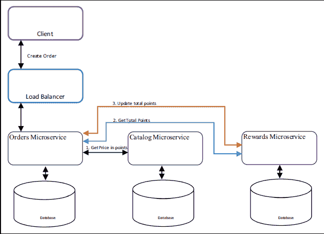

图 1 中所示的管道流程很常见，但这可能不是最佳的解决方案，因为它在服务之间建立了依赖关系。因此，如果更改了 Catalog 或 Reward 微服务，则必须更改 Orders 微服务。

**事件驱动架构模式**

一致性问题的另一个解决方案是事件驱动架构，其中的微服务相互通信的方式是，在其数据库中发生某个重要事件时发布一个事件。例如，如果在一个微服务中创建或更新了一条记录，而且其他微服务订阅了这个事件队列，那么在订阅微服务收到消息时，它们将更新或创建自己的记录。这种记录更新或创建可能导致发布一个新事件。

通过使用事件，可以创建与多个微服务相关的事务。

对于前面的示例，完成事务的必要步骤和事件如下：

1.  客户调用 Orders 微服务来创建一个订单。这个微服务然后在其数据库中创建一个状态为 *in-process* 的订单记录，并发布一个 *order created* 事件（参见图 2）。

##### 图 2 创建 In-process 状态的记录


2.Rewards 和 Catalog 微服务收到 *order created* 事件消息，更新各自的记录，以保留相应积分和机票价格。然后，每个微服务发布一个新事件（参见图 3）。

##### 图 3 来自微服务的确认

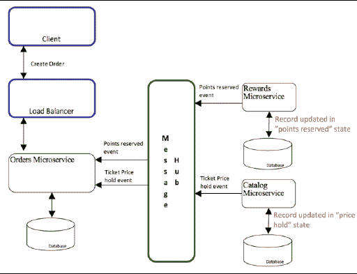

3.Orders 微服务收到两条消息，验证值，并将 *order created* 记录状态更改为 *finished，* 然后发布 *order finished* 事件（参见图 4）。

##### 图 4 记录状态被更新为 finished


4.Rewards 和 Catalog 微服务收到最终的事件，并将各自的记录更新为 *active* 状态（参见图 5）。

##### 图 5 最终更新相关记录

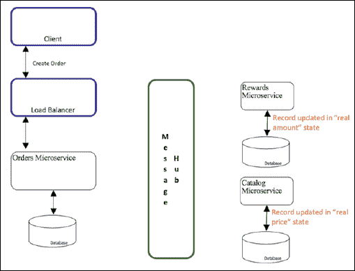

借助此模式，每个微服务更新自己的数据库并发布一个事件，而不依赖于其他微服务；这可以确保消息代理至少向相关微服务传送了一次消息。目前为止实现了一些好处，但是，考虑到这是一个复杂的编程模型，所以现在必须设计 *回滚* 事务。例如，假设用户没有足够的积分来订购机票。必须创建一个用于取消已创建订单的事务来应对这种情况。小节”微服务之间的通信”介绍了另一种可能对此一致性问题有帮助的模式。

### 微服务之间的通信

小节”分布式数据管理”中已介绍，除了处理数据一致性之外，还必须解决新的挑战。新挑战就是微服务之间的通信。在整体式应用程序中，仅有一个数据库，所以可正常地查询不同表中的信息。但是现在，在将信息传送给客户端之前，必须定义如何整合来自不同微服务的信息。

继续以小节”数据一致性”中的航空公司奖励系统为例，您在一个目录中创建机票列表，该目录包含用户对各个地点发表的所有评论。必须从两个数据库获取该信息：

*   地点列表（来自 Catalog 微服务数据库）。
*   Catalog 微服务中列出的有关这些地点的所有评论（来自 Reviews 微服务数据库）。

从这些数据库中获取信息后，必须将整合的信息发送给客户端。在微服务架构中，一个微服务不得查询另一个微服务的数据库，因为这会在它们之间建立依赖关系。对于示例中的方法，每个数据库必须只能通过其微服务 API 进行访问。对于类似这样的情况，可使用网关模式。

**API 网关模式**

API 网关模式涉及到创建一个中间件层，用来提供集成这些微服务的额外接口。这个中间层基于客户端与微服务之间的一个 API 网关；它提供了为客户端量身定制的 API。API 网关隐藏了技术复杂性（例如与大型机的连接）和接口复杂性。

API 网关为客户端提供了一个简化的接口，使服务更容易使用、理解和测试。为此，它向桌面和浏览器客户端提供不同的粒度级别。API 网关可向移动设备提供粗粒度 API，向可使用高性能网络的桌面客户端提供细粒度 API。

在此方案中，API 网关减少了通信量，使客户端能将多个请求合并成针对给定客户端（比如移动客户端）而优化的单一请求。这么做的好处是，设备随后只能体验到一次网络延迟，它利用了低延迟连接和服务器端的更强大硬件。

继续上面的示例，要获得地点和评论列表，可以创建一个 API 网关，以便公开一个服务来获得包含地点及其评论的整合列表。这个网关调用 Catalog 和 Rewards 微服务，整合信息，然后将信息发送到客户端，如图 6 所示。

##### 图 6 API 网关模式聚合来自不同微服务的信息

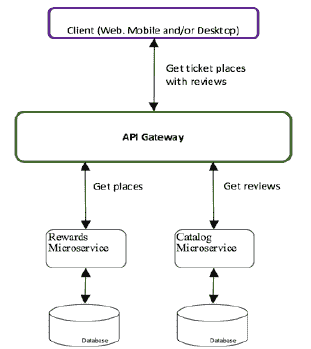

此模式可帮助解决不一致问题和数据聚合问题。但是，它带来了与系统性能（延迟）相关的新风险，因为现在有一个额外的网络点，也就是客户端的入口点。因此，它必须能够扩展并有良好的性能。

**共享资源模式**

要在微服务架构中获得更多的自主性，每个服务必须有自己的数据库，而且数据库不得共享或从不同微服务访问。但是，在迁移场景中，一项艰难的任务可能是将一些已在运行的实体分开。与其面对解耦所有实体的麻烦，可以用一个更轻松的方法来处理这种特殊情况。

对于实体高度耦合的情况，有一种被视为远超”反模式”的不同解决方案，可帮助解决这种特殊情况。该解决方案有一个共享数据库。在此模式下，无需拥有两个微服务和两个数据库（每个微服务对应一个数据库），您只需一个在两个微服务之间共享的数据库。共享资源模式发挥作用的重要关键是，保持业务领域关闭（也即，仅在实体与同一个业务领域相关时才使用它）。不要将它用作架构中的一般规则，而仅用作例外方法。图 7 中的示例展示了此模式的工作原理。

##### 图 7 共享资源模式在服务之间共享信息

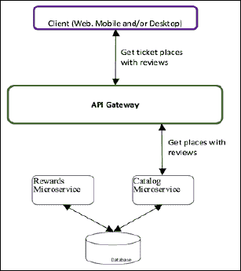

因为此模式与业务领域方法结合使用，所以最终可能仅有一个微服务来管理两个实体。举例而言，如果应用程序将各个地点的评论放在 Catalog 数据库中，那么您可以将这些评论视为机票的属性，将它们留在同一个数据库和同一个微服务中。最终，您的 Catalog 微服务中包含与机票相关的所有信息，包括它们的评论。

## 与整体式应用程序的集成

在从整体式应用程序演化为使用微服务的过程中，无需重写或创建新的应用程序，可能出现整个应用程序无法演化或应用程序的演化分阶段进行的情况。因此，您必须确保应用程序演化后的新组件能够与整体式应用程序的未更改部分通信和协同运行（例如，太过复杂而无法更改的事务系统）。

如果您计划保留整体式应用程序的一个或多个部分，一个重要因素是将这部分视为另一个微服务。然后可以采用集成其他微服务的相同方式来集成它。

### 修改整体式应用程序

[第 5 部分小节”重构”](https://developer.ibm.com/zh/articles/j-cn-java-and-microservice-5/) 中介绍了重构应用程序的各种方法。重构整体式应用程序后会得到不同的微服务，每个微服务都有一个独立的数据库。在大部分情况下，您会保持整体式应用程序的一些部分一直运行。整体式应用程序的这些部分的处理目标是，让它们以其他微服务通信的相同方式通信。此过程涉及到用于开发独立应用程序的模式和技术栈。

如果使用事件驱动模式，请确保整体式应用程序可发布和使用事件，包括深入修改源代码来实现这些操作。此过程也可通过创建一个发布和使用事件的事件代理来完成。事件代理将它们转换为整体式应用程序，以便将源代码中的更改减至最少。最终，数据库保持不变。

如果使用 API 网关模式，请确保网关能够与整体式应用程序进行通信。为此，一种选择是修改应用程序的源代码，以便公开容易供网关使用的 RESTful 服务。这也可以通过创建一个单独的微服务来实现，该微服务将整体式应用程序的操作过程公开为 REST 服务。创建一个单独的微服务，可避免对源代码执行重大更改；但是，该操作涉及到维护和部署一个新组件。

## 选择何种数据库技术

为每种功能选择合适工具的能力是一个重要优势，但它带来了最适合使用哪个数据库的问题。本节的目的是帮助您理解每种数据库的不同技术和用例。然后，当您决定将应用程序从整体式模式演化为微服务架构时，也可以确定更改您使用的技术是否是一个好方法。简言之，此决策可总结为使用 SQL 还是 NoSQL。

### 关系数据库

关系数据库（称为 SQL 数据库）是众所周知的；您可能已使用了一个关系数据库作为想要演化的整体式应用程序的数据库。几乎所有需要持久保存数据的应用程序中都使用了 SQL 数据库，无论在何种用例或场景中。

关系数据库提供的一些特征包括：

*   标准化的数据消除了重复，减小了数据库大小
*   在具有相关数据的事务中保持一致性和完整性（例如，原子性、一致性、隔离和耐久性，或者称为 ACID）

在以下情况下，关系数据库不是最佳选择：

*   快速访问大量数据
*   分层数据
*   键值数据（也即缓存和静态数据）
*   快速更改模式或相同数据具有多种模式

### NoSQL 数据库

术语 *NoSQL* 源于几乎所有系统都是使用 SQL 数据库开发的事实，即使数据不相关；术语 NoSQL 阐明数据库不是 SQL 数据库。该术语指代涵盖所有数据类型的数据库，比如键值、文档和时序数据。

如今有各种各样的 NoSQL 数据库选择，每种选择实现一种特定的结果。在微服务中，每个服务都必须有自己的数据库。这使您能从集成能力和必须解决的特定案例或问题方面评估数据库。

NoSQL 数据库的一些示例如下：

*   文档数据库保存文档及其数据。以下示例案例适合将销售信息保存在同一个文档中，包括商店、销售人员、客户和产品：

    – Apache CouchDb：JSON 文档

    – MongoDB:JSON 文档

*   图形数据库用于存储与图形有关的数据。示例包括社交网络数据或客户数据，包括购买历史记录，用于根据兴趣来提供实时建议：

    – Apache Tinkerpop

*   键值数据库用于实现高可用性、引用数据或缓存内存。它的一个示例是每个城市中的商店列表，该列表在应用程序的不同部分中是相同的：

    – Redis，内存型数据库

    – Cloud 上的 IBM Data Cache 服务是一种内存型数据库

*   列式数据库存储大量隔离的数据来进行分析，例如网站中的所有用户交互用于对用户的行为执行实时分析：

    – Druid

    – Cassandra

在当今环境中，NoSQL 数据库已被普遍接受。面对如此多的解决方案，找到解决问题的正确解决方案是一大挑战。在这种情况下，最简单的解决方案可能是最佳的解决方案，首先对您已知的技术执行分析，分析它们是否是您的问题的正确解决方案。但是，与尝试调整已知的技术相比，学习一种新技术可能更容易。另外，借助云计算，没有必要安装和管理每个组件，您可以直接开始使用所需的工具。

## 实际示例：创建新微服务

如 [第 5 部分小节”确定和创建新架构示例”](https://developer.ibm.com/zh/articles/j-cn-java-and-microservice-5/) 中所述，该 Java 整体式应用程序演化为 4 个微服务。这些微服务包含一个新用户界面 (UI)、一个搜索产品的新微服务、一个演化后的客户微服务，以及 Orders 微服务。

要在此示例中创建的第一个微服务是新的 Search 微服务，创建过程分为以下阶段：

1.  选择技术栈：

    – 云计算环境

    – 运行时

    – 新数据库技术

    – 安全的集成

    – 数据转换

2.  将数据迁移到新数据库：

    – 企业内部数据库的安全连接

    – 提取、转换和加载 (ETL) 数据

3.  创建 API 来搜索目录。

### 新的 Catalog Search 微服务

如第 1 部分”微服务概述”中所述，应用程序需要一种更好的搜索系统，以便用户能够更轻松地找到需要的产品。这种新搜索必须快捷，包含动态而不是详细的过滤器。

在该整体式应用程序中，只能按产品类别来过滤产品列表，而且这些类别是在名为 ORDERDB 的 SQL 数据库中创建的。在这里，一个产品属于一个或多个类别，而且一个类别可拥有一个或多个产品。图 8 展示了产品和类别的关系（也即多对多关系）。

##### 图 8 产品类别关系模型

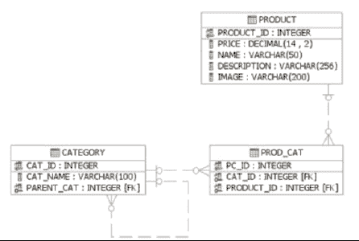

#### 选择技术栈

为这种搜索选择合适的技术。另外，选择部署、创建、运行和管理此微服务的合适环境。

***云计算环境***

如第 5 部分中小节”架构：目标架构”中所述，这个示例使用一种平台即服务 (PaaS) 来提高速度和灵活性。首先评估各个选项，确定哪个选项最适合此解决方案。

尽管有各种各样的 PaaS 提供者，但此示例使用 IBM Cloud，因为它提供了灵活的部署选项：Cloud Foundry、Docker 容器和虚拟机。这些选项基于开放技术。IBM Cloud 也拥有一个庞大的服务目录，其中包含创建完整解决方案所需的所有工具。

***运行时***

在微服务架构中，每个微服务都可以使用不同语言编写。尽管由于存在如此多的语言，选择语言可能很难，但此示例不会关注哪种语言更好。因为此示例仅创建一个 RESTful API 来搜索产品，所以选择了 Node.js，其基于回调的异步 I/O 的表达框架允许执行非阻塞式交互。选择它还因为它创建 API 的速度很快。

***数据库***

如第 1 部分中小节”虚构公司 A 的业务问题”中所述，必须改进搜索选项，以便客户更轻松地完成搜索过程。搜索结果必须是动态文本且与用户意愿相关，而不是按开发人员定义的过滤器获得的。

关系数据库 *不是* 这种工作的最佳解决方案，原因如下：

*   您必须创建全文字段，然后创建索引，二者都会增加数据库大小。
*   您必须基于表的列（字段）来执行搜索，这意味着只需添加对产品属性的新过滤器，而不创建动态搜索。
*   当存在数百万条记录时，关系数据库无法快速处理。

因此，此示例选择了 NoSQL 数据库。

在 IBM Cloud 目录中，提供了多种 NoSQL 数据库管理服务。因为此示例的目的是改进搜索选项，所以选择了 Elasticsearch-by-compose 服务，原因如下：

*   它拥有全文搜索功能。
*   它是面向 JSON 文档的，所有字段都在默认情况下建立了索引，而且可在一个查询中使用所有索引。
*   它没有模式，这有助于在未来向产品添加新属性。
*   它使用 RESTful API 完成工作；几乎所有操作都可通过包含 JSON 数据的简单 HTTP 调用来完成。
*   Compose 服务部署可根据应用程序需求进行缩放，而且它会默认部署在集群中。

***安全的集成***

创建新微服务涉及到将所有信息从产品和类别表迁移到新数据库 (Elasticsearch)。该过程中的第一步是安全地集成企业内部的数据库与 Cloud。这一步涉及到使用 IBM Cloud 目录中的 Secure Gateway 服务，该服务提供了从 Cloud 到在企业内部或其他云中运行的其他应用程序和数据源的安全连接。使用此服务不需要修改数据源，而且不会让它们面临安全风险。

有关更多信息，请访问以下网站：

[`console.ng.bluemix.net/docs/services/SecureGateway/secure_gateway.html`](https://console.ng.bluemix.net/docs/services/SecureGateway/secure_gateway.html)

***数据转换***

“安全的集成”中已提到，表中的所有产品信息都必须迁移到 Cloud 中的 Elasticsearch。数据必须先从表和关系转换为 JSON 模型。使用 JSON 模型的优势在于，您可以通过使用您需要的模式保存信息，采用您喜欢的方式在演示层中展示信息。与根据数据保存方式以及它与其他表的关系来展示信息相比，这种方法更好。

主要目标是为用户提供更好的搜索服务：用户希望如何进行搜索或查看？基于该信息创建文档。在整体式应用程序中，会根据产品的类别进行搜索，因为数据是按类别保存的。但是，现在可以根据产品来保存数据，可以使用类别作为搜索的另一个属性。图 9 对比了关系模型与 JSON 模型。

##### 图 9 对比产品关系模型与 JSON

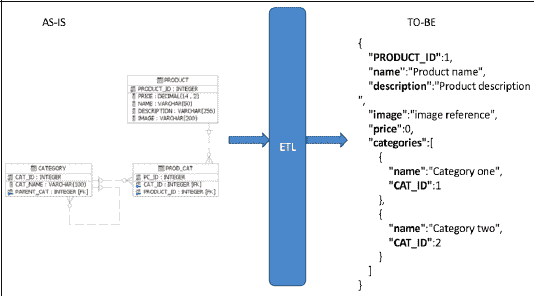

如图 9 所示，相同 PRODUCT_ID 和 CAT_ID 继续用于整体式订单系统。

拥有新 JSON 模型后，您定义如何将数据提取、转换和加载到 Elasticsearch 中。为了帮助处理这些任务类型，Cloud 提供了 Dataworks 等服务。此服务从企业内部的数据库或其他云基础架构获取数据，并将它们载入 Cloud Data 服务中，或者载入专为复杂数据集成任务而设计的 IBM DataStage® on Cloud 服务中。尽管这些服务很有用，但最新版的 Dataworks 不支持将数据载入 Elasticsearch 中，而且 DataStage 服务太过先进。因此，对于此示例，在 Cloud 中的目录搜索应用程序中创建了一个 ETL 工具作为 API。图 10 展示了新的 Catalog search 微服务的架构。

##### 图 10 Catalog Search 微服务架构


#### 将数据迁移到新数据库

将所有产品信息迁移到 Elasticsearch 数据库的步骤涉及到与企业内部的数据中心建立连接，然后提取、转换和加载数据。

***企业内部数据库连接***

使用以下步骤，选择 Cloud 中的 Secure Gateway 服务来连接到企业内部的数据中心，然后测试连接：

1.  打开 IBM Cloud 网站：

    [`www.bluemix.net`](http://www.bluemix.net)

    单击 **LOG IN** （使用您的 IBM id 登录）或单击 **SIGN UP** （创建一个帐户）。

2.创建 Secure Gateway 服务：

a. 转到 Cloud 目录。

b. 在 Integration 类别中选择 **Secure Gateway service** 。

c. 单击 **Create** 。

3.在 Secure Gateway 仪表板中配置一个网关。此选项会在 Cloud 中创建一个连接点，以便在安全隧道中连接到企业内部的服务或云服务：

a. 单击 Secure Gateway 仪表板中的 **Add Gateway** 选项。

b. 插入网关的名称，选择安全选项，然后单击 **ADD GATEWAY。** 参见图 11。

#### 图 11 Add Gateway 选项


4.添加安全网关的目标。使用此选项配置从 Cloud 连接的企业内部资源：

```
a. 单击刚创建的网关。

b. 单击 **Add Destination** 。

c. 选择 **On Premises** 并单击 **Next** 。

d. 输入您想连接到的资源的主机名和端口（或 IP 地址），在本例中为 IBM DB2 服务器的 IP 地址。您的窗口现在类似于图 12。单击 **Next** 。 
```

#### 图 12 Secure Gateway 中的 Add Destination 选项

```


e. 选择 **TCP** 作为连接 DB2 的协议，单击 **Next** 。

f. 选择 **None** 作为身份验证方法，单击 **Next** 。

g. 将 IP Tables 规则留空，单击 **Next** 。

h. 输入一个用于目标的名称，在本例中为 Monolith DB2，然后单击 **Finish** 。

您的整体式应用程序网关窗口现在类似于图 13。 
```

#### 图 13 创建了 DB2 目标的整体式应用程序网关

```


整体式 DB2 目标显示了详细信息（参见图 14），比如用于连接企业内部的 DB2 的云主机和端口。 
```

#### 图 14 整体式 DB2 目标的详细信息

```
 
```

5.现在可以配置网关客户端了。此客户端是在企业内部的数据中心上运行的端点，用以允许建立安全连接。执行以下步骤：

a. 在整体式应用程序网关仪表板上，单击 **Add Clients** 。

b. 选择一个要使用的网关客户端选项（本示例使用了 Docker 选项）：

```
• IBM Installer：不同操作系统的原生安装程序

• Docker：很容易部署为 Docker 容器的 Docker 镜像

• IBM DataPower® ：一个安装在 IBM DataPower 中的客户端 
```

c. 运行 **docker** 命令来启动网关客户端：

docker run -it ibmcom/secure-gateway-client <gatewayid>–sectoken</gatewayid>

**备注：** <secure token="token">是网关客户端选择窗口中提供的令牌。</secure>

运行网关客户端几秒后，将会显示一条确认消息（图 15）。

#### 图 15 网关客户端连接确认


d. 安装和执行网关客户端后，在网关客户端控制台中输入以下命令来配置访问控制表 (ACL)，以便允许流量进入企业内部数据库：

acl allow <db2 ip="ip" address="address">:</db2>

对于此示例，命令如下：

acl allow 1xx.xx.xx.x2:xxxxx

e. 使用第 h 步中配置的目标中提供的云主机和端口，从您最喜欢的 DB2 客户端测试与 DB2 数据库的连接。图 16 展示了一个连接测试示例。

#### 图 16 使用安全网关所提供的信息执行 DB2 连接测试

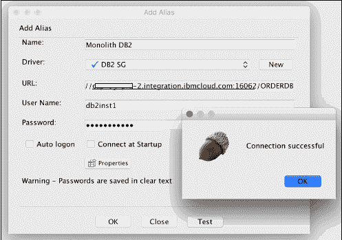

***提取、转换和加载数据***

与企业内部数据库建立了安全连接后，创建脚本来提取所有产品及其相关类别，将每条记录转换为 JSON，并将 JSON 数据提交到 IBM Cloud 中的 Elasticsearch 服务：

1.创建 Elasticsearch 服务：

a. 在下面的网站上创建一个 Compose 帐户：

[`www.compose.com/`](https://www.compose.com/)

b. 创建 Elasticsearch 部署：

i. 输入部署名称。

ii.选择想要使用的位置。

iii.选择初始部署资源。

iv.单击 **Create Deployment** 。

现在您可以看到您的部署的所有信息，包括状态、连接信息和使用情况。

c. 向部署添加一个用户：

i. 选择 **Users** → **Add User** 。

ii.输入用户名和密码。

d. 在 Cloud 中配置部署信息：

i. 登录到 IBM Cloud： [`www.bluemix.net`](http://www.bluemix.net)

ii.在 Cloud 目录的 Data & Analytics 类别中选择 **Elasticsearch by Compose** 服务。

iii.输入您在 Elasticsearch 部署上创建的用户的用户名和密码。

iv.输入创建的部署的主机名和密码。此信息位于 Elasticsearch 部署的 Overview 中的 Connection information 部分。

v. 单击 **Create** 。

Elasticsearch 部署的连接信息已显示，并可用作 Cloud 服务（图 17）。

#### 图 17 Elasticsearch 连接信息用于 Cloud 服务

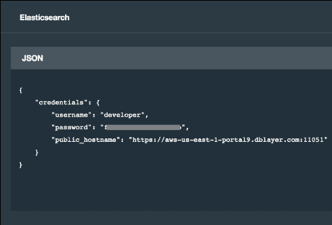

2.创建 ETL 应用程序。为了给这个示例创建 ETL 应用程序，开发了一段小 Node.js 脚本。此脚本使用安全网关云主机信息连接到 DB2 数据库。它也使用一次联接 (join) 来查询产品和目录表，创建一个具有”数据转换”中定义的格式的 JSON 数组，然后使用 *bulk* API 将该数组插入 Elasticsearch 中。

[代码的存储库可在 GitHub 上获得。](https://github.com/IBMRedbooks/SG248358-Monolith-to-Microservices)

以下是有关该脚本的重要信息：

– 根据”创建 API 来搜索目录”中所述，此脚本是作为 API 包含在搜索应用程序中。

– DB2 和 Elasticsearch 连接变量是在 catalogsearch\config\config.js 文件中定义的。

– 提取、转换和加载数据的脚本位于 catalogsearch\controllers\etl.js 文件中。

– catalogsearch\controllers\etl.js 文件的第 15 行是用于提取数据的查询。

– 第 26 – 39 行创建了产品的 JSON 数组。

– 第 40 行使用创建的 JSON 数组调用 Elasticsearch *bulk* API。

– 在 Web 浏览器中，您可以输入 catalogsearch\routes\api\v1\etl.js 文件中定义的路径来运行该脚本。

– 可以将此应用程序部署到 Cloud 上，方法是修改 catalogsearch\manifest.yml 文件中的 name 和 host 变量，并从 Cloud Foundry 命令行接口 (CLI) 运行 **cf push** 命令。

3.保持数据同步。对于此示例，所有产品信息现在都包含在 Elasticsearch 部署中。因为该示例是一次性的，所以本书不会讨论在数据库中建立同步的任务。但是，如果您想保持数据同步，可以在下面这个网站上找到相应策略：

[`www.elastic.co/blog/found-keeping-elasticsearch-in-sync`](https://www.elastic.co/blog/found-keeping-elasticsearch-in-sync)

#### 创建 API 来搜索目录

将产品信息放入 Elasticsearch 部署中后，可以创建一个 Node.js 应用程序，公开一个 API，以便从不同客户端（网页和移动应用程序）搜索产品。

在这个整体式应用程序中搜索产品，涉及到选择一个类别，然后逐个产品地查看，如图 18 所示。

#### 图 18 整体式应用程序产品搜索


要改进用户体验，可以通过仅输入一个文本字段并调用一个新搜索 API 来执行全文搜索。图 19 给出了一个通过仅将产品名称发送到 API 来搜索类别的示例。

#### 图 19 新 Catalog Search API 的响应

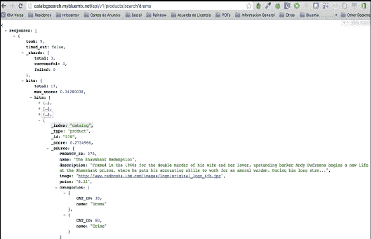

以下部分是应用程序的重要部分：

*   连接变量在 catalogsearch\config\config.js 文件中定义。
*   搜索 API 路径是在 catalogsearch\routes\api\v1\products 文件中定义的，并通过输入以下格式的 URL 来调用：`http://<appurl>/api/v1/products/search/<search terms>`在下面的示例中， *drama* 是用户在搜索电影时输入的文本：`https://catalogsearch.mybluemix.net/api/v1/products/search/ _drama_`。
*   对 Elasticsearch 文档的搜索使用 elasticsearch 模块进行搜索。为此，调用 Elasticsearch API 在索引中的所有文档中查找输入的文本，包括它的名称、类别、价格和描述。这部分代码是 catalogsearch\controllers\products.js 文件中的第 64 行。
*   可以将此应用程序部署到 Cloud 上，方法是修改 catalogsearch\manifest.yml 文件中的 name 和 host 变量，并从 Cloud Foundry CLI 运行 **cf push** 命令。

**小结**

现在已使用 Elasticsearch 数据库创建了新的 Catalog search 微服务，该数据库包含使用 DB2 的整体式应用程序关系数据库中的所有产品信息。该示例现在通过演化帐户数据模型，继续演化该整体式应用程序。

### 帐户数据模型的演化

如第 1 部分”微服务”中所述，应用程序还必须通过向客户信息中添加社交网络数据来实现演化。这能提供更好的客户视图，允许您根据客户的社交互动来提供公司产品的详细建议。

这个微服务被定义为混合微服务（参见第 3 部分中小节”架构：目标架构”）。它使您能继续处理 DB2 企业内部数据库中的客户个人信息，而且允许您在新数据库中添加社交网络数据。

#### 选择技术栈

对于这个微服务，继续使用 IBM Cloud 作为 PaaS 提供者，继续使用它的 Secure Gateway 服务来与企业内部数据库集成。为此示例选择了以下技术：

*   数据库

如果查看两个大型社交网络的 User API 提供的信息，可以看到此数据在不断变化，而且每个用户看到的数据不同；没有适合所有人的预定义模式。因此，在此示例中，选择了一个 NoSQL 数据库，因为它支持无模式数据模型，并能轻松快捷地更改。IBM Cloudant® 是被选中的数据库。

*   运行时

继续使用 Java 作为此微服务的运行时，因为此微服务从两个数据源提供信息（企业内部的 DB2 和 Cloudant）。另外，在整体式应用程序中获取客户个人信息的方法已使用 Java 进行开发。此开发可以利用您已拥有的所有代码和知识。

#### 企业内部数据库集成

要拥有安全的集成来获得客户的个人信息，可使用之前安装的同一个 Secure Gateway 基础架构。图 20 显示了演化后的 Accounts 微服务的新架构。

#### 图 20 Accounts 微服务架构

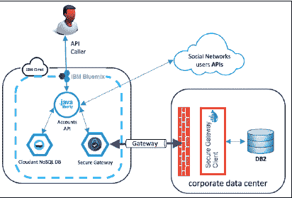

**社交信息数据模型**

已选择 Cloudant 作为存储社交信息的数据库。现在，创建该服务和帐户数据库，Node.js 应用程序在以后可以使用它们来公开帐户 API：

1.打开 [IBM Cloud](http://www.bluemix.net) 网站：

单击 **LOG IN** （使用您的 IBM id 登录）或单击 **SIGN UP** （创建一个帐户）。

2.创建 Cloudant 服务：

a. 转到 Cloud 目录。

b. 选择 **Cloudant service in the Data and Analytics** 类别。

c. 单击 **Create** 。

3.创建数据库：

a. 在 Cloud 控制台下选择该服务。

a. 单击 **Launch** 转到 Cloudant 仪表板。

b. 单击仪表板右上角的 **Create Database** 。

c. 在 Create Database 字段中输入 accounts（图 21）。

#### 图 21 创建 Cloudant 数据库

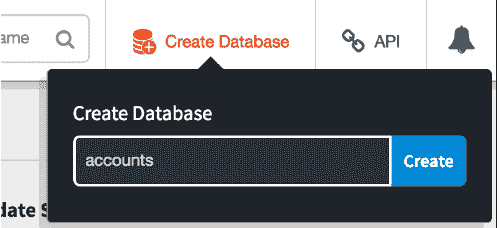

4.创建帐户视图：

a. 在 accounts 选项下，单击 Design Documents 右侧的加号 (+)，然后选择 **New View** 。

b. 为字段提供以下信息（图 22）：

**Design Document** ：新文档

**Index name** ：帐户

**_design/** ：所有

**Map function：** 发出用户名作为键并发出完整文档作为值的函数

**Reduce（可选）：** 无

c. 单击 **Create Document and Build Index** 。

#### 图 22 Cloudant Accounts 设计文档视图


d. “社交网络 JSON 数据模型示例”中提供了从两个最大的社交网络提取的社交数据 JSON 模型的示例。

可以在帐户数据库中添加此信息作为一个新的 JSON 文档，方法是单击 All Documents 选项旁边的加号 (+)，然后单击 **New Doc** 。

e. 在 New Document 窗口中，在 Cloudant 生成 _id 后添加一个逗号，然后粘贴来自”社交网络 JSON 数据模型示例”的信息。图 23 显示了结果。

#### 图 23 包含客户的社交网络信息的 Cloudant 新文档

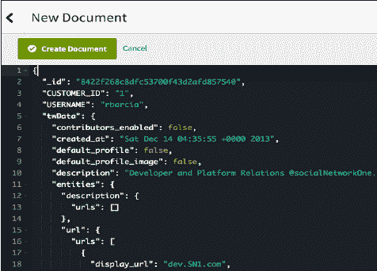

**备注：** 此示例手动复制来自两个大型社交网络提供的 API 的社交网络数据。有关如何从应用程序执行此操作的信息，请访问下面的网站：

[`developers.facebook.com/docs/graph-api`](https://developers.facebook.com/docs/graph-api)

[`dev.twitter.com/overview/api`](https://dev.twitter.com/overview/api)

**创建新 Accounts API**

已选择并创建了 NoSQL 数据库服务来保存客户的新社交信息，所以 IBM Cloud 与企业内部数据库之间的集成是安全的。下一个步骤是创建 API，以便从两个数据源获取信息（从企业内部 DB2 获取个人信息，从 Cloudant 获取社交信息），创建一个整合的 JSON 模型来将信息发送给用户。

要创建这个演化后的服务，请按照第 5 部分中小节”如何将 Java EE 重构为微服务”中介绍的策略进行操作。以下是操作步骤：

1.此刻，您已经知道了哪个功能需要拆分，所以应该使用 Eclipse 创建一个新 WAR 应用程序来负责处理帐户信息。

**备注：** 必须向项目添加依赖关系，因为该整体式应用程序使用 Apache Wink JAX-RS 实现来公开 REST 服务。WebSphere Liberty（自 2015 年中期开始）不支持该实现，因为它开始支持 Java EE 7，Java EE 7 提供了自己的原生 JAX-RS 实现。

a. 创建一个动态 Web 项目。

b. 在 New Dynamic Web Project 选项窗口中，选择 **WebSphere Application Server Liberty** 作为目标运行时，清除 **Add Project to an EAR** 复选框，并单击 **Modify** 作为配置选项。

c. 选择以下选项，然后单击 **OK** （图 24）：

• Dynamic Web Module

• Java, JavaScript

• JAX-RS (Web Services)

• JAXB

• JPA

#### 图 24 动态 Web 项目配置

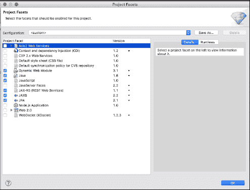

d. 单击 **Finish** 。

New Dynamic Web Project 配置窗口将会打开（图 25）。

#### 图 25 Dynamic Web Project 页面

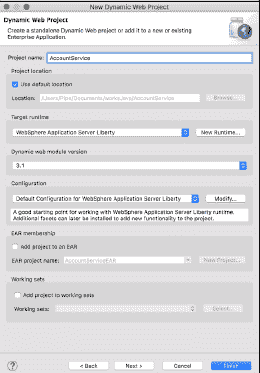

2.创建与整体式应用程序中相同的数据包结构，以便保存 Java 开发团队所使用的标准和实践。

3.复制整体式项目中与 Accounts 相关的所有代码，并放入新的 Java 项目中。

4.在新项目中，修改源代码，以便将 Cloudant 数据库中的社交网络信息与 DB2 信息整合在一起。

5.创建一个新的 REST 服务来获得完整的用户信息。

对于此微服务，已开发了 AccountService 应用程序。代码详细细节请查看： [AccountService 应用程序](https://github.com/IBMRedbooks/SG248358-Monolith-to-Microservices/tree/master/accountmicroservice) 。

## 总结

本文介绍了使整体式应用程序演化为微服务架构时要考虑的重要数据库主题。由于在整体式架构中，运行应用程序的运行时环境相对隔离，所以治理和安全保护很简单。而微服务架构具有典型的革新特征，给活动的治理和应用程序的安全威胁保护带来了更多挑战。因此，下一部分将围绕微服务架构的安全性和治理展开讨论。好了，学习愉快，我们下次再见！

## 参考资源

*   示例代码： [可在 GitHub 上获得](https://github.com/IBMRedbooks/SG248358-Monolith-to-Microservices)
*   本文转自红皮书： [Evolve the Monolith to Microservices with Java and Node](http://www.redbooks.ibm.com/redpieces/abstracts/sg248358.html?Open&pdfbookmark)
*   [关于微服务和 Java 需要知道的 5 件事](https://developer.ibm.com/zh/articles/j-cn-java-and-microservice-5-reason/)