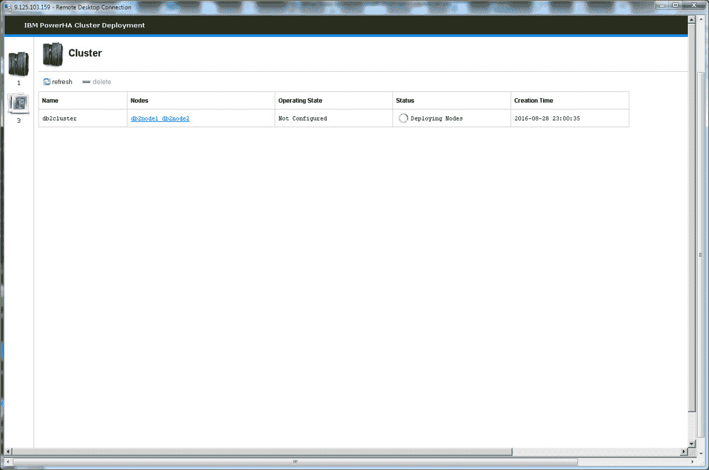
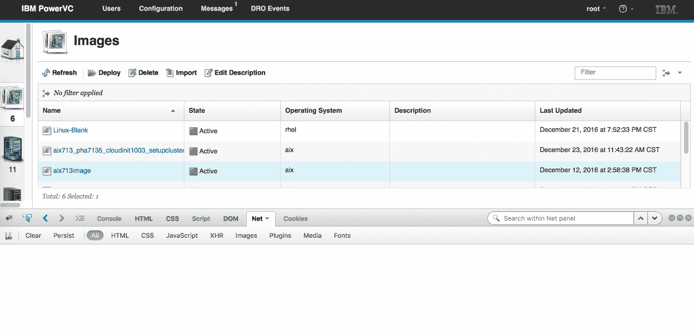
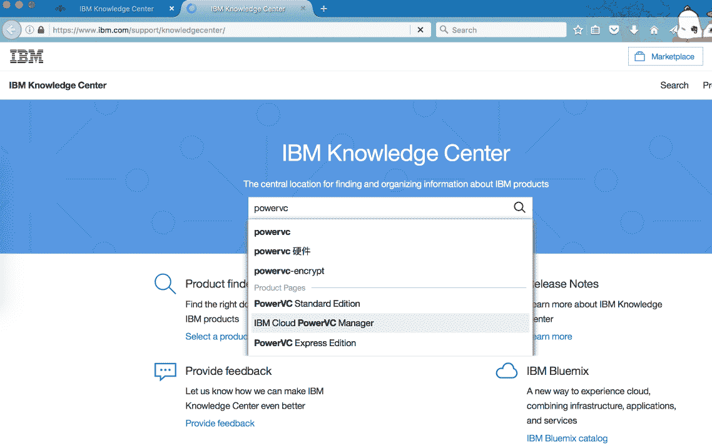
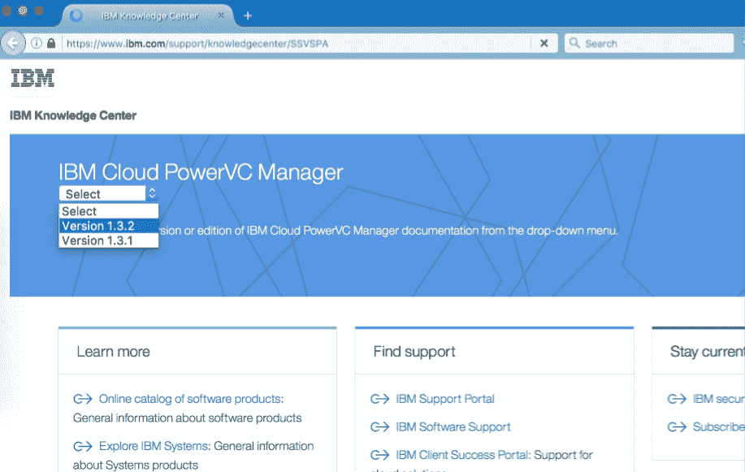
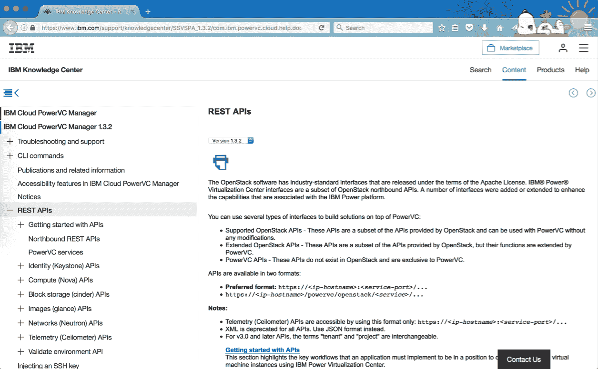
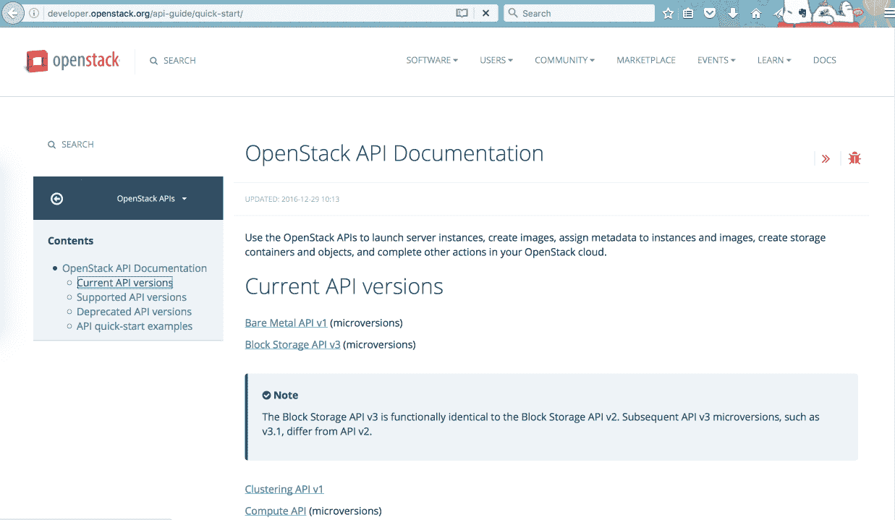
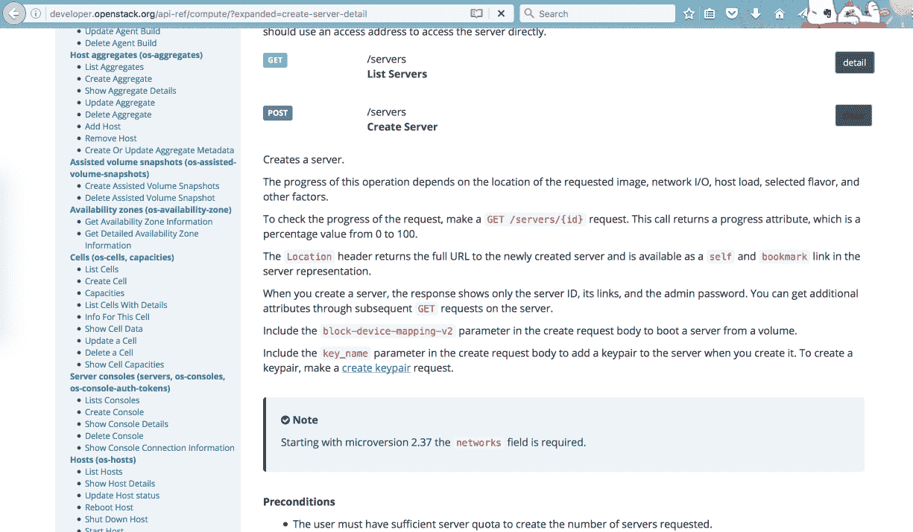

# PowerVC 相关技术简介 PowerVC API 的调用

> 原文：[`developer.ibm.com/zh/articles/cl-cn-powervc-power-resource-to-cloud/`](https://developer.ibm.com/zh/articles/cl-cn-powervc-power-resource-to-cloud/)

## 简介

用户在构建自己的私有云的时候，都会面临着如何把不同架构的资源池整合到云平台的问题。本文通过介绍 IBM 在 Power 平台上的 OpenStack 解决方案 — PowerVC，PowerVC 的 REST api，以及管理维护方法等，给 Power 用户提供了一种把 Power 资源整合进已有云平台的思路与方法。文中还以一个实际例子（包括代码）来展示如何整合。

## PowerVC 相关技术简介

PowerVC (Power Virtualization Center ) 是一个基于 OpenStack 项目的 IaaS 云解决方案，PowerVC 旨在简化 Power Systems 环境中虚拟资源的管理, 它包括了 GUI 管理界面与 RESTful HTTP 服务。本文主要介绍了 PowerVC 常用的 REST API，使您了解怎样通过 Web 服务管理 Power 服务器虚拟化资源。

### OpenStack 简介

OpenStack 是一个由 NASA（美国国家航空航天局）和 Rackspace 合作研发并发起的，以 Apache 许可证授权的自由软件和开放源代码项目，它是一个开源的云计算管理平台项目，由几个主要的组件组合起来完成具体工作。OpenStack 支持几乎所有类型的云环境，项目目标是提供实施简单、可大规模扩展、丰富、标准统一的云计算管理平台。OpenStack 通过各种互补的服务提供了基础设施即服务（IaaS）的解决方案，每个服务提供 API 以进行集成。

OpenStack 的核心组件包括计算(Compute)、对象存储(Object Storage)、认证(Identity)、用户界面(Dashboard)、块存储(Block Storage)、网络(Network)和镜像服务(Image Service)等，每个组件都是多个服务的集合。

### PowerVC 简介

IBM PowerVC (Power Virtualization Center) 是基于 OpenStack 技术的高级虚拟化和 IaaS 管理平台，是一个 IaaS 云解决方案，它构建于 OpenStack 项目技术之上，旨在简化 Power Systems 环境中的虚拟资源的管理。我们可以借助 PowerVC 管理物理主机、存储器和网络资源，并使用它们来创建虚拟环境，管理这些资源之后，我们可以执行下列操作：

*   通过部署映像来创建虚拟机，然后调整大小，并将卷附加给虚拟机。
*   管理现有的虚拟机和卷，以便它们可由 PowerVC 来统一管理。
*   使用 IBM PowerVC 动态资源优化器 (DRO) 能够自动重新均衡主机组资源。
*   当虚拟机正在运行时，迁移这些虚拟机到其它物理主机（动态分区迁移）。
*   将虚拟机捕获为映像，然后将该映像部署到其他位置。
*   根据相应策略，PowerVC 可以将虚拟机部署或迁移到指定物理机。

IBM PowerVC 支持较大型的企业和复杂的系统配置，通过 Web 界面来最大限度地利用 Power Systems 硬件的虚拟化功能，主要包括：

*   支持由硬件管理控制台管理的 IBM Power 主机。
*   支持存储区域网络（SAN）。
*   支持每个主机上具有多个 Virtual I/O Server 虚拟机。
*   支持共享存储池（SSP）。
*   支存储器模板，使我们能够指定存储卷的属性，例如，自动精简配置和压缩，以便我们在环境中部署一致的虚拟机。
*   支持存储器连接组，可以帮助我们来部署特定存储连接方式的虚拟机，比如 VSCSI 或者 NPIV。
*   支持并置规则，通过它来实现将所选择的虚拟机始终保留在同一主机上（亲缘关系），或者从不放置在同一主机（反亲缘关系）上。
*   支持计算模板，通过计算模板来部署特定数目处理器、内存、虚拟处理器的虚拟机。
*   支持光纤通道端口，这些端口与存储器连接组一起用来指定 PowerVC 是否应该使用该端口进行连接以及该端口的连接类型，如： NPIV、只能使用 vSCSI 或者同时使用这两种连接类型。

### REST API 简介

REST 的全拼是（REpresentational State Transfer，表述性状态转移）。REST 指的是一组架构约束条件和原则，满足这些约束条件和原则的应用程序设计就是 RESTful。它利用传统 Web 特点，提出一个既适于客户端应用又适于服务端的应用的、统一架构，极大程度上统一及简化了网站架构设计。目前在三种主流的 Web 服务实现方案中，REST 模式服务相比复杂的 SOAP 和 XML-RPC 对比来讲，更加简洁，越来越多的 Web 服务开始使用 REST 设计并实现。

REST API 的主要原则有：

*   用 URL 表示资源。资源就像商业实体一样，是我们希望作为 API 实体呈现的一部分。通常是一个名词，每个资源都用一个独一无二的 URL 来表示；
*   用 HTTP 方法表示操作。REST 充分利用了 HTTP 的方法，特别是 GET、POST、PUT 和 DELETE。

也就是说，客户端的任何请求都包含一个 URL 和一个 HTTP 方法。

REST 是一种程序设计的风格，为我们整理自己的应用设计提供了一个原则，在利用这些原则带来的便利的同时，可以根据实际情况进行灵活的处理。 OpenStack 软件具有行业标准的接口，IBM PowerVC 接口是 OpenStack API 的子集, 但增加并扩展增强了一些与 IBM Power 平台相关的接口。

## PowerVC API 的调用

本章节将展示利用一个可执行的 Python 程序通过调用 PowerVC API 在 IBM Power 服务器上部署虚拟机。这个简单的例子将有助于读者快速掌握怎样利用 Python 程序去使用 PowerVC 。

PowerVC API 有两种格式:

*   https://<ip-hostname>:<service-port>/… (常用格式)</service-port></ip-hostname>
*   https://<ip-hostname>/powervc/openstack/<service>/…</service></ip-hostname>

示例与 OpenStack 一样采用 Python 编写，使用了上述第二种 API 格式，下表中包括了本文将要介绍的 API。

##### 表 1\. 本文介绍的 API

| PowerVC API | Request/Resource |
| --- | --- |
| identity | 认证得到 token 和 service catalog |
| image, flavor, network | 列出可用资源 |
| compute | 虚拟机部署 |
| volume, compute | 虚拟机部署的同时附加磁盘 |
| compute | 得到虚拟机详细信息 |

我们的程序开始时导入所需的 Python 模块：

##### 清单 1\. 程序开头需要导入的 Python 模块

```
|--------10--------20--------30--------40--------50--------60--------70--------80--------|
import requests
import json
from time import sleep 
```

Python 的 requests 模块是用来提交 HTTP requests 和接收 HTTP response。

### 获得 OpenStack 身份认证

如果程序想访问 PowerVC 服务，第一步需要取得以下两段信息:

1.  authentication token

    当发送 API requests 时 token 包含在 ‘X-Auth-token’ HTTP 头部。

2.  service catalogue

    Service catalogue 包括了 endpoint 地址，即 PoweVC 服务的 URL.

一个完整的 REST API 请求包括两部分：:

1.  service URL

    service URL 是 service catalogue 其中一个服务的基本 URL.

2.  resource URI(uniform resource identifier，统一资源标识符)

    API 请求资源的 URI.

    例如, 一个获得 API request authentication token 和 service catalogue 的完整路径是:

    https://<powervc ip="ip">/powervc/openstack/identity/v3/auth/tokens</powervc>

    其中 https://<powervc ip="ip">/powervc/openstack/identity/v3 是身份认证服务的基本 URL。/auth/tokens 是 token 和 catalogue 的 resource URI 。</powervc>

本例中, 我们将 API 的信息保存在以下全局变量中

1.  token

    保存着身份认证服务返回的 authentication token

2.  api_prefix

    Python 字典用于保存着身份认证服务所返回的 service catalogue 中的服务基本 URL。

3.  URI

    Python 字典用于硬编码所有本例用到的资源 URI，URI 是从 PowerVC/OpenStack API 文档中获得的。

##### 清单 2\. 初始化全局变量

```
|--------10--------20--------30--------40--------50--------60--------70--------80--------|
token=""
api_prefix={}
# Hardcode resource URIs in here
uri={'identity':'/auth/tokens', \
     'server':'/servers',               \
     'server_detail':'/servers/detail', \
     'flavor':'/flavors',               \
     'flavor_detail':'/flavors/detail', \
     'network':'/v2.0/networks',        \
     'network_detail':'/v2.0/networks', \
     'image':'/v2/images',              \
     'image_detail':'/v2/images/detail',\
     'volume':'/volumes',               \
     'volume_detail':'/volumes/detail', \
     'storage_template':'/types'
} 
```

init_token_catalog()函数用于对全局变量 ‘token’ 和 ‘api-prefix’的认证和初始化。我们在 PowerVC 服务器上运行此程序 ，所以使用 ‘local_host’ 作为 PowerVC IP.如需要显示 API call 的 request 或 response, 可去掉相应 print 声明的注释符。

##### 清单 3\. 获取 token [（下载代码清单）](https://www.ibm.com/developerworks/cn/cloud/library/cl-cn-powervc-power-resource-to-cloud/code.doc)

### 为部署虚拟机选择资源

如果想通过 REST API 请求部署一个虚拟机, 至少要指定以下参数值

1.  虚拟机的名字

2.  部署所使用的镜像(image)

3.  计算模板（flavor）

4.  虚拟机所连的网络

这些参数将在 HTTP 请求的 body 中指定。

list_images() 函数可以用来列出所有可用镜像.

##### 清单 4\. list_images() 函数, 列出所有可用镜像 [（下载代码清单）](https://www.ibm.com/developerworks/cn/cloud/library/cl-cn-powervc-power-resource-to-cloud/code.doc)

##### 清单 5\. get_selection()函数用于让用户从列表中选择可用值

```
|--------10--------20--------30--------40--------50--------60--------70--------80--------|
def get_selection(list):
    while True:
        string=raw_input()
        try:
            selection=int(string)
            if selection <= len(list):
                break
            else:
                print 'Invalid selection, please retry'
        except ValueError:
            print 'Enter a number.'
    return list[selection-1] 
```

调用以上两个函数就可以选择镜像了。

##### 清单 6\. 选择镜像

```
|--------10--------20--------30--------40--------50--------60--------70--------80--------|
print("Select image for VM deploymnent:")
(images,image2id)=list_images()
image=get_selection(images)
print('Image selected: %s %s' % (image,image2id[image])) 
```

我们将 list_images()函数稍做修改后便可用来列出其它资源，如网络，计算模板等。这里我们定义一个新函数 list_resource(),然后调用 list_resource()函数让用户去选择网络和计算模板。

##### 清单 7\. 选择网络和计算模板 [（下载代码清单）](https://www.ibm.com/developerworks/cn/cloud/library/cl-cn-powervc-power-resource-to-cloud/code.doc)

### 使用 API Request 来部署虚拟机

选择好镜像，网络和计算模板之后，我们就可以开始部署虚拟机, 这里我们定义一个新函数 deploy_server_with_minmal_parameters()函数去构建 API 请求然后提交给 PowerVC:

##### 清单 8\. 部署虚拟机函数 [（下载代码清单）](https://www.ibm.com/developerworks/cn/cloud/library/cl-cn-powervc-power-resource-to-cloud/code.doc)

通过调用上述函数，我们使用 id 为 image_id 的镜像部署一个叫 vm1 的虚拟机，虚拟机使用的计算模板 id 为 flavor_id,网络 id 为 network_id。

##### 清单 9\. 调用函数，创建虚拟机

```
|--------10--------20--------30--------40--------50--------60--------70--------80--------|
deploy_server_with_minimal_parameters(image2id[image],flavor2id[flavor],network2id[network],'vm1') 
```

至此我们已经介绍了通过调用 PowerVC API 来部署虚拟机的基本步骤，接下来我们将介绍在虚拟机部署中使用更多参数，如部署一个带附加存储卷的虚拟机。

### 创建一个 volume 并附加到准备部署的虚拟机

在开发创建 volume 代码之前，我们来看下 PowerVC 中关于 volume 的一些概念:

1.  存储提供者（Storage Provider）是用来提供 volume 的存储。

2.  存储器模板（Storage Template ）用来定义所创建 volume 的属性，如 thin provisioning , compression, 我们可以给一个存储提供者建多个存储器模板。

3.  在 PowerVC 中添加一个存储提供者之后，系统将创建一个默认的存储器模板。

如果想创建 volume，我们需指定所使用的存储器模板。

可以使用 list_resource() 函数显示可用的存储器模板。

##### 清单 10\. 列出存储器模版

```
|--------10--------20--------30--------40--------50--------60--------70--------80--------|
print("Select Storage Template for additional volume:")
(storage_templates,storage_template2id)=list_resource('volume','storage_template')
storage_template=get_selection(storage_templates)
print('Storage Template selected: %s %s' % (storage_template,storage_template2id[storage_template])) 
```

然后调用 create_a_volume()函数，使用上述相应存储器模板创建 volume. create_a_volume()函数向 PowerVC 存储服务（cinder）提交请求，服务将会返回一个 volume UUID 作为虚拟机部署 API 请求的参数，并在部署时将此 volume 附加到虚拟机。

##### 清单 11\. 创建存储卷 [（下载代码清单）](https://www.ibm.com/developerworks/cn/cloud/library/cl-cn-powervc-power-resource-to-cloud/code.doc)

现在我们定义一个新的虚拟机部署函数 deploy_server(), 相比 deploy_server_with_minimal_parameters() 函数，用户可以指定更多参数。

##### 清单 12\. 支持更多功能的部署虚拟机函数 [（下载代码清单）](https://www.ibm.com/developerworks/cn/cloud/library/cl-cn-powervc-power-resource-to-cloud/code.doc)

为了将之前建的 volume 附加给虚拟机,在虚拟机部署的 API 请求中定义了以下 volume 参数:

```
parameters['block_device_mapping_v2']=[{"boot_index":None,
"delete_on_termination":False,
"destination_type":"volume",
"source_type":"volume",
"uuid":volume_id}] 
```

*   boot_index 值为 None 含义是此 volume 不是引导盘.
*   destination_type 和 source_type 的值为 volume 含义是此 volume 非本地磁盘，当虚拟机被删除后，此 volume 不会被删除 。
*   Volume_id 值 为之前创建的 volume UUID 。

另外在 deploy_server() 函数里,我们并没有通过 flavorRef 参数指定 VM 的计算模板 , 而是通过调用 get_resource_details() 和 get_flavor_extra_specs() 来指定计算模板参数。

get_resource_details() 函数是用来从特定的 PowerVC 服务中请求资源的详细信息。

这是一个广义函数，可以用来获得各种资源的详细信息。这里，我们用它来得到 flavor_id 所指定 flavor 的所有属性。

##### 清单 13\. get_resource_details() 函数

```
|--------10--------20--------30--------40--------50--------60--------70--------80--------|
def get_resource_details(service,resource,resource_id):
    # To get the details of a specific server
    headers={"X-Auth-Token": token}
    # API URL for a service + URI for listing server + id of a specific server
    api=api_prefix[service]+uri[resource]+'/'+resource_id
    print("   API URL for list %s details command:\n      %s" % (resource,api))
    response=requests.get( api, headers=headers, verify=False)
    json_data=response.json()
    #print "server details:",json.dumps(json_data, indent=4, separators=(',', ': '))
return json_data

flavor=get_resource_details('compute','flavor',flavor_id) 
```

get_flavor_extra_specs()函数是用来得到其它 PowerVC 支持的 flavor 参数

本例中我们没有改变任何 flavor 属性。这段代码只是展示其它部署虚拟机时可供选择的指定 flavor 的方法（如使用 flavorRef），如果需要的话也可以使用户在部署虚拟机时改变一些 flavor 属性。关于详细的虚拟机部署参数，请参考 [`developer.openstack.org/api-ref/compute/?expanded=create-server-detail`](http://developer.openstack.org/api-ref/compute/?expanded=create-server-detail)

##### 清单 14\. 获取 PowerVC 支持的 flavor 参数

```
|--------10--------20--------30--------40--------50--------60--------70--------80--------|
def get_flavor_extra_specs(flavor_id):
    api=api_prefix['compute']+uri['flavor']+'/'+flavor_id+'/os-extra_specs'
    headers={"X-Auth-Token": token}
    response=requests.get(api, headers=headers, verify=False)
    json_data=response.json()
    print "flavor extra specs:",json.dumps(json_data, indent=4, separators=(',', ': '))
    return json_data 
```

以下的函数调用将会部署一个名字叫 vm2，使用 image_id 对应的镜像，使用 flavor_id 对应的计算模板，连接到 network_id 对应的网络的虚拟机，并且附加了一个 volume 标识符为 volume_id 的 volume.

##### 清单 15\. 创建虚拟机，并附加一个存储卷

```
|--------10--------20--------30--------40--------50--------60--------70--------80--------|
server_id=deploy_server(image2id[image],flavor2id[flavor],network2id[network], volume_id, 'vm2') 
```

### 查看虚拟机部署状态与健康状况

向 PowerVC 提交完虚拟机部署请求之后，我们就可以从 PowerVC compute 服务查看虚拟机部署状态与健康状况了，这里我们定义 loop2chk_server_status()函数循环调用在 1.4 章节定义的 get_resource_details()函数去检查正在部署的虚拟机状态与健康状况。

##### 清单 16\. 持续监控虚拟机状态 [（下载代码清单）](https://www.ibm.com/developerworks/cn/cloud/library/cl-cn-powervc-power-resource-to-cloud/code.doc)

### 示例程序的输出

把 1.1 到 1.5 的代码放到一起就可以得到一个可执行的程序，以下是程序运行的输出：

##### 清单 17\. 示例程序的输出结果 [（下载代码清单）](https://www.ibm.com/developerworks/cn/cloud/library/cl-cn-powervc-power-resource-to-cloud/code.doc)

### 通过 PowerVC 自动在 Power 服务器上部署虚拟机并定制化

我们已经开发了一套可以通过 PowerVC 在 Power 服务器上一键式虚拟机和 PowerHA 集群部署的工具，此工具包括以下部分:

1.  工具中的 Python deploycli 命令包括了一些可以运行在 PowerVC 上的模块，可以实现根据用户提供的配置文件自动在 Power 服务器上部署虚拟机，同时也支持通过 PowerVC 自动部署出 PowerHA7 集群。

2.  运行在 PowerVC 服务器上的 Python Web 程序 deploy.py 用来自动部署 PowerHA cluster.

3.  setupcluster 是一个 AIX ksh93 脚本，运行在 PowerHA cluster 中的一个节点（物理或虚拟）上，用来自动配置 PowerHA7 cluster。

接下来我们展示一下工作的运行过程，如果想了解工具的详细内容请参考些工具的文档。

#### Deploycli 命令

以下是一个通过 deploycli 部署两台虚拟机的示例配置文件:

##### 清单 18\. deploycli 部署两台虚拟机的示例配置文件

```
|--------10--------20--------30--------40--------50--------60--------70--------80--------|
flavor_name=powervm.small|vm_name=testvm3|image_name=PowerHA713|vlan_name=cmbnet1|lun_spec=1:3:xiv90 base template:wzq::Non shared data for testvm3|host_name=|host_group=|storage_connectivity_group=
flavor_name=powervm.small|vm_name=testvm4|image_name=PowerHA713|vlan_name=cmbnet1|lun_spec=1:2:xiv90 base template:wzq:shared:Shared data for testvm4|host_name=|host_group=|storage_connectivity_group= 
```

我们只需执行 deploycli –n 就可以部署这两台虚拟机了，以下是部署过程的输出：

##### 清单 19\. 部署两台虚拟机的结果输出 [（下载代码清单）](https://www.ibm.com/developerworks/cn/cloud/library/cl-cn-powervc-power-resource-to-cloud/code.doc)

此命令给用户一个命令介面去部署虚拟机和支持批量部署,也可以作为一个接合云应用和 PowerVC 部署 Power System 虚拟机功能的简单方法。

##### 部署 PowerHA7 cluster 的 Web 工具

用户仅需在本程序页面输入所有 PowerHA cluster 相关的参数，便可实现全自动的 PowerHA7 集群部署。

图 1\. 自动部署 PowerHA 的 Web 工具界面


本程序支持 PowerHA 集群上的应用部署。如果指定了 Deployment Command 那么应用程序初始化配置也会被部署进去。在上面的例子中，程序将会部署 DB2 数据库的 PowerHA cluster.从云计算解决方案的角度讲，这个程序对于系统管理员来说可以看作是”High Availability As a Service”。

填完工具 Web 页面上相应的参数，再点击 deploy 按钮 ，页面就会显示 开始部署，在状态列将会显示 cluster 的部署进度。

图 2\. 自动部署 PowerHA 的 Web 工具界面



Cluster 部署成功后，运行状态和状况会分别显示 Active 和 Normal,点击 Node 列的链接会显示一个 cluster 状态的图形界面。

图 3\. PowerHA 部署完成后查看状态


上图显示的是一套准备好用于生产的 PowerHA7 集群.

### 实例的程序代码

##### 清单 20\. 实例的程序代码 [（下载代码清单）](https://www.ibm.com/developerworks/cn/cloud/library/cl-cn-powervc-power-resource-to-cloud/code.doc)

## PowerVC 维护与错误排故步骤

### PowerVC 常用维护命令:

#### 1\. powervc-services

##### 清单 21\. Powervc-services 命令帮忙

```
|--------10--------20--------30--------40--------50--------60--------70--------80--------|
# /opt/ibm/powervc/bin/powervc-services  -h
usage: powervc-services [-h] [services_subset] operation

The powervc-services command is used to control the lifecycle of the PowerVC
services.

positional arguments:
  services_subset  The subset of services to control if specified, otherwise
                   all will be. The valid values are: db, httpd, rabbitmq,
                   glance, cinder, ego, neutron, nova, ceilometer, health,
                   bumblebee, validator, swift
  operation        The operation to take on the services. Valid values are
                   start|stop|restart|status #!/usr/bin/env python
import requests
import json
from time import sleep 
```

举例：

/opt/ibm/powervc/bin/powervc-services nova restart

重启 nova service

#### 2\. powervc-backup

##### 清单 22\. Powervc-backup 命令帮忙

```
|--------10--------20--------30--------40--------50--------60--------70--------80--------|
# /opt/ibm/powervc/bin/powervc-backup -h
usage: powervc-backup [-h] [--noprompt] [--targetdir LOCATION]

The powervc-backup command is used to save off the PowerVC data to an archive
.tgz file so that it can be used at a later point to recover to the saved
state.

optional arguments:
  -h, --help            show this help message and exit
  --noprompt            If specified, no user intervention is required during
                        execution of the backup process.
  --targetdir LOCATION  Target location in which to save the backup archive.
                        Default value is /var/opt/ibm/powervc/backups. 
```

#### 3\. powervc-restore

##### 清单 23\. Powervc-restore 命令帮忙

```
|--------10--------20--------30--------40--------50--------60--------70--------80--------|
# /opt/ibm/powervc/bin/powervc-restore -h
usage: powervc-restore [-h] [--noprompt] [--targetdir LOCATION]

The powervc-restore command is used to restore PowerVC data from an archive
.tgz file to recover PowerVC to an earlier saved state.

optional arguments:
  -h, --help            show this help message and exit
  --noprompt            If specified, no user intervention is required during
                        execution of the restore process.
  --targetdir LOCATION  Target location where the backup archive is located.
                        Default value is /var/opt/ibm/powervc/backups/<most
                        recent>. 
```

注意：如果 powervc-restore 不指定目录，会自动恢复最新时间的备份，要确认这个版本就是你要恢复的备份。

### PowerVC 日志文件

PowerVC 是基于 OpenStack 开发的，日志结构完全遵循 OpenStack 的结构。相关模块的日志存放在/var/log 下以模块命名的目录里，包括 nova, cinder, glance, keystone, neutron, ceilomerter, 此外还有 PowerVC 独有的 bumblebee 与 ttv-validation，等。

其中 nova 与 cinder 日志会在日常维护活动常会用到。如果 PowerVC 通过 HMC 来管理 Power 服务器，每台服务器都会有一个 nova-compute 日志文件在 /var/log/nova 目录里，文件命令里面包含服务器的序列号用于区分。如果在某台服务器上的部署失败，首先要查看对应服务器的 nova-compute 日志文件。如果 PowerVC 是通过 Novalink 来管理 Power 服务器，nova-compute 日志文件会记录在影响的 Novalink 分区里面的对应目录下。没有对应的服务器的相关日志，会记录在 nova-api.log 文件里面。

对每台 PowerVC 管理的存储，/var/log/cinder 目录下会有一个 volume+控制器 IP 的命令的日志文件，如果是卷相关操作失败，首先查看对应存储的日志文件。没有对应存储的操作日志，会记录在 api.log 文件里面。

### PowerVC 配置文件

与 OpenStack 结构相同，PowerVC 的配置文件存放在/etc/目录下， 按模块命令分目录存放。常会定制有 nova 和 cinder 的配置文件。

在/etc/nova 目录下，nova.conf 是模版文件，新添加的 Power 服务器，其 nova 配置文件会基于这个文件创建，生成对应的 nova 配置文件，名字中包含该 Power 服务器的序列号。PowerVC 启动的时候，会读取每个服务器的配置文件，来决定对该服务器的一些操作规则，所以要更新 nova 配置文件，要注意修改 nova.conf 以及相关 Power 服务器对应的 nova 配置文件。

在/etc/cinder 目录下，类似的结构，cinder.conf 是配置模版，每台管理的存储都会有一个 cinder+控制器 IP 的配置文件，此外，fabrics.conf 是 SAN 网络的配置文件。

### PowerVC 常用定制化

#### 虚拟机的命名规则定制化

缺省配置的 PowerVC，HMC 上虚机的命令是虚机命令+8 位 UUID+8 位序号，可读性比较差，最好定制一下命令规则，如下所示，更改为追加为两位的 UUID。注意修改完成要重启 nova 的 service。

##### 清单 24\. 定制虚拟机的命令规则

```
|--------10--------20--------30--------40--------50--------60--------70--------80--------|
# openstack-config --set /etc/nova/nova-<MTM-SN>.conf DEFAULT instance_name_template "%(display_name)s-%(uuid).2s" 
```

#### OpenStack 命令的使用

从 PowerVC 1.3.1 版本起，PowerVC 能够支持部分 OpenStack 的原生命令（老的版本官方不支持 OpenStack 原生命令）。使用方法如下：

修改/opt/ibm/powervc/powervcrc，OS_USERNAME 和 OS_PASSWORD 更新为 PowerVC 的 admin 权限用户，例如是 root。

```
# source /opt/ibm/powervc/powervcrc 使环境变量生效。 
```

下面是几个比较有用的用法：

```
# glance image-update --name <newname> <oldname> 
```

给镜像重新命令

```
# nova rename <VMNAME> <VMNewName> 
```

重新命令虚机的名字，这个不会影响虚机在 HMC 上的名字。

```
# cinder —service-type=volume reset-state <id> 
```

重置卷的状态，这个在存储卷状态不正常，而不能做删除等操作的使用，可以强行置为正常状态。

### PowerVC OpenStack API 查找

PowerVC 的 REST API 可以通过下面几个途径来查找。

1.  通过 PowerVC GUI 查看调用的 API。

为了方便，需要 Firefox 浏览器，并安装 Firebug 插件。当然也可以使用 Firefox developer tool。下面以 Firebug 为例。

首先要激活 Firebug，并开启 Net 页面，在执行动作之前，点击 Clear，清理掉页面内容。

图 4\. 打开 Firebug 界面



然后执行要查找的 API 的动作，例如我们创建一个虚机。执行后，即可在 Net 页面上查看发出的具体的 REST API 调用，包括具体的参数。

图 5\. 在 Firebug 里面查看 REST API


1.  PowerVC 的 Knowledge Center 上列着 PowerVC 支持的所有 REST API。

先进入 IBM Knowledge Center 网站：

[`www.ibm.com/support/knowledgecenter/`](https://www.ibm.com/support/knowledgecenter/)

在搜索框里输入 powervc ，点击你要使用的 PowerVC 产品名称。

图 6\. 在 IBM Knowledge Center 里面查看 PowerVC



选择版本：

图 7\. 选择 PowerVC 版本



从左侧栏里，即可找到 REST APIs 的页面。如下所示：

图 8\. 查看 PowerVC REST APIs



1.  通过 OpenStack 文档

PowerVC 是基于 OpenStack 构建的，REST API 也遵从相应版本的 OpenStack 的 API，所以要先知道你所用的 PowerVC 对应的 OpenStack 版本。如下图所示：

表 2\. PowerVC 与 OpenStack 版本对应

| IBM PowerVC release | OpenStack edition |
| --- | --- |
| V1.3.0 | Liberty |
| V1.3.1 | Mitaka |
| V1.3.2 | Newton |

然后到 OpenStack 网站上查看相应的 REST API。

访问 [`docs.openstack.org/`](http://docs.openstack.org/) 网站，找到需要查看的 OpenStack 版本，点击 API Guide 链接，即可查看每个模块的 API 调用。注意：PowerVC 并不包含 OpenStack 的所有模块。

图 9\. 查看 OpenStack REST API 文档



下面是查看的部署虚机的 OpenStack REST API。

图 10\. 部署虚机的 OpenStack REST API



### 开发中几个错误码 troubleshooting 举例

开发过程中，会遇到各种错误返回码，下面通过几个实际的例子，来告诉大家这类错误的一般 troubleshooting 的思路。

1) 返回码 400

下面一段代码，用来创建一个数据卷。在我们的实验环境中运行时报下面的错误。

##### 清单 25\. 创建数据卷返回 404

```
|--------10--------20--------30--------40--------50--------60--------70--------80--------|
# cat rc400test
#!/usr/bin/env python
from powervc import *
init_token_catalog('root',get_root_password())
# template mis-typed as temp1ate
create_a_volume('svc82 base temp1ate','rc400testvol','Test volume',1,None,False)

# ./rc400test
2017-01-03 09:50:49,959 powervc         DEBUG    Create volume<rc400testvol> of size 1G...
2017-01-03 09:50:50,161 powervc         DEBUG    Response code of create_a_volume <rc400testvol>...404 
```

首先这是创建卷的一个调用，所以相关详细信息会记录在 cinder 的日志里面。我们重复运行这个程序，监控我们要使用的存储设备日志。

```
# tail -f volume-<storageIP>.log 
```

发现没有错误输出。

然后再次运行程序，这次监控 cinder/api.log

##### 清单 26\. 查看 nova 的 api.log

```
|--------10--------20--------30--------40--------50--------60--------70--------80--------|
# tail -f api.log
......
http://localhost:9000/v2/252fb50848ef4636bfdbe7d0a259c249/volumes returned with HTTP 404
2017-01-03 09:44:06.630 3816 INFO eventlet.wsgi.server [req-560d2ee8-b650-4301-9bd5-6cf65234b138 0688b01e6439ca32d698d20789d52169126fb41fb1a4ddafcebb97d854e836c9 252fb50848ef4636bfdbe7d0a259c249 - - -] 172.16.25.23,127.0.0.1 - - [03/Jan/2017 09:44:06] "POST /v2/252fb50848ef4636bfdbe7d0a259c249/volumes HTTP/1.1" 404 398 0.130824 
```

这次我们看到了错误返回码 404，对应着我们的调用。为了更加明确，我们用这次调用的 Request ID （每条日志的方括号里面都有一个 Request ID，同一个调用，这个 ID 不变）来过滤一下日志输出。

##### 清单 27\. 用 Request ID 过滤 api.log

```
|--------10--------20--------30--------40--------50--------60--------70--------80--------|
# grep req-560d2ee8-b650-4301-9bd5-6cf65234b138 api.log
2017-01-03 09:44:06.608 3816 INFO cinder.api.openstack.wsgi [req-560d2ee8-b650-4301-9bd5-6cf65234b138 0688b01e6439ca32d698d20789d52169126fb41fb1a4ddafcebb97d854e836c9 252fb50848ef4636bfdbe7d0a259c249 - - -] POST http://localhost:9000/v2/252fb50848ef4636bfdbe7d0a259c249/volumes
2017-01-03 09:44:06.628 3816 INFO cinder.api.openstack.wsgi [req-560d2ee8-b650-4301-9bd5-6cf65234b138 0688b01e6439ca32d698d20789d52169126fb41fb1a4ddafcebb97d854e836c9 252fb50848ef4636bfdbe7d0a259c249 - - -] HTTP exception thrown: CN-55180EC Volume type with name svc82 base temp1ate could not be found.
2017-01-03 09:44:06.629 3816 INFO cinder.api.openstack.wsgi [req-560d2ee8-b650-4301-9bd5-6cf65234b138 0688b01e6439ca32d698d20789d52169126fb41fb1a4ddafcebb97d854e836c9 252fb50848ef4636bfdbe7d0a259c249 - - -] http://localhost:9000/v2/252fb50848ef4636bfdbe7d0a259c249/volumes returned with HTTP 404
2017-01-03 09:44:06.630 3816 INFO eventlet.wsgi.server [req-560d2ee8-b650-4301-9bd5-6cf65234b138 0688b01e6439ca32d698d20789d52169126fb41fb1a4ddafcebb97d854e836c9 252fb50848ef4636bfdbe7d0a259c249 - - -] 172.16.25.23,127.0.0.1 - - [03/Jan/2017 09:44:06] "POST /v2/252fb50848ef4636bfdbe7d0a259c249/volumes HTTP/1.1" 404 398 0.130824 
```

从这个输出中就明确的看出来调用错误的原因：

HTTP exception thrown: CN-55180EC Volume type with name svc82 base temp1ate could not be found.

是因为手误的原因，Volume type 写错了。改正之后，运行正常。

2) 部署虚机，返回码 202 正常，但虚机部署失败

下面这段代码，用来创建一个虚机。

##### 清单 28\. 返回 200 返回码的代码清单 [（下载代码清单）](https://www.ibm.com/developerworks/cn/cloud/library/cl-cn-powervc-power-resource-to-cloud/code.doc)

在我们实验环境中执行该代码，正常返回码 202，但后面的虚机部署失败。

##### 清单 29\. 创建虚拟机返回 202

```
|--------10--------20--------30--------40--------50--------60--------70--------80--------|
# ./rc200test
Parameters: {
    "flavor": {
        "extra_specs": {
            "powervm:processor_compatibility": "default",
            "powervm:max_proc_units": "4",
            "powervm:srr_capability": "false",
            "powervm:storage_connectivity_group": "",
            "powervm:shared_weight": "128",
            "powervm:min_mem": "2048",
            "powervm:max_mem": "8192",
            "powervm:uncapped": "true",
            "powervm:proc_units": "2",
            "powervm:dedicated_proc": "false",
            "powervm:max_vcpu": "8",
            "powervm:availability_priority": "127",
            "powervm:shared_proc_pool_name": "DefaultPool",
            "powervm:min_proc_units": "1",
            "powervm:min_vcpu": "1",
            "powervm:ame_expansion_factor": "0"
        },
        "vcpus": 4,
        "disk": 0,
        "ram": 10240
    },
    "name": "vm4rc200test",
    "imageRef": "4ac9717c-089e-4e4a-b03e-b95e6bba8068",
    "networks": [
        {
            "uuid": "297a26c3-96a1-412d-a95e-64292d75a152"
        }
    ]
}
Response code of deploy_server(vm4rc200test) POST:202
ERROR: Server ID not available. 
```

部署虚机，首先要调用 nova 部分。我们在在 nova 日志目录下，在 nova-api.log 里面查找 202。

##### 清单 30\. 用错误码过滤日志 [（下载代码清单）](https://www.ibm.com/developerworks/cn/cloud/library/cl-cn-powervc-power-resource-to-cloud/code.doc)

从对应的报错日志中可以找到对应的 Reqest ID，用这个 ID 在 nova 日志中查找错误信息：（可能会有多个 202，要从执行时间和上下文来确定是你的那个调用。）

##### 清单 31\. 查找某个调用的错误信息 [（下载代码清单）](https://www.ibm.com/developerworks/cn/cloud/library/cl-cn-powervc-power-resource-to-cloud/code.doc)

从错误信息中看到，我们创建虚机的时候，把虚机的内存设置成了比虚机的 max memory 大，这是不符合 PowerVM 的要求的。修改掉这个地方，再次执行，成功结束。

从上面的两个例子可以看出，开发过程中遇到错误的时候，从下面 3 步来查找错误原因：

1) 确定错误信息是 nova 还是 cinder，（当然也可能是 neutron 等其他模块）

2) 到相应的日志目录下，通过错误码，或者其他线索找到 Request ID。

3) 用相应的 Request ID，在相应的日志文件里面找到上下文，确认具体的错误信息。

## 结束语

PowerVC 是 IBM Power 平台上基于 OpenStack 的云管平台，它提供了功能强大的 OpenStack REST API，用户可能方便的利用这些 REST API，把已有的 Power 资源池，整合到客户已有的资源管理平台上。