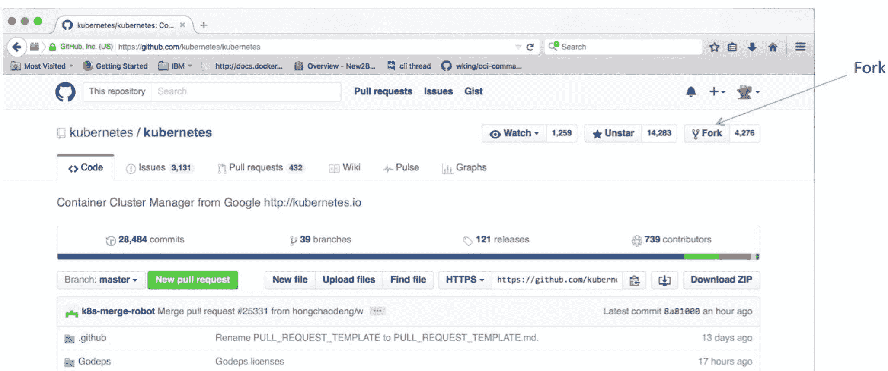
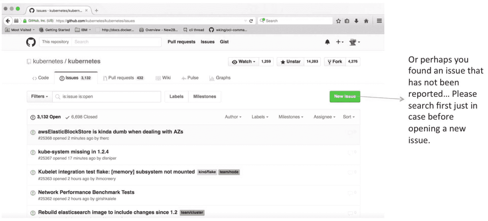

# Kubernetes 开发指南

> 原文：[`developer.ibm.com/zh/articles/os-kubernetes-developer-guide/`](https://developer.ibm.com/zh/articles/os-kubernetes-developer-guide/)

Kubernetes 是一组用 go 编写的应用程序。这些应用程序一起形成了管理容器的交互式平台。 [Kubernetes](https://github.com/kubernetes/kubernetes) 也是开源的，可在 GitHub 上获得。 Kubernetes 由 Google 捐赠给 Cloud Native Computing Foundation。Kubernetes 可在许多操作系统上运行。但是，对于本指南，我们将展示如何通过设置 Ubuntu 并在其上开发和测试 Kubernetes。

## 开发环境需求

基本的 Kubernetes 开发环境具有以下要求：

*   Linux 终端
*   ssh
*   golang
*   Docker
*   Git 和 GitHub 帐户
*   godep

如果您已使用自己喜欢的方式完成所有这些设置，那么可以跳到”分支和克隆”。

### 在虚拟机上设置主机操作系统

您需要做的第一件事就是安装 Ubuntu。Ubuntu 16.04 LTS 服务器或桌面版就足够用了。也可以使用 14.04、15.10 等版本，决定权在您手上。我在 Mac® 上的一个虚拟机 (VM) 中通过最新的 Virtual Box 运行 Ubuntu 16.04 LTS。在 Virtual Box 上设置 Ubuntu：

*   下载并安装 [Virtual Box](https://www.virtualbox.org/wiki/Downloads)
*   下载一个 [Ubuntu 16.04 ISO](http://www.ubuntu.com/) 文件（服务器/桌面版）
*   使用刚下载的 Ubuntu ISO 创建一个新 vbox。

### Virtual Box 设置（建议）

*   基础内存 4g
*   80g vdi 硬盘
*   共享剪贴板 – 仅双向（如果安装桌面版）
*   虚拟内存 128mb（如果安装桌面版）
*   网络：NAT
*   安装 Guest Additions（这个是必须的）

    VirtualBox VM -> Devices -> Insert Guest Additions CD Image…（如果安装桌面版）

*   端口转发


### 设置 Ubuntu

如果使用 Ubuntu 桌面版，请继续创建一个终端图标：

[创建一个终端图标](https://developer.ibm.com/developer/default/articles/os-kubernetes-developer-guide/images/image002.jpg)

然后运行软件更新程序：


从终端运行 apt-get update 命令：


## 开始使用 ssh

使用您的 pc/mac 客户端通过 ssh 连接到您的 Ubuntu 服务器/桌面版。如果安装了 Ubuntu 桌面版并希望运行 ssh：

```
$ sudo apt-get install openssh-server
$ sudo service ssh start or sudo /etc/init.d/ssh start
$ ssh -v localhost 
```

从客户端机器（使用密码）登录到 ssh 服务器：


在这个示例中，上面指定的路由处理程序将 127.0.0.1:2222 TCP/IP 包转发到在 VM 中运行的访客 ssh 服务器。访客 ssh 服务器在端口 22 上监听发往 IP 地址 10.0.2.15 的数据包。在其他设置中，您可能拥有不同的 IP 地址，也可能没有启用端口转发。例如，如果您的访客的 IP 地址为 192.168.120.129（通过命令 $ hostname -I 从终端返回），而且没有设置端口转发规则，那么可以通过下面的命令登录：

```
$ ssh mike@192.168.120.129 
```

### 配置 ssh

运行 e2e Kubernetes 测试需要配置无密码的 ssh（使用密钥而不是密码）。

首先从 Ubuntu 终端生成 Ubuntu 公钥和私钥： $ ssh-keygen -t rsa 使用默认位置并输入一个密码，或者仅单击 Enter $ ssh-copy-id mike@10.0.2.15。

然后在 Mac 终端中的您的 Mac 上，从 ~/.ssh 目录输入：

`$ ssh-keygen -b 1024 -t rsa -f id_rsa -P ""` 将您的 Mac 公钥（例如 cat ~/.ssh/id_rsa.pub）复制并粘贴到 Ubuntu 访客的 `/home/mike/.ssh/authorized_keys` 文件中。完成此操作的一种方法是，通过 ssh 连接到您的主机，并通过 nano 编辑 authorized_keys 文件。请在设置无密码 ssh 之前执行这一步。尝试在不支持剪切和粘贴的终端编辑器中输入公钥是无意义的。

接下来在 Ubuntu 终端上为您的 Ubuntu 访客配置无密码 ssh：

```
$ sudo nano /etc/ssh/sshd_config 
```

取消注释/配置：

```
PubkeyAuthentication yes
AuthorizedKeyFile %h/.ssh/authorized_keys
PasswordAuthentication no
PermitRootLogin without-password
$ sudo service ssh restart 或 sudo /etc/init.d/ssh restart 
```

测试它：

```
$ ssh mike@ubuntu (ubuntu = 主机名) 或 ssh 127.0.0.1 或 ssh 10.0.2.15... 
```

确保该连接有效，然后退出。

因为我们将通过无密码形式以 root 用户身份登录，所以让我们采取一种便捷方法，将用户公私钥和 authorized_keys 复制到 `/root/.ssh`，例如：

```
$ sudo cp ~/.ssh/authorized_keys /root/.ssh/authorized_keys（您可能需要执行 mkdir /root/.ssh）
$ sudo cp ~/.ssh/id_rsa /root/.ssh/id_rsa
$ sudo cp ~/.ssh/id_rsa.pub /root/.ssh/id_rsa.pub 
```

您现在应能从 Mac 终端上的用户帐户，以 root 用户或普通用户身份不使用密码通过 ssh 连接到访客 Ubuntu：

终端 1：ssh -p 2222 root@127.0.0.1 终端 2：ssh -p 2222 mike@127.0.0.1

您还应该能利用 Ubuntu 主机上的用户帐户或 root 用户帐户，通过 ssh 连接到 Ubuntu 主机上的用户帐户和 root 用户帐户：

```
$ ssh root@10.0.2.15
$ sudo ssh root@10.0.2.15 
```

### 安装 go

下载：[`golang.org/dl/`](https://golang.org/dl/)

```
$ sudo curl -O https://storage.googleapis.com/golang/go1.6.linux-amd64.tar.gz 
```

解压：

```
$ sudo tar -xvf go1.6.linux-amd64.tar.gz
$ sudo mv go /usr/local 
```

配置环境变量：

```
$ sudo nano ~/.profile 
```

添加以下行：

```
export GOPATH=/home/mike/go
export PATH=$PATH:/usr/local/go/bin:/home/mike/go/bin 
```

测试配置：

```
mike@mike-VirtualBox:~/go$ go version
go version go1.6.1 linux/amd64 
```

要利用用户个人资料以 root 用户身份来运行，可以编辑以下内容：

```
$ sudo su –
# source /home/mike/.profile 
```

测试您的配置：

```
root@mike-VirtualBox:~# go version
go version go1.6 linux/amd64 
```

### 安装 Docker

请访问：[`docs.docker.com/engine/installation/linux/ubuntulinux/`](https://docs.docker.com/engine/installation/linux/ubuntulinux/)

安装 Docker：

```
$ sudo apt-get update
$ sudo apt-get install apt-transport-https ca-certificates
$ sudo apt-key adv --keyserver hkp://p80.pool.sks-keyservers.net:80 --recv-keys 58118E89F3A912897C070ADBF76221572C52609D
$ sudo nano /etc/apt/sources.list.d/docker.list 
```

文件应包含以下内容（对于 14.04 版，它又被称为 trusty）：`deb https://apt.dockerproject.org/repo ubuntu-trusty main` 文件应包含以下内容（对于 16.04，它又被称为 xenial）：`deb https://apt.dockerproject.org/repo ubuntu-xenial main` 要安装 Docker 的 beta 版本，可使用 testing 代替 main。

```
$ sudo apt-get update
$ sudo apt-get install linux-image-extra-$(uname -r)
$ sudo apt-get install docker-engine 
```

要挑选一个特定的 Docker 版本：sudo apt-get install docker-engine=1.10.3-0~trusty

```
$ sudo service docker start 
```

测试您的 Docker 安装：

```
$ sudo docker run hello-world 
```

将您自己添加到 Docker 组中，该组以 sudo 身份运行：

```
$ sudo usermod -aG docker mike 
```

重新登录，再次测试您的 Docker 安装：

```
$ docker run hello-world 
```

### 安装 etcd

```
$ curl -L https://github.com/coreos/etcd/releases/download/v3.0.4/etcd-v3.0.4-linux-amd64.tar.gz -o etcd-v3.0.4-linux-amd64.tar.gz
$ tar xzvf etcd-v3.0.4-linux-amd64.tar.gz 
```

将 /home/mike/etcd-v3.0.4-linux-amd64 添加到您的 ~/.profile 路径中

在第一个终端中，运行：

```
$ etcd 
```

在第二个终端中，运行：

```
$ etcdctl set mykey "this is a test"
$ etcdctl get mykey 
```

## 建立分支

在 github 上为两个终端创建您的开发分支：

*   [`github.com/kubernetes/kubernetes`](https://github.com/kubernetes/kubernetes)
*   [`github.com/kubernetes/kubernetes.github.io`](https://github.com/kubernetes/kubernetes.github.io)



## 克隆您的分支

通常，当克隆 github.com 源代码存储库时，会使用路径 $GOPATH/src/（github 中的源代码的路径）。这是为了方便使用 go get type 命令获取 github 托管的数据包。但是，出于遗留的原因，Kubernetes 包被命名为 k8s.io/kubernetes，而不是您可能想到的 github.com/kubernetes/kubernetes。因此，要让所有开发工具正常工作并能在磁盘上找到您的数据包代码，需要将克隆版本放在 k8s.io 目录中。

使用以下步骤从您的名称/kubernetes 分支创建 k8s.io/kubernetes 源代码树：

```
mike@mike-VirtualBox:~/go/src$ mkdir k8s.io
mike@mike-VirtualBox:~/go/src$ cd k8s.io
$ git clone https://github.com/mikebrow/kubernetes.git
$ git clone https://github.com/mikebrow/kubernetes.github.io.git 
```

结果：源文件从您的分支复制（克隆）到 go/src/k8s.io/kubernetes 和 k8s.io/kubernetes.github.io.git 目录。Git 在您的本地硬盘上为您的 github 分支创建一个主分支。

检查分支的状态：

```
$ cd kubernetes
$ git status
On branch master
Your branch is up-to-date with 'origin/master'.
nothing to commit, working directory clean 
```

### Github 个人资料建议

*   向您的公开个人资料添加一个电子邮箱
*   启用双因素身份验证

### Git 客户端配置建议

将 user.* 条目设置为全局和/或本地：

```
$ git config --local user.name "Full name here"
$ git config --local user.email "email address here" 
```

或：

```
$ git config --global user.name "Full name here"
$ git config --global user.email "email address here" 
```

让推送变得更容易：

```
$ git config --global push.default simple 
```

所以您不需要每次都记住 github 凭证：

```
$ git config credential.helper store 
```

添加一个远程命名上游，以便在硬盘上的克隆分支与 kubernetes/kubernetes 之间获取/推送更改：

```
$ git remote add upstream https://github.com/kubernetes/kubernetes.git 
```

运行 git config -l 的结果应类似于：

```
user.name=Mike Brown
user.email=brownwm@us.ibm.com
push.default=simple
core.repositoryformatversion=0
core.filemode=true
core.bare=false
core.logallrefupdates=true
remote.origin.url=https://github.com/mikebrow/kubernetes.git
remote.origin.fetch=+refs/heads/*:refs/remotes/origin/*
branch.master.remote=origin
branch.master.merge=refs/heads/master
remote.upstream.url=https://github.com/kubernetes/kubernetes.git
remote.upstream.fetch=+refs/heads/*:refs/remotes/upstream/*
credential.helper=store 
```

推荐 Kubernetes 团队执行以下步骤。备注：下面的链接向 git 提交命令添加了一个非常大的构建和验证命令集合，在您提交对您的分支所做的更改时，会运行该集合。

```
$ cd .git/hooks/
$ ln -s ../../hooks/pre-commit . 
```

如果没有链接 pre-commit 命令，您可能推送了一个不合格的 PR。例如，如果您修改了 k8s.io/kubernetes 分支上的文档，而且您没有运行相应的文档脚本，您可能会签入被错误修改的文档。

## Git 工作流

下图显示了一个查找和修复 GitHub 上的开源产品的问题的典型 git 工作流。尽管此工作流是为 Docker 设计的，但它也适用于 Kubernetes。


如下图所示，在这里查找要解决的问题：[`github.com/kubernetes/kubernetes/issues`](https://github.com/kubernetes/kubernetes/issues)



在您找到的问题上添加一条注释。

*   如果您有任何疑问，也请不要害羞。
*   如果希望解决问题，请说出您的问题。

调用 #dibs

*   向问题添加一条 #dibs 注释，告诉其他人您将尝试解决该问题。调用 dibs 是一句口语，表明其他人承认您首先要求解决此问题。它相当于在向观众提出一个问题时，您先举手了。

*   如果您不确定自己能否解决该问题……至少应该使用一条 #investigating 注释宣告您正在执行调查分析。这个问题没有分配给您，这并不表示您有解决方法，但它可以让其他人知道，您在以后可能调用 dibs 或打开一个拉取请求。

### 构建 Kubernetes

要构建在本地运行的二进制程序：

```
$ sudo make 
```

e2e 测试说明：对于默认的 e2e 测试选项，当客户端和服务器的版本不同步时，e2e 测试不会运行。新增：您现在可以设置 check_version_skew=false，以便使用不同步的版本来运行 e2e。

根据您所做的更改，不一定要构建客户端/服务器。要强制二者同步（清除/删除构建二进制文件），可使用：

```
$ sudo make clean 
```

要生成一个版本：

```
$ make release 
```

要生成一个版本而不运行测试：

```
$ make release-skip-tests 
```

### 测试 Kubernetes（单元和集成测试）

单元测试：

```
$ sudo make test 
```

仅运行 pkg/api 测试：

```
mike@mike-VirtualBox:~/go/src/k8s.io/kubernetes$ sudo WHAT=../../k8s.io/kubernetes/pkg/api make test 
```

集成测试：

```
$ sudo make test-integration 
```

### Kubernetes e2e 测试

运行 Kubernetes e2e 测试需要使用集群。e2e 测试可在任何兼容 Kubernetes 的集群上运行。本指南展示了如何创建一个在 Linux 环境中运行的单节点集群。如果按照上述说明进行操作，此集群将在您的 VM 中的 Ubuntu 访客系统中运行。我们将使用两个终端。

在终端 1 中，构建 Kubernetes：

```
$ sudo make clean
$ sudo make 
```

在运行本地集群之前确保你已经安装 cfssl：

```
$ go get -u github.com/cloudflare/cfssl/cmd/... 
```

启动您的本地集群：

```
$ sudo PATH=$PATH KUBERNETES_PROVIDER=local hack/local-up-cluster.sh 
```

在终端 2 中，配置 kubectl 来与本地集群交互：

```
$ export KUBERNETES_PROVIDER=local
$ cluster/kubectl.sh config set-cluster local --server=https://localhost:6443 --certificate-authority=/var/run/kubernetes/apiserver.crt
$ cluster/kubectl.sh config set-credentials myself --username=admin --password=admin
$ cluster/kubectl.sh config set-context local --cluster=local --user=myself
$ cluster/kubectl.sh config use-context local 
```

检查您的单节点本地集群的状态：

```
$ cluster/kubectl.sh get nodes
NAME 127.0.0.1
STATUS Ready
AGE 10m
VERSION v1.6.0-alpha.0.2912+de59ede6b2f4c2-dirty 
```

为在单节点本地集群上运行 e2e 测试，可将以下代码添加到 ~/.profile 中进行配置：

```
export KUBECONFIG=/home/mike/.kube/config 
```

检查您的环境：

```
mike@mike-VirtualBox:~/go/src/k8s.io/kubernetes$ env | grep kube
KUBECONFIG=/home/mike/.kube/config
PATH=/home/mike/Downloads/google-cloud-sdk/bin:/usr/local/sbin:/usr/local/bin:/usr/sbin:/usr/bin:/sbin:/bin:/usr/games:/usr/local/games:/home/mike/go/bin:/snap/bin:/home/mike/go/bin:/home/mike/.rvm/bin:/home/mike/go/src/github.com/kubernetes/kubernetes/third_party/etcd:/home/mike/.rvm/bin
PWD=/home/mike/go/src/k8s.io/kubernetes 
```

构建和运行 e2e 测试：

```
$ KUBE_MASTER_IP=localhost:6443 KUBE_MASTER=https://localhost:6443 go run hack/e2e.go -v --test --test_args="--host=https://localhost:6443" 
```

仅执行 e2e 一致性测试：

```
$ KUBE_MASTER_IP=localhost:6443 KUBE_MASTER=https://localhost:6443 go run hack/e2e.go
-v --test --test_args="--host=https://localhost:6443
--ginkgo.focus=through.*Conformance" 
```

完成 Kubernetes 集群的使用后，可在终端 1 中按 ctrl-c 来快速关闭它。

### 运行文档相关脚本

编辑 kubernetes/kubernetes 分支中的文档相关文件后，在执行 git 提交之前使用它们：

$ sudo hack/update-all.sh 备注：需要为 sudo 和 $user 安装 gedep

也可以调用以下命令，或者执行一次提交并确定您需要运行以下哪条命令：

```
$ sudo hack/update-generated-docs.sh
$ sudo hack/update-generated-swagger-docs.sh
$ sudo hack/update-swagger-spec.sh 
```

### kubernetes.github.io 文档

许多 kubernetes md 文件（文档文件）已从 `kubernetes/kubernetes` 存储库转移到 `kubernetes/kubernetes.github.io` 存储库。

例如，文档网站 `http://kubernetes.io/docs/` 上发布的文档是从 `kubernetes/kubernetes.github.io` 存储库生成的。

如果您已按照之前的说明进行操作，那么您会有一个名为 `~/go/src/k8s.io/kubernetes.github.io` 的目录，其中包含这些文件。

可按照以下操作说明，构建并托管 kubernetes 文档网站的一个本地版本：

```
http://kubernetes.io/editdocs/ 
```

通过这种方式，您可以编辑文档，并预览在 kubertnetes.io 上的更改效果。

### 指导原则/要做的事情：

*   在提交更改之前，在每个更改的文件上运行 gofmt -s -w file.go。
*   在提交更改之前，在每个更改的文件上运行 golint。（Kubernetes 团队目前没有使用 lint。但它不会造成任何影响。）
*   在创建或修改功能时，记得更新文档。
*   记住添加测试案例来包含您的更改。
*   在提交修复方法或关闭问题时，应在提交消息 Closes #XXXX 或 Fixes #XXXX 中引用它们。
*   在每次提交后，运行测试套件并保证通过测试。
*   在编码的过程中频繁地同步和执行 rebase，以跟上主节点的进度。

希望本指南可以帮助您开始执行 Kubernetes 开发。