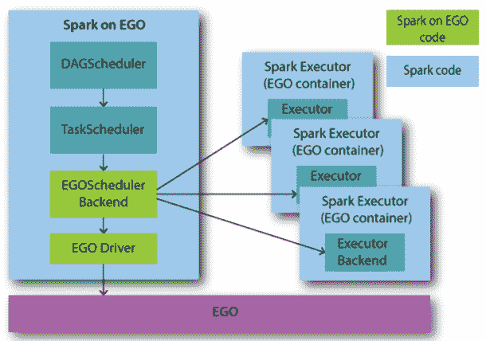
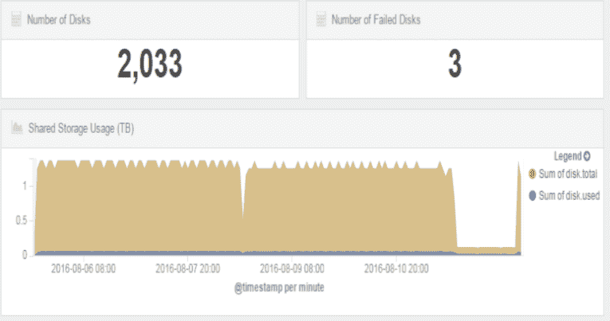

# 大数据集群部署与管理

> 原文：[`developer.ibm.com/zh/articles/ba-cn-bigdatacluster-deploy-management/`](https://developer.ibm.com/zh/articles/ba-cn-bigdatacluster-deploy-management/)

## 一、大数据集群技术的概述

让我们从有趣的 “啤酒与尿布” 故事说起，在美国沃尔玛连锁超市，人们发现了一个特别有趣的现象：尿布与啤酒这两种风马牛不相及的商品居然摆在一起，但这一奇怪的举措居然使尿布和啤酒的销量大幅增加了。这并非一个笑话，而是一个真实案例。原来，美国的妇女通常在家照顾孩子，所以她们经常会嘱咐丈夫在下班回家的路上为孩子买尿布，而丈夫在买尿布的同时又会顺手购买自己爱喝的啤酒。这个发现为商家带来了大量的利润，但是如何从浩如烟海却又杂乱无章的数据中，发现啤酒和尿布这个看似不相干的物品销售之间的联系呢？这就是大数据的威力。大数据在我们的生活中，发挥着越来越明显的作用。比如，大数据辅助购物平台推荐适合客户的产品，大数据辅助避免堵车，大数据辅助做健康检查，大数据娱乐等。

对于很多公司来说，数据是有的，但是是”死”数据，并不能发挥作用，或者产生的价值不到实际价值的冰山一角。如果想从大数据中获利，数据的采集、挖掘和分析等环节缺一不可，其中，大数据分析技术是重中之重，目前的大数据分析技术有 Hadoop、Spark、Strom 中。要想从一大堆看似杂乱无章的数据中总结出规律，需要对这些数据进行一番非常复杂的计算分析。由于数据量之大，对计算的速度和精度要求都比较高，单纯的通过不断增加处理器的数量来增强单个计算机的计算能力已经达不到预想的效果，那么，大数据处理的方向逐渐的朝着分布式的计算集群来发展，将分布在不同空间的计算机通过网络相互连接组成一个有机的集群，然后将需要处理的大量数据分散到这个集群中，交由分散系统内的计算机组，同时计算，最后将这些计算结果合并得到最终的结果。尽管分散系统内的单个计算机的计算能力不强，但是由于每个计算机只计算一部分数据，而且是多台计算机同时计算，所以就分散系统而言，处理数据的速度会远高于单个计算机。

那么如何部署和管理大数据集群，则是业界持续讨论的话题，本文以 IBM Platform Converge 为例，来阐述大数据集群部署、架构以及管理。IBM Platform Converge 是一种复杂的大数据处理平台（方案），此方案可以从若干个物理机/虚拟机（可能在云端）开始，可以比较方便的部署一个大数据集群，并且管理和监控此集群。此平台包括了若干个大数据技术和集群技术，比如 xCAT、Spark、ELK、GPFS 等。此集群的优点是节点的数量和存储的空间都具有弹性，也就是说，可以随时根据业务和应用的需求，来增加或者删除集群中的节点和存储空间，依次来节省成本。

## 二、大数据集群技术的架构与分析

一般来说，大数据集群的构架，主要分为几层：硬件层、OS 层、基础设施管理层、文件系统层、大数据集群技术层以及上层应用，如下图 1 所示。

##### 图 1 大数据集群的架构

首先最下层为硬件，这些硬件可能为不同的厂商机器，比如 IBM、HP、DELL 或者联想等服务器，也有可能包括不同的构架，比如 System X 或者 IBM POWER 等机器。这些机器有可能在机房，也有可能在云端（包括公有云和私有云）。硬件之上，需要安装运行操作系统（OS），一般为 Linux OS，比如 Redhat、SUSE、Ubuntu 等。

在基础设施管理层，主要管理资源（更多的是软件资源）以及资源的虚拟化等，比如网络资源/设备、计算资源、内存、Slots 等的统一管理和优化分配，在此层，同时肩负着部署大型 Cluster 的任务，也就是将各个分散的节点通过 IBM SCF（Spectrum Cluster Foundation）软件，统一部署为一个整体。在 IBM SCF 集群中，分为管理节点和计算节点。部署的顺序为，需要首先安装管理节点，然后按照不同的硬件、网络、OS 等配置集，来部署出计算节点。为了提高集群的鲁棒性，IBM SCF 本身支持高可用性（HA），在安装完管理节点之后，使用类似的方法，来部署出备份的管理节点。

并行的文件系统，是大数据集群的重中之重，因为大数据有两个主要的特征，其一是数据量比较大，起步可能就以 PB 为单位，如此巨量数据的存储成为了集群需要解决的关键问题之一；另外一个特征是处理速度要快，随着集群技术的发展，并行化的思想尤为明显，并行化的计算产品和工具也层出不穷。所以，并行的文件系统是大数据集群中不可或缺的一部分。比如，在 Hadoop 时代，HDFS 就在 Hadoop 阵营中，贡献了中流砥柱的作用。另外一个出色的并行文件系统为 IBM Spectrum Scale，其前身为 IBM GPFS，经过近来的版本迭代和发展，已经完美的支持目前流行的大数据计算模式，比如 Spark 等。

在资源管理和大数据集群层，主要部署两方面的组件，一是大数据分析处理组件，二是资源调度和管理组件。在一般情况下，这二者都是有机的结合在一起，组成一个产品。随着大数据的发展，大数据的分析和处理技术如井喷一般涌现出来。比如有 Hadoop, Spark, Storm, Dremel/Drill 等大数据解决方案争先恐后的展现出来，需要说明的是，这里所有的方案不是一种技术，而是数种，甚至数十种技术的组合，就拿 Hadoop 来说，Hadoop 只是带头大哥，后面的关键的小弟还有：MapReduce, HDFS, Hive, Hbase, Pig, ZooKeeper 等等，大有”八仙过海，各显神通”的气势和场面。资源调度管理，主要是维护、分配、管理、监控软硬件资源，包括节点、网络资源、CPU、内存等，根据数据处理的需求来分配资源，并负责回收。在此模型中，我们使用了 Spark 来处理大数据，使用 IBM Platform Enterprise Grid Orchestrator （EGO）来管理和监控资源。IBM Platform 是一种资源管理和调度、服务管理的工具。类似于大家熟知的 Mesos 或者 Yarn。

由于 IBM Platform EGO 目前并非开源产品，在此做一简单介绍。在 IBM Platform EGO 中，VEM kernel daemon （VEMKD)是 VEM 内核后台程序，一般运行在管理节点上，会启用其它后台程序并对分配请求做出响应。EGO Service Controller （EGOSC)属于 EGO 服务控制器，负责向 VEMKD 申请相应资源并控制服务实例。流程处理管理器（简称 PEM）负责 VEMKD 中的启用、控制以及监控活动，同时收集并发送运行时资源的使用情况。EGO 中 Consumer，代表的是能够从集群处申请资源的一个实体。单一 Consumer 可以是业务服务、包含多种业务服务的复杂业务流程、单一用户或者一整条业务线。和开源的 Spark 一样，Spark 和 EGO 使用相同的 DAGScheduler 和 TaskScheduler，构架图如图 2 所示。

##### 图 2 Spark on EGO 构架图

EGOSchedulerBackend 根据 Taskscheduler 提供的 task 和 task stage 等信息，负责从目前的 EGO 框架中获得资源。用户可以自定义资源分配方案，通过 Consumer 来分配资源。EGOSchedulerBackend 一旦获得资源，就可以通过 EGO Container 接口开始运行 Spark Executor。EGOSchedulerBackend 监控 Spark Executor 运行的生命周期，以及资源使用情况和 task 状态等，比如当 task 完成时，EGOSchedulerBackend 触发调度逻辑来满足更多资源的获取或者资源的释放。

最上层为应用和业务，客户只需要提交 Spark Application 即可，集群负责统一的管理和调度，并返回执行结果。

## 三、大数据集群的部署

### 3.1 硬件的部署

在此集群部署中，借助了比较成熟的硬件部署工具 Extreme Cloud Administration Toolkit (xCAT), xCAT 是一个开源的集群管理工具，能用于裸机部署，其架构如图 3 所示。xCAT 可以自动发现硬件，开机之后，可以由 xCAT 从裸机自动引导安装，当然，也可以提前导入 client node 信息，xCAT 可以基于 IPMI 进行远程硬件控制，如开关机，如收集 CPU 的温度等状态信息，支持 X86_64、POWER、System Z 等硬件类型。支持的目前所有主流的操作系统，如 RHEL,CentOS, Fedora, Ubuntu, AIX, Windows, SLES, Debian 等。xCAT 各个组件的结构和流程如下图所示。在 xCAT 部署的集群中，主要有三种 Node: 管理节点（Management Node）、服务节点（Service Node）、计算节点（Compute Node），如果并非特别大的集群，一般情况下，服务会被省略掉，只有管理节点和计算节点。管理节点上启动 DHCPD、tftpd、httpd、DNS、ntpd、syslogd、DB 等服务。

##### 图 3 xCAT 构架图

### 3.2 软件的部署

软件部署主要在集群已经建立完成的基础上，并行在各个节点上安装大数据分析处理系统，在”资源管理和大数据集群”层，部署 Spark Cluster，并和 Platform EGO 深度集成，一些管理和监控等方面的程序也相继安装。还有，在提交应用之前，需要先创建 SIG（Spark Instance Group），并启动 SIG，在创建 SIG 之后，也为 Platform EGO 来管理和控制其相关的服务。

### 3.3 高可用性（HA）部署

在 IBM Platform Converge 中，高性能部署的构架如下图所示。通常有三个节点构成，分别为主管理节点 Management Node 1(MN1)、次管理节点 Management Node 2（MN2）和第三管理节点 Management Node 3（MN3）。但是需要说明的是，在 failover 切换的过程中，必须保证 MN1 和 MN2 其中一个健在，因为 MN3 只是负责 IBM Spectrum Scale 的 HA 过程，主要的服务和进程只运行在 MN1 和 MN2 上，在这二者之间进行切换。高可用性的部署如图 4 所示。

##### 图 4 高可用性部署图

## 四、大数据集群的管理与监控

在大数据集群中，管理和维护是一件非常麻烦的事情，有可能会出现各种各样的问题，如果出现了，最好的办法是分析 LOG 和监控，在运维过程中，管理员需要不时的查看监控，并善于从监控中找到问题，及时的分析和解决 Cluster 中的报警（Alert）。以下展示了基本的 Cluster 的监控指标，比如 CPU、内存、存储资源、网络等。在此集群中，监控主要采用的是 ELK 的日志监控分析系统，大致流程为，有 Beats 来收集日志和数据，然后发给 Logstash 来分析和处理日志再由 Elasticsearch 存储和检索，最后由 Kibana 来在 Web GUI 页面上展示出来。接下来，我们展示出几个方面的集群的监控。

### 4.1 CPU 的监控

图 5 展示了 Spark 集群中的 CPU 利用率的监控。如果 Spark 集群中的节点可能较多，可以使用 Kibana 的功能，来展示出 CPU 利用率最高的几个节点（图中展示的是 5 个节点的情况），以便了解哪些节点的负载较重，当然也可以展示出整个系统平均的负载情况。

##### 图 5 CPU 监控

### 4.2 内存的监控

众所周知，Spark 是一种内存利用率非常高的技术，换句话说，Spark 集群对内存的要求较高。Spark 集群的管理者需要实时的掌握内存的使用情况。如图 6 所示，展示出了集群中内存占用率比较高的节点的情况。

##### 图 6 内存监控

### 4.3 磁盘和文件系统的监控

图 7 展示了总体磁盘的个数，有问题磁盘的个数，和总体磁盘的使用率，对磁盘利用率的监控可以有效的防止因存储空间不够而影响应用的运行。

##### 图 7 磁盘监控

## 五、结束语

近几年来，数据的价值正得到越来越多的人的重视，如何让数据”活起来”，一直是 IT 界持续讨论的话题，在这种利益的驱动下，大数据的分析技术可谓是”遍地开花”，大数据集群的部署方案也层出不穷，针对不同的场景和不同的需求，各大 IT 公司都在争先恐后的提出各种各样的方案和技术。如何选择合适的方案，主要可以从技术选题、稳定问题、高可用性、可扩展性、监控等方面入手。IBM Platform 致力于大数据的分析和部署的研究工作，从以上几个方面来看，IBM Platform Converge 是较为出色的大数据集群部署解决方案。