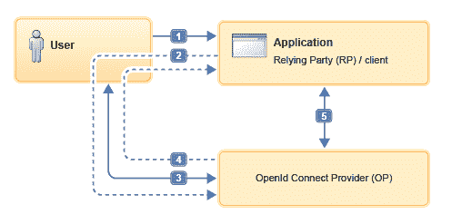
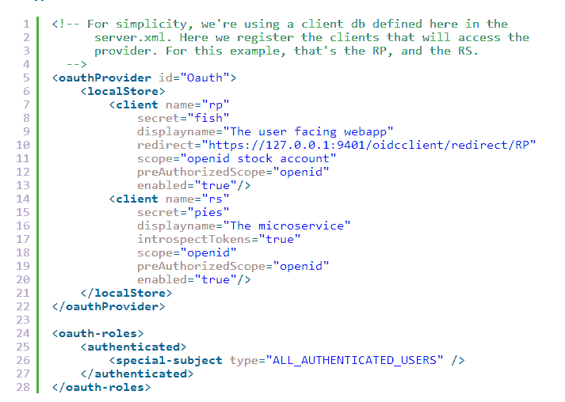
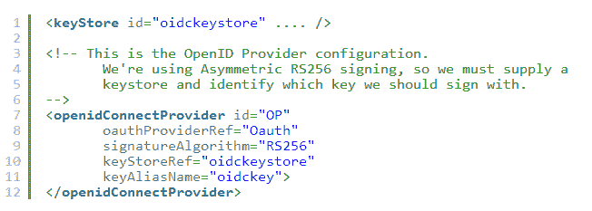
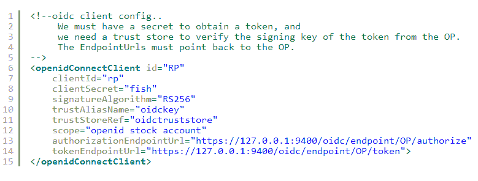
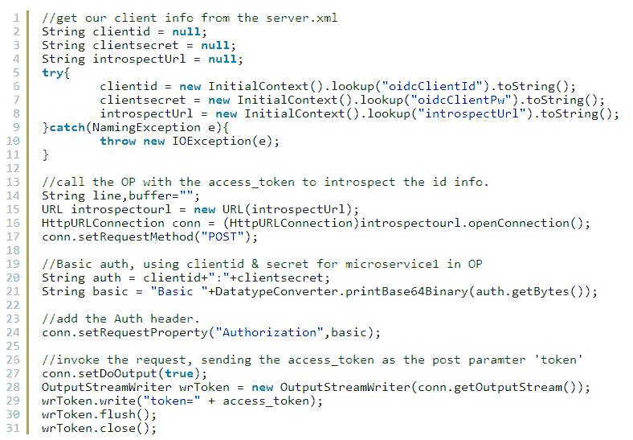
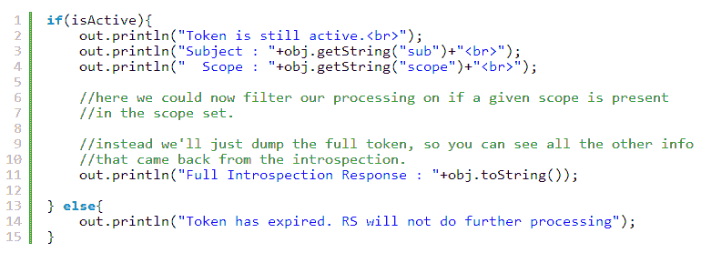

# 使用访问令牌保护微服务

> 原文：[`developer.ibm.com/zh/articles/cl-using-access-tokens-secure-microservices/`](https://developer.ibm.com/zh/articles/cl-using-access-tokens-secure-microservices/)

## 使用访问令牌保护微服务

基于微服务的架构正日益普遍，它是”一种独特的软件应用程序设计方式，即设计成一系列可独立部署的服务”。如果朝着这种应用程序构成方式发展，会产生大量的网络流量。

来自用户的单个请求可能会导致在一系列服务（合并起来实现应用程序）之间产生许多后续请求。在理想情况下，每个后续请求都应以安全的方式发出：您想知道，由任何给定服务处理的任何给定请求都源自某位已知用户。换句话说，任何给定请求都应包含在应用程序内的正常预期流量中，而不是在某人注意到恰好可以从他所在位置访问您的后端服务时，对您的应用程序架构进行滥用。

## OpenID Connect 概述

*“RP 中的用户向 OP 发送信息，然后 OP 向 RP 返回信息，RP 又向 OP 返回信息，然后再向 RS 发送信息，RS 回复 RP，然后 RP 再回复用户。”*

明白了吗？好极了！

如果没明白，不必担心：您唯一需要真正明白的就是，OpenID Connect 似乎喜欢使用大量缩写（它甚至将自己的名称缩写为 *OIDC* ）。我们首先将这个来自 OpenID 安全性表述的概述翻译为人们更容易理解的表达形式（所有这些信息的权威来源实际上是 OpenID Connect 规范，但是，如果对这些规范一无所知，您可能也很难理解）。

从用户体验的角度讲，您可以使用浏览器提供的难看但实用的表单来执行 *基本身份验证* ，以及用户体验更好的自定义的登录表单，带有 *我忘记密码了* 按钮。从服务器的角度看，这两种方法都涉及针对某个配置好的数据存储（数据库、LDAP 等）来验证用户凭证。如果该数据存储是由不懂安全的人设置的，那么您的存储库中就充满了让黑客垂涎三尺的用户凭证。

> “您有一个装满用户凭证的存储库，这些凭证让黑客垂涎三尺。”

人们已形成一种认识：您（通常）并不（真正）想要自行保管这些数据。您真正想要知道的只是：”用户是谁？”。由于这些用户中许多已经有电子邮件帐户或社交媒体帐户，而且他们经常使用这些帐户为自己授权，所以（对于所有各方而言）最好允许用户使用这些凭证登录您的 Web 应用程序，而不是让他们（和您）创建另一个需要保管的用户 ID 和密码。

这就是 OpenID Connect 发挥用武之地。它为应用程序提供了一种验证用户身份的途径，且无需负责管理这些用户的身份验证或授权。

OpenID Connect 需要至少两个服务：一个充当身份验证器，另一个依赖于这个身份验证器。第一个被认为是 *OpenID 提供方* (OP)，第二个被认为是 *依赖方* (RP)。在我们的场景中，该组合中还有第三个服务：用户将信息发送到的应用程序是 RP，但 RP 会将信息发送到另一个服务，我们称之为 *依赖服务* (RS)。

可以配置 Liberty 来充当 OpenID 提供方（也就是 OP），或者也可以将它配置为依赖方 (RP) 来保护应用程序。但是，它目前没有提供现成的内置方式来保护依赖方应用程序对其他服务或应用程序 (RS) 的继续调用。

## 访问令牌传播

OpenID Connect 在概念上具有访问令牌的意思，可由 OpenID 提供方查询访问令牌来检索经过身份验证的用户的信息。此令牌是您在执行 OpenID Connect 身份验证后最终得到的工件之一。

身份验证期间的一般事件序列是：

1.  用户访问应用程序 (RP)。
2.  RP 将用户重定向到 OpenID 提供方 (OP) 以执行身份验证。
3.  OP 对用户进行身份验证。
4.  OP 将用户和一个 auth_token 重定向回 RP。
5.  RP 然后使用 auth_token 与 OP 换取一个 access_token 和 id_token。
6.  大功告成！

图字： 用户 应用程序

依赖方 (RP)/客户端

OpenId Connect 提供方 (OP)

（有关此流程的更多信息，请参阅 知识中心 。）

此序列看起来可能非常复杂，但是，如果您使用 Facebook、Google 或 Twitter 凭证登录过网站，那么您已经经历了这个过程：

*   首先，您去访问应用程序 (RP)（我们假设它是一个讨论论坛）并单击 Sign in with Facebook（使用 Facebook 帐户登录）按钮。
*   这会跳转到一个 Facebook 页面 (OP)。
*   在这里对您执行身份验证，而且您可能要同意您希望应用程序对您的 Facebook 个人资料信息拥有某种访问类型。
*   然后，您返回到讨论论坛，使用您的 Facebook ID 登录。流程的最后一部分是，该论坛使用 auth_token 换取 access_token 和 id_token，这部分对您是不可见的。

尽管身份验证/授权被委托给了第三方，但我们知道，应用程序仍然知道 *您* 是谁、用户 ID、用户名、句柄……

> “……身份验证/授权已委托给第三方，但应用程序仍然知道’您’是谁。”

我们假想的论坛应用程序需要代表用户调用其他微服务，以获取该用户的私人消息或建立未读帖子列表。在这两种情况下，被调用的其他服务都需要知道用户的身份，可能还需要知道用户在执行身份验证时同意共享的信息类型（即范围）。

尽管论坛应用程序 (RP) 可能只将用户 ID 传递给每个被调用的其他微服务，但这样做也非常不安全。目标微服务无法检查它们收到的用户 ID 是否与发出初始请求的用户相符，或者无法知道该用户是否已登录。

RP 可以不传递用户 ID，而是在调用其他服务时转发它与 OP 初始交互期间获取的 access_token。然后，每个服务实例 (RS) 可以利用 access_token 与 OP 取得联系，以获取自己的 id_token 版本，后者会向它们转告用户的身份和范围。有了这些信息，服务就可以调整针对该用户的响应，无需自行对用户进行身份验证。

请注意一般流程：每个服务收到 access_token（可能是 RP 或调用链中的一个后续服务），并联系 OP 以换取 id_token。此方法的一个好处是，每个服务都有机会注意到 access_token 已过期并做出适当的反应。该方法也有一个不足之处，与 OP 的通信可能会成为瓶颈。

必须考虑应用程序（大致）将如何处理令牌过期或令牌在请求”中途”被撤销所带来的影响。恰当处理此类情况可能给应用程序复杂性带来很大影响。

### 关于示例

我们设计了一个示例应用程序（可在 Github 上获取）来演示如何传播访问令牌。该应用程序被配置了 3 个 Liberty 服务器，每个服务器分别扮演 ***OpenID 提供方*** (OP)、 ***依赖方*** (RP) 和 ***依赖服务*** (RS) 这 3 个角色中的一个。也可以将这些角色组合在单个服务器中，但是，为避免角色混淆，我们将它们分开了。

## OpenID 提供方 (OP)

我们创建了一个示例 OpenID 提供方 (OP) 来演示该参与者的行为，而不是根据观察流入一些常见网站（Facebook、Google、Twitter，等等）的网络流量进行演示。

### 用户注册表

OP 的职责是对用户进行身份验证，Liberty 提供一种简单的方法在 server.xml 中定义基本用户注册表权利，该方法对我们的目的而言足够用了。

这个示例所需的服务器配置包含在 ‘access-token-op-wlpcfg’ 项目中：

这段代码定义了一个用户注册表，其中只有一个用户 *user* 和密码 *password* 。它显然不能用于生产用途！可以通过配置 Liberty 来采用其他身份验证方法（比如 LDAP），但我们在这里是想重点演示访问令牌传播，所以我们坚持采用这种简单方法。

basicRegistry 配置元素需要存在 appSecurity 特性，所以我们会将此特性添加到配置中的 featureManager 代码块中：

### OAuth 提供方

我们需要将服务器配置为 OAuth 提供方，并配置它允许哪些客户端连接到 OP 来执行身份验证。在这个示例中，OP 仅有两个直接客户端：RP（我们的 Web 应用程序）和 RS（将与该应用程序进行通信的服务）：

对于每个客户端（RP 和 RS），会使用 name 和 secret 来验证连接到 OP 的客户端。我们会在这些客户端各自的服务器配置中再次看到这些名称和密钥。在这里，我们将密钥保留为明文，但是如果您可以选择的话，可以使用 securityUtility 对它们进行编码（参见 这里的知识中心 ）。redirect URL 是身份验证后的重定向目标：OP 将在用户通过身份验证后将客户端（通常是浏览器）重定向到这个地方。RS 不需要重定向 URL，因为它不受 OpenID Connect 保护。

处理 OAuth 请求时，Liberty 负责将 access_token 转换为 id_token。对于 RP，这很方便，但它对 RS 没有什么帮助。introspectTokens=true 属性向 RS 授予特殊权限，使之可以使用内省功能来用 access_token 换取 id_token。

我们不需要显式地将任何特性添加到 OAuth 配置的 server.xml 中，因为我们将使用 OpenID Connect，它会自动为我们引入所需的 OAuth 功能。

### OpenID Connect 提供方

现在我们已经定义了一个用户注册表和 OAuth 提供方，我们还需要放入 OpenID Connect 功能区，并将服务器配置为 OpenID 提供方。

这里有几点需要解释一下：

*   id 属性将被用作 OpenID 提供方的 URL 的一部分。为了明显起见，我们直接使用 ***OP*** ，您会看到它最终位于 URL 中的何处。
*   需要使用 keystoreRef，因为我们已选择使用经过非对称签名的 id_tokens。我们还需要声明，需要使用所引用的密钥库中的哪个 keyAliasName 来对令牌进行签名。
*   oauthProviderRef 是对我们上面定义的 OAuth 元素的引用。

在生产配置中，不可能在 server.xml 中以这种方式声明客户端，更可能在数据库中管理它们。参见 知识中心 ，了解有关的更多信息。

没有为 OP 服务器声明任何应用程序。充当 OP 的功能全都来自 Liberty 本身提供的特性，包含在 openidConnectServer 特性中。我们还需要使用 appSecurity-2.0 特性来支持基本注册表，最终，我们得到 OP 的一个完整组合的 featureManager 代码块，如下所示：

## 依赖方 (RP)

依赖方 (RP) 是与用户的第一个接触点。应用程序本身很简单，其用途是展示使用传播的访问令牌对 RS 进行连锁调用。

‘access-token-rp-wlpcfg’ 项目包含 RP 的配置，该配置比 OP 的配置还要简单：

另请注意：

*   id 很重要，它是我们在 OP 中注册的用于重定向的 URL 的一部分。我们选择使用的 id 是 “RP”，而且如果您返回去看一下 oauthProvider 配置，您会看到：[`127.0.0.1:9401/oidcclient/redirect/RP。`](https://127.0.0.1:9401/oidcclient/redirect/RP。)
*   clientId 和 clientSecret 必不可少，而且必须与 OP 中的 RP 客户端定义相符。
*   我们告诉该客户端希望使用经过非对称加密的令牌，而且通过指定 trustStoreRef 和 trustAliasName 来告诉它使用哪个密钥库和密钥来验证该签名。
*   最后，我们为 OP 配置了授权和令牌端点 URL。请注意，OP 在 URL 中（就像我说的那样）。如果您没有创建自己的 OpenID 提供方，可以通过剪切和粘贴来获得这里的值。

与服务器一样，我们通过向 server.xml 中的 featureManager 代码块添加该特性，实现对 openidConnectClient 的支持。我们还使用了 appSecurity（它引入了 SSL）和 servlet 来托管应用程序：

现在仅剩下应用程序本身的定义了：

您会注意到，这里没有显式的绑定来声明会使用 openID Connect 保护此应用程序。当您在 Liberty 服务器配置中声明一个 openidConnectClient 后，就可以将它应用于所有应用程序。您可以将一个服务器配置为拥有多个 openidConnectClient，这些客户端使用 authFilterRefs 来决定哪些应用程序受哪个客户端定义保护，请参见 知识中心 ，了解有关的更多信息。

### RP 应用程序实现

上面配置的 openIdConnectClient 为应用程序处理大量工作。在请求到达应用程序代码时，用户已被重定向到 OP，并经过了身份验证，而且 Liberty 已执行了令牌交换，以从 OP 获取 id_token 和 access_token。这真是个好东西！但我们编写的服务需要调用另一个服务。这意味着我们需要更深入地挖掘，以便获得用于验证 RP 调用的原始令牌。

所幸这不是很棘手。原始令牌可通过 com.ibm.websphere.security.auth.WSSubject 接口获取，就像下面的代码段中一样：

[原始令牌](https://developer.ibm.com/developer/default/articles/cl-using-access-tokens-secure-microservices/images/image010.png)获得字符串形式的令牌后，现在，我们可以调用 RS 了，我们可以通过 JAX-RS 或其他任何途径进行调用，只要以参数形式传递该访问令牌即可。没有标准的令牌传递方式，通常的做法是将令牌填充到 HTTP 请求标头中。决定了采用哪种机制，就应该将其硬编码为 RS 服务 API 的一部分。

下面的代码段使用 HttpURLConnection 来调用该请求，并添加 access_token 作为 GET 参数：

在实际应用程序中，可能还会对实际结果进行后续处理，包括处理错误条件或令牌撤销/过期。响应可以是从 JSON 到二进制数据的任何形式。在我们的示例中，响应是一个字符串，详细描述了 RS 在收到请求后执行的处理。

## 依赖服务 (RS)

这使依赖服务 (RS) 与其同级服务器相比更加简洁。它拥有常见的 SSL 密钥库元素和应用程序声明（在本例中，甚至连应用程序声明也是可选的；您可以丢弃它）。

为了让应用程序配置位于 server.xml 中和代码以外的地方，我们还在服务器配置中定义了客户端 ID、密钥和内省 URL。我们稍后会分析应用程序中的这些部分：

我们使用 SSL 和 servlet 特性来托管 RS 应用程序。为了省去我们的一些工作，我们还将使用 Liberty JSONP 特性执行 JSON 解析。所有这些组成一个类似下图的 featureManager 代码块：

RS 没有针对 OpenID Connect 的服务器配置，因为身份验证都是在应用程序代码自身内处理的。

### RS 应用程序实现

该应用程序需要获得所提供的 access_token，并与 OP 一起检查它。首先，我们获得请求方（在我们的示例中，它只是一个请求参数）所提供的 access_token：

然后，我们需要在 OP 上使用内省 URL 来获取 id_token。此代码段使用 HttpURLConnection 向 OP 发出 POST 请求，并使用该 access_token 作为参数。RS 使用自己的客户端 ID 和密钥向 OP 执行验证，我们已在 OP 的 server xml 中声明了这些客户端 ID 和密钥。有关内省端点的更多信息，请查阅 知识中心 。有关在使用 OpenID Connect 时支持的所有 Liberty 端点 URL 的概述，请参见 知识中心 ：

在这里，我们使用了 JDNI 从 server.xml 中获取内省 URL、客户端 ID 和密钥，我们之前将它们存储在了这里。server.xml 中的值甚至可以设置为环境变量，以便推送 RS 来执行云风格的部署，无需更改 server.xml：

这些已足以传输该请求。如果您使用诸如 HttpClient 而不是 HttpURLConnection 这样的库，该代码可能会更简短一些，但基本原理是相同的。

发送请求后，我们需要读回令牌响应并处理它，像这样：

对内省请求的响应是一个包含各种字段的 JSON 对象，我们在此阶段只对一个字段感兴趣：JSON 对象的 active 字段，它将指出 access_token 是否仍然有效。我们在这里使用了 Liberty 中的 jsonp-1.0 特性来解析来自 OP 的 JSON 响应，并获取 active 字段，以便可以处理它。

最后，我们可以执行常规的 RS 处理（或者不执行）：

因为这只是一个使用 access_token 传播身份的示例，我们没有任何处理要执行，所以我们只将令牌上的一些信息转储到输出中。如果令牌过期，我们会输出一条表明该情况的消息。

只需少量工作，就可以将此逻辑迁移到 ServletWrapper 中，让应用程序只关注自己的逻辑。

### 关于密钥和密钥库的一些说明

此示例同时使用了 SSL 和已签名的 ID 令牌（包含在 OpenID Connect 流中）。因此，最终我们还需要处理 SSL 证书和密钥。我们的 3 个服务器使用了不少 SSL 证书和密钥：

*   OpenID 提供方服务器使用的密钥库：

    *   OpenID Connect 密钥库：包含该提供方用于对返回给依赖方的 id_tokens 执行签名的私钥。
    *   OpenID 提供方密钥库：包含该提供方用于保护其 SSL 通信的私钥。
*   依赖方服务器使用的密钥库：

    *   依赖方密钥库：包含依赖方用于保护其 SSL 通信的私钥。
    *   OpenID 提供方信任库：包含依赖方用于验证来自 OpenID 提供方的 id_tokens 上的签名的公钥。
    *   依赖方信任库：包含用于依赖服务 SSL 和 OpenID 提供方 SSL 的公钥。
*   依赖服务服务器使用的密钥库：
*   依赖服务密钥库：包含用于保护其 SSL 通信的私钥。
*   依赖服务信任库：包含用于 OP SSL 的公钥，使应用程序能够与 OP 进行通信。

如果使用 Gradle 构建该示例，则会根据需要创建每个密钥库并导出/导入公钥。这可确保创建示例时仍在密钥的有效期内。在生产环境中，SSL 密钥库不可能拥有自签名证书。OpenID 密钥库也应包含由某个受信任的根证书颁发机构签名的证书。

## Gradle

拥有 3 个服务器和两个应用程序，这使得编译、部署和测试工作变得非常有趣，幸运的是，我们编写了一些 Gradle 来将它们衔接起来。

对父文件夹运行 gradle build 将下载 Liberty，安装所需的特性（我们这里只用到了最少的部分），创建密钥库，将代码编译到 WAR 应用程序中，并将应用程序部署到服务器。

需要执行一些设置：

1.  要生成密钥库，必须将 JAVA_HOME 设置为指向我们的 JDF，否则 Gradle 无法找到它需要调用来生成密钥库的 keytool 二进制程序。
2.  为了能够下载 Liberty，我们需要将许可代码添加到 gradle.properties 文件中。我们不能默认将许可代码放到该文件中，因为将许可代码放在属性中表明该许可已被读取和接受。您可以读取 当前许可 并寻找 D/N: 行来获取许可代码。

完成上述操作后，输入下面的命令：

gradle build publishToMavenLocal

这会编译所有代码并部署应用程序。然后，如果您希望测试应用程序，可输入：

gradle access-token:start

这会启动形成 access-token 示例的 3 个服务器（OP、RP 和 RS）。类似地，要关闭这些服务器：

gradle access-token:stop

在服务器运行时，您可以访问：

[`127.0.0.1:9401/access-token-rp-application`](https://127.0.0.1:9401/access-token-rp-application)

这会启动 ***通过 OP 执行身份验证*** 的完整过程。使用我们之前在 OP server.xml 中配置的用户 ID user 和密码 password 进行登录。

本文翻译自：[Using access tokens to secure microservices](https://developer.ibm.com/wasdev/docs/using-access-tokens-secure-microservices/)（2017-01-05）