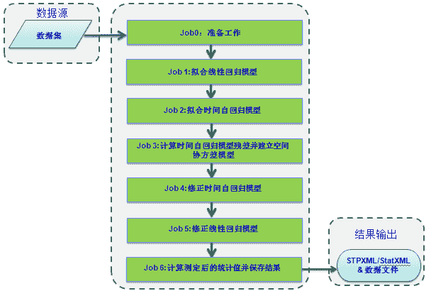
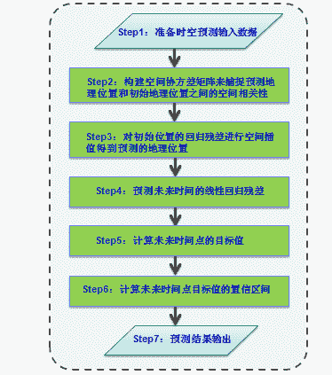
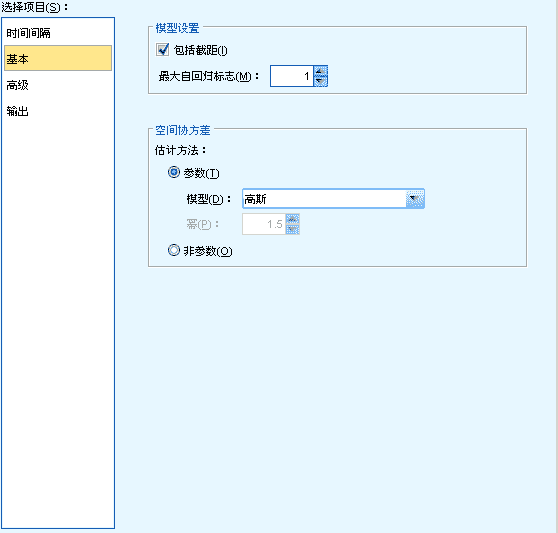
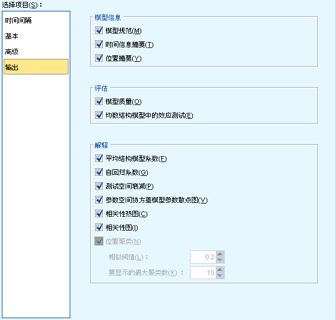
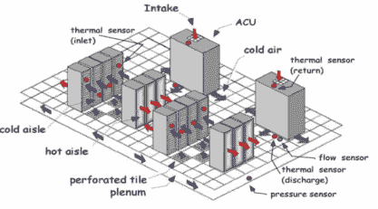
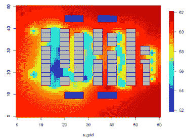

# 面向大数据的时空数据挖掘 第 2 部分

> 原文：[`developer.ibm.com/zh/articles/ba-cn-spatial-temporal-datamining2/`](https://developer.ibm.com/zh/articles/ba-cn-spatial-temporal-datamining2/)

## 面向大数据的时空数据挖掘现状

随着传感器网络、手持移动设备等的普遍应用，遥感卫星和地理信息系统等的显著进步，人们获取了大量地理科学数据。这些数据内嵌于连续空间，并且随时间动态变化，具有很大程度的特殊性和复杂性。实际上，很多应用领域，例如交通运输、气象研究、地震救援、犯罪分析、公共卫生与医疗等，在问题求解过程中需要同时考虑时间和空间两方面因素。而随着信息技术的发展，人们已经不满足于单纯的时空数据的存储和展现，而是需要更先进的手段帮助理解时空数据的变化。如何从这些复杂、海量、高维、高噪声和非线性的时空数据中挖掘出隐含的时空模式，并对这些模式进行分析从而提取出有价值的信息并用于商业活动是对时空数据挖掘及分析技术的一项极大的挑战。

IBM SPSS Modeler 是参照行业标准 CRISP-DM 模型设计而成的数据挖掘工具，可支持从数据到更优商业成果的整个数据挖掘过程。通过结合时空数据和其他商业数据，并且运用数据挖掘工具 IBM SPSS Modeler 对时间和空间属性进行观测分析，建立预测性模型，进而获得决定性的认知，并将其应用于商业活动，从而改进决策过程。

## 面向大数据的时空预测简介

面向大数据的时空预测主要是基于时空对象的特征构建预测模型进而预测时空对象在未来特定时间范围内特定空间位置下的行为或者状态。

### 时空预测的分类

根据时空对象的不同，时空预测有不同的分类。面向时空数据的位置和轨迹预测、密度和事件预测、结合空间的时间序列预测等研究都具有重要的应用前景。

#### 位置和轨迹预测

面向时空数据的位置预测主要是基于时空对象的特征构建预测模型来预测时空对象所在的具体空间位置。对于实时物流、实时交通管理、基于位置的服务和 GPS 导航等涉及时空数据的应用而言，预测单个或者一组对象未来的位置或目的地是至关重要的，它能使系统在延误的情况下采取必要的补救措施，避免拥堵，提高效率。

除了位置预测之外，面向时空数据的轨迹预测可以推测移动对象的出行规律。例如，社交网络应用借助 GPS 设备记录用户轨迹数据，通过”签到”应用（如微信、微博等）分享位置信息。分析这些共享的 GPS 轨迹数据，可以为用户推荐感兴趣的旅游景点和游览次序。

#### 密度、事件预测

某个区域的对象密度定义为在给定时间点该区域内对象数与该区域大小之比。这是一些对象随时间变化而呈现出的一个全局特征。面向时空数据的密度预测主要应用于实时交通管理，会对及时改善交通拥堵带来很大助益。例如，交通管理系统通过密度预测可以识别出道路中的密集区域，从而帮助用户避免陷入交通阻塞，并采取有效措施及时缓解交通拥堵。此外，面向时空数据的事件预测可以根据历史数据（时间序列），结合地理区域密度估计（发现重要特征和时空地点）来预测给定时间范围和空间位置的概率密度，譬如基于过去犯罪事件发生的地点、时间和城市经济等特征预测给定区域和时间段内犯罪发生的概率，进而检测犯罪发展趋势，有效降低城市犯罪率。

#### 结合空间的时间序列预测

结合空间的时间序列预测是从时间的角度来考虑时空数据。与传统的时间序列不同的是，与空间有关的时间序列彼此不是独立的，而是和空间相关的。例如，可以首先构造时间序列模型以获取每个独立空间区域的时间特性，然后构造神经网络模型拟合隐含的空间相关性，最后基于统计回归结合时间和空间预测获得综合预测。

### 时空预测的理论框架

如上所述，时空预测根据时空对象的不同有不同的分类方法，本文我们重点介绍 IBM SPSS Modeler 中对于包含时间和空间两种属性的数据的建模与预测。其提供了一个综合时间和空间属性的有效的手段，充分利用各种数据序列的特征，将时间、空间及时空自回归预测方法有效地结合，并在预测同时考虑了研究对象之间的空间影响关系，从而提高了预测的精确度。

#### 时空数据建模

时空预测模型实质上是一个基于线性回归的扩展模型，其原理可以用如下公式表示：

其中， 系数β是自变量的系数，表示自变量对于目标变量的影响程度；Z 作为线性拟合的残差，是目标变量变化中用自变量线性组合无法表示的部分，可用来在自回归（Autoregressive，AR）模型中捕捉时间自相关性，进而用于描述空间的相关性。我们可以通过图 1 所示的流程图来具体讨论这一过程。

##### 图 1\. 时空数据建模流程图

**Job0 ：准备工作**

针对时空建模的复杂性，适当的数据验证和缺失值筛选将有助于模型的构建。通过检测，包含缺失值或无效值百分比较高的一些样本位置将从分析中删除，而缺失值或无效值百分比较低的样本位置则被留下来，后期建模过程中将对其进行特殊编码处理，以尽可能多保留数据信息。

**Job1 ：拟合线性回归模型**

回归模型采用标准的线性回归模型（包括或不包括截距），但由于数据的时空相关关系，其残差会形成一个零均值的非独立的时空相关随机过程。线性回归的系数，可衡量自变量对目标变量的影响程度，较大的系数对应的自变量表明其单位变化会产生较大的目标变量变化。

**Job2 ：拟合时间自回归模型**

自回归模型使用指定的自回归阶数，即指定之前若干个时刻的值来预测当前值。自回归的系数可用与衡量过往时刻的残差对当前值的影响。自回归模型同样包含残差，由于其中的时间自相关因素已被移除，自回归模型的残差在时间上是相互独立的。

**Job3 ：计算时间自回归模型残差并建立空间协方差模型**

基于地理空间的协方差模型建立在时间自回归模型残差的基础上，空间协方差模型有两种实现方法：参数法和非参数法。参数法具有更精简的数学表达式和更好的模型推广能力，所以在假设所给数据能够进行参数化建模的情况下，提供了两个参数检验方法来确定模型的准确性。其一是检测是否空间中存在随着距离而变化的衰减，其二检测空间方差在给定区域具有普遍性（方差同质性检验）。如果不满足参数化模型的假设，将会构造非参数化的模型，利用空间残差所形成空间关系矩阵来描述数据中的空间关系。

**Job4 ：修正时间自回归模型**

空间协方差量化表达了数据的空间关系，从而可以从之前线性回归的残差中移除空间关系的影响，进而能够修正时间自回归模型，更新自回归模型的参数，获得更加准确的时间自回归关系的描述。

**Job5 ：修正线性回归模型**

基于准确 的空间关系和时间自相关关系的描述，可从原始的数据中去除时间和空间关系的影响，从而能够修正线性回归模型的参数，更加准确的描述出自变量对目标变量的影响。

**Job6 ：计算测定后的统计值并保存结果**

上述步骤已经完成了模型的估计过程，获得的模型可生成目标变量的估计值，与观测值相比较，能够评价所建模型的质量。同时通过一些参数检验的方法，可以评价自变量，时间自回归系数的重要性等一些基于模型的评价指标。

#### 时空数据预测

时空数据预测是基于时空数据模型的一个假设情况分析（what-if 分析），可以预测未来一段时间在分析范围中任何地理位置的目标值。我们可以通过图 2 所示的流程图来具体讨论这一过程。

##### 图 2\. 时空数据预测流程图

**Step1 ：准备时空预测输入数据**

想要获得未来时间的目标预测值，首先需要有和时空数据建模的输入数据结构统一的未来时刻的自变量数据。未来时刻的自变量数据可以保持已知的最终数据不变，或者是人为修改过的用于假设分析的数据。

**Step2 ：构建空间协方差矩阵来捕捉预测地理位置和初始地理位置之间的空间相关性**

预测数据中的地理位置和初始数据中的地理位置可以不同，也可以预测数据中一些地理位置和初始地理位置相同，或者预测地理位置是初始地理位置的子集。

**Step3 ：对初始位置的回归残差进行空间插值得到预测的地理位置**

利用第 2 步构建的空间协方差矩阵对初始地理位置经过转换后的回归残差进行插补，从而得到预测的地理位置 **。**

**Step4 ：预测未来时间的线性回归残差**

预测未来时间的回归残差是在时间点 m+1, m+2, … m+H 上逐步迭代进行， 其中， m 是建模的最终时间点，H 是需要预测的未来时间点的个数。

**Step5 ：计算未来时间点的目标值**

未来时间点的目标值需要通过回归模型，第 4 步中计算得到的时间点 m+1, m+2, … m+H 上的回归残差和在未来时间点和新的地理位置上的预测输入数据值来计算。

**Step6 ：计算未来时间点目标值的置信区间**

基于高斯过程和已知模型每一部分的方差情况，可逐级推出最终预测目标值的置信区间。此步骤过于复杂，本文不作详述。

**Step7 ：预测结果输出**

最终得到的预测结果包括在未来时间指定位置的目标值，以及预测值置信区间的上下限。

## 时空预测应用实例

在充分了解时空数据建模及预测理论结构的基础上，我们来描述该时空预测模型在 IBM SPSS Modeler 中的具体实现，并结合应用实例展示如何应用时空数据模型的假设情况分析（what-if 分析）实现对未来任何时间任何地点目标值的准确预测。

### 时空预测模型描述

在 IBM SPSS Modeler 中，时空预测模型分析使用包含位置数据、预测输入字段（预测变量）、时间字段和目标字段的数据，如图 3 中时空预测模型字段选项的参数所示。 时空预测模型的输入数据必须是经过时空数据预处理，融合了时间序列和形状数据，同时包含时间变量，空间位置变量及其他相关变量的数据。在该数据中，每个位置在数据中都有许多行，这些行表示每个预测变量在每个测量时间的值。 分析数据后，可以使用该数据来预测所使用的形状数据（.shp 文件）内任意位置处的目标值。 并且，还可以预测何时能够获知未来时间点的输入数据。

##### 图 3.时空预测模型-字段选项

这里，目标字段是将要预测的目标变量。位置字段是一个测量级别为”地理空间”的字段，可以是点、线、多边形（面）、多点、多线、多面等位置类型。形状数据通常包含一个表明层特征的名称的字段，例如，这可能是省/自治区/直辖市或者国家或地区的名称。 使用此字段可以将名称或标签与位置相关联，方法是选择一个分类字段来标注输出中的所选位置字段，即位置标签字段。时间字段是要在预测中使用的时间变量，只能选择测量级别为”连续”且存储类型为时间、日期、时间戳记或整数的字段。预测变量是预测输入字段，只能选择测量级别为”连续”的字段。

设置好时空预测模型所需的变量后，我们就该考虑时空预测模型的构建了。在 IBM SPSS Modeler 中，时空预测模型的构建选项还分为时间间隔、基本、高级和输出等子项，分别实现时空数据建模中的不同功能。

在可以构建时空预测模型之前，需要进行数据准备以便将时间字段转换为索引；要使得能够进行这种转换，时间字段中的记录之间必须有固定的区间。如果数据尚未包含此信息，我们就可以使用”时间间隔”子项中的选项来设置此区间，然后才能进行时空数据建模。”时间间隔”选项如图 4 所示。

##### 图 4\. 时空预测模型-时间间隔选项

根据输入数据中时间字段的特征选择或者转换为合适的时间间隔是时空数据建模的必要条件。这里，时间间隔可以以周期、年、季度、月、周、天、时、分、秒等一系列为单位。基于所选的时间间隔，还有一系列与之相关的选项，比如，时间间隔为年或季度时的开始月份，时间间隔为周时每周的第一天和每周的天数，时间间隔为小时时每天的小时数和一天开始的时间等。如果输入数据已包含正确的时间间隔信息，并且不需要进行转换，选中”数据匹配指定时间间隔设置” 复选框。 选中此框后，”汇总”区域中的设置将不可用。反之，如果输入数据中的时间字段需要转换为特定区间，取消选中”数据匹配指定时间间隔设置”复选框，并指定用于汇总的字段以便与指定区间匹配的选项。 例如，如果有以周和月为单位的混合数据，那么可以对周值进行汇总或累计，以获得均匀的月间隔。所用的汇总方法可以从”缺省设置”下拉框中选择并应用于未逐个指定的所有连续字段。如果希望对于特定字段进行定制设置，即将特定汇总函数应用于个别字段，则在”指定字段的定制设置”表中选择字段并选择汇总方法。

实际上，时间间隔的设置与转换是时空数据预处理的一部分，在 IBM SPSS Modeler 中，为方便使用，内嵌于时空数据建模中。时空数据建模的构建实质是通过基本构建选项和高级构建选项来设置的，如图 5 和图 6 所示。

##### 图 5\. 时空预测模型-基本构建选项

我们可以在基本构建选项里主要设置最大自回归阶数和空间协方差矩阵的估计方法。自回归阶指定使用哪些先前值来预测当前值，使用”最大自回归标志”选项可以指定用于计算新值的先前记录数。空间协方差的估计方法可以选择参数或非参数，其中参数方法又可以从三种模型类型中进行选择：高斯、指数和幂指。

##### 图 6\. 时空预测模型-高级构建选项

时空数据建模的高级构建选项主要用来对模型构建过程进行微调。其中，”缺失值的最大百分比”指定模型中可以包括的包含缺失值的记录所占的最大百分比。”模型构建中假设测试的显著性水平”指定用于时空数据模型估计的所有检验（包括两项拟合优度检验、效应 F 检验和系数 T 检验）的显著性水平值，此级别可以是 0 与 1 之间的任何值，并以 0.01 为增量变动。

最后是时空数据模型的输出选项，主要用于在构建模型之前，使用此页面中的选项来选择要包括在模型输出查看器中的输出，如图 7 所示。

##### 图 7.时空预测模型-输出选项

如图所示，时空数据模型的输出分为模型信息、评估、和解释三部分。其中，模型信息包括模型规范和时间信息摘要；评估包括模型质量和均值结构模型中的效应检验；解释包括平均结构模型系数、自回归系数、测试空间衰减、参数空间协方差模型参数散点图、相关性热图、相关性图和位置聚类。所有这些图或表均从不同角度展现时空数据模型，以不同形式向用户诠释时空数据模型的意义。

### 时空预测应用实例

时空预测模型有许多潜在的应用，例如紧急管理建筑物或设施、对机械服务工程师进行绩效分析和预测或者进行公共交通规划。 在这些应用中，通常要对时间和空间进行能耗等测量。 可能与记录这些测量值相关的问题包括哪些因子影响未来的观测值、如何实现所需的变化或者如何更好地管理系统？ 为了回答这些问题，我们可以在不同位置使用能够预测未来值的统计技术，并可以显式地对可调因子进行建模以执行假设情况分析。

本节我们将通过应用时空数据建模以及执行假设情况分析来实现数据中心的能量管理，避免使用过多的制冷能量把数据中心的热量控制在可接受的标准范围内。一个典型的数据中心，压力通风系统(plenum)通过打孔瓦(perforated tiles)供应冷空气，冷空气通过通风口(inlet)冷却服务器温度。而服务器散发热空气并传给空调机组(ACU)，热空气在空调机组里被冷却并重新交换到压力通风系统，依此循环。为了更好地实现数据中心的能量管理，数据中心还需部署实时热量传感器(thermal sensors)来监控能量使用。但是，热量传感器不可能存在数据中心的任何一个位置，因而需要对没有部署热量传感器的位置进行预测。因此，我们将建立一个时空数据预测模型来预测整个数据中心在未来时间的温度，并结合影响数据中心温度的其他相关因素执行假设情况分析，从而对如何改善数据中心的能量使用效率提出建设性意见。

#### 数据收集和预处理

为了进一步理解并调控数据中心的热量管理系统，数据中心在有限的位置布置热量传感器，通过传感器收集不同位置的实时温度。另外，数据中心的热量传感器、空调机组和打孔瓦的物理参数，比如每个热量传感器的坐标位置，每个空调机组的坐标位置和长宽高（三维物体）以及打孔瓦的坐标和长宽（二维物体）等信息也会相应地影响数据中心不同位置的空气流，如图 8 所示。

##### 图 8\. 数据中心结构图

这些数据不能直接应用于时空数据预测建模，必须要先进行数据预处理，把温度数据、各个物体的位置数据等进行融合，从而得到一个包含空间地理位置字段，时间字段，预测输入字段和将要预测的目标字段的一个表格式的输入数据。

#### 时空数据建模

经过数据预处理，我们得到一个包括时空数据预测建模所需字段的标准输入数据。然后我们将选择并设置时空数据预测模型的不同参数来建立时空数据预测模型。很显然，这里的目标字段为数据中心的温度，空间位置字段为温度被监控的位置，即热量传感器的坐标位置，时间字段为温度被监控的一系列时间点，预测数据字段则为其他相关因素，包括数据中心的空气流、空调机组的长宽高等，如图 9 所示。

##### 图 9\. 数据预处理后的输入数据结构

接下来根据数据中心温度的监控时间点来设置时间间隔选项，如果温度是每小时收集一次，那么时间间隔应设为小时并设置起始点；如果温度的收集频率是一天一次，则应设时间间隔为天。并且根据输入数据的时间变量的特征决定是否需要对数据进行转换从而使得数据与指定的时间间隔设置匹配。

然后根据需求设置最大自回归阶数指定使用哪些先前值来预测未来值，并且指定计算空间协方差的估计方法。为了最大程度的提高对时空数据预测模型的预测准确性，还可以通过设置”缺失值的最大百分比”和”模型构建中用于假设检验的显著性水平” 对模型构建过程进行微调。

最后构建时空数据模型，从而实现后续的模型输出和假设检验分析。

#### 时空数据预测

想要获得对目标值的预测，即要了解下一个时间监测点或者将来某个时间点数据中心不同位置的温度值，需要有和时空数据建模的输入数据结构统一的预测输入数据。其中，时间为将要预测温度值的时间点，空间位置为将要预测温度值的位置点，其他相关输入变量均为每个将要预测温度的位置的相应未来值。有了预测输入变量，输入时空数据模型即可得到数据中心在指定时间指定位置的温度值，同时还可获得该预测值的错误方差及预测置信度的上下限。

### 时空预测结果展示

时空数据预测模型的显著性不仅在于它可以同时处理时间和空间两种属性并对未来任何时间任何地点的目标值进行预测，更在于可以通过时空预测模型进行假设检验分析从而改善决策。

在上述数据中心能量管理的应用实例中，时空数据模型可以通过热图来可视化在指定时间指定位置的目标值，如图 10 所示。

##### 图 10\. 数据中心温度预测热图

在时空预测过程中，首先假定在下一个时间监测点所有其他的参数都保持现有值，即空调机组的数目和位置，热量传感器的位置，空气流等保持不变的情况下的温度情况，得到如图 11 热图所示的结果。从图中可以看出，在现有制冷持续的情况下，部分区域会出现温度过冷现象。基于该假设检验分析的结果，为了节约能量，我们可以把空调机组的制冷设置温度升高 1 度，从而得到如图 12 所示的热图。从图中可以看出，保持现有设置不变情况下的过冷现象得到明显改善。

##### 图 11\. 保持现有设置不变的温度热图

##### 图 12\. 采取措施后的温度热图

## 结束语

时空数据挖掘是数据挖掘中的重要研究内容，其中时空预测的应用领域最为广泛。随着信息技术的发展，人们已经不满足于单纯的空间数据的存储和展现，而是需要更先进的手段帮助理解空间数据的变化，发现空间数据之间的动态关系。实际上， 很多空间现象是随时间动态变化的，在问题求解过程中需要同时考虑时间和空间两方面因素。本文主要围绕时空数据挖掘的发展现状及时空预测的分类，重点介绍基于时间和空间两种属性的时空综合预测方法，具体描述了该方法在 IBM SPSS Modeler 中的实现，并结合应用实例详细说明如何应用时空数据建模及预测实现准确而有效的时空预测。

## 参考资源

*   参考期刊《计算机研究与发展》论文 [2013-时空数据挖掘研究进展](http://wenku.baidu.com/link?url=WPUuNND_LAHnUoJDlKRMuMU-rUemq6rfw_VR_JzMpfS624V_hVxMPTeJbGedvOA8w66iSE4_gJlmJoJE3OK8hAXEr34DSAg1x_5P3mMXDbm) ，了解时空数据挖掘的研究进展。
*   参考南京师大学报（自然科学版）文献 [面向大数据](http://wenku.baidu.com/link?url=vv1aaM6tRaoA4_qZgnNtFRgzBz3URhAG524tlcbBrn0VrS-AWcbF-7WQTdT-lG-jApGCuX_2EATE3uazVfYVbMjBMBEmP7xhKeEZeVpN0zC) [的](http://wenku.baidu.com/link?url=vv1aaM6tRaoA4_qZgnNtFRgzBz3URhAG524tlcbBrn0VrS-AWcbF-7WQTdT-lG-jApGCuX_2EATE3uazVfYVbMjBMBEmP7xhKeEZeVpN0zC) [时空数](http://wenku.baidu.com/link?url=vv1aaM6tRaoA4_qZgnNtFRgzBz3URhAG524tlcbBrn0VrS-AWcbF-7WQTdT-lG-jApGCuX_2EATE3uazVfYVbMjBMBEmP7xhKeEZeVpN0zC) [据](http://wenku.baidu.com/link?url=vv1aaM6tRaoA4_qZgnNtFRgzBz3URhAG524tlcbBrn0VrS-AWcbF-7WQTdT-lG-jApGCuX_2EATE3uazVfYVbMjBMBEmP7xhKeEZeVpN0zC) [挖掘综述](http://wenku.baidu.com/link?url=vv1aaM6tRaoA4_qZgnNtFRgzBz3URhAG524tlcbBrn0VrS-AWcbF-7WQTdT-lG-jApGCuX_2EATE3uazVfYVbMjBMBEmP7xhKeEZeVpN0zC) ，了解面向大数据的时空数据挖掘的应用与挑战。