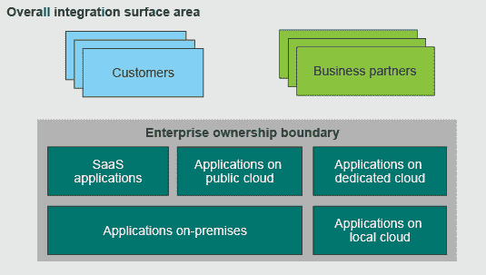
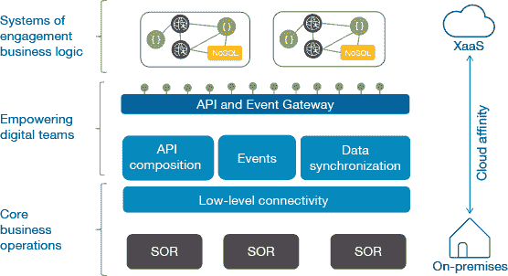
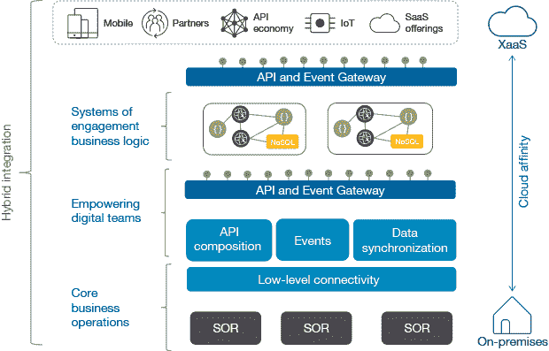
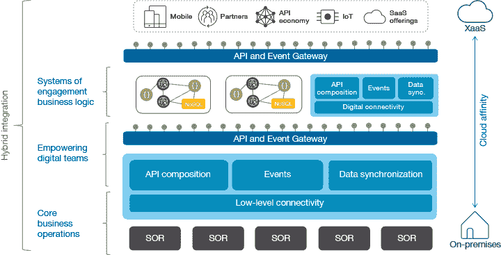
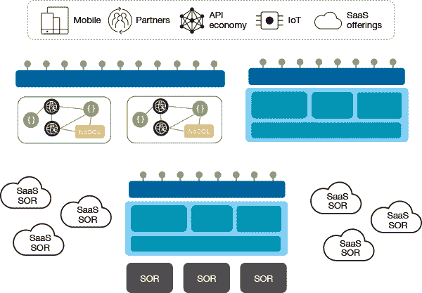

# 不断演变的混合集成参考架构

> 原文：[`developer.ibm.com/zh/articles/mw-1606-clark-trs/`](https://developer.ibm.com/zh/articles/mw-1606-clark-trs/)

随着时间的推移，集成的复杂性也会不可避免地增加。这种复杂性是不断增加的基础架构和平台中更加多样化的资源所导致的，而这些资源正是我们需要集成的资源。此外，参与集成系统的人不再集中于某个技术团队，而是分散在企业内外。

同时，这种复杂性增长从某种程度上导致了一种旨在简化和合理化集成的竞争的出现。Web API 已发展成熟，成为了实现应用程序通信的一种通用平台以及与语言无关的通信方式。基础架构更加虚拟化和容器化，从硬件和操作系统细节中节省了大量时间，而且实现了弹性的工作负载编排。各个团队正在学习更有效地让开发人员和运营人员进行协作，自动化从构建到部署的过程，以便实现快速的发布周期。

从许多不同的角度来看，挑战都是错综复杂的。位置、团队、方法、平台等都在不断分散。跨这种混合环境的集成架构在快速演变。

本文将探索混合集成发生了怎样的演变。首先看看随着向云的迁移，集成范围发生了哪些变化。接下来定义混合集成能力的总体特征。然后解释 IT 为什么不再经常成为企业内的中心职能。随后继续分析混合集成架构的基础构件，以及如何通过 API 经济让集成变得产品化。最后，我们将重点介绍如何识别和满足数字化团队的需求，提高整个混合环境中的一致性。

## 扩大的混合集成功能区域

如今，企业的所有权界线已被打破，包含一个真正混合的环境中的 IT 资产。在此架构中，现有应用程序已迁移到云提供商的基础架构即服务 (IaaS) 中。通常，新应用程序在云上被构建为平台即服务 (PaaS)。与这一趋势相呼应的是，预先构建的基于云的软件即服务 (SaaS) 的使用量也在迅猛增长。

此外，与外部方（无论是客户还是业务合作伙伴）的交互越来越自动化。与这些外部方之间的自动化程度通常会成为企业的差异化优势。

因此，任何集成能力都必须从根本上解决跨越云边界的连接问题。此能力还必须简化它带来的安全和管理问题，接收混合架构中不断演化的标准。

混合集成通常被过于简单地定义为将内部部署系统与云系统集成的能力。大部分企业实际上拥有多得多的维度。真正的混合集成架构会考虑所有 *已拥有环境* 之间的集成，涵盖内部部署和云环境，无论该云是本地云、专用云还是公共云。它还涵盖自建环境、平台和 SaaS，还必须考虑企业如何与其合作伙伴和客户连接。混合集成拥有庞大的范围。关键挑战在于，如何解释这一复杂性，并在其中找到通用的架构模式来帮助简化问题。

## 混合集成的核心能力

从总体上讲，混合集成是一个庞大的集成框架。它无缝衔接所有拥有的环境，无论是直接的数据源、应用程序还是 API，而且无论它们位于何处都能连接到它们：内部部署、IaaS、PaaS 或 SaaS。

混合集成必须包含广泛的连接能力，这些能力不仅适合基于云的现代应用程序，还适合同样至关重要的旧有记录系统 (SOR)。它必须拥有一些工具来简化和加速生产力，比如灵活且快速的映射和转换。从非功能角度讲，它还必须提供企业级和互联网级的可伸缩性、安全性和恢复能力。

但是，尽管从整体上定义混合集成很重要，但我们还必须考虑集成需求的变化，并识别所涉及的两种不同的受众。

## 业务线对 IT 的采用

几年来，特别是在移动变革的推动下，集中化的 IT 已分裂为至少两个不同的阵营：通常称为 *企业 IT* 和 *数字化 IT* 。

企业 IT 保留了自己的关键角色，那就是确保业务关键型应用保持其服务水平，并提供业务所依赖的核心系统应有的数据完整性和安全治理类型。但是，这种受到严格监管和控制的环境无法满足业务线 (LOB) 的需求，业务线必须在快速变化的市场中通过新颖的主张和创新保持企业的新鲜公众形象。

LOB 越来越关注需求，比如以下示例：

*   **敏捷性。** LOB 需要探索、调整和快速迭代原型，在必要时快速失败并转而考虑下一个想法。此方法要求使用不同的技术来构建更加组件化的应用程序，比如微服务架构。它还意味着加强对 DevOps 文化的关注，最大程度缩短实现变更与生产交付之间的距离。
*   **可伸缩性。** 如果启动了一个原型，LOB 必须能够弹性地扩展它，在不会显著增加开发工作的情况下，将原型从少数发起用户的手中转移到开放市场。LOB 必须使用简单且可预测的成本模型（这就要求使用 IaaS 或 PaaS），并遵守具有内在的可伸缩性的应用程序架构，以便能够扩大和缩小基础架构。
*   **延迟。** LOB 还必须在他们提供的应用程序的实时响应能力上具有不同的需求。创建引人入胜的移动体验所需的延迟，可能比现有记录系统提供的延迟低得多。这种延迟可能要求使用预先聚合或缓存的数据，围绕充满挑战的重复数据删除和最终一致性问题而设计。它可能还需要足够的流量管理能力来确定工作负载的优先级。
*   **可用性。** 即使在出错的时候只发生了极短时间的宕机，也有可能给著名在线企业的声誉造成无法挽回的损害。久经考验的可用性是一种差异化优势。LOB 需要针对持续高可用性而设计的应用程序。与您可能为内部企业应用程序选择的恢复方法相比，这些应用程序通常需要采用不同的方法。

考虑到这些需求，您可能看到 LOB 中出现了 *影子 IT 部门* ，他们正在使用与中央 IT 部门不同的技术来实施大量全新项目。这些 LOB IT 部门正快速脱离影子的形象，逐渐被公认为负责创建新一代应用程序的 *数字化 IT* 团队。这个团队通常有不同的文化和关注点，招募拥有业务意识和技术技能的人，而不只是单纯的技术专家。因此，该团队关注的是如何通过快速创新来获得收入和市场份额。但是，这些人创建的应用程序代表着公司的公众形象。因此，他们还需要可靠的技术骨干来满足核心的非功能需求。

企业 IT 和数字化 IT 团队都有集成需求。他们需要在自有领域内集成和相互集成。从总体上讲，这些混合集成能力看起来很相似，比如连接、转换、API 公开和合成。但是，他们在细节上有很大的不同。

## 跨越双模式鸿沟

在简化的集成参考架构中，比如下图所示的示例，一个中央 IT 团队可能执行大部分集成工作。该团队通过对数字化团队增权益能，跨越这种双模式鸿沟。它执行必要的深度集成，在中央 API 网关上将记录系统公开为 API 和事件。

该图的另一个重要但细微的方面是 *云亲和性 (affinity)* 。这个概念专门用于表示一个连续体，而不是架构上的分界线。根据对混合集成的功能区域的解释，该架构的任何部分都可以是内部部署的或完全基于云的。靠近该图底部的组件（比如记录系统）更 *有可能* 部署在内部，但新记录系统可以部署在云基础架构上或者甚至作为 SaaS。类似地，靠近该图顶部的组件更 *有可能* 基于云，但许多企业仍将托管自己的互动参与体系应用。所有企业现在都是内部部署和外部部署的组件的混合体，而且所有混合集成架构都必须建立连接。

对于这种核心企业集成，具有广泛且已知的需求，以及以下主要关注点：

*   跨广泛的数据格式、传输方式和协议的 *低级连接性* ，以确保能与他们目前拥有或获取的任何记录系统交互，无论系统使用期限或平台有何不同。
*   使用事务实现 *数据完整性* ，确保记录系统保持一致状态。
*   使用更加现代的技术，比如 RESTful API 和 Web 服务，向主要在企业内的其他应用程序（包括来自数字化 IT 的数据源）的有限受众的 *公开技术 API 或服务* 。
*   通过 *企业消息工具* 在多个平台上的系统之间提供有保障的关键业务数据传送。

在本文后面，我们将对比这些需求与数字化 IT 的需求，但我们首先会分析它们与典型集成计划的关系，比如面向服务的架构 (SOA)。

一些人可能将双模集成图比作 SOA，但具有更加现代的服务或 API 公开协议。事实上，早期 SOA 的演变更为明显。网关的复杂性和用途已明显成熟起来。 [现代 API 网关](http://www.ibm.com/developerworks/websphere/library/techarticles/1503_clark/1305_clark.html) 拥有更加关注用户的体验。它们提供了开发人员门户来浏览和订阅 API、API 使用情况分析，还提供了用于安全、受控地访问 API 的现代安全模型和流量管理。

## 公共 API 公开

API 置备机制的日渐丰富，促使许多公司开始探索向公众公开 API 和加入 API 经济。在架构上讲，您可以通过架构中的第二个（上部）网关来识别这种公开，如下图所示。本节将介绍公共网关与内部网关有哪些不同和背后的原因。

尽管我们在这个逻辑参考架构中展示了两种不同的网关来强调两种公开风格，但这些网关在某些场景中可能由同一个物理网关提供。

*互动参与体系* 的概念通常指的是面向用户的应用程序，比如移动应用程序和单页 Web 应用程序。这些应用程序通过响应式、富有吸引力的用户界面来解决现代数字化渠道需求，为企业创造新的收入机会。但是，新业务渠道正以可公开访问的 API 形式不断引入。这些 API 在构建时考虑到了外部开发人员，旨在通过众包新业务模型来加速创新。尽管在技术上类似于内部 API，但公共 API 在创建方式、原因、位置以及创建者方面截然不同：

*   **方式。** 公共 API 会随着市场趋势的转变而快速构建和演变。因此，它们通常是根据轻量型的基础架构和设计模式来构建的，比如微服务，实现了更高的敏捷性和（如果成功）即时的弹性伸缩能力。
*   **原因。** 应该使用 [各种资助模型](https://www.linkedin.com/pulse/api-monetization-understanding-business-model-options-glickenhouse) ，将公共 API 视为 API 经济中的 *销售产品* 可能更为正确。它们通常是为细分用户类别而设计的，而不是设计为全面通用的接口。
*   **创建者。** 公共 API 通常由独立的数字化 IT 团队创建和维护，该团队更加关注业务或市场，而且专门研究轻量型架构。
*   **位置。** 公共 API 可能在云上构建和部署，以便充分利用新环境的快速准备时间和线性的弹性扩展成本模型。

要在技术上实现向公共 API 公开，需要网关内外的更多功能。例如，公共 API 可能拥有更高级和稳健的基于订阅的流量管理功能。它们可能拥有数字化门户，开发人员可通过这些门户发现和订阅 API。它们也可能拥有互联网安全模型（比如 OAuth）、更深入的威胁保护、更关注市场的分析，以及一种直接的开发人员反馈机制，比如社区支持论坛。

## 数字化 IT 内的集成需求

数字化 IT 团队要提供新的、有吸引力和有凝聚力的 API，它们需要的不仅仅是简单地重新公开内部 API。他们还需要组合公司内外的现有 API，以便提供可准确满足新市场渠道需求的能力。他们对企业 IT 所面对的复杂协议和多样化平台的低级集成问题的关注要少得多。这些团队创建的应用程序和 API 主要使用最近流行的协议来通信，比如 [REST](http://martinfowler.com/articles/richardsonMaturityModel.html) （通常为 JSON/HTTP），只需极少的集成工作。因此，他们可以将更多精力放在添加功能上。

成功的现代移动应用程序可为大量同时活跃的用户提供服务，而且每个用户都需要亚秒级响应时间。这种需求催生了对将数据放到离企业边缘更近的地方的需要，而不是在运行时从记录系统检索它，记录系统在设计时并没有考虑低延迟和大规模市场扩展能力。最终需要数据移动模式、缓存和可能更复杂的持久性模式，比如 [最终一致性](http://martinfowler.com/articles/microservice-trade-offs.html) 。

数字化团队通常在内部使用轻量型异步通信来减少直接依赖性，提供更强的恢复能力和可伸缩性。他们在外部也依靠更多异步通信方法，例如通过为移动应用程序使用 [推模型而不是拉模型](http://www.wired.com/insights/2013/12/mobile-design-patterns-push-dont-pull-part-1) 。数字化团队通常依靠微服务架构来帮助他们将这些技术模式应用于前沿，旨在提高敏捷性、可伸缩性和恢复能力。微服务和它们与集成的关系非常复杂，无法在本文中介绍清楚。有关更详细的解释，请参阅 [*微服务、SOA 和 API：是敌是友？*](http://www.ibm.com/developerworks/websphere/library/techarticles/1601_clark-trs/1601_clark.html) 。

根据下图，在您更仔细地考虑数字化团队的集成需求时，您会看到我们需要的不仅仅是一个公开其 API 的网关。尽管这些新应用程序和 API 可以使用原始的语言运行时来设计，但许多合成挑战都是已知的集成模式，比如映射和扩充。因此，有必要使用简单的工具和框架来加速这些 API 的实现。

除了用于 API 的外部网关之外，数字化团队还有以下集成需求：

*   *API 合成* 通过聚合和合成对企业内外的现有 API 的调用，帮助创建更复杂的 API。
*   *API 和事件发现* 专门用于尽可能无缝地发现和使用企业 IT 公开的能力，无论云边界在哪里。
*   *依赖合作伙伴管理* 管理他们与外部依赖实体的关系，处理订阅、连接、证书和凭证，并适当地管理和监视使用情况。
*   他们的应用程序环境中 *以应用程序为中心的轻量型消息* ，不仅拥有以互联网为中心的能力，比如弹性可伸缩性、低延迟、高用户容量，还拥有连接到企业消息环境的同样重要的能力。
*   借助 *集成 PaaS* 提高数字化团队的生产力。理想情况下，这些团队希望消除构建平台的任务。他们更喜欢从一开始就使用现有平台，将精力放在他们的应用程序和 API 的功能上。

## 寻求一致的灵活性

混合集成架构必须支持整个企业的顺利集成，具有以下特征：

*   **一致且简单。** 以一致的方式跨应用程序边界进行集成，仅使用每个上下文中需要的集成元素
*   **混合感知。** 无论应用程序在何处都能集成的能力，无论是部署在内部，在基于云的基础架构内还是在平台内
*   **大规模敏捷性。** 敏捷性和生产力，以及建立企业级和互联网规模的框架的灵活性

从概念上讲，每个人应该对集成具有类似的 *感觉* ，尽管您的具体需求可能有所不同。要满足这些竞争需求，必须寻找途径来简化问题。

举例而言，一种在架构中实现一致性的常见方式是，寻找重复模式并使用它们简化架构。在本文中给出的架构中，可以在整个混合集成空间中明确看到一种重复模式，它包含两个核心元素：

*   **公开** ，以公开 API 的网关为代表
*   **实现** ，以可在其中合成更低级交互的运行时为代表

这两个元素在集成环境中以不同的程度反复出现，但每个元素所需的集成深度和复杂性因场景不同而不同。

例如，在下图中显示的较低层中，当您深入连接到现有记录系统时，您可能需要丰富多样的能力。现在，将此排列与该图的较高层相比较。在这里，通过组合现有内部 API 来公开新 API 的数字化团队，还有外部合作伙伴，他们可能仅需要网关和一些更轻量型的合成能力。创建新应用程序的团队可能仅需要一个网关来公开其 API，以及访问已公开的内部 API。

这个架构视图揭示了一些更广泛的简化机会。通过解决一致性问题，比如这里显示的问题，我们帮助实现了一种通用但灵活的集成执行模式。我们简化并合理化了该架构，而没有牺牲能力。developerWorks 中的后续文章将会进一步探索一致性与灵活性领域。

## 结束语

本文分析了混合集成的演变过程。文中解释了混合集成如何扩大企业的所有权界线。本文定义了混合集成的核心能力，以及业务线的角色和需求。然后演示了中央 IT 团队如何跨越所出现的双模鸿沟，为数字化团队增权益能。文中还介绍了公共 API 与内部 API 之间的差异。最后，本文演示了满足数字化团队的需求，以及确保具有与混合环境中一致的灵活性的重要性。

在本文中，我们特意避免了引用 IBM 产品，但您可以想象到，我们对它们具有明确的立场。在 2016 年的剩余时间里，请关注 [IBM 集成开发人员中心博客](https://developer.ibm.com/integration/blog/) 上在参考架构与 IBM 产品之间建立对应关系的文章。这些文章会向我们的许多客户介绍，如何根据这个庞大的集成架构来解决实际的集成挑战。

## 致谢

感谢以下人员为本文的材料提供建议和评审：Andy Garratt、Peter Broadhurst、Carsten Bornert、Guy Hochstetler 和 Carlo Marcoli。

本文翻译自：[The evolving hybrid integration reference architecture](https://developer.ibm.com/articles/mw-1606-clark-trs/)（2016-06-22）