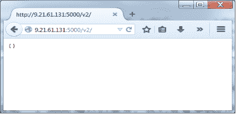
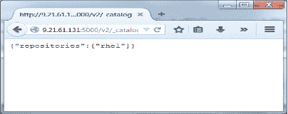
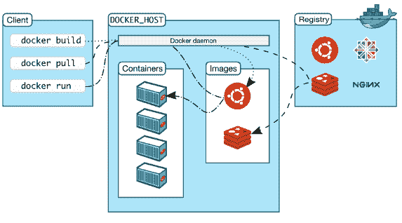
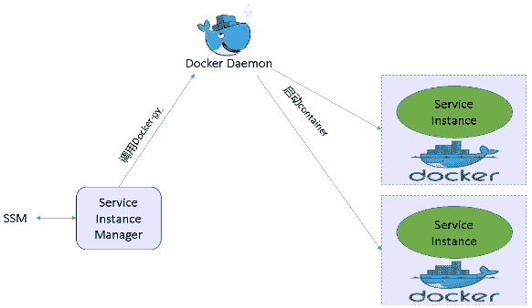

# Docker 在分布式和大数据框架中的应用

> 原文：[`developer.ibm.com/zh/articles/os-cn-docker-distributed-bigdata/`](https://developer.ibm.com/zh/articles/os-cn-docker-distributed-bigdata/)

## 简介

Docker 容器技术也是一种虚拟化技术，相比 KVM，VMWare 虚拟机，Docker 实现了一种轻量的虚拟化技术，具有很好的性能和安全性。基于 Docker 可以实现 CaaS（Containers as a Service）微服务架构，一般一个应用程序会提供多个服务，包括内部服务和外部服务，将所有的服务单独用容器包装起来，分别部署和运行，这样简化了整个应用程序维护的复杂度，同时解耦了模块之间的耦合性，便于不同模块单独开发和维护升级。

##### 表 1.Docker 相关的术语

| 术语 | 简述 |
| --- | --- |
| Docker | Docker 是一个开源的应用容器引擎，让开发者可以打包他们的应用以及依赖包到一个可移植的容器中，然后发布到任何流行的 Linux 机器上，也可以实现虚拟化。 |
| Docker Container | Docker 容器由 Docker 镜像创建，Docker 容器持有应用程序运行所需要的所有环境。Docker 容器有 run，started，stopped，moved，和 deleted 这几种状态，每一个容器是一个隔离的，安全的应用程序运行平台，Docker 容器是 Docker 运行的组件。 |
| Docker Image | 一个 Docker 镜像是一个只读的模板，例如，一个容器可以包含一个 Ubuntu 操作系统和 Apache 程序。一个 Docker 镜像可以用来创建多个 Docker 容器。Docker 提供了简单的方式去编译一个新的 Docker 镜像或者更新一个新的镜像，同时可以从 Docker Registry 下载不同的镜像。 |
| Docker Registry | Docker 仓库是 Docker 官方提供的一个开源程序，用来存储和分发 Docker 镜像。 |
| Docker Hub | Docker 官方提供的公有 Docker Registry。 |

Docker 解决方案主要体现在如下三个方面：

*   编译

Docker 允许您用微服务方式组织您的应用程序，而不用担心上线环境和测试环境不一致，并且不用关心运行平台和语言，Docker 镜像是跨平台的，真正实现一次编译，到处运行。

*   装运

通过 Docker 可以设计应用程序开发，测试，发布的整个周期，并且用统一的用户接口去管理，Docker 提供了两个非常重要的概念，Docker 容器和 Docker 镜像，目前几乎成为企业标准。

*   运行

Docker 可以部署可扩展的服务，Docker 容器具有很好的隔离性，程序运行在 Docker 容器中更加安全可靠，可以部署运行在各种 Linux X64 平台上。

下面以一个典型的 Web 应用程序为例，来说明 Docker 如何用来发布和运行应用程序。通常 Web 程序包含一个或多个 Apache 程序用来对外提供服务，一个存储模块为 Apache 提供服务，一个数据库服务，之前这些服务都是安装在物理机上，需要在物理机上配置好权限和运行时环境，而且确保不同的程序之间的依赖不存在冲突（比如：不同的程序有可能需要不同 Python 版本）。如果使用 Docker，我们只需要在物理机上安装 Docker，将 Apache 和 Redis 应用放在单独的 Docker 镜像中。Docker 镜像可以用私有 Docker Registry 来存储和分发，Private Docker Registry 可以从 Docker Hub 同步一些镜像，这样 Docker host 在下载 Docker 镜像的时候可以直接从 Private Docker Registry 下载，速度会比较快。数据库这种基础数据服务可以不用放在 Docker 容器里面运行。这样搭建起来的应用程序结构清晰，升级以及管理维护会很简单（只需要更新 Docker Registry 中的 Docker 镜像即可）。

##### 图 1\. 程序部署模型


## 安装 Docker

由于 Docker 是基于 cGroup，namespace 等 Linux 内核技术实现对 Linux Container 的管理引擎，目前运行在 64 位的系统架构上，Docker 目前最新版本为 1.11.1，需要内核版本为 3.10 及以上，系统版本过低需要升级内核版本或更换系统。本文以企业最常用的 RedHat7.1 操作系统为例，来说明 Docker 的安装过程，其它操作系统请参考 [Docker 官方文档](https://docs.docker.com/engine/installation/linux/) 。

1.  检查内核版本

    ```
     $ uname -r
     3.10.0-229.el7.x86_64 
    ```

2.  安装 Docker

    Docker 从 1.10 版本开始需要依赖 libsystemd 209 版本，如果低于版本，可以选择安装 Docker 1.9.1 版本。

    ```
     $ sudo tee /etc/yum.repos.d/docker.repo <<-EOF
     [dockerrepo]
     name=Docker Repository
     baseurl=https://yum.dockerproject.org/repo/main/centos/7
     enabled=1
     gpgcheck=1
     gpgkey=https://yum.dockerproject.org/gpg
     EOF

     $ sudo yum install -y docker-engine-1.9.1
     Loaded plugins: langpacks, product-id, subscription-manager

     ......

     Installed:
      docker-engine.x86_64 0:1.9.1-1.el7.centos

     Dependency Installed:
      audit-libs-python.x86_64 0:2.4.1-5.el7 checkpolicy.x86_64 0:2.1.12-6.el7
                     docker-engine-selinux.noarch 0:1.11.1-1.el7.centos
                          libcgroup.x86_64 0:0.41-8.el7 libsemanage-python.x86_64 0:2.1.10-16.el7
      policycoreutils-python.x86_64 0:2.2.5-15.el7 python-IPy.noarch 0:0.75-6.el7
                                                       setools-libs.x86_64 0:3.3.7-46.el7

     Complete! 
    ```

3.  运行 Docker 服务并验证

    ```
     $ sudo chkconfig docker on
     Note: Forwarding request to 'systemctl enable docker.service'.
     ln -s '/usr/lib/systemd/system/docker.service' '/etc/systemd/system/
                                   multi-user.target.wants/docker.service'

     $ sudo service docker start
     Redirecting to /bin/systemctl start docker.service

     $ docker run hello-world
     Unable to find image 'hello-world:latest' locally
     latest: Pulling from library/hello-world
     79112a2b2613: Pull complete
     4c4abd6d4278: Pull complete
     Digest: sha256:4f32210e234b4ad5cac92efacc0a3d602b02476c754f13d517e1ada048e5a8ba
     Status: Downloaded newer image for hello-world:latest

     Hello from Docker.
     This message shows that your installation appears to be working correctly.

     To generate this message, Docker took the following steps:
      1\. The Docker client contacted the Docker daemon.
      2\. The Docker daemon pulled the "hello-world" image from the Docker Hub.
      3\. The Docker daemon created a new container from that image which runs the
      executable that produces the output you are currently reading.
      4\. The Docker daemon streamed that output to the Docker client, which sent it
      to your terminal.

     To try something more ambitious, you can run an Ubuntu container with:
      $ docker run -it ubuntu bash

     Share images, automate workflows, and more with a free Docker Hub account:
      https://hub.docker.com

     For more examples and ideas, visit:
      https://docs.docker.com/engine/userguide/ 
    ```

### 打包应用程序到 Docker 镜像中

将应用程序运行在 Docker 中首先要考虑的问题就是如何将应用程序相关的文件打包到 Docker image 中。在 Docker 容器中访问文件有两种方式：一种不用拷贝文件到 Docker image，直接在 Docker container 启动的时候 mount 到 Docker container 中（docker run -v /host_data:/container_dir）；另一种就是 build Docker image 的时候直接将相关文件拷贝到 Docker image 中。对于以 Docker image 方式发布整个应用程序的场景来说，还是需要构建一个新的 Docker image 并且将所有相关文件和运行时依赖拷贝到 Docker image 中。

一般来说，可以通过 Docker Packer 或者 Dockerfile 来构建新的 Docker Image，本节通过 Docker CLI，使用 Dockerfile 来构建 Docker Image。

构建产品安装包的 Dockerfile：

```
FROM rhel
# RUN 命令可以执行 Linux 命令，用来向 image 中安装软件，改变 linux 配置等
# 同时可以安装 ssh-server 和其它 tools
# 配置 ssh 并确保 ssh 服务正确运行
RUN useradd -m usera \
 && yum install -y openssh-server which net-tools sudo wget hostname tar openssh-clients \
 && sed -i 's/UsePAM yes/UsePAM no/g' /etc/ssh/sshd_config \
 && ssh-keygen -t dsa -f /etc/ssh/ssh_host_dsa_key \
 && ssh-keygen -t rsa -f /etc/ssh/ssh_host_rsa_key \
&& mkdir /var/run/sshd
# ADD 命令用来将宿主机上的文件拷贝到容器中
ADD user.dat /opt/user.dat
# 对于比较大的安装包，一般采用网络下载的方式传输到镜像中，安装完后在同一行进行删除
# 每一个 Dockerfile 中的命令会在 Docker image 中生成一个新 layer，
# 在后面生成的 layer 中对文件的删除不会减少 image 的大小，
# 所以为了保证生成的 image 尽可能的小，把尽可能多的操作在同一个 RUN 命令中完成。
RUN wget -O wget -O /opt/pssasetup.bin https://www.myprivate.com/pssasetup.bin --no-check-certificate \
 && /opt/pssasetup.bin --quiet \
 && rm -f /opt/pssasetup.bin
USER usera
EXPOSE 22
CMD ["/usr/sbin/sshd", "-D"] 
```

使用命令来构建 Docker 镜像：

```
$ docker -t myimage –f ./Dockerfile /opt 
```

查看镜像已经构建成功：

```
$ docker images
REPOSITORY TAG IMAGE ID CREATED VIRTUAL SIZE
myimage latest dfe4a9ffe0f8 3 weeks ago 641 MB 
```

Docker image 构建成功后，可以将该 image 发布到 Docker registry 中，便于集群中的其它 host 访问，下面会介绍如何搭建私有 Docker registry。

### 搭建 Docker Registry

默认情况下，用 Docker 镜像启动 container 的时候，Docker daemon 首先检查本地是否已经有该 Docker image，如果没有就从 Docker hub 下载。如果 image 名称带有私有 Docker registry 前缀，比如：127.0.0.5:5000:/ubuntu，那么 Docker daemon 会直接从私有 Docker registry 127.0.0.5:5000 下载 image。如果 Docker hub 和私有 Docker registry 都不能访问，还可以通过 docker save/docker load 命令以 tar 文件的方式导出/导入 Docker image 到不同的机器上去。

Docker `提供了仓库管理的程序，用户可直接通过启动` registry `容器来部署私有仓库服务，` registry `程序会把` Docker image `存储在容器目录` /var/lib/registry `下，如果想要将` regitry `中的` image `存储到本机，可以` mount `一个本机目录到容器该目录（启动容器的时候通过参数`-v /opt/registry: /var/lib/registry `）` ， `默认情况下，` registry `采用` 5000 `端口作为服务端口，我们通过端口映射（`-p 5000:5000 `）将容器的` 5000 `端口映射到本机的` 5000 `端口。`

后台启动 registry 服务：

```
$ docker run -d --restart=always -v /opt/registry:/var/lib/registry -p 5000:5000 registry:2.1.1
Unable to find image 'registry:2.1.1' locally
2.1.1: Pulling from library/registry
c63fb41c2213: Pull complete
99fcaefe76ef: Pull complete
5a4526e952f0: Pull complete
1d073211c498: Pull complete
b7bd2ae93cea: Pull complete
d2c7f83c9942: Pull complete
4ed3b9c6a5db: Pull complete
ea256384d56e: Pull complete
beda0ae408b7: Pull complete
30c0b9757d78: Pull complete
5d165b8e4b20: Pull complete
Digest: sha256:4a9bc5424fa7cc4fafd88b5d8dfb102ceb339e8f418fdeca7f094c86db284f1c
Status: Downloaded newer image for registry:2.1.1
ea945cc2db69eb5f62f61b013863a9312a0a0fbdde0116577582ff38b90c144a 
```

registry 服务启动后其实是在后台启动了一个容器，Docker 官方已经把 registry 相关的程序打包到名为 registry 的 docker image 中，这样用户可以很方便的部署和启动 registry 程序，通过 Docker image 打包发布程序也是目前比较流行的做法，有好多开源产品将自己的产品打包并在 Docker hub 中发布，比如 Docker 的第三方网络管理软件 weave，可以在 Docker hub 中 search 到 weaveworks 相关的 image。

```
$ docker search weaveworks
NAME DESCRIPTION STARS OFFICIAL AUTOMATED
weaveworks/scope Weave Scope - Monitoring, visualisation & ... 8
weaveworks/weave Weave Net - container networking and servi... 8 
```

查看 registry 容器处于运行状态。

```
$ docker ps
CONTAINER ID IMAGE COMMAND CREATED STATUS PORTS NAMES
ea945cc2db69 registry:2.1.1 "/bin/registry /etc/d"
                      7 seconds ago Up 5 seconds 0.0.0.0:5000->5000/tcp fervent_archimedes 
```

registry 容器启动后，本机的 5000 端口映射到容器的 5000 端口，查看本机和容器都有一个 5000 端口的监听。registry 提供 REST 接口，可以输入网址访问 [`9.21.60.110:5000/v2/。`](http://9.21.60.110:5000/v2/。)

```
$ netstat -anp | grep 5000
tcp6 0 0 :::5000 :::* LISTEN 29687/docker-proxy

$ docker exec ea945cc2db69 netstat -anp | grep 5000
tcp6 0 0 :::5000 :::* LISTEN 1/registry
图 2.Web 访问私有仓库 
```

##### 图 2\. Web 访问私有仓库



接下来向这个 registry 服务中 push 一个 image，首先将需要 push 的 image 打个 tag，这个 tag 会成为该镜像在新的 registry 的名称。

为镜像 rhel 打 tag 并以 registry 地址作为前缀。

```
$ docker tag rhel 9.21.61.131:5000/rhel 
```

通过 docker push 命令将 image 传输到仓库中。

```
$ docker push 9.21.61.131:5000/rhel
The push refers to a repository [9.21.61.131:5000/rhel] (len: 1)
95612a3264fc: Pushed
latest: digest: sha256:fbffddc419984335aa428abf11169f996618fe02a4954c28454daab5686dfdcc size: 1569 
```

如果在其它机器上 push 的时候可能会失败，原因是与私有仓库的默认交互方式是 https，而私有仓库主机只提供 http 服务。可以在客户端 Docker 的启动配置文件中加入参数：-–insecure-registry=9.21.61.131:5000 来规避这个问题：

```
$ vi /usr/lib/systemd/system/docker.service
[Service]
Type=notify
ExecStart=/usr/bin/docker daemon -H fd:// --insecure-registry=9.21.61.131:5000

重启 Docker
$ systemctl daemon-reload
$ service docker restart 
```

再次上传 Docker 镜像即可成功。

在其它机器上，我们通过带有 registry 地址前缀的这个新名称来访问这个镜像。

```
$ docker images 9.21.61.131:5000/rhel
REPOSITORY TAG IMAGE ID CREATED VIRTUAL SIZE
9.21.61.131:5000/rhel latest 95612a3264fc 6 weeks ago 203.3 MB 
```

访问 registry 的 REST 接口可以看到镜像列表：

##### 图 3\. Web 查询私有仓库镜像



## Docker 与其他产品集成

Docker 使用 C/S 架构，Docker 引擎（Docker Daemon）作为服务器端，主要用来构建、发布、分发和运行 Docker 容器；而 Docker 客户端，目前提供 CLI 和 Remote API 两种方式，通过对 Docker Daemon 的通信，来控制管理远程服务器的进程。如下图所示，其中 Docker 客户端和 Server 可以运行在同一系统上，也可以通过 Docker 客户端连接远程的 Docker Daemon，他们之间主要通过 Socket 和 RESTful API 进行通信。

##### 图 4\. Docker 架构模型



Docker CLI 是作为 Docker 的主要客户端，主要负责与 Docker 引擎进行通信，从而构建、发布和管理 Docker 容器。

Docker-py 是另一个开源项目，它通过 Python 实现了对 Docker REST API 访问的封装，可以实现和 Docker CLI 相同的功能，如镜像的下载、安装、容器的运行、停止等管理，从而实现与 Docker 的集成。

下面将结合具体的企业级产品 IBM Platform Symphony 及开源 Hadoop Yarn 说明 Docker 如何与产品集成。

### 通过 docker-py 集成 Docker 到产品中（IBM Platform Symphony）

IBM Platform Symphony 是一款强大的企业级管理软件，用于在可扩展的共享网格上运行各种各样的分布式应用程序和大数据分析。它可加速数十个同时运行的应用，以加快实现成果并更好地利用所有可用资源。本节主要以 IBM Platform 为例，说明 Docker 如何通过 docker-py 集成到产品中去的。

在负载调度和管理方面，客户端通过 Symphony 提供的 API 发送计算请求并等待接收计算结果。Symphony 初始化 Service 并运行 Client 的请求，从 Service 得到结果再传递回 Client。

Service Session Manager (SSM) 负责连接 client application 和计算节点之间的任务输入输出，从 EGO 获得 session 需要的资源、记录状态和 session、task 的进展情况，管理 SIM 的生命周期，管理与 resource manager 的交互。Service 实例化之后产生一个 service instance manager。SIM 是被 SSM 创建和销毁的，它开始和管理一个 service instance 的生命周期并监控实例的健康运行，传送 session manager 和 service instance 之间的数据。

##### 图 5\. IBM Symphony Platform 组件交互图


IBM Platform Symphony 通过 Docker-py API，与 Docker Daemon 进行通信，将每一个 Service 运行在 Docker 容器里面，并且这些容器以不同的 OS 和用户运行。针对多 Application 的情况，将 Service 运行在 Docker Container 中，也可以充分利用 Docker Container 在隔离上的的优势，使 Service 运行具有更好的安全性。

如下图所示，一个 Host 上运行着多个 Service，之前这些 Service 直接由 SIM（Service Instance Manager）启动，现在 SIM 直接启动 Docker container，Service 运行在 container 中。

##### 图 6\. IBM Platform Symphony Service 运行方式



Docker 的 API 有版本号，通过 docker version 命令查看可以看到 docker 1.9.1 使用的 API version 为 1.21，对应的 docker-py 版本为 1.7.2。

```
$ docker version
Client:
 Version: 1.9.1
 API version: 1.21
 Go version: go1.4.2
 Git commit: a34a1d5
 Built: Fri Nov 20 13:25:01 UTC 2015
 OS/Arch: linux/amd64

Server:
 Version: 1.9.1
 API version: 1.21
 Go version: go1.4.2
 Git commit: a34a1d5
 Built: Fri Nov 20 13:25:01 UTC 2015
 OS/Arch: linux/amd64 
```

下载 [docker-py-1.7.2](https://github.com/docker/docker-py/archive/1.7.1.zip) 并安装，安装需要 Python 版本大于 3.5。

```
$ ../Python-3.5.0/python ./setup.py install 
```

Docker-py 通过 Socket 与 Docker Daemon 建立连接，Docker Daemon 启动时打开的 Socket 为 unix:///var/run/docker.sock，使用该 Socket 连接 Docker Daemon 并列出本机 Docker image（对应于 docker images 命令）。

```
$ ../Python-3.5.0/python
Python 3.5.0 (default, May 11 2016, 10:42:46)
[GCC 4.8.5 20150623 (Red Hat 4.8.5-4)] on linux
Type "help", "copyright", "credits" or "license" for more information.
>>> from docker import Client
>>> client = Client(base_url='unix://var/run/docker.sock')
>>> for img in client.images() :
... print("%s" % img['RepoTags'])
...
['myimage:latest']
['docker.io/weaveworks/weave:1.5.0']
['docker.io/weaveworks/plugin:1.5.0']
['docker.io/weaveworks/weaveexec:1.5.0']
['docker.io/weaveworks/weavedb:latest']
['docker.io/busybox:latest'] 
```

通过 docker-py 接口查找 Docker hub 中的 image。

```
$ ../Python-3.5.0/python
Python 3.5.0 (default, May 11 2016, 10:42:46)
[GCC 4.8.5 20150623 (Red Hat 4.8.5-4)] on linux
Type "help", "copyright", "credits" or "license" for more information.
>>> from docker import Client
>>> client = Client(base_url='unix://var/run/docker.sock')
>>> for img in client.search('ibm-java'):
... print("%s (%s)" % (img['name'], img['star_count']))
...
stackinabox/ibm-java (0)
apexits/ubuntu-was-liberty-8.5.5-ibm-jdk8 (0)
>>> 
```

用 docker-py 集成 Docker 最重要的是用来管理（启动和停止）容器，下面我们来看下如何用 docker-py 接口启动一个容器，通过 Docker 命令启动容器只需要用到一个 docker run 命令，而通过 remote API 启动容器需要用到两个接口 client.create_container 和 client.start(container)。这样如果有些容器不需要启动，则可以只创建出来，能够节省空间。像有些容器只用来存储数据，则只需要创建出来，不需要启动。

```
>>> imgs = client.images(cfilters={'RepoTags':'r`ubuntu'}) # Retrieve image reference
>>> len(imgs)
1
>>> iid = imgs[0]['Id'] # Obtain Image ID
>>> container = client.create_container(iid) # Create Container
>>> container
{u'Id': u'd965a507...', u'Warnings': None}
>>> client.start(container) # Start Container
# Or you can run container this way
>>> container = client.run(image=iid, name='my-container')
>>> container
{u'Id': u'169ac0d341a5a...', 'name': 'my-container', u'Warnings': None} 
```

将程序运行在容器中需要考虑的元素有：镜像、容器用户、容器网络（采用 host mode network 使 Service Instance 具有和之前相同的网络环境）以及容器需要 mount 的文件目录。为了用户直观方便地使用这种功能，Symphony 通过 PMC 提供了这种配置界面，通过 GUI 页面配置不同的 Docker Container 定义，如下图所示。

##### 图 7\. 通过 Docker Container 定义配置页面


### 通过 Docker CLI 集成 Docker 到产品中（Open Source YARN）

作为下一代新的 MapReduce 框架 YARN，把资源调度和 task 管理监控分离开来，由资源管理器 Resource Manager 负责资源调度，每一个 application(job) 由一个 App Master 负责对 task 进行调度管理监控，并且可以监控 App Master 的状态，Node Manager 主要负责节点上的资源管理，启动 Container 运行 task 计算，上报资源、container 情况给 RM 和任务处理情况给 AM。

##### 图 8\. YARN 的架构模型


Docker 基于 Linux Container 技术整合了一组易用的接口用于构建非常轻量级的虚拟机。Docker Container Executor（DCE）使得 Yarn Node Manager 服务可以将其 container 进程运行在 Docker 容器中。这样可以有以下好处：

1.  用户可以定制 Yarn Container 的运行环境。

    用户可以自定义运行 Yarn container 的 Docker 镜像，定制安装不同版本的软件包，如 Perl、Python、Java 等，而不用担心与其他运行环境的冲突。

2.  Node Manager 与 Yarn Container 环境的隔离

    在传统的 Yarn 环境中，Node Manager 对 Yarn Container 进行监管，且须运行在同一个机子上。他们之间的环境是共享的。而通过在 Docker Container 中指定运行作业所需要的环境和依赖库，将 Node Manager 和 Yarn Container 运行其中，实现了它们真正意义上的物理隔离。

Docker Container Executor 只能在非 Kerberos（安全）模式的 Yarn 和 HDFS 中运行，一旦 DCE 检测到运行在安全模式下，服务会立刻退出。

DCE 需要 Node Manager 节点上运行着 Docker 服务和 Docker client 用于启动 Docker container。且 Node Manager 和 Container 就是通过 Docker CLI 的方式来启动。

Yarn 启动的 Docker 容器同样使用了 host 模式的网络，同时 mount 了 log 目录、工作目录和一些本地目录到容器中，将这些参数全部拼在 docker run 的命令行中用 shell 启动。

Yarn 中启动 Docker Container 的代码示例：

```
public int launchContainer(Container container,
 Path nmPrivateContainerScriptPath, Path nmPrivateTokensPath,
 String userName, String appId, Path containerWorkDir,
 List<String> localDirs, List<String> logDirs) throws IOException {
 String localDirMount = toMount(localDirs);
 String logDirMount = toMount(logDirs);
 String containerWorkDirMount = toMount(
                        Collections.singletonList(containerWorkDir.toUri().getPath()));
 StringBuilder commands = new StringBuilder();
 String commandStr = commands.append(dockerExecutor)
 .append(" ")
 .append("run")
 .append(" ")
 .append("--rm --net=host")
 .append(" ")
 .append(" --name " + containerIdStr)
 .append(localDirMount)
 .append(logDirMount)
 .append(containerWorkDirMount)
 .append(" ")
 .append(containerImageName)
 .toString();
 String dockerPidScript = "`" + dockerExecutor + " inspect
                          --format {{.State.Pid}} " + containerIdStr + "`";
 // Create new local launch wrapper script
 LocalWrapperScriptBuilder sb =
 new UnixLocalWrapperScriptBuilder(containerWorkDir, commandStr, dockerPidScript);
 Path pidFile = getPidFilePath(containerId);
 if (pidFile != null) {
 sb.writeLocalWrapperScript(launchDst, pidFile);
 } else {
 LOG.info("Container " + containerIdStr
 + " was marked as inactive. Returning terminated error");
 return ExitCode.TERMINATED.getExitCode();
 }

 ShellCommandExecutor shExec = null;
 try {
 lfs.setPermission(launchDst,
 ContainerExecutor.TASK_LAUNCH_SCRIPT_PERMISSION);
 lfs.setPermission(sb.getWrapperScriptPath(),
 ContainerExecutor.TASK_LAUNCH_SCRIPT_PERMISSION);

 // Setup command to run
 String[] command = getRunCommand(sb.getWrapperScriptPath().toString(),
 containerIdStr, userName, pidFile, this.getConf());
 if (LOG.isDebugEnabled()) {
 LOG.debug("launchContainer: " + commandStr + " " + Joiner.on(" ").join(command));
 }
 shExec = new ShellCommandExecutor(
 command,
 new File(containerWorkDir.toUri().getPath()),
 container.getLaunchContext().getEnvironment()); // sanitized env
 if (isContainerActive(containerId)) {
 shExec.execute();
 } else {
 LOG.info("Container " + containerIdStr +
 " was marked as inactive. Returning terminated error");
 return ExitCode.TERMINATED.getExitCode();
 }
} 
```

需要以下步骤来确保 Node Manager 和 Application Master 运行在 Docker Container 中。

**步骤一，下载 Docker 镜像**

为了避免超时，作业依赖的 Docker 镜像必须在 Node Manager 启动前预先下载好，运行以下命令下载 [Hadoop](http://lib.csdn.net/base/20) docker 镜像：

```
# sudo docker pull sequenceiq/hadoop-docker:2.4.1 
```

**步骤二，配置 yarn-site.xml**

在 yarn-site.xml 中增加如下配置：

```
<property>
 <name>yarn.nodemanager.docker-container-executor.exec-name</name>
  <value>/usr/bin/docker</value>
  <description>
 Name or path to the Docker client. This is a required parameter. If this is empty,
     user must pass an image name as part of the job invocation(see below).
  </description>
</property>

<property>
  <name>yarn.nodemanager.container-executor.class</name>
  <value>org.apache.hadoop.yarn.server.nodemanager.DockerContainerExecutor</value>
  <description>
     This is the container executor setting that ensures that all
jobs are started with the DockerContainerExecutor.
  </description>
</property> 
```

需要集群管理员注意目前 DCE 不提供用户命名空间隔离，这意味着在 Yarn container 中以 root 用户运行的程序会获得 Node Manager 的 root 权限，换句话说，DCE 目前没有提供比 Yarn 默认的 Container Executor 更好的安全保证。

**步骤三：提交作业**

```
hadoop jar $HADOOP_PREFIX/share/hadoop/mapreduce/hadoop-mapreduce-examples-2.6.0.jar \
 teragen \
  -Dmapreduce.map.env="yarn.nodemanager.docker-container-executor.image-name=
                            sequenceiq/hadoop-docker:2.4.1" \
 -Dyarn.app.mapreduce.am.env="yarn.nodemanager.docker-container-executor.image-name=
                             sequenceiq/hadoop-docker:2.4.1" \
  1000 \
  /teragen_out_dir 
```

在执行过程中，我们可以 check node manager 上的 container 状态：

```
# docker ps
CONTAINER ID IMAGE COMMAND CREATED STATUS PORTS NAMES
c8168112dc78 sequenceiq/hadoop-docker:2.4.1 "bash /tmp/hadoop-roo"
                                    6 seconds ago Up 4 seconds container_1462644399680_0001_01_000003 
```

执行成功后，可以在 yarn 的日志中验证 Docker 启动的 containers。

## 结束语

随着 Docker 容器技术带来的革命，分布式和大数据产品如何与 Docker 容器集成成为了一个持续关注的焦点话题。Docker 提供了两种与外界的交互方式，Command Line 和 docker-py，本文以 IBM Platform Symphony 和 Open Source 的 Yarn 为例，来说明如何有效的利用这两种方式将现有产品与 Docker 容器集成起来，从而阐述集成 Docker 容器所带来的优势。不过，目前 Docker 集成还有需要改进的空间，比如安全和网络方面的问题，同时集成方案仍未十分成熟，仍然需要完善和进一步改进，希望未来可以得到更多的关注和发展。