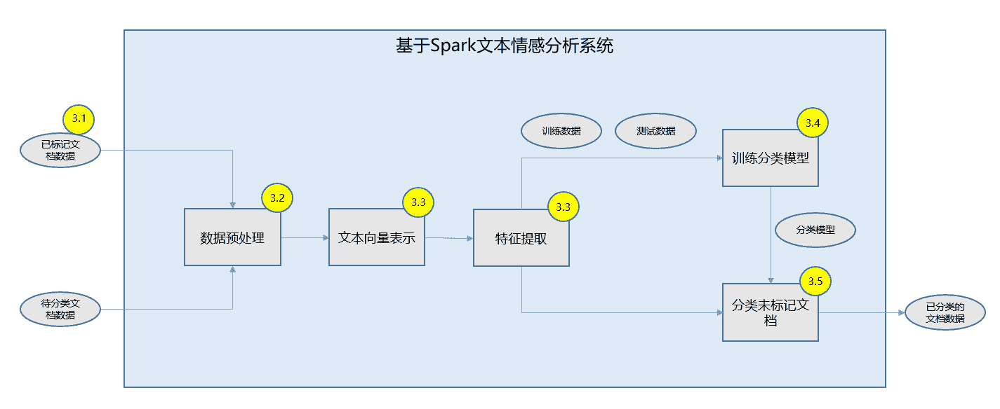
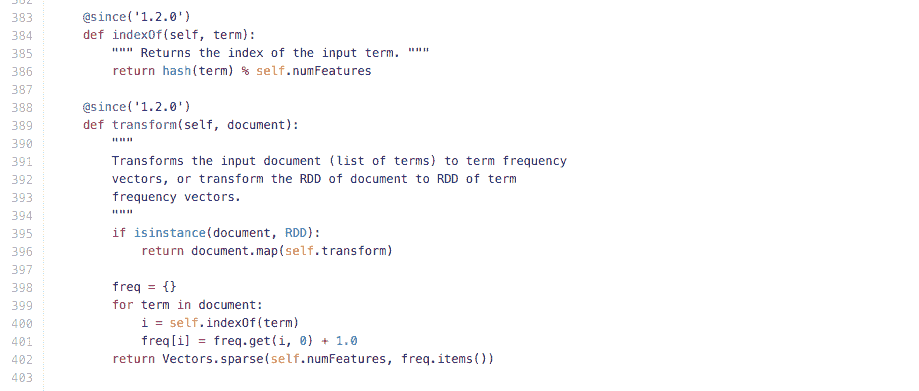

# 基于 Spark 的文本情感分析

> 原文：[`developer.ibm.com/zh/articles/cc-1606-spark-seniment-analysis/`](https://developer.ibm.com/zh/articles/cc-1606-spark-seniment-analysis/)

IBM 公司在 2015 年对外宣告了一个新的科技和商务时代的来临—认知时代。这个巨大的转变，来自 IBM 对技术和商业领域的三个重要的洞察力^(［1］)。第一，这个世界被数据所充斥。第二，这个世界通过代码被改造。第三，认知计算的出现。其中，认知计算可以：

*   通过感知与互动，理解非结构化数据
*   通过生成假设、评估、辩证、和建议来推理
*   从专家培训、每一次互动、及持续取得数据中学习。

本文描述了一个基于 Spark 构建的认知系统：文本情感分析系统，分析和理解社交论坛的非结构化文本数据。

## 基于 Spark 的文本情感分析

文本情感分析是指对具有人为主观情感色彩文本材料进行处理、分析和推理的过程。文本情感分析主要的应用场景是对用户关于某个主题的评论文本进行处理和分析。比如，人们在打算去看一部电影之前，通常会去看豆瓣电影板块上的用户评论，再决定是否去看这部电影。另外一方面，电影制片人会通过对专业论坛上的用户评论进行分析，了解市场对于电影的总体反馈。本文中文本分析的对象为网络短评，为非正式场合的短文本语料，在只考虑正面倾向和负面倾向的情况下，实现文本倾向性的分类。

文本情感分析主要涉及如下四个技术环节。

1.  收集数据集：本文中，以分析电影《疯狂动物城》的用户评论为例子，采集豆瓣上《疯狂动物城》的用户短评和短评评分作为样本数据，通过样本数据训练分类模型来判断微博上的一段话对该电影的情感倾向。
2.  设计文本的表示模型：让机器”读懂”文字，是文本情感分析的基础，而这首先要解决的问题是文本的表示模型。通常，文本的表示采用向量空间模型，也就是说采用向量表示文本。向量的特征项是模型中最小的单元，可以是一个文档中的字、词或短语，一个文档的内容可以看成是它的特征项组成的集合，而每一个特征项依据一定的原则都被赋予上权重。
3.  选择文本的特征：当可以把一个文档映射成向量后，那如何选择特征项和特征值呢？通常的做法是先进行中文分词（­­­­本文使用 jieba 分词工具），把用户评论转化成词语后，可以使用 TF-IDF（Term Frequency–Inverse Document Frequency，词频-逆文档频率）算法来抽取特征，并计算出特征值。
4.  选择分类模型：常用的分类算法有很多，如：决策树、贝叶斯、人工神经网络、K-近邻、支持向量机等等。在文本分类上使用较多的是贝叶斯和支持向量机。本文中，也以这两种方法来进行模型训练。

## 为什么采用 Spark

传统的单节点计算已经难以满足用户生成的海量数据的处理和分析的要求。比如，豆瓣网站上《疯狂动物城》电影短评就有 111421 条，如果需要同时处理来自多个大型专业网站上所有电影的影评，单台服务器的计算能力和存储能力都很难满足需求。这个时候需要考虑引入分布式计算的技术，使得计算能力和存储能力能够线性扩展。

Spark 是一个快速的、通用的集群计算平台，也是业内非常流行的开源分布式技术。Spark 围绕着 RDD（Resilient Distributed Dataset）弹性分布式数据集，扩展了广泛使用的 MapReduce^(［5］)计算模型，相比起 Hadoop^(［6］)的 MapReduce 计算框架，Spark 更为高效和灵活。Spark 主要的特点如下：

1.  内存计算：能够在内存中进行计算，它会优先考虑使用各计算节点的内存作为存储，当内存不足时才会考虑使用磁盘，这样极大的减少了磁盘 I/O，提高了效率。
2.  惰性求值：RDD 丰富的计算操作可以分为两类，转化操作和行动操作。而当程序调用 RDD 的转化操作（如数据的读取、Map、Filter）的时候，Spark 并不会立刻开始计算，而是记下所需要执行的操作，尽可能的将一些转化操作合并，来减少计算数据的步骤，只有在调用行动操作（如获取数据的行数 Count）的时候才会开始读入数据，进行转化操作、行动操作，得到结果。
3.  接口丰富：Spark 提供 Scala，Java，Python，R 四种编程语言接口，可以满足不同技术背景的工程人员的需求。并且还能和其他大数据工具密切配合。例如 Spark 可以运行在 Hadoop 之上，能够访问所有支持 Hadoop 的数据源（如 HDFS、Cassandra、Hbase）。

本文以 Spark 的 Python 接口为例，介绍如何构建一个文本情感分析系统。作者采用 Python 3.5.0，Spark1.6.1 作为开发环境，使用 Jupyter Notebook^(［7］)编写代码。Jupyter Notebook 是由 IPython Notebook 演化而来，是一套基于 Web 的交互环境，允许大家将代码、代码执行、数学函数、富文档、绘图以及其它元素整合为单一文件。在运行 pyspark 的之前，需要指定一下 pyspark 的运行环境，如下所示：

##### 清单 1\. 指定 pyspark 的 ipython notebook 运行环境

```
export PYSPARK_PYTHON=ipython3 PYSPARK_DRIVER_PYTHON_OPTS="notebook" 
```

接下里就可以在 Jupyter Notebook 里编写代码了。

## 基于 Spark 如何构建文本情感分析系统

在本文第一章，介绍了文本情感分析主要涉及的四个技术环节。基于 Spark 构建的文本分类系统的技术流程也是这样的。在大规模的文本数据的情况下，有所不同的是文本的特征维度一般都是非常巨大的。试想一下所有的中文字、词有多少，再算上其他的语言和所有能在互联网上找到的文本，那么文本数据按照词的维度就能轻松的超过数十万、数百万维，所以需要寻找一种可以处理极大维度文本数据的方法。

在本文后续章节中，将依次按照基于 Spark 做数据预处理、文本建模、特征提取、训练分类模型、实现待输入文本分类展开讨论。系统的上下文关系图如图 1 所示，系统的功能架构图如图 2 所示。

##### 图 1\. 基于 Spark 文本情感分析系统上下文


##### 图 2\. 基于 Spark 文本情感分析系统功能架构图



### 爬取的数据说明

为了说明文本分类系统的构建过程，作者爬取了豆瓣网络上《疯狂动物城》的短评和评分（ [`movie.douban.com/subject/25662329/comments`](https://movie.douban.com/subject/25662329/comments) ）。示例数据如下所示：

##### 表 1\. 示例数据

| 评分 | 评论文本 |
| --- | --- |
| 5 | 做冰棍那机智的不像话！！！全片最爱！！！想吃！！！ |
| 5 | 绝对的好片子裂墙推荐。实在是因为另一场满了…随手挑了这个片子。真是 5 分钟一小笑 10 分钟哄堂大笑。看那个又懒又慢树獭简直要锤墙了。旁边法国妹子精辟的吐槽！看！这是我们法国人。我要憋到内伤了。最后散场大家都静坐着等着整首歌放完…五星好评。2016 年度十佳。 |
| 5 | 不要看任何影评，如果可以预告片都别看，直接买票就好了。你要啥这电影里有啥！ |
| 3 | 最精彩的动画是用想象力拍出真实世界难以实现的故事，而不是用动物化填充一段如果是真人就普通到不能再普通的烂俗故事。笑料有，萌趣有，但更有的是莫名其妙的主旋律和政治正确，恐怕没有评分所体现的那么出色。 |
| 4 | 换了新领导就是不一样。迪士尼暗黑大电影，洛杉矶罪案片风格和内核。还真是动物乌托邦，美国针对有色人种，欧洲针对难民，天朝针对公知和五毛吗？人设精彩，细节丰富，但要说创意超《头脑特工队》显然就不实事求是了。 |
| …… | ……………… |

表格中每一行为一条评论数据，按照”评分，评论文本”排放，中间以制表符切分，评分范围从 1 分到 5 分，这样的数据共采集了 116567 条。

### 数据预处理

这一节本文是要说明用 Spark 是如何做数据清洗和抽取的。在该子系统中输入为爬虫的数据，输出为包含相同数量好评和坏评的 Saprk 弹性分布式数据集。

Spark 数据处理主要是围绕 RDD(Resilient Distributed Datasets) 弹性分布式数据集对象展开，本文首先将爬虫数据载入到 Spark 系统，抽象成为一个 RDD。可以用 distinct 方法对数据去重。数据转换主要是用了 map 方法，它接受传入的一个数据转换的方法来按行执行方法，从而达到转换的操作它只需要用一个函数将输入和输出映射好，那么就能完成转换。数据过滤使用 filter 方法，它能够保留判断条件为真的数据。可以用下面这个语句，将每一行文本变成一个 list，并且只保留长度为 2 的数据。

##### 清单 2\. Spark 做数据预处理

```
originData=sc.textFile('YOUR_FILE_PATH')
originDistinctData=originData.distinct()
rateDocument=originDistinctData.map(lambda line : line.split('\t')).\
filter(lambda line : len(line)==2) 
```

##### 清单 3\. 统计数据基本信息

```
fiveRateDocument=rateDocument.filter(lambda line : int(line[0])==5)
fiveRateDocument.count() 
```

本文得到，五分的数据有 30447 条，4 分、3 分、2 分、1 分的数据分别有 11711 条，123 条，70 条。打五分的毫无疑问是好评；考虑到不同人对于评分的不同偏好，对于打四分的数据，本文无法得知它是好评还是坏评；对于打三分及三分以下的是坏评。

下面就可以将带有评分数据转化成为好评数据和坏评数据，为了提高计算效率，本文将其重新分区。

##### 清单 4\. 合并负样本数据

```
negRateDocument=oneRateDocument.union(twoRateDocument).\
union(threeRateDocument)
negRateDocument.repartition(1) 
```

通过计算得到，好评和坏评分别有 30447 条和 2238 条，属于非平衡样本的机器模型训练。本文只取部分好评数据，好评和坏评的数量一样，这样训练的正负样本就是均衡的。最后把正负样本放在一起，并把分类标签和文本分开，形成训练数据集

##### 清单 5\. 生̧成训练数̧据集

```
posRateDocument=sc.parallelize(fiveRateDocument.take(negRateDocument.count())).repartition(1)
allRateDocument=negRateDocument.union(posRateDocument)
allRateDocument.repartition(1)
rate=allRateDocument.map(lambda s : ReduceRate(s[0]))
document=allRateDocument.map(lambda s: s[1]) 
```

### 文本的向量表示和文本特征提取

这一节中，本文主要介绍如何做文本分词，如何用 TF-IDF 算法抽取文本特征。将输入的文本数据转化为向量，让计算能够”读懂”文本。

解决文本分类问题，最重要的就是要让文本可计算，用合适的方式来表示文本，其中的核心就是找到文本的特征和特征值。相比起英文，中文多了一个分词的过程。本文首先用 jieba 分词器将文本分词，这样每个词都可以作为文本的一个特征。jieba 分词器有三种模式的分词：

1.  精确模式，试图将句子最精确地切开，适合文本分析；
2.  全模式，把句子中所有的可以成词的词语都扫描出来, 速度非常快，但是不能解决歧义；
3.  搜索引擎模式，在精确模式的基础上，对长词再次切分，提高召回率，适合用于搜索引擎分词。

这里本文用的是搜索引擎模式将每一句评论转化为词。

##### 清单 6\. 分词

```
words=document.map(lambda w:"/".\
join(jieba.cut_for_search(w))).\
map(lambda line: line.split("/")) 
```

出于对大规模数据计算需求的考虑，spark 的词频计算是用特征哈希（HashingTF）来计算的。特征哈希是一种处理高维数据的技术，经常应用在文本和分类数据集上。普通的 k 分之一特征编码需要在一个向量中维护可能的特征值及其到下标的映射，而每次构建这个映射的过程本身就需要对数据集进行一次遍历。这并不适合上千万甚至更多维度的特征处理。

特征哈希是通过哈希方程对特征赋予向量下标的，所以在不同情况下，同样的特征就是能够得到相同的向量下标，这样就不需要维护一个特征值及其下表的向量。

要使用特征哈希来处理文本，需要先实例化一个 HashingTF 对象，将词转化为词频，为了高效计算，本文将后面会重复使用的词频缓存。

##### 清单 7\. 训练词频矩阵

```
hashingTF = HashingTF()
tf = hashingTF.transform(words)
tf.cache() 
```

缺省情况下，实例化的 HashingTF 特征维数 numFeatures 取了 2²⁰次方维，在 spark 的源码中可以看到，HashingTF 的过程就是对每一个词作了一次哈希并对特征维数取余得到该词的位置，然后按照该词出现的次数计次。所以就不用像传统方法一样每次维护一张词表，运用 HashingTF 就可以方便的得到该词所对应向量元素的位置。当然这样做的代价就是向量维数会非常大，好在 spark 可以支持稀疏向量，所以计算开销并不大。

##### 图 3\. HashingTF 源码



词频是一种抽取特征的方法，但是它还有很多问题，比如在这句话中”这几天的天气真好，项目组的老师打算组织大家一起去春游。”的”相比于”项目组”更容易出现在人们的语言中，”的”和”项目组”同样只出现一次，但是项目组对于这句话来说更重要。

本文采用 TF-IDF 作为特征提取的方法，它的权重与特征项在文档中出现的评率成正相关，与在整个语料中出现该特征项的文档成反相关。下面依据 tf 来计算逆词频 idf，并计算出 TF-IDF

##### 清单 8\. 计算 TF-IDF 矩阵

```
idfModel = IDF().fit(tf)
tfidf = idfModel.transform(tf) 
```

至此，本文就抽取出了文本的特征，并用向量去表示了文本。

### 训练分类模型

在这一小节中，本文介绍如何用 Spark 训练朴素贝叶斯分类模型，这一流程的输入是文本的特征向量及已经标记好的分类标签。在这里本文得到的是分类模型及文本分类的正确率。

现在，有了文本的特征项及特征值，也有了分类标签，需要用 RDD 的 zip 算子将这两部分数据连接起来，并将其转化为分类模型里的 LabeledPoint 类型。并随机将数据分为训练集和测试集，60%作为训练集，40%作为测试集。

##### 清单 9\. 生成训练集和测试集

```
zipped=rate.zip(tfidf)
data=zipped.map(lambda line:LabeledPoint(line[0],line[1]))
training, test = data.randomSplit([0.6, 0.4], seed = 0) 
```

本文用训练数据来训练贝叶斯模型，得到 NBmodel 模型来预测测试集的文本特征向量，并且计算出各个模型的正确率，这个模型的正确率为 74.83%。

##### 清单 10\. 训练贝叶斯分类模型

```
NBmodel = NaiveBayes.train(training, 1.0)
predictionAndLabel = test.map(lambda p : (NBmodel.predict(p.features), p.label))
accuracy = 1.0 * predictionAndLabel.filter(lambda x: 1.0 \
if x[0] == x[1] else 0.0).count() / test.count() 
```

可以看出贝叶斯模型最后的预测模型并不高，但是基于本文采集的数据资源有限，特征提取过程比较简单直接。所以还有很大的优化空间，在第四章中，本文将介绍提高正确率的方法。

### 分类未标记文档

现在可以用本文训练好的模型来对未标记文本分类，流程是获取用户输入的评论，然后将输入的评论文本分词并转化成 tf-idf 特征向量，然后用 3.4 节中训练好的分类模型来分类。

##### 清单 11\. 分类未分类文本

```
 yourDocument=input("输入待分类的评论：")
 yourwords="/".join(jieba.cut_for_search(yourDocument)).split("/")
yourtf = hashingTF.transform(yourwords)
yourtfidf=idfModel.transform(yourtf)
print('NaiveBayes Model Predict:',NBmodel.predict(yourtfidf),' 
```

当程序输入待分类的评论：”这部电影没有意思，剧情老套，真没劲, 后悔来看了”

程序输出为”NaiveBayes Model Predict: 0.0”。

当程序输入待分类的评论：”太精彩了讲了一个关于梦想的故事剧情很反转制作也很精良”

程序输出为”NaiveBayes Model Predict: 1.0”。

至此，最为简单的文本情感分类系统就构建完整了。

## 提高正确率的方法

在第三章中，本文介绍了构建文本分类系统的方法，但是正确率只有 74.83%，在这一章中，本文将讲述文本分类正确率低的原因及改进方法。

文本分类正确率低的原因主要有：

1.  文本预处理比较粗糙，可以进一步处理，比如去掉停用词，去掉低频词；
2.  特征词抽取信息太少，搜索引擎模式的分词模式不如全分词模式提供的特征项多；
3.  朴素贝叶斯模型比较简单，可以用其他更为先进的模型算法，如 SVM；
4.  数据资源太少，本文只能利用了好评、坏评论各 2238 条。数据量太少，由于爬虫爬取的数据，没有进行人工的进一步的筛选，数据质量也得不到 100%的保证。

下面分别就这四个方面，本文进一步深入的进行处理，对模型进行优化。

### 数据预处理中去掉停用词

停用词是指出现在所有文档中很多次的常用词，比如”的”、”了”、”是”等，可以在提取特征的时候将这些噪声去掉。

首先需要统计一下词频，看哪些词是使用最多的，然后定义一个停用词表，在构建向量前，将这些词去掉。本文先进行词频统计，查看最常用的词是哪些。

##### 清单 12\. 统计词频

```
text=words.flatMap(lambda w:w)
wordCounts = text.map(lambda word: (word, 1))\
.reduceByKey(lambda a, b: a+b).\
sortBy(lambda x: x[1],ascending=False)
wordCounts.take(10) 
```

通过观察，选择出现次数比较多，但是对于文本情感表达没有意义的词，作为停用词，构建停用词表。然后定义一个过滤函数，如果该词在停用词表中那么需要将这个词过滤掉。

##### 清单 13\. 去掉停用词

`stopwords = set([" ","` 的 `","` 了 `","` 是 `","` 就 `","` 吧 `",......])`

```
def filterStopWords(line):
 for i in line:
 if i in stopwords:
 line.remove(i)
return line
words=words.map(lambda w : filterStopWords(w)) 
```

### 尝试不用的分词模式

本文在分词的时候使用的搜索引擎分词模式，在这种模式下只抽取了重要的关键字，可能忽略了一些可能的特征词。可以把分词模式切换到全分词模式，尽可能的不漏掉特征词，同样的模型训练，正确率会有 1%～2%的提升。

##### 清单 14\. 全分词模式分词

```
words=document.map(lambda w:"/".join(jieba.\
cut(w, cut_all=True))).\
map(lambda line: line.split("/")) 
```

### 更换训练模型方法

在不进行深入优化的情况下，SVM 往往有着比其他分类模型更好的分类效果。下面在相同的条件下，运用 SVM 模型训练，最后得到的正确率有 78.59%。

##### 清单 15\. 用支持向量机训练分类模型

```
SVMmodel = SVMWithSGD.train(training, iterations=100)
predictionAndLabel = test.map(lambda p : (SVMmodel.predict(p.features), p.label))
accuracy = 1.0 * predictionAndLabel.filter(lambda x: 1.0 if x[0] == x[1] else 0.0).count() / test.count() 
```

### 训练数据的问题

本文只是为了演示如何构建这套系统，所以爬取的数据量并不多，获取的文本数据也没有人工的进一步核对其正确性。如果本文能够有更丰富且权威的数据源，那么模型的正确率将会有较大的提高。

作者对中国科学院大学的谭松波教授发布的酒店产品评论文本做了分类系统测试，该数据集是多数学者公认并且使用的。用 SVM 训练的模型正确率有 87.59%。

## 结束语

本文向读者详细的介绍了利用 Spark 构建文本情感分类系统的过程，从数据的清洗、转换，Spark 的 RDD 有 Filter、Map 方法可以轻松胜任；对于抽取文本特征，Spark 针对大规模数据的处理不仅在计算模型上有优化，还做了算法的优化，它利用哈希特征算法来实现 TF-IDF，从而能够支持上千万维的模型训练；对于选择分类模型，Spark 也实现好了常用的分类模型，调用起来非常方便。最后希望这篇文章可以对大家学习 spark 和文本分类有帮助。