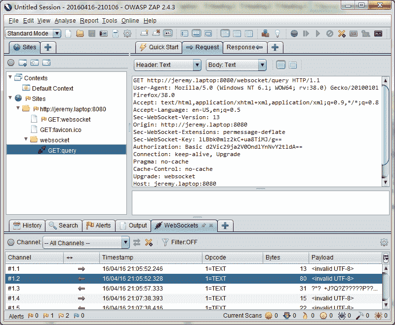
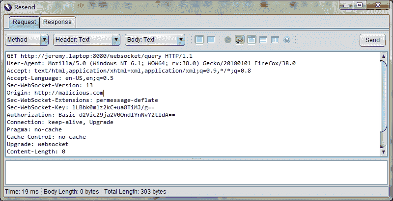
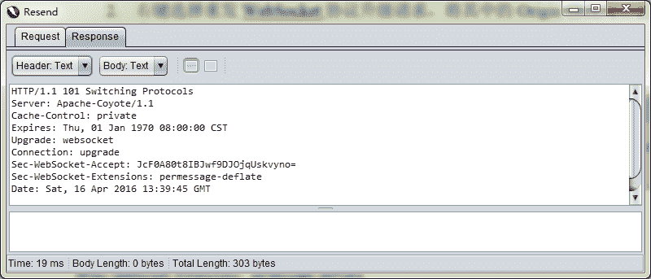

# 深入理解跨站点 WebSocket 劫持漏洞的原理及防范

> 原文：[`developer.ibm.com/zh/articles/j-lo-websocket-cross-site/`](https://developer.ibm.com/zh/articles/j-lo-websocket-cross-site/)

## 序言

WebSocket 作为 HTML5 的新特性之一格外吸引着开发人员的注意，因为它的出现使得客户端（主要指浏览器）提供对 Socket 的支持成为可能，从而在客户端和服务器之间提供了一个基于单 TCP 连接的双向通道。对于实时性要求比较高的应用而言，譬如在线证券、在线游戏，以及不同设备之间信息同步。信息实时同步一直是技术难题，在 WebSocket 出现之前，常见解决方案一般就是轮询（Polling）和 Comet 技术，但这些技术增加了设计复杂度，也造成了网络和服务器的额外负担，在负载较大的情况下效率相对低下，导致应用的可伸缩行收到制约。对于此类应用的开发者来说，WebSocket 技术简直就是神兵利器，读者可以登陆 websocket.org 网站观看特色案例，以及它提供的 WebSocket 和 Comet 的性能对比分析报告。最近几年内 WebSocket 技术被开发人员广泛应用到各类实际应用中。不幸的是，WebSocket 相关的安全漏洞也逐步被披露出来，其中最容易发生的就是跨站点 WebSocket 劫持漏洞。本文将深入浅出为读者介绍跨站点 WebSocket 漏洞的原理、检测方法和修复方法，希望能帮助广大读者在实际工作中避免这个已知安全漏洞。

## WebSocket 协议握手和安全保障

为了便于阐述跨站点 WebSocket 劫持漏洞原理，本文将简单描述 WebSocket 协议的握手和切换过程。建议有兴趣的读者阅读参考文献中提供的 RRFC 6455 规范，深入学习 WebSocket 协议。

了解过 WebSocket 技术的读者都知道 `ws://` 和 `http://`，那么 WebSocket 和 HTTP 是什么关系呢。笔者对这个问题的理解是，WebSocket 是 HTML5 推出的新协议，跟 HTTP 协议内容本身没有关系。WebSocket 是持久化的协议，而 HTTP 是非持久连接。正如前文所述，WebSocket 提供了全双工沟通，俗称 Web 的 TCP 连接，但 TCP 通常处理字节流（跟消息无关），而 WebSocket 基于 TCP 实现了消息流。WebSocket 也类似于 TCP 一样进行握手连接，跟 TCP 不同的是，WebSocket 是基于 HTTP 协议进行的握手。笔者利用 Chrome 开发者工具，收集了 websocket.org 网站的 Echo 测试服务的协议握手请求和响应，如清单 1 和 2 所示。

##### 清单 1\. WebSocket 协议升级请求

```
GET ws://echo.websocket.org/?encoding=text HTTP/1.1
Host: echo.websocket.org
Connection: Upgrade
Pragma: no-cache
Cache-Control: no-cache
Upgrade: websocket
Origin: http://www.websocket.org
Sec-WebSocket-Version: 13
User-Agent: Mozilla/5.0 (Macintosh; Intel Mac OS X 10_11_4) Chrome/49.0.2623.110
Accept-Encoding: gzip, deflate, sdch
Accept-Language: en-US,en;q=0.8,zh-CN;q=0.6
Cookie: _gat=1; _ga=GA1.2.2904372.1459647651; JSESSIONID=1A9431CF043F851E0356F5837845B2EC
Sec-WebSocket-Key: 7ARps0AjsHN8bx5dCI1KKQ==
Sec-WebSocket-Extensions: permessage-deflate; client_max_window_bits 
```

熟悉 HTTP 的朋友可以发现 WebSocket 的核心了，对的，这就是 Connection：Upgrade 和 Upgrade：websocket 两行。这两行相当于告诉服务器端：我要申请切换到 WebSocket 协议。

##### 清单 2\. WebSocket 协议升级响应

```
HTTP/1.1 101 Web Socket Protocol Handshake
Access-Control-Allow-Credentials: true
Access-Control-Allow-Headers: content-type
Access-Control-Allow-Headers: authorization
Access-Control-Allow-Headers: x-websocket-extensions
Access-Control-Allow-Headers: x-websocket-version
Access-Control-Allow-Headers: x-websocket-protocol
Access-Control-Allow-Origin: http://www.websocket.org
Connection: Upgrade
Date: Sun, 03 Apr 2016 03:09:21 GMT
Sec-WebSocket-Accept: wW9Bl95VtfJDbpHdfivy7csOaDo=
Server: Kaazing Gateway
Upgrade: websocket 
```

一旦服务器端返回 101 响应，即可完成 WebSocket 协议切换。服务器端即可以基于相同端口，将通信协议从 `http://` 或 `https://` 切换到 `ws://` 或 `wss://`。协议切换完成后，浏览器和服务器端即可以使用 WebSocket API 互相发送和收取文本和二进制消息。

这里要解释一些安全相关的重要头部参数，Sec-WebSocket-Key 和 Sec-WebSocket-Accept。这涉及一个 WebSocket 安全特性，客户端负责生成一个 Base64 编码过的随机数字作为 Sec-WebSocket-Key，服务器则会将一个 GUID 和这个客户端的随机数一起生成一个散列 Key 作为 Sec-WebSocket-Accept 返回给客户端。这个工作机制可以用来避免缓存代理（caching proxy），也可以用来避免请求重播（request replay）。

细心的读者可能也注意到很多其他”Sec－”开头的 WebSocket 相关的 Header。这其实也是 WebSocket 设计者为了安全的特意设计，以”Sec-”开头的 Header 可以避免被浏览器脚本读取到，这样攻击者就不能利用 XMLHttpRequest 伪造 WebSocket 请求来执行跨协议攻击，因为 XMLHttpRequest 接口不允许设置 Sec-开头的 Header。

## 跨站点 WebSocket 劫持漏洞原理

尽管 WebSocket 协议设计时充分考虑了安全保障机制，但随着 WebSocket 技术推广，安全工作者们慢慢还是发现了一些 WebSocket 相关的安全漏洞，譬如 Wireshark 的漏洞 CVE-2013-3562 （Wireshark 1.8.7 之前的 1.8.x 版本中的 Websocket 解析器中的 epan/dissectors/packet-websocket.c 中的’tvb_unmasked’函数中存在多个整数符号错误，远程攻击者可通过恶意的数据包利用这些漏洞造成拒绝服务）。Asterisk WebSocket Server 的 DoS 漏洞 CVE-2014-9374（该 WebSocket Server 某模块中存在双重释放漏洞，远程攻击者可通过发送零长度的帧利用该漏洞造成拒绝服务）。这两个 DDoS 漏洞跟 WebSocket 协议本身以及 WebSocket 应用程序相关性不大。但 2015 年来自 Cisco 的 Brian Manifold 和 Nebula 的 Paul McMillan 报告了一个 OpenStack Nova console 的 WebSocket 漏洞（CVE-2015-0259），这个漏洞得到广泛关注，并且被在很多 WebSocket 应用中发现。事实上，这种漏洞早在 2013 年就被一个德国的白帽黑客 Christian Schneider 发现并公开，Christian 将之命名为跨站点 WebSocket 劫持 Cross Site WebSocket Hijacking（CSWSH）。跨站点 WebSocket 劫持相对危害较大，也更容易被开发人员忽视。

什么是跨站点 WebSocket 劫持漏洞呢，前文已经提及，为了创建全双工通信，客户端需要基于 HTTP 进行握手切换到 WebSocket 协议，这个升级协议的过程正是潜在的阿喀琉斯之踵。大家仔细观察上文的握手 Get 请求，可以看到 Cookie 头部把域名下的 Cookie 都发送到服务器端。如果有机会阅读 WebSocket 协议（10.5 章客户端身份认证）就发现，WebSocket 协议没有规定服务器在握手阶段应该如何认证客户端身份。服务器可以采用任何 HTTP 服务器的客户端身份认证机制，譬如 cookie，HTTP 基础认证，TLS 身份认证等。因此，对于绝大多数 Web 应用来说，客户端身份认证应该都是 SessionID 等 Cookie 或者 HTTP Auth 头部参数等。熟悉跨站点请求伪造攻击 Cross Site Request Forgery（CSRF）的朋友到这里应该就可以联想到黑客可能伪造握手请求来绕过身份认证。

因为 WebSocket 的客户端不仅仅局限于浏览器，因此 WebSocket 规范没有规范 Origin 必须相同（有兴趣的读者可以阅读规范 10.2 章节了解对于 Origin 的规范）。所有的浏览器都会发送 Origin 请求头，如果服务器端没有针对 Origin 头部进行验证可能会导致跨站点 WebSocket 劫持攻击。譬如，某个用户已经登录了应用程序，如果他被诱骗访问某个社交网站的恶意网页，恶意网页在某元素中植入一个 WebSocket 握手请求申请跟目标应用建立 WebSocket 连接。一旦打开该恶意网页，则自动发起如下请求。请注意，Origin 和 Sec-WebSocket-Key 都是由浏览器自动生成，Cookie 等身份认证参数也都是由浏览器自动上传到目标应用服务器端。如果服务器端疏于检查 Origin，该请求则会成功握手切换到 WebSocket 协议，恶意网页就可以成功绕过身份认证连接到 WebSocket 服务器，进而窃取到服务器端发来的信息，抑或发送伪造信息到服务器端篡改服务器端数据。有兴趣的读者可以将这个漏洞跟 CSRF 进行对比，CSRF 主要是通过恶意网页悄悄发起数据修改请求，不会导致信息泄漏问题，而跨站点 WebSocket 伪造攻击不仅可以修改服务器数据，还可以控制整个读取/修改双向沟通通道。正是因为这个原因，Christian 将这个漏洞命名为劫持（Hijacking），而不是请求伪造（Request Forgery）。

##### 清单 3\. 篡改过的 WebSocket 协议升级请求

```
GET ws://echo.websocket.org/?encoding=text HTTP/1.1
Host: echo.websocket.org
Connection: Upgrade
Pragma: no-cache
Cache-Control: no-cache
Upgrade: websocket
Origin: http://www.malicious
website.com
Sec-WebSocket-Version: 13
Accept-Encoding: gzip, deflate, sdch
Accept-Language: en-US,en;q=0.8,zh-CN;q=0.6
Cookie: _gat=1; _ga=GA1.2.290430972.14547651; JSESSIONID=1A9431CF043F851E0356F5837845B2EC
Sec-WebSocket-Key: 7ARps0AjsHN8bx5dCI1KKQ==
Sec-WebSocket-Extensions: permessage-deflate; client_max_window_bits 
```

读到这里，熟悉 JavaScript 跨域资源访问的读者可能会怀疑以上观点。如果 HTTP Response 没有指定”Access-Control-Allow-Origin”的话，浏览器端的脚本是无法访问跨域资源的啊，是的，这就是众所周知的跨域资源共享 Cross-Origin Resource Sharing（CORS），这确实也是 HTML5 带来的新特性之一。但是很不幸，跨域资源共享不适应于 WebSocket，WebSocket 没有明确规定跨域处理的方法。

## 如何检测跨站点 WebSocket 劫持漏洞

明白跨站点 WebSocket 劫持漏洞原理后，大家就很容易联想到这个漏洞的检测方法了，重点就在于重播 WebSocket 协议升级请求。简单来说就是使用能拦截到 WebSocket 握手请求的工具，修改请求中的 Origin 头信息，然后重新发送这个请求，看看服务器是否能够成功返回 101 响应。如果连接失败，那么说明这个 WebSocket 是安全的，因为它可以正确拒绝来自不同源（Origin）的连接请求。如果连接成功，通常就已经证明服务器端没有执行源检查，为了严谨起见，最好进一步测试是否可以发送 WebSocket 消息，如果这个 WebSocket 连接能够发送/接受消息的话，则完全证明跨站点 WebSocket 劫持漏洞的存在。

为了便于演示如何测试及修复这个漏洞，笔者编写了一个简单的 WebSocket 应用，这个应用基于 JAAS 实现了 HTTP BASIC 身份认证，读者可以将这个程序下载部署到 Tomcat 中进行测试。打开客户端网页后首先进行登录，然后点击”连接”按钮通过 JavaScript 建立 WebSocket 连接，然后点击”发送”按钮提交一个问题到服务器端，服务器端实时确认收到查询请求，5 秒后再将结果推送给客户端。

测试工具方面有很多选择，由于许可证原因，笔者采用了开源的 OWASP ZAP v2.4.3。这里要简单说一下，测试过程主要基于测试工具的代理，拦截到 WebSocket 握手请求以及 WebSocket 消息通信，然后通过工具修改 Origin 后重发请求，如果连接成功后，重发 WebSocket 客户端消息。以上功能各个商业安全测试工具都可以做到。

1.  首先在 Firefox 中配置好 ZAP 的代理，然后探索整个 WebSocket 应用。下图可以看到请求头部有 HTTP Basic Authorization 信息，表示已经登录成功。

    ##### 图 1\. WebSocket 协议升级请求

    

2.  右键选择重发 WebSocket 协议升级请求，将其中的 Origin 修改为任意其他网址后点击发送。

    ##### 图 2\. 篡改 WebSocket 协议升级请求

    

3.  点击响应标签，可以看到服务器端返回了 101，即协议握手成功。

    ##### 图 3\. WebSocket 协议握手成功

    

4.  进一步测试 WebSocket 消息是否可以重发。如下图所示，右键点击第一条客户端发出的 WebSocket 消息，选择重发，输入测试消息”www”后点击发送，可以看到 ZAP 陆续收到两条服务器返回的消息。这充分证明被测试应用站点存在跨站点 WebSocket 劫持漏洞。

    ##### 图 4\. 重发客户端 WebSocket 消息

    

## 防范跨站点 WebSocket 劫持攻击

前文介绍了跨站点 WebSocket 劫持漏洞原理和检测，相信读者已经明白它的危害，接下来我们谈谈如何防范这个漏洞。这个漏洞的原理听起来略微复杂，但幸运的是测试起来相对比较简单，那么修复会不会也很简单。很多读者会想到，不就是在服务器代码中检查 Origin 参数嘛。是的，检查 Origin 很有必要，但不充分。笔者推荐大家要在服务器端的代码中增加 Origin 检查，如果客户端发来的 Origin 信息来自不同域，建议服务器端拒绝这个请求，发回 403 错误响应拒绝连接。

### WebSocket 服务器端 Origin 检查

笔者采用了 Java EE 技术编写的 WebSocket 测试应用，Java EE 的 WebSocket API 中提供了配置器允许开发人员重写配置用来拦截检查协议握手过程。笔者在文章附录的源代码中已经包含了这部分代码，下面简单介绍一些核心类和配置。如果对 Java EE WebSocket API 不太熟悉的读者，建议可以先查阅相关规范。

1.  首先编写一个 WebSocket 服务器终端的配置器，如清单 4 所示继承并重写 checkOrigin 方法。注意，笔者忽略了没有 Origin 的场景，这一点要视各个应用的实际情况而定，如果有非浏览器客户端的话，则需要加上这一个检查。同时建议非浏览器客户端参见下文的令牌机制。

    ##### 清单 4\. WebSocket 源检查配置器

    ```
     public class CustomConfigurator extends ServerEndpointConfig.Configurator {

      private static final String ORIGIN = "http://jeremy.laptop:8080";

      @Override
      public boolean checkOrigin(String originHeaderValue) {
      if(originHeaderValue==null || originHeaderValue.trim().length()==0)
      return true;
      return ORIGIN.equals(originHeaderValue);
      }
     } 
    ```

2.  然后将该配置器关联到 WebSocket 服务器代码中。

    ##### 清单 5\. 配置 WebSocket 源检查

    ```
     @ServerEndpoint(value = "/query", configurator = CustomConfigurator.class)
     public class WebSocketTestServer {
      @OnMessage
      public void onMessage(String message, Session session)
      throws IOException, InterruptedException {
      session.getBasicRemote().sendText("We got your query: " + message
      + "\nPlease wait for a while, we will response to you later.");
      Thread.sleep(5000);
      session.getBasicRemote().sendText("Sorry, we did not find the answer.");
      }
     } 
    ```

3.  重新打包发布 WebSocket 应用程序。

有兴趣的读者可以自己尝试，如果补上以上代码后，重播篡改的 WebSocket 握手协议请求会收到 403 错误。

### WebSocket 令牌机制

以上看起来很美好，但是仅仅检查 Origin 远远不够，别忘记了，如果 WebSocket 的客户端不是浏览器，非浏览器的客户端发来的请求根本就没有 Origin。除此之外，我们要记得，恶意网页是可以伪造 Origin 头信息的。更彻底的解决方案还是要借鉴 CSRF 的解决方案－令牌机制。

鉴于篇幅原因，笔者就不详细贴出整个设计和代码，建议读者参照以下概要设计提高 WebSocket 应用的安全。

1.  服务器端为每个 WebSocket 客户端生成唯一的一次性 Token；

2.  客户端将 Token 作为 WebSocket 连接 URL 的参数（譬如 ws://echo.websocket.org/?token＝randomOneTimeToken），发送到服务器端进行 WebSocket 握手连接；

3.  服务器端验证 Token 是否正确，一旦正确则将这个 Token 标示为废弃不再重用，同时确认 WebSocket 握手连接成功；如果 Token 验证失败或者身份认证失败，则返回 403 错误。

这个方案里的 Token 设计是关键，笔者推荐的方案是为登录用户生成一个 Secure Random 存储在 Session 中，然后利用对称加密（譬如 AES GCM）加密这个 Secure Random 值作为令牌，将加密后的令牌发送给客户端用来进行连接。这样每个 Session 有一个唯一的随机数，每个随机数可以通过对称加密生成若干份一次性令牌。用户即便通过不同终端通过 WebSocket 连接到服务器，服务器可以在保障令牌唯一且一次性使用的前提下，依然能将不同通道中的信息关联到同一用户中。

可能存在另外一个设计思路，在 WebSocket 消息中增加令牌和身份信息，但笔者觉得这样的设计有悖于 WebSocket 的设计思想，而且增加了不必要的网络负载。抛砖引玉，欢迎读者提供更好的设计方案。

## 总结

本文笔者跟读者分享了对 WebSocket 协议握手的理解，并在此基础上阐述了跨站点 WebSocket 劫持漏洞的原理。正如文中所提，已知的各类 WebSocket 漏洞中，只有这个是广泛存在于 Web 应用代码中的漏洞。笔者同时分享了检测跨站点 WebSocket 劫持漏洞的方法，并且基于 Java EE 技术介绍了漏洞的修复办法，以及更全面的基于令牌机制的安全解决方案。

## 下载

[sourcecode.zip](https://www.ibm.com/developerWorks/cn/java/j-lo-websocket-cross-site/sourcecode.zip): 示例代码