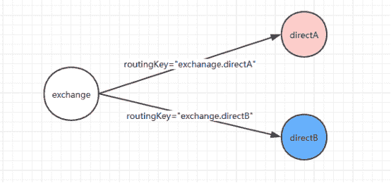
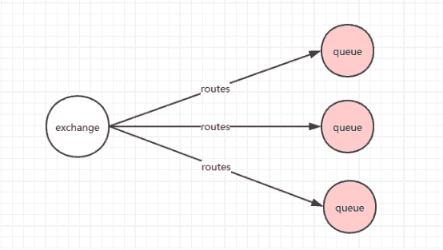
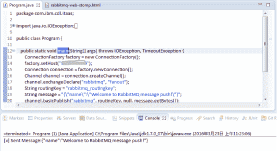
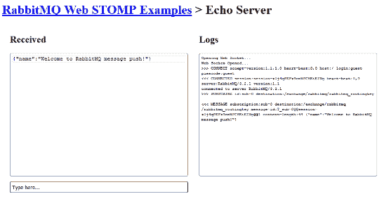

# 基于 RabbitMQ 的实时消息推送

> 原文：[`developer.ibm.com/zh/articles/os-cn-rabbit-mq/`](https://developer.ibm.com/zh/articles/os-cn-rabbit-mq/)

## 实现服务器端推送的几种方式

Web 应用都是基于 HTTP 协议的请求/响应模式，无法像 TCP 协议那样保持长连接，因此 Web 应用就很难像手机那样实现实时的消息推送。就目前来看，Web 应用的消息推送方式主要有以下几种：

### Ajax 短轮询

Ajax 轮询主要通过页面端的 JS 定时异步刷新任务来实现数据的加载，但这种方式实时效果较差，而且对服务端的压力也较大。

### 长轮询

长轮询主要也是通过 Ajax 机制，但区别于传统的 Ajax 应用，长轮询的服务器端会在没有数据时阻塞请求直到有新的数据产生或者请求超时才返回，之后客户端再重新建立连接获取数据，具体实现方式见图 1 所示。但长轮询服务端会长时间地占用资源，如果消息频繁发送的话会给服务端带来较大的压力。

**图 1\. 长轮询实现方式**


### WebSocket 双向通信

WebSocket 是 HTML5 中一种新的通信协议，能够实现浏览器与服务器之间全双工通信。如果浏览器和服务端都支持 WebSocket 协议的话，该方式实现的消息推送无疑是最高效、简洁的。并且最新版本的 IE、Firefox、Chrome 等浏览器都已经支持 WebSocket 协议，Apache Tomcat 7.0.27 以后的版本也开始支持 WebSocket。

## RabbitMQ 简介

AMQP，即 Advanced Message Queuing Protocol，高级消息队列协议是应用层协议的一个开放标准，为面向消息的中间件设计。消息中间件主要用于组件之间的解耦，消息的发送者无需知道消息使用者的存在，反之亦然。AMQP 的主要特征是面向消息、队列和路由，可靠且安全。RabbitMQ 是一个开源的 AMQP 实现，服务器端用 Erlang 语言编写，支持多种客户端，如：Python、Ruby、.NET、Java、JMS、C、PHP、ActionScript、XMPP、STOMP 等，支持 Ajax。用于在分布式系统中存储转发消息，在易用性、扩展性、高可用性等方面表现不俗。RabbitMQ 中有一些概念需要我们在使用前先搞清楚，主要包括以下几个：Broker、Exchange、Queue、Binding、Routingkey、Producter、Consumer、Channel。

1.  Broker

    简单来说就是消息队列服务器的实体。

2.  Exchange

    接收消息，转发消息到绑定的队列上，指定消息按什么规则，路由到哪个队列。

3.  Queue

    消息队列载体，用来存储消息，相同属性的 queue 可以重复定义，每个消息都会被投入到一个或多个队列。

4.  Binding

    绑定，它的作用就是把 Exchange 和 Queue 按照路由规则绑定起来。

5.  RoutingKey

    路由关键字，Exchange 根据这个关键字进行消息投递。

6.  Producter

    消息生产者，产生消息的程序。

7.  Consumer

    消息消费者，接收消息的程序。

8.  Channel

    消息通道，在客户端的每个连接里可建立多个 Channel，每个 channel 代表一个会话。

## 安装 RabbitMQ 服务

本文提出的方案是基于 RabbitMQ 消息服务器，因此最开始需要安装 RabbitMQ 服务及相关插件。RabbitMQ 是基于 Erlang 语言开发的，所以首先必须安装 Erlang 运行时环境。下面以 CentOS6.5 64 位服务器为例，讲述整个服务的安装过程：

1.  下载 erlang-R15B-02.1.el5.x86_64.rpm 并安装

    ```
    # rpm -ivh erlang-R15B-02.1.el5.x86_64.rpm 
    ```

2.  下载 rabbitmq-server-3.2.1-1.noarch.rpm 并安装

    ```
    # rpm -ivh rabbitmq-server-3.2.1-1.noarch.rpm 
    ```

3.  启用相关插件

    ```
    # rabbitmq-plugins enable rabbitmq_management rabbitmq_web_stomp rabbitmq_stomp 
    ```

4.  重启 RabbitMQ 服务

    ```
    # service rabbitmq-server restart 
    ```

5.  验证是否安装成功

    此时我们可能通过 Web 浏览器来查看 RabbitMQ 的运行状态，浏览器中输入 `http://{server_ip}:15672`，用 guest/guest 默认的用户和密码登录后即可查看 RabbitMQ 的运行状态。

## 基于 RabbitMQ 的实时消息推送

RabbitMQ 有很多第三方插件，可以在 AMQP 协议基础上做出许多扩展的应用。Web STOMP 插件就是基于 AMQP 之上的 STOMP 文本协议插件，利用 WebSocket 能够轻松实现浏览器和服务器之间的实时消息传递，具体实现方式如下图 2 所示：

**图 2\. 浏览器和服务器之间的实时消息传递实现**


### 消息发送者

下面举个例子来说明整个过程，以 Java 作为 RabbitMQ 客户端消息发送者，Web 浏览器作为消息消费者。

##### 清单 1\. Java 端代码

```
import java.io.IOException;
import java.util.concurrent.TimeoutException;
import com.rabbitmq.client.Channel;
import com.rabbitmq.client.Connection;
import com.rabbitmq.client.ConnectionFactory;
public class Program {
 public static void main(String[] args) throws IOException, TimeoutException {
 ConnectionFactory factory = new ConnectionFactory();
 factory.setHost("192.168.1.101");
 Connection connection = factory.newConnection();
 Channel channel = connection.createChannel();
 channel.exchangeDeclare("rabbitmq", "fanout");
 String routingKey = "rabbitmq_routingkey";
 String message = "{\"name\":\"Welcome to RabbitMQ message push!\"}";
 channel.basicPublish("rabbitmq", routingKey,null, message.getBytes());
 System.out.println("[x] Sent Message:"+message);
 channel.close();
 connection.close();
 }
} 
```

这里我们利用 RabbitMQ 官方提供的 Java Client Library 来实现消息的发送，消息队列使用的过程大概如图 3 所示：

**图 3\. 客户端投递消息流程**


exchange 接收到消息后，会根据消息的 key 和已经设置的 binding 进行消息路由，最终投递到一个或多个队列里进行消息处理。RabbitMQ 预置了一些 exchange，如果客户端未声明 exchange 时，RabbitMQ 会根据 exchange 类型使用默认的 exchange，具体见表 1。

##### 表 1\. 预置 exchange 名称

| Name | Default pre declared names |
| --- | --- |
| Direct exchange | amq.direct |
| Fanount exchange | amq.fanout |
| Topic exchange | amq.topic |
| Heades exchange | amq.headers |

#### Exchange 类型

exchange 存在以下几种类型：

1.  Direct exchange

    Direct exchange 完全根据 key 进行投递，只有 key 与绑定时的 routing key 完全一致的消息才会收到消息，参考官网提供的图 4 更直观地了解 Direct exchange。

    **图 4.Direct exchange**

    

2.  Fanount exchange

    Fanount 完全不关心 key，直接采取广播的方式进行消息投递，与该交换机绑定的所有队列都会收到消息，具体参考官网提供的图 5。

    **图 5.Fanount exchange**

    

3.  Topic exchange

    Topic exchange 会根据 key 进行模式匹配然后进行投递，与设置的 routing key 匹配上的队列才能收到消息。

4.  Headers exchange

    Header exchange 使用消息头代替 routing key 作为关键字进行路由，不过在实际应用过程中这种类型的 exchange 使用较少。

#### 消息持久化

RabbitMQ 支持消息的持久化，即将消息数据持久化到磁盘上，如果消息服务器中途断开，下次开启会将持久化的消息重新发送，消息队列持久化需要保证 exchange（指定 durable=1）、queue（指定 durable=1）和消息（delivery_mode=2）3 个部分都是持久化。出于数据安全考虑，一般消息都会进行持久化。

### 消息接收者

##### 清单 2.JavaScript 代码

```
// Stomp.js boilerplate
if (location.search == '?ws') {
 var ws = new WebSocket('ws://192.168.1.102:15674/ws');
} else {
 var ws = new SockJS('http://192.168.1.102:15674/stomp');
}
// Init Client
var client = Stomp.over(ws);
// SockJS does not support heart-beat: disable heart-beats
client.heartbeat.outgoing = 0;
client.heartbeat.incoming = 0;
// Declare on_connect
var on_connect = function(x) {
 client.subscribe("/exchange/rabbitmq/rabbitmq_routingkey", function(d) {
 print_first(d.body);
 });
};
// Declare on_error
var on_error = function() {
 console.log('error');
};
// Conect to RabbitMQ
client.connect('guest', 'guest', on_connect, on_error, '/'); 
```

RabbitMQ Web STOMP 插件可以理解为 HTML5 WebSocket 与 STOMP 协议间的桥接，目的也是为了让浏览器能够使用 RabbitMQ。当 RabbitMQ 消息服务器开启了 STOMP 和 Web STOMP 插件后，浏览器端就可以轻松地使用 WebSocket 或者 SockerJS 客户端实现与 RabbitMQ 服务器进行通信。

RabbitMQ Web STOMP 是对 STOMP 协议的桥接，因此其语法也完全遵循 STOMP 协议。STOMP 是基于 frame 的协议，与 HTTP 的 frame 相似。一个 Frame 包含一个 command，一系列可选的 headers 和一个 body。STOMP client 的用户代理可以充当两个角色，当然也可能同时充当：作为生产者，通过 SEND frame 发送消息到服务器；作为消费者，发送 SUBCRIBE frame 到目的地并且通过 MESSAGE frame 从服务器获取消息。

在 Web 页面中利用 WebSocket 使用 STOMP 协议只需要下载 stomp.js 即可，考虑到老版本的浏览器不支持 WebSocket，SockJS 则提供了 WebSocket 的模拟支持。Web 页面中使用 STOMP 协议详见下列代码清单：

##### 清单 3.JavaScript 代码

```
// 初始化 ws 对象
if (location.search == '?ws') {
 var ws = new WebSocket('ws://192.168.1.102:15674/ws');
} else {
 var ws = new SockJS('http://192.168.1.102:15674/stomp');
}
// 建立连接
var client = Stomp.over(ws);
// SockJS does not support heart-beat: disable heart-beats
client.heartbeat.outgoing = 0;
client.heartbeat.incoming = 0;
// 定义连接成功回调函数
var on_connect = function(x) {
console.log('connect successfully');
 // 发送消息
client.send(destination,head,body);
 // 发送消息
client.subcribe(destination,callback);
 // 默认主动 ACK，手动 ACK
client.subcribe(destination,function(message){
 Message.ack();
},{ack:'client'});
// 事务支持
var tx = client.begin();
client.send(destination,head,body);
tx.commit();
};
// 定义连接失败回调函数
var on_error = function(error) {
 console.log(error.headers.message);
};
// 连接消息服务器
client.connect(login, password, on_connect, on_error, '/'); 
```

上面提到的 destination 在 RabbitMQ Web STOM 中进行了相关的定义，根据使用场景的不同，主要有以下 4 种：

1.  /exchange/<exchangename></exchangename>

    对于 SUBCRIBE frame，destination 一般为/exchange/<exchangename>/[/pattern] 的形式。该 destination 会创建一个唯一的、自动删除的、名为<exchangename>的 queue，并根据 pattern 将该 queue 绑定到所给的 exchange，实现对该队列的消息订阅。</exchangename></exchangename>

    对于 SEND frame，destination 一般为/exchange/<exchangename>/[/routingKey] 的形式。这种情况下消息就会被发送到定义的 exchange 中，并且指定了 routingKey。</exchangename>

2.  /queue/<queuename></queuename>

    对于 SUBCRIBE frame，destination 会定义<queuename>的共享 queue，并且实现对该队列的消息订阅。</queuename>

    对于 SEND frame，destination 只会在第一次发送消息的时候会定义<queuename>的共享 queue。该消息会被发送到默认的 exchange 中，routingKey 即为<queuename>。</queuename></queuename>

3.  /amq/queue/<queuename></queuename>

    这种情况下无论是 SUBCRIBE frame 还是 SEND frame 都不会产生 queue。但如果该 queue 不存在，SUBCRIBE frame 会报错。

    对于 SUBCRIBE frame，destination 会实现对队列<queuename>的消息订阅。</queuename>

    对于 SEND frame，消息会通过默认的 exhcange 直接被发送到队列<queuename>中。</queuename>

4.  /topic/<topicname></topicname>

    对于 SUBCRIBE frame，destination 创建出自动删除的、非持久的 queue 并根据 routingkey 为<topicname>绑定到 amq.topic exchange 上，同时实现对该 queue 的订阅。</topicname>

    对于 SEND frame，消息会被发送到 amq.topic exchange 中，routingKey 为 <topicname>。</topicname>

    **图 6.Java 端发送消息**

    

    **图 7.JavaScript 端实时响应**

    

## 结束语

WebSocket 作为 HTML5 提供的新一代客户端-服务器异步通信方法，能够轻松完成前端与后台的双向通信。RabbitMQ 服务提供了一个 STOMP 插件，能够实现与 WebSocket 的桥接，这样既能够实现消息的主动推送，同时也能够实现消息的异步处理。在传统的 Web 开发中存在许多状态变更实时性的需求，比如资源被占用后需要广播它的实时状态，利用本文提出的解决方案，可以方便将其推送到所有监听的客户端。因此在新 J2EE 开发项目中，建议使用本文提出的方案替代原来 ajax 轮询方法刷新状态。

## 下载示例代码

[获得代码](http://www.ibm.com/developerWorks/cn/opensource/os-cn-rabbit-mq/stomp.zip)