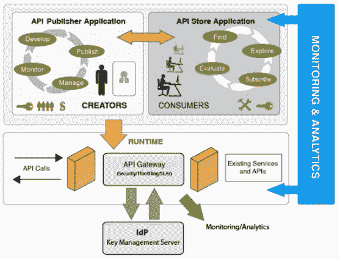
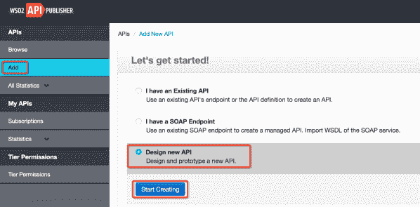
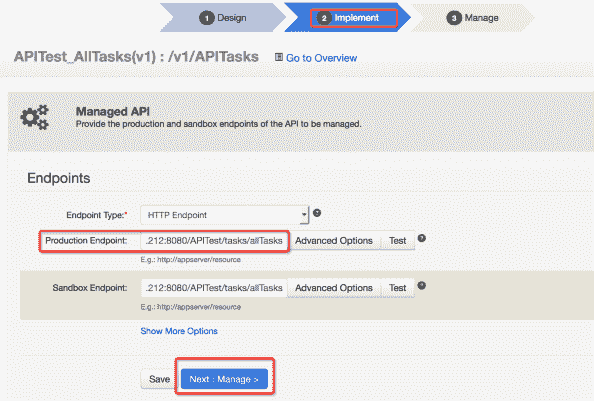
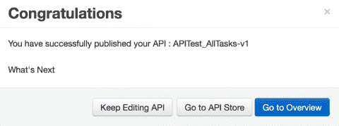
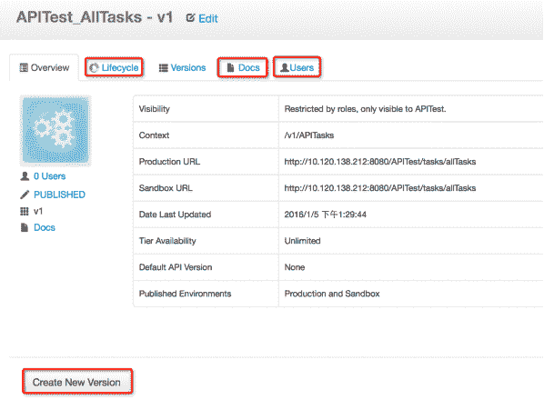
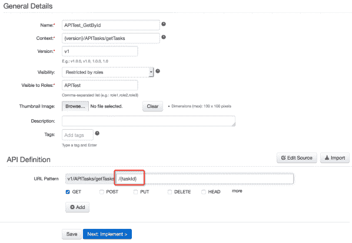
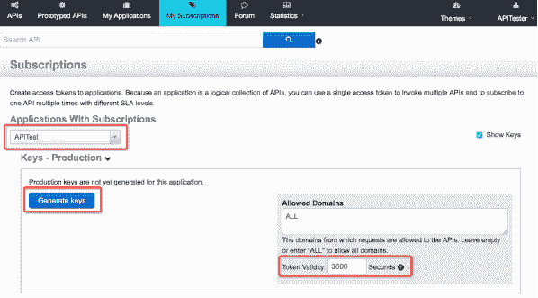
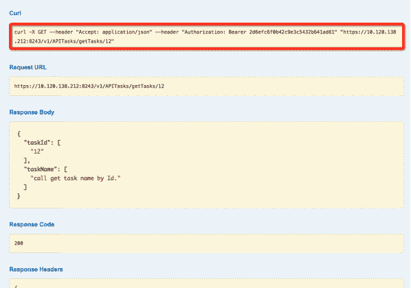

# 使用 WSO2 API Manager 管理 Rest API

> 原文：[`developer.ibm.com/zh/articles/os-cn-wso2-manager-rest-api/`](https://developer.ibm.com/zh/articles/os-cn-wso2-manager-rest-api/)

## WSO2 API Manager 简介

随着软件工程的增多，越来越多的软件提供各种不同格式、不同定义的 Rest API 作为资源共享，而由于这些 API 资源的异构性，很难对其进行复用。WSO2 API Manager （下文简称为 AM）提供了一个完整的 API 发布的解决方案，从创建和管理 API，到监控 API，AM 提供了 API 整个生命周期所需要的各种控制，包含控制访问权限，访问流量，监控 API 的调用，版本控制等。 对于开发人员，使用 AM 将不需要再关心安全检查，流量监控等辅助功能，只需关注 API 的业务逻辑，而架构师则将不再需要为不同的 API 编写适配接口，而只需将 API 资源添加到 WSO2 API Manager 中，即可实现 API 资源复用等功能。同时 WSO2 API Manager 提供了可视化的管理界面，可以实时对 API 的访问进行调控，从而使得 API 作为资源更为便捷的进行复用。

图 1（引用自参考 1）展示了 AM 的架构，可以看到其主要由三部分组成，分别是 API Publisher、API Store 和 API Gateway。所有的 API 请求通过 API Gateway 进行拦截，实现请求 mapping，拦截，监控等各种功能。而 API publisher 用来生成、发布、管理、监控 API，由此创建的 API 将会注册到 API Gateway 中以发布给用户使用。API Store 则展示了用户可见的所有 API，用户通过这个页面来查找、订阅自己需要的 API。

##### 图 1.WSO2 API Manager 结构图



### API 生命周期

一个 API 从建立到销毁将经历以下周期，API Manager 提供对全生命周期的管理：

*   Created：创建 API，在 created 周期中，API 只是被添加到了 API Store，但并不对用户可见，也没有部署到 API Gateway 中。
*   Prototyped：API 作为以原型部署并发布在 API store 中。一个 API 原型通常是为了获得其可用性的反馈，而模拟的实现，用户可以尝试使用但并不能将其添加到自己的 Application 中。
*   Published：该阶段是 API 正常使用阶段，用户可以在 API Store 中看到并且可以将其添加到自己的 Application 中调用。
*   Deprecated：API 仍然部署在 API Gateway 中，但已经不能被调用。当一个新版本的 API 发布后，旧版本的 API 将自动变为 Deprecated。
*   Retired：API 过期后将从 API Gateway 以及 API store 中移除。
*   Blocked：API 访问被限制，实时状态下不能访问该 API，并且不在 API store 中显示。

### Application

Application 主要用来使用户为不同的目的添加不同的 API，例如，一个用户需要两组 API，一组专门用于零售业，另一组用于银行业，这样每一组都代表一个 Application，用户可以将所有零售业的 API 放入 Retailer Application，银行业的 API 放入 Bank Application。

Application 不但用于 API 的分组，还可以实现多个 API 接口使用同一个 access 密钥，不用为每一个 API 都生成一组访问密钥。每一个用户都有一个默认的 Application，同时可以为不同目的创建不同的 Application。

## WSO2 API Manager 安装

WSO2 API Manager 需要 Oracle JDK 1.6.27 以上 或 1.7，并配置 JAVA_HOME 环境变量。下载相应的安装包，解压缩即可。不同操作系统的安装有略微差异，具体可参考参考文档 2（ [`docs.wso2.com/display/AM190/Installing+the+Product`](https://docs.wso2.com/display/AM190/Installing+the+Product) ）。

本文示例所用的 AM 安装在 Linux 上，JDK 1.7。并且创建了 APITest role 和 APTTester user 作为本文使用的测试用户组。

## 通过 web console 新建 API

首先我们来说明一下 WSO2 AM published 的 API 的 URI pattern，如下图 2：

##### 图 2.WSO2 API Manager published 的 API URI pattern


<context>和<version>是 WSO2 AM 自动添加到 API 的 URL 中，而<other patter="patter">是可以根据需要自己设定。同时 WSO2 AM 不支持 URL 中包含参数，所有的参数需要通过 URL 路径传输。</other></version></context>

由于 AM published 的 URL 限制，我们需要添加的 API（后台的 API）的 URL 一般不会和 AM published 的 URL 一致，因此需要将后台的 API 的 URL mapping 到 AM published 的 URL 上。不同的后台 API URL 格式需要使用不同的 mapping 方法，以下以一个测试的 web 工程为例，说明如何添加后台 API 到 AM 中。

测试的 web 工程提供以下三组 Rest API，分别是：

1.  `http://localhost:8080/APITest/tasks/allTasks` (不包含参数)
2.  `http://localhost:8080/APITest/tasks/getTasks/{taskId}`（包含路径参数）
3.  `http://localhost:8080/APITest/tasks/queryTasks?taskName={taskName}`（包含查询参数）

### 添加第一个 API

首先以添加第一个 API 为例，说明添加 API 的基本流程，然后将阐述如何添加其他两种形式的 API。

图 3 显示了后台 API 到 AM published 的 API 的 URL 映射关系，我们将按如下关系来添加第一个 API：

##### 图 3\. 后台 API 到 AM published 的 API 的映射


可以看到，从后台 API 到 AM API 需要经过一个 mapping，从端口号之后，URL 的格式就完全不同了，AM 提供了通过 xml 文件来描述 URL mapping 的机制，最简单的就是直接将 AM API 端口号之后的 URL 用后台 API 的 URL 替换。该 XML 描述文件如下：

##### 清单 1\. 替换端口号之后的 URL 的 XML 文件

```
<sequence xmlns="http://ws.apache.org/ns/synapse" name="RemovePostfixSequence">
 <property name="REST_URL_POSTFIX" scope="axis2" action="remove"/>
</sequence> 
```

将清单 1 保存为 removePostfixSequence.xml 文件，并通过以下步骤将该文件上传到 AM 的 API Gateway，由 API Gateway 来进行具体的 mapping。在 AM 中，这类 mapping XML 文件统称为 sequence 文件。

#### 上传 Sequence 文件到 AM

1.  登陆 API carbon（`https://localhost:9443/carbon/`），用户名密码默认为 admin/admin。

2.  如图 4，选择 Resource > Browse > _system > governance >customsequences > in。

    图 4\. 选择 sequence 路径 {: #图-4-选择-sequence-路径}

    

3.  上传 removePostfixSequence.xml 文件，如图 5 所示：

    图 5\. 上传 removePostfixSequence.xml 文件 {: #图-5-上传-removepostfixsequence-xml-文件}

    

    点击”Add Resource”后会出现图 5 所示的上传文件的具体信息，在 File 栏中选择 Browse，选择 removePostfixSequence.xml 文件的路径，点击 Add。

4.  上传成功后，可以在 Entries 中看到已上传的文件。

    图 6\. 上传成功 {: #图-6-上传成功}

    

    通过以上步骤，我们将 removePostfixSequence.xml 文件上传到 AM 的文件系统中，在后续的添加 API 的过程中，可以直接使用该文件。

#### 添加 API 到 AM

完成以上准备工作后，我们可以添加第一个 API 了。

1.  登陆 API Publisher（`https://localhost:9443/publisher`），用户名密码默认为 admin/admin。

2.  选择添加 API，如图 7 所示：

    图 7\. 添加 API {: #图-7-添加-api}

    

    选择”Add”>”Design new API”>”Start Creating”。

3.  填写 API 的具体信息，如图 8 所示。

    图 8.API 具体信息 {: #图-8-api-具体信息}

    

    这里的”Context”必须是唯一的，如果在 Context 中不包含 {version}，只写为 APITasks，则 version 信息将会被添加到 Context 之后，也就是 APITasks/v1。如果在 Context 中填写 {version}/APITasks，则 version 信息将在 APITasks 之前，即 v1/APITasks。这里我们选择将 version 信息写在前面。

    Visiblity 用来控制该 API 可以被哪些 role 可见。如果所有人可见，则该选项为”Public”。这里我们只需要属于 APITest 的 user 可见，因此 Visible to Roles 填写 APITest。

    然后定义 API 的 URL Pattern，根据图 3 的目标结果，这里填写 allTasks，选择 GET 方法，单击 Add。添加完成后点击 Next：Implement，进入 Implement 页面。

4.  在 Implement 页面中选择 Managed API，配置具体的 API 信息，如图 9 所示：

    图 9.Managed API {: #图-9-managed-api}

    

    Production Endpoint 和 Sandbox Endpoint 输入后台 API 的 URL，Endpoint Type 为 HTTP Endpoint。这里的 Endpoint URL 就是该 API 实际调用的后台链接。

    设置完成后点击 Next：Manage，进入 Manage 页面。

5.  在 Manage 页面中完成 API 的 Configuration 配置，如图 10 所示：

    图 10.API Configuration 配置 {: #图-10-api-configuration-配置}

    

在以上配置中，Tier Availability 用来设置对 requests 的限制，分别有以下几种：

*   Bronze: 每分钟允许 1 个 request 请求
*   Silver: 每分钟允许 5 个 request 请求
*   Gold: 每分钟允许 20 个 request 请求
*   Unlimited: 不限制

可以根据 API 的具体需求选择。

Message Mediation Policies 用来指定如何 mapping AM 的 API URL 和后台 API URL，这里我们选择之前上传的 sequence 文件作为 mapping 的 police。

最后点击页面最下方的 Save & Published 来保存该 API。当保存 API 以后，会弹出图 11 所示对话框，可以点击 Go to Overview 来查看该 API 的信息。

##### 图 11.API 添加成功



可以在 API 的 Overview 中进行添加新 version、添加 API 的 document、查看 user 的使用情况，以及更改 API 的 Lifecycle 等操作，如图 12 所示。

##### 图 12.API Overview



### 添加包含路径参数的 API

以上我们添加了一个不包含任何参数的 API，下面要添加第二个 test API，该 API 包含一个路径参数 taskId。后台 API 与 AM API 的映射关系如图 13 所示。

##### 图 13\. 第二个 API 的映射关系


该 API 的创建和第一个 API 的创建步骤一样，只有两个步骤的设置不同，一个是在第三步设置 API 具体信息时，需要填写 request 参数，另一个是在第四步设置 Endpoint 时不同。以下分别说明，图 14 显示了第三步设置所需。

##### 图 14\. 带路径参数的 API 的具体设置



点击 Add 按钮后，将会出现一个 GET 方法，单击该方法将会出现具体的信息，如图 15 所示。

##### 图 15\. 带参数的方法信息


在 AM 中，所有的参数都可以通过在 UR Pattern 中使用 {} 来设置，也可以在方法的具体信息中点击 Add Parameter 来设置。AM URL 所使用的参数均为路径参数，不可以包含查询参数。也就是说，不可以在 URL Pattern 中使用”?taskId={taskId}”这样的形式。

在第四步，Manage API 时，Endpoint 的设置需要改为包含参数的形式：

##### 清单 2\. 包含参数的 Endpoint

```
http://10.120.138.212:8080/APITest/tasks/getTasks/{uri.var.taskId} 
```

这里 {uri.var.taskId} 用来表示传入参数 taskId，如果有多个传入参数，均需要写成 {uri.var. 参数名} 这样的形式。

除过以上步骤，其他步骤均与添加第一个 API 时一样，在 Message Mediation Policies 中仍然选择 RemovePostfixSequence 作为 In Flow。

### 添加包含查询参数的 API

这里先给出包含查询参数的 API 和 AM API 的映射关系，如图 16 所示：

##### 图 16\. 第三个 API 的映射关系


该 API 的建立同包含路径参数的 API 一样，需要在第三步 URL Pattern 中设置 {taskName} 作为参数。在第四步的 Endpoint 中，不能直接用包含”？”的路径作为 Endpoint，我们只需要”？”之前的部分，在此例中为：`http://localhost:8080/APITest/tasks/queryTasks`。至于路径中”？”之后的部分，我们需要一个新的 sequence 来进行 mapping。清单 3 给出了新的 sequence 文件内容。

##### 清单 3\. 查询参数的 sequence 文件

```
<?xml version="1.0" encoding="UTF-8"?>
<sequence name="CDSSequence" trace="disable" xmlns="http://ws.apache.org/ns/synapse">
 <property description="QQY"
 expression="concat('?taskName=',syn:get-property('uri.var.taskName'
 name="QQY" scope="default" type="STRING"/>
 <property description="REST_URL_POSTFIX"
 expression="get-property('QQY')" name="REST_URL_POSTFIX"
 scope="axis2" type="STRING"/>
</sequence> 
```

在清单 3 的 sequence 文件中，需要注意的是第一个 property 的 expression，该 expression 解析了后台 API URL”？”之后的部分，在 API 具体调用时，将后一部分添加到 Endpoint 之后，从而拼接出了完整的后台 API，再进行调用。每一个具体的包含查询参数的 API 都需要根据具体的参数格式来修改这部分 expression，相同参数的 API 可以共用一个 sequence 文件，不同的则需要单独的 sequence 文件。

在添加 API 之前，我们需要将这个 sequence 文件上传到 AM 中，步骤和上传 removePostfixSequence.xml 文件相同。

最后在 API configuration 配置时，Message Mediation Policies 中选择新上传的文件作为 In Flow。

## 通过 WSO2 API Manager 调用 Rest API

至此，我们已经添加了三个 API 在 API Manager 中，作为 API 的使用者，需要用自己的账号登陆 API Store，然后建立 Application，并 subscription 需要的 API。subscription API 的目的是使一组 API 可以共享同一个 access token，而不用为每一个 API 都生成一个 access token。

图 17 展示了使用 APITester 用户登陆后可以查看到的 API。

##### 图 17\. API Store


如果登陆用户不属于 APITest role，则不会看到这三个 API。

之后需要建立自己的 Application 用来分类 API，这里我们新建一个 APITest Application 来包含以上三个 API。

##### 图 18\. 创建 Application


在创建 API 之后，在 APIs tab 中单击选择需要包含在该 Application 中的 API，subscription 它。

##### 图 19.subscribe API


在 subscribe 成功后会弹出对话框，显示 Sbuscription 成功，这时先不要进入 My Subscriptions 页面，先将所有需要包含在该 Application 中的 API 都 subscribe 后，再进入 My Subscriptions 页面。

当选择完所有的 API 后，进入 My Subscription 页面，生成 access token，就可以调用 API 了。如图 20 所示，点击 Generate keys 来生成 access token。

##### 图 20\. 生成 Access token



首先需要选择正确的 Application，可以在 Token Validity 中设定 token 过期的时间，默认是 3600 秒。点击 Generate keys 生成 token，在该页面的最下方会有所有已经 subscription 的 API，如图 21 所示：

##### 图 21.subscribed APIs


可以通过单击需要调用的 API，在网页上直接调用，如图 22 所示：

##### 图 22\. 调用 APITest_GetTaskById


选择 API Console，点击 {taskId} 方法，输入 taskId，点击 Try it out！该页面会显示查询结果，如图 23 所示：

##### 图 23\. 查询结果



Curl 中显示的命令，可以在命令行直接调用。

## 结束语

通过将 API 交付给 WSO2 API Manager 管理，开发人员将不用再关心 API 的访问权限，访问流量限制等问题，WSO2 API Manager 提供了安全的访问机制以及监控机制，可以使开发者对自己的 API 进行全方位的管理和监控。本文通过实例描述了如何在 WSO2 API Manger 中创建一个 API，并且如何将 API 正确地 mapping 到后台实际的 API 上，并通过 WSO2 API Manager 提供的 console 界面管理各个 API。开发者可以通过本文提供的 sequence 描述文件作为范例，开发自己的 sequence 描述文件，适配不同的 API 资源，从而将不同规则、不同架构提供的 API 实现统一描述、统一管理，方便软件的进一步功能性整合和复用。