# 在裸机模式下将 Red Hat Enterprise Linux 7.2 安装在 IBM POWER8 和 x86 上：对比分析

> 原文：[`developer.ibm.com/zh/articles/l-installing-rhel-7-2-on-ibm-power8-and-x86/`](https://developer.ibm.com/zh/articles/l-installing-rhel-7-2-on-ibm-power8-and-x86/)

## 简介

本文将演示在裸机模式下将 Linux® 安装在基于 IBM POWER8 处理器的服务器和 x86 服务器上的相似性和细微区别。在 Red Hat 7.2 小端版本发布后，无需任何形式的虚拟化，Red Hat Enterprise Linux (RHEL) 就可以安装在基于 POWER8 处理器的服务器上。安装后，操作系统 (OS) 完全相同，但每家硬件制造商的启动过程稍有不同。例如，IBM POWER8 使用 Advanced System Management (ASM) 接口，而大多数 Intel® 系统使用集成管理模块 (IMM) 或基板管理控制器 (BMC)。新的 IBM Power Systems™ LC 服务器系列（基于 POWER8 处理器技术）使用的是 BMC，但 IBM Power Systems L 系列使用 ASM。基于 POWER8 和 x86 处理器的系统都允许执行 GUI 安装或使用 *Anaconda* （流行的 Linux 安装程序）的基于字符的安装。我们将演示基于 POWER8 的 *Anaconda* 和 x86 上基于 GUI 的安装。希望本文展示了如何轻松地将 Linux 安装在每种系统上。

IBM 红皮书® 和 IBM 快速入门文档广泛介绍了我们基于 Linux 的系统的安装的方方面面（参见参考资料）。但是我们的目标是进行快速比较。也有一些将 Red Hat 安装在虚拟环境中的不同方法，但这不属于本文的讨论范围。以下两篇文章可能在使用 IBM PowerVM® 或基于内核的虚拟机 (KVM) 执行安装期间很有用。

*   [IBM Power Systems S812L 和 S822L 技术概述和简介](http://www.redbooks.ibm.com/abstracts/redp5098.html?Open)

## 前提条件

假设系统的 DVD 驱动器中有一张包含 RHEL 的 ISO 文件的 DVD。

我们还假设您拥有安装操作系统的经验。因此，在介绍操作系统安装的设置时，我们只提供可在引导时配置的操作系统部分（比如磁盘和网络）的一些示例。

## 连接到 IBM Power 硬件来启动系统

IBM Power Systems 服务器已装载到机架中。一条网线已插入到服务器背后的灵活服务处理器 (flexible service processor, FSP) 端口 1 上。有两个端口，但出于我们的目的，我们仅使用第一个。每个系统都具有默认 IP 地址 169.254.2.147，用户名 *admin* 和密码 *admin* 。打开 Web 浏览器并键入 [`169.254.2.147。`](https://169.254.2.147。)

使用用户凭证登录到 Advanced System Management。

##### 图 1\. ASM 的登录屏幕 ASM – 屏幕 1

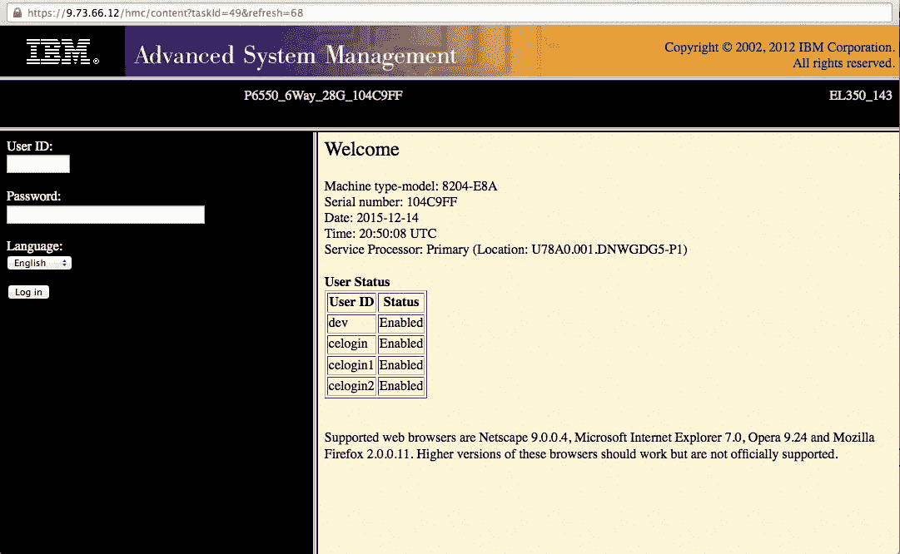

## 打开 / 关闭系统

您现在已登录到 ASM 界面。左侧窗格的菜单可用于执行大部分系统功能。单击 **Power/Restart Control** → **Power On/Off System** 打开 Power On/Off System 页面。在页面底部，如果系统还未打开，请单击 **Save settings and power on** 打开系统。

##### 图 2\. ASM Power On/Off System 页面

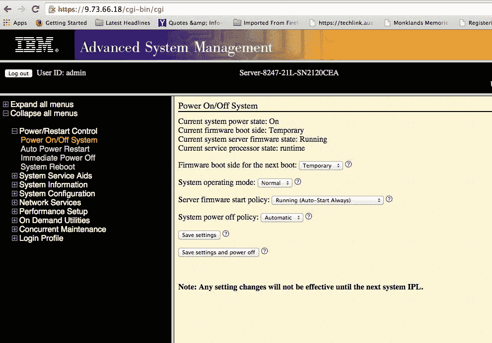

## 配置基于 POWER8 处理器的系统管理的网络

单击 **Networking Services → Network Configuration** 来自定义 FSP 的 IP 地址、子网掩码和默认网关（如果需要）。

##### 图 3\. ASM Network Configuration 页面

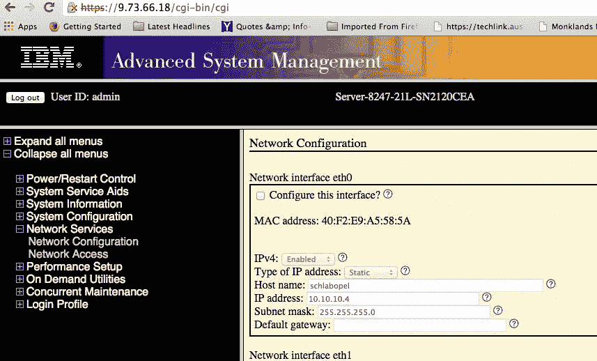

## 为基于 POWER8 处理器的服务器设置 IPMI 密码

将 IP 地址分配给系统后，我们就准备好加载操作系统了。对于 Red Hat 登录，您可以从 Red Hat 网站下载 RHEL-7.2-20151030.0-Server-ppc64le-dvd1.iso 文件。构建版本在未来可能会发生更改，但这是目前可用的版本。

将该文件刻录到 DVD 上并装入服务器的 DVD 驱动器，这样就准备好使用 **IPMItool** 来加载操作系统了。

要访问 **IPMItool** ，需要单击 **Login Profile → Change Password** 来设置管理密码。

##### 图 4\. ASM Change Password 页面

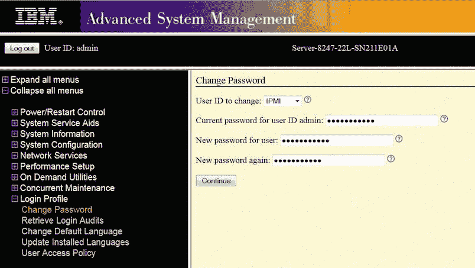

下一步是使用 **IPMItool** 将 Red Hat 7.2 加载到基于 POWER8 处理器的系统上。IPMItool 是一个 Linux 实用工具，类似于 PuTTY，但专门用于系统管理。如果未将它加载到您使用的系统上，则需要运行 `yum install ipmitool` 。此命令必须从另一个 Linux 系统运行。

## 在 POWER8 上使用 IPMItool 安装 Red Hat Enterprise Linux

使用以下命令连接到基于 POWER8 处理器的服务器的控制台。

```
$ ipmitool -I lanplus -H myserver.example.com -P mypassword sol activate 
```

您将看到以 *petitboot* 菜单结尾的控制台消息。Petitboot 允许您查看连接的硬件，以及引导和安装文件。在本例中，系统之前已加载了 Ubuntu，但我们将选择使用 **Install Red Hat Enterprise Linux 7.2（64 位内核）** 来覆盖它。

##### 图 5\. Install Red Hat Enterprise Linux 7.2 屏幕

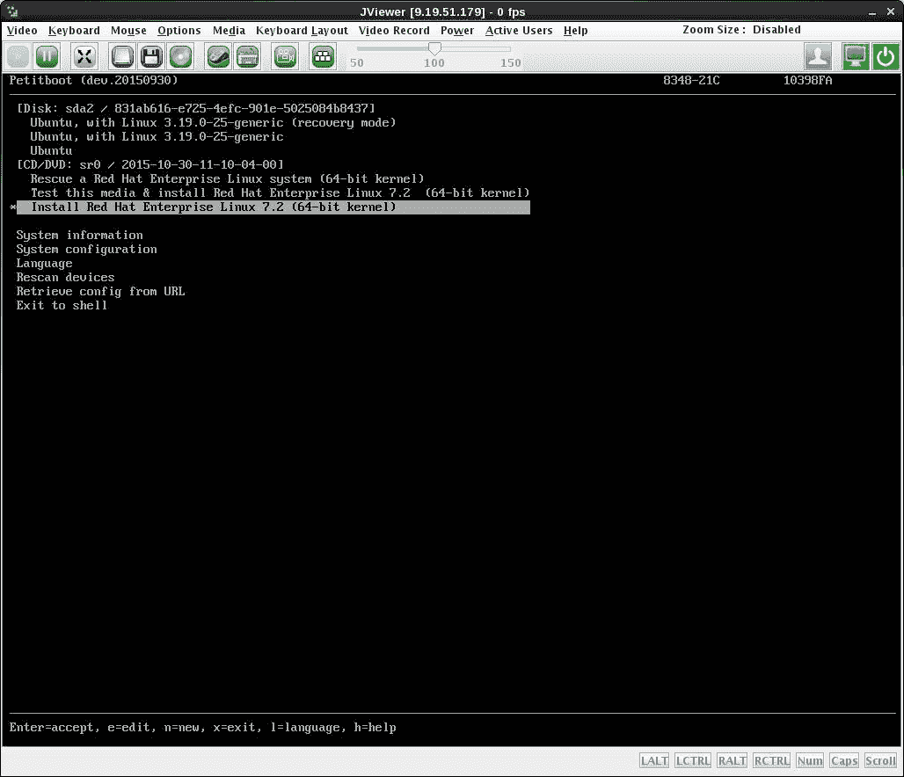

在安装期间，将会加载 Anaconda，您现在可以看到基于字符的屏幕，可以在其中自定义 Red Hat 的安装。选择每个相应的编号，并根据需要配置操作系统的每个部分，包括：

*   语言
*   时区
*   操作系统来源
*   要安装的软件包 – 如果不更改此部分，那么只会安装裸机基础操作系统
*   目标磁盘
*   kdump（一种崩溃转储机制）
*   网络配置
*   用户创建
*   引导密码

因为这是一次基于字符的安装，所以请键入屏幕底部显示的选项编号，您可以看到针对操作系统安装的该部分的菜单。

##### 图 6\. Red Hat 安装屏幕

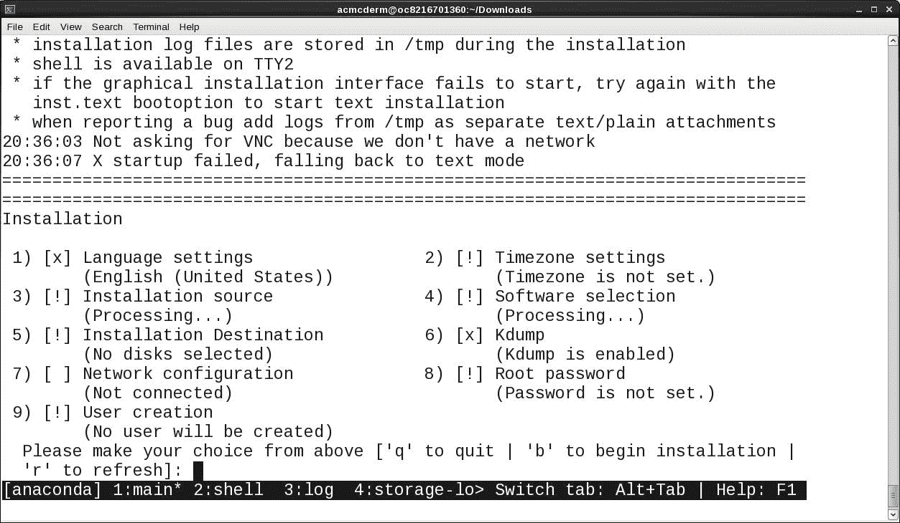

在下面的屏幕中，我们选择了 5 个 **安装目标** 。该程序将会扫描硬件，显示可用于放置该操作系统的磁盘。可以看到它找到了以下数据：

```
1) ST1000NN0033:  931.51 Gib) (sdj) 
```

在作出选择后，这是将用来存放您的新 Red Hat 版本的地方。

##### 图 7\. 磁盘选择

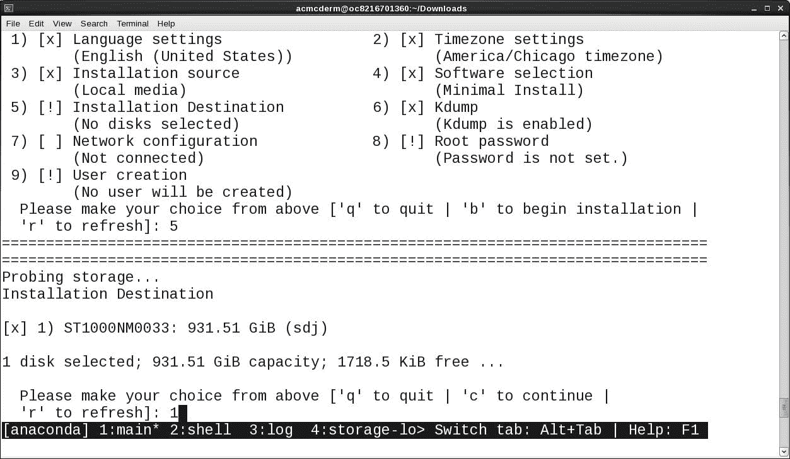

选择 **7** 时，系统会执行一项类似的功能，找到所有可用于该操作系统的网络连接。请注意，这些是安装在系统中的网格上的可用端口，而不是 FSP 端口。

##### 图 8\. 网络安装

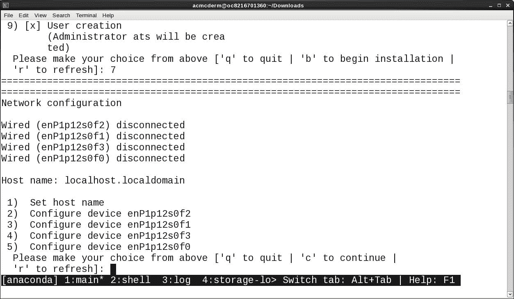

配置了所有操作系统设置后，选择 “b” 以开始安装。系统将加载 Red Hat Enterprise Linux，如果以前未配置它们，它会要求您创建一个用户并设置根密码。完成上述操作后，您将拥有 Linux 登录凭证并能继续操作。

##### 图 9\. Linux 登录提示


## 设置 x86 系统上的 IMM 来安装 RHEL

现在让我们看看 x86 系统上的相同过程。我们假设系统上连接了一台显示器和键盘。

图 1 显示了您在启动 x86 系统后会看到的第一个屏幕。IMM 用于管理系统的 IP 地址、网络掩码和网关。选择 **System Settings** 。

##### 图 10\. IMM Configuration 屏幕

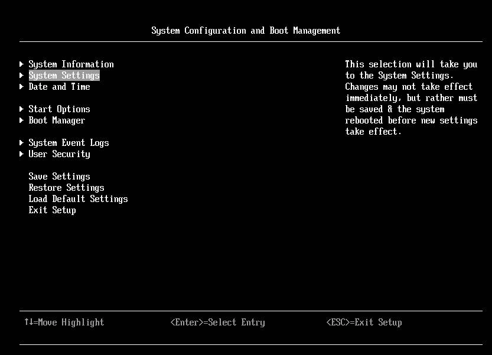

## 连接到 IMM on x86

选择 **Integrated Management Module** 。

##### 图 11\. IMM 系统设置（x86 系统）

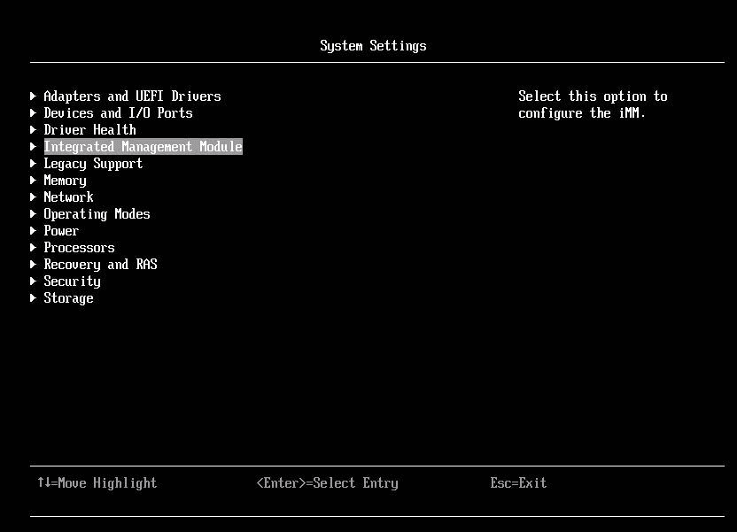

## 设置 x86 上的 IMM 的 IP 地址

选择 Integrated Management Module 屏幕中的 **Network Configuration** 。

##### 图 12\. IMM 网络配置 – x86 屏幕

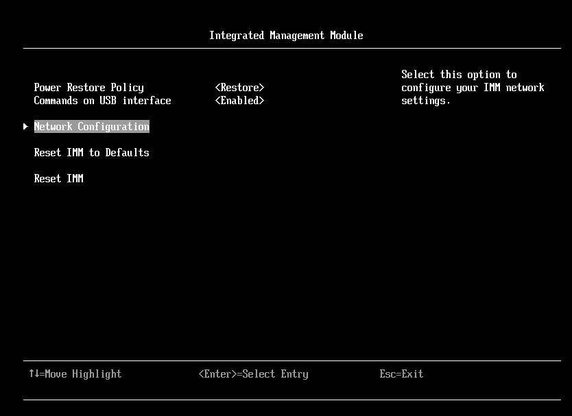

填入 IP 地址信息（IP 地址、子网掩码和默认网关）并选择 **Save Network Settings** ，这些设置将应用于此系统的管理接口。

##### 图 13\. IMM 网络设置

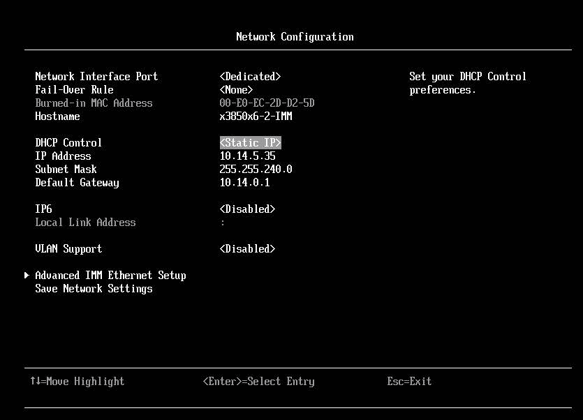

在配置 IMM 后，将会运行 GRand Unified Bootloader (GRUB) 并显示图 14 中所示的屏幕。

## X86 安装过程

选择 **Install Red Hat Enterprise Linux 7.2** 来安装 RHEL。

##### 图 14\. 安装 Red Hat


### x86 上的 Red Hat 安装主菜单

安装 Red Hat 的主菜单与我们之前看到的基于 POWER8 处理器的 Anaconda 菜单非常相似。像之前所做的一样，您将需要选择和配置操作系统的每个部分。

##### 图 15\. x86 中的 Red Hat 安装

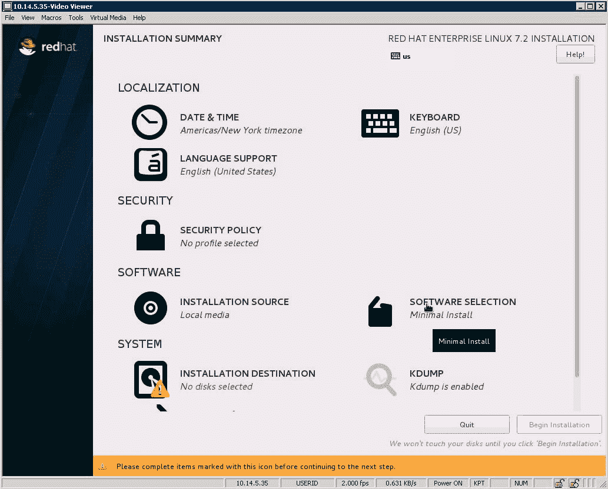

从图 15 中，可以看到一个未像前面的示例中一样被选择来加载操作系统。单击 **Installation Destination** 。

***磁盘选择***

安装程序找到可用的磁盘后，选择安装该操作系统的驱动器。

##### 图 16\. 磁盘选择

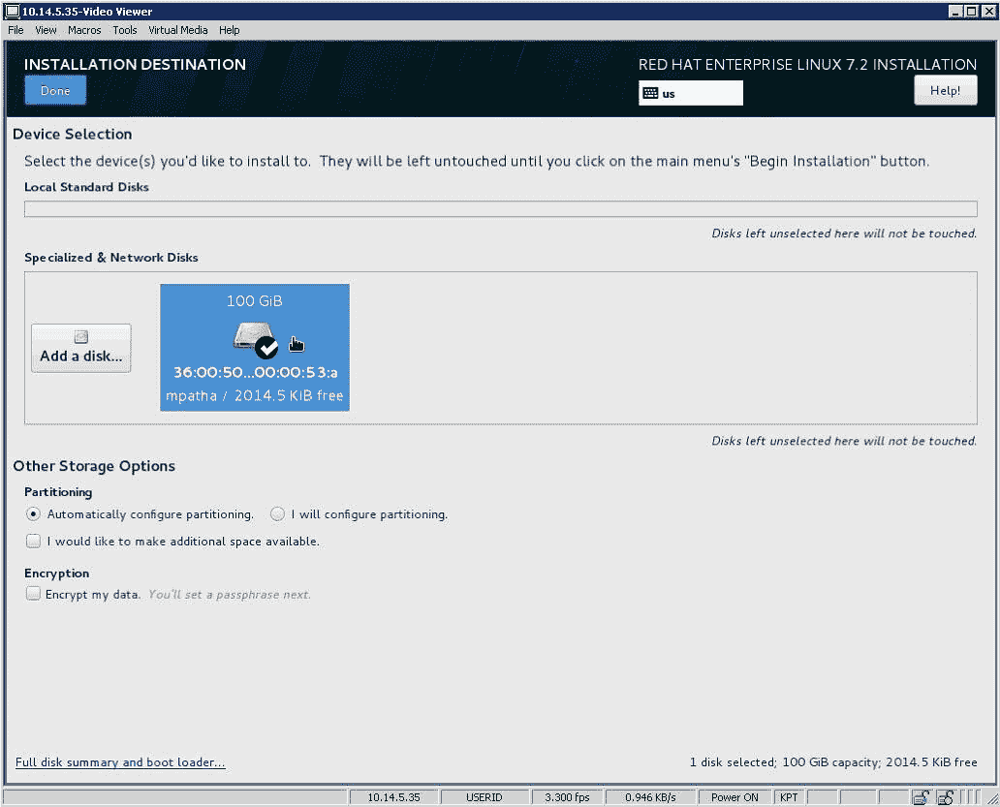

## 配置网络

类似地，网络安装将会找到所有可用的网络端口。选择您想要配置的端口并输入详细信息，比如 IP 地址、子网掩码和网关等。

##### 图 17\. 网络配置

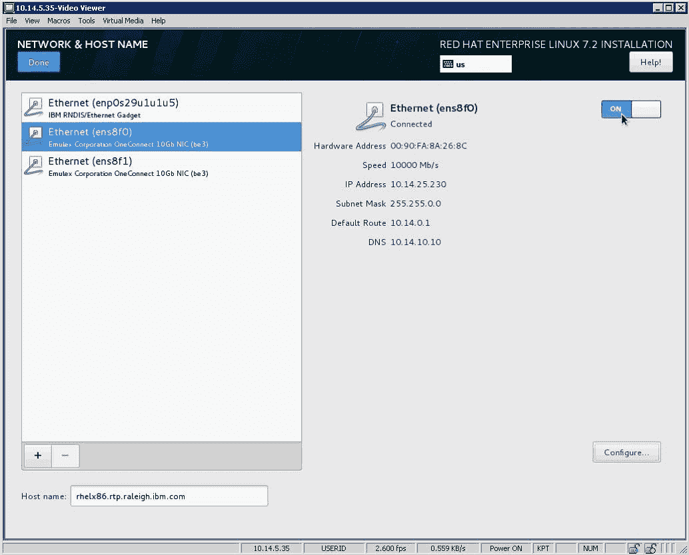

在完成操作系统配置 / 安装后，会要求您添加一个用户并设置根密码。然后您就可以登录并开始工作了。

##### 图 18\. Red Hat 登录屏幕


## 结束语

我们希望您已经了解到，Red Hat 的安装过程在两种硬件版本上基本上是相同的。在初始安装和启动时有细微的区别，但在安装操作系统后，安装在 Power System 上的 Red Hat 版本与安装在 x86 系统上的版本完全相同。您现在可以配置存储库并加载您想要使用的任何开源应用程序！

## 致谢

感谢以下技术专家为帮助我们完成本文所做的贡献。

*   Ruviano Martinez
*   Julie Peet
*   Mark Rudisill

## 参考资料

*   [Red Hat Enterprise Linux – 安装指南](https://access.redhat.com/documentation/en-US/Red_Hat_Enterprise_Linux/7/html/Installation_Guide/)
*   [IBM Power Systems S812L 和 S822L 技术概述和简介](https://www.redbooks.ibm.com/abstracts/redp5098.html?Open)
*   [IPMItool Linux 手册页](http://linux.die.net/man/1/ipmitool)
*   [IBM Developer 中国 Linux 专区](http://www.ibm.com/developerworks/cn/linux/) ：为使用 Linux 产品的开发人员准备的技术信息和资料。这里提供产品下载、how-to 信息、支持资源以及免费技术库，包含 2000 多份技术文章、教程、最佳实践、IBM Redbook 和在线产品手册。
*   加入 [developerWorks 中文社区](http://www.ibm.com/developerworks/cn/community/) ，developerWorks 社区是一个面向全球 IT 专业人员，可以提供博客、书签、wiki、群组、联系、共享和协作等社区功能的专业社交网络社区。

本文翻译自：[Installing Red Hat Enterprise Linux 7.2 on IBM POWER8 and x86 in bare metal mode](https://developer.ibm.com/articles/l-installing-rhel-7-2-on-ibm-power8-and-x86/)（2016-03-02）