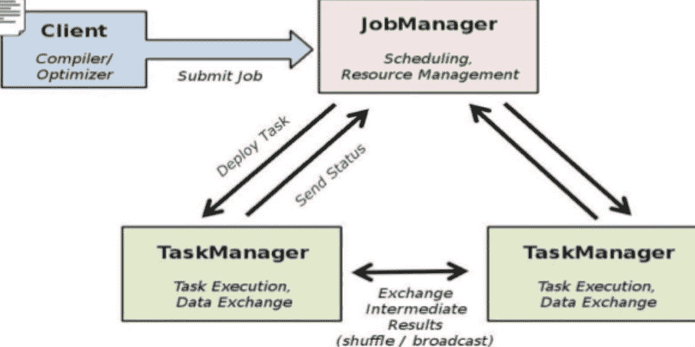
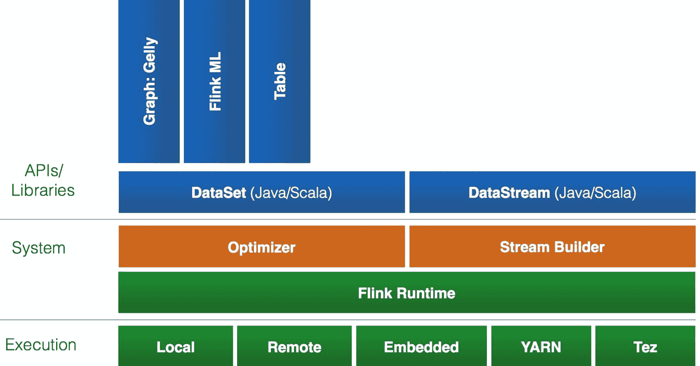
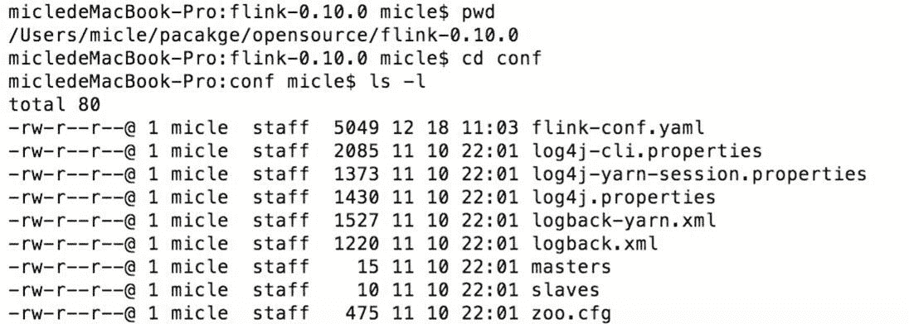
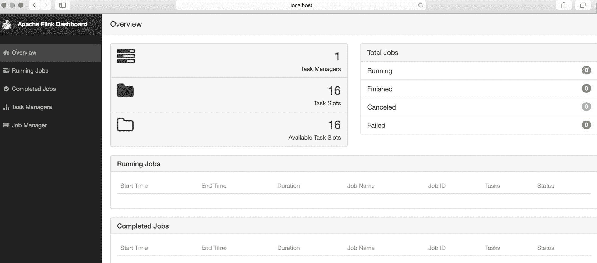
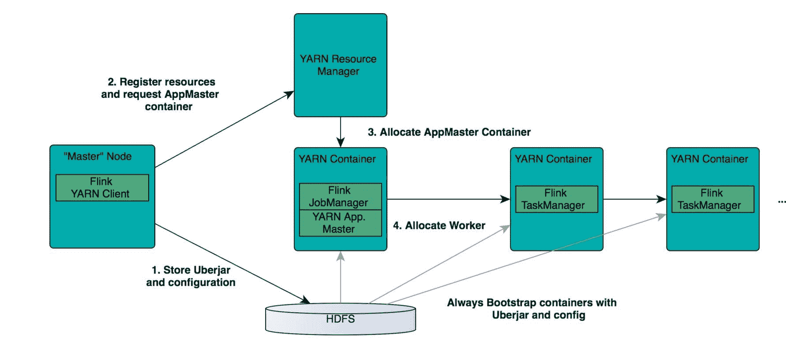
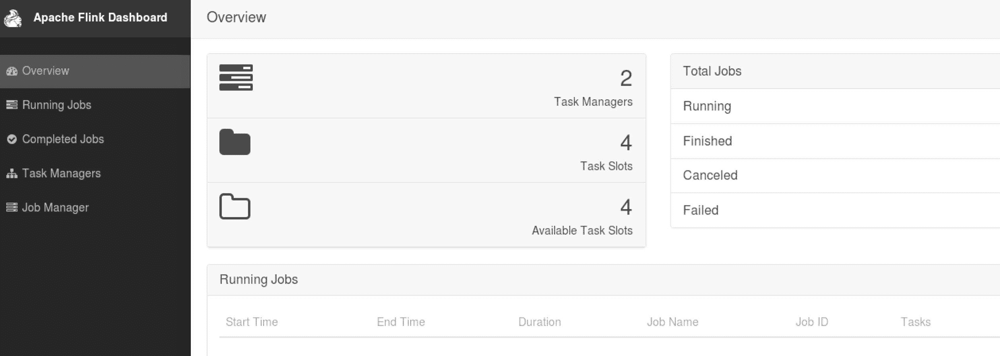

# 新一代大数据处理引擎 Apache Flink

> 原文：[`developer.ibm.com/zh/articles/os-cn-apache-flink/`](https://developer.ibm.com/zh/articles/os-cn-apache-flink/)

## 大数据计算引擎的发展

这几年大数据的飞速发展，出现了很多热门的开源社区，其中著名的有 Hadoop、Storm，以及后来的 Spark，他们都有着各自专注的应用场景。Spark 掀开了内存计算的先河，也以内存为赌注，赢得了内存计算的飞速发展。Spark 的火热或多或少的掩盖了其他分布式计算的系统身影。就像 Flink，也就在这个时候默默的发展着。

在国外一些社区，有很多人将大数据的计算引擎分成了 4 代，当然，也有很多人不会认同。我们先姑且这么认为和讨论。

首先第一代的计算引擎，无疑就是 Hadoop 承载的 MapReduce。这里大家应该都不会对 MapReduce 陌生，它将计算分为两个阶段，分别为 Map 和 Reduce。对于上层应用来说，就不得不想方设法去拆分算法，甚至于不得不在上层应用实现多个 Job 的串联，以完成一个完整的算法，例如迭代计算。

由于这样的弊端，催生了支持 DAG 框架的产生。因此，支持 DAG 的框架被划分为第二代计算引擎。如 Tez 以及更上层的 Oozie。这里我们不去细究各种 DAG 实现之间的区别，不过对于当时的 Tez 和 Oozie 来说，大多还是批处理的任务。

接下来就是以 Spark 为代表的第三代的计算引擎。第三代计算引擎的特点主要是 Job 内部的 DAG 支持（不跨越 Job），以及强调的实时计算。在这里，很多人也会认为第三代计算引擎也能够很好的运行批处理的 Job。

随着第三代计算引擎的出现，促进了上层应用快速发展，例如各种迭代计算的性能以及对流计算和 SQL 等的支持。Flink 的诞生就被归在了第四代。这应该主要表现在 Flink 对流计算的支持，以及更一步的实时性上面。当然 Flink 也可以支持 Batch 的任务，以及 DAG 的运算。

或许会有人不同意以上的分类，我觉得其实这并不重要的，重要的是体会各个框架的差异，以及更适合的场景。并进行理解，没有哪一个框架可以完美的支持所有的场景，也就不可能有任何一个框架能完全取代另一个，就像 Spark 没有完全取代 Hadoop，当然 Flink 也不可能取代 Spark。本文将致力描述 Flink 的原理以及应用。

## Flink 简介

很多人可能都是在 2015 年才听到 Flink 这个词，其实早在 2008 年，Flink 的前身已经是柏林理工大学一个研究性项目， 在 2014 被 Apache 孵化器所接受，然后迅速地成为了 ASF（Apache Software Foundation）的顶级项目之一。Flink 的最新版本目前已经更新到了 0.10.0 了，在很多人感慨 Spark 的快速发展的同时，或许我们也该为 Flink 的发展速度点个赞。

Flink 是一个针对流数据和批数据的分布式处理引擎。它主要是由 Java 代码实现。目前主要还是依靠开源社区的贡献而发展。对 Flink 而言，其所要处理的主要场景就是流数据，批数据只是流数据的一个极限特例而已。再换句话说，Flink 会把所有任务当成流来处理，这也是其最大的特点。Flink 可以支持本地的快速迭代，以及一些环形的迭代任务。并且 Flink 可以定制化内存管理。在这点，如果要对比 Flink 和 Spark 的话，Flink 并没有将内存完全交给应用层。这也是为什么 Spark 相对于 Flink，更容易出现 OOM 的原因（out of memory）。就框架本身与应用场景来说，Flink 更相似与 Storm。如果之前了解过 Storm 或者 Flume 的读者，可能会更容易理解 Flink 的架构和很多概念。下面让我们先来看下 Flink 的架构图。

##### 图 1\. Flink 架构图



如图 1 所示，我们可以了解到 Flink 几个最基础的概念，Client、JobManager 和 TaskManager。Client 用来提交任务给 JobManager，JobManager 分发任务给 TaskManager 去执行，然后 TaskManager 会心跳的汇报任务状态。看到这里，有的人应该已经有种回到 Hadoop 一代的错觉。确实，从架构图去看，JobManager 很像当年的 JobTracker，TaskManager 也很像当年的 TaskTracker。然而有一个最重要的区别就是 TaskManager 之间是是流（Stream）。其次，Hadoop 一代中，只有 Map 和 Reduce 之间的 Shuffle，而对 Flink 而言，可能是很多级，并且在 TaskManager 内部和 TaskManager 之间都会有数据传递，而不像 Hadoop，是固定的 Map 到 Reduce。

## Flink 中的调度简述

在 Flink 集群中，计算资源被定义为 Task Slot。每个 TaskManager 会拥有一个或多个 Slots。JobManager 会以 Slot 为单位调度 Task。但是这里的 Task 跟我们在 Hadoop 中的理解是有区别的。对 Flink 的 JobManager 来说，其调度的是一个 Pipeline 的 Task，而不是一个点。举个例子，在 Hadoop 中 Map 和 Reduce 是两个独立调度的 Task，并且都会去占用计算资源。对 Flink 来说 MapReduce 是一个 Pipeline 的 Task，只占用一个计算资源。类同的，如果有一个 MRR 的 Pipeline Task，在 Flink 中其也是一个被整体调度的 Pipeline Task。在 TaskManager 中，根据其所拥有的 Slot 个数，同时会拥有多个 Pipeline。

在 Flink StandAlone 的部署模式中，这个还比较容易理解。因为 Flink 自身也需要简单的管理计算资源（Slot）。当 Flink 部署在 Yarn 上面之后，Flink 并没有弱化资源管理。也就是说这时候的 Flink 在做一些 Yarn 该做的事情。从设计角度来讲，我认为这是不太合理的。如果 Yarn 的 Container 无法完全隔离 CPU 资源，这时候对 Flink 的 TaskManager 配置多个 Slot，应该会出现资源不公平利用的现象。Flink 如果想在数据中心更好的与其他计算框架共享计算资源，应该尽量不要干预计算资源的分配和定义。

需要深度学习 Flink 调度读者，可以在 Flink 的源码目录中找到 flink-runtime 这个文件夹，JobManager 的 code 基本都在这里。

## Flink 的生态圈

一个计算框架要有长远的发展，必须打造一个完整的 Stack。不然就跟纸上谈兵一样，没有任何意义。只有上层有了具体的应用，并能很好的发挥计算框架本身的优势，那么这个计算框架才能吸引更多的资源，才会更快的进步。所以 Flink 也在努力构建自己的 Stack。

Flink 首先支持了 Scala 和 Java 的 API，Python 也正在测试中。Flink 通过 Gelly 支持了图操作，还有机器学习的 FlinkML。Table 是一种接口化的 SQL 支持，也就是 API 支持，而不是文本化的 SQL 解析和执行。对于完整的 Stack 我们可以参考下图。

##### 图 2\. Flink 的 Stack



Flink 为了更广泛的支持大数据的生态圈，其下也实现了很多 Connector 的子项目。最熟悉的，当然就是与 Hadoop HDFS 集成。其次，Flink 也宣布支持了 Tachyon、S3 以及 MapRFS。不过对于 Tachyon 以及 S3 的支持，都是通过 Hadoop HDFS 这层包装实现的，也就是说要使用 Tachyon 和 S3，就必须有 Hadoop，而且要更改 Hadoop 的配置（core-site.xml）。如果浏览 Flink 的代码目录，我们就会看到更多 Connector 项目，例如 Flume 和 Kafka。

## Flink 的部署

Flink 有三种部署模式，分别是 Local、Standalone Cluster 和 Yarn Cluster。对于 Local 模式来说，JobManager 和 TaskManager 会公用一个 JVM 来完成 Workload。如果要验证一个简单的应用，Local 模式是最方便的。实际应用中大多使用 Standalone 或者 Yarn Cluster。下面我主要介绍下这两种模式。

### Standalone 模式

在搭建 Standalone 模式的 Flink 集群之前，我们需要先下载 Flink 安装包。这里我们需要下载 Flink 针对 Hadoop 1.x 的包。下载并解压后，进到 Flink 的根目录，然后查看 conf 文件夹，如下图。

##### 图 3\. Flink 的目录结构



我们需要指定 Master 和 Worker。Master 机器会启动 JobManager，Worker 则会启动 TaskManager。因此，我们需要修改 conf 目录中的 master 和 slaves。在配置 master 文件时，需要指定 JobManager 的 UI 监听端口。一般情况下，JobManager 只需配置一个，Worker 则须配置一个或多个（以行为单位）。示例如下：

```
micledeMacBook-Pro:conf micle$ cat masters
localhost:8081

micledeMacBook-Pro:conf micle$ cat slaves
localhost 
```

在 conf 目录中找到文件 flink-conf.yaml。在这个文件中定义了 Flink 各个模块的基本属性，如 RPC 的端口，JobManager 和 TaskManager 堆的大小等。在不考虑 HA 的情况下，一般只需要修改属性 taskmanager.numberOfTaskSlots，也就是每个 Task Manager 所拥有的 Slot 个数。这个属性，一般设置成机器 CPU 的 core 数，用来平衡机器之间的运算性能。其默认值为 1。配置完成后，使用下图中的命令启动 JobManager 和 TaskManager（启动之前，需要确认 Java 的环境是否已经就绪）。

##### 图 4\. 启动 StandAlone 模式的 Flink


启动之后我们就可以登陆 Flink 的 GUI 页面。在页面中我们可以看到 Flink 集群的基本属性，在 JobManager 和 TaskManager 的页面中，可以看到这两个模块的属性。目前 Flink 的 GUI，只提供了简单的查看功能，无法动态修改配置属性。一般在企业级应用中，这是很难被接受的。因此，一个企业真正要应用 Flink 的话，估计也不得不加强 WEB 的功能。

##### 图 5\. Flink 的 GUI 页面



### Yarn Cluster 模式

在一个企业中，为了最大化的利用集群资源，一般都会在一个集群中同时运行多种类型的 Workload。因此 Flink 也支持在 Yarn 上面运行。首先，让我们通过下图了解下 Yarn 和 Flink 的关系。

##### 图 6\. Flink 与 Yarn 的关系



在图中可以看出，Flink 与 Yarn 的关系与 MapReduce 和 Yarn 的关系是一样的。Flink 通过 Yarn 的接口实现了自己的 App Master。当在 Yarn 中部署了 Flink，Yarn 就会用自己的 Container 来启动 Flink 的 JobManager（也就是 App Master）和 TaskManager。

了解了 Flink 与 Yarn 的关系，我们就简单看下部署的步骤。在这之前需要先部署好 Yarn 的集群，这里我就不做介绍了。我们可以通过以下的命令查看 Yarn 中现有的 Application，并且来检查 Yarn 的状态。

```
yarn application –list 
```

如果命令正确返回了，就说明 Yarn 的 RM 目前已经在启动状态。针对不同的 Yarn 版本，Flink 有不同的安装包。我们可以在 Apache Flink 的下载页中找到对应的安装包。我的 Yarn 版本为 2.7.1。再介绍具体的步骤之前，我们需要先了解 Flink 有两种在 Yarn 上面的运行模式。一种是让 Yarn 直接启动 JobManager 和 TaskManager，另一种是在运行 Flink Workload 的时候启动 Flink 的模块。前者相当于让 Flink 的模块处于 Standby 的状态。这里，我也主要介绍下前者。

在下载和解压 Flink 的安装包之后，需要在环境中增加环境变量 HADOOP_CONF_DIR 或者 YARN_CONF_DIR，其指向 Yarn 的配置目录。如运行下面的命令：

```
export HADOOP_CONF_DIR=/etc/hadoop/conf 
```

这是因为 Flink 实现了 Yarn 的 Client，因此需要 Yarn 的一些配置和 Jar 包。在配置好环境变量后，只需简单的运行如下的脚本，Yarn 就会启动 Flink 的 JobManager 和 TaskManager。

```
yarn-session.sh –d –s 2 –tm 800 –n 2 
```

上面的命令的意思是，向 Yarn 申请 2 个 Container 启动 TaskManager（-n 2），每个 TaskManager 拥有两个 Task Slot（-s 2），并且向每个 TaskManager 的 Container 申请 800M 的内存。在上面的命令成功后，我们就可以在 Yarn Application 页面看到 Flink 的纪录。如下图。

##### 图 7\. Flink on Yarn


如果有些读者在虚拟机中测试，可能会遇到错误。这里需要注意内存的大小，Flink 向 Yarn 会申请多个 Container，但是 Yarn 的配置可能限制了 Container 所能申请的内存大小，甚至 Yarn 本身所管理的内存就很小。这样很可能无法正常启动 TaskManager，尤其当指定多个 TaskManager 的时候。因此，在启动 Flink 之后，需要去 Flink 的页面中检查下 Flink 的状态。这里可以从 RM 的页面中，直接跳转（点击 Tracking UI）。这时候 Flink 的页面如图 8。

##### 图 8\. Flink 的页面



对于 Flink 安装时的 Trouble-shooting，可能更多时候需要查看 Yarn 相关的 log 来分析。这里就不多做介绍，读者可以到 Yarn 相关的描述中查找。

## Flink 的 HA

对于一个企业级的应用，稳定性是首要要考虑的问题，然后才是性能，因此 HA 机制是必不可少的。另外，对于已经了解 Flink 架构的读者，可能会更担心 Flink 架构背后的单点问题。和 Hadoop 一代一样，从架构中我们可以很明显的发现 JobManager 有明显的单点问题（SPOF，single point of failure）。 JobManager 肩负着任务调度以及资源分配，一旦 JobManager 出现意外，其后果可想而知。Flink 对 JobManager HA 的处理方式，原理上基本和 Hadoop 一样（一代和二代）。

首先，我们需要知道 Flink 有两种部署的模式，分别是 Standalone 以及 Yarn Cluster 模式。对于 Standalone 来说，Flink 必须依赖于 Zookeeper 来实现 JobManager 的 HA（Zookeeper 已经成为了大部分开源框架 HA 必不可少的模块）。在 Zookeeper 的帮助下，一个 Standalone 的 Flink 集群会同时有多个活着的 JobManager，其中只有一个处于工作状态，其他处于 Standby 状态。当工作中的 JobManager 失去连接后（如宕机或 Crash），Zookeeper 会从 Standby 中选举新的 JobManager 来接管 Flink 集群。

对于 Yarn Cluaster 模式来说，Flink 就要依靠 Yarn 本身来对 JobManager 做 HA 了。其实这里完全是 Yarn 的机制。对于 Yarn Cluster 模式来说，JobManager 和 TaskManager 都是被 Yarn 启动在 Yarn 的 Container 中。此时的 JobManager，其实应该称之为 Flink Application Master。也就说它的故障恢复，就完全依靠着 Yarn 中的 ResourceManager（和 MapReduce 的 AppMaster 一样）。由于完全依赖了 Yarn，因此不同版本的 Yarn 可能会有细微的差异。这里不再做深究。

## Flink 的 Rest API 介绍

Flink 和其他大多开源的框架一样，提供了很多有用的 Rest API。不过 Flink 的 RestAPI，目前还不是很强大，只能支持一些 Monitor 的功能。Flink Dashboard 本身也是通过其 Rest 来查询各项的结果数据。在 Flink RestAPI 基础上，可以比较容易的将 Flink 的 Monitor 功能和其他第三方工具相集成，这也是其设计的初衷。

在 Flink 的进程中，是由 JobManager 来提供 Rest API 的服务。因此在调用 Rest 之前，要确定 JobManager 是否处于正常的状态。正常情况下，在发送一个 Rest 请求给 JobManager 之后，Client 就会收到一个 JSON 格式的返回结果。由于目前 Rest 提供的功能还不多，需要增强这块功能的读者可以在子项目 flink-runtime-web 中找到对应的代码。其中最关键一个类 WebRuntimeMonitor，就是用来对所有的 Rest 请求做分流的，如果需要添加一个新类型的请求，就需要在这里增加对应的处理代码。下面我例举几个常用 Rest API。

1.  查询 Flink 集群的基本信息: /overview。示例命令行格式以及返回结果如下：

    ```
    $ curl http://localhost:8081/overview{"taskmanagers":1,"slots-total":16,
    "slots-available":16,"jobs-running":0,"jobs-finished":0,"jobs-cancelled":0,"jobs-failed":0} 
    ```

2.  查询当前 Flink 集群中的 Job 信息：/jobs。示例命令行格式以及返回结果如下：

    ```
    $ curl http://localhost:8081/jobs{"jobs-running":[],"jobs-finished":
    ["f91d4dd4fdf99313d849c9c4d29f8977"],"jobs-cancelled":[],"jobs-failed":[]} 
    ```

3.  查询一个指定的 Job 信息: /jobs/jobid。这个查询的结果会返回特别多的详细的内容，这是我在浏览器中进行的测试，如下图：

    图 9\. Rest 查询具体的 Job 信息 {: #图-9-rest-查询具体的-job-信息}

    

想要了解更多 Rest 请求内容的读者，可以去 Apache Flink 的页面中查找。由于篇幅有限，这里就不一一列举。

## 运行 Flink 的 Workload

WordCount 的例子，就像是计算框架的 helloworld。这里我就以 WordCount 为例，介绍下如何在 Flink 中运行 workload。

在安装好 Flink 的环境中，找到 Flink 的目录。然后找到 bin/flink，它就是用来提交 Flink workload 的工具。对于 WordCount，我们可以直接使用已有的示例 jar 包。如运行如下的命令：

```
./bin/flink run ./examples/WordCount.jar hdfs://user/root/test hdfs://user/root/out 
```

上面的命令是在 HDFS 中运行 WordCount，如果没有 HDFS 用本地的文件系统也是可以的，只需要将”hdfs://”换成”file://”。这里我们需要强调一种部署关系，就是 StandAlone 模式的 Flink，也是可以直接访问 HDFS 等分布式文件系统的。

## 结束语

Flink 是一个比 Spark 起步晚的项目，但是并不代表 Flink 的前途就会暗淡。Flink 和 Spark 有很多类似之处，但也有很多明显的差异。本文并没有比较这两者之间的差异，这是未来我想与大家探讨的。例如 Flink 如何更高效的管理内存，如何进一步的避免用户程序的 OOM。在 Flink 的世界里一切都是流，它更专注处理流应用。由于其起步晚，加上社区的活跃度并没有 Spark 那么热，所以其在一些细节的场景支持上，并没有 Spark 那么完善。例如目前在 SQL 的支持上并没有 Spark 那么平滑。在企业级应用中，Spark 已经开始落地，而 Flink 可能还需要一段时间的打磨。在后续文章中，我会详细介绍如何开发 Flink 的程序，以及更多有关 Flink 内部实现的内容。