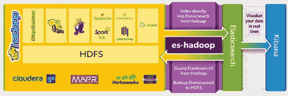
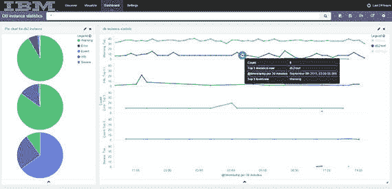

# 基于 ELK Stack 和 Spark Streaming 的日志处理平台设计与实现

> 原文：[`developer.ibm.com/zh/articles/ba-1512-elkstack-logprocessing/`](https://developer.ibm.com/zh/articles/ba-1512-elkstack-logprocessing/)

## 概述

大数据时代，随着数据量不断增长，存储与计算集群的规模也逐渐扩大，几百上千台的云计算环境已不鲜见。现在的集群所需要解决的问题不仅仅是高性能、高可靠性、高可扩展性，还需要面对易维护性以及数据平台内部的数据共享性等诸多挑战。优秀的系统运维平台既能实现数据平台各组件的集中式管理、方便系统运维人员日常监测、提升运维效率，又能反馈系统运行状态给系统开发人员。例如采集数据仓库的日志可以按照时间序列查看各数据库实例各种级别的日志数量与占比，采集 DB2 表空间数据分析可得到数据库集群健康状态，分析应用服务器的日志可以查看出错最多的模块、下载最多的文件、使用最多的功能等。大数据时代的业务与运维将紧密的结合在一起。

## 日志

### 1\. 什么是日志

日志是带时间戳的基于时间序列的机器数据，包括 IT 系统信息（服务器、网络设备、操作系统、应用软件）、物联网各种传感器信息。日志可以反映用户实际行为，是真实的数据。

### 2\. 日志处理方案演进

##### 图 1\. 日志处理方案经历的版本迭代


*   日志处理 v1.0：日志没有集中式处理；只做事后追查，黑客入侵后删除日志无法察觉；使用数据库存储日志，无法胜任复杂事务处理。

*   日志处理 v2.0：使用 Hadoop 平台实现日志离线批处理，缺点是实时性差；使用 Storm 流处理框架、Spark 内存计算框架处理日志，但 Hadoop/Storm/Spark 都是编程框架，并不是拿来即用的平台。

*   日志处理 v3.0：使用日志实时搜索引擎分析日志，特点：第一是快，日志从产生到搜索分析出结果只有数秒延时；第二是大，每天处理 TB 日志量；第三是灵活，可搜索分析任何日志。作为代表的解决方案有 Splunk、ELK、SILK。

##### 图 2\. 深度整合 ELK、Spark、Hadoop 构建日志分析系统


## ELK Stack

ELK Stack 是开源日志处理平台解决方案，背后的商业公司是 Elastic(`https://www.elastic.co/`)。它由日志采集解析工具 Logstash、基于 Lucene 的全文搜索引擎 Elasticsearch、分析可视化平台 Kibana 组成。目前 ELK 的用户有 Adobe、Microsoft、Mozilla、Facebook、Stackoverflow、Cisco、ebay、Uber 等诸多知名厂商。

### 1\. Logstash

Logstash 是一种功能强大的信息采集工具，类似于 Hadoop 生态圈里的 Flume。通常在其配置文件规定 Logstash 如何处理各种类型的事件流，一般包含 input、filter、output 三个部分。Logstash 为各个部分提供相应的插件，因而有 input、filter、output 三类插件完成各种处理和转换；另外 codec 类的插件可以放在 input 和 output 部分通过简单编码来简化处理过程。下面以 DB2 的一条日志为例。

##### 图 3.DB2 数据库产生的半结构化日志样例


这是一种多行的日志，每一条日志以：”2014-10-19-12.19.46.033037-300”格式的时间戳为起始标志。可以在 input 部分引入 codec 插件 multiline，来将一条日志的多行文本封装到一条消息（message）中。

```
input {
 file {
 path => "path/to/filename"
 codec => multiline {
 pattern => "^\d{4}-\d{2}-\d{2}-\d{2}\.\d{2}\.\d{2}\.\d{6}[\+-]\d{3}"
 negate => true
 what => previous
 }
 }
} 
```

使用 file 插件导入文件形式的日志，而嵌入的 codec 插件 multiline 的参数 pattern 就规定了分割日志条目的时间戳格式。在 DataStage 多行日志的实际应用中，有时一条日志会超过 500 行，这超出了 multiline 组件默认的事件封装的最大行数，这需要我们在 multiline 中设置 max_lines 属性。

经过 input 部分读入预处理后的数据流入 filter 部分，其使用 grok、mutate 等插件来过滤文本和匹配字段，并且我们自己可以为事件流添加额外的字段信息：

```
filter {
 mutate{
 gsub => ['message', "\n", " "]
 }
 grok {
 match => { "message" =>
 "(?<timestamp>%{YEAR}-%{MONTHNUM}-%{MONTHDAY}-%{HOUR}\.%{MINUTE}\.%{SECOND})%{INT:timezone}(?:%{SPACE}%{WORD:recordid}%{SPACE})(?:LEVEL%{SPACE}:%{SPACE}%{DATA:level}%{SPACE})(?:PID%{SPACE}:%{SPACE}%{INT:processid}%{SPACE})(?:TID%{SPACE}:%{SPACE}%{INT:threadid}%{SPACE})(?:PROC%{SPACE}:%{SPACE}%{DATA:process}%{SPACE})?(?:INSTANCE%{SPACE}:%{SPACE}%{WORD:instance}%{SPACE})?(?:NODE%{SPACE}:%{SPACE}%{WORD:node}%{SPACE})?(?:DB%{SPACE}:%{SPACE}%{WORD:dbname}%{SPACE})?(?:APPHDL%{SPACE}:%{SPACE}%{NOTSPACE:apphdl}%{SPACE})?(?:APPID%{SPACE}:%{SPACE}%{NOTSPACE:appid}%{SPACE})?(?:AUTHID%{SPACE}:%{SPACE}%{WORD:authid}%{SPACE})?(?:HOSTNAME%{SPACE}:%{SPACE}%{HOSTNAME:hostname}%{SPACE})?(?:EDUID%{SPACE}:%{SPACE}%{INT:eduid}%{SPACE})?(?:EDUNAME%{SPACE}:%{SPACE}%{DATA:eduname}%{SPACE})?(?:FUNCTION%{SPACE}:%{SPACE}%{DATA:function}%{SPACE})(?:probe:%{SPACE}%{INT:probe}%{SPACE})%{GREEDYDATA:functionlog}"
 }
 }
 date {
 match => [ "timestamp", "YYYY-MM-dd-HH.mm.ss.SSSSSS" ]
 }
 } 
```

前面 input 部分的 multiline 插件将一条多行日志项转化为一行，并以”\n”替代实际的换行符。为了便于后面处理，这里的 mutate 插件就是将这些”\n”替换为空格。而 grok 插件用于匹配提取日志项中有意义的字段信息。最后的 date 插件则是按格式”YYYY-MM-dd-HH.mm.ss.SSSSSS”解析提取的时间戳字段，并赋给系统默认的时间戳字段”@timestamp”。Output 插件用于指定事件流的去向，可以是消息队列、全文搜索引擎、TCP Socket、Email 等几十种目标端。

### 2\. Elasticsearch

Elasticsearch 是基于 Lucene 的近实时搜索平台，它能在一秒内返回你要查找的且已经在 Elasticsearch 做了索引的文档。它默认基于 Gossip 路由算法的自动发现机制构建配置有相同 cluster name 的集群，但是有的时候这种机制并不可靠，会发生脑裂现象。鉴于主动发现机制的不稳定性，用户可以选择在每一个节点上配置集群其他节点的主机名，在启动集群时进行被动发现。

Elasticsearch 中的 Index 是一组具有相似特征的文档集合，类似于关系数据库模型中的数据库实例，Index 中可以指定 Type 区分不同的文档，类似于数据库实例中的关系表，Document 是存储的基本单位，都是 JSON 格式，类似于关系表中行级对象。我们处理后的 JSON 文档格式的日志都要在 Elasticsearch 中做索引，相应的 Logstash 有 Elasticsearch output 插件，对于用户是透明的。

Hadoop 生态圈为大规模数据集的处理提供多种分析功能，但实时搜索一直是 Hadoop 的软肋。如今，Elasticsearch for Apache Hadoop（ES-Hadoop）弥补了这一缺陷，为用户整合了 Hadoop 的大数据分析能力以及 Elasticsearch 的实时搜索能力.

##### 图 4\. 应用 es-hadoop 整合 Hadoop Ecosystem 与 Elasticsearch 架构图（`https://www.elastic.co/products/hadoop`）



### 3\. Kibana

Kibana 是专门设计用来与 Elasticsearch 协作的，可以自定义多种表格、柱状图、饼状图、折线图对存储在 Elasticsearch 中的数据进行深入挖掘分析与可视化。下图定制的仪表盘可以动态监测数据库集群中每个数据库实例产生的各种级别的日志。

##### 图 5\. 实时监测 DB2 实例运行状态的动态仪表盘



## Kafka

Kafka 是 LinkedIn 开源的分布式消息队列，它采用了独特的消费者-生产者架构实现数据平台各组件间的数据共享。集群概念中的 server 在 Kafka 中称之为 broker，它使用主题管理不同类别的数据，比如 DB2 日志归为一个主题，tomcat 日志归为一个主题。我们使用 Logstash 作为 Kafka 消息的生产者时，output 插件就需要配置好 Kafka broker 的列表，也就是 Kafka 集群主机的列表；相应的，用作 Kafka 消费者角色的 Logstash 的 input 插件就要配置好需要订阅的 Kafka 中的主题名称和 ZooKeeper 主机列表。Kafka 通过将数据持久化到硬盘的 Write Ahead Log（WAL）保证数据可靠性与顺序性，但这并不会影响实时数据的传输速度，实时数据仍是通过内存传输的。Kafka 是依赖于 ZooKeeper 的，它将每组消费者消费的相应 topic 的偏移量保存在 ZooKeeper 中。据称 LinkedIn 内部的 Kafka 集群每天已能处理超过 1 万亿条消息。

##### 图 6\. 基于消息订阅机制的 Kafka 架构


除了可靠性和独特的 push&pull 架构外，相较于其他消息队列，Kafka 还拥有更大的吞吐量：

##### 图 7\. 基于消息持久化机制的消息队列吞吐量比较


## Spark Streaming

Spark 由加州大学伯克利分校 AMP 实验室 (Algorithms, Machines, and People Lab) 开发，可用来构建大型的、低延迟的数据分析应用程序。它将批处理、流处理、即席查询融为一体。Spark 社区也是相当火爆，平均每三个月迭代一次版本更是体现了它在大数据处理领域的地位。

Spark Streaming 不同于 Storm，Storm 是基于事件级别的流处理，Spark Streaming 是 mini-batch 形式的近似流处理的微型批处理。Spark Streaming 提供了两种从 Kafka 中获取消息的方式：

第一种是利用 Kafka 消费者高级 API 在 Spark 的工作节点上创建消费者线程，订阅 Kafka 中的消息，数据会传输到 Spark 工作节点的执行器中，但是默认配置下这种方法在 Spark Job 出错时会导致数据丢失，如果要保证数据可靠性，需要在 Spark Streaming 中开启 *Write Ahead Logs（WAL）* ，也就是上文提到的 Kafka 用来保证数据可靠性和一致性的数据保存方式。可以选择让 Spark 程序把 WAL 保存在分布式文件系统（比如 HDFS）中。

第二种方式不需要建立消费者线程，使用 createDirectStream 接口直接去读取 Kafka 的 WAL，将 Kafka 分区与 RDD 分区做一对一映射，相较于第一种方法，不需再维护一份 WAL 数据，提高了性能。读取数据的偏移量由 Spark Streaming 程序通过检查点机制自身处理，避免在程序出错的情况下重现第一种方法重复读取数据的情况，消除了 Spark Streaming 与 ZooKeeper/Kafka 数据不一致的风险。保证每条消息只会被 Spark Streaming 处理一次。以下代码片通过第二种方式读取 Kafka 中的数据：

```
// Create direct kafka stream with brokers and topics
JavaPairInputDStream<String, String> messages = KafkaUtils.createDirectStream(
 jssc,
 String.class,
 String.class,
 StringDecoder.class,
 StringDecoder.class,
 kafkaParams,
 topicsSet);
messages.foreachRDD(new Function<JavaPairRDD<String,String>,Void>(){
    public Void call(JavaPairRDD<String, String> v1)
 throws Exception {
        v1.foreach(new VoidFunction<Tuple2<String, String>>(){
 public void call(Tuple2<String, String> tuple2) {
 try{
 JSONObject a = new JSONObject(tuple2._2);
 ... 
```

Spark Streaming 获取到消息后便可以通过 Tuple 对象自定义操作消息，如下图是针对 DB2 数据库日志的邮件告警，生成告警邮件发送到 Notes 邮箱：

##### 图 8\. 基于 Spark Streaming 对 DB2 异常日志实现 Notes 邮件告警


## 互联网行业日志处理方案举例介绍与应用

### 1\. 新浪

新浪采用的技术架构是常见的 Kafka 整合 ELK Stack 方案。Kafka 作为消息队列用来缓存用户日志；使用 Logstash 做日志解析，统一成 JSON 格式输出给 Elasticsearch；使用 Elasticsearch 提供实时日志分析与强大的搜索和统计服务；Kibana 用作数据可视化组件。该技术架构目前服务的用户包括微博、微盘、云存储、弹性计算平台等十多个部门的多个产品的日志搜索分析业务，每天处理约 32 亿条（2TB）日志。

新浪的日志处理平台团队对 Elasticsearch 做了大量优化（比如调整 max open files 等），并且开发了一个独立的 Elasticsearch Index 管理系统，负责索引日常维护任务（比如索引的创建、优化、删除、与分布式文件系统的数据交换等）的调度及执行。为 Elasticsearch 安装了国内中文分词插件 elasticsearch-analysis-ik，满足微盘搜索对中文分词的需求。（见参考资源 2）

### 2\. 腾讯

腾讯蓝鲸数据平台告警系统的技术架构同样基于分布式消息队列和全文搜索引擎。但腾讯的告警平台不仅限于此，它的复杂的指标数据统计任务通过使用 Storm 自定义流式计算任务的方法实现，异常检测的实现利用了曲线的时间周期性和相关曲线之间的相关性去定义动态的阈值，并且基于机器学习算法实现了复杂的日志自动分类（比如 summo logic）。

告警平台把拨测（定时 curl 一下某个 url，有问题就告警）、日志集中检索、日志告警（5 分钟 Error 大于 X 次告警）、指标告警（cpu 使用率大于 X 告警）整合进同一个数据管线，简化了整体的架构。（见参考资源 3）

### 3\. 七牛

七牛采用的技术架构为 Flume＋Kafka＋Spark，混部在 8 台高配机器。根据七牛技术博客提供的数据，该日志处理平台每天处理 500 亿条数据，峰值 80 万 TPS。

Flume 相较于 Logstash 有更大的吞吐量，而且与 HDFS 整合的性能比 Logstash 强很多。七牛技术架构选型显然考虑了这一点，七牛云平台的日志数据到 Kafka 后，一路同步到 HDFS，用于离线统计，另一路用于使用 Spark Streaming 进行实时计算，计算结果保存在 Mongodb 集群中。（见参考资源 4）

任何解决方案都不是十全十美的，具体采用哪些技术要深入了解自己的应用场景。就目前日志处理领域的开源组件来说，在以下几个方面还比较欠缺：

*   Logstash 的内部状态获取不到，目前没有好的成熟的监控方案。
*   Elasticsearch 具有海量存储海量聚合的能力，但是同 Mongodb 一样，并不适合于写入数据非常多（1 万 TPS 以上）的场景。
*   缺乏真正实用的异常检测方法；实时统计方面缺乏成熟的解决方案，Storm 就是一个底层的执行引擎，而 Spark 还缺少时间窗口等抽象。
*   对于日志自动分类，还没有开源工具可以做到 summo logic 那样的效果。

## 结束语

大数据时代的运维管理意义重大，好的日志处理平台可以事半功倍的提升开发人员和运维人员的效率。本文通过简单用例介绍了 ELK Stack、Kafka 和 Spark Streaming 在日志处理平台中各自在系统架构中的功能。现实中应用场景繁多复杂、数据形式多种多样，日志处理工作不是一蹴而就的，分析处理过程还需要在实践中不断挖掘和优化，笔者也将致力于 DB2 数据库运行状态更细节数据的收集和更全面细致的监控。

## 相关主题

*   参考“[日志: 每个软件工程师都应该知晓的实时数据集成提取的那点事](https://engineering.linkedin.com/distributed-systems/log-what-every-software-engineer-should-know-about-real-time-datas-unifying)”，详细了解日志处理。
*   查看文章“[新浪是如何分析处理 32 亿条实时日志的？](https://mp.weixin.qq.com/s?__biz=MzA5OTAyNzQ2OA==∣=207036526&idx=1&sn=b0de410e0d1026cd100ac2658e093160&scene=2&from=timeline&isappinstalled=0#rd)”，了解新浪的日志处理方案设计。
*   查看文章“[腾讯蓝鲸数据平台之告警系统](https://mp.weixin.qq.com/s?__biz=MzA5OTAyNzQ2OA==∣=207255171&idx=1&sn=733c8348c624d81a98a6aa9ec566497b&scene=2&from=timeline&isappinstalled=0#rd)”，了解腾讯在大型系统运维工程上的实践。
*   查看文章“ [Mesos 在去哪儿网的应用](http://dockone.io/article/675)”，了解去哪儿网利用日志在集群管理中的实践。
*   参考网站“ [`softwaremill.com/mqperf/`](https://softwaremill.com/mqperf/)”，了解基于消息持久化的各消息队列各种负载下的性能分析。