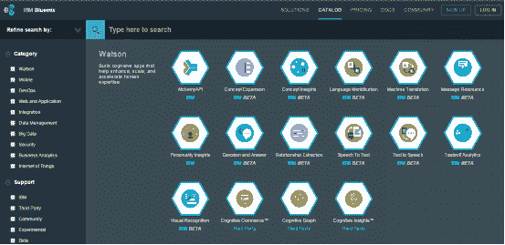
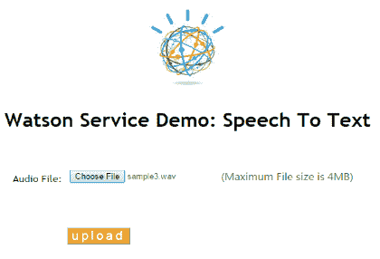
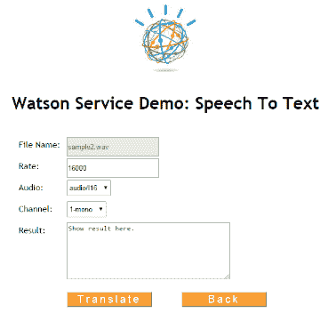
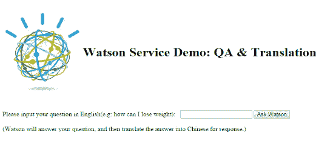
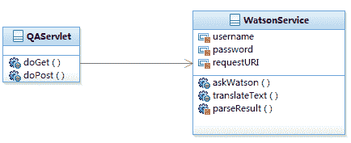

# IBM Watson 服务详解 – Speech to Text

> 原文：[`developer.ibm.com/zh/articles/1512-zhansh-speechtotext/`](https://developer.ibm.com/zh/articles/1512-zhansh-speechtotext/)

Watson 的语音识别服务的识别准确率会受到语音输入质量的影响，但凭借 Watson 强大的认知计算能力，仍能在某些单词发音模糊时，根据上下文来推断出该单词以保证整句话的流畅。通过对比，笔者发现 Watson 语音识别服务的识别率也高于其他语音识别服务。目前关于该服务的文档以及应用服务接口介绍在 IBM Cloud 中可以找到，但是这些文档涉及内容略显简单，开发人员在阅读和实践时仍会遇到很多问题。本文将针对该服务做详细介绍，解读其 API，并给出一个基于 Java 的演示实例，希望借此抛砖引玉，使您能对此服务有更深刻的理解，合理使用该服务来开发强大的应用。

## IBM Watson 语音识别服务介绍

使用 IBM id 登录到 IBM Cloud 后，在 Catalog 中可以找到所有可用的 IBM Watson 服务，如图 1 所示：

##### 图 1\. IBM Cloud 中的 IBM Waston 服务



Speech to Text 服务于 2015 年 3 月份在 IBM Cloud Watson 服务目录下开放，虽然其仍属于测试版本，但其基本功能已能正常运行，识别率也已高出业界大多数英文语音识别服务。从该服务的官方介绍中，可以了解到目前所支持的语音输入包含以下两大类：

### 通过麦克风实时录制的音频流

目前业界类似的功能出现在某些语音输入法里，说出的单词被转化成文字以达到文字输入的目的。事实上，Watson 语音识别服务对实时音频流的解析识别，与上述的语音输入法完全不同。Watson 在进行语音识别时，并不仅仅对音频流中的单词逐一识别，而是会结合单词所处的上下文，更准确地解析单词。因此，我们可以观察到，Watson 在进行语音实时识别时，之前识别的前半句的内容，有可能会在后半句被识别时发生改变。

### 事先录制好的音频文件

目前 Watson 语音识别服务支持的音频编码有两种：wav 和 flac。除编码外，音频文件的声道数、码率及频率等都需要同音频文件一起传递给 Watson。这些参数如果出现不一致，将会对最后的识别结果产生很大影响。例如，Watson 在 IBM Cloud 上公开了一个简单的演示（ [`speech-to-text-demo.ng.bluemix.net/`](https://speech-to-text-demo.ng.bluemix.net/) ），笔者将其音频文件替换成自己准备的文件进行识别，但没有修改程序里的参数使其与自己的文件一致，从而影响了识别结果，与实际内容差别巨大。

## Watson 语音识别服务 API 详解

Watson 服务的 API 均是以 RESTful 的方式给出，语音识别服务也不例外。API 的官方介绍（ [`www.ibm.com/smarterplanet/us/en/ibmwatson/developercloud/apis/#!/speech-to-text`](http://www.ibm.com/smarterplanet/us/en/ibmwatson/developercloud/apis/#!/speech-to-text) ）列出了 10 个方法，方法 v1/recognize 是所有方法的核心，主要负责语音文件的识别。其他方法有负责获取 session 的，有负责获取识别语言的模块的（目前只支持英文的识别），也有负责多文件同时识别的。下面将对 v1/recognize 方法进行详细剖析。

该方法为 HTTP POST 方法，支持以下几种参数：

### Content-Type

该参数位于 HTTP HEADER 中，用于描述当前文件的格式。如”audio/flac; rate=48000; channels=2”，代表的是该文件是 flac 编码、频率是 48khz、双声道。音频文件的详细参数信息可以通过专业音频软件或者某些音频管理或播放软件（如 itunes）进行查看。如前文所述，该参数的取值必须与音频文件严格一致，否则将会影响最终的识别结果。

### Transfer-encoding

该参数位于 HTTP HEADER 中，默认值为空，可选值为 chunked。当其被设置为 chunked 时，音频文件在上传时会使用流模式。而 Watson 规定音频文件的长度超过 5 分钟时，需要使用流模式上传。

### Continuous

该参数位于 POST 请求的 query 参数中，可选值为 true 和 false，默认为 false。当该参数被设置为 true 时，Watson 可自动识别音频文件中的停顿，并返回以停顿为分割的多个识别结果。当其被设置为 false 时，Watson 仅会返回第一处停顿之前的音频识别结果。因此，当上传的音频文件包含多句话时，建议将该参数设置为 true。

### X-logging

该参数位于 POST 请求的 HEADER 里，可选值为 0 和 1，默认为 1。当该参数被设置为 0 时，服务器在识别完音频文件后，会立即将该文件和识别结果清理掉。

## Java 实例剖析与应用

上文分析了 Watson 语音识别服务主要的 API 及参数，在此基础上，本节使用 Java 语言具体展示如何使用这些 API 来进行语音识别。由于 IBM Cloud 中关于该部分的实例以 Node.js 为主，没有包含 Java 部分，所以本节会涉及诸多细节，以方便您进行实验。

### Java 实例功能介绍

本实例功能是通过 IBM Waston 语音服务，识别上传到服务器上的音频文件。用户可以在文件上传界面选择音频文件进行上传，并将该文件保存到服务器端。之后，用户可以通过音频识别页面对上传的音频文件进行智能识别，识别的结果会显示在音频识别页面上。通过本实例可以将音频文件转化为文字，非常简单实用。

本实例采用 Java Web 架构，前端页面通过 HTML 和 jQuery 实现，服务器端功能通过 Java 实现，前端和服务器端通过 Post 的方式进行交互。本实例可以部署在 Tomcat 服务器上运行。

### 音频文件上传界面

该界面的功能是用来选择上传文件，并保存该文件到服务器端。服务器端的实现会在后面的文章中进行介绍。首先展示一下界面，能够让读者有个直观的认识。如图 2 所示，页面上有一个 choose file 按钮和一个 upload 按钮。通过 choose file 按钮可以浏览并选择电脑上存放的音频文件，所选择的文件名会在按钮右边显示。之后点击 upload 按钮可以将该文件上传到服务器上。

##### 图 2.音频文件上传页面



音频上传页面通过 HTML 实现，页面主体是一个 form 表格，点击 upload 按钮会将表格中的信息，包括选中的文件内容，通过 POST 方法提交到/SpeechToText/UploadFile 这个 servlet。需要注意的是，form 表格中的 enctype 参数必须为 multipart/form-data，否则对应 servlet 中无法读取上传的文件内容。页面设计的主体代码见清单 1。

##### 清单 1.音频文件上传页面代码实现

```
<div id = "selectFile">
<form id="uploadFile" class="wrapper" action="/SpeechToText/UploadFile"
method="post" enctype="multipart/form-data">
<div class= "form-item">
<div class="form-item-attribute">
<label>Audio File:</label>
</div>
<div class="form-item-value">
<input type="file" name="files" id="fileupload_input" />
</div>
<div class="form-item-value">
<lable>(Maximum File size is 4MB)</lable>
</div>
</div>
</form>
<button id="upload">upload</button>
</div> 
```

### 文件上传服务器端设计

服务器端采用标准的 Java Web 架构。要在前端页面调用某个 servlet 必须在 web.xml 定义该 servlet，这一过程在这里不在细述。文件上传服务器端用来接受前端发过来的 Post 的请求，并将请求中的文件保存到服务器指定目录中。

服务器端的 Upload 类里面的 doPost 方法用来处理前端发送过来的 Post 请求，doPost 方法如清单 2 所示。doPost 方法会对 HTTP 请求进行解析，以获取 HTTP 请求中包含的 Post 请求内容，并存放在 List iter 变量中，然后遍历 iter 变量以获取 POST 过来的所有内容。在这里，我们只关心 POST 过来的文件，而文件的处理是在 processUploadFile 方法中。在 ProcessUploadFile 中，通过 item.getName 方法可以获取上传的文件名，通过 item.write 方法可以将文件保存到指定的路径。为了防止同名文件被覆盖问题，可以把时间戳拼接到文件名中进行保存。

通过这样的设计，我们可以将前端 Post 过来的文件保存到服务器指定目录中，并可以解决同名文件被覆盖的问题。文件保存成功以后，通过 HTTPServletResponse 的 sendRedirect 方法将页面重定位到音频文件识别页面，同时需要将服务器上的文件名放在 URL 中传递到音频文件识别页面。

##### 清单 2.服务器端 Upload 方法代码

```
public void doPost(HTTPServletRequest req, HTTPServletResponse res)
 throws IOException, ServletException
{
try{
DiskFileItemFactory diskFactory = new DiskFileItemFactory();
// threshold 极限、临界值，即硬盘缓存 1M
diskFactory.setSizeThreshold(4 * 1024);
// repository 贮藏室，即临时文件目录
diskFactory.setRepository(new File(tempPath));
ServletFileUpload upload = new ServletFileUpload(diskFactory);
// 设置允许上传的最大文件大小 4M
upload.setSizeMax(4 * 1024 * 1024);
// 解析 HTTP 请求消息头
List fileItems = upload.parseRequest(req);
Iterator iter = fileItems.iterator();
while(iter.hasNext())
{
FileItem item = (FileItem)iter.next();
if(item.isFormField())
{
System.out.println("处理表单内容 ...");
processFormField(item);
}else{
System.out.println("处理上传的文件 ...");
//item 里面包含上传的文件名和文件内容
processUploadFile(item);
}
}// end while()
 //pw.close();
}catch(Exception e){
System.out.println("uploadFile 发生异常 ...");
lastUpdatedFile = "";
e.printStackTrace();
}// end try ... catch ...
if("".equals(lastUpdatedFile))
res.sendRedirect("/SpeechToText/index.html?upload=fail");
else
res.sendRedirect("/SpeechToText/index.html?upload=success&uploadedFileName=" + lastUpdatedFile);
return;
}// end doPost() 
```

### 音频文件识别界面

音频文件识别界面可以让用户指定音频文件的一些参数，点击 translate 即可识别为对应文字。点击 Back 按钮可以回到音频文件上传界面，重新选择文件进行上传。

音频文件识别界面如图 3 所示。在点击 translate 进行识别之前，必须填写或者选择 rate、audio 和 channel 参数，如果没有正确填写，将无法识别音频文件内容。这些参数的含义在 Waston 语音识别服务 API 详解中已经介绍，不再细述。正常识别结果会在 result 框中显示，如图 4 所示。

##### 图 3.音频文件识别页面



##### 图 4.音频文件识别页面结果


清单 3 是 Translate 功能的代码实现，通过 Jquery 来获取页面参数，提交 translate 请求到服务端/SpeechToText/SpeechToText 对应的 servlet，并根据服务器返回的值（音频文件对应的文字）填写到 Result 框中。

##### 清单 3.音频文件识别 Translate 方法代码

```
function translate()
{
$("#selectFile").hide();
$("#parameters").hide();
$("#processing").show();
$.post("/SpeechToText/SpeechToText",
{
filepath: getUrlParam("uploadedFileName"),
audio: $("#audio").val(),
rate: $("#rate").val(),
channels : $("#channel").val()
},
function(data,status){
$("#parameters").show();
$("#processing").hide();
if(status == 'success')
{
if(data){
$("#result").val(data);
alert("Status: " + status);
}
else
alert("Data(return value) is empty!" + "\nStatus: " + status);
}
else
alert("Data: " + data + "\nStatus: " + status);
}
);
}; 
```

### 音频文件识别服务器端设计

音频文件识别服务器端用来接受前端发过来的 Post 的请求，并将对应文件上传到 Waston 服务器进行识别，并将识别结果返回给前端音频文件识别界面。

介绍音频文件识别服务器端设计之前，首先介绍一下 IBM Cloud 中 Watson 服务的 Crendential 信息。 清单 4 展示的是使用 Java 语言来获取并解析 Watson 服务中的”Question and Answer”服务的 Credential 信息。如果该应用是部署在 IBM Cloud 的 Liberty 容器中，则默认情况下，VCAP_SERVICES 是非空的。而当应用是在 IBM Cloud 外部时，我们需要指定 VCAP_SERVICES 的值，如清单 4 的第三行所示。VCAP_SERVICES 中存储的是当前应用所绑定的所有 Service 的 Credential 信息，因此我们可以根据 Service 的标识 ID 取出相应的 Credential 信息。在清单 4 中，Question and Answer 服务的标识 ID 为 Watson QAAPI-0.1。之后，对于 Credential 信息的解析以及赋值，同样适应于其他 IBM Cloud 服务。在拿到了这些信息之后，便可根据 IBM Cloud 服务所提供的调用 API，进行各种请求操作。

##### 清单 4.使用 Java 获取 IBM Cloud 中 Watson 服务的 Crendential 信息：

```
String VCAP_SERVICES = System.getenv("VCAP_SERVICES");
if(VCAP_SERVICES ==null){
//将 Watson 服务的 Credential 信息拷贝至此，
VCAP_SERVICES="{ \"Watson QAAPI-0.1\" :  { \"name\" : \"mt-svc\"......
//此处略去后面具体用户信息
}
if (VCAP_SERVICES != null) {
try {
JSONObject obj = (JSONObject)JSON.parse(VCAP_SERVICES);
JSONArray service = obj.getJSONArray("Watson QAAPI-0.1");

// 获取该服务的 Credential 信息
JSONObject catalog = service.getJSONObject(0);

// 解析 Credential 信息，并把相关字段赋值给本地成员属性
JSONObject credentials = catalog.getJSONObject("credentials");
endpoint = credentials.getString("uri");
username = credentials.getString("userid");
password = credentials.getString("password");

} catch (Exception e) {

e.printStackTrace();

}
} 
```

音频文件识别的过程主要在服务器端的 speech2text 方法中实现，speech2text 方法如清单 5 所示。Speech2text 方法将上传的文件名、audio 类型、rate 值和 channel 值作为输入参数。通过文件名 filename 可以找到服务器上存放的对应文件，和 audio 指、rate 值和 channel 值一起转化为 FileEntity 作为 POST 参数提交到 Waston 服务器。Userid、password 是访问 Waston 服务器的用户名和密码，restServerURL 是 Waston 服务器对外提供语音识别服务的结构，这三个变量的值在 credentials 变量中提取。有了这些变量以后就可以直接调用 Waston 服务器的语音识别服务队音频文件进行识别。调用 Waston 服务器的代码是固定的，可以参考清单 5。Waston 服务器识别成功以后会返回 HTTPEntity entity 变量，通过 EntityUtils.toString 方法即可从 entity 变量中提取识别出来的文字。

##### 清单 5.音频文件识别 speech2text 方法代码

```
public static String speech2text(String fileName, String audio, String rate, String channel)
  throws Exception
{
String userid = null, password = null, restServerURL = null;
fileName = "C:/uploadedFile/"+fileName;
String fileType = audio + "; rate=" + rate + "; channels=" + channel;
userid = credentials.getString("username");//credentials 的定义在后面介绍
password =  credentials.getString("password");
restServerURL = credentials.getString("url");
CredentialsProvider provider = new BasicCredentialsProvider();
UsernamePasswordCredentials credentials = new UsernamePasswordCredentials(userid, password);
provider.setCredentials(AuthScope.ANY, credentials);
SSLContextBuilder builder = new SSLContextBuilder();
builder.loadTrustMaterial(null, new TrustSelfSignedStrategy());
SSLConnectionSocketFactory sslsf = new SSLConnectionSocketFactory(
builder.build(),SSLConnectionSocketFactory.ALLOW_ALL_HOSTNAME_VERIFIER);
CloseableHTTPClient client = HTTPClients.custom().
setSSLSocketFactory(sslsf).
setDefaultCredentialsProvider(provider).
build();
HTTPPost HTTPPost = new HTTPPost(restServerURL+"/v1/recognize?continuous=true");
File file = new File(fileName);
FileEntity ent = new FileEntity(file,fileType);
ent.setContentType(fileType);
HTTPPost.setEntity(ent);
HTTPResponse response = client.execute(HTTPPost);//提交请求到 Waston 服务器
HTTPEntity entity = response.getEntity();//获取 Waston 服务器返回结果
String responseString = EntityUtils.toString(entity, "UTF-8");//提取识别出来的文字
return responseString;//返回识别结果
} 
```

## IBM Watson 练习工程实践

为使您能够更方便直观地使用 Watson 服务，本小节会通过一个具体的 Web 应用开发来展示如何使用 Watson 服务实现相应的功能需求。

Web 应用所要实现的功能，是使用 Watson 的 Question and Answer 服务，对用户输入的问题进行回答，然后使用 Watson 的 Machine Translation 服务，将返回的答案由英文翻译成中文。

### Web 工程构建

由于我们要实现的功能较简单，我们可以使用 JSP + Servlet 来实现 Web 前端和后端服务。因此我们可以使用 Eclipse 构建一个 Dynamic Web Project，如图 5：

##### 图 5.eclipse 中构建 Dynamic Web Project



##### 图 7.Watson 练习工程中的返回信息显示页面


页面 1 的文本输入域可放在一个 Form 中，通过 ask Watson 按钮提交到后端的一个 servlet 进行处理。页面 2 的返回信息可通过在 servlet 中使用 request.setAttribute()方法将 Watson 返回的信息放入其中，然后在页面 2 中调用 request.getAttribute()将其取出并在页面显示。由于页面逻辑较为简单，因此这里不再给出有关页面方面的代码。

### 后端业务处理

在后端，我们需要有一个 servlet 来处理通过前端页面提交过来的请求，还需要有一个服务类来专门处理同 Watson 服务之间的交互，因此，后端的类图如下：

##### 图 8.Watson 练习工程后端类图



QAServlet 比较简单，它所调用的大部分方法都在 WatsonService 类中。WatsonService 负责获取与 Watson 服务相关的各种认证信息，以及与远程 Watson 服务之间的交互。关于认证信息的获取，这里会在 WatsonService 类被创建时来初始化 username 和 password 等，具体方法请参照前面的清单 6。

与 Watson 服务之间的交互方面，按照设想我们会使用两个服务，所以每个服务各对应一个方法。askWatson 方法的具体代码如清单 6 所示：

##### 清单 6.Watson 练习工程后端 askWatson 方法代码

```
public static String askWatson(String question) throws Exception {
CredentialsProvider provider = new BasicCredentialsProvider();
UsernamePasswordCredentials credentials = new UsernamePasswordCredentials(username, password);
provider.setCredentials(AuthScope.ANY, credentials);
SSLContextBuilder builder = new SSLContextBuilder();
builder.loadTrustMaterial(null, new TrustSelfSignedStrategy());
SSLConnectionSocketFactory sslsf = new SSLConnectionSocketFactory(
builder.build(),SSLConnectionSocketFactory.ALLOW_ALL_HOSTNAME_VERIFIER);
CloseableHTTPClient client = HTTPClients.custom().
setSSLSocketFactory(sslsf).
setDefaultCredentialsProvider(provider).
build();
HTTPPost HTTPPost = new HTTPPost(requestURI);
StringEntity ent = new StringEntity("{\"question\" : {\"questionText\" : \"" + question + "\"}}");
ent.setContentType("application/json");
HTTPPost.setEntity(ent);
HTTPPost.setHeader("X-SyncTimeOut", "60");
HTTPResponse response = client.execute(HTTPPost);
HTTPEntity entity = response.getEntity();
String responseString = EntityUtils.toString(entity, "UTF-8");
return responseString;
} 
```

askWatson 方法接受一个字符串类型的参数作为方法的输入，然后使用 Apache 的 HTTPclient 包中的相关类构建了一个 client 对象，包含相关 credential 信息。接下来构造一个 HTTPPost 对象，它的 Entity 需要使用 StringEntity，String 的格式需要参考 Watson 服务的 API（关于 Watson 服务的 API, 它的文档链接都会放在该服务在 IBM Cloud 中的图标下面）。然后使用 client 对象来执行 HTTPPost 请求，并将返回结果保存到 HTTPResponse 对象中，再进行进一步处理，就可得到返回的答案字符串。

WatsonService 类中的另一方法 translateText 会对返回的答案字符串进行翻译。由于 Question and Answer 服务返回的都是英文结果，因此我们可以使用 Watson 的翻译服务将其由英文翻译为中文。

translateText 方法同样接受一个字符串类型的参数作为方法的输入，方法的返回值即是对输入参数的翻译结果。具体代码如清单 7 所示：

##### 清单 7.Watson 练习工程后端 translateText 方法代码

```
public String translateText(String text){
//指定字符串的语言类型及所需翻译的目标语言类型
String sid = "mt-enus-zhcn";
String result = "";
try {
String post = "rt=text&sid=" + URLEncoder.encode(sid, "UTF-8") +
"&txt=" + URLEncoder.encode(text, "UTF-8");
 // 准备 HTTP 连接
HTTPURLConnection conn = (HTTPURLConnection)new URL(endpoint).openConnection();
conn.setDoInput(true);
conn.setDoOutput(true);
conn.setUseCaches(false);
conn.setRequestMethod("POST");
conn.setRequestProperty("Accept", "*/*");
conn.setRequestProperty("Connection", "Keep-Alive");
conn.setRequestProperty("Content-Type", "application/x-www-form-urlencoded");
String auth = username + ":" + password;
String encoded = new String(Base64.encodeBase64(auth.getBytes()));
conn.setRequestProperty("Authorization", String.format("Basic %s", encoded));
DataOutputStream output = new DataOutputStream(conn.getOutputStream());
  //建立连接
conn.connect();
//发送 POST 请求
output.writeBytes(post);
output.flush();
output.close();
// 读取返回结果
BufferedReader rdr = new BufferedReader(new InputStreamReader(conn.getInputStream(), "UTF-8"));
if (conn.getResponseCode()==HTTPURLConnection.HTTP_OK)
System.out.println("Response OK  from: "+conn.getURL().toString());
else
System.err.println("Unsuccesful response: "+conn.getResponseCode()+ " from: "+conn.getURL().toString());
String line = "";
StringBuffer buf = new StringBuffer();
while ((line = rdr.readLine()) != null) {
buf.append(line);
buf.append("\n");
}
rdr.close();
return buf.toString();
} catch (MalformedURLException e) {
e.printStackTrace();
} catch (Exception e) {
e.printStackTrace();
}

return result;
 } 
```

不同于 askWatson 方法，这里对 HTTP 连接和请求的构建，使用的是 JDK 的 API 而并非 Apache HTTPClient，对返回结果的处理也同样使用 JDK 的 API。当然，使用 Apahce HTTPClient 也可实现这一功能。代码中需要特别说明的是对 sid 变量的指定。sid 变量声明的是输入字符串的语言类型及所要翻译的目标语言类型。该变量必须被包含在 HTTPPost 请求中，否则 Watson 翻译服务会认为请求非法。目前 IBM Cloud 中的 Watson 翻译服务只开放了有限的几种语言之间的文字翻译，其实用性还有待提高。

WatsonService 类中还有一个私有方法 parseResult，作用是对 Watson 服务所返回的字符串信息进行处理。本练习工程中用到的这两个 Watson 服务所返回的字符串格式是不同的。Watson 翻译服务所返回的字符串格式较为简单，不需要做特殊处理即可直接使用。而 Question and Answer 服务返回的是 JSON 字符串，因此需要使用 parseResult 方法来处理这个 JSON 字符串，将其中有用的域值抽取出来，作为结果返回给调用层。由于对 JSON 字符串处理的代码较为常见，因此这里不再给出 parseResult 方法的具体内容。

对于另一个类 QAServlet 而言，其 doGet 或 doPost 方法可直接调用 WatsonService 中提供的各种方法来对从前端得到的字符串进行处理，其代码如下：

##### 清单 8.Watson 练习工程后端 QAServlet 类的主要代码

```
protected void doPost(HTTPServletRequest req, HTTPServletResponse resp)
throws ServletException, IOException {
//读取前端页面输入的问题
String question = req.getParameter("question");
WatsonService watsonSvc = new WatsonService();
String answer =null;
String translatedAnswer = null;
try {
 //对问题进行回答
answer = watsonSvc.askWatson(question);
//对答案进行翻译
translatedAnswer = watsonSvc.translateText(answer);

req.setAttribute("answer", translatedAnswer);
req.getRequestDispatcher("result.jsp").forward(req,resp);

} catch (Exception e) {
e.printStackTrace();
}
} 
```

QAServlet 会将从前端得到的问题进行回答并翻译，然后放到 request 对象中，并使前端页面跳转到 result.jsp 来对结果进行显示。

以上是对 Watson 练习工程中主要的类及方法的详细说明。通过该练习工程，希望您在实际应用中能注意到，IBM Cloud 中的 Watson 服务有着不同的 API，在进行调用时，需要首先参考其 API 文档，使用合适的方式进行调用。同时，不同的 Watson 服务所返回的结果格式也不尽相同，有可能需要做进一步处理才能够使用。

Watson 练习工程可被导出成 WAR 包，部署在 IBM Cloud 外部的应用服务器上直接运行。IBM Cloud 提供了 Liberty server 来运行 Java Web 程序，因此我们也可以将该 WAR 包部署到 IBM Cloud 平台中，具体的部署方法及步骤请参考 [IBM Cloud 官方文档](https://cloud.ibm.com/docs) 。

## 结束语

IBM Cloud 为开发人员提供了一个可快速开发、部署和管理应用的平台，它的开放性使得开发者可以提供自己的服务并发布到平台上，供其他开发人员使用。IBM Watson 团队目前在 IBM Cloud 平台开发并提供的这 9 种服务，虽然成熟度不高，但这已彰显出一种趋势，即 IBM Cloud 所提供的平台，是今后认知计算服务发挥作用的舞台之一。开发都通过 IBM Cloud 使用认知计算服务，可以避免各种环境的重复搭建，更专注于认知计算本身的研究与使用。本文通过一个实际的练习工程的开发，希望起到抛砖引玉的作用，使更多开发人员对 IBM Cloud 和 Watson 服务产生兴趣，并运用它们开发出更加富有创新性的应用。