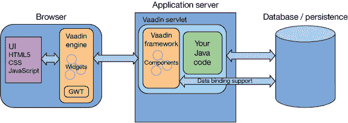
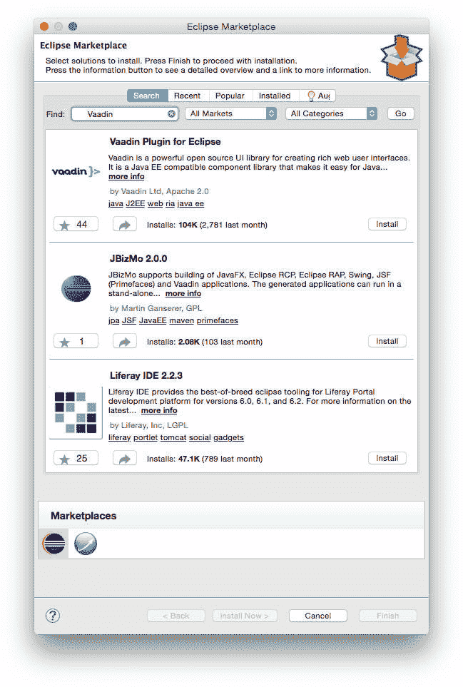
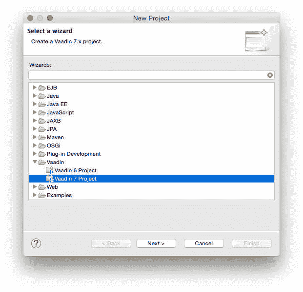
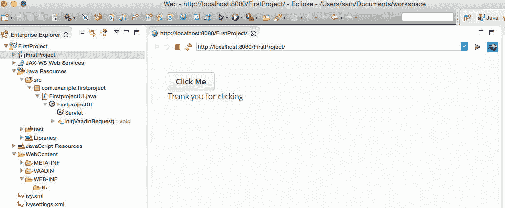
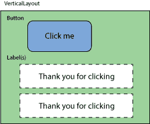
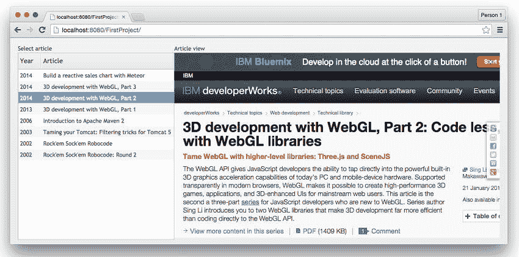
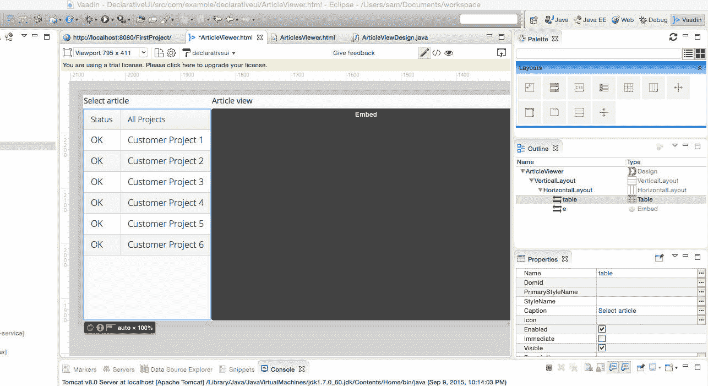

# 使用 Vaadin 实现全堆栈 Java Web 开发

> 原文：[`developer.ibm.com/zh/articles/j-full-stack-java-web-dev-vaadin/`](https://developer.ibm.com/zh/articles/j-full-stack-java-web-dev-vaadin/)

要在 Web 应用程序中创建引人注目的交互式用户体验，Java 开发人员通常必须掌握作为现代浏览器基础的一些非 Java 技术：JavaScript、CSS 和 HTML5。HTML5/JavaScript 前端与 Java 后端之间的交互（通常通过 Ajax 实现）往往需要一个复杂的、很难维护的程序集。但现在，由于开源 Vaadin 框架，在完全用 Java 编程的环境中，Java 开发人员可以获得对其现代 Web 应用程序的全堆栈控制权。

作为一个成熟的框架，Vaadin 支持所有流行的 Java 开发环境（Eclipse、IntelliJ、NetBeans、Maven，等等；本教程的示例使用的是 Eclipse）。Vaadin 有数百个社区贡献的和市面上可以买到的 UI 组件。这些组件都是精心打造和维护的，可用于所有现代浏览器，而且它们使用了最新提供的 HTML5、CSS 和 JavaScript 功能。

Vaadin 的服务器端 UI 创建支持使您能够编写和部署 Java 技术中的可重用组件。该框架管理客户端 UI 创建和管理的复杂性。与您已经熟悉的所有中间层和后端 Java 技术（比如 Enterprise Java Beans (EJB) 技术、Java Persistence API (JPA) 和 Spring）的集成非常容易。Vaadin 以服务器为中心的特性使得该框架兼容所有现代的云托管解决方案（包括 IBM Cloud™ ），所以您可以在云中轻松地部署高度互动的 Web 应用程序。Vaadin 还兼容支持 JVM 的生态系统（包括 Python (Jython)、Groovy 和 Scala）中的其他许多编程语言。

##### 发挥您的 Vaadin 技能

在最终的黑客马拉松比赛中加入 IBM 和 Vaadin 的阵营。使用您在本教程中获得的技能，以及基于 IBM Cloud 的技能，”[使用 Vaadin 在云中开发全堆栈 Java 应用程序](http://www.ibm.com/developerworks/cn/java/j-use-vaadin-in-the-cloud-for-a-full-stack-Java-app-bluemix/index.html)”，以便构建出色的应用程序和赢得奖品。挑战赛举办时间为 2015 年 10 月 15 日至 2015 年 11 月 30 日。[立刻加入](http://vaadin.com/challenge)。

本教程将介绍 Vaadin，揭示它的架构，说明它的工作原理，并提供多个动手实例，让您熟悉 Eclipse 环境中的 Vaadin 开发。最后一个 Jython 示例突出强调了 Vaadin 在处理许多 JVM 支持的编程语言方面的灵活性。

## Vaadin 内部揭秘

从架构上讲，Vaadin 类似于 AWT、Swing 和 SWT。您需要实例化准备在服务器端使用的组件并将它们连接在一起，该框架会自动生成和部署 UI 元素。Vaadin 与那些传统 Java 工具包之间的主要区别是：使用的组件是 HTML5/CSS/JavaScript 组件，通过 Ajax 与服务器进行通信并通过框架进行自动管理，而不是使用通过 Java 呈现的桌面 GUI 组件（或通过受支持操作系统的特定图形 API）。

图 1 显示了 Vaadin 的架构。

##### Vaadin 架构



##### 客户端编程模型

本教程将重点介绍 Vaadin 的更受欢迎的服务器端编程模型。Vaadin 还支持一个鲜为人知的客户端编程模型。浏览器中运行的代码可以访问小部件和远程调用服务器端方法，但必须先从 Java 编译成 JavaScript。

在图 1 中，您可以看到 Vaadin 如何帮助开发人员完全屏蔽 UI 呈现技术堆栈的复杂性。作为 Vaadin 的开发人员，您可以创建您的 UI（包括各种交互的事件处理程序）：通过在一个 Java servlet（一个 `VaadinServlet` ）中使用 Java 来连接预制组件。然后由 Vaadin 负责其余的工作。客户端 Vaadin 引擎（用 HTML5/CSS/JavaScript 编写，而且基于 Google Web Toolkit）和服务器端框架都支持为您 *实现* （生成） UI 和管理 UI。服务器端 UI 组件网络是通过浏览器中的客户端 UI 小部件网络来 *实现* 的。

服务器端 UI 组件支持 Vaadin 中的数据绑定，这使得处理后台数据库变得非常容易。Java 应用程序代码可以继续利用服务器提供的所有功能，包括 Java Platform、Enterprise Edition (Java EE) 和 Web 服务。

根据行业最佳实践，在使用 Vaadin 时，呈现是与业务逻辑无关的。您可以使用 Vaadin HTML 设计文档以声明方式创建布局，或者以 Java 编程的方式创建布局。您可以通过使用 CSS 或 Sass 中的主题，进一步自定义和调优应用程序的外观。

## 设置和运行 Vaadin

在了解 Vaadin 的所有组成部分之后，就差不多准备好开始利用该框架构建一些东西了。要尝试下面的示例，需要安装：

*   Java Development Kit (JDK) 1.7 或更高版本（示例代码开发中使用了 1.7.0_60-b19）。
*   Eclipse EE Edition（Luna 或更高版本）。
*   Tomcat 8。如果您没有已在 Eclipse 中配置好的 Tomcat 8 服务器，请 [按照这些说明](http://help.eclipse.org/luna/index.jsp?topic=%2Forg.eclipse.stardust.docs.wst%2Fhtml%2Fwst-integration%2Fconfiguration.html) 来配置它。
*   Vaadin Eclipse Plugin。请在 Eclipse 市场中查找 Vaadin Plugin for Eclipse，如图 2 所示。

##### Eclipse 市场中的 Vaadin Plugin for Eclipse

本教程稍后采用的声明性 UI 示例使用了 Vaadin 设计器。要保存您的设计，需要使用 Vaadin 设计器的一个 [试用版许可](https://vaadin.com/pro/licenses) 。Vaadin Eclipse Plugin 安装还可以包括一个 UI 设计器的测试版；请接受许可并重新启动 Eclipse。

## 创建并运行您的第一个 Vaadin 应用程序

按照以下步骤在 Eclipse 中创建 Vaadin starter 应用程序：

1.  选择 **File > New > Other > Vaadin > Vaadin 7 Project** ，如图 3 所示。

##### 在 Eclipse 中创建一个 Vaadin 项目



1.  将您的项目命名为 `FirstProject` ，然后选择 **Project > Build Project** 。如果您使用的是 JDK 1.7，那么您可能需要调整 Eclipse 项目的某些方面，使之包含 Java 1.7 而不是 1.8。
2.  突出显示 Enterprise Explorer 窗格中的项目，右键单击它，选择 **Run As > Run on server** ，然后选择 Tomcat 8 服务器来运行您的应用程序。

在创建项目时，会生产一个应用程序和两个 Vaadin 组件： `VerticalLayout` 和 `Button` 。图 4 显示了运行中的应用程序。每次单击用户界面中的按钮时，都会创建一个新的 Vaadin `Label` 组件。这个简单的应用程序非常适合用来了解 Vaadin 开发的雏形。

##### 通过向导生成的 Vaadin starter 应用程序



### 组件的组成部分

图 5 显示了组件的组成部分。一个 `VerticalLayout` 包含一个按钮。在单击 **Click Me button** 时，可以创建一个或多个 `Label` 并将它们添加到 VerticalLayout 中。

##### 组件的组成部分



清单 1 显示了图 5 中用线圈出的代码。

##### 已生成的 skeletal 应用程序中的代码

```
public class FirstprojectUI extends UI {

@WebServlet(value = "/*", asyncSupported = true)
@VaadinServletConfiguration(productionMode = false, ui = FirstprojectUI.class)
public static class Servlet extends VaadinServlet {
    }

protected void init(VaadinRequest request) {
   final VerticalLayout layout = new VerticalLayout();
   layout.setMargin(true);
   setContent(layout);

   Button button = new Button("Click Me");
   button.addClickListener(new Button.ClickListener() {
      public void buttonClick(ClickEvent event) {
         layout.addComponent(new Label("Thank you for clicking"));
      }
   });
   layout.addComponent(button);
} 
```

您在扩展了抽象的 `com.vaadin.ui.UI` 类的一个或多个类中构建您的 UI。用户界面是在 `init()` 方法中创建的。请注意， `Servlet` 类周围的 `@WebServlet` 注释（来自 `com.vaadin.server.VaadinServlet` ）将服务于您创建的用户界面并管理它。

### Vaadin 中的事件处理

在清单 1 中， `button.addClickListener()` 添加了一个对按钮单击的回调。在这种情况下，该按钮上的单击侦听器只会创建一个新的 `Label` 组件和消息 “Thank you for clicking” ，并将它们添加到 `VerticalLayout` 组件。”Thank you for clicking” 的每一个新行都会出现在现有标签的下面。

下一个示例会更加深入，需要一些更复杂的 Vaadin 组件，但操作基本上仍与第一个示例相同。

## 构成更复杂的组件

下一个例子中，会从示例代码中加载 ArticleViewer.zip 项目文件（参见 下载 ）。图 6 显示了此示例中的 Vaadin 组件的组成部分。

##### article-viewer 应用程序中的 Vaadin 组件的组成部分


在图 6 中， `VerticalLayout` 包含 `HorizontalLayout` 。该 `HorizontalLayout` 由左边的 `Table` 组件和右边的 `Embedded` 组件填充。

图 7 显示了 article-viewer 应用程序的 UI。该应用程序包括一个 Vaadin 表，在表的左边显示了一个文章列表和这些文章的出版年份。用户可以从列表中选择任何文章，以获取该文章并将其显示在右侧的一个 `Embedded` （浏览器）Vaadin 组件中。

##### 运行中的 article-viewer 应用程序



您会发现 `ArticleViewer` 类中的代码，该代码的组织结构和由 `VaadinServlet` 服务的方式与第一个示例中的代码（在该类的 `init()` 方法中创建 UI 的代码）相同，如清单 2 所示。

##### article-viewer 应用程序的代码

```
@Override
protected void init(VaadinRequest request) {
   final VerticalLayout layout = new VerticalLayout();

    layout.setMargin(true);
   setContent(layout);

   HorizontalLayout horiz = new HorizontalLayout();
   horiz.addStyleName("outlined");

   Table table = new Table("Select article");

   table.addContainerProperty("Year", String.class, null);
   table.addContainerProperty("Article", String.class, null);

   int i = 1;
   for (Object[] row: listdata ) {
      table.addItem(getRowData(row), i++);

   }
   table.setSelectable(true);
   table.setImmediate(true);

   horiz.setSizeFull();      horiz.addComponent(table);

   final Embedded e = new Embedded("Article view", new ExternalResource(
          getURL(listdata[0])));
     e.setAlternateText("Article View");
     e.setType(Embedded.TYPE_BROWSER);
     e.setSizeFull();
     horiz.addComponent(e);
 horiz.setExpandRatio(e, 1);

   table.addItemClickListener(new ItemClickListener(){

      @Override
      public void itemClick(ItemClickEvent event) {
         e.setSource(new ExternalResource(getURL(listdata
             [Integer.parseInt(event.getItemId().toString()) - 1])));

      }

   });

   layout.setSizeFull();
     layout.addComponent(horiz);
     layout.setExpandRatio(horiz, 1);
} 
```

##### 演示快捷方式

为了简化示例代码，我将数据设置和播种（seeding）细节放在相同的 UI 类中。事实上，重构它们并将它们分离到单独的类中是有一定道理的。

在清单 2 的代码中，行的选择是由 `ItemClickEvent` 侦听器处理的。在这种情况下，该处理程序会发现与被单击文章有关联的 URL，并设置 `Embedded` 组件的 `source` 属性，让文章得以显示。

还要注意的是，在清单 2 中，通过迭代 `listdata` 元素组成的一个数组来填充表数据。这使得我们的代码变得既简短又简单。相同的 Vaadin `Table` 元素也支持数据绑定，支持您将表数据绑定到后端数据库内容。

## Vaadin 的声明性 UI

您可以在一个特殊格式的 HTML Vaadin *设计* 文档中指定所有组件及其包含关系，而不是采用一次编写一行的方式使用 Java 编程语言构造 UI。Vaadin 可以阅读此 HTML 文档，并为您一次生成整个 UI。

此外，一个可视的拖放式 Vaadin 设计器工具也可用于创作 UI 设计文档，无需编写一行 Java 代码或 HTML。图 8 显示了使用中的设计器。

##### Vaadin 的可视拖放式 UI 设计器



对于 UI 设计人员和应用程序开发人员相互独立工作的商店，此功能可能特别适用。

下一个示例创建了与 article-viewer 应用程序完全相同的 UI，但现在使用的是一个声明性的 HTML 设计文档而不是 Java 代码来指定 UI。

将 DeclarativeUI.zip 项目导入到 Eclipse 中，并检查 ArticleViewer.html 设计文档，如清单 3 所示。此 Vaadin HTML 设计文档指定了 UI 和布局。将此代码与 article-viewer 应用程序的代码 中的代码进行比较，查看二者的相似之处。

##### Vaadin HTML 设计文档

```
<!DOCTYPE html>
<html>
 <head>
  <meta charset="UTF-8" name="design-properties" ...
 </head>
 <body>
  <v-vertical-layout size-full="true">
     <v-horizontal-layout size-full="true">
        <v-table _id="table" caption="Select article"
           width-auto height-full>

        </v-table>
        <v-embedded _id='e' caption="Article view"
          source="http://www.ibm.com/"
          size-full :expand>

     </v-horizontal-layout>
  </v-vertical-layout>
 </body>
</html> 
```

### 自定义组件

基于 ArticleViewer.html 设计文档读取和实现 UI 的代码位于 ArticleViewDesign.java（一个自定义组件）中。这个类也是用数据填充表和挂起事件处理程序的地方。清单 4 显示了如何操作。

##### 使用一个声明性 UI 设计文档进行处理

```
public ArticleViewDesign() {
       Design.read("ArticleViewer.html", this);

      table.addContainerProperty("Year", String.class, null);
      table.addContainerProperty("Article",  String.class, null);

      int i  = 1;
      for (Object[] row: listdata ) {
         table.addItem(getRowData(row), i++);

      }
      table.setSelectable(true);
      table.setImmediate(true);
      e.setType(Embedded.TYPE_BROWSER);
      e.setSource(new ExternalResource(getURL(listdata[0])));
      table.addItemClickListener(new ItemClickListener(){

         @Override
         public void itemClick(ItemClickEvent event) {
            // TODO Auto-generated method stub
            System.out.println("ID is " + event.getItemId());
            e.setSource(new ExternalResource(getURL(listdata
                [Integer.parseInt(event.getItemId().toString()) - 1])));

         }

      });
   } 
```

实例化自定义的 `ArticleView` 组件，并通过 `DeclarativeUI` Java 类将其嵌入到 UI 中，这个 Java 类还扩展了 `com.vaadin.ui.UI` ，而且包含一个 `VaadinServlet` ，就像其他示例一样。清单 5 显示了 DeclarativeUI.java。

##### 集成自定义组件的 UI 创建类

```
public class DeclarativeUI extends UI {

   @WebServlet(value = "/*", asyncSupported = true)
   @VaadinServletConfiguration(productionMode = false, ui =
     DeclarativeUI.class)
   public static class Servlet extends VaadinServlet {
   }

   @Override
   protected void init(VaadinRequest request) {

      setContent(new ArticleViewDesign());

   }
} 
```

### 使用 Vaadin 主题立即更改应用程序的外观

您会注意到，编程版本和声明性版本的应用程序的外观是不同的，因为这两个版本都使用了 *主题* 。主题是用于自定义应用程序外观的 CSS 或 Sass 代码，可从独立于应用程序代码的其余部分进行使用。

Vaadin 提供了 4 个内置主题，您可以随时在它们之间切换。这些内置主题是 *valo* 、 *reindeer* 、 *chameleon* 和 *runo* 。在 WebContent/themes/declarativeui/declarativeui.scss 中进行查找。更改在该文件末尾处指定的主题值可以更改应用程序使用的主题。

您可轻松地在 [Vaadin 增件目录](https://vaadin.com/directory#!browse) 中查找几乎无限多种现成的 Vaadin。

## 用 Python 实现 Vaadin 编程

根据设计，Vaadin 与 Java 之外的其他编程语言是兼容的，而且支持 JVM 生态系统中的许多编程语言（参见 Wikipedia 的 [JVM 语言列表](https://en.wikipedia.org/wiki/List_of_JVM_languages) ，这些编程语言包括 Python（通过 Jython）、Groovy 和 Scala）。

本教程中的最后一个示例用 Python 重写了 article-viewer 应用程序。

在成功加载并运行此示例之前，必须安装下列附加工具：

*   Jython 2.7 或更高版本。
*   PyDev 4.3.0 或更高版本，已使用 Jython 进行测试（请参见 [PyDev](http://www.pydev.org/manual_101_install.html) 文档信息，了解关于如何在 Eclipse 上安装 PyDev 的信息）。
*   Vaadin 6.8.16（或最新的 6.x）JAR；您必须将这个 JAR 文件放在 WebContent/WEB-INF/lib 文件夹中。

您可以在 JythonVaadin.zip 存档文件中找到此示例的 Eclipse 项目（参见 下载 ）。将此存档文件导入 Eclipse 中来运行该示例。

请注意 Java 版本的代码结构的相似性。如果查看 Web 应用程序的 web.xml 文件，如清单 6 所示，您就会发现，它加载了专门的 Python 解释器 servlet，而不是常规的 `VaadinServlet` 。

##### JythonVaadin 应用程序的 web.xml 描述符

```
<?xml version="1.0" encoding="UTF-8"?>
<web-app id="WebApp_ID" version="2.4" ...>
   <display-name>JythonVaadin</display-name>
   ...
   <servlet>
    <servlet-name>Jythonvaadin Application</servlet-name>
    <servlet-class>com.example.jythonvaadin.PythonServlet</servlet-class>
    <init-param>
        <description>Vaadin application class to start</description>
        <param-name>application</param-name>
        <param-value>PythonArticleViewer</param-value>
    </init-param>
  ... 
```

在 `PythonServlet` 类中，Jython 解释器已加载并与 PythonArticleViewer.py 源文件一起提供，如清单 7 所示。

##### 实例化 Jython 解释器的 PythonServlet

```
...
PythonInterpreter interpreter = new PythonInterpreter();
        interpreter.exec("from "+applicationModuleName+" import "+applicationClassName);
        PyObject pyObj = interpreter.get(applicationClassName).__call__();
        Application pyApp = (Application)pyObj.__tojava__(Application.class);
        applicationClass = pyApp.getClass();
... 
```

清单 8 显示了通过 Vaadin 创建 article-viewer UI 的部分 Python 代码。如果您熟悉 Python 语言，就可以看出这段代码与 Java 版本之间的相似性。

##### Python article-viewer Web 应用程序

```
from com.vaadin import Application
from com.vaadin.event import ItemClickEvent
from java.lang import String
from com.vaadin.terminal import ExternalResource
...
class PythonArticleViewer(Application, ItemClickEvent.ItemClickListener):
    def __init__(self):
        pass

    def init(self):
      ...
      mainWindow = Window("Python Article View")
       vertical = VerticalLayout()

        vertical.setMargin(True)
        horiz = HorizontalLayout()
        horiz.addStyleName("outlined")
        self.table = Table("Select article")
        self.table.addContainerProperty("Year", String().getClass(), None)
        self.table.addContainerProperty("Article", String().getClass(), None)

        for idx, row in enumerate(self.listdata):
            self.table.addItem(self.getData(row) , idx)

        ...
        vertical.setSizeFull()
        vertical.addComponent(horiz)
        vertical.setExpandRatio(horiz,1)

        mainWindow.addComponent(vertical)
        self.setMainWindow(mainWindow)

    def itemClick(self, event):
       ... 
```

## 结束语

Vaadin 通过提供全堆栈 Java 开发解决方案提高了 Java Web 开发人员的生产力。您可以利用浏览器创新中的最新成果来创建 UI，这些创新成果包括 HTML5、CSS、Ajax 和 JavaScript，所有这些都无需牺牲您的 Java IDE 的舒适度。Vaadin UI 可以使用 Java 代码，以编程方式进行创建，或者以声明方式在 HTML 设计文档中进行创建。Vaadin 甚至还支持使用其他 JVM 支持的编程语言（包括 Python）进行编码。丰富的可用增件（add-on）库使您能够轻松地将功能添加到您的应用程序中。

您使用 Vaadin 和标准 Java EE 技术创建的应用程序可以轻松地在云中进行部署。请转到我的 “[使用 Vaadin 在云中开发全堆栈 Java 应用程序](http://www.ibm.com/developerworks/cn/java/j-use-vaadin-in-the-cloud-for-a-full-stack-Java-app-bluemix/index.html) ” 教程，迅速将一个完整的 Web 应用程序部署到 IBM Cloud 云中。

## 下载资源

[vaadin_classic_code1_0928.zip](http://public.dhe.ibm.com/software/dw/java/j-full-stack-java-web-dev-vaadin/vaadin_classic_code1_0928.zip): 前三个示例的代码