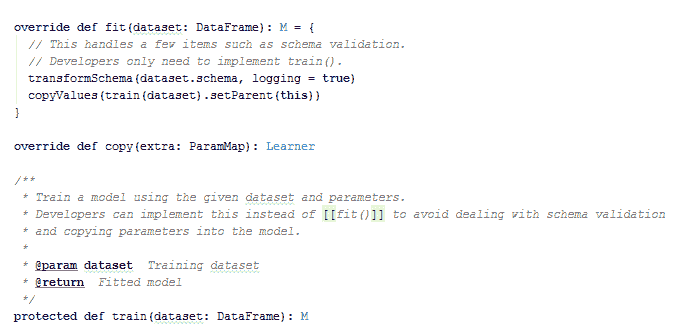
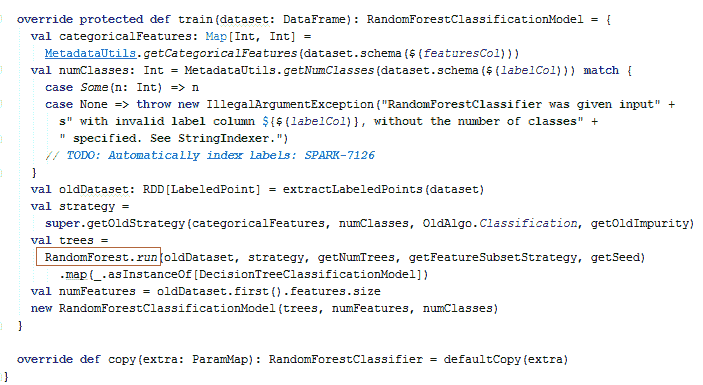
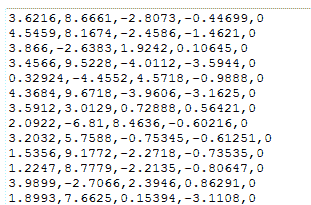

# 使用 ML Pipeline 构建机器学习工作流

> 原文：[`developer.ibm.com/zh/articles/os-cn-spark-practice5/`](https://developer.ibm.com/zh/articles/os-cn-spark-practice5/)

## 引言

使用机器学习 (Machine Learning) 技术和方法来解决实际问题，已经被成功应用到多个领域，我们经常能够看到的实例有个性推荐系统，金融反欺诈，自然语言处理和机器翻译，模式识别，智能控制等。一个典型的机器学习机器学习过程通常会包含：源数据 ETL，数据预处理，指标提取，模型训练与交叉验证，新数据预测等。我们可以看到这是一个包含多个步骤的流水线式工作，也就是说数据从收集开始，要经历多个步骤，才能得到我们需要的输出。在 [本系列第 4 部分](http://www.ibm.com/developerworks/cn/opensource/os-cn-spark-practice4/index.html) 已经向大家介绍了 Spark MLlib 机器学习库, 虽然 MLlib 已经足够简单易用，但是如果目标数据集结构复杂需要多次处理，或者是对新数据进行预测的时候需要结合多个已经训练好的单个模型进行综合预测 (集成学习的思想)，那么使用 MLlib 将会让程序结构复杂，难于理解和实现。值得庆幸的是，在 Spark 的生态系统里，一个可以用于构建复杂机器学习工作流应用的新库已经出现了，它就是 Spark 1.2 版本之后引入的 ML Pipeline，经过几个版本的发展，截止目前的 1.5.1 版本已经变得足够稳定易用了。本文将向读者详细地介绍 Spark ML Pipeline 的设计思想和基本概念，以及如何使用 ML Pipeline 提供的 API 库编写一个解决分类预测问题的 Pipeline 式应用程序。相信通过本文的学习，读者可以较为深入的理解 ML Pipeline，进而将它推广和应用到更多复杂问题的解决方案上去。

## 关于 ML Pipeline

Spark ML Pipeline 的出现，是受到了 [scikit-learn](http://scikit-learn.org/stable/) 项目的启发，并且总结了 MLlib 在处理复杂机器学习问题上的弊端，旨在向用户提供基于 DataFrame 之上的更加高层次的 API 库，以更加方便的构建复杂的机器学习工作流式应用。一个 Pipeline 在结构上会包含一个或多个 PipelineStage，每一个 PipelineStage 都会完成一个任务，如数据集处理转化，模型训练，参数设置或数据预测等，这样的 PipelineStage 在 ML 里按照处理问题类型的不同都有相应的定义和实现。接下来，我们先来了解几个重要概念。

*   DataFrame

    关于 DataFrame 其实我们已经在 [本系列第 3 部分](http://www.ibm.com/developerworks/cn/opensource/os-cn-spark-practice3/index.html) 介绍过了，它较之 RDD，包含了 schema 信息，更类似传统数据库中的二维表格。它被 ML Pipeline 用来存储源数据。

    DataFrame 可以被用来保存各种类型的数据，如我们可以把特征向量存储在 DataFrame 的一列中，这样用起来是非常方便的。

*   Transformer

    Transformer 中文可以被翻译成转换器，是一个 PipelineStage，实现上也是继承自 PipelineStage 类，主要是用来把 一个 DataFrame 转换成另一个 DataFrame，比如一个模型就是一个 Transformer，因为它可以把 一个不包含预测标签的测试数据集 DataFrame 打上标签转化成另一个包含预测标签的 DataFrame，显然这样的结果集可以被用来做分析结果的可视化。

*   Estimator

    Estimator 中文可以被翻译成评估器或适配器，在 Pipeline 里通常是被用来操作 DataFrame 数据并生产一个 Transformer，如一个随机森林算法就是一个 Estimator，因为它可以通过训练特征数据而得到一个随机森林模型。实现上 Estimator 也是继承自 PipelineStage 类。

*   Parameter

    Parameter 被用来设置 Transformer 或者 Estimator 的参数。

要构建一个 Pipeline，首先我们需要定义 Pipeline 中的各个 PipelineStage，如指标提取和转换模型训练等。有了这些处理特定问题的 Transformer 和 Estimator，我们就可以按照具体的处理逻辑来有序的组织 PipelineStages 并创建一个 Pipeline，如 val pipeline = new Pipeline().setStages(Array(stage1,stage2,stage3,…))。然后就可以把训练数据集作为入参并调用 Pipelin 实例的 fit 方法来开始以流的方式来处理源训练数据，这个调用会返回一个 PipelineModel 类实例，进而被用来预测测试数据的标签，它是一个 Transformer。

## 随机森林及 ML 的实现

随机森林构建于决策树之上，顾名思义，就是随机的构建一个包含多个决策树的森林。随机森林里的决策树之间是独立的，在随机森林模型构建好以后，对于新来的测试样本数据，随机森林模型会让其中的每个决策树分别做一次预测，然后统计出现此处最多的预测标签，并将它作为最终的预测标签。随机森林算法运用的就是集成学习的思想，在实践中，随机森林往往都有很好表现，并且多次预测结果稳定并且精度非常高，也不容易出现过拟合的问题。也是笔者最喜欢并且最常用的一种机器学习算法。

本文并不会重点介绍随机森林的基本理论，因为网上这样的文章已经很多了，本文将把重点放在对 Spark ML 中随机森林的实现以及可调参数的介绍。关于随机森林算法的详细介绍大家可以参考维基百科上的 [随机森林介绍](https://en.wikipedia.org/wiki/Random_forest) 。

Spark ML 中随机森林实现是在 RandomForestClassifier 类中，位于 org.apache.spark.ml. classification 包中，该实现中支持设置的主要参数如下：

*   featuresCol

    训练数据集 DataFrame 中存储特征数据的列名。

*   labelCol

    标签列的名称。

*   impurity

    树节点选择的不纯度的衡量指标，取值可以是”entroy”或”gini”, 默认是”gini”。

*   maxBins

    离散连续性变量时最大的分箱数，默认是 32。理论上箱数越大粒度就越细，但是针对特定的数据集总有一个合理的箱数。

*   maxDepth

    树的最大深度，默认值是 5。

*   numTrees

    随机森林需要训练的树的个数，默认值是 20。

*   predictionCol

    算法预测结果的存储列的名称, 默认是”prediction”。

*   rawPredictionCol

    原始的算法预测结果的存储列的名称, 默认是”rawPrediction”

*   probabilityCol

    类别预测结果的条件概率值存储列的名称, 默认值是”probability”

在后文中大家可以看到如何在程序中设置这些参数。可以调用 RandomForestClassifier.setXXX 方法或者在 ParamMap 里设定参数，然后再调用 RandomForestClassifier.fit 方法时传入 ParamMap 实例，如：

[在程序中设置这些参数](https://developer.ibm.com/developer/default/articles/os-cn-spark-practice5/images/img00.png)

RandomForestClassifier 的 fit 方法从源头上来讲，是来自 Predictor 类 (Estimator 的子类)，Predictor 类的 fit 方法设计和实现上实际上是采用了模板方法的设计模式，具体会调用实现类的 train 方法

##### 图 1\. Predictor 类的 fit 方法实现预览



所以对于 RandomForestClassifier 类我们最需要关注的就是 train 方法，其中包含具体从源数据 DataFrame 训练一个随机森林模型的过程。train 方法在提取出 DataFrame 数据集中的 label 和 features 数据之后，进一步调用 RandomForest.run 方法去真正的开始训练随机森林模型，训练结束后会返回一个 RandomForestClassificationModel 类实例，这是一个 Transformer，会被用来预测测试数据集。

##### 图 2\. RandomForestClassifier 类的 train 方法实现预览



对于 RandomForest 类的 run 方法的具体实现逻辑，已经在 developerWorks 的 [“Spark 随机森林算法原理、源码分析及案例实战”](https://www.ibm.com/developerworks/cn/opensource/os-cn-spark-random-forest/) 一文中有详细介绍，为了避免内容冲突，本文的内容将重点放在 ML Pipeline 的实现层次关系上，在这里不做赘述。

## 目标数据集预览

本文所使用的测试数据集来自 UCI 的 [banknote authentication data set](http://archive.ics.uci.edu/ml/datasets/banknote+authentication) ，这是一个从纸币鉴别过程中的图片里提取的数据集，总共包含五个列，前 4 列是指标值 (连续型)，最后一列是真假标识。

##### 图 3\. 测试数据集格式



四列依次是小波变换图像的方差，小波变换图像的偏态，小波变换图像的峰度，图像熵，类别标签。其实读者并不需要知道什么是小波变换及其相关改变，只需要知道这是四个特征指标的值，我们将根据这些指标训练模型使用模型预测类别。对于该数据集的更多信息，读者可以参考 UCI 官网的描述。

## 案例分析与编码实现

前面提到，本文的目的是使用 Spark ML Pipeline 构建一个对目标数据集进行分类预测的机器学习工作流，案例背景已经相当清晰，在了解了数据集本身和 ML Pipeline 的相关知识后，接下来就是编程实现了。关于实现基本思路和关键的 11 个步骤笔者已经在代码中做了详细解释，为了方便读者理解，这里特别的把该实例的 Pipeline 里包含的 4 个 Stage 重点介绍下。

这四个 Stage 分别对应代码注释里的步骤 2-5，作用如下：

第一个，使用 StringIndexer 去把源数据里的字符 Label，按照 Label 出现的频次对其进行序列编码, 如，0,1,2，…。在本例的数据中，可能这个步骤的作用不甚明显，因为我们的数据格式良好，Label 本身也只有两种，并且已经是类序列编码的”0”和”1”格式。但是对于多分类问题或者是 Label 本身是字符串的编码方式，如”High”,”Low”,”Medium”等，那么这个步骤就很有用，转换后的格式，才能被 Spark 更好的处理。

第二个，使用 VectorAssembler 从源数据中提取特征指标数据，这是一个比较典型且通用的步骤，因为我们的原始数据集里，经常会包含一些非指标数据，如 ID，Description 等。

第三个，创建一个随机森林分类器 RandomForestClassifier 实例，并设定相关参数，主要是告诉随机森林算法输入 DataFrame 数据里哪个列是特征向量，哪个是类别标识，并告诉随机森林分类器训练 5 棵独立的子树。

第四个，我们使用 IndexToString Transformer 去把之前的序列编码后的 Label 转化成原始的 Label，恢复之前的可读性比较高的 Label，这样不论是存储还是显示模型的测试结果，可读性都会比较高。

这几个 Stage 都会被用来构建 Pipeline 实例，并且会按照顺序执行，最终我们根据得到的 PipelineModel 实例，进一步调用其 transform 方法，去用训练好的模型预测测试数据集的分类。

##### 清单 1\. 示例程序源代码

```
import org.apache.spark.ml.Pipeline
import org.apache.spark.ml.classification._
import org.apache.spark.ml.evaluation.MulticlassClassificationEvaluator
import org.apache.spark.ml.feature.{IndexToString, StringIndexer, VectorAssembler}
import org.apache.spark.ml.param.ParamMap
import org.apache.spark.sql.SQLContext
import org.apache.spark.{SparkConf, SparkContext}

object ClassificationPipeline {
 def main(args: Array[String]) {
 if (args.length < 1){
 println("Usage:ClassificationPipeline inputDataFile")
 sys.exit(1)
 }
 val conf = new SparkConf().setAppName("Classification with ML Pipeline")
 val sc = new SparkContext(conf)
 val sqlCtx = new SQLContext(sc)

 /** Step 1
 * Read the source data file and convert it to be a dataframe with columns named.
 * 3.6216,8.6661,-2.8073,-0.44699,0
 * 4.5459,8.1674,-2.4586,-1.4621,0
 * 3.866,-2.6383,1.9242,0.10645,0
 * 3.4566,9.5228,-4.0112,-3.5944,0
 * 0.32924,-4.4552,4.5718,-0.9888,0
 * ... ...
 */
 val parsedRDD = sc.textFile(args(0)).map(_.split(",")).map(eachRow => {
 val a = eachRow.map(x => x.toDouble)
 (a(0),a(1),a(2),a(3),a(4))
 })
 val df = sqlCtx.createDataFrame(parsedRDD).toDF(
 "f0","f1","f2","f3","label").cache()

 /** *
 * Step 2
 * StringIndexer encodes a string column of labels
 * to a column of label indices. The indices are in [0, numLabels),
 * ordered by label frequencies.
 * This can help detect label in raw data and give it an index automatically.
 * So that it can be easily processed by existing spark machine learning algorithms.
 * */
 val labelIndexer = new StringIndexer()
 .setInputCol("label")
 .setOutputCol("indexedLabel")
 .fit(df)

 /**
 * Step 3
 * Define a VectorAssembler transformer to transform source features data to be a vector
 * This is helpful when raw input data contains non-feature columns, and it is common for
 * such a input data file to contain columns such as "ID", "Date", etc.
 */
 val vectorAssembler = new VectorAssembler()
 .setInputCols(Array("f0","f1","f2","f3"))
 .setOutputCol("featureVector")

 /**
 * Step 4
 * Create RandomForestClassifier instance and set the input parameters.
 * Here we will use 5 trees Random Forest to train on input data.
 */
 val rfClassifier = new RandomForestClassifier()
 .setLabelCol("indexedLabel")
 .setFeaturesCol("featureVector")
 .setNumTrees(5)

 /**
 * Step 5
 * Convert indexed class labels back to original one so that it can be easily understood when we
 * need to display or save the prediction result to a file.
 */
 val labelConverter = new IndexToString()
 .setInputCol("prediction")
 .setOutputCol("predictedLabel")
 .setLabels(labelIndexer.labels)

 //Step 6
 //Randomly split the input data by 8:2, while 80% is for training, the rest is for testing.
 val Array(trainingData, testData) = df.randomSplit(Array(0.8, 0.2))

 /**
 * Step 7
 * Create a ML pipeline which is constructed by for 4 PipelineStage objects.
 * and then call fit method to perform defined operations on training data.
 */
 val pipeline = new Pipeline().setStages(Array(labelIndexer,vectorAssembler,rfClassifier,labelConverter))
 val model = pipeline.fit(trainingData)

 /**
 *Step 8
 *Perform predictions about testing data. This transform method will return a result DataFrame
 *with new prediction column appended towards previous DataFrame.
 *
 * */
 val predictionResultDF = model.transform(testData)

 /**
 * Step 9
 * Select features,label,and predicted label from the DataFrame to display.
 * We only show 20 rows, it is just for reference.
 */
 predictionResultDF.select("f0","f1","f2","f3","label","predictedLabel").show(20)

 /**
 * Step 10
 * The evaluator code is used to compute the prediction accuracy, this is
 * usually a valuable feature to estimate prediction accuracy the trained model.
 */
 val evaluator = new MulticlassClassificationEvaluator()
 .setLabelCol("label")
 .setPredictionCol("prediction")
 .setMetricName("precision")
 val predictionAccuracy = evaluator.evaluate(predictionResultDF)
 println("Testing Error = " + (1.0 - predictionAccuracy))
 /**
 * Step 11(Optional)
 * You can choose to print or save the the model structure.
 */
 val randomForestModel = model.stages(2).asInstanceOf[RandomForestClassificationModel]
 println("Trained Random Forest Model is:\n" + randomForestModel.toDebugString)
 }
} 
```

## 运行示例程序

在运行程序之前，读者需要把目标数据集上传至你的 HDFS 上，并把测试程序打成 jar 包。

##### 清单 2\. 示例程序运行命令及参数示例

```
./spark-submit --class com.ibm.spark.exercise.ml.ClassificationPipeline  \--master spark://<spark_master>:<port>\--num-executors 6 \--driver-memory 3g \--executor-memory 1g \--executor-cores 1 /home/fams/spark_exercise-1.0.jar \ hdfs://<hdfs_name_node>:<port>/user/fams/mllib/data_banknote_authentication.txt 
```

当然如果你想采用”yarn-cluster”或者”yarn-client”的方式运行，运行命令会有稍许不同，并且根据你的集群状况的不同，可能命令也会发生稍许变化。

##### 图 4\. 示例程序运行结果预览 (部分)


[示例程序运行结果预览 (部分](https://developer.ibm.com/developer/default/articles/os-cn-spark-practice5/images/img05.png)

从运行结果的预测错误来看，预测正确率基本可以达到近 98%，当然你可以按 9:1 去划分训练和测试数据集，这样可以得到更好的精确度。由此看来，随机森林算法的预测精度确实非常的好，当然这也取决于该组数据的模式比较明显，特征数据质量比较好。

## 注意事项

1.  本文的目标数据集结构其实并不复杂，之所以用 ML Pipeline 的方式实现训练和预测过程是为了向大家展示 ML Pipeline 的用法，这样的简单数据集也更有利于读者掌握 ML Pipeline 的处理过程。
2.  ML Pipeline 提供了大量做特征数据提取和转换的工具，具体参考 [这里](http://spark.apache.org/docs/latest/ml-features.html) 。
3.  使用 Spark 解决机器学习问题，我们通常需要先了解相关算法的原理，然后学习 Spark 相关实现的可调参数，测试过程中，可以针对数据集特点多尝试几种算法，并多做模型的交叉验证。
4.  本文所使用的数据集数据量很小，所以可能反映不了 Spark 处理大数据的优势，读者如果有更大量的数据集，即可对本文程序做少许修改便可以使用在新的数据集上，以测试并了解更多的实现细节。

## 结束语

本文向读者较为详细的介绍了 ML Pipeline 的基本概念和编程实现步骤，大家可以看到，较之 MLlib，ML Pipeline 在结构和逻辑层次上确实是更加清晰了。但是我认为 MLlib 对于处理结构相对简单的数据集其实依然具有优势，可能刚开始更容易被理解接受。另外从 Spark 的学习曲线上来讲，刚开始大家接触的都是 RDD，对 DataFrame 不甚了解，所以对于初学者对 MLlib 的方式其实更容易接受。所以，应该说 MLlib 和 ML Pipeline 都有各自的优势吧。当然，这更多是我个人的理解。希望这篇文章可以对大家学习 ML Pipeline 有帮助，在阅读过程中，有任何不懂或者发现任何问题，请留下您的评论，我会第一时间回答，这样也是一个交流学习的过程，非常感谢。