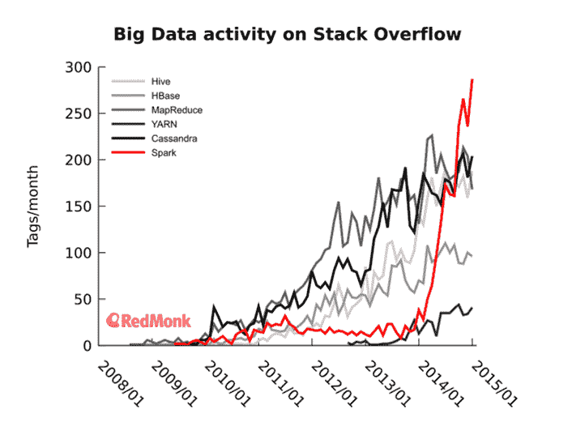
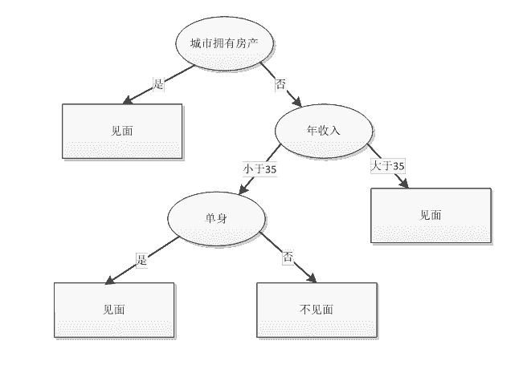
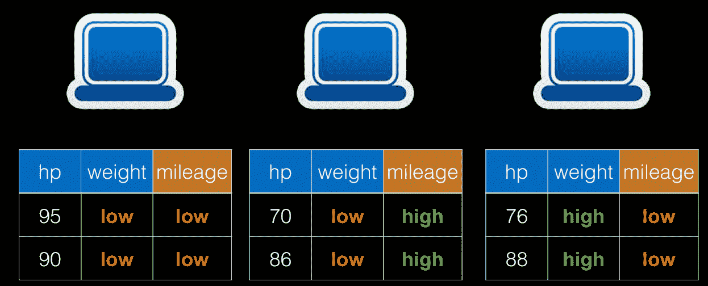
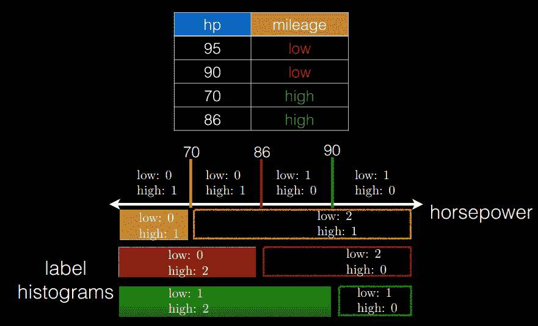
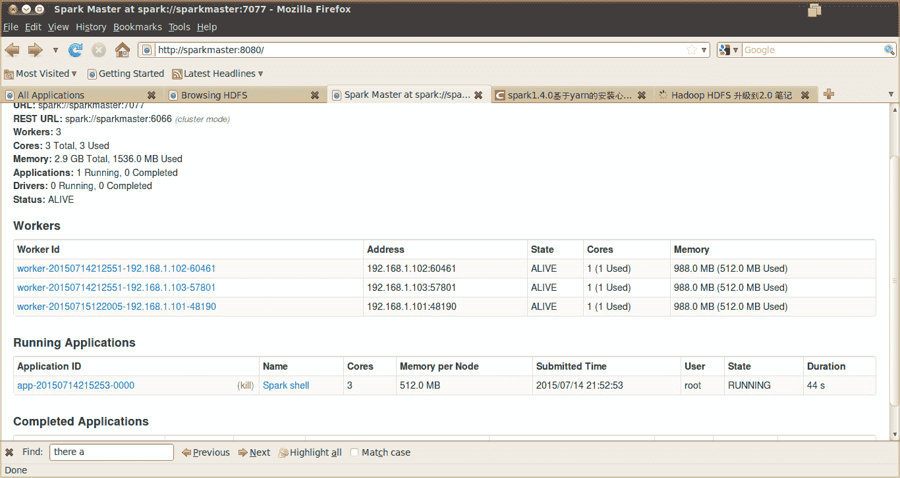
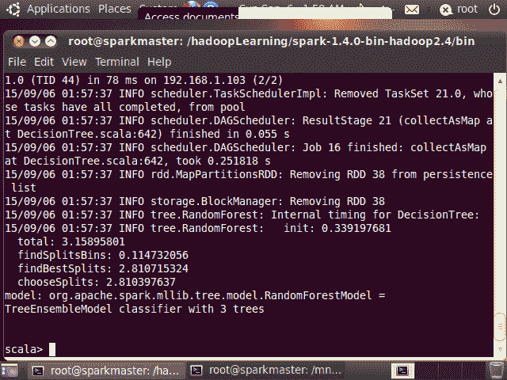

# Spark 随机森林算法原理、源码分析及案例实战

> 原文：[`developer.ibm.com/zh/articles/os-cn-spark-random-forest/`](https://developer.ibm.com/zh/articles/os-cn-spark-random-forest/)

## 引言

Spark 内存计算框架在大数据处理领域内占有举足轻重的地位，2014 年 Spark 风靡 IT 界，Twitter 数据显示 Spark 已经超越 Hadoop、Yarn 等技术，成为大数据处理领域中最热门的技术，如图 1 所示。2015 年 6 月 17 日，IBM 宣布它的”百万数据工程师计划”，承诺大力推进 Apache Spark 项目，并称该项目为”以数据为主导的，未来十年最为重要的新的开源项目”，计划投入超过 3500 名研究和开发人员在全球十余个实验室开展与 Spark 相关的项目，并将为 Spark 开源生态系统无偿提供突破性的机器学习技术——IBM SystemML。从中不难发现，机器学习技术是 IBM 大力支持 Spark 的一个重要原因，这是因为 Spark 是基于内存的，而机器学习算法内部实现几乎都需要进行迭代式计算，这使得 Spark 特别适用于分布式环境下的机器学习。本文将对机器学习领域中经典的分类和回归算法——随机森林（Random Forests）进行介绍。首先对随机森林算法的核心原理进行介绍，接着介绍其在 Spark 上的实现方式并对其源码进行分析，最后给出一个案例说明随机森林算法在实际项目中的应用。后续相关内容介绍全部以分类角度进行，回归预测与分类在算法上并没有太多的差异，本文旨在理解随机森林在 Spark 上的实现原理。

##### 图 1\. Spark 与其它大数据处理工具的活跃程度比较



## 环境要求

1.  操作系统：Linux，本文采用的 Ubuntu 10.04，大家可以根据自己的喜好使用自己擅长的 Linux 发行版
2.  Java 与 Scala 版本：Scala 2.10.4，Java 1.7
3.  Spark 集群环境（3 台）：Hadoop 2.4.1+Spark 1.4.0，Spark 集群搭建方式参见[本人博客](http://blog.csdn.net/lovehuangjiaju/article/details/46883973)
4.  源码阅读与案例实战环境：Intellij IDEA 14.1.4

## 决策树

随机森林算法是机器学习、计算机视觉等领域内应用极为广泛的一个算法，它不仅可以用来做分类，也可用来做回归即预测，随机森林机由多个决策树构成，相比于单个决策树算法，它分类、预测效果更好，不容易出现过度拟合的情况。

随机森林算法基于决策树，在正式讲解随机森林算法之前，先来介绍决策树的原理。决策树是数据挖掘与机器学习领域中一种非常重要的分类器，算法通过训练数据来构建一棵用于分类的树，从而对未知数据进行高效分类。举个相亲的例子来说明什么是决策树、如何构建一个决策树及如何利用决策树进行分类，某相亲网站通过调查相亲历史数据发现，女孩在实际相亲时有如下表现：

##### 表 1\. 相亲历史数据表

| 序号 | 城市拥有房产 | 婚姻历史（离过婚、单身） | 年收入（单位：万元） | 见面（是、否） |
| --- | --- | --- | --- | --- |
| 1 | 是 | 单身 | 12 | 是 |
| 2 | 否 | 单身 | 15 | 是 |
| 3 | 是 | 离过婚 | 10 | 是 |
| 4 | 否 | 单身 | 18 | 是 |
| 5 | 是 | 离过婚 | 25 | 是 |
| 6 | 是 | 单身 | 50 | 是 |
| 7 | 否 | 离过婚 | 35 | 是 |
| 8 | 是 | 离过婚 | 40 | 是 |
| 9 | 否 | 单身 | 60 | 是 |
| 10 | 否 | 离过婚 | 17 | 否 |

通过表 1 所示历史数据可以构建如下决策树：

##### 图 2\. 决策树示意图



如果网站新注册了一个用户，他在城市无房产、年收入小于 35w 且离过婚，则可以预测女孩不会跟他见面。通过上面这个简单的例子可以看出，决策树对于现实生活具有很强的指导意义。通过该例子，我们也可以总结出决策树的构建步骤：

1.  将所有记录看作是一个节点
2.  遍历每个变量的每种分割方式，找到最好的分割点
3.  利用分割点将记录分割成两个子结点 C1 和 C2
4.  对子结点 C1 和 C2 重复执行步骤 2）、3），直到满足特定条件为止

在构建决策树的过程中，最重要的是如何找到最好的分割点，那怎样的分割点才算是最好的呢？如果一个分割点能够将整个记录准确地分为两类，那该分割点就可以认为是最好的，此时被分成的两类是相对来说是最”纯”的，。例如前面的例子中”在城市拥有房产”可以将所有记录分两类，所有是”是”的都可以划为一类，而”否”的则都被划为另外一类。所有”是”划分后的类是最”纯”的，因为所有在城市拥有房产单身男士，不管他是否离过婚、年收入多少都会见面；而所有”否”划分后的类，又被分为两类，其中有见面的，也有不见面的，因此它不是很纯，但对于整体记录来讲，它是最纯的。

在上述例子当中，可以看到决策树既可以处理连续型变量也可以处理名称型变量，连续型变量如年收入，它可以用”>=”，”>”,”<”或”<=”作为分割条件，而名称型变量如城市是否拥有房产，值是有限的集合如”是”、”否”两种，它采用”=”作为分割条件。

在前面提到，寻找最好的分割点是通过量化分割后类的纯度来确定的，目前有三种纯度计算方式，分别是 Gini 不纯度、熵（Entropy）及错误率，它们的公式定义如下：


公式中的 P(i) 表示记录中第 i 类记录数占总记录数的比例，例如前面的女孩相亲例子可以根据见面或不见面分为两类，见面的记录占比数为 P(1)=9/10，不见面的记录占比为 P(2)=1/10。上面的三个公式均是值越大表示越”不纯”，值越小表示越”纯”。实际中最常用的是 Gini 不纯度公式，后面的例子也将采用该公式进行纯度计算。

决策树的构建是一个递归的过程，理想情况下所有的记录都能被精确分类，即生成决策树叶节点都有确定的类型，但现实这种条件往往很难满足，这使得决策树在构建时可能很难停止。即使构建完成，也常常会使得最终的节点数过多，从而导致过度拟合（overfitting），因此在实际应用中需要设定停止条件，当达到停止条件时，直接停止决策树的构建。但这仍然不能完全解决过度拟合问题，过度拟合的典型表现是决策树对训练数据错误率很低，而对测试数据其错误率却非常高。过度拟合常见原因有：（1）训练数据中存在噪声；（2）数据不具有代表性。过度拟合的典型表现是决策树的节点过多，因此实际中常常需要对构建好的决策树进行枝叶裁剪（Prune Tree），但它不能解决根本问题，随机森林算法的出现能够较好地解决过度拟合问题。

## 随机森林算法

由多个决策树构成的森林，算法分类结果由这些决策树投票得到，决策树在生成的过程当中分别在行方向和列方向上添加随机过程，行方向上构建决策树时采用放回抽样（bootstraping）得到训练数据，列方向上采用无放回随机抽样得到特征子集，并据此得到其最优切分点，这便是随机森林算法的基本原理。图 3 给出了随机森林算法分类原理，从图中可以看到，随机森林是一个组合模型，内部仍然是基于决策树，同单一的决策树分类不同的是，随机森林通过多个决策树投票结果进行分类，算法不容易出现过度拟合问题。

##### 图 3\. 随机森林示意图


## 随机森林在分布式环境下的优化策略

随机森林算法在单机环境下很容易实现，但在分布式环境下特别是在 Spark 平台上，传统单机形式的迭代方式必须要进行相应改进才能适用于分布式环境，这是因为在分布式环境下，数据也是分布式的（如图 5 所示），算法设计不得当会生成大量的 IO 操作，例如频繁的网络数据传输，从而影响算法效率。

##### 图 4\. 单机环境下数据存储


##### 图 5\. 分布式环境下数据存储



因此，在 Spark 上进行随机森林算法的实现，需要进行一定的优化，Spark 中的随机森林算法主要实现了三个优化策略：

1.  切分点抽样统计，如图 6 所示。在单机环境下的决策树对连续变量进行切分点选择时，一般是通过对特征点进行排序，然后取相邻两个数之间的点作为切分点，这在单机环境下是可行的，但如果在分布式环境下如此操作的话，会带来大量的网络传输操作，特别是当数据量达到 PB 级时，算法效率将极为低下。为避免该问题，Spark 中的随机森林在构建决策树时，会对各分区采用一定的子特征策略进行抽样，然后生成各个分区的统计数据，并最终得到切分点。
2.  特征装箱（Binning），如图 7 所示。决策树的构建过程就是对特征的取值不断进行划分的过程，对于离散的特征，如果有 M 个值，最多  个划分，如果值是有序的，那么就最多 M-1 个划分。比如年龄特征，有老，中，少 3 个值，如果无序有  个，即 3 种划分：老|中，少；老，中|少；老，少|中；如果是有序的，即按老，中，少的序，那么只有 m-1 个，即 2 种划分，老|中，少；老，中|少。对于连续的特征，其实就是进行范围划分，而划分的点就是 split（切分点），划分出的区间就是 bin。对于连续特征，理论上 split 是无数的，在分布环境下不可能取出所有的值，因此它采用的是（1）中的切点抽样统计方法。
3.  逐层训练（level-wise training），如图 8 所示。单机版本的决策数生成过程是通过递归调用（本质上是深度优先）的方式构造树，在构造树的同时，需要移动数据，将同一个子节点的数据移动到一起。此方法在分布式数据结构上无法有效的执行，而且也无法执行，因为数据太大，无法放在一起，所以在分布式环境下采用的策略是逐层构建树节点（本质上是广度优先），这样遍历所有数据的次数等于所有树中的最大层数。每次遍历时，只需要计算每个节点所有切分点统计参数，遍历完后，根据节点的特征划分，决定是否切分，以及如何切分。

##### 图 6\. 切分点抽样统计


##### 图 7\. 特征装箱



##### 图 8\. 逐层训练


## 随机森林算法源码分析

在对决策树、随机森林算法原理及 Spark 上的优化策略的理解基础上，本节将对 Spark MLlib 中的随机森林算法源码进行分析。首先给出了官网上的算法使用 demo，然后再深入到对应方法源码中，对实现原理进行分析。

##### 清单 1\. 随机森林使用 demo

```
import org.apache.spark.mllib.tree.RandomForest
import org.apache.spark.mllib.tree.model.RandomForestModel
import org.apache.spark.mllib.util.MLUtils
// 加载数据
val data = MLUtils.loadLibSVMFile(sc, "data/mllib/sample_libsvm_data.txt")
// 将数据随机分配为两份，一份用于训练，一份用于测试
val splits = data.randomSplit(Array(0.7, 0.3))
val (trainingData, testData) = (splits(0), splits(1))
// 随机森林训练参数设置
//分类数
val numClasses = 2
// categoricalFeaturesInfo 为空，意味着所有的特征为连续型变量
val categoricalFeaturesInfo = Map[Int, Int]()
//树的个数
val numTrees = 3
//特征子集采样策略，auto 表示算法自主选取
val featureSubsetStrategy = "auto"
//纯度计算
val impurity = "gini"
//树的最大层次
val maxDepth = 4
//特征最大装箱数
val maxBins = 32
//训练随机森林分类器，trainClassifier 返回的是 RandomForestModel 对象
val model = RandomForest.trainClassifier(trainingData, numClasses, categoricalFeaturesInfo,
 numTrees, featureSubsetStrategy, impurity, maxDepth, maxBins)

// 测试数据评价训练好的分类器并计算错误率
val labelAndPreds = testData.map { point =>
 val prediction = model.predict(point.features)
 (point.label, prediction)
}
val testErr = labelAndPreds.filter(r => r._1 != r._2).count.toDouble / testData.count()
println("Test Error = " + testErr)
println("Learned classification forest model:\n" + model.toDebugString)

// 将训练后的随机森林模型持久化
model.save(sc, "myModelPath")
//加载随机森林模型到内存
val sameModel = RandomForestModel.load(sc, "myModelPath") 
```

通过上述样例代码可以看到，从使用者的角度来看，随机森林中关键的类是 org.apache.spark.mllib.tree.RandomForest、org.apache.spark.mllib.tree.model.RandomForestModel 这两个类，它们提供了随机森林具体的 trainClassifier 和 predict 函数。

从上面的 demo 中可以看到，训练随机森林算法采用的是 RandomForest 的伴生对象中的 trainClassifier 方法，其源码（为方便理解，保留方法前面的注释及参数说明）如下：

##### 清单 2\. 核心源码分析 1

```
/**
 * Method to train a decision tree model for binary or multiclass classification.
 *
 * @param input Training dataset: RDD of [[org.apache.spark.mllib.regression.LabeledPoint]].
 * Labels should take values {0, 1, ..., numClasses-1}.
 * @param numClasses number of classes for classification.
 * @param categoricalFeaturesInfo Map storing arity of categorical features.
 * E.g., an entry (n -> k) indicates that feature n is categorical
 * with k categories indexed from 0: {0, 1, ..., k-1}.
 * @param numTrees Number of trees in the random forest.
 * @param featureSubsetStrategy Number of features to consider for splits at each node.
 * Supported: "auto", "all", "sqrt", "log2", "onethird".
 * If "auto" is set, this parameter is set based on numTrees:
 * if numTrees == 1, set to "all";
 * if numTrees > 1 (forest) set to "sqrt".
 * @param impurity Criterion used for information gain calculation.
 * Supported values: "gini" (recommended) or "entropy".
 * @param maxDepth Maximum depth of the tree.
 * E.g., depth 0 means 1 leaf node; depth 1 means 1 internal node + 2 leaf nodes.
 * (suggested value: 4)
 * @param maxBins maximum number of bins used for splitting features
 * (suggested value: 100)
 * @param seed Random seed for bootstrapping and choosing feature subsets.
 * @return a random forest model that can be used for prediction
 */
 def trainClassifier(
 input: RDD[LabeledPoint],
 numClasses: Int,
 categoricalFeaturesInfo: Map[Int, Int],
 numTrees: Int,
 featureSubsetStrategy: String,
 impurity: String,
 maxDepth: Int,
 maxBins: Int,
 seed: Int = Utils.random.nextInt()): RandomForestModel = {
 val impurityType = Impurities.fromString(impurity)
 val strategy = new Strategy(Classification, impurityType, maxDepth,
 numClasses, maxBins, Sort, categoricalFeaturesInfo)
 //调用的是重载的另外一个 trainClassifier
 trainClassifier(input, strategy, numTrees, featureSubsetStrategy, seed)
 } 
```

重载后 trainClassifier 方法代码如下：

##### 清单 3\. 核心源码分析 2

```
/**
 * Method to train a decision tree model for binary or multiclass classification.
 *
 * @param input Training dataset: RDD of [[org.apache.spark.mllib.regression.LabeledPoint]].
 * Labels should take values {0, 1, ..., numClasses-1}.
 * @param strategy Parameters for training each tree in the forest.
 * @param numTrees Number of trees in the random forest.
 * @param featureSubsetStrategy Number of features to consider for splits at each node.
 * Supported: "auto", "all", "sqrt", "log2", "onethird".
 * If "auto" is set, this parameter is set based on numTrees:
 * if numTrees == 1, set to "all";
 * if numTrees > 1 (forest) set to "sqrt".
 * @param seed Random seed for bootstrapping and choosing feature subsets.
 * @return a random forest model that can be used for prediction
 */
 def trainClassifier(
 input: RDD[LabeledPoint],
 strategy: Strategy,
 numTrees: Int,
 featureSubsetStrategy: String,
 seed: Int): RandomForestModel = {
 require(strategy.algo == Classification,
 s"RandomForest.trainClassifier given Strategy with invalid algo: ${strategy.algo}")
 //在该方法中创建 RandomForest 对象
val rf = new RandomForest(strategy, numTrees, featureSubsetStrategy, seed)
//再调用其 run 方法，传入的参数是类型 RDD[LabeledPoint]，方法返回的是 RandomForestModel 实例
 rf.run(input)
 } 
```

进入 RandomForest 中的 run 方法，其代码如下：

##### 清单 4\. 核心源码分析 3

```
/**
 * Method to train a decision tree model over an RDD
 * @param input Training data: RDD of [[org.apache.spark.mllib.regression.LabeledPoint]]
 * @return a random forest model that can be used for prediction
 */
 def run(input: RDD[LabeledPoint]): RandomForestModel = {

 val timer = new TimeTracker()

 timer.start("total")

 timer.start("init")

val retaggedInput = input.retag(classOf[LabeledPoint])
//建立决策树的元数据信息（分裂点位置、箱子数及各箱子包含特征属性的值等等）
 val metadata =
 DecisionTreeMetadata.buildMetadata(retaggedInput, strategy, numTrees, featureSubsetStrategy)
 logDebug("algo = " + strategy.algo)
 logDebug("numTrees = " + numTrees)
 logDebug("seed = " + seed)
 logDebug("maxBins = " + metadata.maxBins)
 logDebug("featureSubsetStrategy = " + featureSubsetStrategy)
 logDebug("numFeaturesPerNode = " + metadata.numFeaturesPerNode)
 logDebug("subsamplingRate = " + strategy.subsamplingRate)

 // Find the splits and the corresponding bins (interval between the splits) using a sample
 // of the input data.
timer.start("findSplitsBins")
//找到切分点（splits）及箱子信息（Bins）
//对于连续型特征，利用切分点抽样统计简化计算
//对于名称型特征，如果是无序的，则最多有个 splits=2^(numBins-1)-1 划分
//如果是有序的，则最多有 splits=numBins-1 个划分
 val (splits, bins) = DecisionTree.findSplitsBins(retaggedInput, metadata)
 timer.stop("findSplitsBins")
 logDebug("numBins: feature: number of bins")
 logDebug(Range(0, metadata.numFeatures).map { featureIndex =>
 s"\t$featureIndex\t${metadata.numBins(featureIndex)}"
 }.mkString("\n"))

 // Bin feature values (TreePoint representation).
// Cache input RDD for speedup during multiple passes.
//转换成树形的 RDD 类型，转换后，所有样本点已经按分裂点条件分到了各自的箱子中
 val treeInput = TreePoint.convertToTreeRDD(retaggedInput, bins, metadata)

 val withReplacement = if (numTrees > 1) true else false

// convertToBaggedRDD 方法使得每棵树就是样本的一个子集
 val baggedInput
 = BaggedPoint.convertToBaggedRDD(treeInput,
 strategy.subsamplingRate, numTrees,
 withReplacement, seed).persist(StorageLevel.MEMORY_AND_DISK)

 // depth of the decision tree
 val maxDepth = strategy.maxDepth
 require(maxDepth <= 30,
 s"DecisionTree currently only supports maxDepth <= 30, but was given maxDepth = $maxDepth.")

 // Max memory usage for aggregates
 // TODO: Calculate memory usage more precisely.
 val maxMemoryUsage: Long = strategy.maxMemoryInMB * 1024L * 1024L
 logDebug("max memory usage for aggregates = " + maxMemoryUsage + " bytes.")
 val maxMemoryPerNode = {
 val featureSubset: Option[Array[Int]] = if (metadata.subsamplingFeatures) {
 // Find numFeaturesPerNode largest bins to get an upper bound on memory usage.
 Some(metadata.numBins.zipWithIndex.sortBy(- _._1)
 .take(metadata.numFeaturesPerNode).map(_._2))
 } else {
 None
 }
 //计算聚合操作时节点的内存
 RandomForest.aggregateSizeForNode(metadata, featureSubset) * 8L
}
require(maxMemoryPerNode <= maxMemoryUsage,
 s"RandomForest/DecisionTree given maxMemoryInMB = ${strategy.maxMemoryInMB}," +
 " which is too small for the given features." +
 s" Minimum value = ${maxMemoryPerNode / (1024L * 1024L)}")

 timer.stop("init")

 /*
 * The main idea here is to perform group-wise training of the decision tree nodes thus
 * reducing the passes over the data from (# nodes) to (# nodes / maxNumberOfNodesPerGroup).
 * Each data sample is handled by a particular node (or it reaches a leaf and is not used
 * in lower levels).
 */

 // Create an RDD of node Id cache.
// At first, all the rows belong to the root nodes (node Id == 1).
//节点是否使用缓存，节点 ID 从 1 开始，1 即为这颗树的根节点，左节点为 2，右节点为 3，依次递增下去
 val nodeIdCache = if (strategy.useNodeIdCache) {
 Some(NodeIdCache.init(
 data = baggedInput,
 numTrees = numTrees,
 checkpointInterval = strategy.checkpointInterval,
 initVal = 1))
 } else {
 None
 }

 // FIFO queue of nodes to train: (treeIndex, node)
 val nodeQueue = new mutable.Queue[(Int, Node)]()

 val rng = new scala.util.Random()
 rng.setSeed(seed)

// Allocate and queue root nodes.
//创建树的根节点
val topNodes: Array[Node] = Array.fillNode(Node.emptyNode(nodeIndex = 1))
//将（树的索引，数的根节点）入队，树索引从 0 开始，根节点从 1 开始
 Range(0, numTrees).foreach(treeIndex => nodeQueue.enqueue((treeIndex, topNodes(treeIndex))))

 while (nodeQueue.nonEmpty) {
 // Collect some nodes to split, and choose features for each node (if subsampling).
 // Each group of nodes may come from one or multiple trees, and at multiple levels.
 // 取得每个树所有需要切分的节点
 val (nodesForGroup, treeToNodeToIndexInfo) =
 RandomForest.selectNodesToSplit(nodeQueue, maxMemoryUsage, metadata, rng)
 // Sanity check (should never occur):
 assert(nodesForGroup.size > 0,
 s"RandomForest selected empty nodesForGroup. Error for unknown reason.")

 // Choose node splits, and enqueue new nodes as needed.
 timer.start("findBestSplits")
 //找出最优切点
 DecisionTree.findBestSplits(baggedInput, metadata, topNodes, nodesForGroup,
 treeToNodeToIndexInfo, splits, bins, nodeQueue, timer, nodeIdCache = nodeIdCache)
 timer.stop("findBestSplits")
 }

 baggedInput.unpersist()

 timer.stop("total")

 logInfo("Internal timing for DecisionTree:")
 logInfo(s"$timer")

 // Delete any remaining checkpoints used for node Id cache.
 if (nodeIdCache.nonEmpty) {
 try {
 nodeIdCache.get.deleteAllCheckpoints()
 } catch {
 case e: IOException =>
 logWarning(s"delete all checkpoints failed. Error reason: ${e.getMessage}")
 }
 }

 val trees = topNodes.map(topNode => new DecisionTreeModel(topNode, strategy.algo))
 new RandomForestModel(strategy.algo, trees)
 }

} 
```

上面给出的是 RandomForest 类中的核心方法 run 的代码，在确定切分点及箱子信息的时候调用了 DecisionTree.findSplitsBins 方法，跳入该方法，可以看到如下代码：

##### 清单 5\. 核心源码分析 4

```
/**
 * Returns splits and bins for decision tree calculation.
 * Continuous and categorical features are handled differently.
 *
 * Continuous features:
 * For each feature, there are numBins - 1 possible splits representing the possible binary
 * decisions at each node in the tree.
 * This finds locations (feature values) for splits using a subsample of the data.
 *
 * Categorical features:
 * For each feature, there is 1 bin per split.
 * Splits and bins are handled in 2 ways:
 * (a) "unordered features"
 * For multiclass classification with a low-arity feature
 * (i.e., if isMulticlass && isSpaceSufficientForAllCategoricalSplits),
 * the feature is split based on subsets of categories.
 * (b) "ordered features"
 * For regression and binary classification,
 * and for multiclass classification with a high-arity feature,
 * there is one bin per category.
 *
 * @param input Training data: RDD of [[org.apache.spark.mllib.regression.LabeledPoint]]
 * @param metadata Learning and dataset metadata
 * @return A tuple of (splits, bins).
 * Splits is an Array of [[org.apache.spark.mllib.tree.model.Split]]
 * of size (numFeatures, numSplits).
 * Bins is an Array of [[org.apache.spark.mllib.tree.model.Bin]]
 * of size (numFeatures, numBins).
 */
 protected[tree] def findSplitsBins(
 input: RDD[LabeledPoint],
 metadata: DecisionTreeMetadata): (Array[Array[Split]], Array[Array[Bin]]) = {

 logDebug("isMulticlass = " + metadata.isMulticlass)

 val numFeatures = metadata.numFeatures

// Sample the input only if there are continuous features.
// 判断特征中是否存在连续特征
 val hasContinuousFeatures = Range(0, numFeatures).exists(metadata.isContinuous)
 val sampledInput = if (hasContinuousFeatures) {
 // Calculate the number of samples for approximate quantile calculation.
 //采样样本数量，最少应该为 10000 个
 val requiredSamples = math.max(metadata.maxBins * metadata.maxBins, 10000)
 //计算采样比例
 val fraction = if (requiredSamples < metadata.numExamples) {
 requiredSamples.toDouble / metadata.numExamples
 } else {
 1.0
 }
 logDebug("fraction of data used for calculating quantiles = " + fraction)
 input.sample(withReplacement = false, fraction, new XORShiftRandom().nextInt()).collect()
} else {
 //如果为离散特征，则构建一个空数组（即无需采样）
 new ArrayLabeledPoint
 }

 // //分裂点策略，目前 Spark 中只实现了一种策略：排序 Sort
 metadata.quantileStrategy match {
 case Sort =>
 //每个特征分别对应一组切分点位置
 val splits = new Array[Array[Split]](numFeatures)
 //存放切分点位置对应的箱子信息
 val bins = new Array[Array[Bin]](numFeatures)

 // Find all splits.
 // Iterate over all features.
 var featureIndex = 0
 //遍历所有的特征
 while (featureIndex < numFeatures) {
 //特征为连续的情况
 if (metadata.isContinuous(featureIndex)) {
 val featureSamples = sampledInput.map(lp => lp.features(featureIndex))
 // findSplitsForContinuousFeature 返回连续特征的所有切分位置
 val featureSplits = findSplitsForContinuousFeature(featureSamples,
 metadata, featureIndex)

 val numSplits = featureSplits.length
 //连续特征的箱子数为切分点个数+1
 val numBins = numSplits + 1
 logDebug(s"featureIndex = $featureIndex, numSplits = $numSplits")

 //切分点数组及特征箱子数组
 splits(featureIndex) = new ArraySplit
 bins(featureIndex) = new ArrayBin

 var splitIndex = 0
 //遍历切分点
 while (splitIndex < numSplits) {
 //获取切分点对应的值，由于是排过序的，因此它具有阈值属性
 val threshold = featureSplits(splitIndex)
 //保存对应特征所有的切分点位置信息
 splits(featureIndex)(splitIndex) =
 new Split(featureIndex, threshold, Continuous, List())
 splitIndex += 1
 }
 //采用最小阈值 Double.MinValue 作为最左边的分裂位置并进行装箱
 bins(featureIndex)(0) = new Bin(new DummyLowSplit(featureIndex, Continuous),
 splits(featureIndex)(0), Continuous, Double.MinValue)

 splitIndex = 1
 //除最后一个箱子外剩余箱子的计算，各箱子里将存放的是两个切分点位置阈值区间的属性值
 while (splitIndex < numSplits) {
 bins(featureIndex)(splitIndex) =
 new Bin(splits(featureIndex)(splitIndex - 1), splits(featureIndex)(splitIndex),
 Continuous, Double.MinValue)
 splitIndex += 1
 }
 //最后一个箱子的计算采用最大阈值 Double.MaxValue 作为最右边的切分位置
 bins(featureIndex)(numSplits) = new Bin(splits(featureIndex)(numSplits - 1),
 new DummyHighSplit(featureIndex, Continuous), Continuous, Double.MinValue)
 } else { //特征为离散情况时的计算
 val numSplits = metadata.numSplits(featureIndex)
 val numBins = metadata.numBins(featureIndex)
 // Categorical feature
 //离线属性的个数
 val featureArity = metadata.featureArity(featureIndex)
 //特征无序时的处理方式
 if (metadata.isUnordered(featureIndex)) {
 // Unordered features
 // 2^(maxFeatureValue - 1) - 1 combinations
 splits(featureIndex) = new ArraySplit
 var splitIndex = 0
 while (splitIndex < numSplits) {
 //提取特征的属性值，返回集合包含其中一个或多个的离散属性值
 val categories: List[Double] =
 extractMultiClassCategories(splitIndex + 1, featureArity)
 splits(featureIndex)(splitIndex) =
 new Split(featureIndex, Double.MinValue, Categorical, categories)
 splitIndex += 1
 }
 } else {
 //有序特征无需处理，箱子与特征值对应
 // Ordered features
 // Bins correspond to feature values, so we do not need to compute splits or bins
 // beforehand. Splits are constructed as needed during training.
 splits(featureIndex) = new ArraySplit
 }
 // For ordered features, bins correspond to feature values.
 // For unordered categorical features, there is no need to construct the bins.
 // since there is a one-to-one correspondence between the splits and the bins.
 bins(featureIndex) = new ArrayBin
 }
 featureIndex += 1
 }
 (splits, bins)
 case MinMax =>
 throw new UnsupportedOperationException("minmax not supported yet.")
 case ApproxHist =>
 throw new UnsupportedOperationException("approximate histogram not supported yet.")
 }
} 
```

除 findSplitsBins 方法外，还有一个非常重要的 DecisionTree.findBestSplits() 方法，用于最优切分点的查找，该方法中的关键是对 binsToBestSplit 方法的调用，其 binsToBestSplit 方法代码如下：

##### 清单 6\. 核心源码分析 5

```
/**
 * Find the best split for a node.
 * @param binAggregates Bin statistics.
 * @return tuple for best split: (Split, information gain, prediction at node)
 */
 private def binsToBestSplit(
 binAggregates: DTStatsAggregator, // DTStatsAggregator，其中引用了 ImpurityAggregator，给出计算不纯度 impurity 的逻辑
 splits: Array[Array[Split]],
 featuresForNode: Option[Array[Int]],
 node: Node): (Split, InformationGainStats, Predict) = {

 // calculate predict and impurity if current node is top node
 val level = Node.indexToLevel(node.id)
 var predictWithImpurity: Option[(Predict, Double)] = if (level == 0) {
 None
 } else {
 Some((node.predict, node.impurity))
 }

// For each (feature, split), calculate the gain, and select the best (feature, split).
//对各特征及切分点，计算其信息增益并从中选择最优 (feature, split)
 val (bestSplit, bestSplitStats) =
 Range(0, binAggregates.metadata.numFeaturesPerNode).map { featureIndexIdx =>
 val featureIndex = if (featuresForNode.nonEmpty) {
 featuresForNode.get.apply(featureIndexIdx)
 } else {
 featureIndexIdx
 }
 val numSplits = binAggregates.metadata.numSplits(featureIndex)
 //特征为连续值的情况
 if (binAggregates.metadata.isContinuous(featureIndex)) {
 // Cumulative sum (scanLeft) of bin statistics.
 // Afterwards, binAggregates for a bin is the sum of aggregates for
 // that bin + all preceding bins.
 val nodeFeatureOffset = binAggregates.getFeatureOffset(featureIndexIdx)
 var splitIndex = 0
 while (splitIndex < numSplits) {
 binAggregates.mergeForFeature(nodeFeatureOffset, splitIndex + 1, splitIndex)
 splitIndex += 1
 }
 // Find best split.
 val (bestFeatureSplitIndex, bestFeatureGainStats) =
 Range(0, numSplits).map { case splitIdx =>
 //计算 leftChild 及 rightChild 子节点的 impurity
 val leftChildStats = binAggregates.getImpurityCalculator(nodeFeatureOffset, splitIdx)
 val rightChildStats = binAggregates.getImpurityCalculator(nodeFeatureOffset, numSplits)
 rightChildStats.subtract(leftChildStats)
 //求 impurity 的预测值，采用的是平均值计算
 predictWithImpurity = Some(predictWithImpurity.getOrElse(
 calculatePredictImpurity(leftChildStats, rightChildStats)))
 //求信息增益 information gain 值，用于评估切分点是否最优
 val gainStats = calculateGainForSplit(leftChildStats,
 rightChildStats, binAggregates.metadata, predictWithImpurity.get._2)
 (splitIdx, gainStats)
 }.maxBy(_._2.gain)
 (splits(featureIndex)(bestFeatureSplitIndex), bestFeatureGainStats)
 } else if (binAggregates.metadata.isUnordered(featureIndex)) { //无序离散特征时的情况
 // Unordered categorical feature
 val (leftChildOffset, rightChildOffset) =
 binAggregates.getLeftRightFeatureOffsets(featureIndexIdx)
 val (bestFeatureSplitIndex, bestFeatureGainStats) =
 Range(0, numSplits).map { splitIndex =>
 val leftChildStats = binAggregates.getImpurityCalculator(leftChildOffset, splitIndex)
 val rightChildStats = binAggregates.getImpurityCalculator(rightChildOffset, splitIndex)
 predictWithImpurity = Some(predictWithImpurity.getOrElse(
 calculatePredictImpurity(leftChildStats, rightChildStats)))
 val gainStats = calculateGainForSplit(leftChildStats,
 rightChildStats, binAggregates.metadata, predictWithImpurity.get._2)
 (splitIndex, gainStats)
 }.maxBy(_._2.gain)
 (splits(featureIndex)(bestFeatureSplitIndex), bestFeatureGainStats)
 } else { //有序离散特征时的情况
 // Ordered categorical feature
 val nodeFeatureOffset = binAggregates.getFeatureOffset(featureIndexIdx)
 val numBins = binAggregates.metadata.numBins(featureIndex)

 /* Each bin is one category (feature value).
 * The bins are ordered based on centroidForCategories, and this ordering determines which
 * splits are considered. (With K categories, we consider K - 1 possible splits.)
 *
 * centroidForCategories is a list: (category, centroid)
 */
 //多元分类时的情况
 val centroidForCategories = if (binAggregates.metadata.isMulticlass) {
 // For categorical variables in multiclass classification,
 // the bins are ordered by the impurity of their corresponding labels.
 Range(0, numBins).map { case featureValue =>
 val categoryStats = binAggregates.getImpurityCalculator(nodeFeatureOffset, featureValue)
 val centroid = if (categoryStats.count != 0) {
 // impurity 求的就是均方差
 categoryStats.calculate()
 } else {
 Double.MaxValue
 }
 (featureValue, centroid)
 }
 } else { // 回归或二元分类时的情况 regression or binary classification
 // For categorical variables in regression and binary classification,
 // the bins are ordered by the centroid of their corresponding labels.
 Range(0, numBins).map { case featureValue =>
 val categoryStats = binAggregates.getImpurityCalculator(nodeFeatureOffset, featureValue)
 val centroid = if (categoryStats.count != 0) {
 //求的就是平均值作为 impurity
 categoryStats.predict
 } else {
 Double.MaxValue
 }
 (featureValue, centroid)
 }
 }

 logDebug("Centroids for categorical variable: " + centroidForCategories.mkString(","))

 // bins sorted by centroids
 val categoriesSortedByCentroid = centroidForCategories.toList.sortBy(_._2)

 logDebug("Sorted centroids for categorical variable = " +
 categoriesSortedByCentroid.mkString(","))

 // Cumulative sum (scanLeft) of bin statistics.
 // Afterwards, binAggregates for a bin is the sum of aggregates for
 // that bin + all preceding bins.
 var splitIndex = 0
 while (splitIndex < numSplits) {
 val currentCategory = categoriesSortedByCentroid(splitIndex)._1
 val nextCategory = categoriesSortedByCentroid(splitIndex + 1)._1
 //将两个箱子的状态信息进行合并
 binAggregates.mergeForFeature(nodeFeatureOffset, nextCategory, currentCategory)
 splitIndex += 1
 }
 // lastCategory = index of bin with total aggregates for this (node, feature)
 val lastCategory = categoriesSortedByCentroid.last._1
 // Find best split.
 //通过信息增益值选择最优切分点
 val (bestFeatureSplitIndex, bestFeatureGainStats) =
 Range(0, numSplits).map { splitIndex =>
 val featureValue = categoriesSortedByCentroid(splitIndex)._1
 val leftChildStats =
 binAggregates.getImpurityCalculator(nodeFeatureOffset, featureValue)
 val rightChildStats =
 binAggregates.getImpurityCalculator(nodeFeatureOffset, lastCategory)
 rightChildStats.subtract(leftChildStats)
 predictWithImpurity = Some(predictWithImpurity.getOrElse(
 calculatePredictImpurity(leftChildStats, rightChildStats)))
 val gainStats = calculateGainForSplit(leftChildStats,
 rightChildStats, binAggregates.metadata, predictWithImpurity.get._2)
 (splitIndex, gainStats)
 }.maxBy(_._2.gain)
 val categoriesForSplit =
 categoriesSortedByCentroid.map(_._1.toDouble).slice(0, bestFeatureSplitIndex + 1)
 val bestFeatureSplit =
 new Split(featureIndex, Double.MinValue, Categorical, categoriesForSplit)
 (bestFeatureSplit, bestFeatureGainStats)
 }
 }.maxBy(_._2.gain)

 (bestSplit, bestSplitStats, predictWithImpurity.get._1)
} 
```

上述代码给出了一个完整的随机森林构造过程核心代码，我们也提到 RandomForest 中的 run 方法返回的是 RandomForestModel，该类的代码如下：

##### 清单 7\. 核心源码分析 6

```
/**
 * :: Experimental ::
 * Represents a random forest model.
 *
 * @param algo algorithm for the ensemble model, either Classification or Regression
 * @param trees tree ensembles
 */
// RandomForestModel 扩展自 TreeEnsembleModel
@Experimental
class RandomForestModel(override val algo: Algo, override val trees: Array[DecisionTreeModel])
 extends TreeEnsembleModel(algo, trees, Array.fill(trees.length)(1.0),
 combiningStrategy = if (algo == Classification) Vote else Average)
 with Saveable {

 require(trees.forall(_.algo == algo))
 //将训练好的模型持久化
 override def save(sc: SparkContext, path: String): Unit = {
 TreeEnsembleModel.SaveLoadV1_0.save(sc, path, this,
 RandomForestModel.SaveLoadV1_0.thisClassName)
 }

 override protected def formatVersion: String = RandomForestModel.formatVersion
}

object RandomForestModel extends Loader[RandomForestModel] {

 private[mllib] def formatVersion: String = TreeEnsembleModel.SaveLoadV1_0.thisFormatVersion
 //将训练好的模型加载到内存
 override def load(sc: SparkContext, path: String): RandomForestModel = {
 val (loadedClassName, version, jsonMetadata) = Loader.loadMetadata(sc, path)
 val classNameV1_0 = SaveLoadV1_0.thisClassName
 (loadedClassName, version) match {
 case (className, "1.0") if className == classNameV1_0 =>
 val metadata = TreeEnsembleModel.SaveLoadV1_0.readMetadata(jsonMetadata)
 assert(metadata.treeWeights.forall(_ == 1.0))
 val trees =
 TreeEnsembleModel.SaveLoadV1_0.loadTrees(sc, path, metadata.treeAlgo)
 new RandomForestModel(Algo.fromString(metadata.algo), trees)
 case _ => throw new Exception(s"RandomForestModel.load did not recognize model" +
 s" with (className, format version): ($loadedClassName, $version). Supported:\n" +
 s" ($classNameV1_0, 1.0)")
 }
 }

 private object SaveLoadV1_0 {
 // Hard-code class name string in case it changes in the future
 def thisClassName: String = "org.apache.spark.mllib.tree.model.RandomForestModel"
 }

} 
```

在利用随机森林进行预测时，调用的 predict 方法扩展自 TreeEnsembleModel，它是树结构组合模型的表示，除随机森林外还包括 Gradient-Boosted Trees (GBTs)，其部分核心代码如下：

##### 清单 8\. 核心源码分析 7

```
/**
 * Represents a tree ensemble model.
 *
 * @param algo algorithm for the ensemble model, either Classification or Regression
 * @param trees tree ensembles
 * @param treeWeights tree ensemble weights
 * @param combiningStrategy strategy for combining the predictions, not used for regression.
 */
private[tree] sealed class TreeEnsembleModel(
 protected val algo: Algo,
 protected val trees: Array[DecisionTreeModel],
 protected val treeWeights: Array[Double],
 protected val combiningStrategy: EnsembleCombiningStrategy) extends Serializable {

 require(numTrees > 0, "TreeEnsembleModel cannot be created without trees.")
 //其它代码省略

 //通过投票实现最终的分类
 /**
 * Classifies a single data point based on (weighted) majority votes.
 */
 private def predictByVoting(features: Vector): Double = {
 val votes = mutable.Map.empty[Int, Double]
 trees.view.zip(treeWeights).foreach { case (tree, weight) =>
 val prediction = tree.predict(features).toInt
 votes(prediction) = votes.getOrElse(prediction, 0.0) + weight
 }
 votes.maxBy(_._2)._1
 }

 /**
 * Predict values for a single data point using the model trained.
 *
 * @param features array representing a single data point
 * @return predicted category from the trained model
 */
 //不同的策略采用不同的预测方法
 def findSplitsBins(features: Vector): Double = {
 (algo, combiningStrategy) match {
 case (Regression, Sum) =>
 predictBySumming(features)
 case (Regression, Average) =>
 predictBySumming(features) / sumWeights
 case (Classification, Sum) => // binary classification
 val prediction = predictBySumming(features)
 // TODO: predicted labels are +1 or -1 for GBT. Need a better way to store this info.
 if (prediction > 0.0) 1.0 else 0.0
 //随机森林对应 predictByVoting 方法
 case (Classification, Vote) =>
 predictByVoting(features)
 case _ =>
 throw new IllegalArgumentException(
 "TreeEnsembleModel given unsupported (algo, combiningStrategy) combination: " +
 s"($algo, $combiningStrategy).")
 }
 }

 // predict 方法的具体实现
 /**
 * Predict values for the given data set.
 *
 * @param features RDD representing data points to be predicted
 * @return RDD[Double] where each entry contains the corresponding prediction
 */
 def predict(features: RDD[Vector]): RDD[Double] = features.map(x => findSplitsBins (x))

 //其它代码省略
} 
```

通过上述核心代码分析，我们已经理解了整个随机森林算法的内部机制，下一小节给出其实际使用案例。

## 随机森林算法案例实战

本节将通过介绍一个案例来说明随机森林的具体应用。一般银行在货款之前都需要对客户的还款能力进行评估，但如果客户数据量比较庞大，信贷审核人员的压力会非常大，此时常常会希望通过计算机来进行辅助决策。随机森林算法可以在该场景下使用，例如可以将原有的历史数据输入到随机森林算法当中进行数据训练，利用训练后得到的模型对新的客户数据进行分类，这样便可以过滤掉大量的无还款能力的客户，如此便能极大地减少信货审核人员的工作量。

##### 图 9\. Spark 集群运行效果图



假设存在下列信贷用户历史还款记录：

##### 表 2\. 信贷用户历史还款数据表

| 记录号 | 是否拥有房产（是/否） | 婚姻情况（单身、已婚、离婚） | 年收入（单位：万元） | 是否具备还款能力（是、否） |
| --- | --- | --- | --- | --- |
| 10001 | 否 | 已婚 | 10 | 是 |
| 10002 | 否 | 单身 | 8 | 是 |
| 10003 | 是 | 单身 | 13 | 是 |
| …… | …. | ….. | …. | …… |
| 11000 | 是 | 单身 | 8 | 否 |

上述信贷用户历史还款记录被格式化为 label index1:feature1 index2:feature2 index3:feature3 这种格式，例如上表中的第一条记录将被格式化为 0 1:0 2:1 3:10，各字段含义如下：

是否具备还款能力 是否拥有房产 婚姻情况，0 表示单身、 年收入

0 表示是，1 表示否 0 表示否，1 表示是 1 表示已婚、2 表示离婚 填入实际数字

0 1:0 2:1 3:10

将表中所有数据转换后，保存为 sample_data.txt，该数据用于训练随机森林。测试数据为：

##### 表 3\. 测试数据表

| 是否拥有房产（是/否） | 婚姻情况（单身、已婚、离婚） | 年收入（单位：万元） |
| --- | --- | --- |
| 否 | 已婚 | 12 |

如果随机森林模型训练正确的话，上面这条用户数据得到的结果应该是具备还款能力，为方便后期处理，我们将其保存为 input.txt，内容为：

0 1:0 2:1 3:12

将 sample_data.txt、input.txt 利用 hadoop fs –put input.txt sample_data.txt /data 上传到 HDFS 中的/data 目录当中，再编写如清单 9 所示的代码进行验证

##### 清单 9\. 判断客户是否具有还贷能力

```
package cn.ml

import org.apache.spark.SparkConf
import org.apache.spark.SparkContext
import org.apache.spark.mllib.util.MLUtils
import org.apache.spark.mllib.regression.LabeledPoint
import org.apache.spark.rdd.RDD
import org.apache.spark.mllib.tree.RandomForest
import org.apache.spark.mllib.tree.model.RandomForestModel
import org.apache.spark.mllib.linalg.Vectors

object RandomForstExample {
 def main(args: Array[String]) {
 val sparkConf = new SparkConf().setAppName("RandomForestExample").
          setMaster("spark://sparkmaster:7077")
 val sc = new SparkContext(sparkConf)

 val data: RDD[LabeledPoint] = MLUtils.loadLibSVMFile(sc, "/data/sample_data.txt")

 val numClasses = 2
 val featureSubsetStrategy = "auto"
 val numTrees = 3
 val model: RandomForestModel =RandomForest.trainClassifier(
                    data, Strategy.defaultStrategy("classification"),numTrees,
 featureSubsetStrategy,new java.util.Random().nextInt())

 val input: RDD[LabeledPoint] = MLUtils.loadLibSVMFile(sc, "/data/input.txt")

 val predictResult = input.map { point =>
 val prediction = model.predict(point.features)
 (point.label, prediction)
}
//打印输出结果，在 spark-shell 上执行时使用
 predictResult.collect()
 //将结果保存到 hdfs //predictResult.saveAsTextFile("/data/predictResult")
 sc.stop()

 }
} 
```

`上述代码既可以打包后利用 spark-summit 提交到服务器上执行，也可以在 spark-shell 上执行查看结果. 图 10 给出了训练得到的` RadomForest 模型结果，图 11 给出了 RandomForest 模型预测得到的结果，可以看到预测结果与预期是一致的。

##### 图 10\. 训练得到的 RadomForest 模型



##### 图 11\. collect 方法返回的结果


## 结束语

本文对随机森林算法进行了深入分析，首先分析了决策树算法的原理并指出其存在过度拟合问题，然后指出随机森林算法能够很好地避免该问题，因为随机森林通过若干决策树进行投票来决定最终的预测或分类结果。为解决随机森林分布环境下的效率问题，在文中展示了随机森林在分布式环境下的优化策略，在此基础上对其 Spark 上的核心源码进行了分析，最后给出了随机森林算法的一个实际案例，给大家呈现了如何利用该算法进行优质客户的分类。