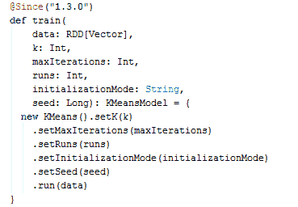
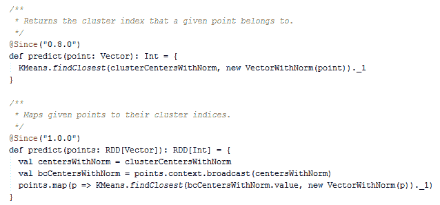
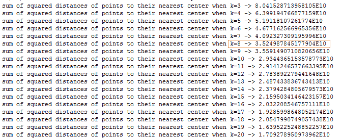

# 使用 Spark MLlib 做 K-means 聚类分析

> 原文：[`developer.ibm.com/zh/articles/os-cn-spark-practice4/`](https://developer.ibm.com/zh/articles/os-cn-spark-practice4/)

## 引言

提起机器学习 (Machine Learning)，相信很多计算机从业者都会对这个技术方向感到兴奋。然而学习并使用机器学习算法来处理数据却是一项复杂的工作，需要充足的知识储备，如概率论，数理统计，数值逼近，最优化理论等。机器学习旨在使计算机具有人类一样的学习能力和模仿能力，这也是实现人工智能的核心思想和方法。传统的机器学习算法，由于技术和单机存储的限制，只能在少量数据上使用，随着 HDFS(Hadoop Distributed File System) 等分布式文件系统出现，存储海量数据已经成为可能。然而由于 MapReduce 自身的限制，使得使用 MapReduce 来实现分布式机器学习算法非常耗时和消耗磁盘容量。因为通常情况下机器学习算法参数学习的过程都是迭代计算的，即本次计算的结果要作为下一次迭代的输入，这个过程中，如果使用 MapReduce，我们只能把中间结果存储磁盘，然后在下一次计算的时候从新读取，这对于迭代 频发的算法显然是致命的性能瓶颈。Spark 立足于内存计算，天然的适应于迭代式计算，相信对于这点，读者通过前面几篇文章已经有了较为深入的了解。然而即便这样，对于普通开发者来说，实现一个分布式机器学习算法仍然是一件极具挑战的事情。MLlib 正是为了让基于海量数据的机器学习变得更加简单，它提供了常用机器学习算法的分布式实现，开发者只需要有 Spark 基础并且了解机器学习算法的原理，以及方法相关参数的含义，就可以轻松的通过调用相应的 API 来实现基于海量数据的机器学习过程。当然，原始数据 ETL，特征指标提取，调节参数并优化学习过程，这依然需要有足够的行业知识和数据敏感度，这往往也是经验的体现。本文的重点在于向读者介绍如何使用 MLlib 机器学习库提供的 K-means 算法做聚类分析，这是一个有意义的过程，相信会对读者特别是初学者有启发意义。

## Spark 机器学习库简介

Spark 机器学习库提供了常用机器学习算法的实现，包括聚类，分类，回归，协同过滤，维度缩减等。使用 Spark 机器学习库来做机器学习工作，可以说是非常的简单，通常只需要在对原始数据进行处理后，然后直接调用相应的 API 就可以实现。但是要想选择合适的算法，高效准确地对数据进行分析，您可能还需要深入了解下算法原理，以及相应 Spark MLlib API 实现的参数的意义。

需要提及的是，Spark 机器学习库从 1.2 版本以后被分为两个包，分别是：

*   spark.mllib

    Spark MLlib 历史比较长了，1.0 以前的版本中已经包含了，提供的算法实现都是基于原始的 RDD，从学习角度上来讲，其实比较容易上手。如果您已经有机器学习方面的经验，那么您只需要熟悉下 MLlib 的 API 就可以开始数据分析工作了。想要基于这个包提供的工具构建完整并且复杂的机器学习流水线是比较困难的。

*   spark.ml

    Spark ML Pipeline 从 Spark1.2 版本开始，目前已经从 Alpha 阶段毕业，成为可用并且较为稳定的新的机器学习库。ML Pipeline 弥补了原始 MLlib 库的不足，向用户提供了一个基于 DataFrame 的机器学习工作流式 API 套件，使用 ML Pipeline API，我们可以很方便的把数据处理，特征转换，正则化，以及多个机器学习算法联合起来，构建一个单一完整的机器学习流水线。显然，这种新的方式给我们提供了更灵活的方法，而且这也更符合机器学习过程的特点。

从官方文档来看，Spark ML Pipeline 虽然是被推荐的机器学习方式，但是并不会在短期内替代原始的 MLlib 库，因为 MLlib 已经包含了丰富稳定的算法实现，并且部分 ML Pipeline 实现基于 MLlib。而且就笔者看来，并不是所有的机器学习过程都需要被构建成一个流水线，有时候原始数据格式整齐且完整，而且使用单一的算法就能实现目标，我们就没有必要把事情复杂化，采用最简单且容易理解的方式才是正确的选择。

本文基于 Spark 1.5，向读者展示使用 MLlib API 进行聚类分析的过程。读者将会发现，使用 MLlib API 开发机器学习应用方式是比较简单的，相信本文可以使读者建立起信心并掌握基本方法，以便在后续的学习和工作中事半功倍。

## K-means 聚类算法原理

聚类分析是一个无监督学习 (Unsupervised Learning) 过程, 一般是用来对数据对象按照其特征属性进行分组，经常被应用在客户分群，欺诈检测，图像分析等领域。K-means 应该是最有名并且最经常使用的聚类算法了，其原理比较容易理解，并且聚类效果良好，有着广泛的使用。

和诸多机器学习算法一样，K-means 算法也是一个迭代式的算法，其主要步骤如下:

*   第一步，选择 K 个点作为初始聚类中心。
*   第二步，计算其余所有点到聚类中心的距离，并把每个点划分到离它最近的聚类中心所在的聚类中去。在这里，衡量距离一般有多个函数可以选择，最常用的是欧几里得距离 (Euclidean Distance), 也叫欧式距离。公式如下：

    

其中 C 代表中心点，X 代表任意一个非中心点。

*   第三步，重新计算每个聚类中所有点的平均值，并将其作为新的聚类中心点。
*   最后，重复 (二)，(三) 步的过程，直至聚类中心不再发生改变，或者算法达到预定的迭代次数，又或聚类中心的改变小于预先设定的阀值。

在实际应用中，K-means 算法有两个不得不面对并且克服的问题。

1.  聚类个数 K 的选择。K 的选择是一个比较有学问和讲究的步骤，我们会在后文专门描述如何使用 Spark 提供的工具选择 K。
2.  初始聚类中心点的选择。选择不同的聚类中心可能导致聚类结果的差异。

Spark MLlib K-means 算法的实现在初始聚类点的选择上，借鉴了一个叫 K-means||的类 K-means++ 实现。K-means++ 算法在初始点选择上遵循一个基本原则: 初始聚类中心点相互之间的距离应该尽可能的远。基本步骤如下:

*   第一步，从数据集 X 中随机选择一个点作为第一个初始点。
*   第二步，计算数据集中所有点与最新选择的中心点的距离 D(x)。
*   第三步，选择下一个中心点，使得

    [选择下一个中心点](https://developer.ibm.com/developer/default/articles/os-cn-spark-practice4/images/img01.png)最大。

*   第四步，重复 (二),(三) 步过程，直到 K 个初始点选择完成。

## MLlib 的 K-means 实现

Spark MLlib 中 K-means 算法的实现类 (KMeans.scala) 具有以下参数，具体如下。

##### 图 1\. MLlib K-means 算法实现类预览


通过下面默认构造函数，我们可以看到这些可调参数具有以下初始值。

##### 图 2\. MLlib K-means 算法参数初始值


参数的含义解释如下：

*   *k* 表示期望的聚类的个数。
*   *maxInterations* 表示方法单次运行最大的迭代次数。
*   *runs* 表示算法被运行的次数。K-means 算法不保证能返回全局最优的聚类结果，所以在目标数据集上多次跑 K-means 算法，有助于返回最佳聚类结果。
*   *initializationMode* 表示初始聚类中心点的选择方式, 目前支持随机选择或者 K-means||方式。默认是 K-means||。
*   *initializationSteps* 表示 K-means||方法中的部数。
*   *epsilon* 表示 K-means 算法迭代收敛的阀值。
*   *seed* 表示集群初始化时的随机种子。

通常应用时，我们都会先调用 KMeans.train 方法对数据集进行聚类训练，这个方法会返回 KMeansModel 类实例，然后我们也可以使用 KMeansModel.predict 方法对新的数据点进行所属聚类的预测，这是非常实用的功能。

KMeans.train 方法有很多重载方法，这里我们选择参数最全的一个展示。

##### 图 3\. KMeans.train 方法预览



KMeansModel.predict 方法接受不同的参数，可以是向量，或者 RDD，返回是入参所属的聚类的索引号。

##### 图 4\. KMeansModel.predict 方法预览



## 聚类测试数据集简介

在本文中，我们所用到目标数据集是来自 UCI Machine Learning Repository 的 [Wholesale customer Data Set](http://archive.ics.uci.edu/ml/datasets/Wholesale+customers) 。UCI 是一个关于机器学习测试数据的下载中心站点，里面包含了适用于做聚类，分群，回归等各种机器学习问题的数据集。

Wholesale customer Data Set 是引用某批发经销商的客户在各种类别产品上的年消费数。为了方便处理，本文把原始的 CSV 格式转化成了两个文本文件，分别是训练用数据和测试用数据。

##### 图 5\. 客户消费数据格式预览


读者可以从标题清楚的看到每一列代表的含义，当然读者也可以到 UCI 网站上去找到关于该数据集的更多信息。虽然 UCI 的数据可以自由获取并使用，但是我们还是在此声明，该数据集的版权属 UCI 以及其原始提供组织或公司所有。

## 案例分析和编码实现

本例中，我们将根据目标客户的消费数据，将每一列视为一个特征指标，对数据集进行聚类分析。代码实现步骤如下

##### 清单 1\. 聚类分析实现类源码

```
import org.apache.spark.{SparkContext, SparkConf}
import org.apache.spark.mllib.clustering.{KMeans, KMeansModel}
import org.apache.spark.mllib.linalg.Vectors
object KMeansClustering { def main (args: Array[String]) { if (args.length < 5) {
    println("Usage:KMeansClustering trainingDataFilePath testDataFilePath numClusters
    numIterations runTimes") sys.exit(1) } val conf = new
    SparkConf().setAppName("Spark MLlib Exercise:K-Means Clustering") val sc = new SparkContext(conf)
   /** *Channel Region Fresh Milk Grocery Frozen Detergents_Paper Delicassen * 2 3
     12669 9656 7561 214 2674 1338 * 2 3 7057 9810 9568 1762 3293 1776 * 2 3 6353 8808
     7684 2405 3516 7844 */
    val rawTrainingData = sc.textFile(args(0)) val parsedTrainingData =
    rawTrainingData.filter(!isColumnNameLine(_)).map(line => {
    Vectors.dense(line.split("\t").map(_.trim).filter(!"".equals(_)).map(_.toDouble)) }).cache()
    // Cluster the data into two classes using KMeans
    val numClusters = args(2).toInt val numIterations = args(3).toInt val runTimes =
    args(4).toInt var clusterIndex:Int = 0 val clusters:KMeansModel =
    KMeans.train(parsedTrainingData, numClusters, numIterations,runTimes)
    println("Cluster Number:" + clusters.clusterCenters.length)
    println("Cluster Centers Information Overview:") clusters.clusterCenters.foreach(
    x => {
    println("Center Point of Cluster " + clusterIndex + ":")
    println(x) clusterIndex += 1 })
    //begin to check which cluster each test data belongs to based on the clustering result
    val rawTestData = sc.textFile(args(1)) val parsedTestData = rawTestData.map(line =>
    {
    Vectors.dense(line.split("\t").map(_.trim).filter(!"".equals(_)).map(_.toDouble))
    }) parsedTestData.collect().foreach(testDataLine => { val predictedClusterIndex:
    Int = clusters.predict(testDataLine)
    println("The data " + testDataLine.toString + " belongs to cluster " +
    predictedClusterIndex) })
    println("Spark MLlib K-means clustering test finished.") } private def
    isColumnNameLine(line:String):Boolean = { if (line != null &&
    line.contains("Channel")) true else false } 
```

该示例程序接受五个入参，分别是

*   训练数据集文件路径
*   测试数据集文件路径
*   聚类的个数
*   K-means 算法的迭代次数
*   K-means 算法 run 的次数

## 运行示例程序

和本系列其他文章一样，我们依然选择使用 HDFS 存储数据文件。运行程序之前，我们需要将前文提到的训练和测试数据集上传到 HDFS。

##### 图 6\. 测试数据的 HDFS 目录


##### 清单 2\. 示例程序运行命令

```
./spark-submit --class com.ibm.spark.exercise.mllib.KMeansClustering \
 --master spark://<spark_master_node_ip>:7077 \
 --num-executors 6 \
--driver-memory 3g \
--executor-memory 512m \
--total-executor-cores 6 \
 /home/fams/spark_exercise-1.0.jar \
 hdfs://<hdfs_namenode_ip>:9000/user/fams/mllib/wholesale_customers_data_training.txt \
 hdfs://<hdfs_namenode_ip>:9000/user/fams/mllib/wholesale_customers_data_test.txt \
 8 30 3 
```

##### 图 7\. K-means 聚类示例程序运行结果


## 如何选择 K

前面提到 K 的选择是 K-means 算法的关键，Spark MLlib 在 KMeansModel 类里提供了 computeCost 方法，该方法通过计算所有数据点到其最近的中心点的平方和来评估聚类的效果。一般来说，同样的迭代次数和算法跑的次数，这个值越小代表聚类的效果越好。但是在实际情况下，我们还要考虑到聚类结果的可解释性，不能一味的选择使 computeCost 结果值最小的那个 K。

##### 清单 3\. K 选择示例代码片段

```
val ks:Array[Int] = Array(3,4,5,6,7,8,9,10,11,12,13,14,15,16,17,18,19,20)
ks.foreach(cluster => {
 val model:KMeansModel = KMeans.train(parsedTrainingData, cluster,30,1)
 val ssd = model.computeCost(parsedTrainingData)
 println("sum of squared distances of points to their nearest center when k=" + cluster + " -> "+ ssd)
}) 
```

##### 图 8\. K 选择示例程序运行结果



从上图的运行结果可以看到，当 K=9 时，cost 值有波动，但是后面又逐渐减小了，所以我们选择 8 这个临界点作为 K 的个数。当然可以多跑几次，找一个稳定的 K 值。理论上 K 的值越大，聚类的 cost 越小，极限情况下，每个点都是一个聚类，这时候 cost 是 0，但是显然这不是一个具有实际意义的聚类结果。

## 结束语

通过本文的学习，读者已经初步了解了 Spark 的机器学习库，并且掌握了 K-means 算法的基本原理，以及如何基于 Spark MLlib 构建自己的机器学习应用。机器学习应用的构建是一个复杂的过程，我们通常还需要对数据进行预处理，然后特征提取以及数据清洗等，然后才能利用算法来分析数据。Spark MLlib 区别于传统的机器学习工具，不仅是因为它提供了简单易用的 API，更重要的是 Spark 在处理大数据上的高效以及在迭代计算时的独特优势。虽然本文所采用的测试数据集很小，并不能反映大数据的应用场景，但是对于掌握基本原理已经足够，并且如果读者拥有更大的数据集就可以轻松的将本文的测试程序推广到大数据聚类的场景下，因为 Spark MLlib 的编程模型都是一致的，无非是数据读取和处理的方式略有不同。希望读者可以在本文中找到自己感兴趣的知识，相信这对读者今后深入学习是有帮助的。另外，读者在阅读本文的过程中，如果遇到问题或者发现不足之处，请不吝赐教，在文末留言，共同交流学习，谢谢。