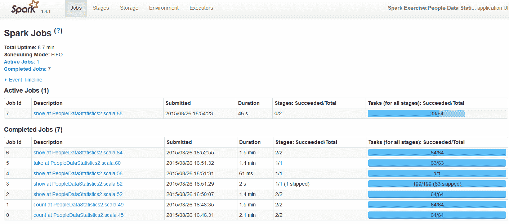
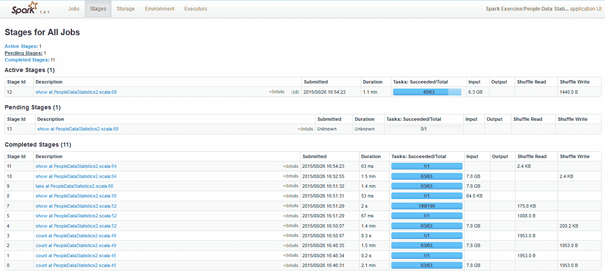
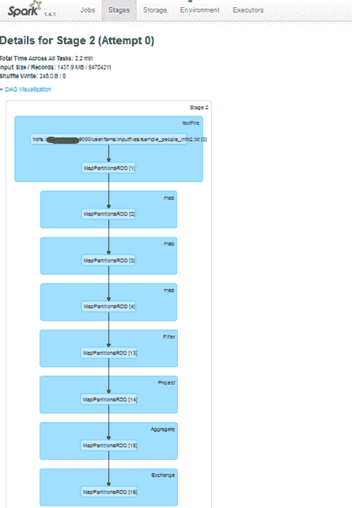
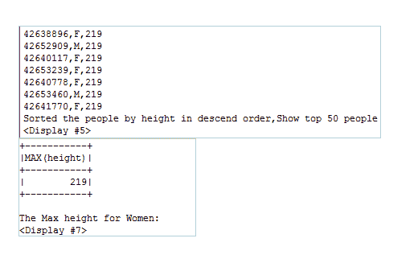
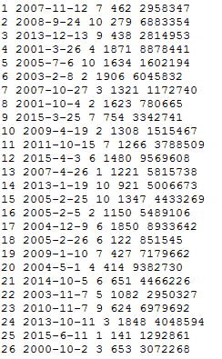

# 使用 Spark SQL 对结构化数据进行统计分析

> 原文：[`developer.ibm.com/zh/articles/os-cn-spark-practice3/`](https://developer.ibm.com/zh/articles/os-cn-spark-practice3/)

## 引言

在很多领域，如电信，金融等，每天都会产生大量的结构化数据，当数据量不断变大，传统的数据存储 (DBMS) 和计算方式 (单机程序) 已经不能满足企业对数据存储，统计分析以及知识挖掘的需要。在过去的数年里，传统的软件开发和维护人员已经积累了大量的基于 DBMS 的操作数据知识和经验，他们已经习惯了通过编写 SQL 语句来对数据记录进行统计分析。于是大数据工程师们开始探索如何使用类 SQL 的方式来操作和分析大数据，通过大量的努力，目前业界已经出现很多 SQL on Hadoop 的方案，如 Hive, Impala 等。Spark SQL 就是其中的一个，实际上 Spark SQL 并不是一开始就存在于 Spark 生态系统里的，它的前身是 Shark。随着 Spark 自身的发展，Spark 团队开始试图放弃 Shark 这个对于 Hive 有太多依赖 (查询优化，语法解析) 的东西，于是才有了 Spark SQL 这个全新的模块，通过几个版本的发展，目前 Spark SQL 已经趋于稳定，功能也逐渐丰富。本文将以 Spark1.4.1 版本为基础，由浅入深地向读者介绍 Spark SQL/DataFrame 的基本概念和原理，并且通过实例向读者展示如何使用 Spark SQL/DataFrame API 开发应用程序。接下来，就让我们开始 Spark SQL 的体验之旅吧。

## 关于 Spark SQL/DataFrame

Spark SQL 是 Spark 生态系统里用于处理结构化大数据的模块，该模块里最重要的概念就是 DataFrame, 相信熟悉 R 语言的工程师对此并不陌生。Spark 的 DataFrame 是基于早期版本中的 SchemaRDD，所以很自然的使用分布式大数据处理的场景。Spark DataFrame 以 RDD 为基础，但是带有 Schema 信息，它类似于传统数据库中的二维表格。

Spark SQL 模块目前支持将多种外部数据源的数据转化为 DataFrame，并像操作 RDD 或者将其注册为临时表的方式处理和分析这些数据。当前支持的数据源有：

*   Json
*   文本文件
*   RDD
*   关系数据库
*   Hive
*   Parquet

一旦将 DataFrame 注册成临时表，我们就可以使用类 SQL 的方式操作这些数据，我们将在下文的案例中详细向读者展示如何使用 Spark SQL/DataFrame 提供的 API 完成数据读取，临时表注册，统计分析等步骤。

## 案例介绍与编程实现

### 案例一

#### 案例一描述与分析

本案例中，我们将使用 Spark SQL 分析包含 5 亿条人口信息的结构化数据，数据存储在文本文件上，总大小为 7.81G。文件总共包含三列，第一列是 ID，第二列是性别信息 (F -> 女，M -> 男)，第三列是人口的身高信息，单位是 cm。实际上这个文件与我们在本系列文章第一篇中的案例三使用的格式是一致的，读者可以参考相关章节，并使用提供的测试数据生成程序，生成 5 亿条数据，用于本案例中。为了便于读者理解，本案例依然把用于分析的文本文件的内容片段贴出来，具体格式如下。

##### 图 1\. 案例一测试数据格式预览


生成该测试文件后，读者需要把文件上传到 HDFS 上，您可以选择使用 HDFS shell 命令或者 HDSF 的 eclipse 插件。上传到 HDFS 后，我们可以通过访问相应的控制台，查看文件具体信息。

##### 图 2\. 案例一测试数据文件基本信息


本例中，我们的统计任务如下：

*   用 SQL 语句的方式统计男性中身高超过 180cm 的人数。
*   用 SQL 语句的方式统计女性中身高超过 170cm 的人数。
*   对人群按照性别分组并统计男女人数。
*   用类 RDD 转换的方式对 DataFrame 操作来统计并打印身高大于 210cm 的前 50 名男性。
*   对所有人按身高进行排序并打印前 50 名的信息。
*   统计男性的平均身高。
*   统计女性身高的最大值。

读者可以看到，上述统计任务中有些是相似的，但是我们要用不同的方式实现它，以向读者展示不同的语法。

#### 案例一编码实现

##### 清单 1\. 案例一示例程序源代码

```
import org.apache.spark.SparkConf
import org.apache.spark.SparkContext
import org.apache.spark.sql.SQLContext
import org.apache.spark.sql.types._
import org.apache.spark.sql.Row
import org.apache.spark.rdd.RDD
object PeopleDataStatistics2 {
 private val schemaString = "id,gender,height"
 def main(args: Array[String]) {
 if (args.length < 1) {
 println("Usage:PeopleDataStatistics2 filePath")
 System.exit(1)
 }
 val conf = new SparkConf().setAppName("Spark Exercise:People Data Statistics 2")
 val sc = new SparkContext(conf)
 val peopleDataRDD = sc.textFile(args(0))
 val sqlCtx = new SQLContext(sc)
 // this is used to implicitly convert an RDD to a DataFrame.
 import sqlCtx.implicits._
 val schemaArray = schemaString.split(",")
 val schema = StructType(schemaArray.map(fieldName =
                         > StructField(fieldName, StringType, true)))
 val rowRDD: RDD[Row] = peopleDataRDD.map(_.split(" ")).map(
                         eachRow => Row(eachRow(0), eachRow(1), eachRow(2)))
 val peopleDF = sqlCtx.createDataFrame(rowRDD, schema)
 peopleDF.registerTempTable("people")
 //get the male people whose height is more than 180
 val higherMale180 = sqlCtx.sql("select id,gender,
                     height from people where height > 180 and gender='M'")
 println("Men whose height are more than 180: " + higherMale180.count())
 println("<Display #1>")
 //get the female people whose height is more than 170
 val higherFemale170 = sqlCtx.sql("select id,gender,
                          height from people where height > 170 and gender='F'")
 println("Women whose height are more than 170: " + higherFemale170.count())
 println("<Display #2>")
 //Grouped the people by gender and count the number
 peopleDF.groupBy(peopleDF("gender")).count().show()
 println("People Count Grouped By Gender")
 println("<Display #3>")
 //
 peopleDF.filter(peopleDF("gender").equalTo("M")).filter(
                                   peopleDF("height") > 210).show(50)
 println("Men whose height is more than 210")
 println("<Display #4>")
 //
 peopleDF.sort($"height".desc).take(50).foreach { row => println(row(0) + "," + row(1) + "," + row(2)) }
 println("Sorted the people by height in descend order,Show top 50 people")
 println("<Display #5>")
 //
 peopleDF.filter(peopleDF("gender").equalTo("M")).agg(Map("height" -> "avg")).show()
 println("The Average height for Men")
 println("<Display #6>")
 //
 peopleDF.filter(peopleDF("gender").equalTo("F")).agg("height" -> "max").show()
 println("The Max height for Women:")
 println("<Display #7>")
 //......
 println("All the statistics actions are finished on structured People data.")
 }
} 
```

#### 案例一提交并运行

编码完成后，把项目打成 jar 包，在这里，我们将源码打成名为 spark_exercise-1.0.jar, 笔者使用 Maven 来管理项目，也建议读者可以尝试下 Maven 管理您的 Scala 项目。

##### 清单 2\. 案例一示例程序执行命令

```
./spark-submit --class com.ibm.spark.exercise.sql.PeopleDataStatistics2 \
--master spark://<spark_master_node_ip>:7077 \
--driver-memory 8g \
--executor-memory 2g \
--total-executor-cores 12 \
 /home/fams/spark_exercise-1.0.jar \ hdfs://<hdfs_namenode_ip>:9000/
                                  user/fams/inputfiles/sample_people_info2.txt 
```

#### 案例一监控执行过程

在提交后，我们可以在 Spark web console 中监控程序执行过程。下面我们将分别向读者展示如何监控程序产生的 Jobs，Stages，以及 D 可视化的查看 DAG 信息。

##### 图 3\. 案例一程序监控图 1


##### 图 4\. 案例一程序监控图 2



##### 图 5\. 案例一程序监控图 3



##### 图 6\. 案例一程序监控图 4



其实在 Spark web console 中还可以查看很多信息，如运行环境信息，Executor 进程信息，读者可以在界面上一一查看，在这里不再赘述。

#### 案例一运行结果

##### 图 7\. 案例一程序运行结果 (部分)



### 案例二

#### 案例二描述与分析

在案例一中，我们将存储于 HDFS 中的文件转换成 DataFrame 并进行了一系列的统计，细心的读者会发现，都是一个关联于一个 DataFrame 的简单查询和统计，那么在案例二中，我们将向读者展示如何连接多个 DataFrame 做更复杂的统计分析。

在本案例中，我们将统计分析 1 千万用户和 1 亿条交易数据。对于用户数据，它是一个包含 6 个列 (ID, 性别, 年龄, 注册日期, 角色 (从事行业), 所在区域) 的文本文件，具有以下格式。

##### 图 8\. 案例二测试用户数据格式预览


我们使用以下 Scala 程序来生成本案例所需的测试数据。

##### 清单 3\. 案例二用户测试数据生成类源代码

```
import java.io.{File, FileWriter}
import scala.util.Random
object UserDataGenerator {
 private val FILE_PATH = "C:\\LOCAL_DISK_D\\sample_user_data.txt"
 private val ROLE_ID_ARRAY = ArrayString
 private val REGION_ID_ARRAY = ArrayString
 private val MAX_USER_AGE = 60
 //how many records to be generated
 private val MAX_RECORDS = 10000000
 def main(args:Array[String]): Unit = {
 generateDataFile(FILE_PATH , MAX_RECORDS)
 }

 private def generateDataFile(filePath : String, recordNum: Int): Unit = {
 var writer:FileWriter = null
 try {
 writer = new FileWriter(filePath,true)
 val rand = new Random()
 for (i <- 1 to recordNum) {
 //generate the gender of the user
 var gender = getRandomGender
 //
 var age = rand.nextInt(MAX_USER_AGE)
 if (age < 10) {
 age = age + 10
 }
 //generate the registering date for the user
 var year = rand.nextInt(16) + 2000
 var month = rand.nextInt(12)+1
 //to avoid checking if it is a valid day for specific month
 //we always generate a day which is no more than 28
 var day = rand.nextInt(28) + 1
 var registerDate = year + "-" + month + "-" + day
 //generate the role of the user
 var roleIndex:Int = rand.nextInt(ROLE_ID_ARRAY.length)
 var role = ROLE_ID_ARRAY(roleIndex)
 //generate the region where the user is
 var regionIndex:Int = rand.nextInt(REGION_ID_ARRAY.length)
 var region = REGION_ID_ARRAY(regionIndex)

 writer.write(i + " " + gender + " " + age + " " + registerDate
 + " " + role + " " + region)
 writer.write(System.getProperty("line.separator"))
 }
 writer.flush()
 } catch {
 case e:Exception => println("Error occurred:" + e)
 } finally {
 if (writer != null)
 writer.close()
 }
 println("User Data File generated successfully.")
 }

 private def getRandomGender() :String = {
 val rand = new Random()
 val randNum = rand.nextInt(2) + 1
 if (randNum % 2 == 0) {
 "M"
 } else {
 "F"
 }
 }
} 
```

对于交易数据，它是一个包含 5 个列 (交易单号, 交易日期, 产品种类, 价格, 用户 ID) 的文本文件，具有以下格式。

##### 图 9\. 案例二测试交易数据格式预览



对于交易数据，我们使用以下 Scala 程序来生成。

##### 清单 4\. 案例二交易测试数据生成类源代码

```
import java.io.{File, FileWriter}
import scala.util.Random
object ConsumingDataGenerator {
 private val FILE_PATH = "C:\\LOCAL_DISK_D\\sample_consuming_data.txt"
 // how many records to be generated
 private val MAX_RECORDS = 100000000
 // we suppose only 10 kinds of products in the consuming data
 private val PRODUCT_ID_ARRAY = ArrayInt
 // we suppose the price of most expensive product will not exceed 2000 RMB
 private val MAX_PRICE = 2000
 // we suppose the price of cheapest product will not be lower than 10 RMB
 private val MIN_PRICE = 10
 //the users number which should be same as the one in UserDataGenerator object
 private val USERS_NUM = 10000000

 def main(args:Array[String]): Unit = {
 generateDataFile(FILE_PATH,MAX_RECORDS);
 }

 private def generateDataFile(filePath : String, recordNum: Int): Unit = {
 var writer:FileWriter = null
 try {
 writer = new FileWriter(filePath,true)
 val rand = new Random()
 for (i <- 1 to recordNum) {
 //generate the buying date
 var year = rand.nextInt(16) + 2000
 var month = rand.nextInt(12)+1
 //to avoid checking if it is a valid day for specific
 // month,we always generate a day which is no more than 28
 var day = rand.nextInt(28) + 1
 var recordDate = year + "-" + month + "-" + day
 //generate the product ID
 var index:Int = rand.nextInt(PRODUCT_ID_ARRAY.length)
 var productID = PRODUCT_ID_ARRAY(index)
 //generate the product price
 var price:Int = rand.nextInt(MAX_PRICE)
 if (price == 0) {
 price = MIN_PRICE
 }
 // which user buys this product
 val userID = rand.nextInt(10000000)+1
 writer.write(i + " " + recordDate + " " + productID
 + " " + price + " " + userID)
 writer.write(System.getProperty("line.separator"))
 }
 writer.flush()
 } catch {
 case e:Exception => println("Error occurred:" + e)
 } finally {
 if (writer != null)
 writer.close()
 }
 println("Consuming Data File generated successfully.")
 }
} 
```

#### 案例二编码实现

##### 清单 5\. 案例二示例程序源代码

```
import org.apache.spark.sql.SQLContext
import org.apache.spark.storage.StorageLevel
import org.apache.spark.{SparkContext, SparkConf}

//define case class for user
case class User(userID: String, gender: String, age: Int,
                                registerDate: String,role: String, region: String)
//define case class for consuming data
case class Order(orderID: String, orderDate: String, productID: Int, price: Int, userID: String)

object UserConsumingDataStatistics {
 def main(args: Array[String]) {
 if (args.length < 1) {
 println("Usage:UserConsumingDataStatistics userDataFilePath consumingDataFilePath")
 System.exit(1)
 }
 val conf = new SparkConf().setAppName("Spark Exercise:User Consuming Data Statistics")
 //Kryo serializer is more quickly by default java serializer
 conf.set("spark.serializer", "org.apache.spark.serializer.KryoSerializer")
 val ctx = new SparkContext(conf)
 val sqlCtx = new SQLContext(ctx)
 import sqlCtx.implicits._
 //Convert user data RDD to a DataFrame and register it as a temp table
 val userDF = ctx.textFile(args(0)).map(_.split(" ")).map(
                          u => User(u(0), u(1), u(2).toInt,u(3),u(4),u(5))).toDF()
 userDF.registerTempTable("user")
 //Convert consuming data RDD to a DataFrame and register it as a temp table
 val orderDF = ctx.textFile(args(1)).map(_.split(" ")).map(o => Order(
                                        o(0), o(1), o(2).toInt,o(3).toInt,o(4))).toDF()
 orderDF.registerTempTable("orders")
 //cache the DF in memory with serializer should make the program run much faster
 userDF.persist(StorageLevel.MEMORY_ONLY_SER)
 orderDF.persist(StorageLevel.MEMORY_ONLY_SER)

 //The number of people who have orders in the year 2015
 val count = orderDF.filter(orderDF("orderDate").contains("2015")).join(
                               userDF, orderDF("userID").equalTo(userDF("userID"))).count()
 println("The number of people who have orders in the year 2015:" + count)
 //total orders produced in the year 2014
 val countOfOrders2014 = sqlCtx.sql("SELECT * FROM orders where
                                     orderDate like '2014%'").count()
 println("total orders produced in the year 2014:" + countOfOrders2014)
 //Orders that are produced by user with ID 1 information overview
 val countOfOrdersForUser1 = sqlCtx.sql("SELECT o.orderID,o.productID,
                  o.price,u.userID FROM orders o,user u where u.userID =
                                      1 and u.userID = o.userID").show()
 println("Orders produced by user with ID 1 showed.")
 //Calculate the max,min,avg prices for the orders that are producted by user with ID 10
 val orderStatsForUser10 = sqlCtx.sql("SELECT max(o.price) as maxPrice,
                min(o.price) as minPrice,avg(o.price) as avgPrice,u.userID FROM orders o,
                       user u where u.userID = 10 and u.userID = o.userID group by u.userID")
 println("Order statistic result for user with ID 10:")
 orderStatsForUser10.collect().map(order => "Minimum Price=" + order.getAs("minPrice")
 + ";Maximum Price=" + order.getAs("maxPrice")
 + ";Average Price=" + order.getAs("avgPrice")
 ).foreach(result => println(result))
 }
} 
```

#### 案例二提交并执行

```
./spark-submit –class com.ibm.spark.exercise.sql.UserConsumingDataStatistics \
 --master spark://<spark_master_node_ip>:7077 \
--num-executors 6 \
--driver-memory 8g \
--executor-memory 2g \
--executor-cores 2 \
/home/fams/spark_exercise-1.0.jar \
 hdfs://<hdfs_namenode_ip>:9000/user/fams/inputfiles/sample_user_data.txt \
 hdfs://<hdfs_namenode_ip>:9000/user/fams/inputfiles/sample_consuming_data.txt 
```

#### 案例二监控执行过程

程序提交后，读者可以用案例一描述的方式在 Spark web console 监控执行过程，这样也能帮助您深入的理解 Spark SQL 程序的执行过程。

#### 案例二运行结果

##### 图 10\. 案例二程序运行结果 (部分)


## 总结

关于 Spark SQL 程序开发，我们通常有以下需要注意的地方。

1.  Spark SQL 程序开发过程中，我们有两种方式确定 schema，第一种是反射推断 schema，如本文的案例二，这种方式下，我们需要定义样本类 (case class) 来对应数据的列;第二种方式是通过编程方式来确定 schema，这种方式主要是通过 Spark SQL 提供的 StructType 和 StructField 等 API 来编程实现，这种方式下我们不需要定义样本类，如本文中的案例一。

    在程序实现中，我们需要使用 `import sqlCtx.implicits._` 以便隐式的把 RDD 转化成 DataFrame 来操作。

2.  本文展示的 DataFrame API 使用的方法只是其中很小的一部分，但是一旦读者掌握了开发的基本流程，就能通过参考 [DataFrame API 文档](http://spark.apache.org/docs/1.4.1/api/scala/index.html#org.apache.spark.sql.DataFrame) 写出更为复杂的程序。
3.  通常来说，我们有两种方式了解 Spark 程序的执行流程。第一种是通过在控制台观察输出日志，另一种则更直观，就是通过 Spark Web Console 来观察 Driver 程序里各个部分产生的 job 信息以及 job 里包含的 stages 信息。
4.  需要指出的是，熟练的掌握 Spark SQL/DataFrame 的知识对学习最新的 Spark 机器学习库 ML Pipeline 至关重要，因为 ML Pipeline 使用 DataFrame 作为数据集来支持多种的数据类型。
5.  笔者在测试的过程中发现，处理相同的数据集和类似的操作，Spark SQL/DataFrame 比传统的 RDD 转换操作具有更好的性能。这是由于 SQL 模块的 Catalyst 对用户 SQL 做了很好的查询优化。在以后的文章中会向读者详细的介绍该组件。

## 结束语

本文通过两个案例向读者详细的介绍了使用 Spark SQL/DataFrame 处理结构化数据的过程，限于篇幅，我们并没有在文中向读者详细介绍 Spark SQL/DataFrame 程序的执行流程，以及 Catalyst SQL 解析和查询优化引擎。这个将会在本系列后面的文章中介绍。其实文中提供的测试数据还可以用来做更为复杂的 Spark SQL 测试，读者可以基于本文，进行更多的工作。需要指出的是，由于我们用到的数据是靠程序随机生成的，所以部分数据难免有不符合实际的情况，读者应该关注在使用 Spark SQL/DataFrame 处理这些数据的过程。最后，感谢您耐心的阅读本文，如果您有任何问题或者想法，请在文末留言，我们可以进行深入的讨论。让我们互相学习，共同进步。