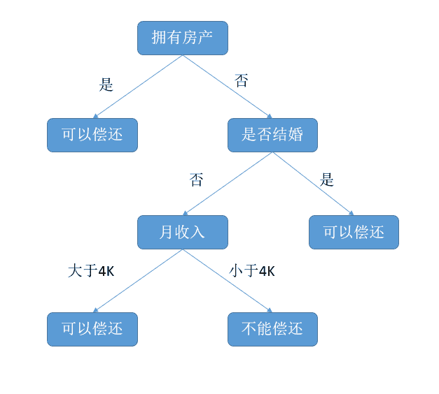
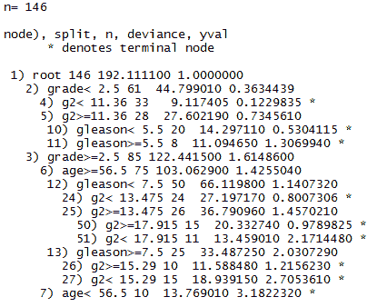
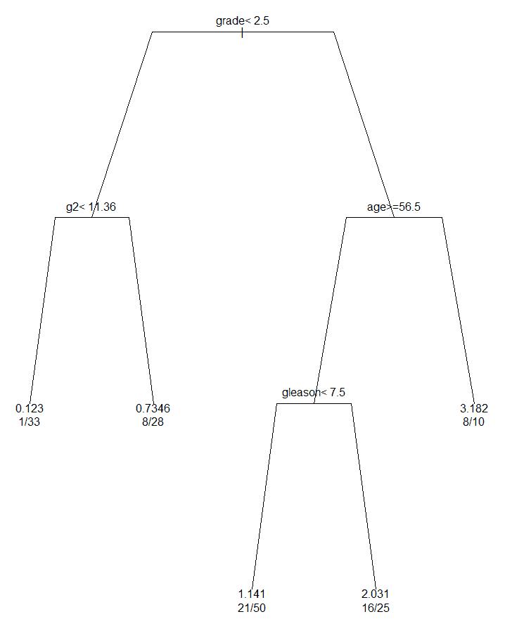

# 决策树算法介绍及应用

> 原文：[`developer.ibm.com/zh/articles/ba-1507-decisiontree-algorithm/`](https://developer.ibm.com/zh/articles/ba-1507-decisiontree-algorithm/)

## 机器学习概念

机器学习 (Machine Learning) 是近 20 多年兴起的一门多领域交叉学科，涉及概率论、统计学、逼近论、凸分析、算法复杂度理论等多门学科。

机器学习理论主要是设计和分析一些让计算机可以自动学习的算法。机器学习算法是一类从数据中自动分析获得规律，并利用规律对未知数据进行预测的算法。因为学习算法中涉及了大量的统计学理论，机器学习与统计推断学联系尤为密切，也被称为统计学习理论。在算法设计方面，机器学习理论关注可以实现的、行之有效的学习算法。很多相关问题的算法复杂度较高，而且很难找到固有的规律，所以部分的机器学习研究是开发容易处理的近似算法。

机器学习在数据挖掘、计算机视觉、自然语言处理、生物特征识别、搜索引擎、医学诊断、检测信用卡欺诈、证券市场分析、DNA 序列测序、语言与手写识别、战略游戏与机器人运用等领域有着十分广泛的应用。它无疑是当前数据分析领域的一个热点内容。

## 算法分类

机器学习的算法繁多，其中很多算法是一类算法，而有些算法又是从其他算法中衍生出来的，因此我们可以按照不同的角度将其分类。本文主要通过学习方式和算法类似性这两个角度将机器学习算法进行分类。

### 学习方式

1.  监督式学习：从给定的训练数据集中学习出一个函数，当新的数据到来时，可以根据这个函数预测结果。监督学习的训练集需要包括输入和输出，也可以说是特征和目标。训练集中的目标是由人标注的。常见的监督式学习算法包括回归分析和统计分类。
2.  非监督式学习：与监督学习相比，训练集没有人为标注的结果。常见的非监督式学习算法有聚类。
3.  半监督式学习：输入数据部分被标识，部分没有被标识，介于监督式学习与非监督式学习之间。常见的半监督式学习算法有支持向量机。
4.  强化学习：在这种学习模式下，输入数据作为对模型的反馈，不像监督模型那样，输入数据仅仅是作为一个检查模型对错的方式，在强化学习下，输入数据直接反馈到模型，模型必须对此立刻作出调整。常见的强化学习算法有时间差学习。

### 算法类似性

1.  决策树学习：根据数据的属性采用树状结构建立决策模型。决策树模型常常用来解决分类和回归问题。常见的算法包括 CART (Classification And Regression Tree)、ID3、C4.5、随机森林 (Random Forest) 等。
2.  回归算法：试图采用对误差的衡量来探索变量之间的关系的一类算法。常见的回归算法包括最小二乘法 (Least Square)、逻辑回归 (Logistic Regression)、逐步式回归 (Stepwise Regression) 等。
3.  聚类算法：通常按照中心点或者分层的方式对输入数据进行归并。所有的聚类算法都试图找到数据的内在结构，以便按照最大的共同点将数据进行归类。常见的聚类算法包括 K-Means 算法以及期望最大化算法 (Expectation Maximization) 等。
4.  人工神经网络：模拟生物神经网络，是一类模式匹配算法。通常用于解决分类和回归问题。人工神经网络算法包括感知器神经网络 (Perceptron Neural Network) 、反向传递 (Back Propagation) 和深度学习等。
5.  集成算法：用一些相对较弱的学习模型独立地就同样的样本进行训练，然后把结果整合起来进行整体预测。集成算法的主要难点在于究竟集成哪些独立的较弱的学习模型以及如何把学习结果整合起来。这是一类非常强大的算法，同时也非常流行。常见的算法包括 Boosting、Bagging、AdaBoost、随机森林 (Random Forest) 等。

## 决策树

决策树是附加概率结果的一个树状的决策图，是直观的运用统计概率分析的图法。机器学习中决策树是一个预测模型，它表示对象属性和对象值之间的一种映射，树中的每一个节点表示对象属性的判断条件，其分支表示符合节点条件的对象。树的叶子节点表示对象所属的预测结果。

### 决策树案例

##### 图 1\. 决策树案例图



图 1 是一棵结构简单的决策树，用于预测贷款用户是否具有偿还贷款的能力。贷款用户主要具备三个属性：是否拥有房产，是否结婚，平均月收入。每一个内部节点都表示一个属性条件判断，叶子节点表示贷款用户是否具有偿还能力。例如：用户甲没有房产，没有结婚，月收入 5K。通过决策树的根节点判断，用户甲符合右边分支 (拥有房产为”否”)；再判断是否结婚，用户甲符合左边分支 (是否结婚为否)；然后判断月收入是否大于 4k，用户甲符合左边分支 (月收入大于 4K)，该用户落在”可以偿还”的叶子节点上。所以预测用户甲具备偿还贷款能力。

### 决策树建立

本文上一节已经讨论如何用一棵决策树进行分类。本节将通过特征选择、剪枝，介绍如何根据已有的样本数据建立一棵决策树。

首先介绍下特征选择。选择一个合适的特征作为判断节点，可以快速的分类，减少决策树的深度。决策树的目标就是把数据集按对应的类标签进行分类。最理想的情况是，通过特征的选择能把不同类别的数据集贴上对应类标签。特征选择的目标使得分类后的数据集比较纯。如何衡量一个数据集纯度，这里就需要引入数据纯度函数。下面将介绍两种表示数据纯度的函数。

*   信息增益

信息熵表示的是不确定度。均匀分布时，不确定度最大，此时熵就最大。当选择某个特征对数据集进行分类时，分类后的数据集信息熵会比分类前的小，其差值表示为信息增益。信息增益可以衡量某个特征对分类结果的影响大小。

假设在样本数据集 D 中，混有 c 种类别的数据。构建决策树时，根据给定的样本数据集选择某个特征值作为树的节点。在数据集中，可以计算出该数据中的信息熵：

##### 图 2\. 作用前的信息熵计算公式


其中 D 表示训练数据集，c 表示数据类别数，Pi 表示类别 i 样本数量占所有样本的比例。

对应数据集 D，选择特征 A 作为决策树判断节点时，在特征 A 作用后的信息熵的为 Info(D)，计算如下：

##### 图 3\. 作用后的信息熵计算公式


其中 k 表示样本 D 被分为 k 个部分。

信息增益表示数据集 D 在特征 A 的作用后，其信息熵减少的值。公式如下：

##### 图 4\. 信息熵差值计算公式


对于决策树节点最合适的特征选择，就是 Gain(A) 值最大的特征。

*   基尼指数

基尼指数是另一种数据的不纯度的度量方法，其公式为：

##### 图 5\. 基尼指数计算公式


其中 c 表示数据集中类别的数量，Pi 表示类别 i 样本数量占所有样本的比例。

从该公式可以看出，当数据集中数据混合的程度越高，基尼指数也就越高。当数据集 D 只有一种数据类型，那么基尼指数的值为最低 0。

如果选取的属性为 A，那么分裂后的数据集 D 的基尼指数的计算公式为：

##### 图 6\. 分裂后的基尼指数计算公式


其中 k 表示样本 D 被分为 k 个部分，数据集 D 分裂成为 k 个 Dj 数据集。

对于特征选取，需要选择最小的分裂后的基尼指数。也可以用基尼指数增益值作为决策树选择特征的依据。公式如下：

##### 图 7\. 基尼指数差值计算公式


在决策树选择特征时，应选择基尼指数增益值最大的特征，作为该节点分裂条件。

接下来介绍剪枝。在分类模型建立的过程中，很容易出现过拟合的现象。过拟合是指在模型学习训练中，训练样本达到非常高的逼近精度，但对检验样本的逼近误差随着训练次数而呈现出先下降后上升的现象。过拟合时训练误差很小，但是检验误差很大，不利于实际应用。

决策树的过拟合现象可以通过剪枝进行一定的修复。剪枝分为预先剪枝和后剪枝两种。

预先剪枝指在决策树生长过程中，使用一定条件加以限制，使得产生完全拟合的决策树之前就停止生长。预先剪枝的判断方法也有很多，比如信息增益小于一定阀值的时候通过剪枝使决策树停止生长。但如何确定一个合适的阀值也需要一定的依据，阀值太高导致模型拟合不足，阀值太低又导致模型过拟合。

后剪枝是在决策树生长完成之后，按照自底向上的方式修剪决策树。后剪枝有两种方式，一种用新的叶子节点替换子树，该节点的预测类由子树数据集中的多数类决定。另一种用子树中最常使用的分支代替子树。

预先剪枝可能过早的终止决策树的生长，后剪枝一般能够产生更好的效果。但后剪枝在子树被剪掉后，决策树生长的一部分计算就被浪费了。

### 决策树模型评估

建立了决策树模型后需要给出该模型的评估值，这样才可以来判断模型的优劣。学习算法模型使用训练集 (training set) 建立模型，使用校验集 (test set) 来评估模型。本文通过评估指标和评估方法来评估决策树模型。

评估指标有分类准确度、召回率、虚警率和精确度等。而这些指标都是基于混淆矩阵 (confusion matrix) 进行计算的。

混淆矩阵是用来评价监督式学习模型的精确性，矩阵的每一列代表一个类的实例预测，而每一行表示一个实际的类的实例。以二类分类问题为例，如下表所示：

##### 表 1\. 混淆矩阵

|  | 预测的类 |  |  |  |
| --- | --- | --- | --- | --- |
| **实际的类** |  | 类 = 1 | 类 = 0 |  |
|  | 类 = 1 | TP | FN | P |
|  | 类 = 0 | FP | TN | N |

其中

P (Positive Sample)：正例的样本数量。

N(Negative Sample)：负例的样本数量。

TP(True Positive)：正确预测到的正例的数量。

FP(False Positive)：把负例预测成正例的数量。

FN(False Negative)：把正例预测成负例的数量。

TN(True Negative)：正确预测到的负例的数量。

根据混淆矩阵可以得到评价分类模型的指标有以下几种。

分类准确度，就是正负样本分别被正确分类的概率，计算公式为：

##### 图 8\. 分类准确度计算公式


召回率，就是正样本被识别出的概率，计算公式为：

##### 图 9\. 召回率计算公式


虚警率，就是负样本被错误分为正样本的概率，计算公式为：

##### 图 10\. 虚警率计算公式


精确度，就是分类结果为正样本的情况真实性程度，计算公式为：

##### 图 11\. 精确度计算公式


评估方法有保留法、随机二次抽样、交叉验证和自助法等。

保留法 (holdout) 是评估分类模型性能的最基本的一种方法。将被标记的原始数据集分成训练集和检验集两份，训练集用于训练分类模型，检验集用于评估分类模型性能。但此方法不适用样本较小的情况，模型可能高度依赖训练集和检验集的构成。

随机二次抽样 (random subsampling) 是指多次重复使用保留方法来改进分类器评估方法。同样此方法也不适用训练集数量不足的情况，而且也可能造成有些数据未被用于训练集。

交叉验证 (cross-validation) 是指把数据分成数量相同的 k 份，每次使用数据进行分类时，选择其中一份作为检验集，剩下的 k-1 份为训练集，重复 k 次，正好使得每一份数据都被用于一次检验集 k-1 次训练集。该方法的优点是尽可能多的数据作为训练集数据，每一次训练集数据和检验集数据都是相互独立的，并且完全覆盖了整个数据集。也存在一个缺点，就是分类模型运行了 K 次，计算开销较大。

自助法 (bootstrap) 是指在其方法中，训练集数据采用的是有放回的抽样，即已经选取为训练集的数据又被放回原来的数据集中，使得该数据有机会能被再一次抽取。用于样本数不多的情况下，效果很好。

## 决策树建模

在本节中，将通过 R 和 IBM SPSS 两种建模工具分别对其实际案例进行决策树建模。

### R

R 是一个用于统计计算及统计制图的优秀的开源软件，也是一个可以从大数据中获取有用信息的绝佳工具。它能在目前各种主流操作系统上安装使用，并且提供了很多数据管理、统计和绘图函数。

下面本节就将使用 R 所提供的强大的函数库来构建一棵决策树并加以剪枝。

##### 清单 1\. 构建决策树及其剪枝的 R 代码

```
# 导入构建决策树所需要的库
library("rpart")
library("rpart.plot")
library("survival")
# 查看本次构建决策树所用的数据源
stagec
# 通过 rpart 函数构建决策树
fit <- rpart(Surv(pgtime,pgstat)~age+eet+g2+grade+gleason+ploidy,stagec,method="exp")
# 查看决策树的具体信息
print(fit)
printcp(fit)
# 绘制构建完的决策树图
plot(fit, uniform=T, branch=0.6, compress=T)
text(fit, use.n=T)
# 通过 prune 函数剪枝
fit2 <- prune(fit, cp=0.016)
# 绘制剪枝完后的决策树图
plot(fit2, uniform=T, branch=0.6, compress=T)
text(fit2, use.n=T) 
```

根据代码，运行步骤如下：

1.  导入需要的函数库。当然如果本地开发环境没有相应的库的话，还需要通过 install.packages 函数对库进行安装。
2.  查看本次构建决策树的数据源。stagec 是一组前列腺癌复发的研究数据。
3.  通过 rpart 函数构建决策树，以研究癌复发与病人年龄、肿瘤等级、癌细胞比例，癌细胞分裂状况等之间的关系。
4.  查看决策树的具体信息。
5.  绘制构建完成的决策树图。
6.  通过 prune 函数对该决策树进行适当的剪枝，防止过拟合，使得树能够较好地反映数据内在的规律并在实际应用中有意义。
7.  绘制剪枝完后的决策树图。

该案例决策树的拟合结果与剪枝前后的树如下图所示：

##### 图 12\. 决策树案例拟合图



##### 图 13\. 未剪枝的决策树图


##### 图 14\. 剪枝后的决策树图



### SPSS

IBM SPSS Modeler 是一个预测分析平台，能够为个人、团队、系统和企业做决策提供预测性信息。它可提供各种高级算法和技术 (包括文本分析、实体分析、决策管理与优化)，帮助您选择可实现更佳成果的操作。

在 SPSS Modeler 中有很多应用实例，其中就包括一个决策树算法模型的案例。此示例使用名为 druglearn.str 的流，此流引用名为 DRUG1n 的数据文件。这些文件可在任何 IBM SPSS Modeler 安装程序的 Demos 目录中找到。操作步骤如下：

1.  添加”变量文件”节点 GRUGln，打开该节点，添加 DRUGln 文件。
2.  创建新字段 Na_to_K, 通过对 Na 和 K 数据的观察，发现可以用 Na 和 K 的比例来预测药物 Y。
3.  添加过滤器 (Discard Fields)，过滤掉原始的字段 Na 和 K，以免在建模算法中重复使用。
4.  添加类型节点 (Define Types)，设置字段的角色，将药物字段设置为目标，其他的字段设置为输入。
5.  添加 C5.0 节点，使用默认的参数设置。
6.  点击运行，生成一个模型 Drug，如下图所示。

##### 图 15\. 模型流图


在生成模型 Drug 以后，我们可以在模型页面中浏览 Drug 模型。打开 Drug 模型以后，可在规则浏览框中以决策树形式显示 C5.0 节点所生成的规则集。还可以通过更复杂的图表形式查看同一决策树。如下图所示：

##### 图 16\. 生成模型的决策树图


## 结束语

本文主要通过一个决策树的典型案例，着重从特征选择、剪枝等方面描述决策树的构建，讨论并研究决策树模型评估准则，最后基于 R 语言和 SPSS 这两个工具，分别设计与实现了决策树模型的应用实例。通过较多的统计学公式和案例图表，生动地展示了一棵决策树是如何构建并将其应用到实际场景中去的。

本文也展开讨论了分类算法之间的相互比较和优缺点，特征选择与剪枝各种方法之间的相互比较，各个评估方法的优缺点等。通过这些讨论与分析，能够以更好的方法论来解决实际生产环境下的问题。

同时，决策树只是整个机器学习领域的冰山一角，而机器学习领域又是当前大数据分析领域的热点，因此还有很多很多值得我们去学习、去研究的地方。

## 参考资源

*   查看文章“[机器学习常见算法分类汇总](https://www.ctocio.com/hotnews/15919.html)”，了解更多机器学习中的算法分类。
*   查看文章“[基于 R 软件 rpart 包的分类与回归树应用](https://wenku.baidu.com/view/7b01d69c51e79b8968022679.html)”，了解更多基于 R 对实际案例的应用。