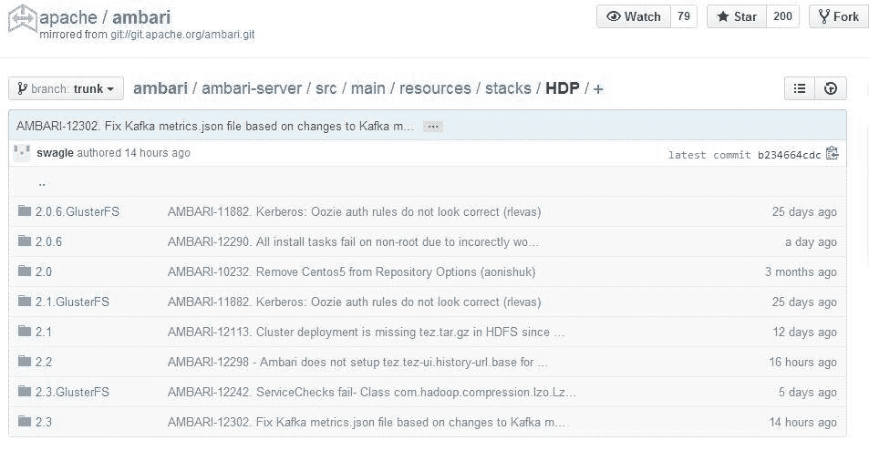
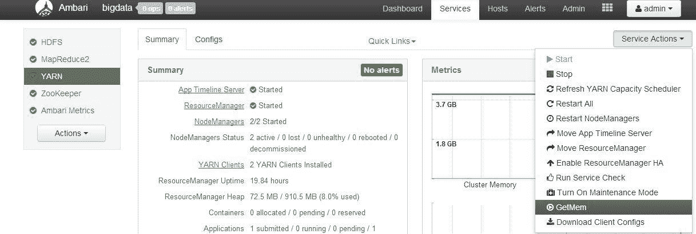
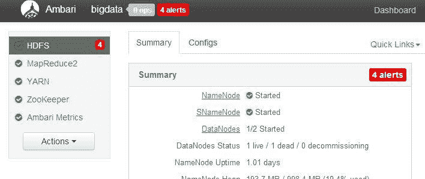
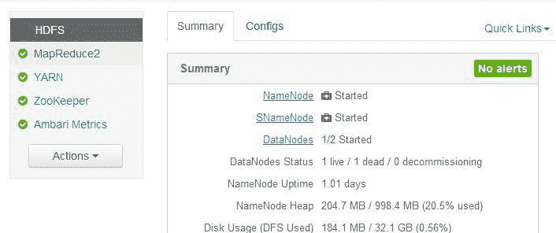

# Ambari——大数据平台的搭建利器之进阶篇

> 原文：[`developer.ibm.com/zh/articles/os-cn-bigdata-ambari2/`](https://developer.ibm.com/zh/articles/os-cn-bigdata-ambari2/)

## 前言

本文适合已经初步了解 Ambari 的读者。对 Ambari 的基础知识，以及 Ambari 的安装步骤还不清楚的读者，可以先阅读基础篇文章 [《Ambari——大数据平台的搭建利器》](http://www.ibm.com/developerworks/cn/opensource/os-cn-bigdata-ambari/index.html) 。

## Ambari 的现状

目前 Apache Ambari 的最高版本是 2.0.1，最高的 Stack 版本是 HDP 2.2。未来不久将会发布 Ambari 2.1 以及 HDP 2.3（本文也将以 Ambari 2.0.1 和 HDP 2.2 为例进行讲解）。其实在 Ambari trunk 的 code 中，我们已经可以看到 HDP 2.3 相关的代码。

##### 图 1\. Ambari Trunk 的 code



HDP 2.2 所支持的 Service 已经有 18 个之多，分别是 Falcon，Flume，Hbase，HDFS，Hive，Kafka，Kerberos，Knox，Oozie，Pig，Ranger，Slider，Spark，Sqoop，Stom，Tez，Yarn，Zookeeper。HDP 2.3 将会支持更多的 Service，例如 Accumulo。

## 利用 Ambari 扩展集群

利用 Ambari 搭建好的集群，可以通过 Ambari 来扩展。这里的步骤其实类似于 Add Service，只是少了选择 Master 的页面。下面是详细的描述。

**第一步** ，需要打开 Hosts 页面，然后点击左上角的 Actions，在下拉列表中选择”Add New Hosts”。

##### 图 2\. Add Host 按钮


**第二步** ，在 Add Host Wizard 需要输入新增的机器名（包含完整域名）以及 Ambari Service 机器上生成的私钥。

##### 图 3\. 选择 Agent 机器页面


**第三步** ，需要部署已安装 Service 的 Slave 模块和 Client 模块。

##### 图 4\. 选择 Slave、Client 页面


**第四步** ，选择对应的 Service 的配置。这里 Ambari 为用户已经选择了默认的配置。选择完后，便会开始安装 Ambari Agent 到新的机器，并且安装选择的模块。

当 Add Host Wizard 完成时，我们就可以从 Hosts 的页面中看到新的机器，以及安装的模块（Component）。

##### 图 5\. 成功添加 Host 后页面


## Ambari 的自定义命令（Custom Command）

在 Ambari 的 Stack 中，每个 Service 都会有 start、stop、status、configure 这样的命令，我们称之为生命周期的控制命令（lifecycle command）。Service 的每个模块（Component）都必须实现这几个命令的逻辑。为了让用户可以更好地控制每个 Service 以及每个模块，Ambari 支持了自定义命令（Custom Command）。不过目前只能支持到模块级别（Component Level），Service Level 的还不支持。

具体的自定义命令配置在每个 Service 的 metainfo.xml 中。不过不同的模块类型，呈现在 GUI 的方式是有差异的。当给一个 Service 的 Master 模块增加一个自定义命令时，该命令会显示在该 Service 的 Service Action List。如果点击这个命令，Ambari Server 就会通知 Master 所在机器的 Agent，Agent 就会执行该自定义命令的逻辑。当增加一个自定义命令给 Slave 或 Client 类型的 Component（模块），该命令则会呈现在机器的 Component 页面。在哪个机器的 Component 页面点击该命令，Ambari Server 就会通知该机器 Agent 调用这个自定义的命令接口。

### Master Component 的自定义命令

这里我以 YARN 为例，给 Resource Manger 模块（Master）增加一个自定义命令。首先假设一个需求，例如，要在 YARN 的 Service Action 里面加一个命令来检查 Resource Manger 所在机器的内存空间还有多大。

**第一步** ，需要找到 Yarn 的 metainfo.xml，并在 Resource Manager 的 Component 配置中增加一个自定义命令。Component 段的示例代码如下（metainfo.xml），其中 GetMem 这个命令就是我们新增的自定义命令。

```
<component>
 <name>RESOURCEMANAGER</name>
 <displayName>ResourceManager</displayName>
 <category>MASTER</category>
 <cardinality>1</cardinality>
 <versionAdvertised>true</versionAdvertised>
 <commandScript>
 <script>scripts/resourcemanager.py</script>
 <scriptType>PYTHON</scriptType>
 <timeout>1200</timeout>
 </commandScript>
 <customCommands>
 <customCommand>
 <name>DECOMMISSION</name>
 <commandScript>
 <script>scripts/resourcemanager.py</script>
 <scriptType>PYTHON</scriptType>
 <timeout>600</timeout>
 </commandScript>
 </customCommand>
 <customCommand>
 <name>REFRESHQUEUES</name>
 <commandScript>
 <script>scripts/resourcemanager.py</script>
 <scriptType>PYTHON</scriptType>
 <timeout>600</timeout>
 </commandScript>
 </customCommand>
 <!--新增部分 -->
 <customCommand>
 <name>GetMem</name>
 <commandScript>
 <script>scripts/resourcemanager.py</script>
 <scriptType>PYTHON</scriptType>
 <timeout>600</timeout>
 </commandScript>
 </customCommand>
 </customCommands>
 <configuration-dependencies>
 <config-type>capacity-scheduler</config-type>
 </configuration-dependencies>
 </component> 
```

**第二步**，实现自定义命令的逻辑。这里 CustomComand 的 xml 段已经指定了具体的脚本（resourcemanager.py），所以需要在这个脚本中增加该命令的接口，而且函数名必须是小写且与配置的中的 name 保持一致。接下来，我们需要先找到 Ambari Server 上的 resourcemanager.py 文件。找到之后，在 resourcemanager.py 增加如下的示例代码（python 脚本中注意代码的对齐方式，否则会出现语法错误。可以参考 resourcemanager.py 中的 decommission 函数）：

```
def getmem(self, env):
 import os
 print 'Execute this coustom command to get mem info on this host'
 os.system("free") 
```

**第三步**，重启 Ambari Server 以及 Resource Manger 所在机器的 Ambari Agent。这一步为了加载新的配置，并且同步我们修改的脚本到 Agent 机器。因为在每个 Agent 的机器上，都有一个 cache 目录，用来存放从 Server 端下载的配置及脚本。当重启 Agent 时候，Agent 便会尝试从 Server 端下载最新的配置和脚本。重启命令如下：

```
ambari-server restart
ambari-agent restart 
```

**第四步**，登录 Ambari 的 WEB GUI，并检查 Yarn 的 Service Actions。这时候我们已经可以看到这个 GetMem 的命令了。由于 CustomComand 的 xml 段不支持 DisplayName 标签，所以我们没法通过配置更改这个名字。如果需求要更改这个名字，则不得不更改 GUI 的 JS 代码。

##### 图 6\. 自定义命令 GetMem 页面



第五步，如果 GetMem 可以显示，就可以点击并执行该命令了。执行结果如下图显示。

##### 图 7\. 自定义命令 GetMem 执行进度页面


### Slave/Client Component 的自定义命令

本质上讲，为 Slave、Client 类型的 Component 增加自定义命令，与 Master 类型是没有什么区别的。唯一的区别就是在 GUI 上呈现的位置不一样。因此这里给一个简单的示例，不再赘述具体的步骤。

这里我为 Yarn 的 NodeManager 增加了一个自定义命令 “iostat”，用来查看 NodeManager 所在机器的 IO 状况。在 Yarn 的 metainfo.xml 中，为 NodeManager 新增如下的配置。

```
<component>
 <name>NODEMANAGER</name>
 <displayName>NodeManager</displayName>
 <category>SLAVE</category>
 <cardinality>1+</cardinality>
 <versionAdvertised>true</versionAdvertised>
 <commandScript>
 <script>scripts/nodemanager.py</script>
 <scriptType>PYTHON</scriptType>
 <timeout>1200</timeout>
 </commandScript>
 <!--新增部分 -->
 <customCommands>
 <customCommand>
 <name>iostat</name>
 <commandScript>
 <script>scripts/nodemanager.py</script>
 <scriptType>PYTHON</scriptType>
 <timeout>600</timeout>
 </commandScript>
 </customCommand>
 </customCommands>
 </component> 
```

在 nodemanager.py 中增加如下的示例代码

```
nodemanager.py 中新增代码段
def iostat(self, env):
 import os
 os.system("iostat") 
```

配置完成后，重启 Ambari Server 以及 NodeManager 所在的 Agent 的机器。当重新登录 Ambari GUI 的时候，就可以在 NodeManger 所在机器的 Component 页面看到这个命令。如下图：

##### 图 8\. Component 页面


到这里，我们就成功的为 YARN 的 Master 和 Slave 模块分别增加了一个自定义命令。现实的生产环境中，可以通过自定义命令扩展 Ambari 现在的控制功能，可以让 Ambari 更好的与 Hadoop 等软件切合。如果需要更深入应用自定义命令，以及增强 GUI 上面的显示功能，则可能需要向社区贡献 patch。这样可以更好的提升用户体验等。

## Ambari 中 Service 之间的依赖关系

在 Hadoop 的生态圈中，一个完整的解决方案往往是需要几个 framework 共同的协作才能完成的。所以 Ambari 必须支持定义 Service 之间、Component 之间的依赖关系，以及 Component 状态和 Action 之间的依赖关系。

对于 Service 和 Component 之间的依赖关系，可以在 metainfo.xml 中定义。例如打开 YARN 的 metainfo.xml，就可以看到在 YARN 的 Service 段，有一个 requiredService 的字段。每个 Service 段底下，可以用这个字段来定义一个 Service 依赖哪些其他的 Service。YARN 所示配置如下，代表 YARN 需要 HDFS。

```
<requiredServices>
 <service>HDFS</service>
 </requiredServices> 
```

对于 Component 来说，也有一个字段 dependencies。在这个字段定义了 Component 的依赖关系。我以 HBASE 的 HBASE_MASTER 配置为例。可以从示例代码中看到，HBASE_MASTER 需要 HDFS 的 HDFS_CLIENT，以及 ZOOKEEPER 的 ZOOKEEPER_SERVER。

```
<component>
 <name>HBASE_MASTER</name>
 <displayName>HBase Master</displayName>
 <category>MASTER</category>
 <cardinality>1+</cardinality>
 <versionAdvertised>true</versionAdvertised>
 <dependencies>
 <dependency>
 <name>HDFS/HDFS_CLIENT</name>
 <scope>host</scope>
 <auto-deploy>
 <enabled>true</enabled>
 </auto-deploy>
 </dependency>
 <dependency>
 <name>ZOOKEEPER/ZOOKEEPER_SERVER</name>
 <scope>cluster</scope>
 <auto-deploy>
 <enabled>true</enabled>
 <co-locate>HBASE/HBASE_MASTER</co-locate>
 </auto-deploy>
 </dependency>
 </dependencies>
 </component> 
```

对于 Service 和 Component 的依赖，还是比较容易发现和理解的。但是对于 Component 状态以及 Action 之间的依赖关系，就比较难理解了。Ambari 的 Service 目录中，存在很多个叫做 role_command_order.json 的文件。在这个文件中定义了状态之间以及 Action 的依赖。在 resource 目录下的 role_command_order.json 定义着全局的的依赖。每个 Stack 目录下也会存在 role_command_order.json。相同的配置，Stack 下面的会覆盖全局的（overwrite）。对于不同的配置，Ambari 会拼接在一起（merge）。高版本的 Stack 会继承低版本的配置。相同的也会 overwrite，不同的也会 merge。

## Ambari 的维护模式（Maintenance Mode）介绍

Ambari 提供的 Maintenance Mode，是为了让用户在调试或者维护 Service 的时候，抑制不必要的告警（Alert）信息，以及避免批量操作的影响。对 Maintenance Mode 来说，有几个不同级别的设置，分别是 Service Level，Host Level，以及 Component Level。三种级别之间存在着覆盖关系。下面我会举几个例子来详细说明 Maintenance Mode 的应用场景。另外注意，在 Ambari 的 WEB GUI 上面会用一个照相机的图标，标记打开 Maintenance Mode 的模块、机器或者 Service。

### Component Level（模块级别）

在 Component 页面里，如果用户对某一个 Component（模块）打开了维护模式，对该模块会有两种影响。其一，对于该机器的该模块不再受批量操作的控制；其二，抑制该机器该模块告警信息的产生。

例如，对机器 zwshen86 的 DataNode 模块打开维护模式，那么当用户从 Host Action 中关闭所有 DataNode 的时候，该机器的 DataNode 就不会被关闭。这是因为关闭 DataNode 的批量操作会直接越过 zwshen86。图 10 中可以看到 zwshen86 不在执行的序列。并且 zwshen86 的 DataNode 不会产生任何新的告警。

##### 图 9\. 确认批量操作页面


##### 图 10\. 关闭 DataNode 进度页面


### Host Level（机器级别）

对 Host 级别的维护模式来说，就是打开了该机器所有模块的维护模式。操作起来也很简单，在 Hosts 页面中勾选完机器，然后在 Host Actions 里面选择 “Turn On Maintenance Mode” 即可。如果该机器已经有告警信息，当 Maintenance Mode 打开后，告警信息会被屏蔽，并且抑制新告警信息的产生。所有的批量操作都会越过该机器。

##### 图 11\. Host 打开 Maintenance Mode 之前


##### 图 12\. Host 打开 Maintenance Mode 之后


### Service Level（服务级别）

对 Service 级别的维护模式来说，就是打开一个 Service 所有 Component 的维护模式。由于 Service 可能部署在多台机器，也就相当于用户在多个机器打开 Service Component 的维护模式。这样一来，这个 Service 就不会产生任何新的告警。当用户重启集群所有 Service 的时候，该 Service 会越过这个批量操作。当用户重启一个机器的所有 Component 的时候，该 Service 的 Component 也会被越过。下图是对 HDFS 打开维护模式的示例。

##### 图 13\. Service 打开 Maintenance Mode 之前



##### 图 14\. Service 打开 Maintenance Mode 之后



## Ambari 应用举例（快速搭建 Spark on YARN 的集群）

HDP2.2 的 Stack 已经支持了 Spark。但是 metainfo 中的版本还是 1.2.1，这个版本已经很老了（Spark1.4.0 已经发布）。目前安装的 Ambari 2.0.1 和 HDP 2.2 的 Stack，很多时候也无法正常的安装 Spark。原因在于 HDP 的 repository 文件无法找到 Spark 的安装包。用户可以在搭建好的 Ambari 环境中，登录到任一个 Agent 机器，执行如下的命令。

```
yum list | grep spark 
```

如果看不到 Spark 的 rpm 包，就代表无法正常的通过 Ambari 建立 Spark 集群。用户可以到 HortonWorks 的 repository 服务器上下载最新 HDP 2.2 的更新 repo 文件。我的下载的 repo 内容如下：

# `VERSION_NUMBER=2.2.4.4-16`

```
[HDP-2.2.4.4]
name=HDP Version - HDP-2.2.4.4
baseurl=http://public-repo-1.hortonworks.com/HDP/centos6/2.x/updates/2.2.4.4
gpgcheck=1
gpgkey=http://public-repo-1.hortonworks.com/HDP/centos6/2.x/updates/2.2.4.4/
                                          RPM-GPG-KEY/RPM-GPG-KEY-Jenkins
enabled=1
priority=1

[HDP-UTILS-1.1.0.20]
name=HDP Utils Version - HDP-UTILS-1.1.0.20
baseurl=http://public-repo-1.hortonworks.com/HDP-UTILS-1.1.0.20/repos/centos6
gpgcheck=1
gpgkey=http://public-repo-1.hortonworks.com/HDP/centos6/2.x/updates/2.2.4.4/
                                        RPM-GPG-KEY/RPM-GPG-KEY-Jenkins
enabled=1
priority=1 
```

将上面的内容拷贝到 Agent 机器的 HDP_up.repo 中，并放入文件夹/etc/yum.repos.d（不能复制到已有 HDP.repo 中，否则会被覆盖掉），就可以通过 yum list 看到 Spark 的 rpm 包了。在 Github 中，我们可以发现 HDP2.3 已经配置 Spark 的版本为 1.3.1 了。

##### 图 15\. HDP2.3 已经配置 Spark 的 1.3.1 版本


了解了以上的背景知识，就可以开始在 Ambari 上增加 Spark 这个 Service 了（这里只简单说明，具体的 Add Service 步骤，可以阅读 [《Ambari——大数据平台的搭建利器》](http://www.ibm.com/developerworks/cn/opensource/os-cn-bigdata-ambari/index.html) ）。

如果之前了解过 Spark，就会发现 Ambari 部署的 Spark 集群的模式是 Spark on YARN。这也是为什么在 Add Spark 的时候，Ambari 会提示要选择依赖的 YARN。下图是 Ambari、YARN 与 Spark 的层级结构。

##### 图 16\. Ambari&YARN&park 结构示意图


搭建好 Spark 之后，我们就可以在 Ambari 的 Dashboard 看到 Spark 的 Service。

## Ambari 常用的 REST API 介绍

Ambari 借鉴了很多成熟分布式软件的 API 设计。Rest API 就是一个很好地体现。通过 Ambari 的 Rest API，可以在脚本中通过 curl 维护整个集群。并且，我们可以用 Rest API 实现一些无法在 Ambari GUI 上面做的操作。下面是一些实例。

### 实例 1，通过 API 卸载已安装的 Service

目前 Ambari 不支持在 GUI 上面卸载已安装的 Service。所以当一个 Service 不再需要的时候，用户没法删除掉该 Service。幸运的是 Ambari 提供了 DELETE 的 Rest API，我们可以通过该 API 来删除 Ambari 中 Service。不过这里需要注意，这个方法只是从 Ambari Service 中删除了 Service。这样一来，Ambari 的 GUI 界面中不再显示这个 Service。但是 Service 本身还安装在 Agent 所在的机器。如果用户需要彻底的清除掉这个 Service，仍需要手工的到每个机器卸载（例如，在每个机器执行 yum erase）。

这里我以删除 Storm 为例。卸载之前，需要确认是否停掉了该 Service。我们通过 GET 方法来得到这个结果（这里当然也可以直接从 GUI 上面看到 Service 状态）。具体的命令如下：

```
curl -u admin:admin -H "X-Requested-By: ambari" -X GET
   http://zwshen86:8080/api/v1/clusters/bigdata/services/STORM 
```

命令中的 zwshen86 为 Ambari Server 的机器名（端口默认为 8080），bigdata 为 cluster 名字，STORM 为 Service 的名字。

在返回的报文中，可以看到 State 字段。如果是 INSTALLED，代表这个 Service 已经是停掉的状态。我们可以继续删除步骤。如果不是 INSTALLED，则需要先停掉这个 Service，可以从 WEB 上操作，也可以用 Rest API。

##### 图 17\. Get 返回的结果


用 Rest API 停掉 Service 的命令格式如下，有兴趣的朋友可以尝试一下。

```
curl -u admin:admin -H "X-Requested-By: ambari" -X PUT -d'{"RequestInfo":
        {"context":"Stop Service"},"Body":{"ServiceInfo":{"state":"INSTALLED"}}}'
        http://AMBARI_SERVER_HOST:8080/api/v1/clusters/c1/services/SERVICE_NAME 
```

执行如下命令删除 STORM：

```
curl -u admin:admin -H "X-Requested-By: ambari" -X
DELETE http://zwshen86:8080/api/v1/clusters/bigdata/services/STORM 
```

执行完成后，Storm 就从 Ambari 的 Service 里面删掉了，但是 Storm 的 package 还存在于机器。

##### 图 18\. Storm 的 RPM 包


如果需要彻底清除掉 Storm 的 package，则需要到各个 Agent 机器执行如下命令。

```
yum erase"storm_2_2*” 
```

执行完后，这个 Service 就被彻底的清除掉了。

### 实例 2，获取 Service 的 Component 和 Host 列表

上个实例中，让用户登录到每个机器去执行 yum 卸载安装包，其实是不太现实的。一般我们会写一个脚本先通过 curl 调用 GET 方法，先获取到 Service 的 Component 列表，然后再调用 GET 方法，获取 Component 的机器列表，接着调用 DELETE 从 Ambari 中删除 Service。最后脚本通过 SSH 登录到各个 Agent 机器上执行 yum 卸载安装包。脚本示例代码如下（该脚本只能在 Ambari Server 上执行，因为 Ambari Server 有无密码登录所有 Agent 机器的权限）。

```
#!/bin/sh
GetHostList()
{
 curl -u admin:admin -H "X-Requested-By: ambari" -X GET
 http://$AMBARI_HOST:8080/api/v1/clusters/$CLUSTER/services/$SERVICE/components/$1
 2>/dev/null |grep host_name|awk -F: '{print $2}'|sed 's/"//g' >> temp_host_list
}

GetServiceComponent()
{
 curl -u admin:admin -H "X-Requested-By: ambari" -X GET
 http://$AMBARI_HOST:8080/api/v1/clusters/$CLUSTER/services/$SERVICE
 2>/dev/null | grep "component_name" > ./temp_component_list
 sed -i 's/"//g' ./temp_component_list
 sed -i 's/,//g' ./temp_component_list
}

if [ $# != 4 ]; then
 echo "Usage: $0 Ambari_Server Cluster_Name Service_Name Package_Name"
 exit 1
fi

AMBARI_HOST=$1
CLUSTER=$2
SERVICE=$3
PACKAGE=$4

GetServiceComponent

cat ./temp_component_list|while read line
do
 COMPONENT=`echo $line|awk -F: '{print $2}'`
 GetHostList $COMPONENT
done

curl -u admin:admin -H "X-Requested-By: ambari" -X DELETE
http://$AMBARI_HOST:8080/api/v1/clusters/$CLUSTER/services/$SERVICE

rm -f ./temp_component_list >/dev/null 2>&1
#delete duplicated lines (duplicated host name)

hosts=`cat temp_host_list|sort |uniq`
for host in $hosts
do
 ssh $host "yum erase $PACKAGE"
done

rm -f temp_host_list >/dev/null 2>&1 
```

### 实例 3，通过 API 执行 Service 的命令

这里，我们以调用 API 执行 Service Check 为例。首先需要知道命令的名字，这里每个 Service 的 Check 命令也是不同的。不过 Service Check 是 build-in 的命令，所以有一定的格式可循。

格式大致如下：

```
NAME_SERVICE_CHCECK 
```

只要将 NAME 替换成对应的 Service，就是该 Service 的 Check 命令。以 YARN 为例，执行如下的命令。

```
curl -u admin:admin -H "X-Requested-By: ambari" -X POST -d '
   {"RequestInfo":{"context":"My YARN Service Check", "command":
   "YARN_SERVICE_CHECK"},"Requests/resource_filters":[{"service_name":"YARN"}]}'
   http://zwshen86:8080/api/v1/clusters/bigdata/requests 
```

执行完后，可以发现在 WEB GUI 上面，就多了一个正在进行的 Operation。如下图：

##### 图 19\. Service Check 执行进度


在这里我们可以发现，这个 Operation 的名字其实就是 context 字段的值。我们在 WEB GUI 上面直接点击 Service Check 的时候，Operation 的名字其实是 JS code 中指定了一个特殊 context。

这里我们也可以指定执行自定义命令（Custom Comand）。以给 Resource Manager 添加的 GetMem 为例。执行如下的命令。

```
curl -u admin:admin -H "X-Requested-By: ambari" -X POST -d '
   {"RequestInfo":{"context":"Get RM host Mem
Usage","command":"GetMem"},"Requests/resource_filters":[{"service_name":
   "YARN","component_name":"RESOURCEMANAGER","hosts":"zwshen86.eng.platformlab.ibm.com"}]}'
   http://zwshen86:8080/api/v1/clusters/bigdata/requests 
```

WEB GUI 的显示如下

##### 图 20\. 自定义命令 GetMem 的执行进度


跟 Service Check 相比，不难看出其中的差异。对于自定义命令，我们需要指定参数 Component 以及 Host。当这两个参数缺失的时候，Ambari 是不会接受这个请求的。

通过这三个简单实例，就可以体会到 Ambari Rest API 的作用。在 Rest API 的基础上，就算脱离了 WEB，我们也可以很好地控制 Ambari。当然，我们也不得不记住很多生涩的参数。因此，大多情况下，只有当 Ambari 的 GUI 不足以完成需求，或者不期望暴露在 GUI 上面的时候，就可以使用 Rest API。有兴趣的读者可以搜索下 Ambari Server 目录所有的 Python 脚本，其实 Ambari 自身很多地方都在用 curl 调用 Rest API。

## Ambari 的发展

我们可以到 Ambari 的 Roadmap 页面查看 Ambari 最新 release 的进展，以及未来 Ambari 将会开发怎样的功能。例如现在的 Ambari Server 是存在单点问题的，如果 Server 机器宕机了，就无法恢复整个 Ambari Server 的数据，也就是说无法再通过 Ambari 管理集群。我们可以从 Ambari 的 Roadmap 中看到，Ambari 未来会在 2.2 的 release 中考虑这个问题。

## 结束语

Ambari 作为一个 Hadoop 生态圈的管理工具，起步比 Hadoop 等软件晚一些。应用中免不了也会碰到一些奇怪的问题，所以未来 Ambari 的发展也离不开社区的贡献，更离不开每一位 Committer。希望 Ambari 能在 Hadoop 的管理中脱颖而出，成为一个完美的管理平台。