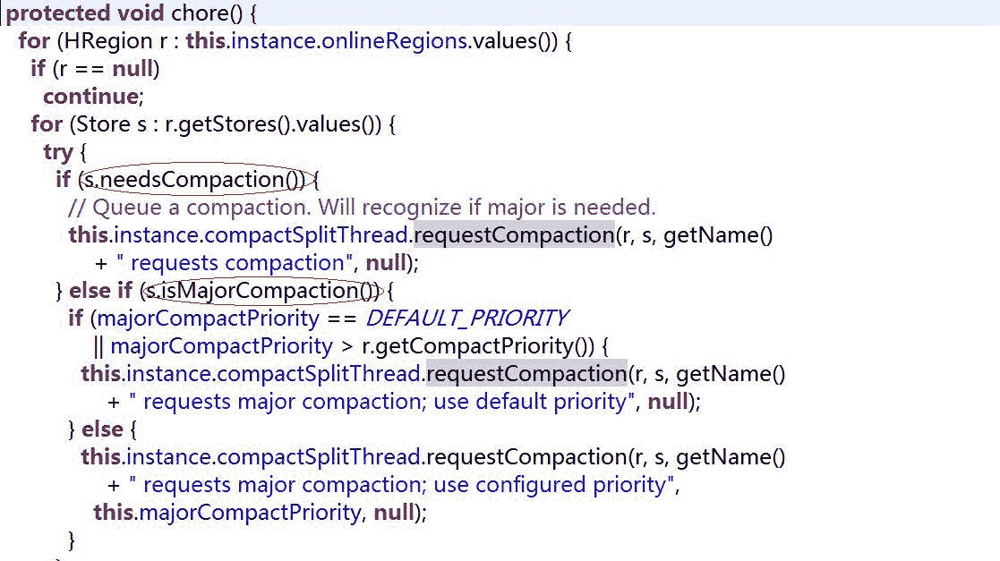
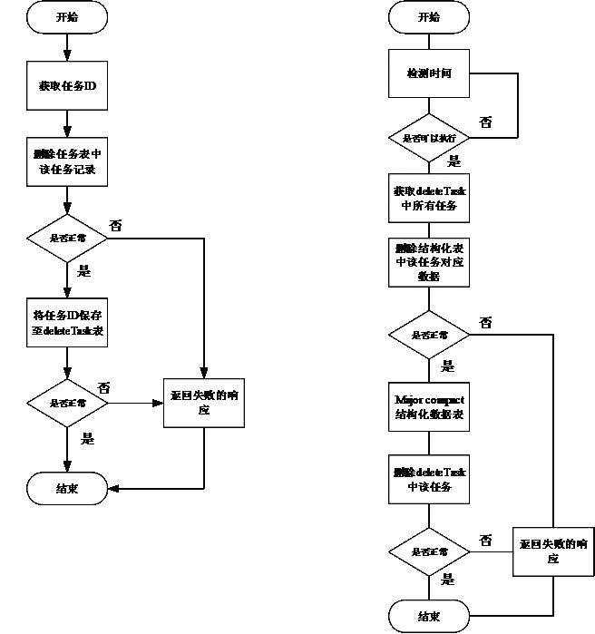

# HBase 数据库检索性能优化策略

> 原文：[`developer.ibm.com/zh/articles/j-lo-hbase/`](https://developer.ibm.com/zh/articles/j-lo-hbase/)

## HBase 数据表介绍

HBase 数据库是一个基于分布式的、面向列的、主要用于非结构化数据存储用途的开源数据库。其设计思路来源于 Google 的非开源数据库 “BigTable”。

HDFS 为 HBase 提供底层存储支持，MapReduce 为其提供计算能力，ZooKeeper 为其提供协调服务和 failover（失效转移的备份操作）机制。Pig 和 Hive 为 HBase 提供了高层语言支持，使其可以进行数据统计（可实现多表 join 等），Sqoop 则为其提供 RDBMS 数据导入功能。

HBase 不能支持 where 条件、Order by 查询，只支持按照主键 Rowkey 和主键的 range 来查询，但是可以通过 HBase 提供的 API 进行条件过滤。

HBase 的 Rowkey 是数据行的唯一标识，必须通过它进行数据行访问，目前有三种方式，单行键访问、行键范围访问、全表扫描访问。数据按行键的方式排序存储，依次按位比较，数值较大的排列在后，例如 int 方式的排序：1，10，100，11，12，2，20…，906，…。

ColumnFamily 是 “列族”，属于 schema 表，在建表时定义，每个列属于一个列族，列名用列族作为前缀 “ColumnFamily：qualifier”，访问控制、磁盘和内存的使用统计都是在列族层面进行的。

Cell 是通过行和列确定的一个存储单元，值以字节码存储，没有类型。

Timestamp 是区分不同版本 Cell 的索引，64 位整型。不同版本的数据按照时间戳倒序排列，最新的数据版本排在最前面。

Hbase 在行方向上水平划分成 N 个 Region，每个表一开始只有一个 Region，数据量增多，Region 自动分裂为两个，不同 Region 分布在不同 Server 上，但同一个不会拆分到不同 Server。

Region 按 ColumnFamily 划分成 Store，Store 为最小存储单元，用于保存一个列族的数据，每个 Store 包括内存中的 memstore 和持久化到 disk 上的 HFile。

图 1 是 HBase 数据表的示例，数据分布在多台节点机器上面。

##### 图 1\. HBase 数据表示例


## HBase 调用 API 示例

类似于操作关系型数据库的 JDBC 库，HBase client 包本身提供了大量可以供操作的 API，帮助用户快速操作 HBase 数据库。提供了诸如创建数据表、删除数据表、增加字段、存入数据、读取数据等等接口。清单 1 提供了一个作者封装的工具类，包括操作数据表、读取数据、存入数据、导出数据等方法。

##### 清单 1.HBase API 操作工具类代码

```
import org.apache.hadoop.conf.Configuration;
import org.apache.hadoop.hbase.HColumnDescriptor;
import org.apache.hadoop.hbase.HTableDescriptor;
import org.apache.hadoop.hbase.KeyValue;
import org.apache.hadoop.hbase.client.Get;
import org.apache.hadoop.hbase.client.HBaseAdmin;
import org.apache.hadoop.hbase.client.HTable;
import org.apache.hadoop.hbase.client.Put;
import org.apache.hadoop.hbase.client.Result;
import org.apache.hadoop.hbase.client.ResultScanner;
import org.apache.hadoop.hbase.client.Scan;
import org.apache.hadoop.hbase.util.Bytes;

import java.io.IOException;
import java.util.ArrayList;
import java.util.List;

public class HBaseUtil {
private Configuration conf = null;
private HBaseAdmin admin = null;

protected HBaseUtil(Configuration conf) throws IOException {
 this.conf = conf;
 this.admin = new HBaseAdmin(conf);
}

public boolean existsTable(String table)
 throws IOException {
 return admin.tableExists(table);
}

public void createTable(String table, byte[][] splitKeys, String... colfams)
 throws IOException {
HTableDescriptor desc = new HTableDescriptor(table);
for (String cf : colfams) {
HColumnDescriptor coldef = new HColumnDescriptor(cf);
desc.addFamily(coldef);
 }
if (splitKeys != null) {
admin.createTable(desc, splitKeys);
} else {
admin.createTable(desc);
 }
}

public void disableTable(String table) throws IOException {
admin.disableTable(table);
}

public void dropTable(String table) throws IOException {
 if (existsTable(table)) {
 disableTable(table);
 admin.deleteTable(table);
 }
}

public void fillTable(String table, int startRow, int endRow, int numCols,
 int pad, boolean setTimestamp, boolean random,
 String... colfams) throws IOException {
 HTable tbl = new HTable(conf, table);
 for (int row = startRow; row <= endRow; row++) {
 for (int col = 0; col < numCols; col++) {
 Put put = new Put(Bytes.toBytes("row-"));
 for (String cf : colfams) {
 String colName = "col-";
 String val = "val-";
 if (setTimestamp) {
 put.add(Bytes.toBytes(cf), Bytes.toBytes(colName),
 col, Bytes.toBytes(val));
 } else {
 put.add(Bytes.toBytes(cf), Bytes.toBytes(colName),
 Bytes.toBytes(val));
 }
 }
 tbl.put(put);
 }
 }
 tbl.close();
 }

public void put(String table, String row, String fam, String qual,
 String val) throws IOException {
 HTable tbl = new HTable(conf, table);
 Put put = new Put(Bytes.toBytes(row));
 put.add(Bytes.toBytes(fam), Bytes.toBytes(qual), Bytes.toBytes(val));
 tbl.put(put);
 tbl.close();
 }

 public void put(String table, String row, String fam, String qual, long ts,
 String val) throws IOException {
 HTable tbl = new HTable(conf, table);
 Put put = new Put(Bytes.toBytes(row));
 put.add(Bytes.toBytes(fam), Bytes.toBytes(qual), ts, Bytes.toBytes(val));
 tbl.put(put);
 tbl.close();
 }

 public void put(String table, String[] rows, String[] fams, String[] quals,
 long[] ts, String[] vals) throws IOException {
 HTable tbl = new HTable(conf, table);
 for (String row : rows) {
 Put put = new Put(Bytes.toBytes(row));
 for (String fam : fams) {
 int v = 0;
 for (String qual : quals) {
 String val = vals[v < vals.length ? v : vals.length];
 long t = ts[v < ts.length ? v : ts.length - 1];
 put.add(Bytes.toBytes(fam), Bytes.toBytes(qual), t,
 Bytes.toBytes(val));
 v++;
 }
 }
 tbl.put(put);
 }
 tbl.close();
 }

 public void dump(String table, String[] rows, String[] fams, String[] quals)
 throws IOException {
 HTable tbl = new HTable(conf, table);
 List<Get> gets = new ArrayList<Get>();
 for (String row : rows) {
 Get get = new Get(Bytes.toBytes(row));
 get.setMaxVersions();
 if (fams != null) {
 for (String fam : fams) {
 for (String qual : quals) {
 get.addColumn(Bytes.toBytes(fam), Bytes.toBytes(qual));
 }
 }
 }
 gets.add(get);
 }
 Result[] results = tbl.get(gets);
 for (Result result : results) {
 for (KeyValue kv : result.raw()) {
 System.out.println("KV: " + kv +
 ", Value: " + Bytes.toString(kv.getValue()));
 }
 }
 }

 private static void scan(int caching, int batch) throws IOException {
 HTable table = null;
 final int[] counters = {0, 0};

 Scan scan = new Scan();
 scan.setCaching(caching); // co ScanCacheBatchExample-1-Set Set caching and batch parameters.
 scan.setBatch(batch);
 ResultScanner scanner = table.getScanner(scan);
 for (Result result : scanner) {
 counters[1]++; // co ScanCacheBatchExample-2-Count Count the number of Results available.
 }
 scanner.close();
 System.out.println("Caching: " + caching + ", Batch: " + batch +
 ", Results: " + counters[1] + ", RPCs: " + counters[0]);
 }
} 
```

操作表的 API 都有 HBaseAdmin 提供，特别讲解一下 Scan 的操作部署。

HBase 的表数据分为多个层次,HRegion->HStore->[HFile,HFile,…,MemStore]。

在 HBase 中，一张表可以有多个 Column Family，在一次 Scan 的流程中，每个 Column Family(Store) 的数据读取由一个 StoreScanner 对象负责。每个 Store 的数据由一个内存中的 MemStore 和磁盘上的 HFile 文件组成，对应的 StoreScanner 对象使用一个 MemStoreScanner 和 N 个 StoreFileScanner 来进行实际的数据读取。

因此，读取一行的数据需要以下步骤：

1.  按照顺序读取出每个 Store

2.  对于每个 Store，合并 Store 下面的相关的 HFile 和内存中的 MemStore

这两步都是通过堆来完成。RegionScanner 的读取通过下面的多个 StoreScanner 组成的堆完成，使用 RegionScanner 的成员变量 KeyValueHeap storeHeap 表示。一个 StoreScanner 一个堆，堆中的元素就是底下包含的 HFile 和 MemStore 对应的 StoreFileScanner 和 MemStoreScanner。堆的优势是建堆效率高，可以动态分配内存大小，不必事先确定生存周期。

接着调用 seekScanners() 对这些 StoreFileScanner 和 MemStoreScanner 分别进行 seek。seek 是针对 KeyValue 的，seek 的语义是 seek 到指定 KeyValue，如果指定 KeyValue 不存在，则 seek 到指定 KeyValue 的下一个。

### Scan 类常用方法说明 ：

scan.addFamily()/scan.addColumn()：指定需要的 Family 或 Column，如果没有调用任何 addFamily 或 Column，会返回所有的 Columns；

scan.setMaxVersions()：指定最大的版本个数。如果不带任何参数调用 setMaxVersions，表示取所有的版本。如果不掉用 setMaxVersions，只会取到最新的版本；

scan.setTimeRange()：指定最大的时间戳和最小的时间戳，只有在此范围内的 Cell 才能被获取；

scan.setTimeStamp()：指定时间戳；

scan.setFilter()：指定 Filter 来过滤掉不需要的信息；

scan.setStartRow()：指定开始的行。如果不调用，则从表头开始；

scan.setStopRow()：指定结束的行（不含此行）；

scan. setCaching()：每次从服务器端读取的行数（影响 RPC）；

scan.setBatch()：指定最多返回的 Cell 数目。用于防止一行中有过多的数据，导致 OutofMemory 错误，默认无限制。

## HBase 数据表优化

HBase 是一个高可靠性、高性能、面向列、可伸缩的分布式数据库，但是当并发量过高或者已有数据量很大时，读写性能会下降。我们可以采用如下方式逐步提升 HBase 的检索速度。

### 预先分区

默认情况下，在创建 HBase 表的时候会自动创建一个 Region 分区，当导入数据的时候，所有的 HBase 客户端都向这一个 Region 写数据，直到这个 Region 足够大了才进行切分。一种可以加快批量写入速度的方法是通过预先创建一些空的 Regions，这样当数据写入 HBase 时，会按照 Region 分区情况，在集群内做数据的负载均衡。

### R owkey 优化

HBase 中 Rowkey 是按照字典序存储，因此，设计 Rowkey 时，要充分利用排序特点，将经常一起读取的数据存储到一块，将最近可能会被访问的数据放在一块。

此外，Rowkey 若是递增的生成，建议不要使用正序直接写入 Rowkey，而是采用 reverse 的方式反转 Rowkey，使得 Rowkey 大致均衡分布，这样设计有个好处是能将 RegionServer 的负载均衡，否则容易产生所有新数据都在一个 RegionServer 上堆积的现象，这一点还可以结合 table 的预切分一起设计。

### 减少 C olumnFamily 数量

不要在一张表里定义太多的 ColumnFamily。目前 Hbase 并不能很好的处理超过 2~3 个 ColumnFamily 的表。因为某个 ColumnFamily 在 flush 的时候，它邻近的 ColumnFamily 也会因关联效应被触发 flush，最终导致系统产生更多的 I/O。

### 缓存策略 (setCaching

创建表的时候，可以通过 HColumnDescriptor.setInMemory(true) 将表放到 RegionServer 的缓存中，保证在读取的时候被 cache 命中。

### 设置存储生命期

创建表的时候，可以通过 HColumnDescriptor.setTimeToLive(int timeToLive) 设置表中数据的存储生命期，过期数据将自动被删除。

### 硬盘配置

每台 RegionServer 管理 10~1000 个 Regions，每个 Region 在 1~2G，则每台 Server 最少要 10G，最大要 1000*2G=2TB，考虑 3 备份，则要 6TB。方案一是用 3 块 2TB 硬盘，二是用 12 块 500G 硬盘，带宽足够时，后者能提供更大的吞吐率，更细粒度的冗余备份，更快速的单盘故障恢复。

### 分配合适的内存给 RegionServer 服务

在不影响其他服务的情况下，越大越好。例如在 HBase 的 conf 目录下的 hbase-env.sh 的最后添加 export HBASE_REGIONSERVER_OPTS=”-Xmx16000m $HBASE_REGIONSERVER_OPTS”

其中 16000m 为分配给 RegionServer 的内存大小。

### 写数据的备份数

备份数与读性能成正比，与写性能成反比，且备份数影响高可用性。有两种配置方式，一种是将 hdfs-site.xml 拷贝到 hbase 的 conf 目录下，然后在其中添加或修改配置项 dfs.replication 的值为要设置的备份数，这种修改对所有的 HBase 用户表都生效，另外一种方式，是改写 HBase 代码，让 HBase 支持针对列族设置备份数，在创建表时，设置列族备份数，默认为 3，此种备份数只对设置的列族生效。

### WAL（预写日志）

可设置开关，表示 HBase 在写数据前用不用先写日志，默认是打开，关掉会提高性能，但是如果系统出现故障 (负责插入的 RegionServer 挂掉)，数据可能会丢失。配置 WAL 在调用 Java API 写入时，设置 Put 实例的 WAL，调用 Put.setWriteToWAL(boolean)。

### 批量写

HBase 的 Put 支持单条插入，也支持批量插入，一般来说批量写更快，节省来回的网络开销。在客户端调用 Java API 时，先将批量的 Put 放入一个 Put 列表，然后调用 HTable 的 Put(Put 列表) 函数来批量写。

### 客户端一次从服务器拉取的数量

通过配置一次拉去的较大的数据量可以减少客户端获取数据的时间，但是它会占用客户端内存。有三个地方可进行配置：

1）在 HBase 的 conf 配置文件中进行配置 hbase.client.scanner.caching；

2）通过调用 HTable.setScannerCaching(int scannerCaching) 进行配置；

3）通过调用 Scan.setCaching(int caching) 进行配置。三者的优先级越来越高。

### RegionServer 的请求处理 IO 线程数

较少的 IO 线程适用于处理单次请求内存消耗较高的 Big Put 场景 (大容量单次 Put 或设置了较大 cache 的 Scan，均属于 Big Put) 或 ReigonServer 的内存比较紧张的场景。

较多的 IO 线程，适用于单次请求内存消耗低，TPS 要求 (每秒事务处理量 (TransactionPerSecond)) 非常高的场景。设置该值的时候，以监控内存为主要参考。

在 hbase-site.xml 配置文件中配置项为 hbase.regionserver.handler.count。

### Region 大小设置

配置项为 hbase.hregion.max.filesize，所属配置文件为 hbase-site.xml.，默认大小 256M。

在当前 ReigonServer 上单个 Reigon 的最大存储空间，单个 Region 超过该值时，这个 Region 会被自动 split 成更小的 Region。小 Region 对 split 和 compaction 友好，因为拆分 Region 或 compact 小 Region 里的 StoreFile 速度很快，内存占用低。缺点是 split 和 compaction 会很频繁，特别是数量较多的小 Region 不停地 split, compaction，会导致集群响应时间波动很大，Region 数量太多不仅给管理上带来麻烦，甚至会引发一些 Hbase 的 bug。一般 512M 以下的都算小 Region。大 Region 则不太适合经常 split 和 compaction，因为做一次 compact 和 split 会产生较长时间的停顿，对应用的读写性能冲击非常大。

此外，大 Region 意味着较大的 StoreFile，compaction 时对内存也是一个挑战。如果你的应用场景中，某个时间点的访问量较低，那么在此时做 compact 和 split，既能顺利完成 split 和 compaction，又能保证绝大多数时间平稳的读写性能。compaction 是无法避免的，split 可以从自动调整为手动。只要通过将这个参数值调大到某个很难达到的值，比如 100G，就可以间接禁用自动 split(RegionServer 不会对未到达 100G 的 Region 做 split)。再配合 RegionSplitter 这个工具，在需要 split 时，手动 split。手动 split 在灵活性和稳定性上比起自动 split 要高很多，而且管理成本增加不多，比较推荐 online 实时系统使用。内存方面，小 Region 在设置 memstore 的大小值上比较灵活，大 Region 则过大过小都不行，过大会导致 flush 时 app 的 IO wait 增高，过小则因 StoreFile 过多影响读性能。

### HBase 配置

建议 HBase 的服务器内存至少 32G，表 1 是通过实践检验得到的分配给各角色的内存建议值。

##### 表 1\. HBase 相关服务配置信息

| 模块 | 服务种类 | 内存需求 |
| --- | --- | --- |
| HDFS | HDFS NameNode | 16GB |
| HDFS DataNode | 2GB |
| HBase | HMaster | 2GB |
| HRegionServer | 16GB |
| ZooKeeper | ZooKeeper | 4GB |

HBase 的单个 Region 大小建议设置大一些，推荐 2G，RegionServer 处理少量的大 Region 比大量的小 Region 更快。对于不重要的数据，在创建表时将其放在单独的列族内，并且设置其列族备份数为 2（默认是这样既保证了双备份，又可以节约空间，提高写性能，代价是高可用性比备份数为 3 的稍差，且读性能不如默认备份数的时候。

### 实际案例

项目要求可以删除存储在 HBase 数据表中的数据，数据在 HBase 中的 Rowkey 由任务 ID(数据由任务产生) 加上 16 位随机数组成，任务信息由单独一张表维护。图 2 所示是数据删除流程图。

##### 图 2\. 数据删除流程图


最初的设计是在删除任务的同时按照任务 ID 删除该任务存储在 HBase 中的相应数据。但是 HBase 数据较多时会导致删除耗时较长，同时由于磁盘 I/O 较高，会导致数据读取、写入超时。

查看 HBase 日志发现删除数据时，HBase 在做 Major Compaction 操作。Major Compaction 操作的目的是合并文件，并清除删除、过期、多余版本的数据。Major Compaction 时 HBase 将合并 Region 中 StoreFile，该动作如果持续长时间会导致整个 Region 都不可读，最终导致所有基于这些 Region 的查询超时。

如果想要解决 Major Compaction 问题，需要查看它的源代码。通过查看 HBase 源码发现 RegionServer 在启动时候，有个 CompactionChecker 线程在定期检测是否需要做 Compact。源代码如图 3 所示。

##### 图 3\. CompactionChecker 线程代码图



isMajorCompaction 中会根据 hbase.hregion.majorcompaction 参数来判断是否做 Major Compact。如果 hbase.hregion.majorcompaction 为 0，则返回 false。修改配置文件 hbase.hregion.majorcompaction 为 0，禁止 HBase 的定期 Major Compaction 机制，通过自定义的定时机制 (在凌晨 HBase 业务不繁忙时) 执行 Major 操作，这个定时可以是通过 Linux cron 定时启动脚本，也可以通过 Java 的 timer schedule，在实际项目中使用 Quartz 来启动，启动的时间配置在配置文件中给出，可以方便的修改 Major Compact 启动的时间。通过这种修改后，我们发现在删除数据后仍会有 Compact 操作。这样流程进入 needsCompaction = true 的分支。查看 needsCompaction 判断条件为 (storefiles.size() – filesCompacting.size()) > minFilesToCompact 触发。同时当需紧缩的文件数等于 Store 的所有文件数，Minor Compact 自动升级为 Major Compact。但是 Compact 操作不能禁止，因为这样会导致数据一直存在，最终影响查询效率。

基于以上分析，我们必须重新考虑删除数据的流程。对用户来说，用户只要在检索时对于删除的任务不进行检索即可。那么只需要删除该条任务记录，对于该任务相关联的数据不需要立马进行删除。当系统空闲时候再去定时删除 HBase 数据表中的数据，并对 Region 做 Major Compact，清理已经删除的数据。通过对任务删除流程的修改，达到项目的需求，同时这种修改也不需要修改 HBase 的配置。

##### 图 4\. 数据删除流程对比图



检索、查询、删除 HBase 数据表中的数据本身存在大量的关联性，需要查看 HBase 数据表的源代码才能确定导致检索性能瓶颈的根本原因及最终解决方案。

## 结束语

HBase 数据库的使用及检索优化方式均与传统关系型数据库存在较多不同，本文从数据表的基本定义方式出发，通过 HBase 自身提供的 API 访问方式入手，举例说明优化方式及注意事项，最后通过实例来验证优化方案可行性。检索性能本身是数据表设计、程序设计、逻辑设计等的结合产物，需要程序员深入理解后才能做出正确的优化方案。