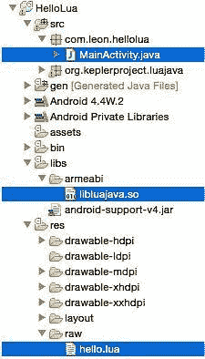
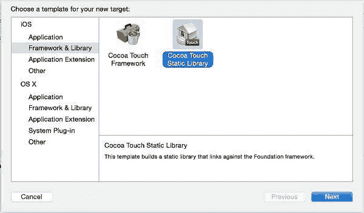
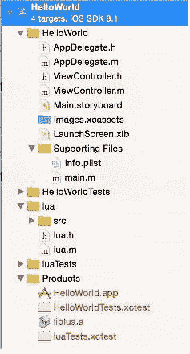
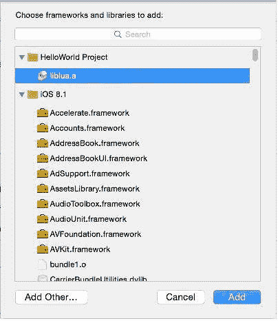

# Lua 在移动平台上的应用

> 原文：[`developer.ibm.com/zh/articles/os-cn-luascript/`](https://developer.ibm.com/zh/articles/os-cn-luascript/)

现如今，移动应用程序被应用的越来越宽泛，程序越来越复杂，跨平台开发也显得越来越重要。针对各自的平台做原生开发无疑是重复制造轮子，那么有没有什么可以让已造好的轮子进行复用呢？

Lua 就此提供了这个可行性，并且，基于寄存器设计的 Lua 执行效率是非常好的，几乎不需要考虑 Lua 执行的代价。但 Lua 并非像 Python 那样成为可以自立门户的脚本语言，它必须借助于 C 库才能发挥出它强大的功能。也许您会说，既然要借助于 C 库，干嘛不直接用 C 呢，何必再多借助一层？Lua 的代码是按照”Clean ANSI C”的标准编写且是解释执行的脚本，那么它就可以在任何支持 C 的环境中运行，同时意味着，你可以随时更新它，完全绕开先编译再运行，甚至可能重启应用或服务的过程。

在本篇文章中，我们抛开语法等大部头的东西，直接讲解最关键部分，Lua 在各种平台中是如何进行嵌入及配置。只有先解决并弄清楚这些关键问题，那么 Lua 的应用才不会再让我们感到那么棘手，基于 Lua 开发的其他应用扩展就会势如破竹一气呵成。最后我们也就会感慨一句，Lua 原来并不复杂，只需要做这点事而已。

本篇分两部分，第一部分讲嵌入实战，第二部分讲 Lua 的相关配置。

## 嵌入实战

我们先从最基础的 C 嵌入讲起，直到嵌入到移动应用，由简入繁，让我们逐步弄清移动应用嵌入 Lua 的原理。其中最重要的一点是：Lua 实际上是通过堆栈的共享来与 C 进行数据交互 (除了通常意义的数据类型外，函数、文件等也被当作是一种数据)。

本文示例所使用的 Lua 版本是现在用得比较广泛的 Lua 5.1.1 版本。

### 纯 C 环境下嵌入 Lua

Lua 是“生存”于 C 环境中的，因此，用 Lua，首先得有 C 环境。这个是 Lua 嵌入的根本，所以会花较多的篇幅详述，如果弄清楚了这个，就迈出了 Lua 嵌入第一步也是最重要的一步。

#### C 应用中调用 Lua 脚本

第 1 个例子，我们使用最简洁的代码完成这个最基本的功能。

创建 helloWorld.lua 文件：

```
print("Hello World!") 
```

创建 helloWorld.c 文件：

```
#include <lua.h>
#include <lualib.h>
#include <lauxlib.h>
int main()
{
 lua_State *L = luaL_newstate();
 luaL_openlibs(L);
 luaL_dofile(L, "helloWorld.lua");
 lua_close(L);
 return 0;
} 
```

Lua 脚本 helloWorld.lua 仅做最基本的字符打印。

C 文件代码则明显复杂点，借助于 Lua 帮助文档，我们可以很快理解在 C 中使用 Lua 每一行代码的作用，这里以 main 函数体内代码逐行解释：

*   L1：使用 luaL_newstate 函数创建 Lua 与 C 进行数据交互的堆栈并返回指针 L；

*   L2：使用 luaL_openlibs 函数为堆栈加载所有的标准 Lua 库，支持脚本在 C 应用中执行；

*   L3：使用 luaL_dofile 函数执行整个 Lua 脚本文件 helloWorld.lua

*   L4：使用 lua_close 函数关闭堆栈，释放资源

关于运行脚本，在此不做赘述。笔者是使用 gcc 命令编译执行，可运行在 Mac、Linux、Unix 环境。

运行命令，显示 Hello World!：

```
gcc helloWorld.c -o helloWorld.out -I/usr/local/include -L/usr/local/lib –llua &./helloWorld.out 
```

从这个最基本的函数可以看出：Lua 与 C 的交互是基于堆栈进行的，创建出堆栈后，C 和 Lua 就共同使用这个堆栈的特性进行数据交互以及各种操作。下面的例子可以更清楚的说明：

#### C 应用进行 C 与 Lua 的交互 (Lua 调用 C 函数)

修改 helloWorld.lua 文件：

```
print(sayHelloWorld("Hello World!")) 
```

修改 helloWorld.c 文件：

```
#include <lua.h>
#include <lualib.h>
#include <lauxlib.h>
int sayHelloWorld(lua_State *L)
{
 const char * str = lua_tostring(L, 1);
 lua_pushstring(L, str);
 return 1;
}

int main()
{
 lua_State *L = luaL_newstate();
 luaL_openlibs(L);
 lua_register(L, "sayHelloWorld", sayHelloWorld);
 luaL_dofile(L, "helloWorld.lua");
 lua_close(L);
 return 0;
} 
```

在终端运行后，显示和上例一样，但其中过程复杂了些。

Lua 脚本不再单纯地打印字符，而是打印出调用 C 文件中函数 sayHelloWorld 的返回值。可以看出 Lua 是直接使用 C 函数的，但这好像又不是那么简单的。因为通常的 C 函数，Lua 肯定不能直接调用，因此对于 C 来说，如何创建用于 Lua 的函数，或者说 Lua 怎么知道这个函数可以调用，这个是需要我们了解清楚的。这个例子用最核心的精简代码实现:

1.  我们先从 Lua 与 C 的桥接函数 `int sayHelloWorld(lua_State *L`) 看起：参数使用的是 `lua_State` 类型的指针，返回的是整型数字。这里读取参数，返回参数和通常的函数有点不同：参数为指向数据共享堆栈的指针，而实际传入的参数都放在这个指向的堆栈中，函数通过这个堆栈获得实际的传入参数；整型返回值并非通常意义的返回值，这个数字是用来通知 Lua 脚本这个函数返回值的个数，真正的返回值是压在堆栈中，因此，对于 Lua 及 Lua 桥接函数来说，传入参数及返回值都是放在指针 L 指向的堆栈中，同时，这样的处理，就支持了可以传入的多个参数也可以返回多个值。该函数内代码，使用针对堆栈对应的获得传入参数及写入返回值的函数完成功能。本例使用 Lua 取数据的方法之一 `lua_tostring` 从堆栈中取得第一个类型为字符串的数据；使用 Lua 压入数据方法之一 lua_pushstring 将字符串类型的返回值压入到堆栈中 (Lua 有其对应的类型从堆栈上取数据、数据的方法，具体情况请参考 Lua 手册）。同时将返回值的个数 return 给 Lua 脚本，本例压入堆栈的返回值只有一个，因此返回 1。由此看出：与 Lua 打交道的函数是特供的，需要此函数来桥接 C 与 Lua，其基本的规则就如上所述，通过它，将 Lua 与 C 结合在一起。

2.  接着看 main 函数。相比前一例增加了一行 lua_register 调用函数，通过这个函数用来注册桥接函数。因为在调用 luaL_openlibs 函数加载 Lua 函数库到堆栈中，此时堆栈中是没有我们自定义函数 sayHelloWorld 的任何信息的，此时直接执行 Lua 脚本，肯定会报找不到函数而错误。要让 Lua 可以调用此函数，必须得让 Lua 脚本”知道”有这样一个函数的存在，所以 main 函数中使用代码 lua_register(L, “sayHelloWorld”, sayHelloWorld) 将桥接函数 sayHelloWorld 注册进堆栈中的，让 Lua 可以通过堆栈调用 C 中的该函数，完成交互。

通过本例我们可以了解到：Lua 要使用自定义的 C 函数，需要书写特定规则的桥接函数，接着将桥接函数注册进堆栈中，这样 Lua 脚本就能通过调用这个桥接函数完成 Lua 与 C 的数据交互。

运行命令，显示 Hello World!：

```
gcc helloWorld.c -o helloWorld.out -I/usr/local/include -L/usr/local/lib –llua &./helloWorld.out 
```

这个例子说明了 Lua 调用 C 函数的的情况，那 C 调用 Lua 的数据又是怎样的呢？

#### C 应用进行 C 与 Lua 的交互 (C 调用 Lua 数据)

修改 helloWorld.lua 文件：

```
text = "Hello World!"

function say(str)
print(str)
end 
```

修改 helloWorld.c 文件：

```
#include <lua.h>
#include <lualib.h>
#include <lauxlib.h>
char* readLuaFile() {
 // 读文件代码略去，直接返回文件内容
 return "text=\"HelloWorld!\"\n function
 say(str)\nprint(str)\nend"
}

int main()
{
 lua_State *L = luaL_newstate();
 luaL_openlibs(L);
 luaL_dostring(L,readLuaFile());
 lua_getglobal(L,"text");
 const char * text = lua_tostring(L,-1);
 lua_getglobal(L,"say");
 lua_pushstring(L, text);
 lua_pcall(L, 1, 0, 0);
 lua_close(L);
 return 0;
} 
```

此时 helloWorld.lua 脚本修改为：定义了一个全局变量 text，和一个将传入参数打印出来的 say 函数。

这里为了方便，C 文件中我们用 readLuaFile 函数返回模拟读取的 Lua 脚本 helloWorld.lua 内容，完整的话得有一个通用的文件读取函数来读取文件，这里不赘述。

接下来我们从 main 函数内调用函数 luaL_openlibs 后的代码看起：

1.  使用 luaL_dostring 函数加载由函数 readLuaFile 读取的 Lua 脚本 helloWorld.lua 的内容，以字符串类型压入到堆栈中；

2.  使用 lua_getglobal 函数从堆栈中获得 Lua 全局变量 text（由前一步压入到堆栈中的 Lua 脚本数据中获取），并使用 lua_tostring 函数获取数据并赋值给 C 变量 text；

3.  再次使用 lua_getglobal 函数从堆栈中获得 Lua 函数 say；

4.  将 C 变量 text 通过 lua_pushstring 压入到堆栈中，作为 Lua 函数 say 的参数；

5.  最后使用 lua_pcall 函数调用 Lua 函数 say，其中参数 2 指明参数个数，参数 3 指明返回值个数。

运行命令，打印结果为 Hello World!：

```
gcc helloWorld.c -o helloWorld.out -I/usr/local/include -L/usr/local/lib –llua &./helloWorld.out 
```

通过这几例我们可以看出：luaL_dofile 用来执行整个 Lua 脚本文件，而使用 luaL_dostring 则针对加载的 Lua 脚本，可以获得脚本中的变量、函数，然后可以有选择的进行操作。

以上都是以 C 应用为主导的使用 Lua 的示例，那么以 Lua 为主导该怎么办？

#### Lua 脚本与 C 交互

根据上面的例子，我们大致可以推断出，Lua 调用 C，得有桥接函数，Lua 调用它来进行交互，但还需要做其它的一些事情才能达成目的，更多细节如下例所示：

创建 saySomethingTest.lua 文件：

```
require "saySomething"
print(saySomething.say("Hello Lua!”)) 
```

创建 saySomething.c 文件：

```
#include <lua.h>
#include <lualib.h>
#include <lauxlib.h>

int say(lua_State *L)
{
 lua_pushstring(L, lua_tostring(L, 1));
 return 1;
}
static luaL_Reg functions[] = {
 {"say", say},
 {NULL, NULL}
};
int luaopen_saySomething(lua_State* L)
{
 luaL_register(L, "saySomething", functions);
 return 1;
} 
```

本例中，我们首先看 Lua 脚本，使用 require 加载自定义的 saySomething 库，然后调用该库中的 say 函数并将结果打印出来。

由此可以看出：对于 Lua 调用 C，首先需要使用 require 关键字引用自定义的模块，然后调用该库中的注册的桥接函数完成交互。

接着看 C 文件，对于代码中关于桥接函数不再赘述。这里定义了一个类型为 luaL_Reg 的用于注册桥接函数静态数组，将桥接函数 say，以函数别名（别名可自定义），函数名的形式 {“say”, say} 作为数组第一个元素，以 {NULL, NULL} 作为结尾元素 (必须)。

紧接着是函数 luaopen_saySomething，这里使用函数 luaopen_XXX 来进行接口模块注册（注意 XXX 为自定义的模块名称），此时 XXX 即为 Lua 脚本 require 的模块名称。

在此注册模块函内使用 luaL_register 函数将刚才定义的桥接函数注册数组 functions 注册到别名 saySomething 中并压入到堆栈中，这样在 Lua 脚本中引用了该模块后，就能通过堆栈调用注册进别名 saySomething 的所有桥接函数，使用点号调用指定函数。最后返回参数个数 1。

运行命令生成动态链接库 saySomething.so

```
gcc -c -fPIC saySomething.c -I/usr/local/include
gcc -shared -fPIC -I/usr/local/include -L/usr/local/lib -llua -o saySomething.so saySomething.o 
```

最后运行 Lua 脚本，显示 Hello Lua!

```
lua saySomethingTest.lua 
```

#### Lua 脚本与 Java

作为 Java 语言本身是不支持 Lua 的，但 Java 支持本地化编程，能使用 JNI 调用 C，因而让 Lua 嵌入到 Java 中成为可能。话虽如此，要将 Lua 大部分需要的函数通过 JNI 转换成对应的 Java 方法实际上也是比较浩大的工程。不过，已经有 LuaJava 这个开源软件帮我们完成这个工作，将大部分 Lua 函数封装成堆栈类 LuaState 对应的 Java 方法，我们就可以直接拿来用，对应的具体方法可以参看源码，配置方法见第二部分说明。

##### 图 1\. 开发具有 Lua 特性的 Java 工程结构图


新建一个 Java 工程 TestJava，引入 luajava-1.1.jar。

创建 hello.lua 文件：

print(“Hello World!”)

创建 TestMain.java 文件：

```
import org.keplerproject.luajava.LuaState;
import org.keplerproject.luajava.LuaStateFactory;
publicclass TestMain {
 public static void main(String[] args) {
 LuaState L = LuaStateFactory.newLuaState();
 L.openLibs();
 L.LdoFile("hello.lua");
}
} 
```

运行后，显示 Hello World!

熟悉了前面的示例，应该很容易理解。执行的流程与以前一样，创建堆栈 L，再装载 Lua 库，最后执行 Lua 脚本。

这些 Lua 功能函数都封装成为堆栈对象 LuaState 的方法，通过 JNI 调用 Lua 库对应的 Lua 函数。实际上，Java 使用 Lua，就是在原本 Lua 与 C 的交互中，增加了一层 Java 与 Lua 间的 JNI 层。这样，通过封装后的 luajava.jar 的 jar 包提供的类，我们直接使用 Java 面向对象的编程即可与 Lua 交互。

如果需要修正或扩展 Java 中对应的 Lua 函数，可以通过增改 JNI 这一层来实现。比如：Luajava 现在仅支持到 Lua5.1，如果要支持新版本，则要根据新版本 Lua 与 Lua5.1 的不同的地方在 JNI 层进行相应的增改，以支持新的 Lua 库。

既然 Java 可以使用 Lua，那么 Android 呢？

#### 在安卓中使用 Lua

通过上例我们知道了 Java 如何调用 Lua，那么支持 Java 及 JNI 开发的安卓同样能使用 Lua，只是安卓有其自身独立的系统，因此需要将 Lua 脚本，Lua 库，以及 LuaJava 的源码包放到安卓工程中（本例，将 LuaJava 的 Java 源码放在工程 src 目录下；将 Lua 库及 LuaJava 的 C 源码统一打包为 libluajava.so 库文件放在工程 libs/armeabi 目录下作为 Lua 脚本的运行环境，详情见本文档附带的完整的 Android 代码包），如图所示：

##### 图 2\. 开发具有 Lua 特性的 Android 工程结构图



备注：libluajava.so 见第二部分配置说明。

创建 raw 目录，并创建 hello.lua 脚本（放在 raw 中，是因为此目录的文件不会被编译，以原始文件放置，同样放在 asserts 目录以及扩展 SD 卡中也行）：

```
functiongetData(param)
 return"Hello"..param
end 
```

修改 MainActivity.java 代码

```
publicclassMainActivityextendsActivity{
 @Override
 protectedvoidonCreate(BundlesavedInstanceState){
 super.onCreate(savedInstanceState);
 LuaStateL=LuaStateFactory.newLuaState();
 L.openLibs();
 L.LdoString(toStringForStream(getResources()
.openRawResource(R.raw.hello)));
 L.getGlobal("getData");
 try{
 L.pushObjectValue("Lua^^");
 } catch(LuaExceptione){
 e.printStackTrace();
 }
 L.pcall(1,1,0);
 finalStringtext=L.toString(-1);
 TextViewtv=newTextView(this);
 tv.setText(text);
 setContentView(tv);
 }

 privateStringtoStringForStream(InputStreamis){
 BufferedReaderreader=newBufferedReader(
 newInputStreamReader(is));
 StringBuildersb=newStringBuilder();
 Stringline=null;
 try{
 while((line=reader.readLine())!=null){
 sb.append(line+"\n");
 }
 }catch(IOExceptione){
 e.printStackTrace();
 }finally{
 try{
 is.close();
 }catch(IOExceptione){
 e.printStackTrace();
 }
 }
 returnsb.toString();
 }
} 
```

本例中，使用通过 LuaState 声明的堆栈对象 L 的相关方法完成功能：

使用 LdoString 方法加载从资源文件夹中获取的 Lua 脚本内容；

使用 getGlobal 方法获得 Lua 脚本的函数 getData；

使用 pushObjectValue 方法将参数传给 Lua 脚本函数 getData；

使用 pcall 方法调用 Lua 脚本函数 getData，参数为上一步传入的 Lua^^；

使用 toString 获得 Lua 脚本函数 getData 的返回值，赋值给变量 text；

最后将 text 的内容通过 Android 控件 TextView 定义的 tv 显示出来：Hello Lua^^。

所以理解了 Java 与 Lua 的交互，Android 环境下使用 Lua 就很容易理解了，只要通过 JNI 为使用 Lua 创建出运行环境，那么在 Android 中就可以使用 Lua 脚本了。

#### IOS 使用 Lua

因为 IOS 开发使用 Objective-C，本身就支持 C 混编，所以，只需要将 Lua 扩展为库文件加载到 IOS 工程中就可以直接用了（在配置说明中会详细说明如何将 Lua 库加载到 IOS 工程）。这里给个简单例子：

修改 ViewController.m 文件：

```
#import"ViewController.h"
#include"lua.h"
#include"lualib.h"
#include"lauxlib.h"

@interfaceViewController()
@property(weak,nonatomic)IBOutletUILabel*showLabel;
@end
@implementationViewController

-(void)viewDidLoad{
 [superviewDidLoad];
 lua_State*L=luaL_newstate();
 luaL_openlibs(L);
 luaL_dostring(L,"text='HelloWorld!'");
 lua_getglobal(L,"text");
 _showLabel.text=[NSStringstringWithUTF8String:
 lua_tostring(L,-1)];
 lua_close(L);
}
(void)didReceiveMemoryWarning{
 [superdidReceiveMemoryWarning];
}
@end 
```

根据代码可见，IOS 开发中，使用 Lua 就和在 C 中使用一样，只是，Objective-C 与 C 的数据类型要做相应的转换，这里就不再赘述了。

## 配置说明

### Lua 桌面环境安装

进入 [Lua 官网](http://www.lua.org/download.html), 下载相应的版本的 Lua，本文章以现今使用最广泛 5.1 为例来讲解，使用更高的版本，可能根据不同的地方做相应的代码修改。

*   Windows 中：直接下载二进制的安装版进行安装。

*   Linux 中：使用终端解压后进入到 Lua 目录中执行 make linux test

*   Mac 中：解压后进入到 Lua 目录中执行 sudo make macosx test

### LuaJava 桌面环境配置

LuaJava 现在仅支持到 Lua 5.1.1，但我们可以基于 5.1.1 在 JNI 层将后续版本的新特性加上去，废弃的函数剔除掉就可以兼容最新版本的 Lua 了。

#### Linux、Mac 系统

先修改 config 文件，配置好各个参数的路径，然后使用终端到 LuaJava 目录下使用 make 命令编译，会生成一个 Jar 包，和一个.so(Linux 系统) 或.jnilib(Mac 系统) 库文件。Jar 包就放到 Java 工程中引用，库文件放到 Java 的库文件目录，可以使用如下代码获得 Java 库文件的目录位置：

```
System.out.println(System.getProperty("java.library.path")); 
```

#### Windows 系统

先修改 config.win 文件，配置好各个参数的路径，然后使用 VS 等 C 编译器编译，会生成一个 Jar 包，和一个.dll 库文件。位置同上。

#### 安卓使用 Lua 相关配置

安卓使用 Lua 脚本需要 Lua 库及 Java 与 Lua 的 JNI 层，这时就需要将 Lua、LuaJava 集成到安卓开发环境中：

一种是可以将安卓工程转化为 C/C++工程，将 LuaJava 的 C 源码、Lua 的 C 源码放到 JNI 目录中，配置好 Android.mk 文件，Java 源码直接放到工程 src 目录中，每次使用 NDK 编译运行；

另一种将 LuaJava 的 C 源码、Lua 的 C 源码放到 JNI 目录中，配置好 Android.mk 文件，在终端中进入工程目录，使用 ndk-build 命令生.so 库文件，以后其它工程就使用该库文件进行开发。

关于 NDK 的编译本文不再赘述，可以参看相关资料。

#### IOS 使用 Lua 相关配置

创建 IOS 工程后，点击菜单 Editor 选择 Add Target…弹出上图对话框，选择 Cocoa Touch Static Library 创建静态库，添加静态库 lua。

##### 图 3.IOS 工程添加静态库 lua



然后将 Lua 的 C 源码整个 src 文件夹拖到新增加的静态库工程文件夹 lua 中。

##### 图 4\. 添加 Lua 源码到静态库文件夹 lua 中



最后点击工程根目录，在 Linked Frameworks and Libraries 条目中点击+，将 Lua 静态库添加到工程中。

这样，就在 IOS 工程中集成了 Lua 脚本运行环境，就可以自由使用 Lua 脚本了。

##### 图 5\. 将 Lua 静态库添加到工程中



## 结束语

到这里，关于 Lua 和 C 的交互已经全部说明完毕，最后总结下：

1.  环境支持

    要使用 Lua 脚本，必须要有支持 Lua 运行的环境――依赖于 C 的 Lua 库。在桌面环境及 IOS 中，仅需要 Lua 库；在 Java 及 Android 中除了集成 Lua 库外，还要集成 Java 与 Lua 函数的 JNI 层作为本地化编程的支持。

2.  嵌入原理

    1.  Lua 和 C 的交互都是通过堆栈进行数据交互，Lua 库提供了一系列的在堆栈上的数据操作函数；

    2.  Lua 要使用 C 中的功能必须通过符合规则并注册到堆栈上的桥接函数；

    3.  C 使用 Lua 脚本，一是通过直接执行文件方式；二是通过读入 Lua 文件数据，使用 Lua 中的变量或执行 Lua 中的函数。

从上面所有的例子来看，Lua 归根结底就是寄生于 C 的脚本应用，只要能用 C 的地方，Lua 也就能用起来。因此，只要能配置好 Lua 的运行环境，那么 Lua 脚本就可以运行于不同的平台，使跨平台成为可能。

Lua 脚本本身的特点可以让应用具有更多的灵活性，我们可以最大限度地使用 Lua 脚本来配置或者扩展需求的功能，这样很多更新不必每次重启服务或更新应用，只需要更新 Lua 脚本就能完成。

Lua 能用来扩展到什么程度，就看我们如何设计应用了。

## 致谢

本人主要是偶然接触到 Lua 脚本，遂萌生了研究一下的兴趣。在写作过程中，对于 Lua 的嵌入应用涉及到的多个平台及语种等遇到了不少问题，特别是安卓平台。多亏一位多年从事于互联网相关开发的工程师李洋，为我在解决这些问题过程中提供了很大帮助，使得可以比较系统地向大家讲解 Lua 在移动平台上的嵌入应用，在此特提出感谢。

## 下载示例代码

[HelloLua.zip](http://www.ibm.com/developerWorks/cn/opensource/os-cn-LUAScript/HelloLua.zip)