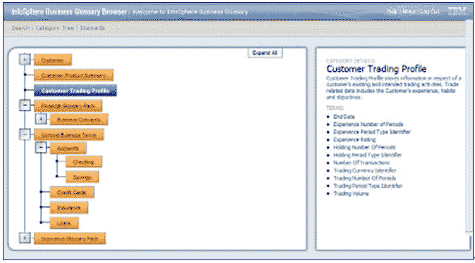

# 实施元数据管理

> 原文：[`developer.ibm.com/zh/articles/bd-1503bigdatagovernance3/`](https://developer.ibm.com/zh/articles/bd-1503bigdatagovernance3/)

[大数据治理专题](http://www.ibm.com/developerworks/cn/bigdata/governance/index.html)详细阐述了什么是大数据治理、为何要做大数据治理，并结合实际业务问题介绍了大数据治理统一流程参考模型的实施步骤，以及 IBM 相关的大数据治理的产品介绍。

### 大数据治理统一流程参考模型（续）

## 第三步：实施元数据管理

在明确了元数据管理策略和元数据集成体系结构之后，企业可以根据需要选择合适的业务元数据和技术元数据管理工具，并制定相应的元数据管理制度进行全面的元数据管理。比如可以使用 IBM InfoSphere Business Glossary 进行业务元数据的管理，使用 IBM InfoSphere Metadata Workbench 作为元数据管理统一工具并进行图形化的元数据分析。

大数据扩大了数据的容量、速度和多样性，给元数据管理带来了新的挑战。在构建关系型数据仓库、动态数据仓库和关系型数据中心时进行元数据管理，有助于保证数据被正确地使用、重用并满足各种规定。同样，对大数据来说，元数据管理过程中出现的任何错误，都会导致数据重复、数据质量差和无法访问关键信息等问题 [1]。随着大数据技术在企业中的应用越来越广泛，企业需要在原有的元数据管理策略中增加大数据相关的内容。通常，大数据分析是受用例驱动的，企业可以通过梳理大数据用例的方式逐步完善大数据的元数据管理。

针对大数据的业务元数据，依旧可以通过构建基础本体、领域本体、任务本体和应用本体等的方式来实现。通过构建基础本体，实现对级别且通用的概念以及概念之间关系的描述；通过构建领域本体，实现对于领域的定义，并确定该领域内共同认可的词汇、词汇业务含义和对应的信息资产等，提供对该领域知识的共同理解；通过构建任务本体，实现任务元素及其之间关系的规范说明或详细说明；通过构建应用本体，实现对特定应用的概念描述，其是依赖于特定领域和任务的。这样就通过构建各种本体，在整个企业范围提供一个完整的共享词汇表，保证每个元数据元素在信息供应链中每个组件的语义上保持一致，实现是语义等效。

为了实现信息供应链中各个组件元数据的交互和集成，大数据平台的元数据集成体系结构依然可以采用基于模型驱动的中央辐射式元数据体系结构。对大数据平台中的结构化数据的元数据管理可以遵循公共仓库元模型（CWM）构建元数据体系结构，以便方便的实现各个组件间元数据的交互；对大数据平台中的半结构化和非结构化数据的元数据管理，因为业内还没有通用的公共元模型，企业可以尝试采用基于自定义模型驱动的方式构建中央辐射式元数据体系结构。

简单来说，企业可以尝试以下步骤进行大数据的元数据管理：

1.  考虑到企业可以获取数据的容量和多样性，应该创建一个体现关键大数据业务术语的业务定义词库（本体），该业务定义词库不仅仅包含结构化数据，还可以将半结构化和非结构化数据纳入其中。
2.  及时跟进和理解各种大数据技术中的元数据，提供对其连续、及时地支持，比如 MPP 数据库、流计算引擎、Apache Hadoop/企业级 Hadoop、NoSQL 数据库以及各种数据治理工具如审计/安全工具、信息生命周期管理工具等。
3.  对业务术语中的敏感大数据进行标记和分类，并执行相应的大数据隐私政策。
4.  将业务元数据和技术元数据进行链接，可以通过操作元数据（如流计算或 ETL 工具所生成的数据）监测大数据的流动；可以通过数据世系分析（血缘分析）在整个信息供应链中实现数据的正向追溯或逆向追溯，了解数据都经历了哪些变化，查看字段在信息供应链各组件间转换是否正确等；可以通过影响分析可以了解具体某个字段的变更会对信息供应链中其他组件中的字段造成哪些影响等。
5.  扩展企业现有的元数据管理角色，以适应大数据治理的需要，比如可以扩充数据治理管理者、元数据管理者、数据主管、数据架构师以及数据科学家的职责，加入大数据治理的相关内容。

在实施元数据管理的过程中，可以参照元数据管理的成熟度模型确定企业当前元数据管理所在层次，并根据业务需要制定路线图实现元数据管理水平的提升。元数据管理成熟度模型具体如图 1 所示：

##### 图 1\. 元数据管理成熟度模型

根据元数据管理的成熟度，大体可以分成 6 个级别，具体如图 1 所示：

*   L0: 初始状态

元数据分散于日常的业务和职能管理中，由某个人或某一组人员在局部产生或获取，并在局部使用，其他人如果想获得该元数据需要找到相应的人进行沟通获取。

*   L1: 从属于业务系统

在这个阶段，随着各个业务系统自动化构建完成，相应的元数据也随着需求整理、设计、开发、实施和维护等过程被各个业务系统孤立的全部或部分管理起来。业务元数据可能分散在各种业务规章、流程规定、需求、需求分析和概要设计等文档以及业务系统中，技术元数据可能分散在详细设计、模型设计和部署方案等各种文档和各种中间件以及业务系统中。由于各个业务系统处于一个个竖井之中，元数据之间互通互联困难，如果需要获取其他系统的元数据，除了调阅各种文档外，对分散在各种中间件和业务系统中的技术元数据需要通过桥（bridge）的方式实现互通互联。

*   L2：元数据统一存储

元数据依然在局部产生和获取，但会集中到中央存储库进行存储，业务元数据会手工录入到中央存储库中，技术元数据分散在文档中的部分也通过手工录入到中央存储库中，而散落在各个中间件和业务系统中的技术元数据则通过桥（bridge）的方式被读取到中央存储库中。业务元数据和技术元数据之间全部或部分通过手工方式做了关联。中央存储库的构建，使得元数据在整个企业层面可被感知和搜索，极大地方便了企业获取和查找元数据。缺点是，元数据仍然在各业务系统上维护，然后更新到中央存储库，各业务竖井之间仍然使用不同的命名法，经常会造成相同的名字代表不同意义的事情，而同一件事情则使用了多个不同的名字，有些没有纳入业务系统管理的元数据则容易缺失。元数据没有有效的权限管理，局部元数据更改后也不自动通知其他人。

*   L3: 元数据集中管理

在 L2 的基础上做了改进，增强了元数据的集中控制，局部业务单元或开发小组如不事先通知其他人，将无法对元数据进行修改。局部元数据的修改完成后将被广播给其他人。和其他中间件和应用系统的交互，仍然通过桥（bridge）的方式进行，中央存储库中的业务元数据和技术元数据之间还是通过手工方式进行映射。

*   L4：元模型驱动管理

在 L3 的基础上，通过构建元模型以及元元模型，优化各业务单元之间的各种冲突和各种副本，创建、管理和共享业务词汇表和分类系统（基于主题领域的层次结构）。业务词汇表（业务元数据）包含与企业相关的词汇、词汇业务含义以及词汇与信息资产（技术元数据）的关系，可以有效帮助企业用户了解其业务元数据和技术元数据对应的业务含义。分类是基于主题领域的层次结构，用以对业务术语归类。和其他中间件和应用系统的交换，通过基于 CWM 的适配器方式进行连接。

*   L5: 元数据管理自动化

在 L5 元数据管理是高度自动化的，当逻辑层次元数据变更时，会被传播到物理层次，同样物理层次变更时逻辑层次将被更新。元数据中的任何变化将触发业务工作流，以便其他业务系统进行相应的修改。由于各个业务系统遵照相同的业务词汇表和分类系统（元模型），他们之间的关系可以通过知识本体进行推断，因此各个应用系统之间的数据格式的映射自动产生。

## IBM InfoSphere Information Server 元数据管理组件介绍

IBM InfoSphere Information Server 可以帮助组织从分散在其系统中的各种复杂信息中获取更多价值。它让组织能够整合分散的数据，在需要的地方和时间，按顺序和关联关系把可信的信息交付给特定的人员、应用程序和流程。InfoSphere Information Server 帮助业务人员和 IT 人员进行协作，理解来自任何来源的任何类型的信息的含义、结构和内容。它可以显著提高在整个企业内一致且安全地清理、转换和交付信息的生产力和效率，这样就可以以新的方式访问和使用信息，从而促进创新、提高运营效率并降低风险。InfoSphere Information Server 让客户可以跨分析、运营和事务环境应用一致的可重复的流程以解决企业级数据问题，不受数据量、复杂性或延迟的限制。InfoSphere Information Server 的每个核心产品可以作为集成平台的一部分使用，也可以作为单独的集成产品使用。

这些产品由一个全面的集成服务平台支持，提供全程数据集成、元数据管理、任何数据源与任何平台上的任何应用程序之间的连接以及通过并行处理技术无限制地扩展。可以按任何配置部署这些功能以支持事件驱动或按时间表执行的处理。还可以通过 InfoSphere Information Services Director 交付基础设施“随需”使用 InfoSphere Information Server 数据集成功能，从而补充 Enterprise Application Integration(EAI)、Business Process Management(BPM)、Enterprise Information Integration(EII) 和 Application Servers 集成基础设施。

InfoSphere Information Server 提供一个全面的模块化解决方案，可以根据业务需求和客户预算扩展。客户既可以部署完整的 InfoSphere Information Server 以处理整个企业数据集成生命周期，也可以使用单独的集成产品并根据需要添加其他组件。这种灵活的方式让客户既可以通过完整的 InfoSphere Information Server 实现全面集成，也可以通过购买一个或更多组件的许可证实现部分集成，以后可以添加其他组件以创建单一的集成解决方案。InfoSphere Information Server 可以提高从事数据集成项目的开发团队的生产力，改进这些开发团队之间以及开发人员与提出需求的业务用户之间的协作，促进项目团队内部和之间的重用，这些都会产生价值。为 SAP、Oracle、PeopleSoft、Siebel、SalesForce.com 等公司的企业应用程序预先构建的接口扩展了 InfoSphere Information Server 的功能范围。这些包帮助公司通过企业数据仓库或 ERP 厂商业务智能化解决方案集成来自这些企业应用程序的数据，构建分析解决方案。

InfoSphere Information Server 提供一套统一的可单独购买的产品模块 (即套件组件)，可以解决多种类型的业务问题。可以跨项目重用信息检验、访问和处理规则，这会提高一致性、增强对数据的管控并提高 IT 项目的效率。

IBM Information Server 让企业能够实现 5 种关键的集成功能：

*   连接任何数据或内容，无论它驻留在什么地方：大型机或分布式系统，内部或外部；
*   了解并分析信息，理解数据源的内容、质量和结构，从而在整个企业中集成和传播数据之前全面了解数据；
*   清理数据，确保数据的质量和一致性，让公司可以访问任何个人或业务实体及其关系的权威且一致的视图；
*   转换大量数据，从而有效且高效地从原数据源向目标提供丰富的有针对性的信息；
*   交付数据，让人员、流程和应用程序可以像访问单一资源一样访问和集成不同类型的数据和内容，无论信息驻留在什么地方。

这些功能的基础是一个共用的元数据和并行处理基础设施，它为整个平台提供支持和自动化。产品组合中的每个产品还可以连接许多数据和内容源，能够通过多种机制交付信息。另外，可以通过便于发布的共享服务在面向服务架构中使用这些功能。IBM Information Server 提供：

*   最广泛的访问信息源的能力；
*   最全面的集成功能，包括联合、ETL、内联转换、复制和事件发布；
*   在使用这些功能的方式方面的灵活性，包括支持面向服务架构、事件驱动的处理、按时间表执行的批处理以及 SQL 和 Java 等标准 API 平台的功能广度和灵活性让它能够解决许多类型的业务问题，满足许多类型的项目的需求。这可以增加重用的机会，加快项目的速度，提高信息的一致性，增强信息治理。

IBM InfoSphere Information Server 由以下组件组成:

*   元数据服务
*   InfoSphere Business Glossary
*   InfoSphere Business Glossary Anywhere
*   InfoSphere Metadata Workbench
*   InfoSphere Information Analyzer
*   IBM Information Server FastTrack
*   InfoSphere QualityStage
*   InfoSphere DataStage
*   InfoSphere Information Services Director
*   InfoSphere Change Data Delivery for Information Server
*   InfoSphere Federation Server

元数据服务是 IBM Information Server 所基于的平台的组成部分。可以通过使用元数据服务访问数据以及完成分析、建模、清理和转换等数据集成任务。IBM Information Server 的主要元数据服务组件是 InfoSphere Business Glossary、InfoSphere Metadata Server 以及 InfoSphere MetaBrokers 和桥。

InfoSphere Business Glossary 是一个基于 web 的交互式工具，可以帮助用户创建、管理和共享业务词汇表和分类系统。业务词汇和技术信息资产保持一致可以促进业务和 IT 群体的协作，有助于更有效地治理数据。另外，这个工具的数据专员功能可以提升责任感，支持数据治理策略。

InfoSphere Metadata Workbench 允许以基于 web 的方式查看 IBM InfoSphere Information Server 和其他第三方应用程序生成和使用的信息资产。这个浏览工具可以提高对最重要的信息的信任程度。另外，InfoSphere Metadata Workbench 向 IT 人员提供健壮的查询功能和全面且灵活的数据世系报告，让他们可以深入了解环境中使用的数据，还可以监视数据集成活动。在处理数据集成项目中的变动时，强大的影响分析工具可以帮助数据分析师和开发人员做出更好的决策。

## InfoSphere Business Glossary 介绍

Business Glossary 是用来管理和展示企业业务元数据的基于 Web 的交互式工具，支持用户创建、管理和共享业务词汇表和分类系统（基于主题领域的层次结构）。业务词汇表（业务元数据）包含与企业相关的词汇、词汇业务含义以及词汇与信息资产（技术元数据）的关系，可以有效帮助企业用户了解其业务元数据和技术元数据的对应的业务含义。Business Glossary 可以使所有用户协同管理业务元数据比如元数据定义、同义词、样例和分类等，并提供多种查询方式，比如报表、条件查询、影响分析等。

元数据应该由了解信息资产对业务的意义和重要性的人员进行管理。InfoSphere Business Glossary 设计用于协作授权，使用户能够共享关于数据的见解和体验。产品为用户提供关于数据资源的以下信息：

*   数据的商业意义和说明；
*   数据和流程的管家；
*   保证的业务等级；
*   获准使用的术语；

用户可根据可控词汇表定义的语义来组织并查找 InfoSphere Business Glossary，您可使用 Web 控制台来创建可控词汇表。IBM Business Glossary 业务术语管理分类如图 2 所示，通过业务术语管理可以实现：

*   定义权威性的含义；
*   增加对整个企业机构的业务理解；
*   建立职责和可追溯的制度；
*   描绘业务层次；
*   记录业务描述，例如缩写和同义词；
*   查找相关的信息资产；
*   鼓励使用、重用和更正业务术语；
*   让 IT 与业务目标更有效地结合；
*   提供业务内容与 IT 资产的对应联系；
*   建立职责和数据管控的政策。

##### 图 2\. IBM InfoSphere Business Glossary 业务术语管理分类

通过使用 Business Glossary 解决方案可以帮企业带来很多价值，比如：

*   获取业务术语并进行分类，基于 Web 的业务元数据生成、管理和共享；
*   把业务术语及其分类与 IT 资产关联，为信息技术资产提供业务环境；
*   识别数据使用者让业务术语可被访问，让每个用户可立刻访问有内涵的信息；
*   让 IT 项目向数据管理看齐，创建和管理业务术语及关系，同时链接到物理数据源。
*   加强业务与 IT 人员的通力合作，确立责任和义务，使 IT 部门的工作与业务部门的目标保持一致。

Business Glossary 与 Information Server 其他组件以及第三方产品交互如图 3 所示，Business Glossary 负责对业务元数据进行管理，Metadata Server 作为中央共享元数据库负责存储业务、技术和操作元数据，Information Server 组件的各种开发和运行元数据将会自动存储在 Metadata Server 中，通过 import/export manager 还可以将第三方各种元数据与 Metadata Server 进行元数据交互，Metadata Server 还支持导入 CSV、XML、Glossary archive 和 InfoSphere Data Architect 等内容。Metadata Workbench 允许用户浏览、分析和管理在 Metadata Server 中的元数据并为企业用户提供信息供应链全程的数据流报告、数据沿袭和依赖性分析等。Information Server 其他组件（如 FastTrack/Information Analyzer/InfoSphere Data Architect 等）可以直接访问 Metadata Server 获取元数据，DataStage 和 QualityStage 可以通过 DataStage Connectors 访问 Metadata Server。如右下方所示，访问业务元数据的方法有多种，可以通过 Business Glossary 浏览器浏览和搜索词汇表，可以通过 Business Glossary Anywhere 客户机浏览词汇表内容并支持屏幕取词功能，可以通过 Business Glossary REST API（Representational State Transfer 应用程序编程接口）编写自己的程序来访问和修改业务词汇表内容，还可以通过 Business Glossary Client for Eclipse 插件让基于 Eclipse 的应用程序直接访问词汇表内容。Business Glossary 还支持与 Cognos BI 和 IBM Industry Models 等集成。

##### 图 3\. 元数据管理体系结构图

## InfoSphere Business Glossary Anywhere 介绍

IBM InfoSphere Business Glossary Anywhere 可以从在 Microsoft Windows 计算机上打开的任何文本文件直接访问业务词汇表。另外，InfoSphere Business Glossary Anywhere 附带 IBM InfoSphere Business Glossary Client for Eclipse 和 IBM InfoSphere Business Glossary REST API。

通过使用 IBM InfoSphere Business Glossary Anywhere，用户可以在执行其他基于计算机的任务的同时搜索业务词汇表，不会丢失上下文或分散注意力。用户可以通过鼠标或键盘操作在 Microsoft Windows 桌面上打开的文档中捕捉单词或短语，然后在业务词汇表内容中搜索它。用户不必另外打开并登录 InfoSphere Business Glossary，就可以使用大多数业务词汇表信息。

## InfoSphere Metadata Workbench 介绍

IBM InfoSphere Metadata Workbench 是基于 Web 界面的元数据管理工具，对 Metada Server 中的业务元数据和技术元数据提供完整的管理并提供元数据的完整视图，提供多种元数据导入导出功能。InfoSphere Metadata Workbench 可以在整个数据集成项目中跟踪和维护信息的关系，从而提高 IT 对业务人员的透明性和 IT 的响应能力。使用 InfoSphere Information Server 产品中不同的模块用户，可以通过 InfoSphere Metadata Workbench 查看 InfoSphere Information Server 元数据存储库中的元数据和数据资产。Metadata Workbench 可以提供丰富的元数据分析，为整个信息供应链的元数据提供全程的数据流报告，提供基于字段或作业的数据沿袭（也就是数据世系分析或血缘分析）、影响分析和系统相关性分析等。例如某电信公司在前端展示工具 Cognos Report Studio 中展示的掉话率指标明显和实际不符，可以通过 Metadata Workbench 使用血缘分析上溯到数据源（数据仓库、ODS、ETL、网管系统、EOMS）并图形化的显示出该路径上的所有对象，方便查找在哪个环节出现问题。

数据流报告显示数据从最开始的业务系统（粒度到列级别）、复制、ETL、ODS 或数据仓库到前端展示报告或 Dashboad 完整的转移路径，包括其中对数据执行的处理的类型等。数据流报告方便业务人员了解信息的起源以及具体的转移过程，有助于进行数据世系分析，满足法律遵从性和可审计性需求。比如可以方便的找出前端展示报告中的某个字段的来源，某个 Datastage 作业将数据移动到什么位置等。数据世系分析可以跟踪整个企业的数据流（即便数据没有保存在 Metadata Server 中），可以通过创建扩展映射和扩展数据源来跟踪数据流，为数据流中的任何资产创建扩展的数据世系分析报告。

## 结束语

本文详细介绍了大数据治理统一流程参考模型的第三步：”实施元数据管理”，并详细讲述了在大数据时代如何实施元数据管理，随后介绍了元数据管理成熟度模型，帮助企业可以参考该模型衡量自己当前元数据管理水平，最后简单介绍了 IBM 在元数据管理方面的产品：业务元数据管理工具 IBM InfoSphere Business Glossary、业务词汇表小工具 InfoSphere Business Glossary Anywhere 和技术元数据管理工具 InfoSphere Metadata Workbench。在本系列文章的 [下一部分](http://www.ibm.com/developerworks/cn/data/library/bd-1503bigdatagovernance4/index.html) 将重点介绍大数据治理统一流程参考模型第四步”定义业务问题”、第五步”获得主管支持”、第六步”执行成熟度评估”、第七步”构建路线图”、第八步”建立组织蓝图”和第九步”了解数据”等内容，并继续介绍 IBM 信息服务器中的 InfoSphere Information Analyze、InfoSphere Federation Server、InfoSphere Replication Server 和 InfoSphere Change Data Capture 等。InfoSphere Information Analyze 是一款数据质量分析工具软件，用来在项目初期对数据源进行数据质量分析，以便真正地了解源数据的结构、质量和数据分布等，提早发现数据的缺失、错误、重复和不一致等问题，为后面的数据复制、ETL 等过程提供支持，以便降低项目实施风险。

## 相关主题

*   在 [IBM developer 大数据技术主页](https://developer.ibm.com/zh/technologies/analytics/)，了解关于大数据的更多信息，获取技术文档、how-to 文章、培训、下载、产品信息以及其他资源。
*   [BigInsights 3.0 信息中心。](https://www.ibm.com/support/knowledgecenter/en/SSPT3X_3.0.0/com.ibm.swg.im.infosphere.biginsights.welcome.doc/doc/welcome.html)