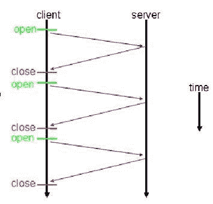
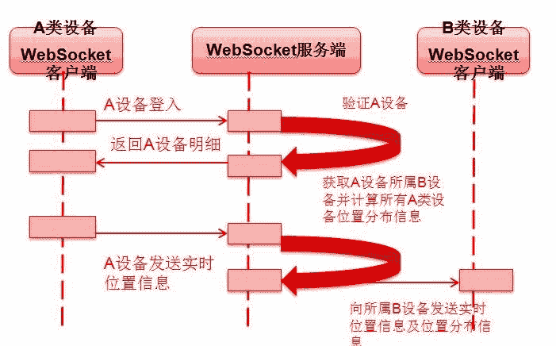

# WebSocket 实战

> 原文：[`developer.ibm.com/zh/articles/j-lo-websocket/`](https://developer.ibm.com/zh/articles/j-lo-websocket/)

## WebSocket 前世今生

众所周知，Web 应用的交互过程通常是客户端通过浏览器发出一个请求，服务器端接收请求后进行处理并返回结果给客户端，客户端浏览器将信息呈现，这种机制对于信息变化不是特别频繁的应用尚可，但对于实时要求高、海量并发的应用来说显得捉襟见肘，尤其在当前业界移动互联网蓬勃发展的趋势下，高并发与用户实时响应是 Web 应用经常面临的问题，比如金融证券的实时信息，Web 导航应用中的地理位置获取，社交网络的实时消息推送等。

传统的请求-响应模式的 Web 开发在处理此类业务场景时，通常采用实时通讯方案，常见的是：

*   轮询，原理简单易懂，就是客户端通过一定的时间间隔以频繁请求的方式向服务器发送请求，来保持客户端和服务器端的数据同步。问题很明显，当客户端以固定频率向服务器端发送请求时，服务器端的数据可能并没有更新，带来很多无谓请求，浪费带宽，效率低下。
*   基于 Flash，AdobeFlash 通过自己的 Socket 实现完成数据交换，再利用 Flash 暴露出相应的接口为 JavaScript 调用，从而达到实时传输目的。此方式比轮询要高效，且因为 Flash 安装率高，应用场景比较广泛，但在移动互联网终端上 Flash 的支持并不好。IOS 系统中没有 Flash 的存在，在 Android 中虽然有 Flash 的支持，但实际的使用效果差强人意，且对移动设备的硬件配置要求较高。2012 年 Adobe 官方宣布不再支持 Android4.1+系统，宣告了 Flash 在移动终端上的死亡。

从上文可以看出，传统 Web 模式在处理高并发及实时性需求的时候，会遇到难以逾越的瓶颈，我们需要一种高效节能的双向通信机制来保证数据的实时传输。在此背景下，基于 HTML5 规范的、有 Web TCP 之称的 WebSocket 应运而生。

早期 HTML5 并没有形成业界统一的规范，各个浏览器和应用服务器厂商有着各异的类似实现，如 IBM 的 MQTT，Comet 开源框架等，直到 2014 年，HTML5 在 IBM、微软、Google 等巨头的推动和协作下终于尘埃落地，正式从草案落实为实际标准规范，各个应用服务器及浏览器厂商逐步开始统一，在 JavaEE7 中也实现了 WebSocket 协议，从而无论是客户端还是服务端的 WebSocket 都已完备，读者可以查阅 [HTML5 规范](http://www.jb51.net/w3school/html5/) ，熟悉新的 HTML 协议规范及 WebSocket 支持。

## WebSocket 机制

以下简要介绍一下 WebSocket 的原理及运行机制。

WebSocket 是 HTML5 一种新的协议。它实现了浏览器与服务器全双工通信，能更好的节省服务器资源和带宽并达到实时通讯，它建立在 TCP 之上，同 HTTP 一样通过 TCP 来传输数据，但是它和 HTTP 最大不同是：

*   WebSocket 是一种双向通信协议，在建立连接后，WebSocket 服务器和 Browser/Client Agent 都能主动的向对方发送或接收数据，就像 Socket 一样；
*   WebSocket 需要类似 TCP 的客户端和服务器端通过握手连接，连接成功后才能相互通信。

非 WebSocket 模式传统 HTTP 客户端与服务器的交互如下图所示：

##### 图 1\. 传统 HTTP 请求响应客户端服务器交互图



使用 WebSocket 模式客户端与服务器的交互如下图：

##### 图 2.WebSocket 请求响应客户端服务器交互图


上图对比可以看出，相对于传统 HTTP 每次请求-应答都需要客户端与服务端建立连接的模式，WebSocket 是类似 Socket 的 TCP 长连接的通讯模式，一旦 WebSocket 连接建立后，后续数据都以帧序列的形式传输。在客户端断开 WebSocket 连接或 Server 端断掉连接前，不需要客户端和服务端重新发起连接请求。在海量并发及客户端与服务器交互负载流量大的情况下，极大的节省了网络带宽资源的消耗，有明显的性能优势，且客户端发送和接受消息是在同一个持久连接上发起，实时性优势明显。

我们再通过客户端和服务端交互的报文看一下 WebSocket 通讯与传统 HTTP 的不同：

在客户端，new WebSocket 实例化一个新的 WebSocket 客户端对象，连接类似 ws://yourdomain:port/path 的服务端 WebSocket URL，WebSocket 客户端对象会自动解析并识别为 WebSocket 请求，从而连接服务端端口，执行双方握手过程，客户端发送数据格式类似：

##### 清单 1.WebSocket 客户端连接报文

```
GET /webfin/websocket/ HTTP/1.1
Host: localhost
Upgrade: websocket
Connection: Upgrade
Sec-WebSocket-Key: xqBt3ImNzJbYqRINxEFlkg==
Origin: http://localhost:8080
Sec-WebSocket-Version: 13 
```

可以看到，客户端发起的 WebSocket 连接报文类似传统 HTTP 报文，“Upgrade：websocket” 参数值表明这是 WebSocket 类型请求，“Sec-WebSocket-Key” 是 WebSocket 客户端发送的一个 base64 编码的密文，要求服务端必须返回一个对应加密的 “Sec-WebSocket-Accept” 应答，否则客户端会抛出 “Error during WebSocket handshake” 错误，并关闭连接。

服务端收到报文后返回的数据格式类似：

##### 清单 2.WebSocket 服务端响应报文

```
HTTP/1.1 101 Switching Protocols
Upgrade: websocket
Connection: Upgrade
Sec-WebSocket-Accept: K7DJLdLooIwIG/MOpvWFB3y3FE8= 
```

“Sec-WebSocket-Accept” 的值是服务端采用与客户端一致的密钥计算出来后返回客户端的,“HTTP/1.1 101 Switching Protocols” 表示服务端接受 WebSocket 协议的客户端连接，经过这样的请求-响应处理后，客户端服务端的 WebSocket 连接握手成功, 后续就可以进行 TCP 通讯了。读者可以查阅 [WebSocket 协议栈](http://tools.ietf.org/html/rfc6455) 了解 WebSocket 客户端和服务端更详细的交互数据格式。

在开发方面，WebSocket API 也十分简单，我们只需要实例化 WebSocket，创建连接，然后服务端和客户端就可以相互发送和响应消息，在下文 WebSocket 实现及案例分析部分，可以看到详细的 WebSocket API 及代码实现。

## WebSocket 实现

如上文所述，WebSocket 的实现分为客户端和服务端两部分，客户端（通常为浏览器）发出 WebSocket 连接请求，服务端响应，实现类似 TCP 握手的动作，从而在浏览器客户端和 WebSocket 服务端之间形成一条 HTTP 长连接快速通道。两者之间后续进行直接的数据互相传送，不再需要发起连接和相应。

以下简要描述 WebSocket 服务端 API 及客户端 API。

### WebSocket 服务端 API

WebSocket 服务端在各个主流应用服务器厂商中已基本获得符合 JEE JSR356 标准规范 API 的支持（详见 [JSR356 WebSocket API 规范](https://www.jcp.org/en/jsr/detail?id=356) ），以下列举了部分常见的商用及开源应用服务器对 WebSocket Server 端的支持情况：

##### 表 1.WebSocket 服务端支持

| 厂商 | 应用服务器 | 备注 |
| --- | --- | --- |
| IBM | WebSphere | WebSphere 8.0 以上版本支持，7.X 之前版本结合 MQTT 支持类似的 HTTP 长连接 |
| 甲骨文 | WebLogic | WebLogic 12c 支持，11g 及 10g 版本通过 HTTP Publish 支持类似的 HTTP 长连接 |
| 微软 | IIS | IIS 7.0+支持 |
| Apache | Tomcat | Tomcat 7.0.5＋支持，7.0.2X 及 7.0.3X 通过自定义 API 支持 |
|  | Jetty | Jetty 7.0＋支持 |

以下我们使用 Tomcat7.0.5 版本的服务端示例代码说明 WebSocket 服务端的实现：

JSR356 的 WebSocket 规范使用 javax.websocket.* 的 API，可以将一个普通 Java 对象（POJO）使用 @ServerEndpoint 注释作为 WebSocket 服务器的端点，代码示例如下：

##### 清单 3.WebSocket 服务端 API 示例

```
 @ServerEndpoint("/echo")
 public class EchoEndpoint {

 @OnOpen
 public void onOpen(Session session) throws IOException {
 //以下代码省略...
 }

 @OnMessage
 public String onMessage(String message) {
 //以下代码省略...
 }

 @Message(maxMessageSize=6)
 public void receiveMessage(String s) {
 //以下代码省略...
 }

 @OnError
 public void onError(Throwable t) {
 //以下代码省略...
 }

 @OnClose
 public void onClose(Session session, CloseReason reason) {
 //以下代码省略...
 }

 } 
```

代码解释：

上文的简洁代码即建立了一个 WebSocket 的服务端，@ServerEndpoint(“/echo”) 的 annotation 注释端点表示将 WebSocket 服务端运行在 ws://[Server 端 IP 或域名]:[Server 端口]/websockets/echo 的访问端点，客户端浏览器已经可以对 WebSocket 客户端 API 发起 HTTP 长连接了。

使用 ServerEndpoint 注释的类必须有一个公共的无参数构造函数，@onMessage 注解的 Java 方法用于接收传入的 WebSocket 信息，这个信息可以是文本格式，也可以是二进制格式。

OnOpen 在这个端点一个新的连接建立时被调用。参数提供了连接的另一端的更多细节。Session 表明两个 WebSocket 端点对话连接的另一端，可以理解为类似 HTTPSession 的概念。

OnClose 在连接被终止时调用。参数 closeReason 可封装更多细节，如为什么一个 WebSocket 连接关闭。

更高级的定制如 @Message 注释，MaxMessageSize 属性可以被用来定义消息字节最大限制，在示例程序中，如果超过 6 个字节的信息被接收，就报告错误和连接关闭。

注意：早期不同应用服务器支持的 WebSocket 方式不尽相同，即使同一厂商，不同版本也有细微差别，如 Tomcat 服务器 7.0.5 以上的版本都是标准 JSR356 规范实现，而 7.0.2x/7.0.3X 的版本使用自定义 API （WebSocketServlet 和 StreamInbound， 前者是一个容器，用来初始化 WebSocket 环境；后者是用来具体处理 WebSocket 请求和响应，详见案例分析部分），且 Tomcat7.0.3x 与 7.0.2x 的 createWebSocketInbound 方法的定义不同，增加了一个 HttpServletRequest 参数，使得可以从 request 参数中获取更多 WebSocket 客户端的信息，如下代码所示：

##### 清单 4.Tomcat7.0.3X 版本 WebSocket API

```
public class EchoServlet extends WebSocketServlet {
@Override
protected StreamInbound createWebSocketInbound(String subProtocol,
HttpServletRequest request) {
 //以下代码省略....
return new MessageInbound() {
 //以下代码省略....
}
protected void onBinaryMessage(ByteBuffer buffer)
throws IOException {
 //以下代码省略...
}
protected void onTextMessage(CharBuffer buffer) throws IOException {
 getWsOutbound().writeTextMessage(buffer);
 //以下代码省略...
}
};
}
} 
```

因此选择 WebSocket 的 Server 端重点需要选择其版本，通常情况下，更新的版本对 WebSocket 的支持是标准 JSR 规范 API，但也要考虑开发易用性及老版本程序移植性等方面的问题，如下文所述的客户案例，就是因为客户要求统一应用服务器版本所以使用的 Tomcat 7.0.3X 版本的 WebSocketServlet 实现，而不是 JSR356 的 @ServerEndpoint 注释端点。

### WebSocket 客户端 API

对于 WebSocket 客户端，主流的浏览器（包括 PC 和移动终端）现已都支持标准的 HTML5 的 WebSocket API，这意味着客户端的 WebSocket JavaScirpt 脚本具备良好的一致性和跨平台特性，以下列举了常见的浏览器厂商对 WebSocket 的支持情况：

##### 表 2.WebSocket 客户端支持

| 浏览器 | 支持情况 |
| --- | --- |
| Chrome | Chrome version 4+支持 |
| Firefox | Firefox version 5+支持 |
| IE | IE version 10+支持 |
| Safari | IOS 5+支持 |
| Android Brower | Android 4.5+支持 |

客户端 WebSocket API 基本上已经在各个主流浏览器厂商中实现了统一，因此使用标准 HTML5 定义的 WebSocket 客户端的 JavaScript API 即可，当然也可以使用业界满足 WebSocket 标准规范的开源框架，如 Socket.io。

以下以一段代码示例说明 WebSocket 的客户端实现：

##### 清单 5.WebSocket 客户端 API 示例

```
var ws = new WebSocket("ws://echo.websocket.org”);
 ws.onopen = function(){ws.send("Test!”); };
 ws.onmessage = function(evt){console.log(evt.data);ws.close();};
 ws.onclose = function(evt){console.log("WebSocketClosed!”);};
 ws.onerror = function(evt){console.log("WebSocketError!”);}; 
```

第一行代码是在申请一个 WebSocket 对象，参数是需要连接的服务器端的地址，同 HTTP 协议开头一样，WebSocket 协议的 URL 使用 ws://开头，另外安全的 WebSocket 协议使用 wss://开头。

第二行到第五行为 WebSocket 对象注册消息的处理函数，WebSocket 对象一共支持四个消息 onopen, onmessage, onclose 和 onerror，有了这 4 个事件，我们就可以很容易很轻松的驾驭 WebSocket。

当 Browser 和 WebSocketServer 连接成功后，会触发 onopen 消息；如果连接失败，发送、接收数据失败或者处理数据出现错误，browser 会触发 onerror 消息；当 Browser 接收到 WebSocketServer 发送过来的数据时，就会触发 onmessage 消息，参数 evt 中包含 Server 传输过来的数据；当 Browser 接收到 WebSocketServer 端发送的关闭连接请求时，就会触发 onclose 消息。我们可以看出所有的操作都是采用异步回调的方式触发，这样不会阻塞 UI，可以获得更快的响应时间，更好的用户体验。

## WebSocket 案例分析

以下我们以一个真实的客户案例来分析说明 WebSocket 的优势及具体开发实现（为保护客户隐私，以下描述省去客户名，具体涉及业务细节的代码在文中不再累述）。

### 案例介绍

该客户为一个移动设备制造商，移动设备装载的是 Android/IOS 操作系统，设备分两类（以下简称 A，B 两类），A 类设备随时处于移动状态中，B 类设备为 A 类设备的管理控制设备，客户需要随时在 B 类设备中看到所属 A 类设备的地理位置信息及状态信息。如 A 类设备上线，离线的时候，B 类设备需要立即获得消息通知，A 类设备上报时，B 类设备也需要实时获得该上报 A 类设备的地理位置信息。

为降低跨平台的难度及实施工作量，客户考虑轻量级的 Web App 的方式屏蔽 Android/IOS 平台的差异性，A 类设备数量众多，且在工作状态下 A 类设备处于不定时的移动状态，而 B 类设备对 A 类设备状态变化的感知实时性要求很高（秒级）。

根据以上需求，A/B 类设备信息存放在后台数据库中，A/B 类设备的交互涉及 Web 客户端/服务器频繁和高并发的请求-相应，如果使用传统的 HTTP 请求-响应模式，B 类设备的 Web App 上需要对服务进行轮询，势必会对服务器带来大的负载压力，且当 A 类设备没有上线或者上报等活动事件时，B 类设备的轮询严重浪费网络资源。

### 解决方案

综上所述，项目采用 WebSocket 技术实现实时消息的通知及推送，每当 A 类设备/B 类设备上线登录成功即打开 WebSocket 的 HTTP 长连接，新的 A 类设备上线，位置变化，离线等状态变化通过 WebSocket 发送实时消息，WebSocket Server 端处理 A 类设备的实时消息，并向所从属的 B 类设备实时推送。

WebSocket 客户端使用 jQuery Mobile（jQuery Mobile 移动端开发在本文中不再详细描述，感兴趣的读者可以参考 [jQuery Mobile 简介](http://jquerymobile.com/))，使用原生 WebSocket API 实现与服务端交互。

服务端沿用客户已有的应用服务器 Tomcat 7.0.33 版本，使用 Apache 自定义 API 实现 WebSocket Server 端，为一个上线的 A 类设备生成一个 WebSocket 的 HTTP 长连接，每当 A 类设备有上线，位置更新，离线等事件的时候，客户端发送文本消息，服务端识别并处理后，向所属 B 类设备发送实时消息，B 类设备客户端接收消息后，识别到 A 类设备的相应事件，完成对应的 A 类设备位置刷新以及其他业务操作。

其涉及的 A 类设备，B 类设备及后台服务器交互时序图如下：

##### 图 3：A/B 类设备 WebSocket 交互图



A/B 类设备的 WebSocket 客户端封装在 websocket.js 的 JavaScript 代码中，与 jQuery MobileApp 一同打包为移动端 apk/ipa 安装包；WebSocket 服务端实现主要为 WebSocketDeviceServlet.java, WebSocketDeviceInbound.java，WebSocketDeviceInboundPool.java 几个类。下文我们一一介绍其具体代码实现。

### 代码实现

在下文中我们把本案例中的主要代码实现做解释说明，读者可以下载完整的代码清单做详细了解。

**WebSocketDeviceServlet 类**

A 类设备或者 B 类设备发起 WebSocket 长连接后，服务端接受请求的是 WebSocketDeviceServlet 类，跟传统 HttpServlet 不同的是，WebSocketDeviceServlet 类实现 createWebSocketInbound 方法，类似 SocketServer 的 accept 方法，新生产的 WebSocketInbound 实例对应客户端 HTTP 长连接，处理与客户端交互功能。

WebSocketDeviceServlet 服务端代码示例如下：

##### 清单 6.WebSocketDeviceServlet.java 代码示例

```
public class WebSocketDeviceServlet extends org.apache.catalina.websocket.WebSocketServlet {

private static final long serialVersionUID = 1L;

 @Override
 protected StreamInbound createWebSocketInbound(String subProtocol,HttpServletRequest request) {

 WebSocketDeviceInbound newClientConn = new WebSocketDeviceInbound(request);
 WebSocketDeviceInboundPool.addMessageInbound(newClientConn);
 return newClientConn;

 }

} 
```

代码解释：

WebSocketServlet 是 WebSocket 协议的后台监听进程，和传统 HTTP 请求一样，WebSocketServlet 类似 Spring/Struct 中的 Servlet 监听进程，只不过通过客户端 ws 的前缀指定了其监听的协议为 WebSocket。

WebSocketDeviceInboundPool 实现了类似 JDBC 数据库连接池的客户端 WebSocket 连接池功能，并统一处理 WebSocket 服务端对单个客户端/多个客户端（同组 A 类设备）的消息推送，详见 WebSocketDeviceInboundPool 代码类解释。

**WebSocketDeviceInboundl 类**

WebSocketDeviceInbound 类为每个 A 类和 B 类设备验证登录后，客户端建立的 HTTP 长连接的对应后台服务类，类似 Socket 编程中的 SocketServer accept 后的 Socket 进程，在 WebSocketInbound 中接收客户端发送的实时位置信息等消息，并向客户端（B 类设备）发送下属 A 类设备实时位置信息及位置分析结果数据，输入流和输出流都是 WebSocket 协议定制的。WsOutbound 负责输出结果，StreamInbound 和 WsInputStream 负责接收数据：

##### 清单 7.WebSocketDeviceInbound.java 类代码示例

```
public class WebSocketDeviceInbound extends MessageInbound {
private final HttpServletRequest request;
private DeviceAccount connectedDevice;

public DeviceAccount getConnectedDevice() {
return connectedDevice;
}

public void setConnectedDevice(DeviceAccount connectedDevice) {
this.connectedDevice = connectedDevice;
}

public HttpServletRequest getRequest() {
return request;
}

public WebSocketDeviceInbound(HttpServletRequest request) {
this.request = request;
DeviceAccount connectedDa = (DeviceAccount)request.getSession(true).getAttribute("connectedDevice");
if(connectedDa==null)
{
String deviceId = request.getParameter("id");
DeviceAccountDao deviceDao = new DeviceAccountDao();
connectedDa = deviceDao.getDaById(Integer.parseInt(deviceId));
}
this.setConnectedDevice(connectedDa);
}

@Override
protected void onOpen(WsOutbound outbound) {
 /

}

@Override
protected void onClose(int status) {
WebSocketDeviceInboundPool.removeMessageInbound(this);

}

@Override
protected void onBinaryMessage(ByteBuffer message) throws IOException {
throw new UnsupportedOperationException("Binary message not supported.");
}

@Override
protected void onTextMessage(CharBuffer message) throws IOException {
WebSocketDeviceInboundPool.processTextMessage(this, message.toString());

}

public void sendMessage(BaseEvent event)
{
String eventStr = JSON.toJSONString(event);
try {
this.getWsOutbound().writeTextMessage(CharBuffer.wrap(eventStr));
//...以下代码省略
} catch (IOException e) {
e.printStackTrace();
}
}
} 
```

代码解释：

connectedDevice 是当前连接的 A/B 类客户端设备类实例，在这里做为成员变量以便后续处理交互。

sendMessage 函数向客户端发送数据，使用 Websocket WsOutbound 输出流向客户端推送数据，数据格式统一为 JSON。

onTextMessage 函数为客户端发送消息到服务器时触发事件，调用 WebSocketDeviceInboundPool 的 processTextMessage 统一处理 A 类设备的登入，更新位置，离线等消息。

onClose 函数触发关闭事件，在连接池中移除连接。

WebSocketDeviceInbound 构造函数为客户端建立连接后，WebSocketServlet 的 createWebSocketInbound 函数触发，查询 A 类/B 类设备在后台数据库的详细数据并实例化 connectedDevice 做为 WebSocketDeviceInbound 的成员变量，WebSocketServlet 类此时将新的 WebSocketInbound 实例加入自定义的 WebSocketDeviceInboundPool 连接池中，以便统一处理 A/B 设备组员关系及位置分布信息计算等业务逻辑。

**WebSocketDeviceInboundPool 类**

WebSocketInboundPool 类: 由于需要处理大量 A 类 B 类设备的实时消息，服务端会同时存在大量 HTTP 长连接，为统一管理和有效利用 HTTP 长连接资源，项目中使用了简单的 HashMap 实现内存连接池机制，每次设备登入新建的 WebSocketInbound 都放入 WebSocketInbound 实例的连接池中，当设备登出时，从连接池中 remove 对应的 WebSocketInbound 实例。

此外，WebSocketInboundPool 类还承担 WebSocket 客户端处理 A 类和 B 类设备间消息传递的作用，在客户端发送 A 类设备登入、登出及位置更新消息的时候，服务端 WebSocketInboundPool 进行位置分布信息的计算，并将计算完的结果向同时在线的 B 类设备推送。

##### 清单 8.WebSocketDeviceInboundPool.java 代码示例

```
public class WebSocketDeviceInboundPool {

private static final ArrayList<WebSocketDeviceInbound> connections =
new ArrayList<WebSocketDeviceInbound>();

public static void addMessageInbound(WebSocketDeviceInbound inbound){
//添加连接
DeviceAccount da = inbound.getConnectedDevice();
System.out.println("新上线设备 : " + da.getDeviceNm());
connections.add(inbound);
}

public static ArrayList<DeviceAccount> getOnlineDevices(){
ArrayList<DeviceAccount> onlineDevices = new ArrayList<DeviceAccount>();
for(WebSocketDeviceInbound webClient:connections)
{
onlineDevices.add(webClient.getConnectedDevice());
}
return onlineDevices;
}

public static WebSocketDeviceInbound getGroupBDevices(String group){
WebSocketDeviceInbound retWebClient =null;
for(WebSocketDeviceInbound webClient:connections)
{
if(webClient.getConnectedDevice().getDeviceGroup().equals(group)&&
webClient.getConnectedDevice().getType().equals("B")){
retWebClient = webClient;
}
}
return retWebClient;
}
public static void removeMessageInbound(WebSocketDeviceInbound inbound){
//移除连接
System.out.println("设备离线 : " + inbound.getConnectedDevice());
connections.remove(inbound);
}

public static void processTextMessage(WebSocketDeviceInbound inbound,String message){

BaseEvent receiveEvent = (BaseEvent)JSON.parseObject(message.toString(),BaseEvent.class);
DBEventHandleImpl dbEventHandle = new DBEventHandleImpl();
dbEventHandle.setReceiveEvent(receiveEvent);
dbEventHandle.HandleEvent();
if(receiveEvent.getEventType()==EventConst.EVENT_MATCHMATIC_RESULT||
receiveEvent.getEventType()==EventConst.EVENT_GROUP_DEVICES_RESULT||
receiveEvent.getEventType()==EventConst.EVENT_A_REPAIRE){
String clientDeviceGroup = ((ArrayList<DeviceAccount>)
receiveEvent.getEventObjs()).get(0).getDeviceGroup();
WebSocketDeviceInbound bClient = getGroupBDevices(clientDeviceGroup);
if(bClient!=null){
sendMessageToSingleClient(bClient,dbEventHandle.getReceiveEvent());
}
}
}
}
public static void sendMessageToAllDevices(BaseEvent event){
try {
for (WebSocketDeviceInbound webClient : connections) {
webClient.sendMessage(event);
}
} catch (Exception e) {
e.printStackTrace();
}
}
public static void sendMessageToSingleClient(WebSocketDeviceInbound webClient,BaseEvent event){

try {
webClient.sendMessage(event);

}
catch (Exception e) {
e.printStackTrace();
}
}
} 
```

代码解释：

addMessageInbound 函数向连接池中添加客户端建立好的连接。

getOnlineDevices 函数获取所有的连线的 A/B 类设备。

removeMessageInbound 函数实现 A 类设备或者 B 类设备离线退出（服务端收到客户端关闭 WebSocket 连接事件，触发 WebSocketInbound 中的 onClose 方法），从连接池中删除连接设备客户端的连接实例。

processTextMessage 完成处理客户端消息，这里使用了消息处理的机制，包括解码客户端消息，根据消息构造 Event 事件，通过 EventHandle 多线程处理，处理完后向客户端返回，可以向该组 B 设备推送消息，也可以向发送消息的客户端推送消息。

sendMessageToAllDevices 函数实现发送数据给所有在线 A/B 类设备客户端。sendMessageToSingleClient 函数实现向某一 A/B 类设备客户端发送数据。

### websocket.js 客户端代码

客户端代码 websocket.js，客户端使用标准 HTML5 定义的 WebSocket API，从而保证支持 IE9+，Chrome，FireFox 等多种浏览器，并结合 jQueryJS 库 API 处理 JSON 数据的处理及发送。

##### 清单 9：客户端 WebSocket.js 脚本示例

```
var websocket=window.WebSocket || window.MozWebSocket;
var isConnected = false;

function doOpen(){
 isConnected = true;
if(deviceType=='B'){
 mapArea='mapB';
 doLoginB(mapArea);
 }
 else{
 mapArea='mapA';
 doLoginA(mapArea);
 }

}

function doClose(){
showDiagMsg("infoField","已经断开连接", "infoDialog");
isConnected = false;
}

function doError() {
showDiagMsg("infoField","连接异常!", "infoDialog");
isConnected = false;

}

function doMessage(message){
var event = $.parseJSON(message.data);
doReciveEvent(event);
}

function doSend(message) {
if (websocket != null) {
websocket.send(JSON.stringify(message));
} else {
showDiagMsg("infoField","您已经掉线，无法与服务器通信!", "infoDialog");
}
}

//初始话 WebSocket
function initWebSocket(wcUrl) {
if (window.WebSocket) {
websocket = new WebSocket(encodeURI(wcUrl));
websocket.onopen = doOpen;
websocket.onerror = doError;
websocket.onclose = doClose;
websocket.onmessage = doMessage;
}
else{
showDiagMsg("infoField","您的设备不支持 webSocket!", "infoDialog");

}
};

function doReciveEvent(event){
//设备不存在，客户端断开连接
if(event.eventType==101){
showDiagMsg("infoField","设备不存在或设备号密码错!", "infoDialog");
websocket.close();
}
//返回组设备及计算目标位置信息，更新地图
else if(event.eventType==104||event.eventType==103){
clearGMapOverlays(mapB);
 $.each(event.eventObjs,function(idx,item){
 var deviceNm = item.deviceNm;
 //google api
// var deviceLocale = new google.maps.LatLng(item.lag,item.lat);
//baidu api
 var deviceLocale = new BMap.Point(item.lng,item.lat);
 var newMarker;
 if(item.status=='target'){
 newMarker = addMarkToMap(mapB,deviceLocale,deviceNm,true);
 //...以下代码省略
 }
 else{
 newMarker = addMarkToMap(mapB,deviceLocale,deviceNm);
 }
 markArray.push(newMarker);
 });
 showDiagMsg("infoField","有新报修设备或设备离线, 地图已更新！", "infoDialog");
}

} 
```

代码解释：

doOpen 回调函数处理打开 WebSocket，A 类设备或者 B 类设备连接上 WebSocket 服务端后，将初始化地图并显示默认位置，然后向服务端发送设备登入的消息。

doReciveEvent 函数处理关闭 WebSocket，A 类/B 类设备离线（退出移动终端上的应用）时，服务端关闭 HTTP 长连接，客户端 WebSocket 对象执行 onclose 回调句柄。

initWebSocket 初始化 WebSocket，连接 WebSocket 服务端，并设置处理回调句柄，如果浏览器版本过低而不支持 HTML5，提示客户设备不支持 WebSocket。

doSend 函数处理客户端向服务端发送消息，注意 message 是 JSON OBJ 对象，通过 JSON 标准 API 格式化字符串。

doMessage 函数处理 WebSocket 服务端返回的消息，后台返回的 message 为 JSON 字符串，通过 jQuery 的 parseJSON API 格式化为 JSON Object 以便客户端处理 doReciveEvent 函数时客户端收到服务端返回消息的具体处理，由于涉及大量业务逻辑在此不再赘述。

## 结束语

以上简要介绍了 WebSocket 的由来，原理机制以及服务端/客户端实现，并以实际客户案例指导并讲解了如何使用 WebSocket 解决实时响应及服务端消息推送方面的问题。本文适用于熟悉 HTML 协议规范和 J2EE Web 编程的读者，旨在帮助读者快速熟悉 HTML5 WebSocket 的原理和开发应用。文中的服务端及客户端项目代码可供下载，修改后可用于用户基于 WebSocket 的 HTTP 长连接的实际生产环境中。

## 下载

[samplecode-client.zip](https://www.ibm.com/developerWorks/cn/java/j-lo-WebSocket/samplecode-client.zip): 客户端示例代码下载