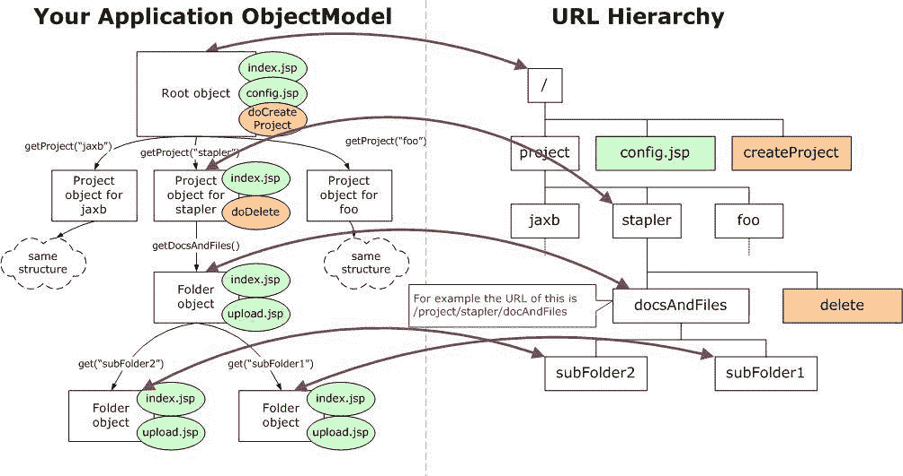
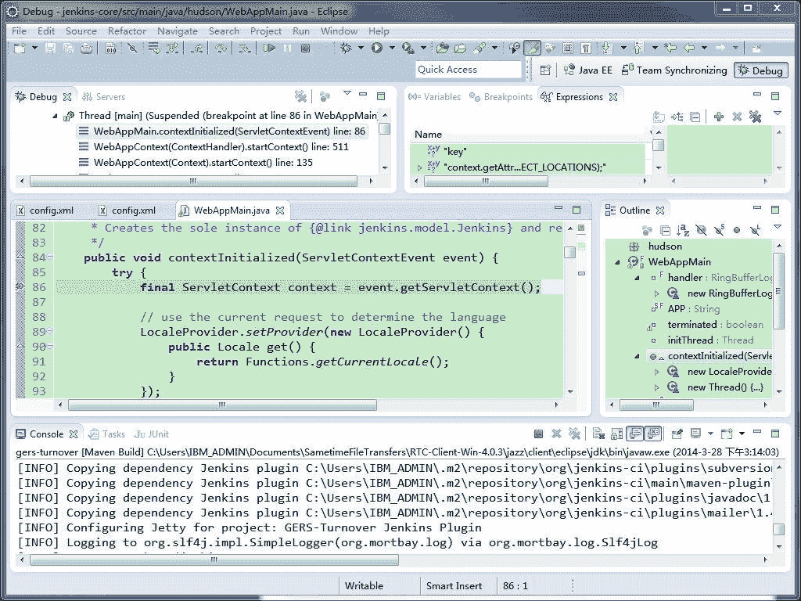
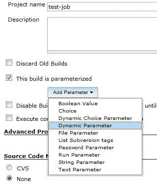
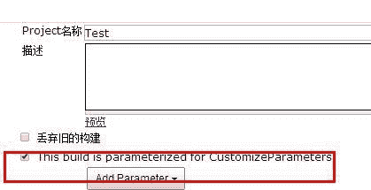
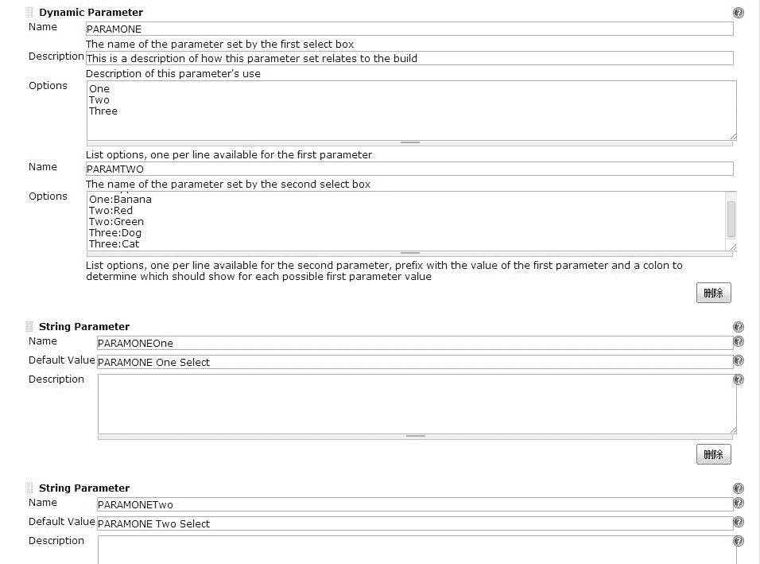

# 浅析 Jenkins 插件开发

> 原文：[`developer.ibm.com/zh/articles/j-lo-jenkins-plugin/`](https://developer.ibm.com/zh/articles/j-lo-jenkins-plugin/)

## Jenkins 概述

Jenkins，简单的说就是一个开源的持续集成服务器，是 Hudson 的继续。Jenkins 提供了易于使用的持续集成系统，使开发者更专注于业务逻辑的实现。Jenkins 能实时监控集成过程中的问题，提供详细的日志信息，还能以图表的形式显示项目构建的情况。

Jenkins 提供了丰富的管理和配置功能，如下图所示，包括系统设置，插件管理，系统信息，系统日志，负载统计，节点管理等功能。

##### 图 1\. Jenkins 的系统管理


## Jenkins 架构

### Stapler

Stapler 是一个将应用程序对象和 URL 装订在一起的 lib 库，使编写 web 应用程序更加方便。Stapler 的核心思想是自动为应用程序对象绑定 URL，并创建直观的 URL 层次结构。

下图显示了 Stapler 的工作原理：

##### 图 2\. Stapler 工作原理



上图左边显示了应用程序的代码信息，右边显示了 URL 的层次结构。通过反射机制，Stapler 可以将 URL 绑定到应用程序对象。比如说，应用程序的根对象对应 URL 的根 “/”。通过 getProject(“stapler”) 方法访问的对象将分派给 URL “/project/stapler”。通过这种方式，应用程序对象模型就直接转化为 URL 的层次结构, 如图中紫色箭头所示。

Jenkins 的类对象和 URL 绑定就是通过 Stapler 来实现的。Hudson 实例作为 root 对象绑定到 URL“/”，其余部分则根据对象的可达性来绑定。例如 Hudson 有一个 getJob(String) 方法，那么根据上图的介绍，可以知道 URL“/job/foo/” 将绑定到 Hudson.getJob(“foo”) 返回的对象。

### 持久化

Jenkins 使用文件来存储数据（所有数据都存储在$JENKINS_HOME）。有些数据，比如 console 输出，会作为文本文件存储；有些数据则会像 Java 配置文件格式一样存储；大多数的结构数据，如一个项目的配置或构建（build）记录信息则会通过 XStream 持久化，实际如图 3 所示。从图中可以看到 Jenkins 把一个 Job 的所有构建记录都通过 XStream 记录下来。

##### 图 3\. Jenkins 构建记录


### 插件

Jenkins 的对象模型是可扩展的，通过 Jenkins 提供的可扩展点，我们可以开发插件扩展 Jenkins 的功能。到目前为止，Jenkins 已经支持超过 600 个插件，这些插件支持的功能涵盖了软件配置管理 (SCM)、软件测试、通知 (Notification)、报表等方面。

Jenkins 通过单独的类加载器加载每个插件以避免插件之间产生冲突。插件就像 Jenkins 内置的其他类一样参与到系统的活动中。另外，插件可以通过 XStream 持久化，可以由 Jelly 提供视图技术，可以提供图片等静态资源，插件中所有的功能可以无缝的加入到 Jenkins 内置的功能上。

## Jenkins 源代码调试和浅析

### 源码调试

要开发 Jenkins 插件必然离不开 Jenkins 源代码调试。Jenkins 官方网站上提供了源代码调试方式。笔者尝试过该方法，不过不幸的是一直没有成功，如果有读者成功过，欢迎指导。在这里，笔者采取了一个变通的方式来调试 Jenkins 源代码。

1.  检出 jenkins-core 项目到本地，然后 import 到 Eclipse 中；
2.  参考 Jenkins 官方插件开发入门文档，在 Eclipse 上新建插件项目；
3.  在 jenkins-core 项目中添加断点；
4.  选择新建的插件项目右键，选择 “Debug Configurations”，在 Source 中添加第一步的 jenkins-core 项目，如图 4 所示：

##### 图 4\. Debug Configurations 中 Source 的配置


如此配置后，启动插件项目，这时 Eclipse 会启动 Jenkins，之后就会进入第 3 步设置的断点处，如下图所示：

##### 图 5\. Jenkins-core 调试



### 源码浅析

Jenkins 代码的入口是如图 5 右边所示的 WebAppMain 类，位于 hudson(package) 下面。

##### 清单 1\. WebAppMain.java

```
package hudson;
 ...
 public final class WebAppMain implements ServletContextListener {
 ...
 public void contextInitialized(ServletContextEvent event) {
 ...
 initThread = new Thread("hudson initialization thread") {
 @Override
 public void run() {
 boolean success = false;
 try {
 Jenkins instance = new Hudson(home, context);
 context.setAttribute(APP, instance);

 // at this point we are open for business and serving requests normally
 LOGGER.info("Jenkins is fully up and running");
 success = true;
 } catch (Error e) {
 LOGGER.log(Level.SEVERE, "Failed to initialize Jenkins",e);
 context.setAttribute(APP,new HudsonFailedToLoad(e));
 throw e;
 } catch (Exception e) {
 LOGGER.log(Level.SEVERE, "Failed to initialize Jenkins",e);
 context.setAttribute(APP,new HudsonFailedToLoad(e));
 } finally {
 Jenkins instance = Jenkins.getInstance();
 if(!success && instance!=null)
 instance.cleanUp();
 }
 }
 };
 initThread.start();
 ...
 }
 ...
 public void contextDestroyed(ServletContextEvent event) {
 terminated = true;
 Jenkins instance = Jenkins.getInstance();
 if(instance!=null)
 instance.cleanUp();
 Thread t = initThread;
 if (t!=null)
 t.interrupt();
 }
 ..
} 
```

由以上清单可以看到，类 WebAppMain 实现了 ServletContextListener 接口。该接口的作用主要是监听 ServletContext 对象的生命周期。当 Servlet 容器启动或终止 Web 应用时，会触发 ServletContextEvent 事件，该事件由 ServletContextListener 来处理。此外，ServletContextListener 接口还定义了两个方法，contextInitialized 和 contextDestroyed。通过方法名，我们可以看到这两个方法中一个是启动时候调用 (contextInitialized)，一个是终止的时候调用 (contextDestroyed)。

类中通过 contextInitialized 方法初始化了一个 Jenkins 对象。如清单 1 所示，在 Servlet 容器初始化的时候，Jenkins 对象会交由 WebAppMain 的 initTread 线程创建。

## 插件分析

Jenkins 支持的插件有很多 (请参考 Jenkins 插件介绍，了解具体支持的插件类型)。分析现有插件源码是学习 Jenkins 插件开发一种非常好的途径，所以在介绍实际插件开发之前，先来分析下笔者使用过的 Dynamic Jenkins Parameters 插件（感兴趣的读者可以到 Jenkins 官网上下载这个插件的源代码）。

该插件的主要作用是在 Jenkins 构建页面上提供了一个动态参数。每次构建被触发时，参数中配置的 Groovy 脚本将被调用，动态生成参数值。该插件支持两种类型的参数：简单的文本输入参数和下拉选择框参数。如果是简单文本输入框参数，则 Groovy 脚本必须返回一个字符串才能在构建页面正确显示。如果是下拉选择框参数，则脚本必须返回一个字符串列表。

清单 2 列出了 Danymic Parameter 插件中一个非常重要的类 DanaymicParameter.java. 从这个类可以看到，它继承了 ParameterDefinition 类。ParameterDefinition 是 Jenkins 中的构建参数定义类，所有 Jenkins 构建参数插件开发都需要继承这个类。

##### 清单 2\. DynamicParameter.java

```
public class DynamicParameter extends ParameterDefinition {
 ...
 @Extension
 public static final class DescriptorImpl extends ParameterDescriptor {
 ...
 public ListBoxModel doFillValueItems(@QueryParameter String name) {
 ...
 }
 public ListBoxModel doFillDynamicValueItems(@QueryParameter String name,
@QueryParameter String value) {
 ...
 }
 }
 ...
} 
```

ParameterDefinition 类对应于 Jenkins 配置 Job 时的 Parameter 选项。因为 DynamicParameter 继承了 ParameterDefinition，所以就会在 Jenkins 的 Job 配置页面的 Add Parameter 下拉框中看到这个插件，如下图所示：

##### 图 6\. Job 配置-Dynamic Parameter



我们看到 DynamicParameter 类里面有个内部类：DescriptorImpl。内部类里面有如清单 2 所示的几个方法 doFillValueItems 和 doFillDanymicValueItems。笔者在调试的时候发现，第一个参数 Value 的改动会触发第二个参数 DynamicValue 选项的变动，为什么会这样？为什么 DescriptorImpl 内部类中的方法名必须是 doFill+参数名+Item 的形式？带着这些问题，我们接下来看看 DynamicParameter 中的 index.jelly 文件。

##### 清单 3\. Index.jelly

```
<f:entry title="${it.name} " description="${it.description}">
 <div name="parameter" description="${it.description}">
 <j:set var="instance" value="${it}" />
 <j:set var="descriptor" value="${it.descriptor}" />

 <input type="hidden" name="name" value="${it.name}" />
 <input type="hidden" name="secondName" value="${it.secondName}" />

 <f:select id="select1" field="value" default="" title="${it.name}" tooltip="${it.tips1}" /><br /> <br />

 ${it.secondName}<br /> <br />
 <f:select id="select2" field="dynamicValue" title="${it.secondName}" tooltip="${it.tips2}" /><br />

 </div>
</f:entry> 
```

从这个文件中可以看到，参数 value 和 dynamicValue 的类型是 f:select，所以我们去找 select.jelly。

##### 清单 4\. Select.jelly

```
${descriptor.calcFillSettings(field,attrs)}
    <!-- this figures out the 'fillUrl' and 'fillDependsOn' attribute --> 
```

从 select.jelly 中会发现调用 descriptor 的 calcFillSettings 方法，descriptor 其实就是 DynamicParameter 的内部类 DescriptorImpl。通过 DescriptorImpl 的抽象父类 Descriptor 可以找到对应的 calcFillSettings 方法，清单如下：

##### 清单 5\. Descriptor.java

```
public void calcFillSettings(String field, Map<String,Object> attributes) {
 String capitalizedFieldName = StringUtils.capitalize(field);
 String methodName = "doFill" + capitalizedFieldName + "Items";
 Method method = ReflectionUtils.getPublicMethodNamed(getClass(), methodName);
 if(method==null)
 throw new IllegalStateException(......);

 // build query parameter line by figuring out what should be submitted
 List<String> depends = buildFillDependencies(method, new ArrayList<String>());

 if (!depends.isEmpty())
 attributes.put("fillDependsOn",Util.join(depends," "));
 attributes.put("fillUrl", String.format("%s/%s/fill%sItems",
getCurrentDescriptorByNameUrl(), getDescriptorUrl(), capitalizedFieldName));
 } 
```

由清单 5 我们已经知道为什么 DescriptorImpl 类中的方法名必须是 doFill+参数名+Items 的形式了。

## 插件实战

学习了 DanymicParameter 这个构建参数插件后，接下来我们可以尝试开发一个 Jenkins 插件。

### 需求描述

该项目在构建中需要若干个参数（Jenkins 的带参构建可以实现），其中有些参数存在依赖关系，比如说有四个参数，A、B、C 和 D。当参数 A 选择某个值，比如 Options1 时，参数 B 的选项为 [1, 2, 3]，同时参数 C 显示，参数 D 隐藏；当参数 A 选择 Option2 的时候，参数 B 的选项为 [4, 5, 6]，同时参数 C 隐藏，参数 D 显示。

### 插件开发

通过调查可知，Jenkins 无法实现如上的需求，也找不到一种替代的方法。于是，我们不得不开发自己的插件，实现对 Jenkins 的定制化。另外，我们也会发现不能简单的通过上面提到的参数插件的方式来实现这个需求。这个时候我们需要深入了解下 Jenkins 的构建原理。

打开 Jenkins，新建一个测试 Job Test1。可以看到页面中“立即构建”的 URL，如图 7 的下部紫色区域所示：

##### 图 7\. Job-构建


通过上图所示的 URL，我们可以找到对应的抽象类-AbstractProject（在 package hudson.model 下面）的 doBuild 方法，如下：

##### 清单 6\. AbstractProject.java

```
public void doBuild( StaplerRequest req, StaplerResponse rsp, @QueryParameter
TimeDuration delay ) throws IOException, ServletException {
 ...
 ParametersDefinitionProperty pp = getProperty(ParametersDefinitionProperty.class);
 if (pp != null && !req.getMethod().equals("POST")) {
 req.getView(pp, "index.jelly").forward(req, rsp);
 return;
 }
 ...
 if (pp != null) {
 pp._doBuild(req,rsp,delay);
 return;
 }
 ...
 } 
```

通过清单 6，会发现图 7 所示的 URL 会交由 ParametersDefinitionProperty 的 index.jelly 显示。

查看该 jelly 文件发现它会遍历每个 ParameterDefinition（通过上面章节的介绍可知，每个 ParameterDefinition 实际上就是一个构建参数），然后一一显示。

我们回到实际需求，需求里面要求控制构建参数，所以我们可以继承 ParametersDefinitionProperty，并通过在 index.jelly 中加入 JS 的方式来达到参数之间的依赖关系。

可以参考 [示例代码](https://github.com/qinganw/customize-parameter) ，效果见下图。

##### 图 8\. Customize Parameters-配置



从图 8 可以看到，我们开发了一个 Jenkins 构建插件，于是在 Job 的配置页面多了一个红框中标记的配置项。

##### 图 9\. Customize Parameters-参数项



现在我们配置 4 个构建参数，分别是 PARAMONE, PARAMTWO, PARAMONEOne 和 PARAMONETwo。其中 PARAMONE 有三个选项：One, Two 和 Three；PARAMTWO 有六组选项：One:Apple, One:Banana, Two:Red, Two:Green, Three:Dog, Three:Cat。

当 PARAMONE 为 One 时，PARAMTWO 的选项为 Apple 和 Banana，同时 PARAMONEOne 显示，PARAMONETwo 隐藏；当 PARAMONE 为 Two 时，PARAMTWO 选项为 Red 和 Green，同时 PARAMONEOne 隐藏，PARAMONETwo 显示；当 PARAMONE 为 Three 时，PARAMTWO 选项为 Dog 和 Cat，同时 PARAMONEOne 和 PARAMONETwo 都隐藏。

##### 图 10\. Customize Parameters-效果展示 1


##### 图 11\. Customize Parameters-效果展示 2


##### 图 12\. Customize Parameters-效果展示 3


### 遇到的问题

实际开发过程中遇到过不少问题，以下列几个比较典型的，希望能给读者一些参考。

**插件安装后，在 Jenkins 页面找不到**

这个问题经常会遇到，笔者采取的做法是删除 plugin 目录下安装的插件，一般包括一个以插件名命名的 jpi 文件和文件夹。全部删除后，回到 Eclipse，运行 mvn clean，清空打包过程中残留的文件，再重新打包安装。这个时候就能在 Jenkins 上找到你的插件了。

**无法在构建过程中获取参数值**

这个问题主要发生在定制化的参数插件中。当 Jenkins 构建 Job 页面配置完自己开发的参数插件后，发现有时候无法从构建脚本获取参数值。出现这种问题一般有两个原因：

1.  构建脚本中没有引入系统的环境变量。Jenkins 的所有构建参数在构建时都会被放入系统的环境变量中，所以构建脚本需要引入系统环境变量，才能读取构建参数。比如参数名为 MyParameter，则我们需要在脚本中通过<property environment="env">引入环境变量以后，然后才能通过 {env.MyParameter} 使用构建参数，或者是其他环境变量。</property>
2.  插件开发时没有把参数放入环境变量。参数插件中定义的参数只要被加入环境变量，构建过程中通过 1 中的方法才能读取参数值。具体实现请参考清单 7。

##### 清单 7\. AbstractProject.java

```
public void doBuild( StaplerRequest req, StaplerResponse rsp, @QueryParameter
TimeDuration delay ) throws IOException, ServletException {
 ...
 ParametersDefinitionProperty pp = getProperty(ParametersDefinitionProperty.class);
 if (pp != null && !req.getMethod().equals("POST")) {
 req.getView(pp, "index.jelly").forward(req, rsp);
 return;
 }
 ...
 if (pp != null) {
 pp._doBuild(req,rsp,delay);
 return;
 }
 ...
 } 
```

**构建参数无法验证**

Jenkins 虽然支持带参构建，但是却无法验证所填参数的正确性，因此经常出现因为用户填写参数不正确而导致构建失败的情况。为了提高用户体验感，同时减少构建平均时间，笔者所在的团队需要对 Jenkins 进行定制，实现参数验证功能。

当时对 Jenkins 还不熟，解决这个问题花了不少时间。最后通过研究 Jenkins 源码发现，其实 Jenkins 的构建功能也是一个插件，既然如此，那我们可以定制一个构建插件，在这个插件的 index.jelly 中引入 JS 代码实现参数验证。

**浏览器兼容**

Jenkins 本身对 Chrome 和 Firefox 的兼容性比较好，而对 IE 的兼容性则较差。笔者在定制 Jenkins 的过程中，也深受浏览器兼容问题困扰。

由于最初开发使用的是原生的 JS，没有花多少精力处理浏览器兼容问题，导致所有用户只能使用某个浏览器，给用户造成一定程度的不便。后来经过研究发现，Jenkins 本身使用的是 jQuery 框架。如此，我们在实际开发中，可以使用该框架，就不用自己花大量时间和精力用原生 JS 来解决浏览器问题。

## 结束语

本文从 Jenkins 概述开始，介绍了 Jenkins 的架构，通过架构的描述，相信读者对 Jenkins 有了基本的认识和理解。接着笔者介绍了 Jenkins 的调试方法，简单介绍了 Jenkins 代码的入口，读者可以从这里开始，深入了解 Jenkins 里面的模块和内容。然后笔者通过分析 Dynamic Parameter 插件的流程，结合笔者的实际项目，开发了插件 Customze Parameters。最后列举了几个在 Jenkins 开发过程中遇到的比较典型的问题和处理办法供读者参考。Jenkins 插件开发远不止这些内容，希望在进一步的学习和应用中能继续与大家分享。

最后，特别感谢汪清安。他在 IBM 实习期间，曾帮助我们团队花时间研究 Jenkins 插件开发。文中一些观点和结论的得出，离不开他的辛勤努力。