# 集成 Jenkins 和 TestNG 实现自助式自动化测试平台

> 原文：[`developer.ibm.com/zh/articles/os-autotesting-jenkins-testing/`](https://developer.ibm.com/zh/articles/os-autotesting-jenkins-testing/)

## 背景介绍

在软件业十分成熟的今天，敏捷（Agile）开发在业界日益流行，而面临的挑战也日益增多，不断变化的用户需求、缩短的开发周期、频繁的部署上线、复杂的产品架构和团队组织，如何继续保证软件的质量是一个不能回避的课题。

许多企业级规模的项目常常按照功能模块将庞大的团队分为多个独立的 Scrum 团队。在这种情况下，每个 Scrum 团队各自负责其所属功能模块的开发和测试。在 Scrum 团队中各种角色在不同的时间点有针对性不同的测试需求。其次，Build 部署以及测试频率大幅增加。测试类型和阶段也更加细化。

而现有的自动化测试，常常由独立的自动化测试团队来执行和维护。其他的 Scrum 团队成员除非十分了解自动化测试包的细节，否则无法按照自身多类型的测试需求来执行自动化脚本。并且有些项目自动化测试包涵盖了成百上千的测试用例，仅仅因为需要验证某个模块或某几个功能点是否成功而执行整个测试包不仅费时且没有必要。

本文针对以上涉及的问题，提出以下的解决方案：利用 Jenkins 和 TestNG 搭建”自助式”自动化测试平台，充分利用了 Jenkins 成熟的平台及其插件, 以及 TestNG 对选择测试用例的内在支持。

该平台具有以下优点：

*   基于成熟的测试工具。Jenkins 是目前业内最流行的快速持续集成工具之一, 其稳定的性能和丰富的扩展性, 使得很多的团队都优先选择它作为项目的主要支持工具。TestNG 作为一款强大的 Java 测试框架，其在 Junit，NUnit 的基础上做了广泛的增强，从单元测试、功能测试到集成测试，都能提供良好的支持。这两个工具一方面功能稳定，有大量的实际使用案例和文档支持，另一方面由于其属于主流工具，很多团队已经有过相应的经验，可以大大缩短学习曲线和成本。
*   灵活地定制自动化测试。团队成员通过登陆平台 Web 界面，按照需求任意选择部署在平台上的自动化测试包，目标测试环境，测试集和测试用例。提交定制化的自动化执行请求，执行结束系统自动发邮件通知。不同人员的请求可以实现并行执行。
*   所有的自动化执行历史记录都可以保存在平台上。可以通过 Web 的方式随时查阅。
*   Jenkins 支持丰富的插件，用户可以按照需求进行选择安装和配置，以实现生成执行状态表格，自动部署/更新自动化测试包等高级功能。

## 方案设计概述

本文将使用一个简化后的“自助式”自动化测试应用场景以介绍本方案的核心设计思想。首先列举出该平台需要满足的各项需求：

*   用户权限管理，用户可以使用自己的帐号进行登陆访问，提交请求。
*   用户根据自身的具体需求，灵活的选择已经部署在平台上的自动化测试包，并且可以对测试环境，测试集和测试用例进行定制化选择。
*   多用户并发请求的执行，彼此之间相互独立，互不干扰
*   请求执行完毕后的 email 通知
*   执行状态和历史纪录的查询
*   用户体验良好的 Web 页面访问模式

针对以上的需求，我们可以用图 1 来简要说明该方案的主要功能组件以及彼此之间的联系。

##### 图 1\. 平台主要功能组件

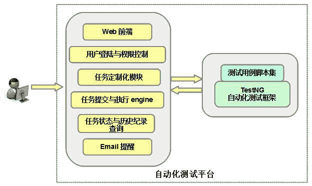

**Web 前端** ：Jenkins 平台自身提供一套统一标准的 web 界面，用户可以根据需求通过其完成各种系统配置，任务提交，查询等工作。

**用户登录与权限控制** ：Jenkins 平台默认支持若干种用户验证机制，比如 LDAP, Jenkins own database, servlet container authenticate 等等，也可以通过其它插件实现更加复杂的验证。本文将采用最简单的 Jenkins own database 来管理帐户的权限。

**任务请求定制化模块** ：一般来说，Jenkins 大部分情况下只需要完成预定义执行内容的任务。所以在参数定制化请求方面只具备最基本的支持。为了满足更好的”自助式”的用户体验和需求，实现预定义任务对不同用户需求的灵活响应，我们在还需要借助一款 Jenkins 插件”Extended Choice Parameter plugin”的辅助。利用该插件，用户可以在提交请求时在页面上输入多选式参数，这些动态输入将以环境变量的形式传递给执行模块影响最终请求的行为。

**任务提交与执行模块** ：Jenkins 支持稳定的任务管理机制，管理员可以通过配置使同一个任务支持并发响应多个请求，彼此之间独立且互不干扰。

**任务状态与历史纪录查询** ：对于任务请求的状态信息跟踪，Jenkins 默认只支持控制台输出的监控，而且每一次请求记录，Jenkins 只提供一个数字 ID 和时间戳进行标识。对于一个多用户的自助式平台这是远远不够的。我们利用插件 “HTML Publisher Plugin”，保存请求生成的 html 格式的运行报告。这样可以在页面上对任意历史请求的执行纪录和报告进行查询和检索；同时利用 “EnvInject Plugin”，“Build User Vars Plugin” 和 “Build Name Setter Plugin” 为每一次请求动态生成包含用户姓名等多方面信息的 ID 以区分，大大方便信息的管理和测试结果数据的追溯。

**Email 提醒：** Jenkins 默认只支持最基本的 email 通知机制。我们使用插件 “Email-ext plugin”进行扩展，以支持更加强大的通知机制，灵活定制 email 标题和内容, 添加附件，定制收件人名单等。

**TestNG 自动化测试框架** ：TestNG 是一款强大的自动化测试框架，适用于 Unit 测试，功能测试，集成测试等多类型的自动化测试。其拥有一整套成熟的 API 和 Annotation, 支持数据驱动，测试周期和依赖控制，多线程执行等一系列特性。本方案采用 TestNG 还因为其具有对测试脚本集进行灵活选择的特性。TestNG 利用 xml 文件来组织测试脚本集，在运行的时候，我们可以通过参数指定需要运行的脚本，把 Jenkins 任务与建立在这一框架之上的自动化测试包进行连接，就可以轻松实现用户在页面上选择测试集。

## 平台的实现与配置

本章介绍该平台具体的实现和配置流程，主要包含以下步骤：

1.  安装 Jenkins 及必要的第三方插件
2.  建立新用户及配置权限
3.  为自动化测试建立和配置新任务

    1.  配置用户输入定制化选项
    2.  配置执行报告保存
    3.  配置 email 提醒

Jenkins 及相关插件的安装 (本文以 jenkins-ver.1.524 为例)

Jenkins 是一款成熟强大的开源软件，对大部分主流的操作系统平台（Linux，Windows, Mac OS）都提供支持，在其官方网站上可以直接下载到最新的安装包和每一个平台的安装流程文档。

安装完毕之后，我们可以以后台服务的形式将其启动，这个时候我们就可以用浏览器通过 `http://localhost:8080` 访问其默认主页面进行平台定制化配置。

##### 图 2.Jenkins 主页面


初始安装后的 Jenkins 并没有默认管理员帐户，第一次打开主页面就可以直接对其进行系统配置，在页面的左端可以通过点击 “Manage Jenkins” 打开 Jenkins 系统管理界面。

##### 图 3.Jenkins 管理界面

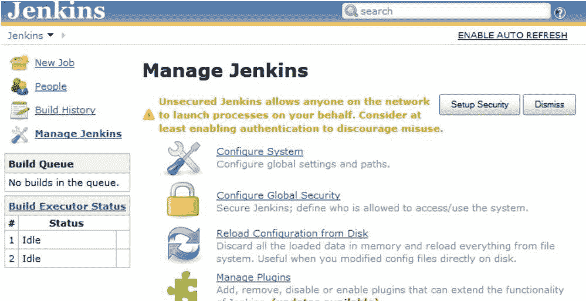

我们可以通过”Manage Plugins”来安装第三方插件。其中本方案建议安装的六个插件分别是 “Extended Choice Parameter plugin”，“EnvInject Plugin”，“Build User Vars Plugin”，“Build Name Setter Plugin”，“HTML Publisher Plugin” 和 “Email-ext plugin”。

##### 图 4.Jenkins 插件管理


安装插件的方法十分简单，在 “Manage Plugins” 页面的 “Available” 选项卡中，勾选所需要的目标插件，点击页面下方的相应安装按钮即可。

新建用户和配置权限

前面我们提到 Jenkins 在初次安装时默认并没有用户验证的环节，所有打开主页面的用户都具有系统管理员权限。对于一个要在正式项目中被整个团队所公用的测试平台，我们需要严格的建立用户验证和权限配置。

首先在 “Manage Jenkins ->Configure Global Security” 页面中勾选 “Enable security”。页面刷新之后在 “Security Realm” 项选择 “Jenkins’ own user database”,“Authorization” 项选择 “Matrix-based security”，同时暂时赋给 Anonymous”Overall Admin” 权限. 每一个项目也可以根据自身的需要选择其它的认证方式。

##### 图 5\. 安全管理

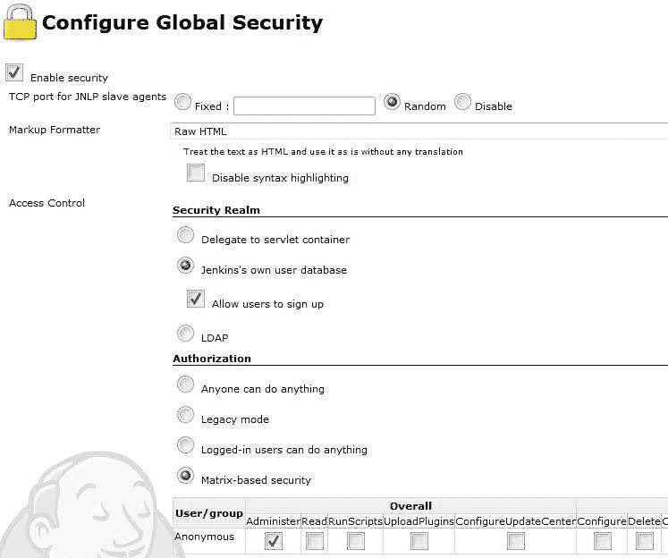

保存设置之后，回到 Jenkins 主页面，此时我们点击右上角 sign up 链接可以进入创建用户页面，输入新建用户的基本信息。通过这种方式可以为需要使用该平台的所有成员创建属于他们自己的专用账号。

##### 图 6\. 帐号创建

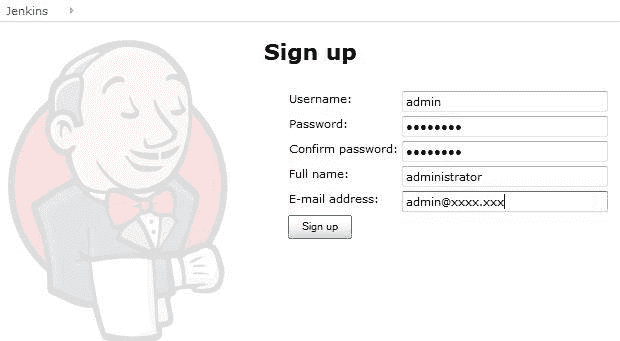

新建账号完毕之后，用专门为管理员创建的账号重新登陆，再次进入 “Manage Jenkins ->Configure Global Security”，为我们刚才创建的团队成员账号设置权限，同时禁用 Anonymous 的所有权限，具体方式如图 7 所示，保存之后即可生效。

##### 图 7\. 权限配置


为自动化测试建立和配置新任务。当以上工作都准备完毕之后，就可以开始在 Jenkins 平台上为自动化测试创建新的任务。首先在主界面的左上方点击 “New Job”, 选择 “Build a free-style software project” 类型，并且提供一个合适的任务名如 “ProjectA RESTAPI automation”。

##### 图 8\. 新 Job 创建


点击 OK 之后就可以开始对 Job 内容进行定义和配置。传统的 Jenkins 平台应用主要集中在持续集成（CI）领域，所以在配置页面提供了大量的关于源代码获取，Build 创建等传统配置选项。而本文从全新的角度利用 Jenkins 平台的特性搭建自助式平台，基于篇幅所限，这里只介绍和本方案相关的主要配置项。

首先，为了让自动化任务在提交请求的时候都能够接收不同用户的选择，我们需要勾选 “This build is parameterized”。在接下来的 “Add Parameter” 下拉菜单中，Jenkins 提供多种类型的用户输入，在这里我们选择 “Extended Choice Parameter” (这是由上文中提到的插件 “Extended Choice Parameter plugin” 新增出的支持类型)，同时 Jenkins 每一个 Job 支持多个用户输入选项，并且彼此之间可以属于不同类型，管理员可以根据项目需要进行灵活搭配。

##### 图 9\. 参数化配置

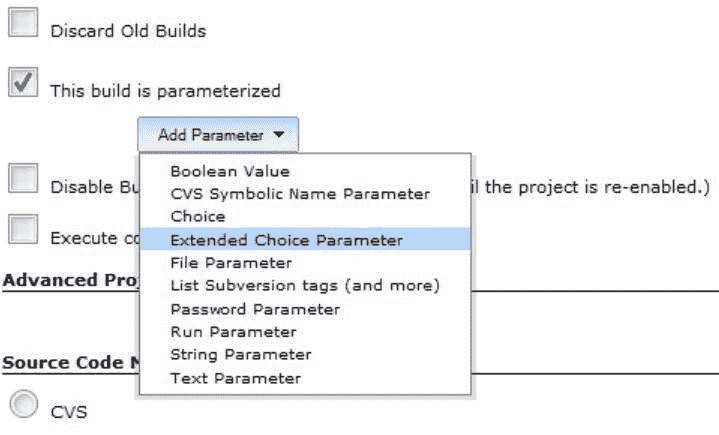

在这里为了简单起见，本文新建了两个参数化输入选项以说明问题。其中第一个为单选项，提供用户对目标测试环境的选择，另一个为多选项，提供对具体测试用例的选择。每一个输入项在配置时需要提供唯一标识的名字, 不仅会显示在输入页面上，同时用户提交请求时真实的输入将会以同样命名的环境变量的形式传递给具体的执行脚本。其次对于备选项列表的配置，系统提供两种方式。第一种是直接在 “Value” 项中提供所有备选项的列表，并以逗号隔开（如图 10 中对环境选项 ENVIRONMENT 的配置），另一种是当备选列表比较长的时候我们可以以文件的形式来提供（如图 11 中对测试用例 SELECTED_TESTCASE 选项的配置）。备选列表文件的内容格式如清单 1 所示：

##### 清单 1\. SELECTED_TESTCASE 选项的备选列表文件内容

```
TestCase = Testcase1,Testcase2,\
Testcase3 
```

备选选项列表以文件形式提供的好处之一是我们可以自己设计脚本来自动生成和更新这个列表，这样当自动化测试包有更新的时候我们并不需要每次都手动更新这些配置文件。同时文件的更新可以即时生效，这一点十分重要。

##### 图 10\. 单选项配置

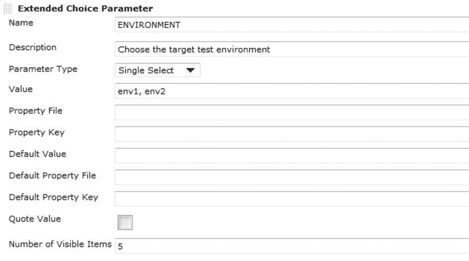

##### 图 11\. 多选项配置

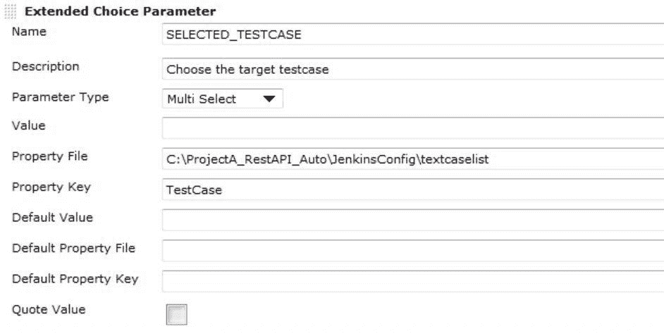

本例所示参数化配置之后，用户在提交请求时，系统将会显示如下页面以提示用户进行选择，用户可以根据需要自由的选择测试的目标环境和测试用例集合。

##### 图 12\. 参数化界面

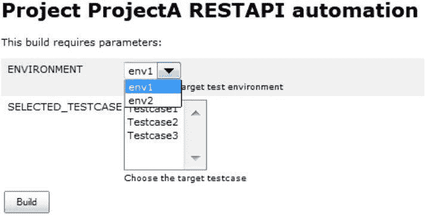

其次，如果该 Job 需要支持多人提交请求的并行执行（前提是 Job 执行的内容本身不会因为并行执行产生问题，比如每个请求都需要独占某个仅有的目标资源等），我们可以勾选 “Execute concurrent builds if necessary”，同时我们需要考虑 Jenkins 所在服务器本身的配置和负荷能力。

##### 图 13\. 并行配置


同时，每一个来自不同用户的请求在系统中都会产生唯一的 ID 和时间戳以标示，但是这些信息并不足以让我们了解该请求的具体内容和发起人，可读性是很差的。为了更方便阅读和管理过往的记录，在此可以为每一个请求动态生成包含多种可识别信息的名字。我们利用 “EnvInject Plugin”，“Build User Vars Plugin”和 “Build Name Setter Plugin” 三个插件以实现为不同请求定制如图 14 所示的名字。(Jenkins 自身提供部分系统环境变量如 BUILD_NUMBER, 之前为选择目标测试环境而配置的用户输入提供了环境变量 ENVIRONMENT，“Build User Vars Plugin” 插件为我们提供了请求发起人的用户名信息 BUILD_USER)

##### 图 14\. 请求命名 ID 的配置


通过以上的配置，不同用户请求的历史记录将更加易于查询和管理，如图 15 所示

##### 图 15\. 历史记录


紧接着就是通过配置 “Build Step” 来定义每次请求具体的执行内容，Jenkins 提供 Windows batch, shell, Ant, Maven 四种方式调用外部的命令和脚本

##### 图 16.Build Step

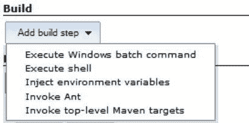

我们将在 build step 的命令中调用基于 TestNG 框架的自动化测试包。TestNG 是利用一种特殊格式的 XML 文件来定义测试用例集合的，称之为测试套件文件。假定我们项目的自动化测试包有一个包含三个 test 的测试套件 projectARestAPISuite.xml，如清单 2 所示，它所包含 test 的名字（test name 属性）分别为 Testcase1,Testcase2,Testcase3。

##### 清单 2\. TestNG 测试套件文件 projectARestAPISuite.xml

```
<suite name="Project A RestAPI automation suite">
 <test name="Testcase1">
 <classes>
 <class name="tests.Testcase1" />
 </classes>
</test>
<test name="Testcase2">
 <classes>
 <class name="tests.Testcase2" />
 </classes>
</test>
<test name="Testcase3">
 <classes>
 <class name="tests.Testcase3" />
 </classes>
</test>
</suite> 
```

那么就可以用下面的命令集来定义 build step, 在此处巧妙地利用了 TestNG 启动命令的两个重要选项：

-testname 接受以逗号隔开的 test name 列表，脚本运行时 suite xml 中只有-testname 选项列表里指定了的 test 才会被执行。而上文当中用户在提交请求时在定制页面上实际选择（多选）的测试集合恰恰会以逗号隔开的方式传递给 SELECTED_TESTCASE 环境变量，我们正是通过这种方式达到用户自由选择 case 执行的目的。

-d 指定 TestNG 默认 report 生成的路径。因为不同用户可能存在并行执行的请求，为了防止冲突，每一个请求的 report 会生成在以环境变量 BUILD_ID 命名的目录下，BUILD_ID 可以唯一标示不同的请求。

而前面的另一个用户输入 ENVIRONMENT 也可以以环境变量的形式被自动化脚本所读取，根据用户的不同输入做出不同的响应。

##### 图 17.Build 命令


-testname 只是 TestNG 支持定制化选择的其中一个选项，除此之外还支持包括-groups，-methods，-testclass 等多种选择方式，用户可以根据项目的需要灵活使用，具体方法可以参照 TestNG 的官方帮助文档。

脚本执行完毕之后，接下来就需要归档生成的测试报告。这里采用了插件 “HTML Publisher Plugin” 新增的配置选项。首先在 “Add post-build action” 中选择 “Publish HTML reports”，指定每一个请求所生成的 HTML 报告的路径和文件名, 勾选 “Keep past HTML reports”, 这样就可以在历史记录的快捷菜单中轻松的查询过往请求的执行报告了。

##### 图 18\. 报告发布

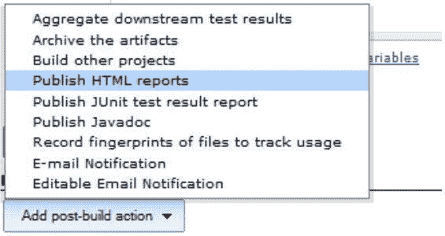

##### 图 19\. 报告路径和配置


##### 图 20\. 报告查询

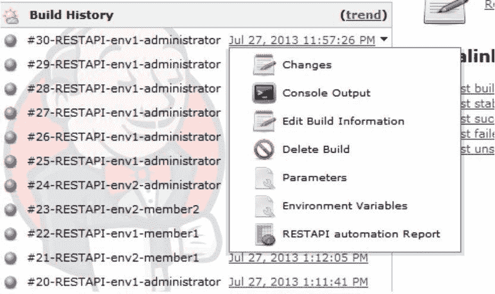

最后，因为该平台是提供给整个团队使用的公共自助式平台，所以每一个请求执行结束后我们都希望请求发起者可以收到执行完成的 email 通知，这里我们利用 “Email-ext plugin” 新增的配置选项，在 “Add post-build action” 中选择 “Editable Email Notification”. 该插件提供丰富的 email 配置，可以利用环境变量定制 email 通知的主题，正文，添加附件等等，在高级选项中可以添加 “Trigger”。当然为了邮件可以成功的发出，还需要在 “Manage Jenkins ->Configure System” 中的 “Jenkins Location” 中为系统邮件配置一个默认邮箱地址，以及在 “E-mail Notification” 中配置一个有效的 SMTP server 地址。

##### 图 21.Email 通知配置

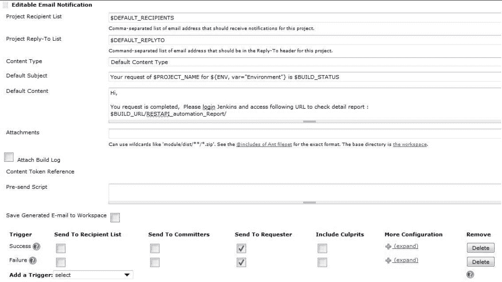

##### 图 22\. 系统发件人 Email 地址配置


##### 图 23.SMTP 配置


按照本文所介绍的内容，我们可以搭建起一个自助式的自动化平台，同时不仅仅局限于自动化测试的需要，项目团队所开发的其他自动化工具包，部署，监测，生成报告等脚本工具都可以按同样的方式部署在该平台上，让所有团队的成员都能够自由的共享使用，也更加便于管理和维护。图 24 用来表示这种全新的团队协作模式：

##### 图 24\. 协作模式


## 结束语

本文简要介绍了如何使用 Jenkins 和 TestNG 搭建一个自助式的自动化测试平台。这个平台可以让项目团队成员更加灵活和有效的使用自动化工具包完成各项工作，提高工作效率，降低管理和维护成本。